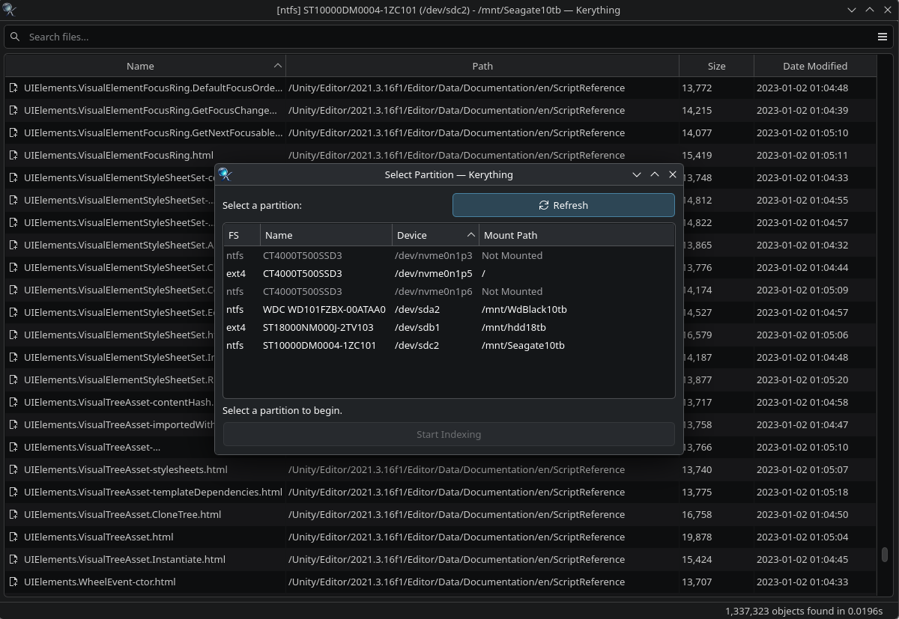

# Kerything 🔍

Kerything is a lightning-fast NTFS and EXT4 file search utility for Linux, built with C++26, Qt 6, and KDE Frameworks 6.

Inspired by the Windows utility "Everything" by Voidtools, Kerything bypasses standard directory crawling by reading the **NTFS Master File Table (MFT)** or scanning **EXT4 inodes** directly. This allows it to index millions of files per second.

The application is targeted at KDE Plasma desktop users who want a fast file search utility for their NTFS and EXT4 drives, including those who dual-boot Windows or still use NTFS hard disks on their Linux machine. 🐧✨

The name is a nod to the iconic "Everything" utility, while the 'K' prefix follows the long-standing naming tradition of the KDE community.

*Kerything is a community project and is not affiliated with Voidtools.*



## 🚀 Features

- **Blazing Fast Indexing:** (tested on 7200rpm HDDs)
  - Scans NTFS partitions at 2M+ files per second.
  - Scans EXT4 partitions at 1.2M+ files per second.
- **Offline Indexing:** Supports scanning NTFS and EXT4 partitions even when they are not mounted in Linux.
- **Instant Search:** Uses trigram indexing for real-time search results as you type.
- **Full Unicode Support:** Search for filenames containing any UTF-8 character, including international scripts, emojis and symbols.
- **Zero Bloat**:  Simple, lightning-fast keyword search. By foregoing file-content scanning, regular expressions and other complex patterns, Kerything stays lightweight and responsive.
- **Multithreaded:** Leverages Intel OneTBB for parallel trigram generation and sorting.
- **Rich Context Actions:** Right-click menu integration (similar to Dolphin) to open, copy, or manage files directly from the results. *(Note: Most context actions are only available if the drive was mounted at the time it was scanned.)*
- **Drag-and-Drop Support:** Easily copy or attach files by dragging them from the search results into Dolphin or other applications. *(Note: Currently not supported for Flatpak or other sandboxed applications due to portal limitations.)*
- **Native KDE Integration:** Built with KF6 for a consistent look and feel on KDE Plasma desktops.
- **Low Overhead:** The index is stored in memory with an emphasis on efficiency. By using string pooling (e.g., storing a folder path only once even if it contains thousands of files), Kerything maintains a surprisingly small memory footprint even for massive partitions.

## ⌨️ Keyboard Shortcuts

Kerything is designed to be usable without leaving the keyboard, following standard KDE/Dolphin conventions:

| Shortcut                | Action                                                                               |
|:------------------------|:-------------------------------------------------------------------------------------|
| `Ctrl + L` or `Alt + D` | Focus search bar and select all text                                                 |
| `Down / Up`             | Move focus from search bar to the results table                                      |
| `Return`                | Open selected file(s) with default applications                                      |
| `Ctrl + Return`         | Open the folder containing the selected file                                         |
| `Ctrl + C`              | Copy selected file(s) to clipboard (for pasting into Dolphin or another application) |
| `Ctrl + Shift + C`      | Copy selected file(s) file name(s) to clipboard                                      |
| `Ctrl + Alt + C`        | Copy selected file(s) full absolute path(s) to clipboard                             |
| `Alt + Shift + F4`      | Open your default terminal in the folder of the selected file.                       |
| `Ctrl + O`              | Change to a different partition                                                      |
| `F5`                    | Rescan the selected partition                                                        |
| `Ctrl + Q`              | Exit the application                                                                 |

## 🛠️ How It Works

Kerything operates in two parts:

1. **The Scanner Helper (`kerything-scanner-helper`):** A small C++ utility that runs via `pkexec`. It requires root privileges to access the raw block device of your NTFS/EXT4 partition to read the MFT records/inodes directly.
2. **The GUI (`kerything`):** Receives the raw file data from the helper, builds a search database using trigrams, and provides a responsive search interface. Runs in unprivileged user mode.

> [!NOTE]  
> For **NTFS partitions**, because Kerything reads the MFT directly, and because the `ntfs-3g` FUSE driver doesn't support `fanotify` or update the USN Journal on disk, live file system updates are not currently supported - simply press F5 within the application to rescan the partition and get an updated index.
> 
> For **EXT4 partitions**, real-time updates using `fanotify` are a planned feature.

## 💻 Tech Stack

- **Language:** C++26
- **GUI:** Qt 6.8+ & KDE Frameworks 6
- **Parallelism:** Intel OneTBB (Thread Building Blocks)
- **Indexing:** Trigram-based search with MFT direct-access

## 📦 Requirements

- **Frameworks:** Qt 6.x, KDE Frameworks 6 (KF6)
- **Libraries:** Intel OneTBB
- **System:** `pkexec` (Polkit) for root elevation
- **Compiler:** A C++26 compatible compiler (e.g., GCC 14+ or Clang 18+)
- **Sudo Permission:** Your user account also needs to be in a group (like `wheel`) that can use `pkexec`

## 🔨 Building and Installation

### Arch Linux

#### Dependencies

You likely already have the required dependencies installed. You can check with:

```bash
pacman -Q qt6-base kwidgetsaddons kcoreaddons solid kio kxmlgui extra-cmake-modules onetbb e2fsprogs
```

If you get any 'not found' errors, install the ones you need with:

```bash
sudo pacman -S qt6-base kwidgetsaddons kcoreaddons solid kio kxmlgui extra-cmake-modules onetbb e2fsprogs
```

#### Installation steps:

```shell
# Clone the repository
git clone --branch v1.4.0 --depth 1 https://github.com/Reikooters/kerything.git

# Enter the source code directory
cd kerything

# Build and install the package
makepkg -si -f -c
```

Enter your sudo password when prompted. The application will then be managed as a package under `pacman`.

Once installed, you can find `Kerything` in your application menu to start using it.

Manual installation is also possible:

```shell
# Clone the repository
git clone --branch v1.4.0 --depth 1 https://github.com/Reikooters/kerything.git

# Enter the source code directory
cd kerything

# Create and enter the build directory
cmake -B build -S . -DCMAKE_BUILD_TYPE=Release -DCMAKE_INSTALL_PREFIX=/usr -Wno-dev

# Compile the project
cmake --build build

# Install the project
sudo cmake --install build
```

#### Uninstallation steps:

If you installed the application using `makepkg`, the package can be uninstalled with `pacman` using the following command:

```shell
sudo pacman -R kerything
````

Otherwise, if you used the manual installation steps, the project can be uninstalled as follows:

```shell
# Enter the source code directory
cd kerything

# Uninstall the project
sudo cmake --build build --target uninstall
```

### Other Linux Distributions

The application should be compatible with most Linux distributions that support Qt 6 and KDE Frameworks 6, but I haven't tested it on any other distributions than Arch Linux.

You can follow the steps below to build and install the application manually.

#### Installation steps:

```shell
# Clone the repository
git clone --branch v1.4.0 --depth 1 https://github.com/Reikooters/kerything.git

# Enter the source code directory
cd kerything

# Create and enter the build directory
cmake -B build -S . -DCMAKE_BUILD_TYPE=Release -DCMAKE_INSTALL_PREFIX=/usr -Wno-dev

# Compile the project
cmake --build build

# Install the project
sudo cmake --install build
```

Once installed, you can find `Kerything` in your application menu to start using it.

#### Uninstallation steps:

```shell
# Enter the source code directory
cd kerything

# Uninstall the project
sudo cmake --build build --target uninstall
```

## 🤝 Contributing

Contributions are welcome! Whether it's bug reports, feature requests, or code:

1. Fork the repository.
2. Create your feature branch (`git checkout -b feature/AmazingFeature`).
3. Commit your changes (`git commit -m 'Add some AmazingFeature'`).
4. Push to the branch (`git push origin feature/AmazingFeature`).
5. Open a Pull Request.

## 🗺️ Future Plans

- **Live Updates:** Implementing `fanotify` support for EXT4 partitions to keep the index updated in real-time.

## 💖 Credits

Kerything makes use of the following excellent open-source libraries:

- **[utfcpp](https://github.com/nemtrif/utfcpp):** A simple, portable and lightweight library for handling UTF-8 encoded strings in C++.
- **[onetbb](https://github.com/oneapi-src/oneTBB):** Intel's oneAPI Threading Building Blocks library for parallelism.
- **[e2fsprogs](https://github.com/tytso/e2fsprogs):** The Linux filesystem tools used to read EXT4 partitions.

## 📜 License

This project is licensed under the **GPL-3.0-or-later** License - see the [LICENSE](LICENSE) file for details.
