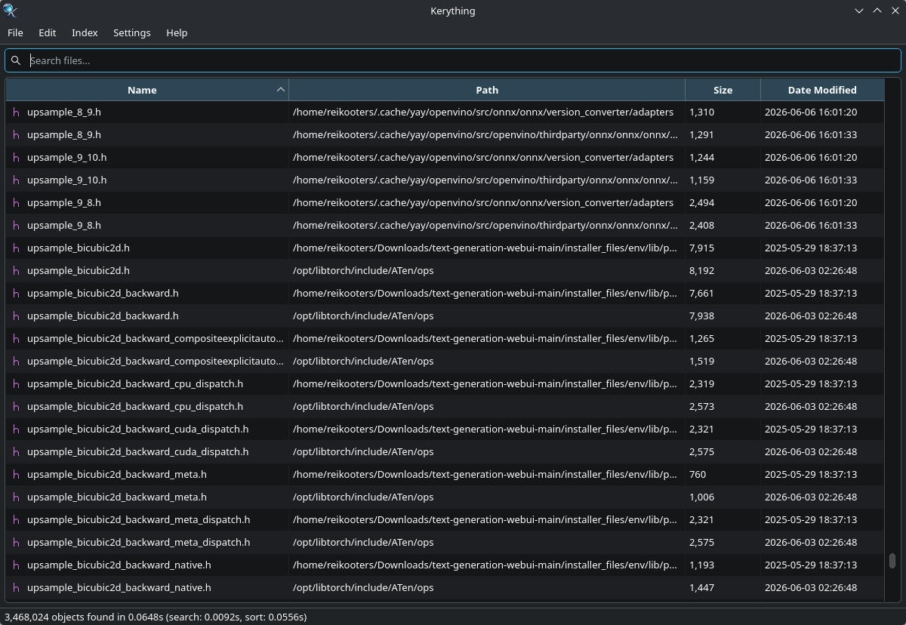

# Kerything 🔍

> [!NOTE]
> This branch contains the rewrite of the Kerything project. The code for Kerything v1 can be found in the [v1-legacy](https://github.com/Reikooters/kerything/tree/v1-legacy) branch.

Kerything is a fast Linux file search application built with C++26 and Qt 6.

Inspired by the Windows utility "Everything" by Voidtools, Kerything bypasses standard directory crawling by reading the **NTFS Master File Table (MFT)** or scanning **EXT4 inodes** directly. This allows it to quickly index supported Linux block devices and provides fast filename search using trigram indexes.

Kerything currently supports indexing the following file systems:

- EXT4
- NTFS

The name is a nod to the iconic "Everything" utility, while the 'K' prefix follows the long-standing naming tradition of the KDE community.

*Kerything is a community project and is not affiliated with Voidtools.*



## Desktop integration

Kerything can be built in two modes:

| Build mode | CMake flag | Description                                                                                                                                                 |
|---|---:|-------------------------------------------------------------------------------------------------------------------------------------------------------------|
| KDE Frameworks 6 | `-DKERYTHING_WITH_KF6=ON` | Recommended for KDE Plasma desktop users. Enables KDE integration such as richer file opening, “Show in File Manager”, “Open With”, and terminal launching. |
| Qt-only | `-DKERYTHING_WITH_KF6=OFF` | Recommended for non-KDE desktops. Uses Qt and freedesktop-compatible fallbacks where possible.                                                              |

The KDE build is recommended if you are using KDE Plasma.

## Requirements

Kerything is designed for Linux systems using `systemd`.

The backend daemon uses `libudev` to monitor block device changes, such as devices
being created, removed, plugged in, unplugged, mounted, or unmounted. Because of
this, Kerything is intended for systemd-based Linux distributions.

Kerything consists of two executables:

- `kerything` — the graphical application
- `kerythingd` — the privileged backend daemon responsible for device discovery and indexing

Kerything also installs two systemd system units:

- `kerythingd.socket` — creates the local IPC socket and starts the daemon on demand
- `kerythingd.service` — runs the backend daemon when activated by the socket

The daemon is socket-activated. This means `kerythingd.service` does not need to
be enabled to start at boot. Instead, `kerythingd.socket` should be enabled. When
the GUI connects to `/run/kerythingd/kerythingd.sock`, systemd starts the daemon
automatically if it is not already running.

The daemon exits automatically after it has had no GUI clients connected for 30
seconds. The socket remains active, so the next GUI connection starts the daemon
again.

## Features

- **Blazing Fast Indexing:** Uses low level disk partiton scanning to index devices much faster than standard directory crawling.
- **Offline Indexing:** Supports scanning NTFS and EXT4 partitions even when they are not mounted in Linux.
- **Instant Search:** Uses trigram indexing for real-time search results as you type.
- **Live EXT4 Updates:** Tracks mounted EXT4 filesystem changes in real time using Linux `fanotify`, keeping the in-memory index updated for common file operations.
- **Extension Filters:** Narrow searches by file extension using queries such as `ext:mp4` or `ext:wav;mp3`, or use saved filters from the Filter menu.
- **Full Unicode Support:** Search for filenames containing any UTF-8 character, including international scripts, emojis and symbols.
- **Zero Bloat**:  Simple, lightning-fast keyword search. By foregoing file-content scanning, regular expressions and other complex patterns, Kerything stays lightweight and responsive.
- **Multithreaded:** Leverages Intel OneTBB for parallel trigram generation and sorting.
- **Rich Context Actions:** Right-click menu integration to open, copy, or manage files directly from the results. *(Note: Most context actions are only available if the drive was mounted at the time it was scanned.)*
- **Drag-and-Drop Support:** Easily copy or attach files by dragging them from the search results into Dolphin or other applications. *(Note: Currently not supported for Flatpak or other sandboxed applications due to portal limitations.)*
- **Low Overhead:** The index is stored in memory with an emphasis on efficiency. By using string pooling (e.g., storing a folder path only once even if it contains thousands of files), Kerything maintains a surprisingly small memory footprint even for massive partitions.

> [!NOTE]
> Live file system updates are supported for mounted EXT4 filesystems using
> Linux `fanotify`. Kerything keeps indexed EXT4 devices updated for common
> operations such as creates, deletes, metadata changes, symlinks, and renames.
>
> Live updates currently require the filesystem to be mounted and are provided
> by the privileged `kerythingd` daemon. NTFS live updates are not currently
> supported.
>
> If the live update stream becomes unreliable, for example due to a fanotify
> queue overflow or an unsupported edge case, Kerything may mark the index as
> potentially stale and a full refresh can be performed with F5.

**Native KDE Integration (Optional):**

Kerything can be built with KDE Frameworks 6 for better integration on KDE Plasma desktops, including:

  - Additional right-click context actions (similar to Dolphin) such as "Open With", share, compress, etc.
  - "Show in File Manager" not only opens the folder, but also directly highlights the selected file.
  - Group files by mime type when opening multiple files. This means when you select 4 music files and 3 images and press Open, you get a playlist containing the selected 4 songs open in your music player, and the selected 3 images open in your image viewer.
  - Better "Open Terminal Here" integration.
  - About box uses KDE Plasma's standard about box style.

## Searching and filters

Kerything searches indexed file names as you type. Searches are case-insensitive
and use the in-memory trigram index for fast matching.

### Extension filters

You can narrow results by file extension using `ext:`:

```text
ext:mp4
```

Multiple extensions can be separated with semicolons:

```text
ext:wav;mp3
```

Extension filters can be combined with normal search terms:

```text
holiday ext:jpg;png
ubuntu ext:iso
```

The leading dot is optional, so these are equivalent:

```text
ext:mp4
ext:.mp4
```

Additionally, multiple uses of `ext:` are combined, so these are equivalent:

```text
ext:mp4 ext:mkv
ext:mp4;mkv
```

Extension matching is case-insensitive. For example, `ext:jpg` matches `.jpg`,
`.JPG`, and `.Jpg`.

Kerything matches only the final extension after the last dot. For example,
`archive.tar.gz` would be matched with the following filter:

```text
ext:gz
```

This means that currently no results will be returned if you attempt to use a compound extension, such as:

```text
ext:tar.gz
```

> [!NOTE]
> File type filters are based on filename extensions. Kerything does not inspect
> file contents or perform MIME-type sniffing.

### Saved filters

The **Filter** menu provides reusable filter presets such as Audio, Images,
Videos, Documents, Archives, and Code. Selecting a filter narrows the current
search without changing the text in the search box.

For example, selecting **Filter → Images** and searching for:

```text
holiday
```
searches for image files matching `holiday`.

Filters can be edited from:

```text
Filter → Manage Filters...
```
or:

```text
Settings → Configure Kerything... → Filters
```

Saved filters are stored as query fragments. For example, an Images filter may
contain:

```text
ext:apng;avif;bmp;gif;heic;heif;ico;jpeg;jpg;jxl;png;svg;tif;tiff;webp
```

Custom filters can be added, duplicated, removed, or restored to the default
presets.

### Folder filter

You can narrow results to only folders using `folder:`, or any of the below aliases:

```text
folder:
folders:
type:folder
type:folders
```

## Keyboard Shortcuts

The following keyboard shortcuts are available in Kerything:

| Shortcut                            | Action                                                                    |
|:------------------------------------|:--------------------------------------------------------------------------|
| `Ctrl + L` or `Alt + D` or `Ctrl+F` | Focus search bar and select all text                                      |
| `Esc`                               | Focus search bar and clear all text                                       |
| `Down / Up`                         | Move focus from search bar to the results table                           |
| `Return`                            | Open selected file(s) with default applications                           |
| `Ctrl + Return`                     | Open the folder containing the selected file                              |
| `Ctrl + C`                          | Copy selected file(s) to clipboard (for pasting into another application) |
| `Ctrl + Shift + C`                  | Copy selected file(s) file name(s) to clipboard                           |
| `Ctrl + Alt + C`                    | Copy selected file(s) full absolute path(s) to clipboard                  |
| `Alt + Shift + F4`                  | Open your default terminal in the folder of the selected file             |
| `F5`                                | Refresh indexes                                                           |
| `Ctrl + N`                          | Open a new window                                                         |
| `Ctrl + W`                          | Close window                                                              |
| `Ctrl + Shift + ,`                  | Open preferences                                                          |
| `Ctrl + Q`                          | Exit the application (closes all windows)                                 |

## Building and Installation

> [!WARNING]
> Kerything v2 is a full rewrite of the application. If you previously had Kerything v1 installed,
> you will need to uninstall it first before installing Kerything v2.
> 
> To do this, follow the uninstallation instructions in the [v1-legacy](https://github.com/Reikooters/kerything/tree/v1-legacy) branch.
> 
> The project was rewritten to provide a better base with which features like live updates can be implemented onto.

Kerything can be installed in two main ways:

- using the included Arch Linux `PKGBUILD`
- building and installing manually with CMake

After installing with either method, complete the shared
[Post-install setup](#post-install-setup) steps so the GUI can talk to the
privileged backend daemon.

### Upgrading

If you already have Kerything installed, before upgrading:

1. Close the GUI application first. If you update while the GUI is open, the
   socket may re-activate the daemon during installation.
2. Stop both the daemon service and socket before installing the new build:

```bash
sudo systemctl stop kerythingd.service
sudo systemctl stop kerythingd.socket
sudo rm -rf /run/kerythingd
```

After installing the new version, reload systemd and start the socket again:

```bash
sudo systemctl daemon-reload
sudo systemctl enable --now kerythingd.socket
```

---

### Arch Linux

For Arch Linux there are two installation options. You can either install the KDE
Frameworks 6 build using the included PKGBUILD, or you can manually build and
install either the KF6 or Qt-only builds using CMake.

The KDE Frameworks 6 build is recommended for KDE Plasma desktop users. The
Qt-only build is recommended for non-KDE desktops.

### Installing the KDE Frameworks 6 build from the included PKGBUILD

If you already have Kerything installed, see [Upgrading](#upgrading) first.

```bash
# Clone the repository
git clone --branch v2.1.0 --depth 1 https://github.com/Reikooters/kerything.git

# Enter the source code directory
cd kerything

# Build and install the package
makepkg -si -f -c
```

This builds Kerything with KDE Frameworks 6 integration enabled.

After installation, complete [Post-install setup](#post-install-setup).

### Building manually on Arch Linux using CMake

If you already have Kerything installed, see [Upgrading](#upgrading) first.

### KDE Frameworks 6 build

Recommended for KDE Plasma users.

This includes the KDE dependencies and uses the `-DKERYTHING_WITH_KF6=ON`
build flag.

```bash
# Install dependencies
sudo pacman -S --needed \
  base-devel \
  cmake \
  extra-cmake-modules \
  pkgconf \
  qt6-base \
  onetbb \
  e2fsprogs \
  util-linux-libs \
  systemd-libs \
  kcoreaddons \
  ki18n \
  kio \
  kxmlgui

# Clone the repository
git clone --branch v2.1.0 --depth 1 https://github.com/Reikooters/kerything.git

# Enter the source code directory
cd kerything

# Build and install
cmake -B build -S . \
  -DCMAKE_BUILD_TYPE=Release \
  -DCMAKE_INSTALL_PREFIX=/usr \
  -DKERYTHING_WITH_KF6=ON

cmake --build build --parallel
sudo cmake --install build
```

After installation, complete [Post-install setup](#post-install-setup).

> [!IMPORTANT]
> Use `-DCMAKE_BUILD_TYPE=Release` for normal use. Debug builds are significantly
> slower and are intended for development only.

### Qt-only build

Recommended for non-KDE desktops.

This excludes the KDE dependencies and uses the `-DKERYTHING_WITH_KF6=OFF`
build flag.

```bash
sudo pacman -S --needed \
  base-devel \
  cmake \
  pkgconf \
  qt6-base \
  onetbb \
  e2fsprogs \
  util-linux-libs \
  systemd-libs

# Clone the repository
git clone --branch v2.1.0 --depth 1 https://github.com/Reikooters/kerything.git

# Enter the source code directory
cd kerything

cmake -B build -S . \
  -DCMAKE_BUILD_TYPE=Release \
  -DCMAKE_INSTALL_PREFIX=/usr \
  -DKERYTHING_WITH_KF6=OFF

cmake --build build --parallel
sudo cmake --install build
```

After installation, complete [Post-install setup](#post-install-setup).

> [!IMPORTANT]
> Use `-DCMAKE_BUILD_TYPE=Release` for normal use. Debug builds are significantly
> slower and are intended for development only.

---

### Building on other distributions

Install the equivalent development packages using your package manager for:

- CMake
- a C++26-capable compiler
- Qt 6 Core, Widgets, and Network
- oneTBB
- e2fsprogs development files, including `ext2fs` and `com_err`
- util-linux development files, including `blkid` and `mount`
- libudev development files
- libsystemd development files
- pkg-config / pkgconf

For KDE Frameworks 6 integration, also install the development packages for:

- Extra CMake Modules
- KF6 CoreAddons
- KF6 I18n
- KF6 KIO
- KF6 XmlGui

Clone the repo:

```bash
# Clone the repository
git clone --branch v2.1.0 --depth 1 https://github.com/Reikooters/kerything.git

# Enter the source code directory
cd kerything
```

Then build either the KDE version:

```bash
cmake -B build -S . \
  -DCMAKE_BUILD_TYPE=Release \
  -DCMAKE_INSTALL_PREFIX=/usr \
  -DKERYTHING_WITH_KF6=ON

cmake --build build --parallel
sudo cmake --install build
```

Or the Qt-only version:

```bash
cmake -B build -S . \
  -DCMAKE_BUILD_TYPE=Release \
  -DCMAKE_INSTALL_PREFIX=/usr \
  -DKERYTHING_WITH_KF6=OFF

cmake --build build --parallel
sudo cmake --install build
```

After installation, complete [Post-install setup](#post-install-setup).

> [!IMPORTANT]
> Use `-DCMAKE_BUILD_TYPE=Release` for normal use. Debug builds are significantly
> slower and are intended for development only.

## Post-install setup

Kerything uses a privileged backend daemon for low-level device access. The GUI
talks to the daemon over a Unix socket at:

```text
/run/kerythingd/kerythingd.sock
```

Access to this socket is controlled by the `kerything` group. Create the group,
add your user to it, reload systemd, and enable the socket unit:

```bash
sudo groupadd -r kerything
sudo usermod -aG kerything "$USER"
sudo systemctl daemon-reload
sudo systemctl enable --now kerythingd.socket
```

Restart your computer, or log out and back in, for the group change to take
effect.

If you are upgrading and already created the group and assigned your user
to it in the past, you don't need to reboot, but you still need to perform
the steps to reload systemd and enable the socket unit using the commands
above.

> [!IMPORTANT]
> Enable `kerythingd.socket`, not `kerythingd.service`. The service is started
> automatically by systemd when the GUI connects to the socket.

After installing and refreshing your login session, launch Kerything from your
application menu or run:

```bash
kerything
```

On first run, Kerything will ask which detected devices you want to index.

## systemd unit installation directory

By default, Kerything installs its systemd system units to:

```text
${CMAKE_INSTALL_LIBDIR}/systemd/system
```

With `-DCMAKE_INSTALL_PREFIX=/usr`, this is usually:

```text
/usr/lib/systemd/system
```

Some distributions use a different systemd system unit directory, such as:

```text
/lib/systemd/system
```

or:

```text
/usr/local/lib/systemd/system
```

You can override the unit installation directory with:

```bash
-DKERYTHING_SYSTEMD_SYSTEM_UNIT_DIR=/path/to/systemd/system
```

For example:

```bash
cmake -B build -S . \
  -DCMAKE_BUILD_TYPE=Release \
  -DCMAKE_INSTALL_PREFIX=/usr \
  -DKERYTHING_SYSTEMD_SYSTEM_UNIT_DIR=/usr/lib/systemd/system \
  -DKERYTHING_WITH_KF6=ON
```

After installing changed systemd units, reload systemd:

```bash
sudo systemctl daemon-reload
```

## Socket permissions and daemon activation

Kerything uses systemd socket activation.

The GUI does not start the daemon directly and should not need administrator
authentication during normal use. Instead:

1. systemd creates `/run/kerythingd/kerythingd.sock`
2. the socket is owned by `root:kerything`
3. members of the `kerything` group can connect to it
4. connecting to the socket starts `kerythingd.service` on demand

If you did not already do this during setup, create the `kerything` group and add
your user to it:

```bash
sudo groupadd -r kerything
sudo usermod -aG kerything "$USER"
```

Restart your computer, or log out and back in, for the group change to take effect.

Then enable and start the socket:

```bash
sudo systemctl enable --now kerythingd.socket
```

Check the socket status with:

```bash
systemctl status kerythingd.socket
```

Check the daemon status with:

```bash
systemctl status kerythingd.service
```

It is normal for `kerythingd.service` to be inactive when the GUI is not running.
The socket should remain active.

## Uninstalling

To uninstall, first close the GUI
application. Then stop the daemon and socket:

```bash
sudo systemctl stop kerythingd.service
sudo systemctl stop kerythingd.socket
sudo rm -rf /run/kerythingd
```

### If installed manually with CMake

From the same build directory used to install Kerything, run:

```bash
sudo cmake --build build --target uninstall
sudo systemctl daemon-reload
```

### If installed on Arch Linux using makepkg

If you installed Kerything using the included `PKGBUILD`, uninstall it with:

```bash
sudo pacman -Runs kerything
sudo systemctl daemon-reload
```

### Optional cleanup

Package removal does not necessarily remove local user data, preferences,
or the `kerything` group.

If you no longer want the access group, you can remove your user from it or remove
the group entirely. Only do this if no other local installation of Kerything uses
it:

```bash
sudo gpasswd -d "$USER" kerything
sudo groupdel kerything
```

You may need to log out and back in for group membership changes to be fully
reflected in your session.

To remove the preferences file:

```bash
rm ~/.config/Reikooters/Kerything.conf
```

## Development daemon usage

For development, you can run `kerythingd` manually instead of through systemd.
When no systemd socket is passed to the daemon, it falls back to creating and
listening on `/run/kerythingd/kerythingd.sock` itself.

The daemon still needs sufficient privileges to inspect block devices and create
the socket under `/run`, so development runs commonly require root privileges:

```bash
sudo ./build/kerythingd
```

Make sure the systemd socket is stopped first, otherwise the socket path may
already be in use:

```bash
sudo systemctl stop kerythingd.service
sudo systemctl stop kerythingd.socket
```

When switching back to normal installed usage:

```bash
sudo systemctl daemon-reload
sudo systemctl enable --now kerythingd.socket
```

### Manual live update test checklist

For development, live EXT4 updates can be tested with a mounted EXT4 filesystem,
including a loop device.

A loop device could be created like so:

```bash
IMG="$HOME/kerything-test/ext4-test.img"
MNT="/mnt/kerything-test"

mkdir -p "$(dirname "$IMG")"
truncate -s 256M "$IMG"

mkfs.ext4 -F -L KERYTEST "$IMG"

LOOPDEV="$(sudo losetup --find --show "$IMG")"
echo "Loop device: $LOOPDEV"

sudo mkdir -p "$MNT"
sudo mount "$LOOPDEV" "$MNT"

echo "Mounted at: $MNT"
findmnt "$MNT"
```

And later removed with:

```bash
sudo umount $MNT
sudo losetup -d $LOOPDEV
```
`
After indexing the mounted device in Kerything, verify:

```bash
# Create file
sudo touch /mnt/kerything-test/live-file.txt

# Modify file metadata/content
sudo sh -c 'echo hello >> /mnt/kerything-test/live-file.txt'

# Rename file
sudo mv /mnt/kerything-test/live-file.txt /mnt/kerything-test/live-file-renamed.txt

# Delete file
sudo rm /mnt/kerything-test/live-file-renamed.txt

# Create directory and children
sudo mkdir /mnt/kerything-test/live-dir
sudo touch /mnt/kerything-test/live-dir/a.txt
sudo touch /mnt/kerything-test/live-dir/b.txt

# Rename directory with children
sudo mv /mnt/kerything-test/live-dir /mnt/kerything-test/live-dir-renamed

# Recursive delete
sudo rm -r /mnt/kerything-test/live-dir-renamed

# Symlink
sudo ln -s /mnt/kerything-test /mnt/kerything-test/live-symlink
sudo rm /mnt/kerything-test/live-symlink
```

Expected behavior:

- New files and folders appear without pressing F5.
- Modified size and timestamp update immediately.
- Renamed files and directories update without losing children.
- Deleted files and recursive directory contents disappear.
- Symlinks are shown with symlink icon and metadata.
- If a live update stream becomes unreliable, Kerything warns that the index may be stale.

#### Same-directory rapid rename

```bash
sudo touch /mnt/kerything-test/a.txt
sudo mv /mnt/kerything-test/a.txt /mnt/kerything-test/b.txt
sudo mv /mnt/kerything-test/b.txt /mnt/kerything-test/c.txt
```

Expected:

- `a.txt` gone
- `b.txt` gone
- `c.txt` present

#### Cross-directory move

```bash
sudo mkdir -p /mnt/kerything-test/one /mnt/kerything-test/two
sudo touch /mnt/kerything-test/one/move-me.txt
sudo mv /mnt/kerything-test/one/move-me.txt /mnt/kerything-test/two/move-me.txt
```

Expected:

- `one` and `two` directories created
- `move-me.txt` exists under `two` directory, not under `one` directory

#### Directory move with children

```bash
sudo mkdir -p /mnt/kerything-test/parent/sub
sudo touch /mnt/kerything-test/parent/sub/child.txt
sudo mv /mnt/kerything-test/parent /mnt/kerything-test/parent-renamed
```

Expected:

- `child.txt` still appears
- its containing path resolves under `parent-renamed/sub`

#### Hard link behavior

```bash
sudo touch /mnt/kerything-test/original-hardlink.txt
sudo ln /mnt/kerything-test/original-hardlink.txt /mnt/kerything-test/second-hardlink.txt
```

Expected:

- Both `original-hardlink.txt` and `second-hardlink.txt` should appear

```bash
sudo rm /mnt/kerything-test/second-hardlink.txt
```

Expected:

- Only `second-hardlink.txt` should disappear
- `original-hardlink.txt` should remain

```bash
sudo rm /mnt/kerything-test/second-hardlink.txt
```

Expected:

- `original-hardlink.txt` should disappear

#### Live file growing

```bash
sudo sh -c 'for i in $(seq 1 10000); do echo "$i" >> /mnt/kerything-test/live-growing.txt; done'
```

#### Stress test batching and overflow behavior

Generate many creates/deletes:

```shell script
sudo mkdir -p /mnt/kerything-test/stress
sudo sh -c 'for i in $(seq 1 10000); do touch /mnt/kerything-test/stress/file-$i.txt; done'
sudo sh -c 'for i in $(seq 1 10000); do rm /mnt/kerything-test/stress/file-$i.txt; done'
```

Expected:

- `stress` folder should appear
- `file-{number|` files should appear then all disappear

### Useful commands while testing

List loop devices:

```bash
losetup -a
```

Show block devices:

```bash
lsblk -f
```

Watch mount changes:

```bash
findmnt --poll
```

Watch udev events:

```bash
udevadm monitor --kernel --udev --subsystem-match=block
```

## Build options

### KDE integration

Enable KDE Frameworks 6 integration:

```bash
-DKERYTHING_WITH_KF6=ON
```

Disable KDE Frameworks 6 integration and use the Qt-only fallback implementation:

```bash
-DKERYTHING_WITH_KF6=OFF
```

When no flag is specified, it defaults to `ON`.

### Verbose logging

Verbose logging is disabled by default.

To enable verbose console logging for debugging, add:

```bash
-DKERYTHING_ENABLE_LOGGING=ON
```

For example:

```bash
cmake -B build -S . \
  -DCMAKE_BUILD_TYPE=Release \
  -DCMAKE_INSTALL_PREFIX=/usr \
  -DKERYTHING_WITH_KF6=ON \
  -DKERYTHING_ENABLE_LOGGING=ON

cmake --build build --parallel
```

## Contributing

Contributions are welcome! Whether it's bug reports, feature requests, or code:

1. Fork the repository.
2. Create your feature branch (`git checkout -b feature/AmazingFeature`).
3. Commit your changes (`git commit -m 'Add some AmazingFeature'`).
4. Push to the branch (`git push origin feature/AmazingFeature`).
5. Open a Pull Request.

## Future Plans

- **Live Update Expansion:** Extend live update support beyond mounted EXT4 filesystems, including additional filesystems and more advanced recovery behavior.
- **Additional File System Support:** Expanding support to other file systems such as Btrfs.

## Credits

Kerything makes use of the following open-source libraries and frameworks:

- **[Qt](https://www.qt.io/):** Cross-platform application framework used for the GUI, IPC, and core application functionality.
- **[KDE Frameworks](https://develop.kde.org/products/frameworks/):** Optional KDE integration for file actions, application launching, file manager integration, and desktop behavior.
- **[oneTBB](https://github.com/oneapi-src/oneTBB):** Intel's oneAPI Threading Building Blocks library for parallelism.
- **[e2fsprogs](https://github.com/tytso/e2fsprogs):** Linux filesystem tools and libraries used for EXT4 support.
- **[util-linux](https://github.com/util-linux/util-linux):** Provides libraries such as `blkid` and `mount` used for block device and mount information.
- **[systemd / libudev](https://github.com/systemd/systemd):** Used by the daemon to monitor block device changes.
- **[utfcpp](https://github.com/nemtrif/utfcpp):** A simple, portable and lightweight library for handling UTF-8 encoded strings in C++.

## License

This project is licensed under the **GPL-3.0-or-later** License. See the [LICENSE](LICENSE) file for details.
