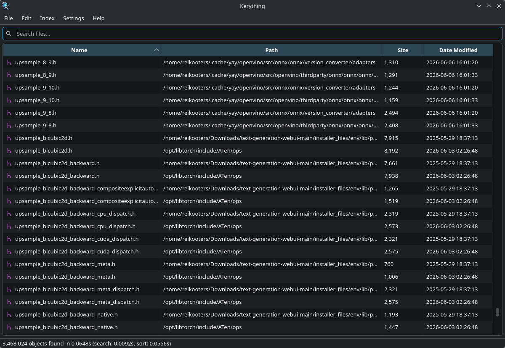

Project Path: kerything-patches

Source Tree:

```txt
kerything-patches
├── CMakeLists.txt
├── LICENSE
├── PKGBUILD
├── README.md
├── assets
├── cmake_uninstall.cmake.in
├── kerything
│   ├── AppController.cpp
│   ├── AppController.h
│   ├── BlockDeviceDisplayUtils.cpp
│   ├── BlockDeviceDisplayUtils.h
│   ├── DaemonClient.cpp
│   ├── DaemonClient.h
│   ├── DeviceCapabilities.cpp
│   ├── DeviceCapabilities.h
│   ├── DevicePickerDialog.cpp
│   ├── DevicePickerDialog.h
│   ├── DevicePreferenceChange.h
│   ├── FileModel.cpp
│   ├── FileModel.h
│   ├── GuiUtils.cpp
│   ├── GuiUtils.h
│   ├── HoverRowHighlight.cpp
│   ├── HoverRowHighlight.h
│   ├── IndexController.cpp
│   ├── IndexController.h
│   ├── IndexSummary.h
│   ├── MainWindow.cpp
│   ├── MainWindow.h
│   ├── Preferences.cpp
│   ├── Preferences.h
│   ├── PreferencesDialog.cpp
│   ├── PreferencesDialog.h
│   ├── PreferencesDialogPage.h
│   ├── PreviewMetadata.h
│   ├── PreviewPane.cpp
│   ├── PreviewPane.h
│   ├── SearchResultColumns.h
│   ├── SearchResultTableView.cpp
│   ├── SearchResultTableView.h
│   ├── SingleInstanceServer.cpp
│   ├── SingleInstanceServer.h
│   ├── icons
│   │   ├── 16-apps-kerything.png
│   │   ├── 256-apps-kerything.png
│   │   ├── 32-apps-kerything.png
│   │   └── 48-apps-kerything.png
│   └── main.cpp
├── kerything.install
├── kerythingd
│   ├── BlockDeviceHelper.cpp
│   ├── BlockDeviceHelper.h
│   ├── ClientConnection.cpp
│   ├── ClientConnection.h
│   ├── DeviceChangeMonitor.cpp
│   ├── DeviceChangeMonitor.h
│   ├── FanotifyHandleResolver.cpp
│   ├── FanotifyHandleResolver.h
│   ├── FanotifyWatcher.cpp
│   ├── FanotifyWatcher.h
│   ├── LiveUpdateManager.cpp
│   ├── LiveUpdateManager.h
│   ├── ScanJob.h
│   ├── ScannerHelper.cpp
│   ├── ScannerHelper.h
│   ├── ScannerWorker.cpp
│   ├── ScannerWorker.h
│   ├── Server.cpp
│   ├── Server.h
│   ├── ThrottledProgressReporter.h
│   ├── lib
│   │   └── utfcpp
│   │       ├── utf8
│   │       │   ├── checked.h
│   │       │   ├── core.h
│   │       │   ├── cpp11.h
│   │       │   ├── cpp17.h
│   │       │   ├── cpp20.h
│   │       │   └── unchecked.h
│   │       └── utf8.h
│   ├── main.cpp
│   └── scanners
│       ├── BtrfsScannerEngine.cpp
│       ├── BtrfsScannerEngine.h
│       ├── Ext4ScannerEngine.cpp
│       ├── Ext4ScannerEngine.h
│       ├── GenericMountedScannerEngine.cpp
│       ├── GenericMountedScannerEngine.h
│       ├── NtfsScannerEngine.cpp
│       └── NtfsScannerEngine.h
├── kerythingd.service.in
├── kerythingd.socket.in
├── net.reikooters.kerything.desktop
├── packaging
│   ├── Containerfile.kdeneon
│   ├── build-archlinux.sh
│   └── build-kdeneon.sh
└── shared
    ├── BlockDevice.h
    ├── FileRecord.h
    ├── FilesystemConstants.h
    ├── LiveUpdateEvent.h
    ├── Protocol.h
    ├── ScopedAccumulatedTimer.h
    ├── ScopedTimer.h
    ├── SocketFramer.cpp
    ├── SocketFramer.h
    └── Version.h

```

`CMakeLists.txt`:

```txt
# SPDX-License-Identifier: GPL-3.0-or-later
# Copyright (C) 2026  Reikooters <https://github.com/Reikooters>

cmake_minimum_required(VERSION 4.2)
project(kerything)

include(GNUInstallDirs)
include(CheckIPOSupported)

set(KERYTHING_SYSTEMD_SYSTEM_UNIT_DIR
        "${CMAKE_INSTALL_LIBDIR}/systemd/system"
        CACHE PATH "Directory for systemd system units"
)

check_ipo_supported(RESULT KERYTHING_IPO_SUPPORTED OUTPUT KERYTHING_IPO_ERROR)

if(KERYTHING_IPO_SUPPORTED)
    set(CMAKE_INTERPROCEDURAL_OPTIMIZATION_RELEASE ON)
else()
    message(STATUS "IPO/LTO not supported: ${KERYTHING_IPO_ERROR}")
endif()

set(CMAKE_CXX_STANDARD 26)
set(CMAKE_CXX_STANDARD_REQUIRED ON)

# Qt and KDE require these for code generation (MOC, UI, Resources)
set(CMAKE_AUTOMOC ON)
set(CMAKE_AUTORCC ON)
set(CMAKE_AUTOUIC ON)

# Find TBB for parallel algorithms
find_package(TBB REQUIRED)

# Find Qt6 components
find_package(Qt6 REQUIRED COMPONENTS
        Widgets
        Core
        Network
        Concurrent
)

option(KERYTHING_WITH_KF6 "Use KDE Frameworks 6, including KDE KIO for opening files" ON)
option(KERYTHING_ENABLE_LOGGING "Enable verbose runtime logging" OFF)
option(KERYTHING_ENABLE_MEMORY_STATS "Enable the GUI memory statistics dialog" OFF)

if(KERYTHING_WITH_KF6)
    # Find KDE Frameworks components
    find_package(ECM REQUIRED NO_MODULE)
    set(CMAKE_MODULE_PATH ${ECM_MODULE_PATH})

    find_package(KF6 REQUIRED COMPONENTS
            CoreAddons
            I18n
            KIO
            XmlGui
    )
endif()

# Find PkgConfig
find_package(PkgConfig REQUIRED)

# Check for both ext2fs and com_err
pkg_check_modules(EXT2FS REQUIRED ext2fs com_err)

# libblkid (util-linux) for device inventory in the daemon
pkg_check_modules(BLKID REQUIRED blkid)

# libudev for monitoring device changes (USB plugged in,
# partitions appearing/disappearing, filesystem label changes, etc.
pkg_check_modules(UDEV REQUIRED libudev)

# libmount (util-linux) for monitoring mount table changes
pkg_check_modules(MOUNT REQUIRED mount)

# libsystemd for socket activation
pkg_check_modules(SYSTEMD REQUIRED libsystemd)

# RE2 for fast, predictable user-supplied regular expressions in the GUI search path
pkg_check_modules(RE2 REQUIRED re2)

add_executable(kerything
        kerything/main.cpp
        kerything/AppController.cpp
        kerything/AppController.h
        kerything/BlockDeviceDisplayUtils.cpp
        kerything/BlockDeviceDisplayUtils.h
        kerything/DaemonClient.cpp
        kerything/DaemonClient.h
        kerything/DeviceCapabilities.cpp
        kerything/DeviceCapabilities.h
        kerything/DevicePickerDialog.cpp
        kerything/DevicePickerDialog.h
        kerything/DevicePreferenceChange.h
        kerything/FileModel.cpp
        kerything/FileModel.h
        kerything/GuiUtils.cpp
        kerything/GuiUtils.h
        kerything/HoverRowHighlight.cpp
        kerything/HoverRowHighlight.h
        kerything/IndexController.cpp
        kerything/IndexController.h
        kerything/MainWindow.cpp
        kerything/MainWindow.h
        kerything/Preferences.cpp
        kerything/Preferences.h
        kerything/PreferencesDialog.cpp
        kerything/PreferencesDialog.h
        kerything/PreferencesDialogPage.h
        kerything/PreviewMetadata.h
        kerything/PreviewPane.cpp
        kerything/PreviewPane.h
        kerything/SearchResultColumns.h
        kerything/SearchResultTableView.cpp
        kerything/SearchResultTableView.h
        kerything/SingleInstanceServer.cpp
        kerything/SingleInstanceServer.h
        shared/BlockDevice.h
        shared/FileRecord.h
        shared/LiveUpdateEvent.h
        shared/Protocol.h
        shared/SocketFramer.cpp
        shared/SocketFramer.h
        shared/Version.h
)

add_executable(kerythingd
        kerythingd/main.cpp
        kerythingd/BlockDeviceHelper.cpp
        kerythingd/BlockDeviceHelper.h
        kerythingd/ClientConnection.cpp
        kerythingd/ClientConnection.h
        kerythingd/DeviceChangeMonitor.cpp
        kerythingd/DeviceChangeMonitor.h
        kerythingd/FanotifyHandleResolver.cpp
        kerythingd/FanotifyHandleResolver.h
        kerythingd/FanotifyWatcher.cpp
        kerythingd/FanotifyWatcher.h
        kerythingd/LiveUpdateManager.cpp
        kerythingd/LiveUpdateManager.h
        kerythingd/ScanJob.h
        kerythingd/ScannerHelper.cpp
        kerythingd/ScannerHelper.h
        kerythingd/ScannerWorker.cpp
        kerythingd/ScannerWorker.h
        kerythingd/Server.cpp
        kerythingd/Server.h
        kerythingd/ThrottledProgressReporter.h
        kerythingd/scanners/BtrfsScannerEngine.cpp
        kerythingd/scanners/BtrfsScannerEngine.h
        kerythingd/scanners/Ext4ScannerEngine.cpp
        kerythingd/scanners/Ext4ScannerEngine.h
        kerythingd/scanners/GenericMountedScannerEngine.cpp
        kerythingd/scanners/GenericMountedScannerEngine.h
        kerythingd/scanners/NtfsScannerEngine.cpp
        kerythingd/scanners/NtfsScannerEngine.h
        shared/BlockDevice.h
        shared/FileRecord.h
        shared/LiveUpdateEvent.h
        shared/Protocol.h
        shared/SocketFramer.cpp
        shared/SocketFramer.h
)

if(KERYTHING_WITH_KF6)
    target_compile_definitions(kerything PRIVATE KERYTHING_WITH_KF6)
endif()

if(KERYTHING_ENABLE_LOGGING)
    target_compile_definitions(kerything PRIVATE KERYTHING_ENABLE_LOGGING)
    target_compile_definitions(kerythingd PRIVATE KERYTHING_ENABLE_LOGGING)
endif()

if(KERYTHING_ENABLE_MEMORY_STATS)
    target_compile_definitions(kerything PRIVATE KERYTHING_ENABLE_MEMORY_STATS)
endif()

target_compile_definitions(kerything PRIVATE QT_NO_KEYWORDS)

target_compile_definitions(kerythingd PRIVATE QT_NO_KEYWORDS)

target_compile_options(kerything
        PRIVATE
        $<$<CONFIG:Release>:-O2>
        ${RE2_CFLAGS_OTHER}
)

target_compile_options(kerythingd
        PRIVATE
        $<$<CONFIG:Release>:-O2>
)

target_link_libraries(kerything
        PRIVATE
        TBB::tbb # Parallelism
        Qt6::Widgets
        Qt6::Network
        Qt6::Concurrent
        ${RE2_LIBRARIES}
)

if(KERYTHING_WITH_KF6)
    target_link_libraries(kerything
            PRIVATE
            KF6::CoreAddons
            KF6::KIOGui
            KF6::KIOWidgets
            KF6::Service
            KF6::XmlGui
    )
endif()

target_link_libraries(kerythingd
        PRIVATE
        Qt6::Core
        Qt6::Network
        ${BLKID_LIBRARIES}
        ${EXT2FS_LIBRARIES} # Lib for parsing EXT4 inodes
        ${UDEV_LIBRARIES}
        ${MOUNT_LIBRARIES}
        ${SYSTEMD_LIBRARIES}
)

target_include_directories(kerything
        PRIVATE
        "${CMAKE_CURRENT_SOURCE_DIR}/shared"
        ${RE2_INCLUDE_DIRS}
)

target_include_directories(kerythingd
        PRIVATE
        "${CMAKE_CURRENT_SOURCE_DIR}/shared"
        ${EXT2FS_INCLUDE_DIRS}
        ${UDEV_INCLUDE_DIRS}
        ${MOUNT_INCLUDE_DIRS}
        ${SYSTEMD_INCLUDE_DIRS}
)

target_compile_options(kerythingd
        PRIVATE
        ${EXT2FS_CFLAGS_OTHER}
        ${BLKID_CFLAGS_OTHER}
        ${UDEV_CFLAGS_OTHER}
        ${MOUNT_CFLAGS_OTHER}
        ${SYSTEMD_CFLAGS_OTHER}
)

target_link_options(kerythingd
        PRIVATE
        ${EXT2FS_LDFLAGS_OTHER}
        ${BLKID_LDFLAGS_OTHER}
        ${UDEV_LDFLAGS_OTHER}
        ${MOUNT_LDFLAGS_OTHER}
        ${SYSTEMD_LDFLAGS_OTHER}
)

# Install the binaries
install(TARGETS kerything kerythingd
        RUNTIME DESTINATION ${CMAKE_INSTALL_BINDIR}
)

configure_file(
        "${CMAKE_CURRENT_SOURCE_DIR}/kerythingd.service.in"
        "${CMAKE_CURRENT_BINARY_DIR}/kerythingd.service"
        @ONLY
)

configure_file(
        "${CMAKE_CURRENT_SOURCE_DIR}/kerythingd.socket.in"
        "${CMAKE_CURRENT_BINARY_DIR}/kerythingd.socket"
        @ONLY
)

install(FILES
        "${CMAKE_CURRENT_BINARY_DIR}/kerythingd.service"
        "${CMAKE_CURRENT_BINARY_DIR}/kerythingd.socket"
        DESTINATION "${KERYTHING_SYSTEMD_SYSTEM_UNIT_DIR}"
)

# Install the icons into the freedesktop hicolor icon theme.
install(FILES kerything/icons/256-apps-kerything.png
        DESTINATION ${CMAKE_INSTALL_DATADIR}/icons/hicolor/256x256/apps
        RENAME kerything.png
)

install(FILES kerything/icons/48-apps-kerything.png
        DESTINATION ${CMAKE_INSTALL_DATADIR}/icons/hicolor/48x48/apps
        RENAME kerything.png
)

install(FILES kerything/icons/32-apps-kerything.png
        DESTINATION ${CMAKE_INSTALL_DATADIR}/icons/hicolor/32x32/apps
        RENAME kerything.png
)

install(FILES kerything/icons/16-apps-kerything.png
        DESTINATION ${CMAKE_INSTALL_DATADIR}/icons/hicolor/16x16/apps
        RENAME kerything.png
)

# Install the .desktop file
install(FILES net.reikooters.kerything.desktop
        DESTINATION ${CMAKE_INSTALL_DATADIR}/applications
)

# Install the license file
install(FILES LICENSE
        DESTINATION ${CMAKE_INSTALL_DATADIR}/licenses/kerything
)

# Add an uninstall target
if(NOT TARGET uninstall)
    configure_file(
            "${CMAKE_CURRENT_SOURCE_DIR}/cmake_uninstall.cmake.in"
            "${CMAKE_CURRENT_BINARY_DIR}/cmake_uninstall.cmake"
            IMMEDIATE @ONLY)

    add_custom_target(uninstall
            COMMAND ${CMAKE_COMMAND} -P "${CMAKE_CURRENT_BINARY_DIR}/cmake_uninstall.cmake")
endif()

```
`LICENSE`:

```
                    GNU GENERAL PUBLIC LICENSE
                       Version 3, 29 June 2007

 Copyright (C) 2007 Free Software Foundation, Inc. <https://fsf.org/>
 Everyone is permitted to copy and distribute verbatim copies
 of this license document, but changing it is not allowed.

                            Preamble

  The GNU General Public License is a free, copyleft license for
software and other kinds of works.

  The licenses for most software and other practical works are designed
to take away your freedom to share and change the works.  By contrast,
the GNU General Public License is intended to guarantee your freedom to
share and change all versions of a program--to make sure it remains free
software for all its users.  We, the Free Software Foundation, use the
GNU General Public License for most of our software; it applies also to
any other work released this way by its authors.  You can apply it to
your programs, too.

  When we speak of free software, we are referring to freedom, not
price.  Our General Public Licenses are designed to make sure that you
have the freedom to distribute copies of free software (and charge for
them if you wish), that you receive source code or can get it if you
want it, that you can change the software or use pieces of it in new
free programs, and that you know you can do these things.

  To protect your rights, we need to prevent others from denying you
these rights or asking you to surrender the rights.  Therefore, you have
certain responsibilities if you distribute copies of the software, or if
you modify it: responsibilities to respect the freedom of others.

  For example, if you distribute copies of such a program, whether
gratis or for a fee, you must pass on to the recipients the same
freedoms that you received.  You must make sure that they, too, receive
or can get the source code.  And you must show them these terms so they
know their rights.

  Developers that use the GNU GPL protect your rights with two steps:
(1) assert copyright on the software, and (2) offer you this License
giving you legal permission to copy, distribute and/or modify it.

  For the developers' and authors' protection, the GPL clearly explains
that there is no warranty for this free software.  For both users' and
authors' sake, the GPL requires that modified versions be marked as
changed, so that their problems will not be attributed erroneously to
authors of previous versions.

  Some devices are designed to deny users access to install or run
modified versions of the software inside them, although the manufacturer
can do so.  This is fundamentally incompatible with the aim of
protecting users' freedom to change the software.  The systematic
pattern of such abuse occurs in the area of products for individuals to
use, which is precisely where it is most unacceptable.  Therefore, we
have designed this version of the GPL to prohibit the practice for those
products.  If such problems arise substantially in other domains, we
stand ready to extend this provision to those domains in future versions
of the GPL, as needed to protect the freedom of users.

  Finally, every program is threatened constantly by software patents.
States should not allow patents to restrict development and use of
software on general-purpose computers, but in those that do, we wish to
avoid the special danger that patents applied to a free program could
make it effectively proprietary.  To prevent this, the GPL assures that
patents cannot be used to render the program non-free.

  The precise terms and conditions for copying, distribution and
modification follow.

                       TERMS AND CONDITIONS

  0. Definitions.

  "This License" refers to version 3 of the GNU General Public License.

  "Copyright" also means copyright-like laws that apply to other kinds of
works, such as semiconductor masks.

  "The Program" refers to any copyrightable work licensed under this
License.  Each licensee is addressed as "you".  "Licensees" and
"recipients" may be individuals or organizations.

  To "modify" a work means to copy from or adapt all or part of the work
in a fashion requiring copyright permission, other than the making of an
exact copy.  The resulting work is called a "modified version" of the
earlier work or a work "based on" the earlier work.

  A "covered work" means either the unmodified Program or a work based
on the Program.

  To "propagate" a work means to do anything with it that, without
permission, would make you directly or secondarily liable for
infringement under applicable copyright law, except executing it on a
computer or modifying a private copy.  Propagation includes copying,
distribution (with or without modification), making available to the
public, and in some countries other activities as well.

  To "convey" a work means any kind of propagation that enables other
parties to make or receive copies.  Mere interaction with a user through
a computer network, with no transfer of a copy, is not conveying.

  An interactive user interface displays "Appropriate Legal Notices"
to the extent that it includes a convenient and prominently visible
feature that (1) displays an appropriate copyright notice, and (2)
tells the user that there is no warranty for the work (except to the
extent that warranties are provided), that licensees may convey the
work under this License, and how to view a copy of this License.  If
the interface presents a list of user commands or options, such as a
menu, a prominent item in the list meets this criterion.

  1. Source Code.

  The "source code" for a work means the preferred form of the work
for making modifications to it.  "Object code" means any non-source
form of a work.

  A "Standard Interface" means an interface that either is an official
standard defined by a recognized standards body, or, in the case of
interfaces specified for a particular programming language, one that
is widely used among developers working in that language.

  The "System Libraries" of an executable work include anything, other
than the work as a whole, that (a) is included in the normal form of
packaging a Major Component, but which is not part of that Major
Component, and (b) serves only to enable use of the work with that
Major Component, or to implement a Standard Interface for which an
implementation is available to the public in source code form.  A
"Major Component", in this context, means a major essential component
(kernel, window system, and so on) of the specific operating system
(if any) on which the executable work runs, or a compiler used to
produce the work, or an object code interpreter used to run it.

  The "Corresponding Source" for a work in object code form means all
the source code needed to generate, install, and (for an executable
work) run the object code and to modify the work, including scripts to
control those activities.  However, it does not include the work's
System Libraries, or general-purpose tools or generally available free
programs which are used unmodified in performing those activities but
which are not part of the work.  For example, Corresponding Source
includes interface definition files associated with source files for
the work, and the source code for shared libraries and dynamically
linked subprograms that the work is specifically designed to require,
such as by intimate data communication or control flow between those
subprograms and other parts of the work.

  The Corresponding Source need not include anything that users
can regenerate automatically from other parts of the Corresponding
Source.

  The Corresponding Source for a work in source code form is that
same work.

  2. Basic Permissions.

  All rights granted under this License are granted for the term of
copyright on the Program, and are irrevocable provided the stated
conditions are met.  This License explicitly affirms your unlimited
permission to run the unmodified Program.  The output from running a
covered work is covered by this License only if the output, given its
content, constitutes a covered work.  This License acknowledges your
rights of fair use or other equivalent, as provided by copyright law.

  You may make, run and propagate covered works that you do not
convey, without conditions so long as your license otherwise remains
in force.  You may convey covered works to others for the sole purpose
of having them make modifications exclusively for you, or provide you
with facilities for running those works, provided that you comply with
the terms of this License in conveying all material for which you do
not control copyright.  Those thus making or running the covered works
for you must do so exclusively on your behalf, under your direction
and control, on terms that prohibit them from making any copies of
your copyrighted material outside their relationship with you.

  Conveying under any other circumstances is permitted solely under
the conditions stated below.  Sublicensing is not allowed; section 10
makes it unnecessary.

  3. Protecting Users' Legal Rights From Anti-Circumvention Law.

  No covered work shall be deemed part of an effective technological
measure under any applicable law fulfilling obligations under article
11 of the WIPO copyright treaty adopted on 20 December 1996, or
similar laws prohibiting or restricting circumvention of such
measures.

  When you convey a covered work, you waive any legal power to forbid
circumvention of technological measures to the extent such circumvention
is effected by exercising rights under this License with respect to
the covered work, and you disclaim any intention to limit operation or
modification of the work as a means of enforcing, against the work's
users, your or third parties' legal rights to forbid circumvention of
technological measures.

  4. Conveying Verbatim Copies.

  You may convey verbatim copies of the Program's source code as you
receive it, in any medium, provided that you conspicuously and
appropriately publish on each copy an appropriate copyright notice;
keep intact all notices stating that this License and any
non-permissive terms added in accord with section 7 apply to the code;
keep intact all notices of the absence of any warranty; and give all
recipients a copy of this License along with the Program.

  You may charge any price or no price for each copy that you convey,
and you may offer support or warranty protection for a fee.

  5. Conveying Modified Source Versions.

  You may convey a work based on the Program, or the modifications to
produce it from the Program, in the form of source code under the
terms of section 4, provided that you also meet all of these conditions:

    a) The work must carry prominent notices stating that you modified
    it, and giving a relevant date.

    b) The work must carry prominent notices stating that it is
    released under this License and any conditions added under section
    7.  This requirement modifies the requirement in section 4 to
    "keep intact all notices".

    c) You must license the entire work, as a whole, under this
    License to anyone who comes into possession of a copy.  This
    License will therefore apply, along with any applicable section 7
    additional terms, to the whole of the work, and all its parts,
    regardless of how they are packaged.  This License gives no
    permission to license the work in any other way, but it does not
    invalidate such permission if you have separately received it.

    d) If the work has interactive user interfaces, each must display
    Appropriate Legal Notices; however, if the Program has interactive
    interfaces that do not display Appropriate Legal Notices, your
    work need not make them do so.

  A compilation of a covered work with other separate and independent
works, which are not by their nature extensions of the covered work,
and which are not combined with it such as to form a larger program,
in or on a volume of a storage or distribution medium, is called an
"aggregate" if the compilation and its resulting copyright are not
used to limit the access or legal rights of the compilation's users
beyond what the individual works permit.  Inclusion of a covered work
in an aggregate does not cause this License to apply to the other
parts of the aggregate.

  6. Conveying Non-Source Forms.

  You may convey a covered work in object code form under the terms
of sections 4 and 5, provided that you also convey the
machine-readable Corresponding Source under the terms of this License,
in one of these ways:

    a) Convey the object code in, or embodied in, a physical product
    (including a physical distribution medium), accompanied by the
    Corresponding Source fixed on a durable physical medium
    customarily used for software interchange.

    b) Convey the object code in, or embodied in, a physical product
    (including a physical distribution medium), accompanied by a
    written offer, valid for at least three years and valid for as
    long as you offer spare parts or customer support for that product
    model, to give anyone who possesses the object code either (1) a
    copy of the Corresponding Source for all the software in the
    product that is covered by this License, on a durable physical
    medium customarily used for software interchange, for a price no
    more than your reasonable cost of physically performing this
    conveying of source, or (2) access to copy the
    Corresponding Source from a network server at no charge.

    c) Convey individual copies of the object code with a copy of the
    written offer to provide the Corresponding Source.  This
    alternative is allowed only occasionally and noncommercially, and
    only if you received the object code with such an offer, in accord
    with subsection 6b.

    d) Convey the object code by offering access from a designated
    place (gratis or for a charge), and offer equivalent access to the
    Corresponding Source in the same way through the same place at no
    further charge.  You need not require recipients to copy the
    Corresponding Source along with the object code.  If the place to
    copy the object code is a network server, the Corresponding Source
    may be on a different server (operated by you or a third party)
    that supports equivalent copying facilities, provided you maintain
    clear directions next to the object code saying where to find the
    Corresponding Source.  Regardless of what server hosts the
    Corresponding Source, you remain obligated to ensure that it is
    available for as long as needed to satisfy these requirements.

    e) Convey the object code using peer-to-peer transmission, provided
    you inform other peers where the object code and Corresponding
    Source of the work are being offered to the general public at no
    charge under subsection 6d.

  A separable portion of the object code, whose source code is excluded
from the Corresponding Source as a System Library, need not be
included in conveying the object code work.

  A "User Product" is either (1) a "consumer product", which means any
tangible personal property which is normally used for personal, family,
or household purposes, or (2) anything designed or sold for incorporation
into a dwelling.  In determining whether a product is a consumer product,
doubtful cases shall be resolved in favor of coverage.  For a particular
product received by a particular user, "normally used" refers to a
typical or common use of that class of product, regardless of the status
of the particular user or of the way in which the particular user
actually uses, or expects or is expected to use, the product.  A product
is a consumer product regardless of whether the product has substantial
commercial, industrial or non-consumer uses, unless such uses represent
the only significant mode of use of the product.

  "Installation Information" for a User Product means any methods,
procedures, authorization keys, or other information required to install
and execute modified versions of a covered work in that User Product from
a modified version of its Corresponding Source.  The information must
suffice to ensure that the continued functioning of the modified object
code is in no case prevented or interfered with solely because
modification has been made.

  If you convey an object code work under this section in, or with, or
specifically for use in, a User Product, and the conveying occurs as
part of a transaction in which the right of possession and use of the
User Product is transferred to the recipient in perpetuity or for a
fixed term (regardless of how the transaction is characterized), the
Corresponding Source conveyed under this section must be accompanied
by the Installation Information.  But this requirement does not apply
if neither you nor any third party retains the ability to install
modified object code on the User Product (for example, the work has
been installed in ROM).

  The requirement to provide Installation Information does not include a
requirement to continue to provide support service, warranty, or updates
for a work that has been modified or installed by the recipient, or for
the User Product in which it has been modified or installed.  Access to a
network may be denied when the modification itself materially and
adversely affects the operation of the network or violates the rules and
protocols for communication across the network.

  Corresponding Source conveyed, and Installation Information provided,
in accord with this section must be in a format that is publicly
documented (and with an implementation available to the public in
source code form), and must require no special password or key for
unpacking, reading or copying.

  7. Additional Terms.

  "Additional permissions" are terms that supplement the terms of this
License by making exceptions from one or more of its conditions.
Additional permissions that are applicable to the entire Program shall
be treated as though they were included in this License, to the extent
that they are valid under applicable law.  If additional permissions
apply only to part of the Program, that part may be used separately
under those permissions, but the entire Program remains governed by
this License without regard to the additional permissions.

  When you convey a copy of a covered work, you may at your option
remove any additional permissions from that copy, or from any part of
it.  (Additional permissions may be written to require their own
removal in certain cases when you modify the work.)  You may place
additional permissions on material, added by you to a covered work,
for which you have or can give appropriate copyright permission.

  Notwithstanding any other provision of this License, for material you
add to a covered work, you may (if authorized by the copyright holders of
that material) supplement the terms of this License with terms:

    a) Disclaiming warranty or limiting liability differently from the
    terms of sections 15 and 16 of this License; or

    b) Requiring preservation of specified reasonable legal notices or
    author attributions in that material or in the Appropriate Legal
    Notices displayed by works containing it; or

    c) Prohibiting misrepresentation of the origin of that material, or
    requiring that modified versions of such material be marked in
    reasonable ways as different from the original version; or

    d) Limiting the use for publicity purposes of names of licensors or
    authors of the material; or

    e) Declining to grant rights under trademark law for use of some
    trade names, trademarks, or service marks; or

    f) Requiring indemnification of licensors and authors of that
    material by anyone who conveys the material (or modified versions of
    it) with contractual assumptions of liability to the recipient, for
    any liability that these contractual assumptions directly impose on
    those licensors and authors.

  All other non-permissive additional terms are considered "further
restrictions" within the meaning of section 10.  If the Program as you
received it, or any part of it, contains a notice stating that it is
governed by this License along with a term that is a further
restriction, you may remove that term.  If a license document contains
a further restriction but permits relicensing or conveying under this
License, you may add to a covered work material governed by the terms
of that license document, provided that the further restriction does
not survive such relicensing or conveying.

  If you add terms to a covered work in accord with this section, you
must place, in the relevant source files, a statement of the
additional terms that apply to those files, or a notice indicating
where to find the applicable terms.

  Additional terms, permissive or non-permissive, may be stated in the
form of a separately written license, or stated as exceptions;
the above requirements apply either way.

  8. Termination.

  You may not propagate or modify a covered work except as expressly
provided under this License.  Any attempt otherwise to propagate or
modify it is void, and will automatically terminate your rights under
this License (including any patent licenses granted under the third
paragraph of section 11).

  However, if you cease all violation of this License, then your
license from a particular copyright holder is reinstated (a)
provisionally, unless and until the copyright holder explicitly and
finally terminates your license, and (b) permanently, if the copyright
holder fails to notify you of the violation by some reasonable means
prior to 60 days after the cessation.

  Moreover, your license from a particular copyright holder is
reinstated permanently if the copyright holder notifies you of the
violation by some reasonable means, this is the first time you have
received notice of violation of this License (for any work) from that
copyright holder, and you cure the violation prior to 30 days after
your receipt of the notice.

  Termination of your rights under this section does not terminate the
licenses of parties who have received copies or rights from you under
this License.  If your rights have been terminated and not permanently
reinstated, you do not qualify to receive new licenses for the same
material under section 10.

  9. Acceptance Not Required for Having Copies.

  You are not required to accept this License in order to receive or
run a copy of the Program.  Ancillary propagation of a covered work
occurring solely as a consequence of using peer-to-peer transmission
to receive a copy likewise does not require acceptance.  However,
nothing other than this License grants you permission to propagate or
modify any covered work.  These actions infringe copyright if you do
not accept this License.  Therefore, by modifying or propagating a
covered work, you indicate your acceptance of this License to do so.

  10. Automatic Licensing of Downstream Recipients.

  Each time you convey a covered work, the recipient automatically
receives a license from the original licensors, to run, modify and
propagate that work, subject to this License.  You are not responsible
for enforcing compliance by third parties with this License.

  An "entity transaction" is a transaction transferring control of an
organization, or substantially all assets of one, or subdividing an
organization, or merging organizations.  If propagation of a covered
work results from an entity transaction, each party to that
transaction who receives a copy of the work also receives whatever
licenses to the work the party's predecessor in interest had or could
give under the previous paragraph, plus a right to possession of the
Corresponding Source of the work from the predecessor in interest, if
the predecessor has it or can get it with reasonable efforts.

  You may not impose any further restrictions on the exercise of the
rights granted or affirmed under this License.  For example, you may
not impose a license fee, royalty, or other charge for exercise of
rights granted under this License, and you may not initiate litigation
(including a cross-claim or counterclaim in a lawsuit) alleging that
any patent claim is infringed by making, using, selling, offering for
sale, or importing the Program or any portion of it.

  11. Patents.

  A "contributor" is a copyright holder who authorizes use under this
License of the Program or a work on which the Program is based.  The
work thus licensed is called the contributor's "contributor version".

  A contributor's "essential patent claims" are all patent claims
owned or controlled by the contributor, whether already acquired or
hereafter acquired, that would be infringed by some manner, permitted
by this License, of making, using, or selling its contributor version,
but do not include claims that would be infringed only as a
consequence of further modification of the contributor version.  For
purposes of this definition, "control" includes the right to grant
patent sublicenses in a manner consistent with the requirements of
this License.

  Each contributor grants you a non-exclusive, worldwide, royalty-free
patent license under the contributor's essential patent claims, to
make, use, sell, offer for sale, import and otherwise run, modify and
propagate the contents of its contributor version.

  In the following three paragraphs, a "patent license" is any express
agreement or commitment, however denominated, not to enforce a patent
(such as an express permission to practice a patent or covenant not to
sue for patent infringement).  To "grant" such a patent license to a
party means to make such an agreement or commitment not to enforce a
patent against the party.

  If you convey a covered work, knowingly relying on a patent license,
and the Corresponding Source of the work is not available for anyone
to copy, free of charge and under the terms of this License, through a
publicly available network server or other readily accessible means,
then you must either (1) cause the Corresponding Source to be so
available, or (2) arrange to deprive yourself of the benefit of the
patent license for this particular work, or (3) arrange, in a manner
consistent with the requirements of this License, to extend the patent
license to downstream recipients.  "Knowingly relying" means you have
actual knowledge that, but for the patent license, your conveying the
covered work in a country, or your recipient's use of the covered work
in a country, would infringe one or more identifiable patents in that
country that you have reason to believe are valid.

  If, pursuant to or in connection with a single transaction or
arrangement, you convey, or propagate by procuring conveyance of, a
covered work, and grant a patent license to some of the parties
receiving the covered work authorizing them to use, propagate, modify
or convey a specific copy of the covered work, then the patent license
you grant is automatically extended to all recipients of the covered
work and works based on it.

  A patent license is "discriminatory" if it does not include within
the scope of its coverage, prohibits the exercise of, or is
conditioned on the non-exercise of one or more of the rights that are
specifically granted under this License.  You may not convey a covered
work if you are a party to an arrangement with a third party that is
in the business of distributing software, under which you make payment
to the third party based on the extent of your activity of conveying
the work, and under which the third party grants, to any of the
parties who would receive the covered work from you, a discriminatory
patent license (a) in connection with copies of the covered work
conveyed by you (or copies made from those copies), or (b) primarily
for and in connection with specific products or compilations that
contain the covered work, unless you entered into that arrangement,
or that patent license was granted, prior to 28 March 2007.

  Nothing in this License shall be construed as excluding or limiting
any implied license or other defenses to infringement that may
otherwise be available to you under applicable patent law.

  12. No Surrender of Others' Freedom.

  If conditions are imposed on you (whether by court order, agreement or
otherwise) that contradict the conditions of this License, they do not
excuse you from the conditions of this License.  If you cannot convey a
covered work so as to satisfy simultaneously your obligations under this
License and any other pertinent obligations, then as a consequence you may
not convey it at all.  For example, if you agree to terms that obligate you
to collect a royalty for further conveying from those to whom you convey
the Program, the only way you could satisfy both those terms and this
License would be to refrain entirely from conveying the Program.

  13. Use with the GNU Affero General Public License.

  Notwithstanding any other provision of this License, you have
permission to link or combine any covered work with a work licensed
under version 3 of the GNU Affero General Public License into a single
combined work, and to convey the resulting work.  The terms of this
License will continue to apply to the part which is the covered work,
but the special requirements of the GNU Affero General Public License,
section 13, concerning interaction through a network will apply to the
combination as such.

  14. Revised Versions of this License.

  The Free Software Foundation may publish revised and/or new versions of
the GNU General Public License from time to time.  Such new versions will
be similar in spirit to the present version, but may differ in detail to
address new problems or concerns.

  Each version is given a distinguishing version number.  If the
Program specifies that a certain numbered version of the GNU General
Public License "or any later version" applies to it, you have the
option of following the terms and conditions either of that numbered
version or of any later version published by the Free Software
Foundation.  If the Program does not specify a version number of the
GNU General Public License, you may choose any version ever published
by the Free Software Foundation.

  If the Program specifies that a proxy can decide which future
versions of the GNU General Public License can be used, that proxy's
public statement of acceptance of a version permanently authorizes you
to choose that version for the Program.

  Later license versions may give you additional or different
permissions.  However, no additional obligations are imposed on any
author or copyright holder as a result of your choosing to follow a
later version.

  15. Disclaimer of Warranty.

  THERE IS NO WARRANTY FOR THE PROGRAM, TO THE EXTENT PERMITTED BY
APPLICABLE LAW.  EXCEPT WHEN OTHERWISE STATED IN WRITING THE COPYRIGHT
HOLDERS AND/OR OTHER PARTIES PROVIDE THE PROGRAM "AS IS" WITHOUT WARRANTY
OF ANY KIND, EITHER EXPRESSED OR IMPLIED, INCLUDING, BUT NOT LIMITED TO,
THE IMPLIED WARRANTIES OF MERCHANTABILITY AND FITNESS FOR A PARTICULAR
PURPOSE.  THE ENTIRE RISK AS TO THE QUALITY AND PERFORMANCE OF THE PROGRAM
IS WITH YOU.  SHOULD THE PROGRAM PROVE DEFECTIVE, YOU ASSUME THE COST OF
ALL NECESSARY SERVICING, REPAIR OR CORRECTION.

  16. Limitation of Liability.

  IN NO EVENT UNLESS REQUIRED BY APPLICABLE LAW OR AGREED TO IN WRITING
WILL ANY COPYRIGHT HOLDER, OR ANY OTHER PARTY WHO MODIFIES AND/OR CONVEYS
THE PROGRAM AS PERMITTED ABOVE, BE LIABLE TO YOU FOR DAMAGES, INCLUDING ANY
GENERAL, SPECIAL, INCIDENTAL OR CONSEQUENTIAL DAMAGES ARISING OUT OF THE
USE OR INABILITY TO USE THE PROGRAM (INCLUDING BUT NOT LIMITED TO LOSS OF
DATA OR DATA BEING RENDERED INACCURATE OR LOSSES SUSTAINED BY YOU OR THIRD
PARTIES OR A FAILURE OF THE PROGRAM TO OPERATE WITH ANY OTHER PROGRAMS),
EVEN IF SUCH HOLDER OR OTHER PARTY HAS BEEN ADVISED OF THE POSSIBILITY OF
SUCH DAMAGES.

  17. Interpretation of Sections 15 and 16.

  If the disclaimer of warranty and limitation of liability provided
above cannot be given local legal effect according to their terms,
reviewing courts shall apply local law that most closely approximates
an absolute waiver of all civil liability in connection with the
Program, unless a warranty or assumption of liability accompanies a
copy of the Program in return for a fee.

                     END OF TERMS AND CONDITIONS

            How to Apply These Terms to Your New Programs

  If you develop a new program, and you want it to be of the greatest
possible use to the public, the best way to achieve this is to make it
free software which everyone can redistribute and change under these terms.

  To do so, attach the following notices to the program.  It is safest
to attach them to the start of each source file to most effectively
state the exclusion of warranty; and each file should have at least
the "copyright" line and a pointer to where the full notice is found.

    <one line to give the program's name and a brief idea of what it does.>
    Copyright (C) <year>  <name of author>

    This program is free software: you can redistribute it and/or modify
    it under the terms of the GNU General Public License as published by
    the Free Software Foundation, either version 3 of the License, or
    (at your option) any later version.

    This program is distributed in the hope that it will be useful,
    but WITHOUT ANY WARRANTY; without even the implied warranty of
    MERCHANTABILITY or FITNESS FOR A PARTICULAR PURPOSE.  See the
    GNU General Public License for more details.

    You should have received a copy of the GNU General Public License
    along with this program.  If not, see <https://www.gnu.org/licenses/>.

Also add information on how to contact you by electronic and paper mail.

  If the program does terminal interaction, make it output a short
notice like this when it starts in an interactive mode:

    <program>  Copyright (C) <year>  <name of author>
    This program comes with ABSOLUTELY NO WARRANTY; for details type `show w'.
    This is free software, and you are welcome to redistribute it
    under certain conditions; type `show c' for details.

The hypothetical commands `show w' and `show c' should show the appropriate
parts of the General Public License.  Of course, your program's commands
might be different; for a GUI interface, you would use an "about box".

  You should also get your employer (if you work as a programmer) or school,
if any, to sign a "copyright disclaimer" for the program, if necessary.
For more information on this, and how to apply and follow the GNU GPL, see
<https://www.gnu.org/licenses/>.

  The GNU General Public License does not permit incorporating your program
into proprietary programs.  If your program is a subroutine library, you
may consider it more useful to permit linking proprietary applications with
the library.  If this is what you want to do, use the GNU Lesser General
Public License instead of this License.  But first, please read
<https://www.gnu.org/licenses/why-not-lgpl.html>.

```
`PKGBUILD`:

```
# SPDX-License-Identifier: GPL-3.0-or-later
# Copyright (C) 2026  Reikooters <https://github.com/Reikooters>

pkgname=kerything
pkgver=2.8.0
pkgrel=1
pkgdesc='Fast Linux block device file scanner and search application using trigrams'
arch=('x86_64')
url='https://github.com/Reikooters/kerything'
license=('GPL-3.0-or-later')
install='kerything.install'

depends=(
  'qt6-base' # Qt6::Widgets, Qt6::Core, Qt6::Network
  're2' # Regular expression support for search
  'onetbb' # TBB::tbb
  'e2fsprogs' # ext2fs, com_err
  'util-linux-libs' # blkid, mount
  'systemd-libs' # libsystemd, libudev
  'kcoreaddons' # KF6::CoreAddons
  'ki18n' # KF6::I18n
  'kio' # KF6::KIO*, KF6::Service
  'kxmlgui' # KF6::XmlGui
)

makedepends=(
  'cmake'
  'extra-cmake-modules'
  'pkgconf'
  'systemd'
)

# Disable the creation of the -debug package
# Add link time optimization
# Stop Arch Linux from injecting its default build flags
options=(
  '!debug'
  'lto'
  '!buildflags'
)

# For release packaging, use this:
# source=("git+${url}.git#tag=v${pkgver}")
# sha256sums=('SKIP')

# For local makepkg builds from the project directory:
source=()
sha256sums=()

build() {
  # Omit `-Wp,-D_GLIBCXX_ASSERTIONS` as this security flag can significantly
  # reduce application performance.
  local my_flags='-march=x86-64 -mtune=generic -O2 -flto=auto -DNDEBUG -fno-plt -fno-omit-frame-pointer -mno-omit-leaf-frame-pointer -fstack-protector-strong -fstack-clash-protection -fcf-protection -fexceptions -Wp,-D_FORTIFY_SOURCE=3'

  cmake -B build -S "$startdir" \
    -DCMAKE_BUILD_TYPE=Release \
    -DCMAKE_CXX_FLAGS_RELEASE="$my_flags" \
    -DCMAKE_C_FLAGS_RELEASE="$my_flags" \
    -DCMAKE_EXE_LINKER_FLAGS_RELEASE='-Wl,-O1,--sort-common,--as-needed' \
    -DCMAKE_INSTALL_PREFIX=/usr \
    -DKERYTHING_SYSTEMD_SYSTEM_UNIT_DIR=/usr/lib/systemd/system \
    -DKERYTHING_WITH_KF6=ON \
    -Wno-author

  cmake --build build --parallel "$(nproc)"
}

package() {
  DESTDIR="$pkgdir" cmake --install build

  # Create kerything group if it does not already exist
  install -Dm644 /dev/stdin "$pkgdir/usr/lib/sysusers.d/kerything.conf" <<'EOF'
g kerything - - -
EOF
}
```
`README.md`:

```md
# Kerything 🔍

> [!NOTE]
> This branch contains the rewrite of the Kerything project. The code for Kerything v1 can be found in the [v1-legacy](https://github.com/Reikooters/kerything/tree/v1-legacy) branch.

Kerything is a fast Linux file search application built with C++26 and Qt 6.

Inspired by the Windows utility "Everything" by Voidtools, Kerything bypasses standard directory crawling where possible by reading the **NTFS Master File Table (MFT)** or scanning **EXT4 inodes** directly. This allows it to quickly index Linux block devices which use these filesystems.

For other mounted filesystems, Kerything can use Linux filesystem APIs to build an index without requiring filesystem-specific low-level scanner support.

Search is powered by fast in-memory bigram and trigram indexes to provide real-time results as you type.

Kerything currently supports indexing:

- EXT4
- NTFS
- Btrfs (mounted subvolumes only)
- Other mounted Linux filesystems through the generic mounted filesystem scanner

Low-level offline (unmounted) scanning is currently available for:

- EXT4
- NTFS

The name is a nod to the iconic "Everything" utility, while the 'K' prefix follows the long-standing naming tradition of the KDE community.

*Kerything is a community project and is not affiliated with Voidtools.*



## Desktop integration

Kerything can be built in two modes:

| Build mode       |                 CMake flag | Description                                                                                                                                                 |
|------------------|---------------------------:|-------------------------------------------------------------------------------------------------------------------------------------------------------------|
| KDE Frameworks 6 |  `-DKERYTHING_WITH_KF6=ON` | Recommended for KDE Plasma desktop users. Enables KDE integration such as richer file opening, “Show in File Manager”, “Open With”, and terminal launching. |
| Qt-only          | `-DKERYTHING_WITH_KF6=OFF` | Recommended for non-KDE desktops. Uses Qt and freedesktop-compatible fallbacks where possible.                                                              |

The KDE build is recommended if you are using KDE Plasma.

## Requirements

Kerything is designed for Linux systems using `systemd`.

The backend daemon uses `libudev` to monitor block device changes, such as devices
being created, removed, plugged in, unplugged, mounted, or unmounted. Because of
this, Kerything is intended for systemd-based Linux distributions.

Kerything consists of two executables:

- `kerything` — the graphical application
- `kerythingd` — the privileged backend daemon responsible for device discovery and indexing

Kerything also installs two systemd system units:

- `kerythingd.socket` — creates the local IPC socket and starts the daemon on demand
- `kerythingd.service` — runs the backend daemon when activated by the socket

The daemon is socket-activated. This means `kerythingd.service` does not need to
be enabled to start at boot. Instead, `kerythingd.socket` should be enabled. When
the GUI connects to `/run/kerythingd/kerythingd.sock`, systemd starts the daemon
automatically if it is not already running.

The daemon exits automatically after it has had no GUI clients connected for 30
seconds. The socket remains active, so the next GUI connection starts the daemon
again.

## Features

- **Blazing Fast Indexing:** Uses low-level disk partition scanning for EXT4 and NTFS where available.
- **Broader Filesystem Support:** Indexes other mounted Linux filesystems supported by the generic mounted scanner.
- **Offline Indexing:** Supports scanning NTFS and EXT4 partitions even when they are not mounted in Linux.
- **Instant Search:** Uses bigram and trigram indexes for real-time search results as you type.
- **Live Updates:** Tracks filesystem changes for mounted devices in real time using Linux `fanotify`, keeping the in-memory index updated. *(Note: filesystems mounted using `fuseblk` are not expected to work. See note below for more info.)*
- **Extension Filters:** Narrow searches by file extension using queries such as `ext:mp4` or `ext:wav;mp3`, or use saved filters from the Filter menu.
- **Preview Pane:** Optionally show a preview pane with thumbnails for images and videos, and file-type icons for other formats.
- **Full Unicode Support:** Search for filenames containing any UTF-8 character, including international scripts, emojis and symbols.
- **Zero Bloat:** Simple, lightning-fast keyword search. By foregoing file-content scanning and other complex patterns, Kerything stays lightweight and responsive.
- **Search Options:** Optionally perform case-sensitive matching, match whole words, or use regular expressions to search for filenames using queries such as `^holiday.*\.jpg$`.
- **Multithreaded:** Leverages oneTBB for parallel index generation and sorting.
- **Rich Context Actions:** Right-click menu integration to open, copy, or manage files directly from the results. *(Note: Most context actions are only available if the drive was mounted at the time it was scanned.)*
- **Drag-and-Drop Support:** Easily copy or attach files by dragging them from the search results into Dolphin or other applications. *(Note: Currently not supported for Flatpak or other sandboxed applications due to portal limitations.)*
- **Low Overhead:** The index is stored in memory with an emphasis on efficiency. By using string pooling (e.g., storing a folder path only once even if it contains thousands of files), Kerything maintains a surprisingly small memory footprint even for massive partitions.

### Native KDE Integration (Optional)

Kerything can be built with KDE Frameworks 6 for better integration on KDE Plasma desktops, including:

- Additional right-click context actions similar to Dolphin, such as "Open With", share, compress, and more.
- "Show in File Manager" not only opens the folder, but also directly highlights the selected file.
- Grouping files by MIME type when opening multiple files. For example, selecting 4 music files and 3 images and pressing Open can open the songs in your music player and the images in your image viewer.
- Better "Open Terminal Here" integration.
- The About box uses KDE Plasma's standard about box style.

### Live updates

Live filesystem updates are supported for mounted filesystems using
Linux `fanotify`. Kerything keeps indexed devices updated for common
operations such as creates, deletes, metadata changes, symlinks, and renames.

Live update watching is enabled for mounted filesystems by default, and can
be toggled via the device configuration dialog. Support depends on the
filesystem and mount driver.

Live updates for devices mounted using `fuseblk` are not expected to work,
including NTFS mounted using `ntfs-3g`. NTFS mounted using either `ntfs3`
or the newer `ntfs` driver added in Linux kernel version 7.1 have been tested
to work successfully.

Live updates currently require the filesystem to be mounted and are provided
by the privileged `kerythingd` daemon.

If the live update stream becomes unreliable, for example due to a fanotify
queue overflow or an unsupported edge case, Kerything may mark the index as
potentially stale and a full refresh can be performed by pressing F5.

### Adaptive EXT4 scanning

To improve indexing performance for EXT4 devices, Kerything scans in parallel
on SSDs, NVMe drives, and devices where rotational status cannot be determined.

Rotational drives use serial scanning, as parallelism typically provides little
or no benefit and may perform worse.

### Btrfs support

Kerything includes initial support for Btrfs filesystems. It indexes mounted Btrfs subvolumes, but currently treats subvolume boundaries as scan boundaries.

In practice, this means that if a mounted Btrfs filesystem contains a child subvolume which is not mounted, Kerything will not descend into that child subvolume through the parent mount.

For example, if `/mnt/my-btrfs-device/my-child-subvolume` is a child subvolume, scanning `/mnt/my-btrfs-device` will not include files inside `my-child-subvolume`. However, if that child subvolume were also mounted at `/mnt/my-btrfs-device-child`, Kerything will index it through `/mnt/my-btrfs-device-child`.

#### Live updates on Btrfs filesystems

For reliable live updates on typical desktop installations, Kerything may
create a private helper mount of the Btrfs filesystem root. This is needed because
many distributions mount only selected Btrfs subvolumes, such as `/@` and `/@home`,
while filesystem change monitoring works best when the daemon can watch from the
filesystem root.

The helper mount is created by `kerythingd` under:

```text
/run/kerythingd/btrfs-live/<device-id>
```

This mount is used only by the Kerything daemon for indexing and live-update
tracking. It is mounted read-only, with restricted options such as no-execute, and
is made private so it does not become part of your normal desktop mount layout.

Depending on how `kerythingd` was started, especially when using systemd socket
activation, this helper mount may not appear in ordinary user-session tools such
as `lsblk`. This is expected and is a result of systemd mount namespace isolation.
Kerything will clean up the helper mount when it is no longer needed.

#### Known limitations for Btrfs

- Only mounted Btrfs subvolumes are indexed.
- Subvolume boundaries are not crossed during scanning.
- If the same subvolume is reachable through multiple paths, not every path may appear in search results for the reason mentioned above.
- Multi-device Btrfs filesystems are not currently supported.

Btrfs support will continue to improve in future releases.

## Searching and filters

Kerything searches indexed file names as you type. Searches are case-insensitive
by default and use in-memory bigram and trigram indexes for fast matching where
possible. Search keywords of two characters or longer benefit from these indexes, while single-character keywords fall back to a linear scan.

### Extension filters

You can narrow results by file extension using `ext:`:

```text
ext:mp4
```

Multiple extensions can be separated with semicolons or commas:

```text
ext:wav;mp3
```

Extension filters can be combined with normal search terms:

```text
holiday ext:jpg;png
ubuntu ext:iso
```

The leading dot is optional, so these are equivalent:

```text
ext:mp4
ext:.mp4
```

Additionally, multiple uses of `ext:` are combined, so these are equivalent:

```text
ext:mp4 ext:mkv
ext:mp4;mkv
```

Extension matching is case-insensitive. For example, `ext:jpg` matches `.jpg`,
`.JPG`, and `.Jpg`.

Kerything matches only the final extension after the last dot. For example,
`archive.tar.gz` would be matched with the following filter:

```text
ext:gz
```

This means that currently no results will be returned if you attempt to use a compound extension, such as:

```text
ext:tar.gz
```

> [!NOTE]
> File type filters are based on filename extensions. Kerything does not inspect
> file contents or perform MIME-type sniffing.

### Saved filters

The **Filter** menu provides reusable filter presets such as Audio, Images,
Videos, Documents, Archives, and Code. Selecting a filter narrows the current
search without changing the text in the search box.

For example, selecting **Filter → Images** and searching for:

```text
holiday
```
searches for image files matching `holiday`.

Filters can be edited from:

```text
Filter → Manage Filters...
```
or:

```text
Settings → Configure Kerything... → Filters
```

Saved filters are stored as query fragments. For example, an Images filter may
contain:

```text
ext:apng;avif;bmp;gif;heic;heif;ico;jpeg;jpg;jxl;png;svg;tif;tiff;webp
```

Custom filters can be added, duplicated, removed, or restored to the default
presets.

Optionally, macros can be assigned to filters. Macros let you type a keyword
followed by a colon, such as `audio:`, directly in the search box to apply
that filter to the search query.

Filter queries can reference macros for other filters to include them in the filter.
This is useful for creating complex filter queries that combine multiple filters.
For example, a filter called "Dragonforce Songs" could use the query:

```text
dragonforce audio:
```

When the search is performed, this would expand to `dragonforce ext:mp3;wav;flac;...`. 

Attempting to create a filter which uses macros that create self or circular
references (`a` references `b` references `c` references `a`) will raise an error. 

### Folder filter

You can narrow results to only folders using `folder:`, or any of the below aliases:

```text
folder:
folders:
type:folder
type:folders
```

### Files filter

You can narrow results to only files using `file:`, or any of the below aliases:

```text
file:
files:
type:file
type:files
```

## Keyboard Shortcuts

The following keyboard shortcuts are available in Kerything:

| Shortcut                                  | Action                                                                    |
|:------------------------------------------|:--------------------------------------------------------------------------|
| `Ctrl + L` or `Alt + D` or `Ctrl + F`     | Focus search bar and select all text                                      |
| `Esc`                                     | Focus search bar and clear all text                                       |
| `Ctrl + Esc` or `Shift + Alt + Backspace` | Focus search bar and clear all text, active filter, and search options    |
| `Ctrl + I`                                | Toggle case-sensitive filename matching                                   |
| `Ctrl + B`                                | Toggle whole-word filename matching                                       |
| `Ctrl + U`                                | Toggle path matching (search within path)                                 |
| `Ctrl + R`                                | Toggle regex                                                              |
| `Alt + P`                                 | Toggle preview pane                                                       |
| `Down / Up`                               | Move focus from search bar to the results table                           |
| `Return`                                  | Open selected file(s) with default applications                           |
| `Ctrl + Return`                           | Open the folder containing the selected file                              |
| `Ctrl + C`                                | Copy selected file(s) to clipboard (for pasting into another application) |
| `Ctrl + Shift + C`                        | Copy selected file(s) file name(s) to clipboard                           |
| `Ctrl + Alt + C`                          | Copy selected file(s) full absolute path(s) to clipboard                  |
| `Alt + Shift + F4`                        | Open your default terminal in the folder of the selected file             |
| `F5`                                      | Refresh indexes                                                           |
| `Ctrl + N`                                | Open a new window                                                         |
| `Ctrl + W`                                | Close window                                                              |
| `Ctrl + Shift + ,`                        | Open preferences                                                          |
| `Ctrl + Q`                                | Exit the application (closes all windows)                                 |

## Building and Installation

> [!WARNING]
> Kerything v2 is a full rewrite of the application. If you previously had Kerything v1 installed,
> you will need to uninstall it first before installing Kerything v2.
> 
> To do this, follow the uninstallation instructions in the [v1-legacy](https://github.com/Reikooters/kerything/tree/v1-legacy) branch.

Kerything can be installed in two main ways:

- using the included Arch Linux `PKGBUILD`
- building and installing manually with CMake

After installing with either method, complete the shared
[Post-install setup](#post-install-setup) steps so the GUI can talk to the
privileged backend daemon.

### Upgrading

If you already have Kerything installed, before upgrading:

1. Close the GUI application first. If you update while the GUI is open, the
   socket may re-activate the daemon during installation.
2. Stop both the daemon service and socket before installing the new build:

```bash
sudo systemctl stop kerythingd.service
sudo systemctl stop kerythingd.socket
sudo rm -rf /run/kerythingd
```

After installing the new version, reload systemd and start the socket again:

```bash
sudo systemctl daemon-reload
sudo systemctl enable --now kerythingd.socket
```

---

### Arch Linux

For Arch Linux there are two installation options. You can either install the KDE
Frameworks 6 build using the included PKGBUILD, or you can manually build and
install either the KF6 or Qt-only builds using CMake.

The KDE Frameworks 6 build is recommended for KDE Plasma desktop users. The
Qt-only build is recommended for non-KDE desktops.

### Installing the KDE Frameworks 6 build from the included PKGBUILD

If you already have Kerything installed, see [Upgrading](#upgrading) first.

```bash
# Clone the repository
git clone --branch v2.8.0 --depth 1 https://github.com/Reikooters/kerything.git

# Enter the source code directory
cd kerything

# Build and install the package
makepkg -si -f -c
```

This builds Kerything with KDE Frameworks 6 integration enabled.

After installation, complete [Post-install setup](#post-install-setup).

### Building manually on Arch Linux using CMake

If you already have Kerything installed, see [Upgrading](#upgrading) first.

### KDE Frameworks 6 build

Recommended for KDE Plasma users.

This includes the KDE dependencies and uses the `-DKERYTHING_WITH_KF6=ON`
build flag.

```bash
# Install dependencies
sudo pacman -S --needed \
  base-devel \
  cmake \
  extra-cmake-modules \
  pkgconf \
  qt6-base \
  onetbb \
  e2fsprogs \
  re2 \
  util-linux-libs \
  systemd-libs \
  kcoreaddons \
  ki18n \
  kio \
  kxmlgui

# Clone the repository
git clone --branch v2.8.0 --depth 1 https://github.com/Reikooters/kerything.git

# Enter the source code directory
cd kerything

# Build and install
cmake -B build -S . \
  -DCMAKE_BUILD_TYPE=Release \
  -DCMAKE_INSTALL_PREFIX=/usr \
  -DKERYTHING_WITH_KF6=ON

cmake --build build --parallel
sudo cmake --install build
```

After installation, complete [Post-install setup](#post-install-setup).

> [!IMPORTANT]
> Use `-DCMAKE_BUILD_TYPE=Release` for normal use. Debug builds are significantly
> slower and are intended for development only.

### Qt-only build

Recommended for non-KDE desktops.

This excludes the KDE dependencies and uses the `-DKERYTHING_WITH_KF6=OFF`
build flag.

```bash
sudo pacman -S --needed \
  base-devel \
  cmake \
  pkgconf \
  qt6-base \
  onetbb \
  e2fsprogs \
  re2 \
  util-linux-libs \
  systemd-libs

# Clone the repository
git clone --branch v2.8.0 --depth 1 https://github.com/Reikooters/kerything.git

# Enter the source code directory
cd kerything

cmake -B build -S . \
  -DCMAKE_BUILD_TYPE=Release \
  -DCMAKE_INSTALL_PREFIX=/usr \
  -DKERYTHING_WITH_KF6=OFF

cmake --build build --parallel
sudo cmake --install build
```

After installation, complete [Post-install setup](#post-install-setup).

> [!IMPORTANT]
> Use `-DCMAKE_BUILD_TYPE=Release` for normal use. Debug builds are significantly
> slower and are intended for development only.

---

### Building on other distributions

Install the equivalent development packages using your package manager for:

- CMake
- a C++26-capable compiler
- Qt 6 Core, Widgets, and Network
- oneTBB
- e2fsprogs development files, including `ext2fs` and `com_err`
- re2
- util-linux development files, including `blkid` and `mount`
- libudev development files
- libsystemd development files
- pkg-config / pkgconf

For KDE Frameworks 6 integration, also install the development packages for:

- Extra CMake Modules
- KF6 CoreAddons
- KF6 I18n
- KF6 KIO
- KF6 XmlGui

Clone the repo:

```bash
# Clone the repository
git clone --branch v2.8.0 --depth 1 https://github.com/Reikooters/kerything.git

# Enter the source code directory
cd kerything
```

Then build either the KDE version:

```bash
cmake -B build -S . \
  -DCMAKE_BUILD_TYPE=Release \
  -DCMAKE_INSTALL_PREFIX=/usr \
  -DKERYTHING_WITH_KF6=ON

cmake --build build --parallel
sudo cmake --install build
```

Or the Qt-only version:

```bash
cmake -B build -S . \
  -DCMAKE_BUILD_TYPE=Release \
  -DCMAKE_INSTALL_PREFIX=/usr \
  -DKERYTHING_WITH_KF6=OFF

cmake --build build --parallel
sudo cmake --install build
```

After installation, complete [Post-install setup](#post-install-setup).

> [!IMPORTANT]
> Use `-DCMAKE_BUILD_TYPE=Release` for normal use. Debug builds are significantly
> slower and are intended for development only.

## Post-install setup

Kerything uses a privileged backend daemon for low-level device access. The GUI
talks to the daemon over a Unix socket at:

```text
/run/kerythingd/kerythingd.sock
```

Access to this socket is controlled by the `kerything` group. Create the group,
add your user to it, reload systemd, and enable the socket unit:

```bash
sudo groupadd -r kerything
sudo usermod -aG kerything "$USER"
sudo systemctl daemon-reload
sudo systemctl enable --now kerythingd.socket
```

Restart your computer, or log out and back in, for the group change to take
effect.

If you are upgrading and already created the group and assigned your user
to it in the past, you don't need to reboot, but you still need to perform
the steps to reload systemd and enable the socket unit using the commands
above.

> [!IMPORTANT]
> Enable `kerythingd.socket`, not `kerythingd.service`. The service is started
> automatically by systemd when the GUI connects to the socket.

After installing and refreshing your login session, launch Kerything from your
application menu or run:

```bash
kerything
```

On first run, Kerything will ask which detected devices you want to index.

## systemd unit installation directory

By default, Kerything installs its systemd system units to:

```text
${CMAKE_INSTALL_LIBDIR}/systemd/system
```

With `-DCMAKE_INSTALL_PREFIX=/usr`, this is usually:

```text
/usr/lib/systemd/system
```

Some distributions use a different systemd system unit directory, such as:

```text
/lib/systemd/system
```

or:

```text
/usr/local/lib/systemd/system
```

You can override the unit installation directory with:

```bash
-DKERYTHING_SYSTEMD_SYSTEM_UNIT_DIR=/path/to/systemd/system
```

For example:

```bash
cmake -B build -S . \
  -DCMAKE_BUILD_TYPE=Release \
  -DCMAKE_INSTALL_PREFIX=/usr \
  -DKERYTHING_SYSTEMD_SYSTEM_UNIT_DIR=/usr/lib/systemd/system \
  -DKERYTHING_WITH_KF6=ON
```

After installing changed systemd units, reload systemd:

```bash
sudo systemctl daemon-reload
```

## Socket permissions and daemon activation

Kerything uses systemd socket activation.

The GUI does not start the daemon directly and should not need administrator
authentication during normal use. Instead:

1. systemd creates `/run/kerythingd/kerythingd.sock`
2. the socket is owned by `root:kerything`
3. members of the `kerything` group can connect to it
4. connecting to the socket starts `kerythingd.service` on demand

If you did not already do this during setup, create the `kerything` group and add
your user to it:

```bash
sudo groupadd -r kerything
sudo usermod -aG kerything "$USER"
```

Restart your computer, or log out and back in, for the group change to take effect.

Then enable and start the socket:

```bash
sudo systemctl enable --now kerythingd.socket
```

Check the socket status with:

```bash
systemctl status kerythingd.socket
```

Check the daemon status with:

```bash
systemctl status kerythingd.service
```

It is normal for `kerythingd.service` to be inactive when the GUI is not running.
The socket should remain active.

## Uninstalling

To uninstall, first close the GUI
application. Then stop the daemon and socket:

```bash
sudo systemctl stop kerythingd.service
sudo systemctl stop kerythingd.socket
sudo rm -rf /run/kerythingd
```

### If installed manually with CMake

From the same build directory used to install Kerything, run:

```bash
sudo cmake --build build --target uninstall
sudo systemctl daemon-reload
```

### If installed on Arch Linux using makepkg

If you installed Kerything using the included `PKGBUILD`, uninstall it with:

```bash
sudo pacman -Runs kerything
sudo systemctl daemon-reload
```

### Optional cleanup

Package removal does not necessarily remove local user data, preferences,
or the `kerything` group.

If you no longer want the access group, you can remove your user from it or remove
the group entirely. Only do this if no other local installation of Kerything uses
it:

```bash
sudo gpasswd -d "$USER" kerything
sudo groupdel kerything
```

You may need to log out and back in for group membership changes to be fully
reflected in your session.

To remove the preferences file:

```bash
rm ~/.config/Reikooters/Kerything.conf
```

## Development daemon usage

For development, you can run `kerythingd` manually instead of through systemd.
When no systemd socket is passed to the daemon, it falls back to creating and
listening on `/run/kerythingd/kerythingd.sock` itself.

The daemon still needs sufficient privileges to inspect block devices and create
the socket under `/run`, so development runs commonly require root privileges:

```bash
sudo ./build/kerythingd
```

Make sure the systemd socket is stopped first, otherwise the socket path may
already be in use:

```bash
sudo systemctl stop kerythingd.service
sudo systemctl stop kerythingd.socket
```

When switching back to normal installed usage:

```bash
sudo systemctl daemon-reload
sudo systemctl enable --now kerythingd.socket
```

### Manual live update test checklist

For development, live updates can be tested with a mounted filesystem,
including a loop device.

A loop device formatted as EXT4 could be created like so:

```bash
IMG="$HOME/kerything-test/ext4-test.img"
MNT="/mnt/kerything-test"

mkdir -p "$(dirname "$IMG")"
truncate -s 256M "$IMG"

mkfs.ext4 -F -L KERYTEST "$IMG"

LOOPDEV="$(sudo losetup --find --show "$IMG")"
echo "Loop device: $LOOPDEV"

sudo mkdir -p "$MNT"
sudo mount "$LOOPDEV" "$MNT"

echo "Mounted at: $MNT"
findmnt "$MNT"
```

And later removed with:

```bash
sudo umount $MNT
sudo losetup -d $LOOPDEV
```

After indexing the mounted device in Kerything, verify:

```bash
# Create file
sudo touch /mnt/kerything-test/live-file.txt

# Modify file metadata/content
sudo sh -c 'echo hello >> /mnt/kerything-test/live-file.txt'

# Rename file
sudo mv /mnt/kerything-test/live-file.txt /mnt/kerything-test/live-file-renamed.txt

# Delete file
sudo rm /mnt/kerything-test/live-file-renamed.txt

# Create directory and children
sudo mkdir /mnt/kerything-test/live-dir
sudo touch /mnt/kerything-test/live-dir/a.txt
sudo touch /mnt/kerything-test/live-dir/b.txt

# Rename directory with children
sudo mv /mnt/kerything-test/live-dir /mnt/kerything-test/live-dir-renamed

# Recursive delete
sudo rm -r /mnt/kerything-test/live-dir-renamed

# Symlink
sudo ln -s /mnt/kerything-test /mnt/kerything-test/live-symlink
sudo rm /mnt/kerything-test/live-symlink
```

Expected behavior:

- New files and folders appear without pressing F5.
- Modified size and timestamp update immediately.
- Renamed files and directories update without losing children.
- Deleted files and recursive directory contents disappear.
- Symlinks are shown with symlink icon and metadata.
- If a live update stream becomes unreliable, Kerything warns that the index may be stale.

#### Same-directory rapid rename

```bash
sudo touch /mnt/kerything-test/a.txt
sudo mv /mnt/kerything-test/a.txt /mnt/kerything-test/b.txt
sudo mv /mnt/kerything-test/b.txt /mnt/kerything-test/c.txt
```

Expected:

- `a.txt` gone
- `b.txt` gone
- `c.txt` present

#### Cross-directory move

```bash
sudo mkdir -p /mnt/kerything-test/one /mnt/kerything-test/two
sudo touch /mnt/kerything-test/one/move-me.txt
sudo mv /mnt/kerything-test/one/move-me.txt /mnt/kerything-test/two/move-me.txt
```

Expected:

- `one` and `two` directories created
- `move-me.txt` exists under `two` directory, not under `one` directory

#### Directory move with children

```bash
sudo mkdir -p /mnt/kerything-test/parent/sub
sudo touch /mnt/kerything-test/parent/sub/child.txt
sudo mv /mnt/kerything-test/parent /mnt/kerything-test/parent-renamed
```

Expected:

- `child.txt` still appears
- its containing path resolves under `parent-renamed/sub`

#### Hard link behavior

```bash
sudo touch /mnt/kerything-test/original-hardlink.txt
sudo ln /mnt/kerything-test/original-hardlink.txt /mnt/kerything-test/second-hardlink.txt
```

Expected:

- Both `original-hardlink.txt` and `second-hardlink.txt` should appear

```bash
sudo rm /mnt/kerything-test/second-hardlink.txt
```

Expected:

- Only `second-hardlink.txt` should disappear
- `original-hardlink.txt` should remain

```bash
sudo rm /mnt/kerything-test/second-hardlink.txt
```

Expected:

- `original-hardlink.txt` should disappear

#### Live file growing

```bash
sudo sh -c 'for i in $(seq 1 10000); do echo "$i" >> /mnt/kerything-test/live-growing.txt; done'
```

#### Stress test batching and overflow behavior

Generate many creates/deletes:

```bash
sudo mkdir -p /mnt/kerything-test/stress
sudo sh -c 'for i in $(seq 1 10000); do touch /mnt/kerything-test/stress/file-$i.txt; done'
sudo sh -c 'for i in $(seq 1 10000); do rm /mnt/kerything-test/stress/file-$i.txt; done'
```

Expected:

- `stress` folder should appear
- `file-{number|` files should appear then all disappear

#### Stress test creating and deleting a folder with many files

> [!WARNING]
> This test writes to your home directory.

```bash
TESTROOT="$HOME/kerything-delete-test"
rm -rf "$TESTROOT"
mkdir -p "$TESTROOT/wide"

for i in $(seq 1 10000); do
  : > "$TESTROOT/wide/file-$i.tmp"
done

sync
sleep 5

time rm -rf "$TESTROOT/wide"
```

### Useful commands while testing

Test CPU utilization:

```bash
pidstat -p "$(pidof kerything),$(pidof kerythingd)" 1
```

List loop devices:

```bash
losetup -a
```

Show block devices:

```bash
lsblk -f
```

Watch mount changes:

```bash
findmnt --poll
```

Watch udev events:

```bash
udevadm monitor --kernel --udev --subsystem-match=block
```

## Build options

### KDE integration

Enable KDE Frameworks 6 integration:

```bash
-DKERYTHING_WITH_KF6=ON
```

Disable KDE Frameworks 6 integration and use the Qt-only fallback implementation:

```bash
-DKERYTHING_WITH_KF6=OFF
```

When no flag is specified, it defaults to `ON`.

### Verbose logging

Verbose logging is disabled by default.

To enable verbose console logging for debugging, add:

```bash
-DKERYTHING_ENABLE_LOGGING=ON
```

For example:

```bash
cmake -B build -S . \
  -DCMAKE_BUILD_TYPE=Release \
  -DCMAKE_INSTALL_PREFIX=/usr \
  -DKERYTHING_WITH_KF6=ON \
  -DKERYTHING_ENABLE_LOGGING=ON

cmake --build build --parallel
```

## Contributing

Contributions are welcome! Whether it's bug reports, feature requests, or code:

1. Fork the repository.
2. Create your feature branch (`git checkout -b feature/AmazingFeature`).
3. Commit your changes (`git commit -m 'Add some AmazingFeature'`).
4. Push to the branch (`git push origin feature/AmazingFeature`).
5. Open a Pull Request.

## Future Plans

- **Additional Quality of Life Improvements:** Enhancing user experience and usability with additional searching and filtering options.
- **Live Update Expansion:** Improve live updates with more advanced recovery behavior.
- **Additional Low-Level Scanning Support:** Expanding low-level and offline file scanning support to other file systems such as Btrfs and F2FS.

## Credits

### Code Contributors

Thanks to the following people who have contributed code to Kerything:

- [@derickso](https://github.com/derickso)
  - Added the Preview Pane, which shows thumbnails for images and videos, and file-type icons for other formats.

### Third-party Libraries

Kerything makes use of the following open-source libraries and frameworks:

- **[Qt](https://www.qt.io/):** Cross-platform application framework used for the GUI, IPC, and core application functionality.
- **[KDE Frameworks](https://develop.kde.org/products/frameworks/):** Optional KDE integration for file actions, application launching, file manager integration, and desktop behavior.
- **[oneTBB](https://github.com/oneapi-src/oneTBB):** Intel's oneAPI Threading Building Blocks library for parallelism.
- **[e2fsprogs](https://github.com/tytso/e2fsprogs):** Linux filesystem tools and libraries used for EXT4 support.
- **[re2](https://github.com/google/re2):** Provides regular expression support.
- **[util-linux](https://github.com/util-linux/util-linux):** Provides libraries such as `blkid` and `mount` used for block device and mount information.
- **[systemd / libudev](https://github.com/systemd/systemd):** Used by the daemon to monitor block device changes.
- **[utfcpp](https://github.com/nemtrif/utfcpp):** A simple, portable and lightweight library for handling UTF-8 encoded strings in C++.

### Community Thanks

Special thanks to the following people for reporting bugs, suggesting features and improvements, and helping make this project better:

- [@lc-guy](https://github.com/lc-guy)
  - Suggested Btrfs filesystem support. Kerything has a dedicated Btrfs scanner which is currently a work in progress.
  - Identified issue with NTFS scanner not cancelling when it should.
- [@antonmeleshkevich](https://github.com/antonmeleshkevich)
  - Suggested support for desktops other than KDE Plasma. This led to the Qt-only build of Kerything without KDE dependencies.
- [@derickso](https://github.com/derickso)
  - Suggested support for filters, along with a number of filter-related enhancements.
  - Identified issue with NTFS scanner missing files/folders during scanning under certain conditions.
  - Contributed the Preview Pane feature.
- [@progalt-pfo](https://github.com/progalt-pfo)
  - Suggested F2FS filesystem support. Kerything does not yet have a dedicated scanner for F2FS, but this led to the development of a generic filesystem scanner which broadened support to other filesystems besides EXT4 and NTFS.
- [@KaMyKaSii](https://github.com/KaMyKaSii)
  - Suggested support for regular expressions.

## License

This project is licensed under the **GPL-3.0-or-later** License. See the [LICENSE](LICENSE) file for details.

```
`cmake_uninstall.cmake.in`:

```in
if(NOT EXISTS "@CMAKE_BINARY_DIR@/install_manifest.txt")
  message(FATAL_ERROR "Cannot find install manifest: @CMAKE_BINARY_DIR@/install_manifest.txt")
endif()

file(READ "@CMAKE_BINARY_DIR@/install_manifest.txt" files)
string(REGEX REPLACE "\n" ";" files "${files}")
foreach(file ${files})
  message(STATUS "Uninstalling $ENV{DESTDIR}${file}")
  if(IS_SYMLINK "$ENV{DESTDIR}${file}" OR EXISTS "$ENV{DESTDIR}${file}")
    execute_process(
      COMMAND "@CMAKE_COMMAND@" -E remove "$ENV{DESTDIR}${file}"
      OUTPUT_VARIABLE rm_out
      RESULT_VARIABLE rm_retval
      )
    if(NOT "${rm_retval}" STREQUAL 0)
      message(FATAL_ERROR "Problem when removing $ENV{DESTDIR}${file}")
    endif()
  else(IS_SYMLINK "$ENV{DESTDIR}${file}" OR EXISTS "$ENV{DESTDIR}${file}")
    message(STATUS "File $ENV{DESTDIR}${file} does not exist.")
  endif()
endforeach()

```
`kerything.install`:

```install
post_install() {
  systemd-sysusers kerything.conf >/dev/null 2>&1 || true
  systemctl daemon-reload >/dev/null 2>&1 || true

  cat <<'EOF'

Kerything has been installed.

Kerything uses a privileged daemon started on demand by systemd socket activation.

To allow your user to connect to the daemon socket, run:

  sudo usermod -aG kerything "$USER"

Then log out and back in, or restart your computer.

Enable the daemon socket with:

  sudo systemctl enable --now kerythingd.socket

Do not enable kerythingd.service directly. It is started automatically when the
GUI connects to kerythingd.socket.

EOF
}

post_upgrade() {
  systemd-sysusers kerything.conf >/dev/null 2>&1 || true
  systemctl daemon-reload >/dev/null 2>&1 || true

  cat <<'EOF'

Kerything has been upgraded.

If Kerything was running during the upgrade, restart the socket-activated daemon:

  sudo systemctl restart kerythingd.socket

If the daemon is currently active, you can also restart it with:

  sudo systemctl restart kerythingd.service

The socket should remain the enabled unit:

  systemctl status kerythingd.socket

EOF
}

pre_remove() {
  systemctl stop kerythingd.service >/dev/null 2>&1 || true
  systemctl stop kerythingd.socket >/dev/null 2>&1 || true
}

post_remove() {
  systemctl daemon-reload >/dev/null 2>&1 || true

  cat <<'EOF'

Kerything has been removed.

The kerything system group was not removed automatically. If you no longer need
it, remove it manually with:

  sudo groupdel kerything

EOF
}
```
`kerything/AppController.cpp`:

```cpp
// SPDX-License-Identifier: GPL-3.0-or-later
// Copyright (C) 2026  Reikooters <https://github.com/Reikooters>

#include "AppController.h"

#include <algorithm>
#include <iostream>
#include <QApplication>
#include <QLocale>

#include "DaemonClient.h"
#include "DeviceCapabilities.h"
#include "DevicePickerDialog.h"
#include "FileRecord.h"
#include "LiveUpdateEvent.h"
#include "MainWindow.h"
#include "PreferencesDialog.h"
#include "SingleInstanceServer.h"

namespace {
    struct LiveUpdateBatchSummary {
        qsizetype created = 0;
        qsizetype deleted = 0;
        qsizetype movedFrom = 0;
        qsizetype movedTo = 0;
        qsizetype metadataChanged = 0;
        qsizetype selfDeletedOrMoved = 0;
        qsizetype unknown = 0;
    };

    LiveUpdateBatchSummary summarizeLiveUpdateBatch(const std::vector<LiveUpdateEvent>& events)
    {
        LiveUpdateBatchSummary summary;

        for (const LiveUpdateEvent& event : events) {
            const NormalizedLiveUpdateEvent normalized = normalizeLiveUpdateEvent(event);

            switch (normalized.kind) {
                case NormalizedLiveUpdateKind::Created:
                    ++summary.created;
                    break;
                case NormalizedLiveUpdateKind::Deleted:
                    ++summary.deleted;
                    break;
                case NormalizedLiveUpdateKind::MovedFrom:
                    ++summary.movedFrom;
                    break;
                case NormalizedLiveUpdateKind::MovedTo:
                    ++summary.movedTo;
                    break;
                case NormalizedLiveUpdateKind::MetadataChanged:
                    ++summary.metadataChanged;
                    break;
                case NormalizedLiveUpdateKind::SelfDeletedOrMoved:
                    ++summary.selfDeletedOrMoved;
                    break;
                case NormalizedLiveUpdateKind::Unknown:
                default:
                    ++summary.unknown;
                    break;
            }
        }

        return summary;
    }
}

AppController::AppController(QApplication& app, QObject* parent)
    : QObject(parent),
      app_(app) {
    // Create the IPC/single-instance manager and make this controller its parent
    // so Qt cleans it up automatically with the controller.
    instanceServer_ = new SingleInstanceServer(QStringLiteral("kerything.single_instance_server"), this);

    // Debounce/rate-limit live update refreshes to avoid excessive full
    // search/sort refreshes when a busy filesystem such as "/" is watched.
    //
    // This is intentionally a leading-edge throttle rather than a pure
    // trailing-edge debounce: on a continuously busy OS drive, a pure debounce
    // could postpone visible live updates forever.
    liveUpdateRefreshTimer_.setSingleShot(true);
    liveUpdateRefreshTimer_.setInterval(1000);
    connect(&liveUpdateRefreshTimer_, &QTimer::timeout,
            this, &AppController::requestRefreshAllWindows);

    // Metadata-only live updates do not affect filename search membership.
    // They only need existing visible rows to refresh their displayed metadata
    // unless a window is currently sorted by size/date.
    liveMetadataRefreshTimer_.setSingleShot(true);
    liveMetadataRefreshTimer_.setInterval(1000);
    connect(&liveMetadataRefreshTimer_, &QTimer::timeout,
            this, &AppController::requestLiveMetadataRefreshAllWindows);

    // When another launch asks the primary instance to open a window, route that
    // request into application logic here.
    connect(instanceServer_, &SingleInstanceServer::requestOpenWindow,
            this, &AppController::onPrimaryRequestedOpenWindow);

    // Generic command hook for future extension of additional application features.
    connect(instanceServer_, &SingleInstanceServer::requestCommand,
            this, &AppController::onPrimaryRequestedCommand);
}

/**
 * Starts the main application controller.
 *
 * This function initializes and manages the main components of the application, handling interactions
 * with the primary instance, creating services, and establishing connections for UI and backend updates.
 *
 * @return True if the application starts successfully, otherwise false if it's intended to exit due to
 *         being a secondary instance or other issues.
 *
 * Behavior:
 * - If the current process is not the primary instance, it tries to notify the primary instance. If
 *   successful, the function exits with false. If the notification fails, the process attempts to
 *   become the primary instance.
 * - Initializes the `IndexController` for managing device indexing and file-related operations.
 * - Establishes connections with `IndexController` to handle device removal and refresh the UI.
 * - Initializes the `DaemonClient` for handling backend operations and connects signals for:
 *     - Backend availability/unavailability updates.
 *     - Backend readiness and known device requests.
 *     - File scan initiation, progress, and completion events.
 * - Handles scan lifecycle events:
 *     - Tracks scan progress and updates the UI with status messages.
 *     - Logs file record and string pool data chunks received from the backend.
 *     - On scan completion, performs post-scan operations such as building indexes, updating preferences,
 *       and marking devices as indexed.
 *
 * Notes:
 * - UI refresh methods (`requestRefreshAllWindows`, `requestWindowStatusMessage`) are invoked to update
 *   visual components.
 * - Multiple connections and lambda functions are used to organize responses to backend signals for
 *   processing and indexing devices, as well as resolving scanning operations.
 * - Temporary demo code and sample request payloads are commented out but illustrate intended use cases
 *   for scanning devices.
 */
bool AppController::start() {
    // If this process is not primary, try to notify the primary instance and exit.
    if (!instanceServer_->isPrimary()) {
        if (instanceServer_->notifyPrimary()) {
            return false;
        }

        // If the primary instance cannot be reached, fall back to becoming primary.
    }

    // Create index controller
    indexController_ = new IndexController(this);

    connect(indexController_, &IndexController::deviceRemoved,
        this, [this](quint64 indexId) {
            Q_UNUSED(indexId);
            trimSortScratchAllWindows();
            updateOpenPreferencesDialog();
            Q_EMIT indexesChanged();
            requestRefreshAllWindows();
        });

    // Start the daemon client
    daemonClient_ = new DaemonClient(this, this);

    connect(daemonClient_, &DaemonClient::daemonAvailable,
            this, [this]() {
                // Update UI: daemon is connected, waiting for "ready" signal
                requestRefreshAllWindows();
            });

    connect(daemonClient_, &DaemonClient::daemonReady,
            this, [this]() {
                syncLiveUpdateDevices();

                // Update UI: daemon is ready
                requestRefreshAllWindows();
            });

    connect(daemonClient_, &DaemonClient::daemonUnavailable,
            this, [this]() {
                // Any in-flight daemon requests are no longer valid after disconnect.
                for (const quint32 requestId : scanRequestDeviceIds_.keys()) {
                    indexController_->removeDeviceByRequestId(requestId);
                }

                scanRequestDeviceIds_.clear();
                activeScanDeviceIds_.clear();
                manualRefreshKnownDeviceRequestIds_.clear();

                trimSortScratchAllWindows();

                // Update UI: backend not available
                requestRefreshAllWindows();
            });

    connect(daemonClient_, &DaemonClient::connectedChanged,
            this, [this](bool connected) {
                // Use this for a status bar / indicator
                requestRefreshAllWindows();
            });

    connect(daemonClient_, &DaemonClient::scanStarted,
            this, [this](
                quint32 requestId,
                const QString& deviceId,
                const QString& devNode,
                const QString& fsType,
                const QString& label,
                const QStringList& mountPoints,
                const QString& primaryMountPoint
            ) {
                const bool deviceIdMatches = validateScanDeviceId(requestId, deviceId, "scanStarted");

#ifdef KERYTHING_ENABLE_LOGGING
                if (!deviceIdMatches) {
                    std::cerr << "GUI: continuing scanStarted handling despite deviceId mismatch requestId="
                              << requestId
                              << "\n";
                }

                std::cout << "GUI: scan started requestId=" << requestId
                          << " deviceId=" << deviceId.toStdString()
                          << " devNode=" << devNode.toStdString()
                          << " fsType=" << fsType.toStdString()
                          << " label=" << label.toStdString()
                          << " primaryMountPoint=" << primaryMountPoint.toStdString()
                          << "\n";
#endif

                std::vector<BlockDeviceMountInfo> mounts;
                if (const std::optional<BlockDevice> blockDevice = knownDeviceById(deviceId)) {
                    mounts = blockDevice->mounts;
                }

                indexController_->addDevice(
                    deviceId,
                    devNode,
                    fsType,
                    label,
                    mountPoints,
                    primaryMountPoint,
                    mounts,
                    requestId
                );

                updateOpenPreferencesDialog();
                Q_EMIT indexesChanged();

                const auto preference = preferences_.indexedDevicePreference(deviceId);
                indexController_->updateDeviceRuntimeStateByDeviceId(
                    deviceId,
                    !mountPoints.isEmpty(),
                    !preference || preference->showOfflineResults,
                    mountPoints,
                    primaryMountPoint,
                    mounts
                );

                requestRefreshAllWindows();
            });

    connect(daemonClient_, &DaemonClient::scanProgress,
            this, [this](quint32 requestId, const Protocol::ScanProgress& progress) {
#ifdef KERYTHING_ENABLE_LOGGING
                std::cout << "GUI: scan progress requestId=" << requestId
                          << " phase=" << progress.phase.toStdString()
                          << " processed=" << progress.processed
                          << " total=" << progress.total
                          << " unit=" << progress.unit.toStdString()
                          << "\n";
#endif

                const QString deviceId = scanRequestDeviceIds_.value(requestId);
                QString deviceText = QStringLiteral("device");

                if (const std::optional<BlockDevice> blockDevice = knownDeviceById(deviceId)) {
                    const QString primaryMountPoint = blockDevice->primaryMountPoint.trimmed();
                    const QString label = blockDevice->label.trimmed();
                    const QString devNode = blockDevice->devNode.trimmed();

                    if (blockDevice->mounted && !primaryMountPoint.isEmpty()) {
                        deviceText = primaryMountPoint;
                    }
                    else if (!label.isEmpty()) {
                        deviceText = label;
                    }
                    else if (!devNode.isEmpty()) {
                        deviceText = devNode;
                    }
                    else if (!deviceId.isEmpty()) {
                        deviceText = deviceId;
                    }
                }
                else if (!deviceId.isEmpty()) {
                    deviceText = deviceId;
                }

                const QLocale locale;

                const QString phaseText = progress.phase.trimmed().isEmpty()
                    ? QStringLiteral("Indexing")
                    : progress.phase.trimmed();

                const QString unitText = progress.unit.trimmed().isEmpty()
                    ? QStringLiteral("items")
                    : progress.unit.trimmed();

                QString message;
                int timeoutMs = 0;

                if (progress.total > 0) {
                    const quint64 clampedProcessed = std::min(progress.processed, progress.total);

                    // Calculate percentage progress with rounding.
                    const quint64 pct64 = (clampedProcessed * 100 + progress.total / 2) / progress.total;
                    const quint8 pct = static_cast<quint8>(std::min<quint64>(pct64, 100));

                    message = QStringLiteral("%1 %2: %3 of %4 %5 (%6%)")
                        .arg(phaseText)
                        .arg(deviceText)
                        .arg(locale.toString(static_cast<qulonglong>(clampedProcessed)))
                        .arg(locale.toString(static_cast<qulonglong>(progress.total)))
                        .arg(unitText)
                        .arg(pct);

                    timeoutMs = clampedProcessed < progress.total ? 0 : 3000;
                }
                else {
                    message = QStringLiteral("%1 %2: %3 %4")
                        .arg(phaseText)
                        .arg(deviceText)
                        .arg(locale.toString(static_cast<qulonglong>(progress.processed)))
                        .arg(unitText);

                    timeoutMs = progress.processed > 0 ? 3000 : 0;
                }

                requestWindowStatusMessage(message, timeoutMs);
            });

    connect(daemonClient_, &DaemonClient::scanFileRecordChunkReceived,
            this, [this](quint32 requestId, const std::vector<FileRecord>& chunk) {
#ifdef KERYTHING_ENABLE_LOGGING
                std::cout << "GUI: received scan file record chunk requestId=" << requestId
                          << " size=" << chunk.size() << "\n";
#endif

                indexController_->appendDeviceFileRecordsByRequestId(requestId, chunk);

                // requestRefreshAllWindows();
            });

    connect(daemonClient_, &DaemonClient::scanFileRecordNamespaceChunkReceived,
            this, [this](quint32 requestId, const std::vector<FileRecordNamespace>& chunk) {
#ifdef KERYTHING_ENABLE_LOGGING
                std::cout << "GUI: received scan file record namespace chunk requestId=" << requestId
                          << " size=" << chunk.size() << "\n";
#endif

                indexController_->appendDeviceFileRecordNamespacesByRequestId(requestId, chunk);
            });

    connect(daemonClient_, &DaemonClient::scanStringPoolChunkReceived,
            this, [this](quint32 requestId, const QByteArray& chunk) {
#ifdef KERYTHING_ENABLE_LOGGING
                std::cout << "GUI: received scan string pool chunk requestId=" << requestId
                          << " size=" << chunk.size() << "\n";
#endif

                indexController_->appendDeviceStringPoolByRequestId(
                    requestId,
                    QByteArrayView(chunk)
                );

                // requestRefreshAllWindows();
            });

    connect(daemonClient_, &DaemonClient::scanCompleted,
            this, [this](quint32 requestId, const QString& deviceId, const QString& devNode, const QString& fsType) {
                const bool deviceIdMatches = validateScanDeviceId(requestId, deviceId, "scanCompleted");

#ifdef KERYTHING_ENABLE_LOGGING
                std::cout << "GUI: scan completed successfully requestId=" << requestId
                          << " deviceId=" << deviceId.toStdString()
                          << " devNode=" << devNode.toStdString()
                          << " fsType=" << fsType.toStdString()
                          << "\n";
#endif

                // Validate scan sidecars
                QString sidecarError;
                if (!indexController_->validateScanSidecarsByRequestId(requestId, &sidecarError)) {
                    std::cerr << "GUI: scan sidecar validation failed requestId="
                              << requestId
                              << " deviceId=" << deviceId.toStdString()
                              << " error=" << sidecarError.toStdString()
                              << "\n";

                    takeTrackedScanDeviceId(requestId, deviceId);
                    indexController_->removeDeviceByRequestId(requestId);
                    requestRefreshAllWindows();
                    return;
                }

                // Build lowercase string pool
                indexController_->buildLowercaseStringPoolByRequestId(requestId);

                // Sort by name ascending
                indexController_->sortByNameAscendingParallelByRequestId(requestId);

                // Resolve parent pointers
                indexController_->resolveParentPointersByRequestId(requestId);

                // Build trigram index
                indexController_->buildTrigramIndexParallelByRequestId(requestId);

                // Build bigram index
                indexController_->buildBigramIndexParallelByRequestId(requestId);

                // Build extension index
                indexController_->buildExtensionIndexByRequestId(requestId);

                // Mark ready
                indexController_->setReadyState(requestId, true);

                // Mark device indexed in preferences so we persist the lastIndexedAt
                if (deviceIdMatches) {
                    preferences_.markDeviceIndexed(deviceId);
                    addLiveUpdateIndexedDevice(deviceId);
                }

                // Update indexed device runtime state again after scan completion,
                // to help keep state consistent if preferences changed during the scan
                if (const std::optional<BlockDevice> blockDevice = knownDeviceById(deviceId)) {
                    updateIndexedDeviceRuntimeState(*blockDevice);
                }

                takeTrackedScanDeviceId(requestId, deviceId);

                // Clean up the requestId as the scan has completed successfully
                indexController_->removeRequestId(requestId);

                updateOpenPreferencesDialog();
                Q_EMIT indexesChanged();

                requestRefreshAllWindows();
            });

    connect(daemonClient_, &DaemonClient::scanCancelled,
            this, [this](quint32 requestId, const QString& deviceId) {
                const bool deviceIdMatches = validateScanDeviceId(requestId, deviceId, "scanCancelled");

                if (!deviceIdMatches) {
                    std::cerr << "GUI: continuing scanCancelled cleanup despite deviceId mismatch requestId="
                              << requestId
                              << "\n";
                }

                takeTrackedScanDeviceId(requestId, deviceId);

                // Clean up the requestId and any device associated with it,
                // as the scan was cancelled.
                indexController_->removeDeviceByRequestId(requestId);

                requestRefreshAllWindows();
            });

    connect(daemonClient_, &DaemonClient::scanFailed,
            this, [this](quint32 requestId, const QString& errorText) {
                const QString deviceId = takeTrackedScanDeviceId(requestId);

                std::cerr << "GUI: scan failed requestId=" << requestId
                          << " deviceId=" << deviceId.toStdString()
                          << " " << errorText.toStdString()
                          << "\n";

                // Clean up the requestId and any device associated with it,
                // as the scan failed.
                indexController_->removeDeviceByRequestId(requestId);

                requestRefreshAllWindows();
            });

    connect(daemonClient_, &DaemonClient::knownDevices,
            this, [this](quint32 requestId, const std::vector<BlockDevice>& blockDevices) {
#ifdef KERYTHING_ENABLE_LOGGING
                std::cout << "GUI: received known devices requestId=" << requestId
                              << " size=" << blockDevices.size() << "\n";
#endif

                handleKnownDevicesUpdated(requestId, blockDevices);
            });

    connect(daemonClient_, &DaemonClient::liveUpdateBatchReceived,
            this, [this](
                const QString& deviceId,
                const QString& mountPoint,
                const std::vector<LiveUpdateEvent>& events
            ) {
#ifdef KERYTHING_ENABLE_LOGGING
                const LiveUpdateBatchSummary summary = summarizeLiveUpdateBatch(events);

                std::cout << "GUI: live update batch received"
                          << " deviceId=" << deviceId.toStdString()
                          << " mountPoint=" << mountPoint.toStdString()
                          << " count=" << events.size()
                          << " created=" << summary.created
                          << " deleted=" << summary.deleted
                          << " movedFrom=" << summary.movedFrom
                          << " movedTo=" << summary.movedTo
                          << " metadataChanged=" << summary.metadataChanged
                          << " selfDeletedOrMoved=" << summary.selfDeletedOrMoved
                          << " unknown=" << summary.unknown
                          << "\n";

                qsizetype logged = 0;
                for (const LiveUpdateEvent& event : events) {
                    if (logged >= 5) {
                        break;
                    }

                    const NormalizedLiveUpdateEvent normalized = normalizeLiveUpdateEvent(event);

                    std::cout << "  normalized kind="
                              << normalizedLiveUpdateKindToString(normalized.kind).toStdString()
                              << " name=" << normalized.name.toStdString()
                              << " fsid="
                              << QString::fromLatin1(normalized.fsid.toHex()).toStdString()
                              << " parentHandle="
                              << QString::fromLatin1(normalized.parentHandle.toHex()).toStdString()
                              << " objectHandle="
                              << QString::fromLatin1(normalized.objectHandle.toHex()).toStdString()
                              << "\n";

                    ++logged;
                }
#endif
                Q_UNUSED(deviceId);
                Q_UNUSED(mountPoint);
                Q_UNUSED(events);
            });

    connect(daemonClient_, &DaemonClient::liveUpdateStatusChanged,
            this, [this](
                const QString& deviceId,
                LiveUpdateStatus status,
                const QString& reason
            ) {
#ifdef KERYTHING_ENABLE_LOGGING
                std::cout << "GUI: live update status changed"
                          << " deviceId=" << deviceId.toStdString()
                          << " status=" << liveUpdateStatusToString(status).toStdString()
                          << " reason=" << reason.toStdString()
                          << "\n";
#endif

                QString deviceText = deviceId;
                if (const std::optional<BlockDevice> blockDevice = knownDeviceById(deviceId)) {
                    if (blockDevice->mounted && !blockDevice->primaryMountPoint.isEmpty()) {
                        deviceText = blockDevice->primaryMountPoint;
                    }
                    else if (!blockDevice->label.isEmpty()) {
                        deviceText = blockDevice->label;
                    }
                    else if (!blockDevice->devNode.isEmpty()) {
                        deviceText = blockDevice->devNode;
                    }
                }

                switch (status) {
                    case LiveUpdateStatus::Watching:
                        requestWindowStatusMessage(
                            QStringLiteral("Live updates active for %1").arg(deviceText),
                            3000
                        );
                        break;

                    case LiveUpdateStatus::NotWatching:
                        requestWindowStatusMessage(
                            QStringLiteral("Live updates stopped for %1").arg(deviceText),
                            5000
                        );
                        break;

                    case LiveUpdateStatus::StaleNeedsRescan:
                        requestWindowStatusMessage(
                            QStringLiteral("Index may be stale for %1: %2")
                                .arg(deviceText, reason),
                            10000
                        );
                        break;
                }
            });

    connect(daemonClient_, &DaemonClient::liveUpdateOperationBatchReceived,
            this, [this](
                const QString& deviceId,
                const QString& mountPoint,
                const std::vector<LiveUpdateOperation>& operations
            ) {
#ifdef KERYTHING_ENABLE_LOGGING
                std::cout << "GUI: live update operation batch received"
                          << " deviceId=" << deviceId.toStdString()
                          << " mountPoint=" << mountPoint.toStdString()
                          << " count=" << operations.size()
                          << "\n";

                for (const LiveUpdateOperation& operation : operations) {
                    std::cout << "  operation kind="
                              << liveUpdateOperationKindToString(operation.kind).toStdString();

                    if (operation.fsNamespace != 0) {
                        std::cout << " fsNamespace=" << operation.fsNamespace;
                    }

                    if (operation.parentFsNamespace != 0) {
                        std::cout << " parentFsNamespace=" << operation.parentFsNamespace;
                    }

                    if (operation.inode != 0) {
                        std::cout << " inode=" << operation.inode;
                    }

                    if (operation.parentInode != 0) {
                        std::cout << " parentInode=" << operation.parentInode;
                    }

                    if (!operation.name.isEmpty()) {
                        std::cout << " name=" << operation.name.toStdString();
                    }

                    if (operation.kind == LiveUpdateOperationKind::MetadataChanged ||
                        operation.kind == LiveUpdateOperationKind::Upsert) {
                        std::cout << " size=" << operation.size
                                  << " mtime=" << operation.modificationTime
                                  << " isDirectory=" << (operation.isDirectory ? "true" : "false")
                                  << " isSymlink=" << (operation.isSymlink ? "true" : "false");
                    }

                    if (!operation.reason.isEmpty()) {
                        std::cout << " reason=" << operation.reason.toStdString();
                    }

                    std::cout << "\n";
                }
#else
                Q_UNUSED(mountPoint);
#endif

                if (!indexController_) {
                    return;
                }

                const IndexController::LiveUpdateApplyResult result =
                    indexController_->applyLiveUpdateOperations(deviceId, operations);

                if (result.upserted > 0 || result.deleted > 0) {
                    scheduleLiveUpdateRefresh();
                }
                else if (result.metadataChanged > 0) {
                    scheduleLiveMetadataRefresh();
                }

                if (result.needsRescan > 0 || result.missingParent > 0 || result.unsupported > 0) {
                    QString deviceText = deviceId;
                    if (const std::optional<BlockDevice> blockDevice = knownDeviceById(deviceId)) {
                        if (blockDevice->mounted && !blockDevice->primaryMountPoint.isEmpty()) {
                            deviceText = blockDevice->primaryMountPoint;
                        }
                        else if (!blockDevice->label.isEmpty()) {
                            deviceText = blockDevice->label;
                        }
                        else if (!blockDevice->devNode.isEmpty()) {
                            deviceText = blockDevice->devNode;
                        }
                    }

                    requestWindowStatusMessage(
                        QStringLiteral("Index may be stale for %1: live update could not be applied safely")
                            .arg(deviceText),
                        10000
                    );
                }

#ifdef KERYTHING_ENABLE_LOGGING
                if (result.metadataChanged > 0 ||
                    result.upserted > 0 ||
                    result.deleted > 0 ||
                    result.needsRescan > 0 ||
                    result.unsupported > 0 ||
                    result.missingDevice > 0 ||
                    result.missingInode > 0 ||
                    result.missingParent > 0 ||
                    result.missingEntry > 0 ||
                    result.ignoredUnindexedNamespace > 0) {
                    std::cout << "GUI: applied live update operation batch"
                              << " deviceId=" << deviceId.toStdString()
                              << " metadataChanged=" << result.metadataChanged
                              << " upserted=" << result.upserted
                              << " deleted=" << result.deleted
                              << " needsRescan=" << result.needsRescan
                              << " unsupported=" << result.unsupported
                              << " missingDevice=" << result.missingDevice
                              << " missingInode=" << result.missingInode
                              << " missingParent=" << result.missingParent
                              << " missingEntry=" << result.missingEntry
                              << " ignoredUnindexedNamespace=" << result.ignoredUnindexedNamespace
                              << "\n";
                }
#endif
            });

    // Primary instance opens its first window on startup.
    openNewWindow();

    return true;
}

void AppController::openNewWindow(MainWindow* sourceWindow) {
    // Clean up any stale pointers before adding a new one.
    cleanupWindows();

    std::optional<MainWindow::NewWindowState> stateToCarry;

    if (sourceWindow) {
        MainWindow::NewWindowState state = sourceWindow->newWindowState();

        if (!preferences_.carryFilterToNewWindows()) {
            state.activeSearchFilterId.clear();
            state.activeSearchFilterName.clear();
            state.activeSearchFilter.clear();
        }

        if (!preferences_.carrySearchOptionsToNewWindows()) {
            state.matchCaseEnabled = false;
            state.matchWholeWordEnabled = false;
            state.matchPathEnabled = false;
            state.regexEnabled = false;
        }

        if (!preferences_.carrySearchTextToNewWindows()) {
            state.searchText.clear();
        }

        if (!preferences_.carryResultSortingToNewWindows()) {
            state.sortColumn = preferences_.defaultSortColumn();
            state.sortOrder = preferences_.defaultSortOrder();
        }

        if (!preferences_.carryWindowSizeAndColumnWidthsToNewWindows()) {
            state.windowSize = QSize();
            state.columnWidths.clear();
            state.splitterSizes.clear();
        }

        stateToCarry = std::move(state);
    }

    // Create a top-level window. The controller is passed in so the window can
    // request app-level actions, but the Qt parent remains null by design.
    auto* window = new MainWindow(this, std::move(stateToCarry));
    windows_.append(window);

    // When the window is destroyed, remove its pointer from the controller list.
    connect(window, &QObject::destroyed, this, [this, window]() {
        windows_.removeAll(window);
    });

    // Show the new window and bring it to the front.
    window->show();
    window->raise();
    window->activateWindow();
}

void AppController::openWindowForLaunchRequest()
{
    if (preferences_.createNewWindowOnLaunch()) {
        openNewWindow();
        return;
    }

    presentExistingWindow();
}

void AppController::presentExistingWindow()
{
    cleanupWindows();

    MainWindow* windowToPresent = nullptr;

    if (auto* activeWindow = qobject_cast<MainWindow*>(app_.activeWindow())) {
        windowToPresent = activeWindow;
    }

    if (!windowToPresent) {
        for (auto it = windows_.crbegin(); it != windows_.crend(); ++it) {
            if (*it) {
                windowToPresent = it->data();
                break;
            }
        }
    }

    if (!windowToPresent) {
        openNewWindow();
        return;
    }

    if (windowToPresent->isMinimized()) {
        windowToPresent->showNormal();
    } else {
        windowToPresent->show();
    }

    windowToPresent->raise();
    windowToPresent->activateWindow();
}

void AppController::showPreferencesDialog(PreferencesDialogPage initialPage)
{
    if (preferencesDialog_) {
        preferencesDialog_->setKnownDevices(knownDevices_);
        preferencesDialog_->setCurrentPage(initialPage);
        preferencesDialog_->show();
        preferencesDialog_->raise();
        preferencesDialog_->activateWindow();
        return;
    }

    auto* dialog = new PreferencesDialog(preferences_, knownDevices_, indexSummaries(), nullptr);
    dialog->setAttribute(Qt::WA_DeleteOnClose);
    dialog->setCurrentPage(initialPage);

    preferencesDialog_ = dialog;

    connect(dialog, &QObject::destroyed, this, [this]() {
        preferencesDialog_ = nullptr;
    });

    connect(dialog, &PreferencesDialog::preferencesApplied,
            this, &AppController::applyDevicePreferenceChanges);

    connect(dialog, &PreferencesDialog::refreshIndexRequested,
        this, &AppController::refreshIndex);

    connect(dialog, &PreferencesDialog::forgetIndexRequested,
            this, &AppController::forgetIndex);

    connect(dialog, &PreferencesDialog::searchFiltersApplied,
            this, [this]() {
                Q_EMIT searchFiltersChanged();
                requestRefreshAllWindows();
            });

    connect(dialog, &PreferencesDialog::autoRefreshResultsForLiveUpdatesApplied,
            this, &AppController::setAutoRefreshResultsForLiveUpdates);

    connect(dialog, &PreferencesDialog::showFiltersDropdownApplied,
        this, &AppController::setShowFiltersDropdown);

    connect(dialog, &PreferencesDialog::showPreviewPaneApplied,
        this, &AppController::setShowPreviewPane);

    connect(dialog, &PreferencesDialog::searchResultHighlightingApplied,
            this, [this](bool enabled) {
                requestSearchHighlightRepaintAllWindows();

                requestWindowStatusMessage(
                    enabled
                        ? QStringLiteral("Search term highlighting enabled")
                        : QStringLiteral("Search term highlighting disabled"),
                    3000
                );
            });

    dialog->show();
    dialog->raise();
    dialog->activateWindow();
}

void AppController::refreshIndexes()
{
    if (!daemonClient_ || !daemonClient_->isReady()) {
        requestWindowStatusMessage(
            QStringLiteral("Cannot refresh indexes: daemon is not ready."),
            5000
        );
        return;
    }

    trimSortScratchAllWindows();

    quint32 requestId = 0;
    if (!requestKnownDevices(&requestId)) {
        requestWindowStatusMessage(
            QStringLiteral("Cannot refresh indexes: failed to request device list."),
            5000
        );
        return;
    }

    manualRefreshKnownDeviceRequestIds_.insert(requestId);

    requestWindowStatusMessage(
        QStringLiteral("Refreshing device list before indexing…"),
        3000
    );
}

void AppController::refreshIndex(const QString& deviceId)
{
    if (requestScanForDeviceId(deviceId)) {
        requestWindowStatusMessage(
            QStringLiteral("Refreshing selected index…"),
            3000
        );
    }
}

void AppController::forgetIndex(const QString& deviceId)
{
    if (deviceId.isEmpty() || !indexController_) {
        return;
    }

    cancelActiveScansForDevice(deviceId, false);
    removeLiveUpdateIndexedDevice(deviceId);

    if (!indexController_->removeDeviceByDeviceId(deviceId)) {
        requestWindowStatusMessage(
            QStringLiteral("Index was already removed."),
            3000
        );
        return;
    }

    trimSortScratchAllWindows();
    updateOpenPreferencesDialog();
    Q_EMIT indexesChanged();

    requestWindowStatusMessage(
        QStringLiteral("Index forgotten."),
        3000
    );

    requestRefreshAllWindows();
}

void AppController::requestWindowStatusMessage(const QString& message, const int timeoutMs) {
    // Remove dead entries first so iteration is safe and clean.
    cleanupWindows();

    // Send message to every live window. QPointer becomes null automatically if a window
    // has already been destroyed.
    for (auto& window : windows_) {
        if (window) {
            window->showTemporaryStatus(message, timeoutMs);
        }
    }
}

void AppController::requestRefreshAllWindows() {
    // Remove dead entries first so iteration is safe and clean.
    cleanupWindows();

    // Refresh every live, visible, non-minimized window. Minimized windows are
    // marked dirty and refreshed once when restored.
    for (auto& window : windows_) {
        if (!window) {
            continue;
        }

        if (window->shouldDeferLiveRefresh()) {
            window->markLiveStructuralRefreshDirty();
        } else {
            window->refresh();
        }
    }
}

void AppController::requestSearchHighlightRepaintAllWindows()
{
    cleanupWindows();

    for (auto& window : windows_) {
        if (window) {
            window->refreshSearchHighlighting();
        }
    }
}

void AppController::requestLiveMetadataRefreshAllWindows()
{
    cleanupWindows();

    for (auto& window : windows_) {
        if (!window) {
            continue;
        }

        if (window->shouldDeferLiveRefresh()) {
            window->markLiveMetadataRefreshDirty();
        } else {
            window->refreshLiveMetadata();
        }
    }
}

int AppController::liveRefreshIntervalMs() const
{
    int intervalMs = 1000;

    for (const auto& window : windows_) {
        if (!window || window->shouldDeferLiveRefresh()) {
            continue;
        }

        intervalMs = std::max(intervalMs, window->preferredLiveRefreshIntervalMs());
    }

    return intervalMs;
}

bool AppController::hasLiveRefreshEligibleWindow() const
{
    for (const auto& window : windows_) {
        if (window && !window->shouldDeferLiveRefresh()) {
            return true;
        }
    }

    return false;
}

void AppController::scheduleLiveUpdateRefresh()
{
    if (!preferences_.autoRefreshResultsForLiveUpdates()) {
        liveUpdateRefreshPausedDirty_ = true;
        return;
    }

    // A structural refresh supersedes any metadata-only refresh.
    // Avoid doing both if metadata and structural live updates arrive close together.
    if (liveMetadataRefreshTimer_.isActive()) {
        liveMetadataRefreshTimer_.stop();
    }

    if (!hasLiveRefreshEligibleWindow()) {
        requestRefreshAllWindows();
        return;
    }

    if (!liveUpdateRefreshTimer_.isActive()) {
        liveUpdateRefreshTimer_.start(liveRefreshIntervalMs());
    }
}

void AppController::scheduleLiveMetadataRefresh()
{
    if (!preferences_.autoRefreshResultsForLiveUpdates()) {
        liveUpdateRefreshPausedDirty_ = true;
        return;
    }

    // If a full structural refresh is already pending, the metadata refresh would
    // be redundant because the full refresh will update the result set and display.
    if (liveUpdateRefreshTimer_.isActive()) {
        return;
    }

    if (!hasLiveRefreshEligibleWindow()) {
        requestLiveMetadataRefreshAllWindows();
        return;
    }

    if (!liveMetadataRefreshTimer_.isActive()) {
        liveMetadataRefreshTimer_.start(liveRefreshIntervalMs());
    }
}

bool AppController::isDaemonConnected() const noexcept {
    if (!daemonClient_) {
        return false;
    }

    return daemonClient_->isConnected();
}

bool AppController::isDaemonReady() const noexcept {
    if (!daemonClient_) {
        return false;
    }

    return daemonClient_->isReady();
}

std::vector<SearchFilterPreference> AppController::searchFilters() const
{
    return preferences_.searchFilters();
}

bool AppController::autoRefreshResultsForLiveUpdates() const
{
    return preferences_.autoRefreshResultsForLiveUpdates();
}

void AppController::setAutoRefreshResultsForLiveUpdates(bool enabled)
{
    const bool wasEnabled = preferences_.autoRefreshResultsForLiveUpdates();

    if (wasEnabled == enabled) {
        return;
    }

    preferences_.setAutoRefreshResultsForLiveUpdates(enabled);
    Q_EMIT autoRefreshResultsForLiveUpdatesChanged(enabled);

    if (preferencesDialog_) {
        preferencesDialog_->setAutoRefreshResultsForLiveUpdates(enabled);
    }

    if (!enabled) {
        liveUpdateRefreshTimer_.stop();
        liveMetadataRefreshTimer_.stop();
    }
    else if (liveUpdateRefreshPausedDirty_) {
        liveUpdateRefreshPausedDirty_ = false;
        requestRefreshAllWindows();
    }

    requestWindowStatusMessage(
        enabled
            ? QStringLiteral("Automatic result updates resumed")
            : QStringLiteral("Automatic result updates paused"),
        4000
    );
}

int AppController::defaultSortColumn() const
{
    return preferences_.defaultSortColumn();
}

Qt::SortOrder AppController::defaultSortOrder() const
{
    return preferences_.defaultSortOrder();
}

bool AppController::sortDateDescendingFirst() const
{
    return preferences_.sortDateDescendingFirst();
}

bool AppController::sortSizeDescendingFirst() const
{
    return preferences_.sortSizeDescendingFirst();
}

bool AppController::showInFileManagerOnPathDoubleClick() const
{
    return preferences_.showInFileManagerOnPathDoubleClick();
}

bool AppController::showHighlightedSearchTerms() const
{
    return preferences_.showHighlightedSearchTerms();
}

bool AppController::showFiltersDropdown() const
{
    return preferences_.showFiltersDropdown();
}

bool AppController::showPreviewPane() const
{
    return preferences_.showPreviewPane();
}


bool AppController::carryFilterToNewWindows() const
{
    return preferences_.carryFilterToNewWindows();
}

bool AppController::carrySearchOptionsToNewWindows() const
{
    return preferences_.carrySearchOptionsToNewWindows();
}

bool AppController::carrySearchTextToNewWindows() const
{
    return preferences_.carrySearchTextToNewWindows();
}

bool AppController::carryResultSortingToNewWindows() const
{
    return preferences_.carryResultSortingToNewWindows();
}

bool AppController::carryWindowSizeAndColumnWidthsToNewWindows() const
{
    return preferences_.carryWindowSizeAndColumnWidthsToNewWindows();
}

std::vector<IndexSummary> AppController::indexSummaries() const
{
    return indexController_ ? indexController_->indexSummaries() : std::vector<IndexSummary>{};
}

void AppController::setShowFiltersDropdown(bool enabled)
{
    const bool wasEnabled = preferences_.showFiltersDropdown();

    if (wasEnabled == enabled) {
        return;
    }

    preferences_.setShowFiltersDropdown(enabled);
    Q_EMIT showFiltersDropdownChanged(enabled);

    if (preferencesDialog_) {
        preferencesDialog_->setShowFiltersDropdown(enabled);
    }

    requestWindowStatusMessage(
        enabled
            ? QStringLiteral("Filter dropdown shown")
            : QStringLiteral("Filter dropdown hidden"),
        3000
    );
}

void AppController::setShowPreviewPane(bool enabled)
{
    const bool wasEnabled = preferences_.showPreviewPane();

    if (wasEnabled == enabled) {
        return;
    }

    preferences_.setShowPreviewPane(enabled);
    Q_EMIT showPreviewPaneChanged(enabled);

    if (preferencesDialog_) {
        preferencesDialog_->setShowPreviewPane(enabled);
    }
}

IndexController* AppController::indexController() const noexcept {
    return indexController_;
}

void AppController::onPrimaryRequestedOpenWindow() {
    // IPC request from another process: follow the user's launch behavior preference.
    openWindowForLaunchRequest();
}

void AppController::onPrimaryRequestedCommand(const QString& command) {
    // Very small command router for future extensibility.
    if (command == QStringLiteral("OPEN_WINDOW")) {
        openWindowForLaunchRequest();
    }
}

void AppController::cleanupWindows() {
    // Remove null QPointer entries from the list.
    for (auto it = windows_.begin(); it != windows_.end(); ) {
        if (it->isNull()) {
            it = windows_.erase(it);
        } else {
            ++it;
        }
    }
}

void AppController::trimSortScratchAllWindows()
{
    cleanupWindows();

    for (auto& window : windows_) {
        if (window) {
            window->trimSortScratch();
        }
    }
}

void AppController::updateOpenPreferencesDialog()
{
    if (preferencesDialog_) {
        preferencesDialog_->setKnownDevices(knownDevices_);
        preferencesDialog_->setIndexSummaries(indexSummaries());
    }
}

bool AppController::requestKnownDevices(quint32* requestIdOut) {
    if (!daemonClient_ || !daemonClient_->isReady()) {
        return false;
    }

    quint32 requestId = 0;
    if (!daemonClient_->sendRequest(Protocol::MessageType::ListKnownDevices, QByteArray{}, &requestId)) {
        std::cerr << "GUI: failed to send ListKnownDevices request\n";
        return false;
    }

    if (requestIdOut) {
        *requestIdOut = requestId;
    }

#ifdef KERYTHING_ENABLE_LOGGING
    std::cout << "GUI: ListKnownDevices request sent requestId=" << requestId << "\n";
#endif
    return true;
}

void AppController::handleKnownDevicesUpdated(quint32 requestId, const std::vector<BlockDevice>& blockDevices)
{
    const bool manualRefresh = manualRefreshKnownDeviceRequestIds_.remove(requestId) > 0;
    const bool firstSnapshot = !hasReceivedKnownDevices_;
    const std::vector<BlockDevice> previousKnownDevices = knownDevices_;

    knownDevices_ = blockDevices;
    hasReceivedKnownDevices_ = true;

    // The first run device picket dialog should be shown before preferences are updated with known devices,
    // otherwise the dialog can't tell the difference between devices with existing preferences and new devices.
    maybeShowFirstRunDevicePicker(blockDevices);
    preferences_.updateKnownDevices(blockDevices);
    updateIndexedDeviceRuntimeStates(blockDevices);

    for (const BlockDevice& previousDevice : previousKnownDevices) {
        if (previousDevice.deviceId.isEmpty()) {
            continue;
        }

        const bool stillKnown = std::ranges::any_of(
            blockDevices,
            [&previousDevice](const BlockDevice& currentDevice) {
                return currentDevice.deviceId == previousDevice.deviceId;
            }
        );

        if (stillKnown) {
            continue;
        }

        const auto preference = preferences_.indexedDevicePreference(previousDevice.deviceId);

        indexController_->updateDeviceRuntimeStateByDeviceId(
            previousDevice.deviceId,
            false,
            !preference || preference->showOfflineResults
        );

#ifdef KERYTHING_ENABLE_LOGGING
        std::cout << "GUI: marked missing known device as unmounted"
                  << " deviceId=" << previousDevice.deviceId.toStdString()
                  << " previousMountPoint=" << previousDevice.primaryMountPoint.toStdString()
                  << "\n";
#endif
    }

    syncLiveUpdateDevices();
    updateOpenPreferencesDialog();

#ifdef KERYTHING_ENABLE_LOGGING
    for (const auto& blockDevice : blockDevices) {
        std::cout << "GUI: received known device devNode=" << blockDevice.devNode.toStdString()
                  << " fsType=" << blockDevice.fsType.toStdString()
                  << " label=" << blockDevice.label.toStdString()
                  << " diskModel=" << blockDevice.diskModel.toStdString()
                  << " uuid=" << blockDevice.uuid.toStdString()
                  << " partuuid=" << blockDevice.partuuid.toStdString()
                  << " deviceId=" << blockDevice.deviceId.toStdString()
                  << " mounted=" << (blockDevice.mounted ? "true" : "false")
                  << " primaryMountPoint=" << blockDevice.primaryMountPoint.toStdString()
                  << " enabled=" << (preferences_.isDeviceEnabled(blockDevice.deviceId) ? "true" : "false")
                  << "\n";
    }
#endif

    if (manualRefresh) {
        const qsizetype scansStarted = scanEnabledKnownDevices(blockDevices);

        if (scansStarted == 0) {
            requestWindowStatusMessage(
                QStringLiteral("No indexes needed refreshing."),
                5000
            );
        } else {
            requestWindowStatusMessage(
                scansStarted == 1
                    ? QStringLiteral("Refreshing index for 1 device…")
                    : QStringLiteral("Refreshing indexes for %1 devices…").arg(scansStarted),
                3000
            );
        }
    } else if (firstSnapshot) {
        /*
         * Initial startup behavior: scan enabled devices that are currently eligible.
         */
        scanEnabledKnownDevices(blockDevices);
    } else {
        /*
         * Later daemon-pushed updates: scan only important transitions.
         */
        scanEnabledKnownDevices(
            devicesNeedingScanAfterKnownDeviceUpdate(previousKnownDevices, blockDevices)
        );
    }

    requestRefreshAllWindows();
}

void AppController::maybeShowFirstRunDevicePicker(const std::vector<BlockDevice>& blockDevices) {
    if (preferences_.initialDeviceSelectionCompleted()) {
        return;
    }

    if (blockDevices.empty()) {
#ifdef KERYTHING_ENABLE_LOGGING
        std::cout << "GUI: no supported devices found during first-run selection\n";
#endif
        // preferences_.setInitialDeviceSelectionCompleted(true);
        return;
    }

    DevicePickerDialog dialog(
        blockDevices,
        preferences_,
        windows_.isEmpty() ? nullptr : windows_.first().data()
    );
    const int result = dialog.exec();

    if (result != QDialog::Accepted) {
#ifdef KERYTHING_ENABLE_LOGGING
        std::cout << "GUI: first-run device selection skipped by user\n";
#endif
        preferences_.setInitialDeviceSelectionCompleted(true);
        return;
    }

    const QStringList selectedDeviceIds = dialog.selectedDeviceIds();

    for (const BlockDevice& blockDevice : blockDevices) {
        const bool enabled = selectedDeviceIds.contains(blockDevice.deviceId);
        preferences_.setDeviceEnabled(blockDevice, enabled);

#ifdef KERYTHING_ENABLE_LOGGING
        std::cout << "GUI: first-run device selection deviceId="
                  << blockDevice.deviceId.toStdString()
                  << " enabled=" << (enabled ? "true" : "false")
                  << "\n";
#endif
    }

    preferences_.setInitialDeviceSelectionCompleted(true);
}

qsizetype AppController::scanEnabledKnownDevices(const std::vector<BlockDevice>& blockDevices) {
    if (!daemonClient_ || !daemonClient_->isReady()) {
        return 0;
    }

    qsizetype scansStarted = 0;

    for (const BlockDevice& blockDevice : blockDevices) {
        if (!preferences_.isDeviceEnabled(blockDevice.deviceId)) {
            continue;
        }

        if (activeScanDeviceIds_.contains(blockDevice.deviceId)) {
#ifdef KERYTHING_ENABLE_LOGGING
            std::cout << "GUI: skipping scan because device is already queued/scanning deviceId="
                      << blockDevice.deviceId.toStdString()
                      << "\n";
#endif
            continue;
        }

        const auto preference = preferences_.indexedDevicePreference(blockDevice.deviceId);
        if (!blockDevice.mounted) {
            const bool canScanUnmounted = DeviceCapabilities::deviceSupportsUnmountedScanning(blockDevice);
            const bool scanWhenUnmounted =
                canScanUnmounted && preference && preference->scanWhenUnmounted;

            if (!scanWhenUnmounted) {
#ifdef KERYTHING_ENABLE_LOGGING
                std::cout << "GUI: skipping enabled device because it cannot currently be scanned deviceId="
                          << blockDevice.deviceId.toStdString()
                          << " mounted=false"
                          << " fsType=" << blockDevice.fsType.toStdString()
                          << " canScanUnmounted=" << (canScanUnmounted ? "true" : "false")
                          << "\n";
#endif
                continue;
            }
        }

        const QByteArray payload = Protocol::makeScanDevicePayload(blockDevice.deviceId);

        quint32 requestId = 0;
        if (!daemonClient_->sendRequest(Protocol::MessageType::ScanDevice, payload, &requestId)) {
            std::cerr << "GUI: failed to send ScanDevice request for deviceId="
                      << blockDevice.deviceId.toStdString()
                      << "\n";
            continue;
        }

        scanRequestDeviceIds_.insert(requestId, blockDevice.deviceId);
        activeScanDeviceIds_.insert(blockDevice.deviceId);
        ++scansStarted;

#ifdef KERYTHING_ENABLE_LOGGING
        std::cout << "GUI: ScanDevice request sent requestId=" << requestId
                  << " deviceId=" << blockDevice.deviceId.toStdString()
                  << " fsType=" << blockDevice.fsType.toStdString()
                  << "\n";
#endif
    }

    return scansStarted;
}

void AppController::applyDevicePreferenceChanges(const QList<DevicePreferenceChange>& changes) {
    QStringList disabledDeviceIds;
    QStringList deviceIdsToScan;
    QStringList unmountedScanDisabledDeviceIds;

    for (const DevicePreferenceChange& change : changes) {
        if (change.becameDisabled()) {
            disabledDeviceIds << change.deviceId;
            continue;
        }

        if (change.becameEnabled()) {
            deviceIdsToScan << change.deviceId;
        }

        if (change.enabled && change.scanWhenUnmountedChanged()) {
            if (change.scanWhenUnmounted) {
                deviceIdsToScan << change.deviceId;
            } else if (!isKnownDeviceMounted(change.deviceId)) {
                unmountedScanDisabledDeviceIds << change.deviceId;
            }
        }

        if (change.enabled && change.showOfflineResultsChanged()) {
            if (const std::optional<BlockDevice> blockDevice = knownDeviceById(change.deviceId)) {
                updateIndexedDeviceRuntimeState(*blockDevice);
            } else {
                indexController_->updateDeviceRuntimeStateByDeviceId(
                    change.deviceId,
                    false,
                    change.showOfflineResults
                );
            }
        }

        if (change.enabled && change.liveUpdatesEnabledChanged()) {
            if (!change.liveUpdatesEnabled) {
                removeLiveUpdateIndexedDevice(change.deviceId);
            }
            else if (deviceSupportsLiveUpdates(change.deviceId)) {
                if (requestScanForDeviceId(change.deviceId)) {
                    requestWindowStatusMessage(
                        QStringLiteral("Refreshing index before enabling live updates…"),
                        3000
                    );
                } else {
                    syncLiveUpdateDevices();
                }
            }
        }
    }

    disabledDeviceIds.removeDuplicates();
    deviceIdsToScan.removeDuplicates();
    unmountedScanDisabledDeviceIds.removeDuplicates();

    for (const QString& disabledDeviceId : disabledDeviceIds) {
        cancelActiveScansForDevice(disabledDeviceId, true);
        removeLiveUpdateIndexedDevice(disabledDeviceId);

#ifdef KERYTHING_ENABLE_LOGGING
        std::cout << "GUI: disabled indexed device deviceId="
                  << disabledDeviceId.toStdString()
                  << "\n";
#endif
    }

    for (const QString& deviceId : unmountedScanDisabledDeviceIds) {
        cancelActiveScansForDevice(deviceId, false);

        if (const std::optional<BlockDevice> blockDevice = knownDeviceById(deviceId)) {
            updateIndexedDeviceRuntimeState(*blockDevice);
        }

#ifdef KERYTHING_ENABLE_LOGGING
        std::cout << "GUI: cancelled unmounted scan because scanWhenUnmounted was disabled deviceId="
                  << deviceId.toStdString()
                  << "\n";
#endif
    }

    std::vector<BlockDevice> devicesToScan;

    for (const BlockDevice& blockDevice : knownDevices_) {
        if (deviceIdsToScan.contains(blockDevice.deviceId)) {
            updateIndexedDeviceRuntimeState(blockDevice);
            devicesToScan.push_back(blockDevice);
        }
    }

    scanEnabledKnownDevices(devicesToScan);
    requestRefreshAllWindows();
}

void AppController::cancelActiveScansForDevice(const QString& deviceId, bool removeDeviceIndex)
{
    if (deviceId.isEmpty()) {
        return;
    }

    QList<quint32> requestIdsToCancel;

    for (auto it = scanRequestDeviceIds_.cbegin(); it != scanRequestDeviceIds_.cend(); ++it) {
        if (it.value() == deviceId) {
            requestIdsToCancel << it.key();
        }
    }

    for (const quint32 requestId : requestIdsToCancel) {
        if (daemonClient_) {
            daemonClient_->cancelRequest(requestId);
        }

        takeTrackedScanDeviceId(requestId, deviceId);
        indexController_->removeDeviceByRequestId(requestId);
    }

    activeScanDeviceIds_.remove(deviceId);

    if (removeDeviceIndex) {
        indexController_->removeDeviceByDeviceId(deviceId);
        removeLiveUpdateIndexedDevice(deviceId);
    }
}

std::optional<BlockDevice> AppController::knownDeviceById(const QString& deviceId) const
{
    if (deviceId.isEmpty()) {
        return std::nullopt;
    }

    for (const BlockDevice& blockDevice : knownDevices_) {
        if (blockDevice.deviceId == deviceId) {
            return blockDevice;
        }
    }

    return std::nullopt;
}

void AppController::updateIndexedDeviceRuntimeState(const BlockDevice& blockDevice)
{
    const auto preference = preferences_.indexedDevicePreference(blockDevice.deviceId);

    indexController_->updateDeviceRuntimeStateByDeviceId(
        blockDevice.deviceId,
        blockDevice.mounted,
        !preference || preference->showOfflineResults,
        blockDevice.mountPoints,
        blockDevice.primaryMountPoint,
        blockDevice.mounts
    );
}

void AppController::updateIndexedDeviceRuntimeStates(const std::vector<BlockDevice>& blockDevices)
{
    for (const BlockDevice& blockDevice : blockDevices) {
        updateIndexedDeviceRuntimeState(blockDevice);
    }
}

std::vector<BlockDevice> AppController::devicesNeedingScanAfterKnownDeviceUpdate(
    const std::vector<BlockDevice>& oldDevices,
    const std::vector<BlockDevice>& newDevices) const
{
    QHash<QString, BlockDevice> oldByDeviceId;

    for (const BlockDevice& oldDevice : oldDevices) {
        if (!oldDevice.deviceId.isEmpty()) {
            oldByDeviceId.insert(oldDevice.deviceId, oldDevice);
        }
    }

    std::vector<BlockDevice> out;

    for (const BlockDevice& newDevice : newDevices) {
        if (newDevice.deviceId.isEmpty()) {
            continue;
        }

        if (!preferences_.isDeviceEnabled(newDevice.deviceId)) {
            continue;
        }

        const bool wasKnown = oldByDeviceId.contains(newDevice.deviceId);
        const bool wasMounted = wasKnown && oldByDeviceId.value(newDevice.deviceId).mounted;
        const bool becameMounted = newDevice.mounted && !wasMounted;
        const bool appearedMounted = !wasKnown && newDevice.mounted;

        if (becameMounted || appearedMounted) {
            out.push_back(newDevice);

#ifdef KERYTHING_ENABLE_LOGGING
            std::cout << "GUI: scheduling scan for device transition deviceId="
                      << newDevice.deviceId.toStdString()
                      << " becameMounted=" << (becameMounted ? "true" : "false")
                      << " appearedMounted=" << (appearedMounted ? "true" : "false")
                      << "\n";
#endif
        }
    }

    return out;
}

bool AppController::isKnownDeviceMounted(const QString& deviceId) const
{
    const std::optional<BlockDevice> blockDevice = knownDeviceById(deviceId);
    return blockDevice && blockDevice->mounted;
}

bool AppController::deviceSupportsLiveUpdates(const QString& deviceId) const
{
    const std::optional<BlockDevice> blockDevice = knownDeviceById(deviceId);

    if (blockDevice) {
        return DeviceCapabilities::deviceSupportsLiveUpdates(*blockDevice);
    }

    const std::optional<IndexedDevicePreference> preference =
        preferences_.indexedDevicePreference(deviceId);

    return preference && DeviceCapabilities::preferenceSupportsLiveUpdates(*preference);
}

bool AppController::requestScanForDeviceId(const QString& deviceId)
{
    if (deviceId.isEmpty()) {
        return false;
    }

    if (!daemonClient_ || !daemonClient_->isReady()) {
        requestWindowStatusMessage(
            QStringLiteral("Cannot refresh index: daemon is not ready."),
            5000
        );
        return false;
    }

    if (activeScanDeviceIds_.contains(deviceId)) {
#ifdef KERYTHING_ENABLE_LOGGING
        std::cout << "GUI: skipping requested scan because device is already queued/scanning deviceId="
                  << deviceId.toStdString()
                  << "\n";
#endif
        return true;
    }

    const std::optional<BlockDevice> blockDevice = knownDeviceById(deviceId);
    if (!blockDevice) {
        requestWindowStatusMessage(
            QStringLiteral("Cannot refresh index: device is no longer known."),
            5000
        );
        return false;
    }

    if (!preferences_.isDeviceEnabled(deviceId)) {
        return false;
    }

    const std::optional<IndexedDevicePreference> preference =
        preferences_.indexedDevicePreference(deviceId);

    if (!blockDevice->mounted) {
        const bool canScanUnmounted = DeviceCapabilities::deviceSupportsUnmountedScanning(*blockDevice);
        const bool scanWhenUnmounted =
            canScanUnmounted && preference && preference->scanWhenUnmounted;

        if (!scanWhenUnmounted) {
            requestWindowStatusMessage(
                canScanUnmounted
                    ? QStringLiteral("Cannot refresh index: device is not mounted.")
                    : QStringLiteral("Cannot refresh index: this filesystem must be mounted to scan."),
                5000
            );
            return false;
        }
    }

    const QByteArray payload = Protocol::makeScanDevicePayload(deviceId);

    quint32 requestId = 0;
    if (!daemonClient_->sendRequest(Protocol::MessageType::ScanDevice, payload, &requestId)) {
        std::cerr << "GUI: failed to send ScanDevice request for deviceId="
                  << deviceId.toStdString()
                  << "\n";
        return false;
    }

    scanRequestDeviceIds_.insert(requestId, deviceId);
    activeScanDeviceIds_.insert(deviceId);

#ifdef KERYTHING_ENABLE_LOGGING
    std::cout << "GUI: ScanDevice request sent requestId=" << requestId
              << " deviceId=" << deviceId.toStdString()
              << " fsType=" << blockDevice->fsType.toStdString()
              << "\n";
#endif

    return true;
}

bool AppController::validateScanDeviceId(quint32 requestId, const QString& actualDeviceId, const char* eventName) const {
    const QString expectedDeviceId = scanRequestDeviceIds_.value(requestId);

    if (expectedDeviceId.isEmpty()) {
        std::cerr << "GUI: " << eventName
                  << " for unknown scan requestId=" << requestId
                  << " actualDeviceId=" << actualDeviceId.toStdString()
                  << "\n";
        return false;
    }

    if (expectedDeviceId != actualDeviceId) {
        std::cerr << "GUI: " << eventName
                  << " deviceId mismatch for requestId=" << requestId
                  << " expectedDeviceId=" << expectedDeviceId.toStdString()
                  << " actualDeviceId=" << actualDeviceId.toStdString()
                  << "\n";
        return false;
    }

    return true;
}

QString AppController::takeTrackedScanDeviceId(quint32 requestId, const QString& fallbackDeviceId) {
    QString deviceId = scanRequestDeviceIds_.take(requestId);

    if (deviceId.isEmpty()) {
        deviceId = fallbackDeviceId;
    }

    if (!deviceId.isEmpty()) {
        activeScanDeviceIds_.remove(deviceId);
    }

    return deviceId;
}

void AppController::addLiveUpdateIndexedDevice(const QString& deviceId)
{
    if (deviceId.isEmpty()) {
        return;
    }

    if (!liveUpdatesEnabledForDevice(deviceId)) {
        return;
    }

    if (liveUpdateIndexedDeviceIds_.contains(deviceId)) {
        return;
    }

    liveUpdateIndexedDeviceIds_.insert(deviceId);
    syncLiveUpdateDevices();
}

void AppController::removeLiveUpdateIndexedDevice(const QString& deviceId)
{
    if (deviceId.isEmpty()) {
        return;
    }

    if (liveUpdateIndexedDeviceIds_.remove(deviceId) == 0) {
        return;
    }

    syncLiveUpdateDevices();
}

bool AppController::liveUpdatesEnabledForDevice(const QString& deviceId) const
{
    if (deviceId.isEmpty()) {
        return false;
    }

    const std::optional<BlockDevice> blockDevice = knownDeviceById(deviceId);
    if (!blockDevice || !blockDevice->mounted) {
        return false;
    }

    if (!DeviceCapabilities::deviceSupportsLiveUpdates(*blockDevice)) {
        return false;
    }

    const std::optional<IndexedDevicePreference> preference =
        preferences_.indexedDevicePreference(deviceId);

    return !preference || preference->liveUpdatesEnabled;
}

void AppController::syncLiveUpdateDevices()
{
    if (!daemonClient_ || !daemonClient_->isReady()) {
        return;
    }

    QStringList deviceIds;
    QSet<QString> unsupportedDeviceIds;

    for (const QString& deviceId : liveUpdateIndexedDeviceIds_) {
        if (liveUpdatesEnabledForDevice(deviceId)) {
            deviceIds << deviceId;
        } else {
            unsupportedDeviceIds.insert(deviceId);
        }
    }

    for (const QString& deviceId : unsupportedDeviceIds) {
        liveUpdateIndexedDeviceIds_.remove(deviceId);
    }

    deviceIds.removeDuplicates();
    deviceIds.removeAll(QString{});

    if (!daemonClient_->setLiveUpdateDevices(deviceIds)) {
        std::cerr << "GUI: failed to send live update device subscription\n";
    }
}

```
`kerything/AppController.h`:

```h
// SPDX-License-Identifier: GPL-3.0-or-later
// Copyright (C) 2026  Reikooters <https://github.com/Reikooters>

#ifndef KERYTHING_APPCONTROLLER_H
#define KERYTHING_APPCONTROLLER_H

#include <QObject>
#include <QPointer>
#include <QList>
#include <QHash>
#include <QSet>
#include <QTimer>

#include "DaemonClient.h"
#include "DevicePreferenceChange.h"
#include "IndexController.h"
#include "IndexSummary.h"
#include "Preferences.h"
#include "PreferencesDialogPage.h"

class QApplication;
class MainWindow;
class PreferencesDialog;
class SingleInstanceServer;

class AppController final : public QObject {
    Q_OBJECT

public:
    explicit AppController(QApplication& app, QObject* parent = nullptr);

    bool start();
    void openNewWindow(MainWindow* sourceWindow = nullptr);
    void openWindowForLaunchRequest();
    void presentExistingWindow();
    void showPreferencesDialog(PreferencesDialogPage initialPage = PreferencesDialogPage::Devices);
    void refreshIndexes();
    void refreshIndex(const QString& deviceId);
    void forgetIndex(const QString& deviceId);
    void requestRefreshAllWindows();
    void requestSearchHighlightRepaintAllWindows();
    void requestWindowStatusMessage(const QString& message, int timeoutMs);
    [[nodiscard]] bool isDaemonConnected() const noexcept;
    [[nodiscard]] bool isDaemonReady() const noexcept;
    [[nodiscard]] std::vector<SearchFilterPreference> searchFilters() const;
    [[nodiscard]] bool autoRefreshResultsForLiveUpdates() const;
    void setAutoRefreshResultsForLiveUpdates(bool enabled);
    [[nodiscard]] int defaultSortColumn() const;
    [[nodiscard]] Qt::SortOrder defaultSortOrder() const;
    [[nodiscard]] bool sortDateDescendingFirst() const;
    [[nodiscard]] bool sortSizeDescendingFirst() const;
    [[nodiscard]] bool showInFileManagerOnPathDoubleClick() const;
    [[nodiscard]] bool showHighlightedSearchTerms() const;
    [[nodiscard]] bool showFiltersDropdown() const;
    [[nodiscard]] bool showPreviewPane() const;
    [[nodiscard]] bool carryFilterToNewWindows() const;
    [[nodiscard]] bool carrySearchOptionsToNewWindows() const;
    [[nodiscard]] bool carrySearchTextToNewWindows() const;
    [[nodiscard]] bool carryResultSortingToNewWindows() const;
    [[nodiscard]] bool carryWindowSizeAndColumnWidthsToNewWindows() const;
    [[nodiscard]] std::vector<IndexSummary> indexSummaries() const;
    void setShowFiltersDropdown(bool enabled);
    void setShowPreviewPane(bool enabled);
    IndexController* indexController() const noexcept;

Q_SIGNALS:
    void searchFiltersChanged();
    void indexesChanged();
    void autoRefreshResultsForLiveUpdatesChanged(bool enabled);
    void showFiltersDropdownChanged(bool enabled);
    void showPreviewPaneChanged(bool enabled);

private Q_SLOTS:
    void onPrimaryRequestedOpenWindow();
    void onPrimaryRequestedCommand(const QString& command);

private:
    void cleanupWindows();
    void trimSortScratchAllWindows();
    void updateOpenPreferencesDialog();
    bool requestKnownDevices(quint32* requestIdOut = nullptr);
    void handleKnownDevicesUpdated(quint32 requestId, const std::vector<BlockDevice>& blockDevices);
    [[nodiscard]] std::vector<BlockDevice> devicesNeedingScanAfterKnownDeviceUpdate(
        const std::vector<BlockDevice>& oldDevices,
        const std::vector<BlockDevice>& newDevices
    ) const;
    qsizetype scanEnabledKnownDevices(const std::vector<BlockDevice>& blockDevices);
    void applyDevicePreferenceChanges(const QList<DevicePreferenceChange>& changes);
    void cancelActiveScansForDevice(const QString& deviceId, bool removeDeviceIndex);
    void updateIndexedDeviceRuntimeState(const BlockDevice& blockDevice);
    void updateIndexedDeviceRuntimeStates(const std::vector<BlockDevice>& blockDevices);
    [[nodiscard]] std::optional<BlockDevice> knownDeviceById(const QString& deviceId) const;
    [[nodiscard]] bool isKnownDeviceMounted(const QString& deviceId) const;
    [[nodiscard]] bool deviceSupportsLiveUpdates(const QString& deviceId) const;
    void maybeShowFirstRunDevicePicker(const std::vector<BlockDevice>& blockDevices);
    [[nodiscard]] bool validateScanDeviceId(quint32 requestId, const QString& actualDeviceId, const char* eventName) const;
    QString takeTrackedScanDeviceId(quint32 requestId, const QString& fallbackDeviceId = {});
    [[nodiscard]] int liveRefreshIntervalMs() const;
    [[nodiscard]] bool hasLiveRefreshEligibleWindow() const;
    void scheduleLiveUpdateRefresh();
    void scheduleLiveMetadataRefresh();
    void requestLiveMetadataRefreshAllWindows();
    void addLiveUpdateIndexedDevice(const QString& deviceId);
    void removeLiveUpdateIndexedDevice(const QString& deviceId);
    [[nodiscard]] bool liveUpdatesEnabledForDevice(const QString& deviceId) const;
    bool requestScanForDeviceId(const QString& deviceId);
    void syncLiveUpdateDevices();

    QApplication& app_;
    SingleInstanceServer* instanceServer_ = nullptr;
    DaemonClient* daemonClient_ = nullptr;
    IndexController* indexController_ = nullptr;
    Preferences preferences_;

    // requestId -> stable deviceId
    QHash<quint32, QString> scanRequestDeviceIds_;

    // stable deviceIds currently queued/scanning
    QSet<QString> activeScanDeviceIds_;

    QSet<quint32> manualRefreshKnownDeviceRequestIds_;
    QSet<QString> liveUpdateIndexedDeviceIds_;

    std::vector<BlockDevice> knownDevices_;
    bool hasReceivedKnownDevices_ = false;

    QPointer<PreferencesDialog> preferencesDialog_;
    QList<QPointer<MainWindow>> windows_;
    QTimer liveUpdateRefreshTimer_;
    QTimer liveMetadataRefreshTimer_;
    bool liveUpdateRefreshPausedDirty_ = false;
};

#endif // KERYTHING_APPCONTROLLER_H
```
`kerything/BlockDeviceDisplayUtils.cpp`:

```cpp
// SPDX-License-Identifier: GPL-3.0-or-later
// Copyright (C) 2026  Reikooters <https://github.com/Reikooters>

#include "BlockDeviceDisplayUtils.h"

#include <QStringList>

namespace BlockDeviceDisplayUtils {
    QString displayNameForBlockDevice(const BlockDevice& blockDevice)
    {
        const QString label = blockDevice.label.trimmed();
        if (!label.isEmpty()) {
            return label;
        }

        const QString mountPoint = blockDevice.primaryMountPoint.trimmed();
        if (!mountPoint.isEmpty()) {
            if (mountPoint == QStringLiteral("/")) {
                return QStringLiteral("Root filesystem");
            }

            const QStringList parts = mountPoint.split(QStringLiteral("/"), Qt::SkipEmptyParts);
            if (!parts.isEmpty()) {
                return parts.last();
            }

            return mountPoint;
        }

        const QString fsType = blockDevice.fsType.trimmed();
        if (!fsType.isEmpty()) {
            return fsType.toUpper() + QStringLiteral(" volume");
        }

        const QString devNode = blockDevice.devNode.trimmed();
        if (!devNode.isEmpty()) {
            return devNode;
        }

        return QStringLiteral("Unknown volume");
    }

    QString displayOrDash(const QString& value)
    {
        const QString trimmed = value.trimmed();
        return trimmed.isEmpty() ? QStringLiteral("—") : trimmed;
    }

    bool deviceLessThan(const BlockDevice& lhs, const BlockDevice& rhs)
    {
        if (lhs.mounted != rhs.mounted) {
            return lhs.mounted > rhs.mounted;
        }

        const QString lhsMountPoint = lhs.primaryMountPoint.trimmed();
        const QString rhsMountPoint = rhs.primaryMountPoint.trimmed();

        if (lhsMountPoint != rhsMountPoint) {
            if (lhsMountPoint == QStringLiteral("/")) {
                return true;
            }

            if (rhsMountPoint == QStringLiteral("/")) {
                return false;
            }

            if (lhsMountPoint.isEmpty() != rhsMountPoint.isEmpty()) {
                return !lhsMountPoint.isEmpty();
            }

            return QString::localeAwareCompare(lhsMountPoint, rhsMountPoint) < 0;
        }

        const QString lhsName = displayNameForBlockDevice(lhs);
        const QString rhsName = displayNameForBlockDevice(rhs);

        const int nameCompare = QString::localeAwareCompare(lhsName, rhsName);
        if (nameCompare != 0) {
            return nameCompare < 0;
        }

        return QString::localeAwareCompare(lhs.devNode, rhs.devNode) < 0;
    }

    bool isBtrfsDevice(const BlockDevice& blockDevice)
    {
        auto isBtrfsFsType = [](const QString& fsType) {
            return fsType.trimmed().compare(
                QStringLiteral("btrfs"),
                Qt::CaseInsensitive
            ) == 0;
        };

        if (isBtrfsFsType(blockDevice.fsType) ||
            isBtrfsFsType(blockDevice.mountedFsType)) {
            return true;
        }

        return std::ranges::any_of(
            blockDevice.mounts,
            [&](const BlockDeviceMountInfo& mount) {
                return isBtrfsFsType(mount.fsType);
            }
        );
    }

    qsizetype btrfsMountedSubvolumeCount(const BlockDevice& blockDevice)
    {
        if (!isBtrfsDevice(blockDevice)) {
            return 0;
        }

        qsizetype count = 0;

        for (const BlockDeviceMountInfo& mount : blockDevice.mounts) {
            if (mount.fsType.trimmed().compare(QStringLiteral("btrfs"), Qt::CaseInsensitive) != 0) {
                continue;
            }

            if (mount.mountPoint.trimmed().isEmpty()) {
                continue;
            }

            if (mount.btrfsRootId == 0) {
                continue;
            }

            ++count;
        }

        return count;
    }

    QString mountPointSummaryForBlockDevice(const BlockDevice& blockDevice)
    {
        if (!blockDevice.mounted) {
            return QStringLiteral("Not mounted");
        }

        if (isBtrfsDevice(blockDevice)) {
            const qsizetype subvolumeCount = btrfsMountedSubvolumeCount(blockDevice);

            if (subvolumeCount > 1) {
                return QStringLiteral("%1 mounted subvols").arg(subvolumeCount);
            }
        }

        const QString primaryMountPoint = blockDevice.primaryMountPoint.trimmed();
        return primaryMountPoint.isEmpty()
            ? QStringLiteral("Mounted")
            : primaryMountPoint;
    }

    QString mountPointToolTipForBlockDevice(const BlockDevice& blockDevice)
    {
        if (!blockDevice.mounted) {
            return QStringLiteral("This device is not currently mounted.");
        }

        if (!isBtrfsDevice(blockDevice)) {
            return blockDevice.mountPoints.isEmpty()
                ? QStringLiteral("This device is mounted, but no mount point details are available.")
                : blockDevice.mountPoints.join(QStringLiteral("\n"));
        }

        const QString tableHtml = btrfsMountedSubvolumesTableHtml(blockDevice);
        if (!tableHtml.isEmpty()) {
            return QStringLiteral(
                "<qt>"
                "<div style='white-space: nowrap;'>"
                "Mounted Btrfs subvolumes:"
                "%1"
                "</div>"
                "</qt>"
            ).arg(tableHtml);
        }

        return blockDevice.mountPoints.isEmpty()
            ? QStringLiteral("Mounted Btrfs filesystem. No subvolume details are available.")
            : blockDevice.mountPoints.join(QStringLiteral("\n"));
    }

    QString filesystemDisplayTextForBlockDevice(const BlockDevice& blockDevice)
    {
        return displayOrDash(blockDevice.fsType);
    }

    QString filesystemToolTipForBlockDevice(const BlockDevice& blockDevice)
    {
        if (!isBtrfsDevice(blockDevice)) {
            if (blockDevice.mounted && !blockDevice.mountedFsType.trimmed().isEmpty()) {
                return blockDevice.mountedFsType == blockDevice.fsType
                    ? QStringLiteral("Filesystem type: %1").arg(blockDevice.fsType)
                    : QStringLiteral("Detected filesystem: %1\nMounted as: %2")
                        .arg(blockDevice.fsType, blockDevice.mountedFsType);
            }

            return displayOrDash(blockDevice.fsType);
        }

        return QStringLiteral(
            "<qt>"
            "<div style='white-space: nowrap;'>"
            "Filesystem type: %1<br>"
            "Kerything indexes mounted Btrfs subvolumes for this filesystem."
            "%2"
            "</div>"
            "</qt>"
        ).arg(blockDevice.fsType, btrfsMountedSubvolumesTableHtml(blockDevice));
    }

    QString btrfsMountedSubvolumesTableHtml(const BlockDevice& blockDevice)
    {
        if (!isBtrfsDevice(blockDevice)) {
            return {};
        }

        QString html;

        html += QStringLiteral(
            "<table cellspacing='0' cellpadding='0' "
            "style='margin-top: 0.35em; border-collapse: collapse;'>"
            "<tr>"
            "<th align='left' style='padding-right: 1em;'>Mount point</th>"
            "<th align='right' style='padding-right: 1em;'>Subvol ID</th>"
            "<th align='left' style='padding-right: 1em;'>Subvolume</th>"
            "<th align='left'>Root</th>"
            "</tr>"
        );

        for (const BlockDeviceMountInfo& mount : blockDevice.mounts) {
            if (mount.fsType.trimmed().compare(QStringLiteral("btrfs"), Qt::CaseInsensitive) != 0) {
                continue;
            }

            const QString mountPoint = mount.mountPoint.trimmed();
            if (mountPoint.isEmpty()) {
                continue;
            }

            const QString subvolId = mount.btrfsRootId == 0
                ? QStringLiteral("—")
                : QString::number(mount.btrfsRootId);

            const QString subvolPath = mount.subvolPath.trimmed().isEmpty()
                ? QStringLiteral("—")
                : mount.subvolPath.trimmed();

            const QString root = mount.root.trimmed().isEmpty()
                ? QStringLiteral("—")
                : mount.root.trimmed();

            html += QStringLiteral(
                "<tr>"
                "<td style='padding-right: 1em; white-space: nowrap;'>%1</td>"
                "<td align='right' style='padding-right: 1em; white-space: nowrap;'>%2</td>"
                "<td style='padding-right: 1em; white-space: nowrap;'>%3</td>"
                "<td style='white-space: nowrap;'>%4</td>"
                "</tr>"
            ).arg(
                mountPoint.toHtmlEscaped(),
                subvolId.toHtmlEscaped(),
                subvolPath.toHtmlEscaped(),
                root.toHtmlEscaped()
            );
        }

        html += QStringLiteral("</table>");
        return html;
    }

    QString selectedDeviceDetailsHtml(const BlockDevice& blockDevice)
    {
        QString html;

        html += QStringLiteral("<b>%1</b><br>").arg(
            displayNameForBlockDevice(blockDevice).toHtmlEscaped()
        );

        html += QStringLiteral("Device ID: %1<br>").arg(
            blockDevice.deviceId.toHtmlEscaped()
        );

        if (!blockDevice.devNode.trimmed().isEmpty()) {
            html += QStringLiteral("Device node: %1<br>").arg(
                blockDevice.devNode.trimmed().toHtmlEscaped()
            );
        }

        html += QStringLiteral("Filesystem: %1").arg(
            filesystemDisplayTextForBlockDevice(blockDevice).toHtmlEscaped()
        );

        if (!blockDevice.mounted) {
            html += QStringLiteral("<br>This device is not currently mounted.");
            return html;
        }

        if (!isBtrfsDevice(blockDevice)) {
            const QString mountPoint = blockDevice.primaryMountPoint.trimmed();
            html += mountPoint.isEmpty()
                ? QStringLiteral("<br>This device is currently mounted.")
                : QStringLiteral("<br>Currently mounted at <b>%1</b>.").arg(mountPoint.toHtmlEscaped());
            return html;
        }

        html += QStringLiteral(
            "<p>For reliable live updates, Kerything may create a private, read-only helper "
            "mount of this Btrfs filesystem. This is used only by the Kerything daemon for "
            "change monitoring and does not change where your files are normally mounted.</p>"
        );

        const qsizetype subvolumeCount = btrfsMountedSubvolumeCount(blockDevice);

        html += subvolumeCount == 1
            ? QStringLiteral("Kerything found <b>1 mounted Btrfs subvolume</b>:<br>")
            : QStringLiteral("Kerything found <b>%1 mounted Btrfs subvolumes</b>:").arg(subvolumeCount);

        html += btrfsMountedSubvolumesTableHtml(blockDevice);

        return html;
    }
}
```
`kerything/BlockDeviceDisplayUtils.h`:

```h
// SPDX-License-Identifier: GPL-3.0-or-later
// Copyright (C) 2026  Reikooters <https://github.com/Reikooters>

#ifndef KERYTHING_BLOCKDEVICEDISPLAYUTILS_H
#define KERYTHING_BLOCKDEVICEDISPLAYUTILS_H

#include <QString>

#include "BlockDevice.h"

namespace BlockDeviceDisplayUtils {
    [[nodiscard]] QString displayNameForBlockDevice(const BlockDevice& blockDevice);
    [[nodiscard]] QString displayOrDash(const QString& value);
    [[nodiscard]] bool deviceLessThan(const BlockDevice& lhs, const BlockDevice& rhs);

    [[nodiscard]] bool isBtrfsDevice(const BlockDevice& blockDevice);
    [[nodiscard]] qsizetype btrfsMountedSubvolumeCount(const BlockDevice& blockDevice);
    [[nodiscard]] QString mountPointSummaryForBlockDevice(const BlockDevice& blockDevice);
    [[nodiscard]] QString mountPointToolTipForBlockDevice(const BlockDevice& blockDevice);
    [[nodiscard]] QString filesystemDisplayTextForBlockDevice(const BlockDevice& blockDevice);
    [[nodiscard]] QString filesystemToolTipForBlockDevice(const BlockDevice& blockDevice);
    [[nodiscard]] QString btrfsMountedSubvolumesTableHtml(const BlockDevice& blockDevice);
    [[nodiscard]] QString selectedDeviceDetailsHtml(const BlockDevice& blockDevice);
}

#endif // KERYTHING_BLOCKDEVICEDISPLAYUTILS_H
```
`kerything/DaemonClient.cpp`:

```cpp
// SPDX-License-Identifier: GPL-3.0-or-later
// Copyright (C) 2026  Reikooters <https://github.com/Reikooters>

#include "DaemonClient.h"

#include <QDataStream>
#include <iostream>

#include "AppController.h"
#include "FileRecord.h"

DaemonClient::DaemonClient(AppController* controller, QObject* parent)
    : QObject(parent),
      controller_(controller)
{
    connect(&socket_, &QLocalSocket::connected, this, &DaemonClient::onConnected);
    connect(&socket_, &QLocalSocket::disconnected, this, &DaemonClient::onDisconnected);
    connect(&socket_, &QLocalSocket::readyRead, this, &DaemonClient::onReadyRead);
    connect(&socket_, &QLocalSocket::errorOccurred, this, &DaemonClient::onError);

    reconnectTimer_.setSingleShot(true);
    connect(&reconnectTimer_, &QTimer::timeout,
            this, &DaemonClient::tryConnect);

    tryConnect();
}

DaemonClient::~DaemonClient() {
    shuttingDown_ = true;
    reconnectTimer_.stop();
    connected_ = false;
    ready_ = false;

    if (socket_.state() != QLocalSocket::UnconnectedState) {
        socket_.disconnectFromServer();
        socket_.abort();
    }
}

[[nodiscard]] bool DaemonClient::isConnected() const noexcept
{
    if (shuttingDown_) {
        return false;
    }

    return connected_;
}

[[nodiscard]] bool DaemonClient::isReady() const noexcept
{
    if (shuttingDown_) {
        return false;
    }

    return ready_;
}

bool DaemonClient::sendRequest(Protocol::MessageType type, const QByteArray& payload, quint32* requestIdOut)
{
    if (shuttingDown_) {
        return false;
    }

    const quint32 requestId = nextRequestId_++;

    if (requestIdOut) {
        *requestIdOut = requestId;
    }

    PendingRequest req;
    req.requestId = requestId;
    req.bytes = Protocol::packMessage(type, requestId, payload);;

    pendingRequests_.insert(requestId, QStringLiteral("pending"));

    if (!connected_ || !ready_) {
        outgoingQueue_.enqueue(std::move(req));
        return true;
    }

    const qint64 written = socket_.write(req.bytes);
    if (written != req.bytes.size()) {
        outgoingQueue_.enqueue(std::move(req));
        return false;
    }

    return true;
}

bool DaemonClient::cancelRequest(quint32 requestId)
{
    if (shuttingDown_) {
        return false;
    }

    Protocol::MessageHeader header{};
    header.type = static_cast<quint16>(Protocol::MessageType::CancelRequest);
    header.requestId = requestId;
    header.payloadSize = 0;

    QByteArray bytes;
    QDataStream out(&bytes, QIODevice::WriteOnly);
    out.setByteOrder(QDataStream::BigEndian);
    out.setVersion(QDataStream::Qt_6_0);

    out << header.magic
        << header.version
        << header.type
        << header.requestId
        << header.payloadSize;

    if (!connected_ || !ready_) {
        PendingRequest req;
        req.requestId = requestId;
        req.bytes = bytes;
        outgoingQueue_.enqueue(std::move(req));
        return true;
    }

    return socket_.write(bytes) == bytes.size();
}

bool DaemonClient::setLiveUpdateDevices(const QStringList& deviceIds)
{
    QStringList normalized = deviceIds;
    normalized.removeDuplicates();
    normalized.removeAll(QString{});

    return sendRequest(
        Protocol::MessageType::SetLiveUpdateDevices,
        Protocol::makeSetLiveUpdateDevicesPayload(normalized)
    );
}

void DaemonClient::tryConnect()
{
    if (shuttingDown_) {
        return;
    }

    if (connected_) {
        return;
    }

    if (socket_.state() != QLocalSocket::UnconnectedState) {
        socket_.abort();
    }

    socket_.connectToServer(Protocol::ServerName);
}

void DaemonClient::onConnected()
{
    if (shuttingDown_) {
        return;
    }

    setConnectedState(true);

#ifdef KERYTHING_ENABLE_LOGGING
    std::cout << "Connected to daemon transport\n";
#endif
}

void DaemonClient::onDisconnected()
{
    if (shuttingDown_) {
        return;
    }

    resetConnectionState();
    scheduleReconnect();
}

void DaemonClient::onReadyRead()
{
    if (shuttingDown_) {
        return;
    }

    framer_.append(socket_.readAll());

    Protocol::MessageFrame frame;
    while (framer_.tryTake(frame)) {
        handleMessage(frame.header, frame.payload);
    }
}

void DaemonClient::onError(QLocalSocket::LocalSocketError)
{
    if (shuttingDown_) {
        return;
    }

    // Connection failures and runtime disconnects both funnel through here.
    // Don't spam the log if the daemon simply isn't up yet; just retry.
    if (!connected_) {
        scheduleReconnect();
        return;
    }

    std::cerr << "Daemon socket error: "
              << socket_.errorString().toStdString()
              << "\n";

    resetConnectionState();
    scheduleReconnect();
}

void DaemonClient::flushOutgoingQueue()
{
    if (shuttingDown_ || !connected_ || !ready_) {
        return;
    }

    while (!outgoingQueue_.isEmpty()) {
        const PendingRequest req = outgoingQueue_.head();

        const qint64 written = socket_.write(req.bytes);
        if (written != req.bytes.size()) {
            socket_.flush();
            return;
        }

        outgoingQueue_.dequeue();
    }

    socket_.flush();
}

void DaemonClient::resetConnectionState()
{
    setReadyState(false);
    setConnectedState(false);

    framer_ = SocketFramer{};
    pendingRequests_.clear();
    outgoingQueue_.clear();
}

void DaemonClient::setConnectedState(bool connected)
{
    if (connected_ == connected) {
        return;
    }

    connected_ = connected;
    Q_EMIT connectedChanged(connected_);

    if (connected_) {
        Q_EMIT daemonAvailable();
    } else {
        Q_EMIT daemonUnavailable();
    }
}

void DaemonClient::setReadyState(bool ready)
{
    if (ready_ == ready) {
        return;
    }

    ready_ = ready;
    Q_EMIT readyChanged(ready_);

    if (ready_) {
        Q_EMIT daemonReady();
        flushOutgoingQueue();
    }
}

void DaemonClient::scheduleReconnect()
{
    if (shuttingDown_) {
        return;
    }

    if (connected_) {
        return;
    }

    if (!reconnectTimer_.isActive()) {
        reconnectTimer_.start(1000);
    }
}

void DaemonClient::handleMessage(const Protocol::MessageHeader& header, const QByteArray& payload)
{
    const auto type = static_cast<Protocol::MessageType>(header.type);

    switch (type) {
        case Protocol::MessageType::Ready:
            handleReadyMessage(header, payload);
            break;

        case Protocol::MessageType::ScanStarted:
            handleScanStarted(header, payload);
            break;

        case Protocol::MessageType::ScanProgress:
            handleScanProgress(header, payload);
            break;

        case Protocol::MessageType::ScanIndexResultFileRecordChunk:
            handleScanIndexResultFileRecordChunk(header, payload);
            break;

        case Protocol::MessageType::ScanIndexResultFileRecordNamespaceChunk:
            handleScanIndexResultFileRecordNamespaceChunk(header, payload);
            break;

        case Protocol::MessageType::ScanIndexResultStringPoolChunk:
            handleScanIndexResultStringPoolChunk(header, payload);
            break;

        case Protocol::MessageType::ScanCompleted:
            handleScanCompleted(header, payload);
            break;

        case Protocol::MessageType::ScanCancelled:
            handleScanCancelled(header, payload);
            break;

        case Protocol::MessageType::KnownDevices:
            handleKnownDevices(header, payload);
            break;

        case Protocol::MessageType::LiveUpdateBatch:
            handleLiveUpdateBatch(header, payload);
            break;

        case Protocol::MessageType::LiveUpdateStatusChanged:
            handleLiveUpdateStatusChanged(header, payload);
            break;

        case Protocol::MessageType::LiveUpdateOperationBatch:
            handleLiveUpdateOperationBatch(header, payload);
            break;

        case Protocol::MessageType::Error:
            handleErrorMessage(header, payload);
            break;

        default:
            std::cerr << "Unknown message type: " << header.type << "\n";
            break;
    }
}

void DaemonClient::handleReadyMessage(const Protocol::MessageHeader&, const QByteArray& payload)
{
    QDataStream in(payload);
    in.setByteOrder(QDataStream::BigEndian);
    in.setVersion(QDataStream::Qt_6_0);

    quint16 protocolVersion = 0;
    bool daemonReady = false;

    in >> protocolVersion >> daemonReady;

    if (in.status() != QDataStream::Ok) {
        std::cerr << "Malformed READY payload\n";
        socket_.disconnectFromServer();
        return;
    }

#ifdef KERYTHING_ENABLE_LOGGING
    std::cout << "Received READY response: ProtocolVersion="
              << protocolVersion
              << ", ReadyState="
              << daemonReady
              << "\n";
#endif

    if (protocolVersion != Protocol::Version) {
        std::cerr << "Protocol version mismatch: expected "
                  << Protocol::Version
                  << ", got "
                  << protocolVersion
                  << "\n";

        resetConnectionState();
        socket_.disconnectFromServer();
        socket_.abort();
        return;
    }

    if (daemonReady) {
        setReadyState(true);
#ifdef KERYTHING_ENABLE_LOGGING
        std::cout << "Daemon is ready\n";
#endif
    } else {
#ifdef KERYTHING_ENABLE_LOGGING
        std::cout << "Daemon is connected but not ready yet\n";
#endif
        setReadyState(false);
    }
}

void DaemonClient::handleScanStarted(const Protocol::MessageHeader& header, const QByteArray& payload)
{
    QDataStream in(payload);
    in.setByteOrder(QDataStream::BigEndian);
    in.setVersion(QDataStream::Qt_6_0);

    QString deviceId;
    QString devNode;
    QString fsType;
    QString label;
    QStringList mountPoints;
    QString primaryMountPoint;

    in >> deviceId
       >> devNode
       >> fsType
       >> label
       >> mountPoints
       >> primaryMountPoint;

    if (in.status() != QDataStream::Ok) {
        std::cerr << "Malformed ScanStarted payload\n";
        return;
    }

#ifdef KERYTHING_ENABLE_LOGGING
    std::cout << "Scan started for requestId=" << header.requestId
              << " deviceId=" << deviceId.toStdString()
              << " devNode=" << devNode.toStdString()
              << " fsType=" << fsType.toStdString()
              << " label=" << label.toStdString()
              << " primaryMountPoint=" << primaryMountPoint.toStdString()
              << "\n";
#endif

    Q_EMIT scanStarted(
        header.requestId,
        deviceId,
        devNode,
        fsType,
        label,
        mountPoints,
        primaryMountPoint
    );
}

void DaemonClient::handleScanProgress(const Protocol::MessageHeader& header, const QByteArray& payload)
{
    const std::optional<Protocol::ScanProgress> progress =
        Protocol::parseScanProgressPayload(payload);

    if (!progress) {
        std::cerr << "Malformed ScanProgress payload\n";
        return;
    }

#ifdef KERYTHING_ENABLE_LOGGING
    std::cout << "Scan progress requestId=" << header.requestId
              << " phase=" << progress->phase.toStdString()
              << " processed=" << progress->processed
              << " total=" << progress->total
              << " unit=" << progress->unit.toStdString()
              << "\n";
#endif

    Q_EMIT scanProgress(header.requestId, *progress);
}

void DaemonClient::handleScanIndexResultFileRecordChunk(
    const Protocol::MessageHeader& header,
    const QByteArray& payload)
{
    static constexpr qsizetype CountFieldSize = sizeof(quint32);
    static constexpr qsizetype EntryWireSize = Protocol::ScanFileRecordWireSize;

    if (payload.size() < CountFieldSize) {
        std::cerr << "Malformed ScanIndexResultFileRecordChunk payload header\n";
        Q_EMIT scanFailed(
            header.requestId,
            QStringLiteral("malformed FileRecord chunk header")
        );
        return;
    }

    QDataStream in(payload);
    in.setByteOrder(QDataStream::BigEndian);
    in.setVersion(QDataStream::Qt_6_0);

    quint32 count = 0;
    in >> count;

    if (in.status() != QDataStream::Ok) {
        std::cerr << "Malformed ScanIndexResultFileRecordChunk payload header\n";
        Q_EMIT scanFailed(
            header.requestId,
            QStringLiteral("malformed FileRecord chunk header")
        );
        return;
    }

    const quint64 expectedPayloadSize =
        static_cast<quint64>(CountFieldSize) +
        static_cast<quint64>(count) * static_cast<quint64>(EntryWireSize);

    if (expectedPayloadSize != static_cast<quint64>(payload.size())) {
        std::cerr << "Invalid ScanIndexResultFileRecordChunk payload size\n";
        Q_EMIT scanFailed(
            header.requestId,
            QStringLiteral("invalid FileRecord chunk size")
        );
        return;
    }

    std::vector<FileRecord> chunk;
    chunk.reserve(count);

    for (quint32 i = 0; i < count; ++i) {
        FileRecord rec{};
        in >> rec.fsIndex
           >> rec.parentFsIndex
           >> rec.parentRecordIdx
           >> rec.size
           >> rec.modificationTime
           >> rec.nameOffset
           >> rec.nameLen
           >> rec.flags;

        if (in.status() != QDataStream::Ok) {
            std::cerr << "Malformed ScanIndexResultFileRecordChunk entry\n";
            Q_EMIT scanFailed(
                header.requestId,
                QStringLiteral("malformed FileRecord chunk entry")
            );
            return;
        }

        chunk.push_back(rec);
    }

#ifdef KERYTHING_ENABLE_LOGGING
    std::cout << "Received file record chunk requestId=" << header.requestId
              << " count=" << chunk.size() << "\n";
#endif

    Q_EMIT scanFileRecordChunkReceived(header.requestId, chunk);
}

void DaemonClient::handleScanIndexResultFileRecordNamespaceChunk(
    const Protocol::MessageHeader& header,
    const QByteArray& payload)
{
    static constexpr qsizetype CountFieldSize = sizeof(quint32);
    static constexpr qsizetype EntryWireSize = Protocol::ScanFileRecordNamespaceWireSize;

    if (payload.size() < CountFieldSize) {
        std::cerr << "Malformed ScanIndexResultFileRecordNamespaceChunk payload header\n";
        Q_EMIT scanFailed(
            header.requestId,
            QStringLiteral("malformed FileRecordNamespace chunk header")
        );
        return;
    }

    QDataStream in(payload);
    in.setByteOrder(QDataStream::BigEndian);
    in.setVersion(QDataStream::Qt_6_0);

    quint32 count = 0;
    in >> count;

    if (in.status() != QDataStream::Ok) {
        std::cerr << "Malformed ScanIndexResultFileRecordNamespaceChunk payload header\n";
        Q_EMIT scanFailed(
            header.requestId,
            QStringLiteral("malformed FileRecordNamespace chunk header")
        );
        return;
    }

    const quint64 expectedPayloadSize =
        static_cast<quint64>(CountFieldSize) +
        static_cast<quint64>(count) * static_cast<quint64>(EntryWireSize);

    if (expectedPayloadSize != static_cast<quint64>(payload.size())) {
        std::cerr << "Invalid ScanIndexResultFileRecordNamespaceChunk payload size\n";
        Q_EMIT scanFailed(
            header.requestId,
            QStringLiteral("invalid FileRecordNamespace chunk size")
        );
        return;
    }

    std::vector<FileRecordNamespace> chunk;
    chunk.reserve(count);

    for (quint32 i = 0; i < count; ++i) {
        FileRecordNamespace entry{};
        in >> entry.fsNamespace
           >> entry.parentFsNamespace;

        if (in.status() != QDataStream::Ok) {
            std::cerr << "Malformed ScanIndexResultFileRecordNamespaceChunk entry\n";
            Q_EMIT scanFailed(
                header.requestId,
                QStringLiteral("malformed FileRecordNamespace chunk entry")
            );
            return;
        }

        chunk.push_back(entry);
    }

#ifdef KERYTHING_ENABLE_LOGGING
    std::cout << "Received file record namespace chunk requestId=" << header.requestId
              << " count=" << chunk.size() << "\n";
#endif

    Q_EMIT scanFileRecordNamespaceChunkReceived(header.requestId, chunk);
}

void DaemonClient::handleScanIndexResultStringPoolChunk(
    const Protocol::MessageHeader& header,
    const QByteArray& payload)
{
#ifdef KERYTHING_ENABLE_LOGGING
    std::cout << "Received string pool chunk requestId=" << header.requestId
              << " length=" << payload.size() << "\n";
#endif

    Q_EMIT scanStringPoolChunkReceived(header.requestId, payload);
}

void DaemonClient::handleScanCompleted(const Protocol::MessageHeader& header, const QByteArray& payload)
{
    QDataStream in(payload);
    in.setByteOrder(QDataStream::BigEndian);
    in.setVersion(QDataStream::Qt_6_0);

    QString deviceId;
    QString devNode;
    QString fsType;
    in >> deviceId >> devNode >> fsType;

    if (in.status() != QDataStream::Ok) {
        std::cerr << "Malformed ScanCompleted payload\n";
        return;
    }

#ifdef KERYTHING_ENABLE_LOGGING
    std::cout << "Scan completed for requestId=" << header.requestId
              << " deviceId=" << deviceId.toStdString()
              << " devNode=" << devNode.toStdString()
              << " fsType=" << fsType.toStdString()
              << "\n";
#endif

    pendingRequests_.remove(header.requestId);
    Q_EMIT scanCompleted(header.requestId, deviceId, devNode, fsType);
}

void DaemonClient::handleScanCancelled(const Protocol::MessageHeader& header, const QByteArray& payload)
{
    QDataStream in(payload);
    in.setByteOrder(QDataStream::BigEndian);
    in.setVersion(QDataStream::Qt_6_0);

    QString deviceId;
    in >> deviceId;

    if (in.status() != QDataStream::Ok) {
        std::cerr << "Malformed ScanCompleted payload\n";
        return;
    }

#ifdef KERYTHING_ENABLE_LOGGING
    std::cout << "Scan cancelled for requestId=" << header.requestId
              << " deviceId=" << deviceId.toStdString()
              << "\n";
#endif

    pendingRequests_.remove(header.requestId);
    Q_EMIT scanCancelled(header.requestId, deviceId);
}

void DaemonClient::handleKnownDevices(const Protocol::MessageHeader& header, const QByteArray& payload)
{
    const std::optional<std::vector<BlockDevice>> blockDevices =
            Protocol::parseKnownDevicesPayload(payload);

    if (!blockDevices) {
        std::cerr << "Malformed KnownDevices payload\n";
        return;
    }

#ifdef KERYTHING_ENABLE_LOGGING
    std::cout << "Received block devices requestId=" << header.requestId
              << " count=" << blockDevices->size() << "\n";
#endif

    Q_EMIT knownDevices(header.requestId, *blockDevices);
}

void DaemonClient::handleLiveUpdateBatch(const Protocol::MessageHeader&, const QByteArray& payload)
{
    const auto parsed = Protocol::parseLiveUpdateBatchPayload(payload);

    if (!parsed) {
        std::cerr << "Malformed LiveUpdateBatch payload\n";
        return;
    }

    const auto& [deviceId, mountPoint, events] = *parsed;

#ifdef KERYTHING_ENABLE_LOGGING
    std::cout << "GUI: received live update batch"
              << " deviceId=" << deviceId.toStdString()
              << " mountPoint=" << mountPoint.toStdString()
              << " count=" << events.size()
              << "\n";
#endif

    Q_EMIT liveUpdateBatchReceived(deviceId, mountPoint, events);
}

void DaemonClient::handleLiveUpdateStatusChanged(const Protocol::MessageHeader&, const QByteArray& payload)
{
    const auto parsed = Protocol::parseLiveUpdateStatusChangedPayload(payload);

    if (!parsed) {
        std::cerr << "Malformed LiveUpdateStatusChanged payload\n";
        return;
    }

    const auto& [deviceId, status, reason] = *parsed;

#ifdef KERYTHING_ENABLE_LOGGING
    std::cout << "GUI: received live update status"
              << " deviceId=" << deviceId.toStdString()
              << " status=" << liveUpdateStatusToString(status).toStdString()
              << " reason=" << reason.toStdString()
              << "\n";
#endif

    Q_EMIT liveUpdateStatusChanged(deviceId, status, reason);
}

void DaemonClient::handleLiveUpdateOperationBatch(const Protocol::MessageHeader&, const QByteArray& payload)
{
    const auto parsed = Protocol::parseLiveUpdateOperationBatchPayload(payload);

    if (!parsed) {
        std::cerr << "Malformed LiveUpdateOperationBatch payload\n";
        return;
    }

    const auto& [deviceId, mountPoint, operations] = *parsed;

#ifdef KERYTHING_ENABLE_LOGGING
    std::cout << "GUI: received live update operation batch"
              << " deviceId=" << deviceId.toStdString()
              << " mountPoint=" << mountPoint.toStdString()
              << " count=" << operations.size()
              << "\n";
#endif

    Q_EMIT liveUpdateOperationBatchReceived(deviceId, mountPoint, operations);
}

void DaemonClient::handleErrorMessage(const Protocol::MessageHeader& header, const QByteArray& payload)
{
    QDataStream in(payload);
    in.setByteOrder(QDataStream::BigEndian);
    in.setVersion(QDataStream::Qt_6_0);

    QString errorText;
    in >> errorText;

    if (in.status() != QDataStream::Ok) {
        std::cerr << "Malformed Error payload\n";
        return;
    }

    std::cerr << "Server error requestId=" << header.requestId
              << ": " << errorText.toStdString() << "\n";

    Q_EMIT scanFailed(header.requestId, errorText);
}
```
`kerything/DaemonClient.h`:

```h
// SPDX-License-Identifier: GPL-3.0-or-later
// Copyright (C) 2026  Reikooters <https://github.com/Reikooters>

#ifndef KERYTHING_DAEMONCLIENT_H
#define KERYTHING_DAEMONCLIENT_H

#include "SocketFramer.h"

#include <QHash>
#include <QLocalSocket>
#include <QObject>
#include <QQueue>
#include <QStringList>
#include <QTimer>

#include "BlockDevice.h"
#include "FileRecord.h"
#include "LiveUpdateEvent.h"

class AppController;

class DaemonClient final : public QObject {
    Q_OBJECT

public:
    explicit DaemonClient(AppController* controller, QObject* parent = nullptr);
    ~DaemonClient() override;

    [[nodiscard]] bool isConnected() const noexcept;
    [[nodiscard]] bool isReady() const noexcept;

    bool sendRequest(Protocol::MessageType type, const QByteArray& payload, quint32* requestIdOut = nullptr);
    bool cancelRequest(quint32 requestId);
    bool setLiveUpdateDevices(const QStringList& deviceIds);

Q_SIGNALS:
    void connectedChanged(bool connected);
    void readyChanged(bool ready);
    void daemonAvailable();
    void daemonUnavailable();
    void daemonReady();

    void scanStarted(
        quint32 requestId,
        const QString& deviceId,
        const QString& devNode,
        const QString& fsType,
        const QString& label,
        const QStringList& mountPoints,
        const QString& primaryMountPoint
    );
    void scanProgress(quint32 requestId, const Protocol::ScanProgress& progress);
    void scanFileRecordChunkReceived(quint32 requestId, const std::vector<FileRecord>& chunk);
    void scanFileRecordNamespaceChunkReceived(
        quint32 requestId,
        const std::vector<FileRecordNamespace>& namespaceChunk
    );
    void scanStringPoolChunkReceived(quint32 requestId, const QByteArray& chunk);
    void scanCompleted(quint32 requestId, const QString& deviceId, const QString& devNode, const QString& fsType);
    void scanCancelled(quint32 requestId, const QString& deviceId);
    void scanFailed(quint32 requestId, const QString& errorText);
    void knownDevices(quint32 requestId, const std::vector<BlockDevice>& blockDevices);
    void liveUpdateBatchReceived(
        const QString& deviceId,
        const QString& mountPoint,
        const std::vector<LiveUpdateEvent>& events
    );
    void liveUpdateStatusChanged(
        const QString& deviceId,
        LiveUpdateStatus status,
        const QString& reason
    );
    void liveUpdateOperationBatchReceived(
        const QString& deviceId,
        const QString& mountPoint,
        const std::vector<LiveUpdateOperation>& operations
    );

private Q_SLOTS:
    void tryConnect();
    void onConnected();
    void onDisconnected();
    void onReadyRead();
    void onError(QLocalSocket::LocalSocketError);

private:
    struct PendingRequest {
        QByteArray bytes;
        quint32 requestId = 0;
    };

    void flushOutgoingQueue();
    void resetConnectionState();
    void setConnectedState(bool connected);
    void setReadyState(bool ready);
    void scheduleReconnect();

    void handleMessage(const Protocol::MessageHeader& header, const QByteArray& payload);
    void handleReadyMessage(const Protocol::MessageHeader& header, const QByteArray& payload);
    void handleScanStarted(const Protocol::MessageHeader& header, const QByteArray& payload);
    void handleScanProgress(const Protocol::MessageHeader& header, const QByteArray& payload);
    void handleScanIndexResultFileRecordChunk(const Protocol::MessageHeader& header, const QByteArray& payload);
    void handleScanIndexResultFileRecordNamespaceChunk(const Protocol::MessageHeader& header, const QByteArray& payload);
    void handleScanIndexResultStringPoolChunk(const Protocol::MessageHeader& header, const QByteArray& payload);
    void handleScanCompleted(const Protocol::MessageHeader& header, const QByteArray& payload);
    void handleScanCancelled(const Protocol::MessageHeader& header, const QByteArray& payload);
    void handleKnownDevices(const Protocol::MessageHeader& header, const QByteArray& payload);
    void handleLiveUpdateBatch(const Protocol::MessageHeader& header, const QByteArray& payload);
    void handleLiveUpdateStatusChanged(const Protocol::MessageHeader& header, const QByteArray& payload);
    void handleLiveUpdateOperationBatch(const Protocol::MessageHeader& header, const QByteArray& payload);
    void handleErrorMessage(const Protocol::MessageHeader& header, const QByteArray& payload);

    AppController* controller_ = nullptr;
    QLocalSocket socket_;
    SocketFramer framer_;
    QTimer reconnectTimer_;
    bool connected_ = false;
    bool ready_ = false;
    bool shuttingDown_ = false;

    quint32 nextRequestId_ = 1;
    QHash<quint32, QString> pendingRequests_;
    QQueue<PendingRequest> outgoingQueue_;
};

#endif //KERYTHING_DAEMONCLIENT_H

```
`kerything/DeviceCapabilities.cpp`:

```cpp
// SPDX-License-Identifier: GPL-3.0-or-later
// Copyright (C) 2026  Reikooters <https://github.com/Reikooters>

#include "DeviceCapabilities.h"

#include "Preferences.h"

bool DeviceCapabilities::fsTypeSupportsUnmountedScanning(const QString& fsType)
{
    const QString normalized = fsType.trimmed().toLower();

    return normalized == QStringLiteral("ext4") ||
           normalized == QStringLiteral("ntfs") ||
           normalized == QStringLiteral("ntfs3");
}

bool DeviceCapabilities::deviceSupportsUnmountedScanning(const BlockDevice& blockDevice)
{
    return fsTypeSupportsUnmountedScanning(blockDevice.fsType);
}

bool DeviceCapabilities::preferenceSupportsUnmountedScanning(const IndexedDevicePreference& preference)
{
    return fsTypeSupportsUnmountedScanning(preference.fsType);
}

bool DeviceCapabilities::deviceSupportsLiveUpdates(const BlockDevice& blockDevice)
{
    /*
     * This answers whether the user may enable the live-update preference.
     * Actual watching still requires the device to be mounted and the daemon's
     * fanotify setup to succeed.
     */
    return !blockDevice.fsType.trimmed().isEmpty();
}

bool DeviceCapabilities::preferenceSupportsLiveUpdates(const IndexedDevicePreference& preference)
{
    return !preference.fsType.trimmed().isEmpty();
}
```
`kerything/DeviceCapabilities.h`:

```h
// SPDX-License-Identifier: GPL-3.0-or-later
// Copyright (C) 2026  Reikooters <https://github.com/Reikooters>

#ifndef KERYTHING_DEVICECAPABILITIES_H
#define KERYTHING_DEVICECAPABILITIES_H

#include <QString>

#include "BlockDevice.h"

struct IndexedDevicePreference;

namespace DeviceCapabilities {
    [[nodiscard]] bool fsTypeSupportsUnmountedScanning(const QString& fsType);
    [[nodiscard]] bool deviceSupportsUnmountedScanning(const BlockDevice& blockDevice);
    [[nodiscard]] bool preferenceSupportsUnmountedScanning(const IndexedDevicePreference& preference);
    [[nodiscard]] bool deviceSupportsLiveUpdates(const BlockDevice& blockDevice);
    [[nodiscard]] bool preferenceSupportsLiveUpdates(const IndexedDevicePreference& preference);
}

#endif // KERYTHING_DEVICECAPABILITIES_H
```
`kerything/DevicePickerDialog.cpp`:

```cpp
// SPDX-License-Identifier: GPL-3.0-or-later
// Copyright (C) 2026  Reikooters <https://github.com/Reikooters>

#include "DevicePickerDialog.h"

#include <algorithm>

#include <QAbstractItemView>
#include <QDialogButtonBox>
#include <QEvent>
#include <QHeaderView>
#include <QHBoxLayout>
#include <QKeyEvent>
#include <QLabel>
#include <QMouseEvent>
#include <QPushButton>
#include <QSignalBlocker>
#include <QTableWidget>
#include <QTableWidgetItem>
#include <QVBoxLayout>

#include "BlockDeviceDisplayUtils.h"
#include "HoverRowHighlight.h"

namespace {
    constexpr int DefaultCheckStateRole = Qt::UserRole + 1;

    bool moveTableSelectionToEdge(QTableWidget* table, QKeyEvent* keyEvent)
    {
        if (!table || table->rowCount() <= 0 || keyEvent->modifiers() != Qt::NoModifier) {
            return false;
        }

        if (keyEvent->key() != Qt::Key_Home && keyEvent->key() != Qt::Key_End) {
            return false;
        }

        const int row = keyEvent->key() == Qt::Key_Home
            ? 0
            : table->rowCount() - 1;

        const int column = table->currentColumn() >= 0
            ? table->currentColumn()
            : 0;

        table->setCurrentCell(row, column);
        table->scrollToItem(table->item(row, column), QAbstractItemView::PositionAtCenter);
        return true;
    }
}

DevicePickerDialog::DevicePickerDialog(
    const std::vector<BlockDevice>& blockDevices,
    const Preferences& preferences,
    QWidget* parent
)
    : QDialog(parent),
      preferences_(preferences)
{
    setWindowTitle(QStringLiteral("Choose Devices to Index"));
    resize(900, 520);

    auto* layout = new QVBoxLayout(this);

    auto* titleLabel = new QLabel(
        QStringLiteral(
            "<b>Choose devices to index</b><br>"
            "Kerything will build a fast filename index for the selected devices.<br><br>"
            "It indexes file and folder names, paths, sizes, and last modified timestamps.<br>"
            "It does not read file contents.<br><br>"
            "Choose which devices to index. You can change this later in settings."
        ),
        this
    );
    titleLabel->setWordWrap(true);
    layout->addWidget(titleLabel);

    table_ = new QTableWidget(this);
    table_->setColumnCount(ColumnCount);
    table_->setHorizontalHeaderLabels({
        QStringLiteral("Include"),
        QStringLiteral("Name"),
        QStringLiteral("Filesystem"),
        QStringLiteral("Mount point"),
        QStringLiteral("Device"),
        QStringLiteral("Model"),
    });

    table_->setSelectionBehavior(QAbstractItemView::SelectRows);
    table_->setSelectionMode(QAbstractItemView::SingleSelection);
    table_->setEditTriggers(QAbstractItemView::NoEditTriggers);
    table_->setAlternatingRowColors(true);
    table_->setShowGrid(false);
    table_->setWordWrap(false);
    table_->setSortingEnabled(false);
    table_->verticalHeader()->setVisible(false);
    table_->horizontalHeader()->setStretchLastSection(false);
    table_->horizontalHeader()->setSectionsClickable(false);
    table_->horizontalHeader()->setSectionResizeMode(EnabledColumn, QHeaderView::ResizeToContents);
    table_->horizontalHeader()->setSectionResizeMode(NameColumn, QHeaderView::ResizeToContents);
    table_->horizontalHeader()->setSectionResizeMode(FsTypeColumn, QHeaderView::ResizeToContents);
    table_->horizontalHeader()->setSectionResizeMode(MountPointColumn, QHeaderView::Stretch);
    table_->horizontalHeader()->setSectionResizeMode(DevNodeColumn, QHeaderView::ResizeToContents);
    table_->horizontalHeader()->setSectionResizeMode(DiskModelColumn, QHeaderView::ResizeToContents);
    installHoverRowHighlight(table_);
    table_->viewport()->installEventFilter(this);
    table_->installEventFilter(this);

    populateTable(blockDevices);

    layout->addWidget(table_);

    auto* selectionButtonLayout = new QHBoxLayout();

    auto* selectAllButton = new QPushButton(QStringLiteral("Select All"), this);
    auto* selectNoneButton = new QPushButton(QStringLiteral("Select None"), this);
    auto* selectMountedButton = new QPushButton(QStringLiteral("Select Mounted"), this);

    selectionButtonLayout->addWidget(selectAllButton);
    selectionButtonLayout->addWidget(selectNoneButton);
    selectionButtonLayout->addWidget(selectMountedButton);
    selectionButtonLayout->addStretch();

    layout->addLayout(selectionButtonLayout);

    auto* buttonBox = new QDialogButtonBox(this);

    auto* cancelButton = buttonBox->addButton(QDialogButtonBox::Cancel);
    cancelButton->setText(QStringLiteral("Skip for Now"));

    startButton_ = buttonBox->addButton(QStringLiteral("Start Indexing"), QDialogButtonBox::AcceptRole);
    startButton_->setDefault(true);

    connect(selectAllButton, &QPushButton::clicked, this, [this]() {
        setAllChecked(Qt::Checked);
    });

    connect(selectNoneButton, &QPushButton::clicked, this, [this]() {
        setAllChecked(Qt::Unchecked);
    });

    connect(selectMountedButton, &QPushButton::clicked, this, [this]() {
        restoreDefaultSelection();
    });

    connect(buttonBox, &QDialogButtonBox::accepted, this, &QDialog::accept);
    connect(buttonBox, &QDialogButtonBox::rejected, this, &QDialog::reject);

    connect(table_, &QTableWidget::itemChanged, this, [this]() {
        updateStartButtonEnabled();
    });
    updateStartButtonEnabled();

    layout->addWidget(buttonBox);
}

QStringList DevicePickerDialog::selectedDeviceIds() const
{
    QStringList out;

    if (!table_) {
        return out;
    }

    for (int row = 0; row < table_->rowCount(); ++row) {
        const auto* item = table_->item(row, EnabledColumn);
        if (!item || item->checkState() != Qt::Checked) {
            continue;
        }

        const QString deviceId = item->data(Qt::UserRole).toString();
        if (!deviceId.isEmpty()) {
            out << deviceId;
        }
    }

    return out;
}

bool DevicePickerDialog::eventFilter(QObject* watched, QEvent* event)
{
    if (!table_) {
        return QDialog::eventFilter(watched, event);
    }

    if (watched == table_ && event->type() == QEvent::KeyPress) {
        auto* keyEvent = dynamic_cast<QKeyEvent*>(event);

        if (moveTableSelectionToEdge(table_, keyEvent)) {
            return true;
        }

        if (keyEvent->key() == Qt::Key_Space) {
            toggleRowChecked(table_->currentRow());
            return true;
        }
    }

    if (watched == table_->viewport() && event->type() == QEvent::MouseButtonRelease) {
        const auto* mouseEvent = dynamic_cast<QMouseEvent*>(event);

        if (mouseEvent->button() == Qt::LeftButton) {
            const QModelIndex index = table_->indexAt(mouseEvent->pos());
            if (index.isValid()) {
                table_->setCurrentCell(index.row(), index.column());
                toggleRowChecked(index.row());
                return true;
            }
        }
    }

    return QDialog::eventFilter(watched, event);
}

bool DevicePickerDialog::shouldSelectByDefault(const BlockDevice& blockDevice)
{
    if (!blockDevice.mounted) {
        return false;
    }

    const QString mountPoint = blockDevice.primaryMountPoint.trimmed();

    if (mountPoint == QStringLiteral("/boot") ||
        mountPoint == QStringLiteral("/boot/efi") ||
        mountPoint.startsWith(QStringLiteral("/var/lib/")) ||
        mountPoint.startsWith(QStringLiteral("/snap/"))) {
        return false;
    }

    return true;
}

Qt::CheckState DevicePickerDialog::initialCheckStateForBlockDevice(const BlockDevice& blockDevice) const
{
    if (const std::optional<IndexedDevicePreference> preference =
            preferences_.indexedDevicePreference(blockDevice.deviceId)) {
        return preference->enabled ? Qt::Checked : Qt::Unchecked;
    }

    return shouldSelectByDefault(blockDevice) ? Qt::Checked : Qt::Unchecked;
}


void DevicePickerDialog::populateTable(const std::vector<BlockDevice>& blockDevices)
{
    const QSignalBlocker blocker(table_);
    const bool sortingWasEnabled = table_->isSortingEnabled();

    table_->setSortingEnabled(false);
    table_->clearContents();

    std::vector<BlockDevice> sortedDevices = blockDevices;
    std::sort(
        sortedDevices.begin(),
        sortedDevices.end(),
        BlockDeviceDisplayUtils::deviceLessThan
    );

    table_->setRowCount(static_cast<int>(sortedDevices.size()));

    const QPalette palette = table_->palette();
    const QBrush unmountedForeground = palette.brush(QPalette::PlaceholderText);

    int row = 0;
    for (const BlockDevice& blockDevice : sortedDevices) {
        const Qt::CheckState defaultCheckState = initialCheckStateForBlockDevice(blockDevice);

        auto* enabledItem = new QTableWidgetItem();
        enabledItem->setFlags(Qt::ItemIsUserCheckable | Qt::ItemIsEnabled | Qt::ItemIsSelectable);
        enabledItem->setCheckState(defaultCheckState);
        enabledItem->setData(Qt::UserRole, blockDevice.deviceId);
        enabledItem->setData(DefaultCheckStateRole, static_cast<int>(defaultCheckState));
        enabledItem->setToolTip(QStringLiteral("Click the row or press Space to include/exclude this device."));
        table_->setItem(row, EnabledColumn, enabledItem);

        auto* nameItem = new QTableWidgetItem(BlockDeviceDisplayUtils::displayNameForBlockDevice(blockDevice));
        nameItem->setToolTip(blockDevice.deviceId);
        table_->setItem(row, NameColumn, nameItem);

        auto* fsTypeItem = new QTableWidgetItem(
            BlockDeviceDisplayUtils::filesystemDisplayTextForBlockDevice(blockDevice)
        );
        fsTypeItem->setToolTip(
            BlockDeviceDisplayUtils::filesystemToolTipForBlockDevice(blockDevice)
        );
        table_->setItem(row, FsTypeColumn, fsTypeItem);

        const QString mountPointText =
            BlockDeviceDisplayUtils::mountPointSummaryForBlockDevice(blockDevice);

        auto* mountPointItem = new QTableWidgetItem(mountPointText);
        mountPointItem->setToolTip(
            BlockDeviceDisplayUtils::mountPointToolTipForBlockDevice(blockDevice)
        );
        table_->setItem(row, MountPointColumn, mountPointItem);

        auto* devNodeItem = new QTableWidgetItem(BlockDeviceDisplayUtils::displayOrDash(blockDevice.devNode));
        devNodeItem->setToolTip(blockDevice.deviceId);
        table_->setItem(row, DevNodeColumn, devNodeItem);

        auto* diskModelItem = new QTableWidgetItem(BlockDeviceDisplayUtils::displayOrDash(blockDevice.diskModel));
        diskModelItem->setToolTip(BlockDeviceDisplayUtils::displayOrDash(blockDevice.diskModel));
        table_->setItem(row, DiskModelColumn, diskModelItem);

        if (!blockDevice.mounted) {
            for (int column = 0; column < ColumnCount; ++column) {
                if (auto* item = table_->item(row, column)) {
                    item->setForeground(unmountedForeground);
                }
            }
        }

        ++row;
    }

    table_->setSortingEnabled(sortingWasEnabled);

    if (table_->rowCount() > 0) {
        table_->setCurrentCell(0, NameColumn);
    }
}

void DevicePickerDialog::setAllChecked(Qt::CheckState checkState)
{
    if (!table_) {
        return;
    }

    const QSignalBlocker blocker(table_);

    for (int row = 0; row < table_->rowCount(); ++row) {
        if (auto* item = table_->item(row, EnabledColumn)) {
            item->setCheckState(checkState);
        }
    }

    updateStartButtonEnabled();
}

void DevicePickerDialog::restoreDefaultSelection()
{
    if (!table_) {
        return;
    }

    const QSignalBlocker blocker(table_);

    for (int row = 0; row < table_->rowCount(); ++row) {
        auto* item = table_->item(row, EnabledColumn);
        if (!item) {
            continue;
        }

        const Qt::CheckState defaultCheckState = static_cast<Qt::CheckState>(
            item->data(DefaultCheckStateRole).toInt()
        );

        item->setCheckState(defaultCheckState);
    }

    updateStartButtonEnabled();
}

void DevicePickerDialog::toggleRowChecked(int row)
{
    if (!table_ || row < 0 || row >= table_->rowCount()) {
        return;
    }

    auto* item = table_->item(row, EnabledColumn);
    if (!item) {
        return;
    }

    item->setCheckState(item->checkState() == Qt::Checked ? Qt::Unchecked : Qt::Checked);
}

void DevicePickerDialog::updateStartButtonEnabled()
{
    if (!startButton_) {
        return;
    }

    startButton_->setEnabled(hasSelectedDevices());
}

bool DevicePickerDialog::hasSelectedDevices() const
{
    if (!table_) {
        return false;
    }

    for (int row = 0; row < table_->rowCount(); ++row) {
        const auto* item = table_->item(row, EnabledColumn);
        if (item && item->checkState() == Qt::Checked) {
            return true;
        }
    }

    return false;
}
```
`kerything/DevicePickerDialog.h`:

```h
// SPDX-License-Identifier: GPL-3.0-or-later
// Copyright (C) 2026  Reikooters <https://github.com/Reikooters>

#ifndef KERYTHING_DEVICEPICKERDIALOG_H
#define KERYTHING_DEVICEPICKERDIALOG_H

#include <QDialog>
#include <QString>
#include <vector>

#include "BlockDevice.h"
#include "Preferences.h"

class QPushButton;
class QTableWidget;

class DevicePickerDialog final : public QDialog {
    Q_OBJECT

public:
    explicit DevicePickerDialog(
        const std::vector<BlockDevice>& blockDevices,
        const Preferences& preferences,
        QWidget* parent = nullptr
    );

    [[nodiscard]] QStringList selectedDeviceIds() const;

protected:
    bool eventFilter(QObject* watched, QEvent* event) override;

private:
    enum Column {
        EnabledColumn = 0,
        NameColumn,
        FsTypeColumn,
        MountPointColumn,
        DevNodeColumn,
        DiskModelColumn,
        ColumnCount
    };

    static bool shouldSelectByDefault(const BlockDevice& blockDevice);

    [[nodiscard]] Qt::CheckState initialCheckStateForBlockDevice(const BlockDevice& blockDevice) const;

    void populateTable(const std::vector<BlockDevice>& blockDevices);
    void setAllChecked(Qt::CheckState checkState);
    void restoreDefaultSelection();
    void toggleRowChecked(int row);
    void updateStartButtonEnabled();

    [[nodiscard]] bool hasSelectedDevices() const;

    QTableWidget* table_ = nullptr;
    QPushButton* startButton_ = nullptr;

    const Preferences& preferences_;
};

#endif // KERYTHING_DEVICEPICKERDIALOG_H
```
`kerything/DevicePreferenceChange.h`:

```h
// SPDX-License-Identifier: GPL-3.0-or-later
// Copyright (C) 2026  Reikooters <https://github.com/Reikooters>

#ifndef KERYTHING_DEVICEPREFERENCECHANGE_H
#define KERYTHING_DEVICEPREFERENCECHANGE_H

#include <QString>

struct DevicePreferenceChange {
    QString deviceId;

    bool wasEnabled = false;
    bool enabled = false;

    bool wasScanWhenUnmounted = true;
    bool scanWhenUnmounted = true;

    bool wasShowOfflineResults = true;
    bool showOfflineResults = true;

    bool wasLiveUpdatesEnabled = true;
    bool liveUpdatesEnabled = true;

    [[nodiscard]] bool becameEnabled() const noexcept
    {
        return enabled && !wasEnabled;
    }

    [[nodiscard]] bool becameDisabled() const noexcept
    {
        return !enabled && wasEnabled;
    }

    [[nodiscard]] bool scanWhenUnmountedChanged() const noexcept
    {
        return scanWhenUnmounted != wasScanWhenUnmounted;
    }

    [[nodiscard]] bool showOfflineResultsChanged() const noexcept
    {
        return showOfflineResults != wasShowOfflineResults;
    }

    [[nodiscard]] bool liveUpdatesEnabledChanged() const noexcept
    {
        return liveUpdatesEnabled != wasLiveUpdatesEnabled;
    }
};

#endif // KERYTHING_DEVICEPREFERENCECHANGE_H
```
`kerything/FileModel.cpp`:

```cpp
// SPDX-License-Identifier: GPL-3.0-or-later
// Copyright (C) 2026  Reikooters <https://github.com/Reikooters>

#include <execution>
#include <algorithm>
#include <iterator>
#include <string>
#include <QBuffer>
#include <QColor>
#include <QDir>
#include <QHash>
#include <QIcon>
#include <QMimeData>
#include <QMimeDatabase>
#include <QMimeType>
#include <QUrl>
#include "FileModel.h"

#include "AppController.h"
#include "GuiUtils.h"
#include "SearchResultColumns.h"

#include "IndexController.h"
#include "FilesystemConstants.h"

namespace {
    constexpr uint8_t NoMountPoint = IndexController::RecordHandle::NoMountPoint;

    bool hasMountedPath(
        const IndexController::DeviceIndex& deviceIndex,
        const IndexController::RecordHandle& handle
    ) {
        return handle.mountPointIdx != NoMountPoint &&
               handle.mountPointIdx < static_cast<uint8_t>(deviceIndex.mountPoints.size());
    }

    QString displayVolumeName(const IndexController::DeviceIndex& deviceIndex) {
        QString label = deviceIndex.label.trimmed();
        if (!label.isEmpty() && label != QStringLiteral("TODO")) {
            return label;
        }

        QString deviceId = deviceIndex.deviceId.trimmed();
        if (!deviceId.isEmpty()) {
            static constexpr qsizetype MaxDeviceIdDisplayLength = 24;

            if (deviceId.size() <= MaxDeviceIdDisplayLength) {
                return deviceId;
            }

            return deviceId.left(MaxDeviceIdDisplayLength - 1) + QStringLiteral("…");
        }

        QString devNode = deviceIndex.devNode.trimmed();
        if (!devNode.isEmpty()) {
            return devNode;
        }

        return QStringLiteral("Unmounted volume");
    }

    QString mountedPathForHandle(
        const IndexController::DeviceIndex& deviceIndex,
        const IndexController::RecordHandle& handle,
        const std::string& filesystemPath
    ) {
        const QString relativePath = QDir::cleanPath(QString::fromStdString(filesystemPath));

        if (!hasMountedPath(deviceIndex, handle)) {
            const QString volumeName = displayVolumeName(deviceIndex);

            if (relativePath == QStringLiteral("/")) {
                return volumeName + QStringLiteral(":/");
            }

            return volumeName + QStringLiteral(":") + relativePath;
        }

        return deviceIndex.mountedPathForMountPointIndex(
            static_cast<int>(handle.mountPointIdx),
            filesystemPath
        );
    }

    bool isMountedBtrfsNamespaceRootRecord(
        const IndexController::DeviceIndex& deviceIndex,
        const IndexController::RecordHandle& handle
    ) {
        if (!deviceIndex.isBtrfsNamespaceRootRecord(handle.recordIdx)) {
            return false;
        }

        const int mountInfoIndex = deviceIndex.mountInfoIndexForMountPointIndex(
            static_cast<int>(handle.mountPointIdx)
        );

        if (mountInfoIndex < 0 ||
            mountInfoIndex >= static_cast<int>(deviceIndex.mounts.size())) {
            return false;
        }

        const FileRecordNamespace namespaceEntry =
            deviceIndex.namespaceForRecord(handle.recordIdx);

        const BlockDeviceMountInfo& mount =
            deviceIndex.mounts[static_cast<std::size_t>(mountInfoIndex)];

        return mount.btrfsRootId != 0 &&
               mount.btrfsRootId == namespaceEntry.fsNamespace;
    }

    QString mountedFullPathForHandle(
        const IndexController::DeviceIndex& deviceIndex,
        const IndexController::RecordHandle& handle,
        const FileRecord& record
    ) {
        if (!hasMountedPath(deviceIndex, handle)) {
            return {};
        }

        if (record.nameOffset + record.nameLen > deviceIndex.stringPool.size()) {
            return {};
        }

        if (deviceIndex.isFilesystemRootRecord(handle.recordIdx)) {
            return QDir::cleanPath(deviceIndex.mountPoints.at(handle.mountPointIdx));
        }

        if (isMountedBtrfsNamespaceRootRecord(deviceIndex, handle)) {
            return QDir::cleanPath(deviceIndex.mountPoints.at(handle.mountPointIdx));
        }

        const QString fileName = QString::fromUtf8(
            &deviceIndex.stringPool[record.nameOffset],
            record.nameLen
        );

        const std::string parentPath = deviceIndex.getFullPath(record.parentRecordIdx);
        const QString mountedParentPath = mountedPathForHandle(deviceIndex, handle, parentPath);

        return QDir::cleanPath(mountedParentPath + QStringLiteral("/") + fileName);
    }

    const QLocale& displayLocale()
    {
        static const QLocale locale;
        return locale;
    }

    const QIcon& warningIcon()
    {
        static const QIcon icon = QIcon::fromTheme(
            QStringLiteral("dialog-warning"),
            QIcon::fromTheme(QStringLiteral("emblem-warning"))
        );

        return icon;
    }

    const QIcon& directoryIcon()
    {
        static const QIcon icon = QIcon::fromTheme(
            QStringLiteral("inode-directory"),
            QIcon::fromTheme(QStringLiteral("folder"))
        );

        return icon;
    }

    const QIcon& directorySymlinkIcon()
    {
        static const QIcon icon = QIcon::fromTheme(
            QStringLiteral("inode-directory-symlink"),
            QIcon::fromTheme(QStringLiteral("folder-remote"))
        );

        return icon;
    }

    const QIcon& symlinkIcon()
    {
        static const QIcon icon = QIcon::fromTheme(QStringLiteral("emblem-symbolic-link"));
        return icon;
    }

    const QIcon& fallbackFileIcon()
    {
        static const QIcon icon = QIcon::fromTheme(
            QStringLiteral("text-x-generic"),
            QIcon::fromTheme(QStringLiteral("document-new"))
        );

        return icon;
    }

    QString fileTypeText(const FileRecord& rec)
    {
        const bool isDirectory = (rec.flags & FileRecord_IsDir) != 0;
        const bool isSymlink = (rec.flags & FileRecord_IsSymlink) != 0;

        if (isDirectory && isSymlink) {
            return QStringLiteral("Folder symlink");
        }

        if (isDirectory) {
            return QStringLiteral("Folder");
        }

        if (isSymlink) {
            return QStringLiteral("File symlink");
        }

        return QStringLiteral("File");
    }

    QString fileSizeText(const FileRecord& rec)
    {
        if ((rec.flags & FileRecord_IsDir) != 0) {
            return QStringLiteral("—");
        }

        const QLocale& locale = displayLocale();
        QString readableSize = locale.formattedDataSize(
            static_cast<qint64>(rec.size),
            1,
            QLocale::DataSizeIecFormat
        );

        if (rec.size < 1024) {
            return readableSize;
        }

        const QString byteCount = locale.toString(static_cast<qulonglong>(rec.size));

        return QStringLiteral("%1 (%2 bytes)").arg(readableSize, byteCount);
    }

    QString modifiedTimeText(const FileRecord& rec)
    {
        if (rec.modificationTime == 0) {
            return QStringLiteral("Unknown");
        }

        return QString::fromStdString(GuiUtils::uint64ToFormattedTime(rec.modificationTime));
    }

    QString tooltipRow(const QString& label, const QString& value)
    {
        return QStringLiteral(
            "<tr>"
            "<td style='padding-right: 1em; white-space: nowrap; font-weight: 600;'>%1</td>"
            "<td style='white-space: nowrap;'>%2</td>"
            "</tr>"
        ).arg(
            label.toHtmlEscaped(),
            value.toHtmlEscaped()
        );
    }

    QString warningIconDataUri()
    {
        static const QString dataUri = []() {
            const QIcon& icon = warningIcon();

            if (icon.isNull()) {
                return QString();
            }

            const QPixmap pixmap = icon.pixmap(16, 16);
            if (pixmap.isNull()) {
                return QString();
            }

            QByteArray bytes;
            QBuffer buffer(&bytes);

            if (!buffer.open(QIODevice::WriteOnly)) {
                return QString();
            }

            if (!pixmap.save(&buffer, "PNG")) {
                return QString();
            }

            return QStringLiteral("data:image/png;base64,%1")
                .arg(QString::fromLatin1(bytes.toBase64()));
        }();

        return dataUri;
    }

    QString resultToolTip(
        const IndexController::DeviceIndex& deviceIndex,
        const IndexController::RecordHandle& handle,
        const FileRecord& rec,
        const std::string& parentFilesystemPath,
        const QString& fileName
    ) {
        const QString indexedParentPath = QDir::cleanPath(QString::fromStdString(parentFilesystemPath));
        const QString displayParentPath = mountedPathForHandle(deviceIndex, handle, parentFilesystemPath);
        const bool isDirectory = (rec.flags & FileRecord_IsDir) != 0;
        const bool mounted = hasMountedPath(deviceIndex, handle);

        QString rows;
        rows += tooltipRow(QStringLiteral("File name"), fileName);
        rows += tooltipRow(QStringLiteral("Type"), fileTypeText(rec));

        if (!isDirectory) {
            rows += tooltipRow(QStringLiteral("Size"), fileSizeText(rec));
        }

        rows += tooltipRow(QStringLiteral("Modified"), modifiedTimeText(rec));

        if (mounted) {
            rows += tooltipRow(
                deviceIndex.isFilesystemRootRecord(handle.recordIdx)
                    ? QStringLiteral("Path")
                    : QStringLiteral("Parent path"),
                deviceIndex.isFilesystemRootRecord(handle.recordIdx)
                    ? mountedFullPathForHandle(deviceIndex, handle, rec)
                    : displayParentPath
            );
        } else {
            rows += tooltipRow(QStringLiteral("Indexed parent path"), indexedParentPath);
            rows += tooltipRow(QStringLiteral("Display parent path"), displayParentPath);
        }

        rows += tooltipRow(QStringLiteral("Device"), deviceIndex.deviceId);

        if (mounted) {
            rows += tooltipRow(QStringLiteral("Device node"), deviceIndex.devNode);
        } else {
            rows += tooltipRow(QStringLiteral("Last known node"), deviceIndex.devNode);
        }

        const QString warningIcon = warningIconDataUri();
        const QString warningIconHtml = warningIcon.isEmpty()
            ? QStringLiteral("⚠️ ")
            : QStringLiteral(
                ""
            ).arg(warningIcon);

        const QString warning = mounted
            ? QString()
            : QStringLiteral(
                "<div style='margin-top: 0.6em;'>"
                "%1<b>This result is from an unmounted device.</b><br>"
                "Mount the device to open this item or perform file actions."
                "</div>"
            ).arg(warningIconHtml);

        return QStringLiteral(
            "<qt>"
            "<div style='white-space: nowrap;'>"
            "<table cellspacing='0' cellpadding='0'>%1</table>"
            "%2"
            "</div>"
            "</qt>"
        ).arg(
            rows,
            warning
        );
    }

    QIcon iconForFileName(const QString& fileName)
    {
        static QMimeDatabase mimeDatabase;

        auto cachedThemeIcon = [](const QString& iconName) -> QIcon {
            if (iconName.isEmpty()) {
                return {};
            }

            static QHash<QString, QIcon> cache;

            const auto it = cache.constFind(iconName);
            if (it != cache.constEnd()) {
                return it.value();
            }

            const QIcon icon = QIcon::fromTheme(iconName);
            cache.insert(iconName, icon);
            return icon;
        };

        const QMimeType mimeType = mimeDatabase.mimeTypeForFile(
            fileName,
            QMimeDatabase::MatchExtension
        );

        const QIcon icon = cachedThemeIcon(mimeType.iconName());
        if (!icon.isNull()) {
            return icon;
        }

        const QIcon genericIcon = cachedThemeIcon(mimeType.genericIconName());
        if (!genericIcon.isNull()) {
            return genericIcon;
        }

        return fallbackFileIcon();
    }

    QString formatModelBytes(quint64 bytes)
    {
        static constexpr double KiB = 1024.0;
        static constexpr double MiB = KiB * 1024.0;
        static constexpr double GiB = MiB * 1024.0;

        if (bytes >= static_cast<quint64>(GiB)) {
            return QStringLiteral("%1 GiB").arg(bytes / GiB, 0, 'f', 2);
        }

        if (bytes >= static_cast<quint64>(MiB)) {
            return QStringLiteral("%1 MiB").arg(bytes / MiB, 0, 'f', 2);
        }

        if (bytes >= static_cast<quint64>(KiB)) {
            return QStringLiteral("%1 KiB").arg(bytes / KiB, 0, 'f', 2);
        }

        return QStringLiteral("%1 B").arg(bytes);
    }

    template <typename Vector>
    quint64 modelVectorCapacityBytes(const Vector& vector)
    {
        using ValueType = typename Vector::value_type;
        return static_cast<quint64>(vector.capacity()) * sizeof(ValueType);
    }

    QString formatModelBytesPerItem(quint64 bytes, std::size_t count)
    {
        if (count == 0) {
            return QStringLiteral("n/a");
        }

        const double bytesPerItem =
            static_cast<double>(bytes) / static_cast<double>(count);

        return QStringLiteral("%1 B").arg(bytesPerItem, 0, 'f', 2);
    }
}

FileModel::FileModel(AppController* controller, QObject *parent)
    : QAbstractTableModel(parent),
      controller_(controller) {}

void FileModel::setSearchHighlightTerms(
    QStringList terms,
    bool enabled,
    bool matchCase,
    bool matchWholeWord,
    bool useRegex
) {
    terms.removeAll(QString());

    for (QString& term : terms) {
        term = term.trimmed();
    }

    terms.removeDuplicates();

    if (searchHighlightTerms_ == terms &&
        searchHighlightTermsEnabled_ == enabled &&
        searchHighlightMatchCase_ == matchCase &&
        searchHighlightMatchWholeWord_ == matchWholeWord &&
        searchHighlightUseRegex_ == useRegex) {
        return;
    }

    searchHighlightTerms_ = std::move(terms);
    searchHighlightTermsEnabled_ = enabled;
    searchHighlightMatchCase_ = matchCase;
    searchHighlightMatchWholeWord_ = matchWholeWord;
    searchHighlightUseRegex_ = useRegex;

    if (rowCount() > 0) {
        Q_EMIT dataChanged(
            index(0, SearchResultColumn::Name),
            index(rowCount() - 1, SearchResultColumn::Path),
            {
                HighlightTermsRole,
                HighlightMatchCaseRole,
                HighlightMatchWholeWordRole,
                HighlightUseRegexRole
            }
        );
    }
}

void FileModel::trimSearchResultsOverCapacity()
{
    // Keep enough capacity for a broad search over the current index, not just
    // for the current query. During interactive typing, the current result count
    // can swing from millions to thousands and back again.
    static constexpr std::size_t RetainedResultSlackBytes = 4 * 1024 * 1024;
    static constexpr std::size_t MinExcessResultCapacityBytesToTrim = 4 * 1024 * 1024;

    const std::size_t resultSize = searchResults_.size();
    const std::size_t resultCapacity = searchResults_.capacity();

    const std::size_t retainedSlackHandles =
        RetainedResultSlackBytes / sizeof(IndexController::RecordHandle);

    const std::size_t minExcessHandlesToTrim =
        MinExcessResultCapacityBytesToTrim / sizeof(IndexController::RecordHandle);

    if (resultSize == 0 && resultCapacity == 0) {
        return;
    }

    /*
     * Common interactive-search fast path:
     * if capacity is only slightly above the current result size, there is no
     * chance we will trim, so avoid asking IndexController for the broad-search
     * capacity floor on every keystroke.
     */
    if (resultCapacity <= resultSize + retainedSlackHandles + minExcessHandlesToTrim) {
        return;
    }

    std::size_t indexResultCapacityFloor = 0;

    if (controller_ && controller_->indexController()) {
        indexResultCapacityFloor = controller_->indexController()->maxSearchResultCount();
    }

    if (resultSize == 0 && indexResultCapacityFloor == 0) {
        if (resultCapacity > 0) {
            std::vector<IndexController::RecordHandle>{}.swap(searchResults_);
        }

        return;
    }

    const std::size_t retainedCapacity =
        std::max(resultSize, indexResultCapacityFloor) + retainedSlackHandles;

    if (resultCapacity <= retainedCapacity + minExcessHandlesToTrim) {
        return;
    }

    std::vector<IndexController::RecordHandle> trimmed;
    trimmed.reserve(retainedCapacity);
    trimmed.assign(
        std::make_move_iterator(searchResults_.begin()),
        std::make_move_iterator(searchResults_.end())
    );

    searchResults_.swap(trimmed);
}

void FileModel::setSearchResults(std::vector<IndexController::RecordHandle> newResults)
{
    beginResetModel();
    searchResults_ = std::move(newResults);
    trimSearchResultsOverCapacity();
    endResetModel();
}

void FileModel::setSortedSearchResults(
    std::vector<IndexController::RecordHandle> newResults,
    int column,
    Qt::SortOrder order
) {
    if (controller_ && controller_->indexController() && !newResults.empty()) {
        newResults = controller_->indexController()->sortSearchResults(
            std::move(newResults),
            column,
            order,
            sortScratch_
        );
    }

    beginResetModel();
    searchResults_ = std::move(newResults);
    trimSearchResultsOverCapacity();
    endResetModel();
}

void FileModel::notifyRowsDataChanged(int firstRow, int lastRow)
{
    if (searchResults_.empty()) {
        return;
    }

    if (firstRow > lastRow) {
        return;
    }

    firstRow = std::max(firstRow, 0);
    lastRow = std::min(lastRow, rowCount() - 1);

    if (firstRow > lastRow) {
        return;
    }

    Q_EMIT dataChanged(
        index(firstRow, 0),
        index(lastRow, columnCount() - 1),
        {
            Qt::DisplayRole,
            Qt::DecorationRole,
            Qt::ToolTipRole,
            Qt::ForegroundRole
        }
    );
}

void FileModel::trimSortScratch()
{
    sortScratch_.clearAndRelease();
}

QString FileModel::memoryStatsText() const
{
    QString text;
    QTextStream out(&text);

    const quint64 searchResultsBytes = modelVectorCapacityBytes(searchResults_);
    const quint64 resultsOrderBytes = modelVectorCapacityBytes(sortScratch_.resultsOrder);
    const quint64 sortedResultsBytes = modelVectorCapacityBytes(sortScratch_.sortedResults);
    const quint64 numericKeysBytes = modelVectorCapacityBytes(sortScratch_.numericKeys);
    const quint64 sortScratchBytes =
        resultsOrderBytes +
        sortedResultsBytes +
        numericKeysBytes;
    const quint64 modelSubtotalBytes =
        searchResultsBytes +
        sortScratchBytes;

    std::size_t maxPossibleResults = 0;

    if (controller_ && controller_->indexController()) {
        maxPossibleResults = controller_->indexController()->maxSearchResultCount();
    }

    const std::size_t excessSearchResultCapacity =
        searchResults_.capacity() > searchResults_.size()
            ? searchResults_.capacity() - searchResults_.size()
            : 0;

    const quint64 excessSearchResultCapacityBytes =
        static_cast<quint64>(excessSearchResultCapacity) *
        sizeof(IndexController::RecordHandle);

    out << "FileModel:\n";
    out << "  max possible search result count from index: "
        << maxPossibleResults
        << '\n';

    out << "  searchResults size/capacity: "
        << searchResults_.size()
        << '/'
        << searchResults_.capacity()
        << " => "
        << formatModelBytes(searchResultsBytes)
        << '\n';

    out << "    excess searchResults capacity: "
        << excessSearchResultCapacity
        << " => "
        << formatModelBytes(excessSearchResultCapacityBytes)
        << '\n';

    out << "    searchResults bytes per current row: "
        << formatModelBytesPerItem(searchResultsBytes, searchResults_.size())
        << '\n';

    out << "  sortScratch.resultsOrder size/capacity: "
        << sortScratch_.resultsOrder.size()
        << '/'
        << sortScratch_.resultsOrder.capacity()
        << " => "
        << formatModelBytes(resultsOrderBytes)
        << '\n';

    out << "  sortScratch.sortedResults size/capacity: "
        << sortScratch_.sortedResults.size()
        << '/'
        << sortScratch_.sortedResults.capacity()
        << " => "
        << formatModelBytes(sortedResultsBytes)
        << '\n';

    out << "  sortScratch.numericKeys size/capacity: "
        << sortScratch_.numericKeys.size()
        << '/'
        << sortScratch_.numericKeys.capacity()
        << " => "
        << formatModelBytes(numericKeysBytes)
        << '\n';

    out << "  retained sort scratch total: "
        << formatModelBytes(sortScratchBytes)
        << '\n';

    out << "  releasable by trimSortScratch(): "
        << formatModelBytes(sortScratchBytes)
        << '\n';

    const quint64 searchResultsIf16ByteHandles =
        static_cast<quint64>(searchResults_.capacity()) * 16;
    const quint64 sortedResultsIf16ByteHandles =
        static_cast<quint64>(sortScratch_.sortedResults.capacity()) * 16;
    const quint64 searchResultsIf12ByteHandles =
        static_cast<quint64>(searchResults_.capacity()) * 12;
    const quint64 sortedResultsIf12ByteHandles =
        static_cast<quint64>(sortScratch_.sortedResults.capacity()) * 12;

    out << "  RecordHandle what-if estimates:\n";
    out << "    current sizeof(RecordHandle): "
        << sizeof(IndexController::RecordHandle)
        << " bytes\n";
    out << "    searchResults if handles were 16 bytes: "
        << formatModelBytes(searchResultsIf16ByteHandles)
        << " (current saving "
        << formatModelBytes(
            searchResultsIf16ByteHandles > searchResultsBytes
                ? searchResultsIf16ByteHandles - searchResultsBytes
                : 0
        )
        << ")\n";
    out << "    sortScratch.sortedResults if handles were 16 bytes: "
        << formatModelBytes(sortedResultsIf16ByteHandles)
        << " (current saving "
        << formatModelBytes(
            sortedResultsIf16ByteHandles > sortedResultsBytes
                ? sortedResultsIf16ByteHandles - sortedResultsBytes
                : 0
        )
        << ")\n";
    out << "    searchResults if handles were 12 bytes: "
        << formatModelBytes(searchResultsIf12ByteHandles)
        << " (current saving "
        << formatModelBytes(
            searchResultsIf12ByteHandles > searchResultsBytes
                ? searchResultsIf12ByteHandles - searchResultsBytes
                : 0
        )
        << ")\n";
    out << "    sortScratch.sortedResults if handles were 12 bytes: "
        << formatModelBytes(sortedResultsIf12ByteHandles)
        << " (current saving "
        << formatModelBytes(
            sortedResultsIf12ByteHandles > sortedResultsBytes
                ? sortedResultsIf12ByteHandles - sortedResultsBytes
                : 0
        )
        << ")\n";

    const quint64 temporaryFullSortGatherBufferBytes =
        static_cast<quint64>(searchResults_.size()) *
        sizeof(IndexController::RecordHandle);

    out << "  temporary full-result gather buffer used during sort: up to "
        << formatModelBytes(temporaryFullSortGatherBufferBytes)
        << '\n';

    out << "  rough accounted model subtotal: "
        << formatModelBytes(modelSubtotalBytes)
        << '\n';

    out << "  rough accounted model bytes per current row: "
        << formatModelBytesPerItem(modelSubtotalBytes, searchResults_.size())
        << '\n';

    return text;
}

void FileModel::sort(int column, Qt::SortOrder order) {
    if (!controller_ || !controller_->indexController() || searchResults_.empty()) {
        return;
    }

    beginResetModel();

    searchResults_ = controller_->indexController()->sortSearchResults(
        std::move(searchResults_),
        column,
        order,
        sortScratch_
    );

    trimSearchResultsOverCapacity();

    endResetModel();
}

int FileModel::rowCount(const QModelIndex &parent) const {
    return static_cast<int>(searchResults_.size());
}

int FileModel::columnCount(const QModelIndex &parent) const {
    Q_UNUSED(parent);
    return SearchResultColumn::Count;
}

QVariant FileModel::headerData(int section, Qt::Orientation orientation, int role) const {
    if (role != Qt::DisplayRole || orientation != Qt::Horizontal) return {};
    switch (section) {
        case SearchResultColumn::Name: return "Name";
        case SearchResultColumn::Path: return "Path";
        case SearchResultColumn::Size: return "Size";
        case SearchResultColumn::DateModified: return "Date Modified";
        default: return {};
    }
}

QVariant FileModel::data(const QModelIndex &index, int role) const {
    if (!index.isValid()) {
        return {};
    }

    if (index.row() < 0 || index.row() >= static_cast<int>(searchResults_.size())) {
        return {};
    }

    const bool supportedRole =
        role == Qt::DisplayRole ||
        role == Qt::ToolTipRole ||
        role == Qt::ForegroundRole ||
        role == Qt::DecorationRole ||
        role == HighlightTermsRole ||
        role == HighlightMatchCaseRole ||
        role == HighlightMatchWholeWordRole ||
        role == HighlightUseRegexRole;

    if (!supportedRole) {
        return {};
    }

    const bool isHighlightColumn =
        index.column() == SearchResultColumn::Name ||
        index.column() == SearchResultColumn::Path;

    if (role == HighlightTermsRole) {
        if (!searchHighlightTermsEnabled_ ||
            !isHighlightColumn ||
            searchHighlightTerms_.isEmpty()) {
            return {};
        }

        return searchHighlightTerms_;
    }

    if (role == HighlightMatchCaseRole) {
        if (!searchHighlightTermsEnabled_ ||
            !isHighlightColumn ||
            searchHighlightTerms_.isEmpty()) {
            return {};
        }

        return searchHighlightMatchCase_;
    }

    if (role == HighlightMatchWholeWordRole) {
        if (!searchHighlightTermsEnabled_ ||
            !isHighlightColumn ||
            searchHighlightTerms_.isEmpty()) {
            return {};
        }

        return searchHighlightMatchWholeWord_;
    }

    if (role == HighlightUseRegexRole) {
        if (!searchHighlightTermsEnabled_ ||
            !isHighlightColumn ||
            searchHighlightTerms_.isEmpty()) {
            return {};
        }

        return searchHighlightUseRegex_;
    }

    if (!controller_ || !controller_->indexController()) {
        return {};
    }

    const auto handle = searchResults_[index.row()];

    return controller_->indexController()->withDeviceIndexRead(
        handle.indexId,
        [&](const IndexController::DeviceIndex* deviceIndex) -> QVariant {
            if (!deviceIndex) {
                return {};
            }

            if (static_cast<uint8_t>(deviceIndex->generation) != handle.generation) {
                return {};
            }

            if (!deviceIndex->isReady) {
                return {};
            }

            if (handle.recordIdx >= deviceIndex->fileRecords.size()) {
                return {};
            }

            const FileRecord &rec = deviceIndex->fileRecords[handle.recordIdx];

            if (rec.nameOffset + rec.nameLen > deviceIndex->stringPool.size()) {
                return {};
            }

            const bool mounted = hasMountedPath(*deviceIndex, handle);

            if (role == Qt::ForegroundRole && !mounted) {
                return QColor(Qt::gray);
            }

            if (role == Qt::ToolTipRole) {
                const QString fileName = QString::fromUtf8(
                    &deviceIndex->stringPool[rec.nameOffset],
                    rec.nameLen
                );

                const std::string parentPath = deviceIndex->getFullPath(rec.parentRecordIdx);
                return resultToolTip(*deviceIndex, handle, rec, parentPath, fileName);
            }

            // DecorationRole provides the icon shown next to the filename/path.
            // This is used to differentiate Files vs Folders and mark unmounted results.
            if (role == Qt::DecorationRole) {
                if (index.column() == SearchResultColumn::Path && !mounted) {
                    return warningIcon();
                }

                if (index.column() != SearchResultColumn::Name) {
                    return {};
                }

                const QString fileName = QString::fromUtf8(
                    &deviceIndex->stringPool[rec.nameOffset],
                    rec.nameLen
                );

                // Using standard KDE/Freedesktop theme names for icons
                if ((rec.flags & FileRecord_IsDir) != 0) {
                    return (rec.flags & FileRecord_IsSymlink) != 0
                        ? directorySymlinkIcon()
                        : directoryIcon();
                }

                if ((rec.flags & FileRecord_IsSymlink) != 0) {
                    const QIcon& icon = symlinkIcon();
                    if (!icon.isNull()) {
                        return icon;
                    }
                }

                return iconForFileName(fileName);
            }

            switch (index.column()) {
                case SearchResultColumn::Name: // Name: Extracted directly from the string pool
                    return QString::fromUtf8(&deviceIndex->stringPool[rec.nameOffset], rec.nameLen);

                case SearchResultColumn::Path: { // Path: Resolved from the directory map and current mount/virtual volume
                    const std::string parentPath = deviceIndex->getFullPath(rec.parentRecordIdx);
                    return mountedPathForHandle(*deviceIndex, handle, parentPath);
                }

                case SearchResultColumn::Size: // Size: Formatted according to the user's locale
                    if ((rec.flags & FileRecord_IsDir) != 0) {
                        return QStringLiteral("<DIR>");
                    }

                    // Format as bytes/KB/MB etc, with 2 decimal places
                    //return QLocale().formattedDataSize(rec.size, 2, QLocale::DataSizeTraditionalFormat);

                    // Formats the raw byte count with appropriate thousands separators
                    return displayLocale().toString(static_cast<qlonglong>(rec.size));

                case SearchResultColumn::DateModified: // Date: Formatted from unix seconds to local time
                    return QString::fromStdString(GuiUtils::uint64ToFormattedTime(rec.modificationTime));

                default:
                    return {};
            }
        }
    );
}

std::optional<QUrl> FileModel::localUrlForRow(const int row) const {
    if (row < 0 || row >= static_cast<int>(searchResults_.size())) {
        return std::nullopt;
    }

    if (!controller_ || !controller_->indexController()) {
        return std::nullopt;
    }

    const auto handle = searchResults_[row];

    return controller_->indexController()->withDeviceIndexRead(
        handle.indexId,
        [&](const IndexController::DeviceIndex* deviceIndex) -> std::optional<QUrl> {
            if (!deviceIndex) {
                return std::nullopt;
            }

            if (static_cast<uint8_t>(deviceIndex->generation) != handle.generation) {
                return std::nullopt;
            }

            if (!deviceIndex->isReady) {
                return std::nullopt;
            }

            if (handle.recordIdx >= deviceIndex->fileRecords.size()) {
                return std::nullopt;
            }

            if (!hasMountedPath(*deviceIndex, handle)) {
                return std::nullopt;
            }

            const FileRecord& rec = deviceIndex->fileRecords[handle.recordIdx];

            const QString fullPath = mountedFullPathForHandle(
                *deviceIndex,
                handle,
                rec
            );

            if (fullPath.isEmpty()) {
                return std::nullopt;
            }

            return QUrl::fromLocalFile(fullPath);
        }
    );
}

bool FileModel::isMountedRow(const int row) const
{
    if (row < 0 || row >= static_cast<int>(searchResults_.size())) {
        return false;
    }

    if (!controller_ || !controller_->indexController()) {
        return false;
    }

    const auto handle = searchResults_[row];

    return controller_->indexController()->withDeviceIndexRead(
        handle.indexId,
        [&](const IndexController::DeviceIndex* deviceIndex) -> bool {
            if (!deviceIndex) {
                return false;
            }

            if (static_cast<uint8_t>(deviceIndex->generation) != handle.generation) {
                return false;
            }

            if (!deviceIndex->isReady) {
                return false;
            }

            if (handle.recordIdx >= deviceIndex->fileRecords.size()) {
                return false;
            }

            return hasMountedPath(*deviceIndex, handle);
        }
    );
}

qsizetype FileModel::mountedRowCount(const QModelIndexList& rows) const
{
    qsizetype count = 0;

    for (const QModelIndex& index : rows) {
        if (index.isValid() && isMountedRow(index.row())) {
            ++count;
        }
    }

    return count;
}

std::optional<PreviewMetadata> FileModel::previewMetadataForRow(const int row) const
{
    if (row < 0 || row >= static_cast<int>(searchResults_.size())) {
        return std::nullopt;
    }

    if (!controller_ || !controller_->indexController()) {
        return std::nullopt;
    }

    const auto handle = searchResults_[row];

    return controller_->indexController()->withDeviceIndexRead(
        handle.indexId,
        [&](const IndexController::DeviceIndex* deviceIndex) -> std::optional<PreviewMetadata> {
            if (!deviceIndex) {
                return std::nullopt;
            }

            if (static_cast<uint8_t>(deviceIndex->generation) != handle.generation) {
                return std::nullopt;
            }

            if (!deviceIndex->isReady) {
                return std::nullopt;
            }

            if (handle.recordIdx >= deviceIndex->fileRecords.size()) {
                return std::nullopt;
            }

            const FileRecord& rec = deviceIndex->fileRecords[handle.recordIdx];

            if (rec.nameOffset + rec.nameLen > deviceIndex->stringPool.size()) {
                return std::nullopt;
            }

            const QString fileName = QString::fromUtf8(
                &deviceIndex->stringPool[rec.nameOffset],
                rec.nameLen
            );

            QString displayPath;

            if (hasMountedPath(*deviceIndex, handle)) {
                displayPath = mountedFullPathForHandle(*deviceIndex, handle, rec);
            }

            if (displayPath.isEmpty()) {
                const std::string indexedPath = deviceIndex->getFullPath(handle.recordIdx);
                displayPath = mountedPathForHandle(*deviceIndex, handle, indexedPath);
            }

            return PreviewMetadata{
                .fileName = fileName,
                .displayPath = displayPath,
                .size = rec.size,
                .modificationTime = rec.modificationTime,
                .isDirectory = (rec.flags & FileRecord_IsDir) != 0,
                .isSymlink = (rec.flags & FileRecord_IsSymlink) != 0,
            };
        }
    );
}

std::optional<IndexController::RecordHandle> FileModel::recordHandleForRow(const int row) const
{
    if (row < 0 || row >= static_cast<int>(searchResults_.size())) {
        return std::nullopt;
    }

    return searchResults_[row];
}

int FileModel::rowForRecordHandle(const IndexController::RecordHandle& handle) const
{
    const auto sameHandle = [&handle](const IndexController::RecordHandle& candidate) {
        return candidate.indexId == handle.indexId &&
               candidate.generation == handle.generation &&
               candidate.recordIdx == handle.recordIdx &&
               candidate.mountPointIdx == handle.mountPointIdx;
    };

    const auto it = std::find_if(searchResults_.cbegin(), searchResults_.cend(), sameHandle);

    if (it == searchResults_.cend()) {
        return -1;
    }

    return static_cast<int>(std::distance(searchResults_.cbegin(), it));
}

uint32_t FileModel::getRecordIndex(int row) const {
    if (row < 0 || row >= static_cast<int>(searchResults_.size())) {
        return 0;
    }

    return searchResults_[row].recordIdx;
}

Qt::ItemFlags FileModel::flags(const QModelIndex &index) const {
    Qt::ItemFlags defaultFlags = QAbstractTableModel::flags(index);

    if (!index.isValid()) {
        return defaultFlags;
    }

    if (index.row() < 0 || index.row() >= static_cast<int>(searchResults_.size())) {
        return defaultFlags;
    }

    if (!controller_ || !controller_->indexController()) {
        return defaultFlags;
    }

    const auto handle = searchResults_[index.row()];

    const bool mounted = controller_->indexController()->withDeviceIndexRead(
        handle.indexId,
        [&](const IndexController::DeviceIndex* deviceIndex) -> bool {
            if (!deviceIndex) {
                return false;
            }

            if (static_cast<uint8_t>(deviceIndex->generation) != handle.generation) {
                return false;
            }

            if (!deviceIndex->isReady) {
                return false;
            }

            if (handle.recordIdx >= deviceIndex->fileRecords.size()) {
                return false;
            }

            return hasMountedPath(*deviceIndex, handle);
        }
    );

    if (!mounted) {
        return defaultFlags;
    }

    // Qt::ItemIsDragEnabled is required for QAbstractItemView to initiate a drag.
    // Only mounted results can be dragged because only those have real local paths.
    return Qt::ItemIsDragEnabled | defaultFlags;
}

QStringList FileModel::mimeTypes() const {
    return {"text/uri-list"};
}

QMimeData *FileModel::mimeData(const QModelIndexList &indexes) const {
    if (!controller_ || !controller_->indexController()) {
        return nullptr;
    }

    QList<QUrl> urls;

    // Since selection behavior is SelectRows, 'indexes' contains one entry per column
    // for every selected row. We only process column 0 to ensure each file is added once.
    for (const QModelIndex &index : indexes) {
        if (!index.isValid()) {
            continue;
        }

        if (index.column() != SearchResultColumn::Name) {
            continue;
        }

        if (index.row() < 0 || index.row() >= static_cast<int>(searchResults_.size())) {
            continue;
        }

        const auto handle = searchResults_[index.row()];

        const std::optional<QUrl> url =
            controller_->indexController()->withDeviceIndexRead(
                handle.indexId,
                [&](const IndexController::DeviceIndex* deviceIndex) -> std::optional<QUrl> {
                    if (!deviceIndex) {
                        return std::nullopt;
                    }

                    if (static_cast<uint8_t>(deviceIndex->generation) != handle.generation) {
                        return std::nullopt;
                    }

                    if (!deviceIndex->isReady) {
                        return std::nullopt;
                    }

                    if (handle.recordIdx >= deviceIndex->fileRecords.size()) {
                        return std::nullopt;
                    }

                    if (!hasMountedPath(*deviceIndex, handle)) {
                        return std::nullopt;
                    }

                    const FileRecord& rec = deviceIndex->fileRecords[handle.recordIdx];

                    const QString fullPath = mountedFullPathForHandle(
                        *deviceIndex,
                        handle,
                        rec
                    );

                    if (fullPath.isEmpty()) {
                        return std::nullopt;
                    }

                    return QUrl::fromLocalFile(fullPath);
                }
            );

        if (url) {
            urls.append(*url);
        }
    }

    if (urls.isEmpty()) {
        return nullptr;
    }

    auto *mimeData = new QMimeData();
    mimeData->setUrls(urls);

    return mimeData;
}
```
`kerything/FileModel.h`:

```h
// SPDX-License-Identifier: GPL-3.0-or-later
// Copyright (C) 2026  Reikooters <https://github.com/Reikooters>

#ifndef KERYTHING_FILEMODEL_H
#define KERYTHING_FILEMODEL_H

#include <QAbstractTableModel>
#include <vector>

#include "AppController.h"
#include "PreviewMetadata.h"

/**
 * @brief The FileModel class provides a custom table model for displaying NTFS search results.
 *
 * It interacts with the ScannerEngine's SearchDatabase to present file information
 * (Name, Path, Size, Date) in a QTableView. It supports parallel sorting via TBB.
 */
class FileModel : public QAbstractTableModel {
    Q_OBJECT

public:
    static constexpr int HighlightTermsRole = Qt::UserRole + 100;
    static constexpr int HighlightMatchCaseRole = Qt::UserRole + 101;
    static constexpr int HighlightMatchWholeWordRole = Qt::UserRole + 102;
    static constexpr int HighlightUseRegexRole = Qt::UserRole + 103;

    explicit FileModel(AppController* controller, QObject *parent = nullptr);

    /**
     * @brief Configures the search highlight terms and their display options for the model.
     *
     * This method updates the internal state of the model with the provided search highlight terms,
     * whether highlighting is enabled, and whether the search is case-sensitive. If the new state
     * differs from the current state, it triggers the `dataChanged` signal to notify the view to refresh
     * the display of highlighted terms in the "Name" column.
     *
     * @param terms A list of search terms to highlight. Empty or duplicate terms are removed, and
     *              each term is stripped of surrounding whitespace.
     * @param enabled A boolean indicating whether highlighting of search terms is enabled or disabled.
     * @param matchCase A boolean indicating whether the search highlighting should be case-sensitive.
     * @param matchWholeWord A boolean indicating whether the search highlighting should match whole words only.
     */
    void setSearchHighlightTerms(
        QStringList terms,
        bool enabled,
        bool matchCase = false,
        bool matchWholeWord = false,
        bool useRegex = false
    );

    /**
     * @brief Updates the model with a new set of search results.
     * @param newResults A vector of record handles pointing into the database.
     */
    void setSearchResults(std::vector<IndexController::RecordHandle> newResults);

    /**
     * @brief Sorts the given results using the model's reusable scratch buffers,
     * then replaces the current model contents with one model reset.
     */
    void setSortedSearchResults(
        std::vector<IndexController::RecordHandle> newResults,
        int column,
        Qt::SortOrder order = Qt::AscendingOrder
    );

    /**
     * @brief Notifies the view that the data in the specified rows has changed.
     *
     * This method emits the `dataChanged` signal for the given range of rows,
     * ensuring the view updates the display for those rows. The method also
     * ensures that the range indices are clamped to valid bounds and that
     * notifications are only sent for meaningful ranges.
     *
     * @param firstRow The index of the first row to mark as changed.
     * @param lastRow The index of the last row to mark as changed.
     */
    void notifyRowsDataChanged(int firstRow, int lastRow);

    /**
     * @brief Releases reusable sort scratch buffers retained for large result sets.
     *
     * Useful after rescans or device removals, where the maximum possible result
     * count may have permanently decreased.
     */
    void trimSortScratch();

    /**
     * @brief Returns debug memory statistics for currently retained model buffers.
     */
    [[nodiscard]] QString memoryStatsText() const;

    /**
     * @brief Sorts the search results based on the specified column and order.
     * Uses C++17 parallel algorithms (TBB) for high performance on large datasets.
     */
    void sort(int column, Qt::SortOrder order = Qt::AscendingOrder) override;

    int rowCount(const QModelIndex &parent = QModelIndex()) const override;
    int columnCount(const QModelIndex &parent = QModelIndex()) const override;

    /**
     * @brief Returns the labels for the table headers.
     */
    QVariant headerData(int section, Qt::Orientation orientation, int role = Qt::DisplayRole) const override;

    /**
     * @brief Provides data for the view, including text display and file/folder icons.
     */
    QVariant data(const QModelIndex &index, int role = Qt::DisplayRole) const override;

    /**
     * @brief Resolves a model row to a local file URL if the result is currently mounted.
     */
    [[nodiscard]] std::optional<QUrl> localUrlForRow(int row) const;

    /**
     * @brief Returns true if the row currently resolves to a mounted local path.
     */
    [[nodiscard]] bool isMountedRow(int row) const;

    /**
     * @brief Counts how many of the given rows currently resolve to mounted local paths.
     */
    [[nodiscard]] qsizetype mountedRowCount(const QModelIndexList& rows) const;

    /**
     * @brief Returns indexed metadata for the selected row for use by the preview pane.
     */
    [[nodiscard]] std::optional<PreviewMetadata> previewMetadataForRow(int row) const;

    /**
     * @brief Returns the stable search-result handle for a model row.
     */
    [[nodiscard]] std::optional<IndexController::RecordHandle> recordHandleForRow(int row) const;

    /**
     * @brief Finds the current row for a previously captured search-result handle.
     */
    [[nodiscard]] int rowForRecordHandle(const IndexController::RecordHandle& handle) const;

    /**
     * @brief Returns the raw database index for a given model row.
     * Useful for looking up full file details when an item is clicked/opened.
     */
    uint32_t getRecordIndex(int row) const;

    /**
     * @brief Returns the item flags for a given index.
     * In addition to default flags, we enable Drag support for valid items.
     */
    Qt::ItemFlags flags(const QModelIndex &index) const override;

    /**
     * @brief Returns the MIME types supported by this model for drag-and-drop.
     * We use text/uri-list which is the standard format for file transfers on Linux.
     */
    QStringList mimeTypes() const override;

    /**
     * @brief Packages the data for the selected rows into a QMimeData object.
     * This is called by the view when a drag operation begins.
     */
    QMimeData *mimeData(const QModelIndexList &indexes) const override;

private:
    void trimSearchResultsOverCapacity();

    AppController* controller_ = nullptr;
    std::vector<IndexController::RecordHandle> searchResults_;
    IndexController::SortScratch sortScratch_;
    QStringList searchHighlightTerms_;
    bool searchHighlightTermsEnabled_ = true;
    bool searchHighlightMatchCase_ = false;
    bool searchHighlightMatchWholeWord_ = false;
    bool searchHighlightUseRegex_ = false;
};

#endif //KERYTHING_FILEMODEL_H
```
`kerything/GuiUtils.cpp`:

```cpp
// SPDX-License-Identifier: GPL-3.0-or-later
// Copyright (C) 2026  Reikooters <https://github.com/Reikooters>

#include "GuiUtils.h"
#include <ctime>

namespace GuiUtils {

    QString normalizeFsTypeForHelper(const QString& solidFsType) {
        const QString t = solidFsType.trimmed().toLower();
        if (t.contains("ntfs")) {
            return QStringLiteral("ntfs");
        }
        if (t.contains("ext4")) {
            return QStringLiteral("ext4");
        }
        return {};
    }

    std::string uint64ToFormattedTime(const uint64_t timeSeconds) {
        using time_t_limits = std::numeric_limits<std::time_t>;

        // If time_t is signed, its max might not fit in uint64_t on weird platforms,
        // but in practice time_t is <= 64 bits. This is the safe intent:
        const auto max_time_t_as_u64 =
            static_cast<std::uint64_t>(time_t_limits::max());

        if (timeSeconds > max_time_t_as_u64) {
            return "out-of-range";
        }

        const std::time_t tt = static_cast<std::time_t>(timeSeconds);

        std::tm tm{};
        if (::localtime_r(&tt, &tm) == nullptr) {
            return "invalid-time";
        }

        std::array<char, 20> buf{}; // "YYYY-MM-DD HH:MM:SS" + '\0' = 20
        if (std::strftime(buf.data(), buf.size(), "%Y-%m-%d %H:%M:%S", &tm) == 0) {
            return "format-error";
        }
        return std::string{buf.data()};
    }

    std::string ntfsTimeToLocalStr(const uint64_t ntfsTime) {
        if (ntfsTime == 0) {
            return "N/A";
        }

        // NTFS FILETIME: 100 ns ticks since 1601-01-01 (UTC)
        // Convert to whole seconds since 1601.
        const std::uint64_t secs1601_u64 = ntfsTime / 10'000'000ULL;

        // 1601-01-01 -> 1970-01-01 difference in seconds
        static constexpr std::int64_t kSecsBetween1601And1970 = 11'644'473'600LL;

        // secs1601 fits comfortably in int64_t for all valid FILETIME values (max is about 1.84e12 seconds).
        const std::int64_t secs1601 = static_cast<std::int64_t>(secs1601_u64);
        const std::int64_t secs1970 = secs1601 - kSecsBetween1601And1970; // may be negative (pre-1970)

        using time_limits = std::numeric_limits<std::time_t>;

        // Range-check before casting to time_t (prevents implementation-defined narrowing/overflow).
        const auto min_tt = static_cast<std::int64_t>(time_limits::min());
        const auto max_tt = static_cast<std::int64_t>(time_limits::max());

        if (secs1970 < min_tt || secs1970 > max_tt) {
            return "out-of-range";
        }

        const std::time_t tt = static_cast<std::time_t>(secs1970);

        std::tm tm{};
        if (::localtime_r(&tt, &tm) == nullptr) {
            return "invalid-time";
        }

        std::array<char, 20> buf{}; // "YYYY-MM-DD HH:MM:SS" + '\0'
        if (std::strftime(buf.data(), buf.size(), "%Y-%m-%d %H:%M:%S", &tm) == 0) {
            return "format-error";
        }

        return std::string{buf.data()};
    }
}

```
`kerything/GuiUtils.h`:

```h
// SPDX-License-Identifier: GPL-3.0-or-later
// Copyright (C) 2026  Reikooters <https://github.com/Reikooters>

#ifndef KERYTHING_GUIUTILS_H
#define KERYTHING_GUIUTILS_H

#include <QString>
#include <string>
#include <cstdint>

namespace GuiUtils {
    /**
     * Normalizes a filesystem type string to a standard format.
     *
     * This method processes the filesystem type provided as input, trims any
     * leading or trailing whitespace, converts the string to lowercase, and maps
     * specific filesystem types (e.g., NTFS and ext4) to their standardized
     * representations. If the input does not match any predefined filesystem type,
     * an empty string is returned.
     *
     * @param solidFsType The input filesystem type as a QString, which may include
     *                    leading/trailing whitespace or mixed casing.
     * @return A QString containing the normalized filesystem type (e.g., "ntfs" or "ext4"),
     *         or an empty string if no match exists.
     */
    [[nodiscard]] QString normalizeFsTypeForHelper(const QString& solidFsType);

    /**
     * Converts a timestamp in seconds since the Unix epoch to a formatted
     * date and time string in the local time zone.
     *
     * This method takes an input timestamp as a 64-bit unsigned integer,
     * validates it to ensure it is within the valid range for conversion
     * to a `std::time_t`, and formats it into the string "YYYY-MM-DD HH:MM:SS".
     * If the timestamp is outside the representable range for the local system,
     * the string "out-of-range" is returned. If a conversion or formatting
     * error occurs, "invalid-time" or "format-error" is returned.
     *
     * @param timeSeconds A 64-bit unsigned integer representing the time in seconds
     *                    since January 1, 1970 (UTC).
     * @return A std::string containing the formatted local date and time,
     *         or an error indicator such as "out-of-range", "invalid-time",
     *         or "format-error".
     */
    [[nodiscard]] std::string uint64ToFormattedTime(uint64_t timeSeconds);

    /**
     * Converts an NTFS timestamp to a human-readable date and time string in the local time zone.
     *
     * NTFS timestamps are 64-bit values representing the number of 100-nanosecond intervals
     * since January 1, 1601 (UTC). This method converts the given NTFS timestamp to the equivalent
     * local date and time string in the format "YYYY-MM-DD HH:MM:SS".
     *
     * If the input timestamp is zero, the string "N/A" is returned. If the timestamp represents a
     * time outside the representable range for the local system, "out-of-range" is returned. If a
     * formatting or conversion error occurs, "invalid-time" or "format-error" is returned.
     *
     * @param ntfsTime A 64-bit unsigned integer representing the NTFS timestamp
     *                 in 100-nanosecond intervals since January 1, 1601 (UTC).
     * @return A std::string containing the formatted local date and time string,
     *         or an error indicator such as "N/A", "out-of-range", "invalid-time", or "format-error".
     */
    [[nodiscard]] std::string ntfsTimeToLocalStr(uint64_t ntfsTime);
}

#endif //KERYTHING_GUIUTILS_H
```
`kerything/HoverRowHighlight.cpp`:

```cpp
// SPDX-License-Identifier: GPL-3.0-or-later
// Copyright (C) 2026  Reikooters <https://github.com/Reikooters>

#include "HoverRowHighlight.h"

#include <QAbstractItemView>
#include <QEvent>
#include <QModelIndex>
#include <QPainter>
#include <QPointer>
#include <QStyledItemDelegate>
#include <QStyle>
#include <QStyleOptionViewItem>

namespace {
    constexpr const char* HoveredRowProperty = "_kerything_hovered_row";

    int hoveredRowForView(const QAbstractItemView* view)
    {
        if (!view) {
            return -1;
        }

        return view->property(HoveredRowProperty).toInt();
    }

    void setHoveredRowForView(QAbstractItemView* view, const int row)
    {
        if (!view || hoveredRowForView(view) == row) {
            return;
        }

        view->setProperty(HoveredRowProperty, row);
        view->viewport()->update();
    }

    class HoverRowDelegate final : public QStyledItemDelegate {
    public:
        explicit HoverRowDelegate(QAbstractItemView* view)
            : QStyledItemDelegate(view),
              view_(view)
        {
        }

        void paint(
            QPainter* painter,
            const QStyleOptionViewItem& option,
            const QModelIndex& index
        ) const override
        {
            QStyleOptionViewItem opt(option);
            initStyleOption(&opt, index);

            const bool hoveredRow = view_ && index.row() == hoveredRowForView(view_);
            const bool selected = (opt.state & QStyle::State_Selected);

            if (hoveredRow && !selected) {
                /*
                 * Draw our own full-row hover background. Clearing Alternate and
                 * State_MouseOver prevents the style from painting per-cell hover
                 * or alternating-row backgrounds over it.
                 */
                opt.features &= ~QStyleOptionViewItem::Alternate;
                opt.state &= ~QStyle::State_MouseOver;

                QColor hover = opt.palette.color(QPalette::Highlight);
                hover.setAlpha(40);
                painter->fillRect(opt.rect, hover);

                opt.backgroundBrush = Qt::NoBrush;
            }

            QStyledItemDelegate::paint(painter, opt, index);
        }

    private:
        QPointer<QAbstractItemView> view_;
    };

    class HoverRowController final : public QObject {
    public:
        explicit HoverRowController(QAbstractItemView* view)
            : QObject(view),
              view_(view)
        {
            view_->setMouseTracking(true);
            view_->viewport()->setMouseTracking(true);
            view_->viewport()->installEventFilter(this);

            connect(
                view_,
                &QAbstractItemView::entered,
                this,
                [this](const QModelIndex& index) {
                    setHoveredRow(index.isValid() ? index.row() : -1);
                }
            );

            connect(
                view_,
                &QAbstractItemView::viewportEntered,
                this,
                [this]() {
                    setHoveredRow(-1);
                }
            );
        }

    protected:
        bool eventFilter(QObject* watched, QEvent* event) override
        {
            if (view_ &&
                watched == view_->viewport() &&
                event->type() == QEvent::Leave) {
                setHoveredRow(-1);
            }

            return QObject::eventFilter(watched, event);
        }

    private:
        void setHoveredRow(const int row)
        {
            if (view_) {
                setHoveredRowForView(view_, row);
            }
        }

        QPointer<QAbstractItemView> view_;
    };
}

void installHoverRowHighlight(QAbstractItemView* view)
{
    if (!view) {
        return;
    }

    view->setProperty(HoveredRowProperty, -1);
    view->setItemDelegate(new HoverRowDelegate(view));
    new HoverRowController(view);
}
```
`kerything/HoverRowHighlight.h`:

```h
// SPDX-License-Identifier: GPL-3.0-or-later
// Copyright (C) 2026  Reikooters <https://github.com/Reikooters>

#ifndef KERYTHING_HOVERROWHIGHLIGHT_H
#define KERYTHING_HOVERROWHIGHLIGHT_H

class QAbstractItemView;

/**
 * Installs full-row hover highlighting on an item view.
 *
 * Works with QTableView and QTableWidget because both inherit QAbstractItemView.
 */
void installHoverRowHighlight(QAbstractItemView* view);

#endif // KERYTHING_HOVERROWHIGHLIGHT_H
```
`kerything/IndexController.cpp`:

```cpp
// SPDX-License-Identifier: GPL-3.0-or-later
// Copyright (C) 2026  Reikooters <https://github.com/Reikooters>

#include "IndexController.h"

#include <algorithm>
#include <iostream>
#include <shared_mutex>
#include <mutex>
#include <cctype>
#include <limits>
#include <numeric>
#include <utility>
#include <unistd.h>

#if defined(__GLIBC__)
#include <malloc.h>
#endif

#include <QDateTime>
#include <QFile>
#include <QHash>
#include <QIODevice>
#include <QSet>
#include <QTextStream>

#include <re2/re2.h>
#include <re2/stringpiece.h>

#include <chrono>

#include "SearchResultColumns.h"

namespace {
    using Clock = std::chrono::steady_clock;

    qint64 elapsedMsSince(const Clock::time_point start)
    {
        return std::chrono::duration_cast<std::chrono::milliseconds>(
            Clock::now() - start
        ).count();
    }

    class PhaseTimer {
    public:
        explicit PhaseTimer(QString label, qint64 thresholdMs = 25)
            : label_(std::move(label)),
              thresholdMs_(thresholdMs),
              start_(Clock::now())
        {
        }

        ~PhaseTimer()
        {
            const qint64 elapsedMs = elapsedMsSince(start_);

#ifdef KERYTHING_ENABLE_LOGGING
            if (elapsedMs >= thresholdMs_) {
                std::cerr << label_.toStdString()
                          << " took "
                          << elapsedMs
                          << "ms\n";
            }
#endif
        }

    private:
        QString label_;
        qint64 thresholdMs_ = 0;
        Clock::time_point start_;
    };

    void appendUnsignedVarint(uint32_t value, std::vector<uint8_t>& out)
    {
        while (value >= 0x80) {
            out.push_back(static_cast<uint8_t>((value & 0x7F) | 0x80));
            value >>= 7;
        }

        out.push_back(static_cast<uint8_t>(value));
    }

    bool readUnsignedVarint(
        const std::vector<uint8_t>& bytes,
        std::size_t& offset,
        std::size_t end,
        uint32_t& value
    ) {
        value = 0;
        uint32_t shift = 0;

        while (offset < end && shift <= 28) {
            const uint8_t byte = bytes[offset++];
            value |= static_cast<uint32_t>(byte & 0x7F) << shift;

            if ((byte & 0x80) == 0) {
                return true;
            }

            shift += 7;
        }

        return false;
    }

    void appendCompressedPosting(
        std::vector<uint8_t>& postings,
        uint32_t recordIdx,
        uint32_t& previousRecordIdx,
        bool& firstPosting
    ) {
        const uint32_t encodedValue = firstPosting
            ? recordIdx
            : recordIdx - previousRecordIdx;

        appendUnsignedVarint(encodedValue, postings);
        previousRecordIdx = recordIdx;
        firstPosting = false;
    }

    // Overload using TrigramEntry
    template <typename Fn>
    void forEachRecordIdxForTrigram(
        const std::vector<IndexController::TrigramEntry>& index,
        uint32_t trigram,
        Fn&& fn)
    {
        const auto range = std::equal_range(
            index.begin(),
            index.end(),
            IndexController::TrigramEntry{trigram, 0},
            [](const auto& a, const auto& b) {
                return a.trigram < b.trigram;
            }
        );

        for (auto it = range.first; it != range.second; ++it) {
            fn(it->recordIdx);
        }
    }

    // Overload using compacted trigram index
    template <typename Fn>
    void forEachRecordIdxForTrigram(
        const std::vector<IndexController::TrigramRange>& ranges,
        const std::vector<uint8_t>& postings,
        uint32_t trigram,
        Fn&& fn)
    {
        const auto it = std::lower_bound(
            ranges.begin(),
            ranges.end(),
            IndexController::TrigramRange{trigram, 0, 0},
            [](const auto& a, const auto& b) {
                return a.trigram < b.trigram;
            }
        );

        if (it == ranges.end() || it->trigram != trigram) {
            return;
        }

        std::size_t readOffset = it->offset;

        if (readOffset > postings.size()) {
            return;
        }

        uint32_t previousRecordIdx = 0;

        for (uint32_t decodedCount = 0; decodedCount < it->count; ++decodedCount) {
            uint32_t encodedValue = 0;

            if (!readUnsignedVarint(
                    postings,
                    readOffset,
                    postings.size(),
                    encodedValue
                )) {
                return;
                }

            const uint32_t recordIdx = decodedCount == 0
                ? encodedValue
                : previousRecordIdx + encodedValue;

            previousRecordIdx = recordIdx;
            fn(recordIdx);
        }
    }

    struct QueryKeyword {
        std::string text;
        std::string lowercaseText;
    };

    struct QueryTrigram {
        uint32_t trigram = 0;
        std::size_t postingCount = 0;
    };

    enum class QueryGramKind : uint8_t {
        Bigram,
        Trigram
    };

    struct QueryGram {
        QueryGramKind kind = QueryGramKind::Trigram;
        uint32_t gram = 0;
        std::size_t postingCount = 0;
    };

    enum class CandidateSourceKind : uint8_t {
        Bigram,
        Trigram,
        Extension
    };

    struct CandidateSource {
        CandidateSourceKind kind = CandidateSourceKind::Trigram;
        uint32_t gram = 0;
        std::size_t estimatedCount = 0;
    };

    bool isAsciiWordCharacter(unsigned char c) noexcept
    {
        return std::isalnum(c) || c == '_';
    }

    bool isWholeWordMatchAt(
            std::string_view text,
            std::size_t pos,
            std::size_t length
        ) {
        if (length == 0 || pos > text.size() || pos + length > text.size()) {
            return false;
        }

        const bool leftBoundary =
            pos == 0 ||
            !isAsciiWordCharacter(static_cast<unsigned char>(text[pos - 1]));

        const bool rightBoundary =
            pos + length >= text.size() ||
            !isAsciiWordCharacter(static_cast<unsigned char>(text[pos + length]));

        return leftBoundary && rightBoundary;
    }

    bool containsWholeWord(std::string_view haystack, std::string_view needle)
    {
        if (needle.empty()) {
            return true;
        }

        std::size_t pos = 0;

        while ((pos = haystack.find(needle, pos)) != std::string_view::npos) {
            if (isWholeWordMatchAt(haystack, pos, needle.size())) {
                return true;
            }

            pos += std::max<std::size_t>(needle.size(), 1);
        }

        return false;
    }

    bool matchesKeyword(
        std::string_view haystack,
        std::string_view needle,
        const IndexController::SearchOptions& options
    ) {
        return options.matchWholeWord
            ? containsWholeWord(haystack, needle)
            : IndexController::contains(haystack, needle);
    }

    uint32_t makeTrigram(std::string_view text, std::size_t offset)
    {
        return (static_cast<uint32_t>(static_cast<unsigned char>(text[offset])) << 16) |
               (static_cast<uint32_t>(static_cast<unsigned char>(text[offset + 1])) << 8) |
               static_cast<uint32_t>(static_cast<unsigned char>(text[offset + 2]));
    }

    uint32_t makeBigram(std::string_view text, std::size_t offset)
    {
        return (static_cast<uint32_t>(static_cast<unsigned char>(text[offset])) << 8) |
               static_cast<uint32_t>(static_cast<unsigned char>(text[offset + 1]));
    }

    std::string asciiLowercaseCopy(std::string_view text)
    {
        std::string out(text);
        std::transform(
            out.begin(),
            out.end(),
            out.begin(),
            [](unsigned char c) {
                return static_cast<char>(std::tolower(c));
            }
        );
        return out;
    }

    std::string regexPatternFromParsedQuery(
        const IndexController::ParsedSearchQuery& parsedQuery
    ) {
        std::string regexPattern;

        for (std::size_t i = 0; i < parsedQuery.keywords.size(); ++i) {
            if (i != 0) {
                regexPattern += ' ';
            }

            regexPattern += parsedQuery.keywords[i];
        }

        return regexPattern;
    }

    re2::RE2::Options kerythingRegexOptions(
        const IndexController::SearchOptions& searchOptions
    ) {
        re2::RE2::Options options;
        options.set_log_errors(false);
        options.set_never_nl(true);
        options.set_case_sensitive(searchOptions.matchCase);
        return options;
    }

    bool regexMetaCharacterCanMakePreviousOptional(char c) noexcept
    {
        return c == '*' || c == '?' || c == '{';
    }

    bool regexOperatorBreaksMandatoryLiteralRun(char c) noexcept
    {
        switch (c) {
            case '.':
            case '^':
            case '$':
            case '|':
            case '(':
            case ')':
            case '[':
            case ']':
            case '+':
            case '*':
            case '?':
            case '{':
            case '}':
                return true;

            default:
                return false;
        }
    }

    bool escapedRegexCharIsLiteral(char c) noexcept
    {
        switch (c) {
            case '.':
            case '\\':
            case '+':
            case '*':
            case '?':
            case '^':
            case '$':
            case '(':
            case ')':
            case '[':
            case ']':
            case '{':
            case '}':
            case '|':
                return true;

            default:
                return false;
        }
    }

    std::vector<std::string> extractConservativeRegexLiteralRuns(std::string_view pattern)
    {
        std::vector<std::string> runs;
        std::string current;

        auto flush = [&]() {
            if (current.size() >= 2) {
                runs.push_back(std::move(current));
            }

            current.clear();
        };

        auto skipCharacterClass = [&](std::size_t& i) {
            bool escaped = false;

            while (++i < pattern.size()) {
                const char classChar = pattern[i];

                if (escaped) {
                    escaped = false;
                    continue;
                }

                if (classChar == '\\') {
                    escaped = true;
                    continue;
                }

                if (classChar == ']') {
                    break;
                }
            }
        };

        auto skipGroup = [&](std::size_t& i) {
            int depth = 1;
            bool escaped = false;

            while (++i < pattern.size() && depth > 0) {
                const char groupChar = pattern[i];

                if (escaped) {
                    escaped = false;
                    continue;
                }

                if (groupChar == '\\') {
                    escaped = true;
                    continue;
                }

                if (groupChar == '[') {
                    skipCharacterClass(i);
                    continue;
                }

                if (groupChar == '(') {
                    ++depth;
                    continue;
                }

                if (groupChar == ')') {
                    --depth;
                    continue;
                }
            }
        };

        for (std::size_t i = 0; i < pattern.size(); ++i) {
            const char c = pattern[i];

            if (c == '|') {
                // Top-level alternation means the literal before and after the
                // operator are branch-specific, not globally mandatory.
                current.clear();
                continue;
            }

            if (c == '[') {
                // Character classes are alternatives, not literal text.
                // For example, [0-2] must not contribute the literal "0-2"
                // to the trigram prefilter.
                flush();
                skipCharacterClass(i);
                continue;
            }

            if (c == '(') {
                // Do not extract from inside groups. This avoids treating
                // branch-specific literals in (png|jpg) as mandatory while
                // still allowing literals before/after the group.
                flush();
                skipGroup(i);
                continue;
            }

            if (c == '\\') {
                if (i + 1 >= pattern.size()) {
                    flush();
                    break;
                }

                const char escaped = pattern[++i];

                if (escapedRegexCharIsLiteral(escaped)) {
                    current.push_back(escaped);
                } else {
                    // Classes like \d, \w, and \s are not fixed literals.
                    flush();
                }

                continue;
            }

            if (regexMetaCharacterCanMakePreviousOptional(c)) {
                // Avoid treating a literal before *, ?, or {m,n} as mandatory.
                if (!current.empty()) {
                    current.pop_back();
                }

                flush();

                if (c == '{') {
                    while (i < pattern.size() && pattern[i] != '}') {
                        ++i;
                    }
                }

                continue;
            }

            if (regexOperatorBreaksMandatoryLiteralRun(c)) {
                flush();
                continue;
            }

            current.push_back(c);
        }

        flush();

        std::sort(
            runs.begin(),
            runs.end(),
            [](const std::string& lhs, const std::string& rhs) {
                if (lhs.size() != rhs.size()) {
                    return lhs.size() > rhs.size();
                }

                return lhs < rhs;
            }
        );

        runs.erase(
            std::unique(runs.begin(), runs.end()),
            runs.end()
        );

        static constexpr std::size_t MaxLiteralRunsForPrefilter = 4;
        if (runs.size() > MaxLiteralRunsForPrefilter) {
            runs.resize(MaxLiteralRunsForPrefilter);
        }

        return runs;
    }

    bool isRegexLiteralExtensionCharacter(unsigned char c) noexcept
    {
        return std::isalnum(c) || c == '_' || c == '-' || c == '+';
    }

    std::optional<IndexController::ExtensionSet> extractRegexFinalExtensionAlternation(
        std::string_view pattern
    ) {
        std::optional<IndexController::ExtensionSet> result;

        for (std::size_t i = 0; i + 2 < pattern.size(); ++i) {
            if (pattern[i] != '\\' || pattern[i + 1] != '.' || pattern[i + 2] != '(') {
                continue;
            }

            std::size_t pos = i + 3;

            if (pos + 1 < pattern.size() &&
                pattern[pos] == '?' &&
                pattern[pos + 1] == ':') {
                pos += 2;
            }

            std::vector<std::string> extensions;
            std::string current;
            bool valid = true;

            while (pos < pattern.size()) {
                const char c = pattern[pos];

                if (c == ')') {
                    if (!current.empty()) {
                        extensions.push_back(std::move(current));
                        current.clear();
                    }

                    ++pos;
                    break;
                }

                if (c == '|') {
                    if (current.empty()) {
                        valid = false;
                        break;
                    }

                    extensions.push_back(std::move(current));
                    current.clear();
                    ++pos;
                    continue;
                }

                if (c == '\\') {
                    // Keep the first pass intentionally conservative. Escaped
                    // characters inside the extension alternatives are unusual,
                    // and treating them as unsupported avoids false prefilters.
                    valid = false;
                    break;
                }

                if (!isRegexLiteralExtensionCharacter(static_cast<unsigned char>(c))) {
                    valid = false;
                    break;
                }

                current.push_back(static_cast<char>(std::tolower(static_cast<unsigned char>(c))));
                ++pos;
            }

            if (!valid || extensions.empty()) {
                continue;
            }

            while (pos < pattern.size() && pattern[pos] == '$') {
                ++pos;
            }

            // Only use this optimization when the extension group is at the end
            // of the regex, apart from an optional trailing '$'. This keeps the
            // prefilter safe and predictable.
            if (pos != pattern.size()) {
                continue;
            }

            IndexController::ExtensionSet extensionSet;
            extensionSet.reserve(extensions.size());

            for (std::string& extension : extensions) {
                extension = IndexController::normalizeExtensionToken(extension);

                if (!extension.empty()) {
                    extensionSet.insert(std::move(extension));
                }
            }

            if (!extensionSet.empty()) {
                result = std::move(extensionSet);
            }
        }

        return result;
    }

    std::optional<IndexController::ExtensionSet> extractRegexFinalSimpleExtension(
        std::string_view pattern
    ) {
        std::size_t end = pattern.size();

        while (end > 0 && pattern[end - 1] == '$') {
            --end;
        }

        if (end < 4) {
            return std::nullopt;
        }

        std::size_t dotPos = std::string_view::npos;

        for (std::size_t i = 0; i + 1 < end; ++i) {
            if (pattern[i] == '\\' && pattern[i + 1] == '.') {
                dotPos = i;
            }
        }

        if (dotPos == std::string_view::npos) {
            return std::nullopt;
        }

        const std::size_t extensionStart = dotPos + 2;
        if (extensionStart >= end) {
            return std::nullopt;
        }

        std::string extension;
        extension.reserve(end - extensionStart);

        for (std::size_t i = extensionStart; i < end; ++i) {
            const unsigned char c = static_cast<unsigned char>(pattern[i]);

            if (!isRegexLiteralExtensionCharacter(c)) {
                return std::nullopt;
            }

            extension.push_back(static_cast<char>(std::tolower(c)));
        }

        extension = IndexController::normalizeExtensionToken(extension);
        if (extension.empty()) {
            return std::nullopt;
        }

        IndexController::ExtensionSet extensionSet;
        extensionSet.insert(std::move(extension));
        return extensionSet;
    }

    std::vector<uint32_t> collectExtensionCandidates(
        const IndexController::DeviceIndex& index,
        const IndexController::ExtensionSet& extensions
    ) {
        std::vector<uint32_t> candidates;

        if (extensions.empty()) {
            return candidates;
        }

        std::size_t estimatedSize = 0;

        for (const std::string& extension : extensions) {
            if (const std::vector<uint32_t>* records =
                    index.recordIndicesForExtension(extension)) {
                estimatedSize += records->size();
                    }
        }

        candidates.reserve(estimatedSize);

        for (const std::string& extension : extensions) {
            const std::vector<uint32_t>* records =
                index.recordIndicesForExtension(extension);

            if (!records) {
                continue;
            }

            candidates.insert(
                candidates.end(),
                records->begin(),
                records->end()
            );
        }

        std::sort(candidates.begin(), candidates.end());
        candidates.erase(
            std::unique(candidates.begin(), candidates.end()),
            candidates.end()
        );

        return candidates;
    }

    std::size_t estimateExtensionCandidateCountBeforeDedup(
        const IndexController::DeviceIndex& index,
        const IndexController::ExtensionSet& extensions
    ) {
        std::size_t count = 0;

        for (const std::string& extension : extensions) {
            if (const std::vector<uint32_t>* records =
                    index.recordIndicesForExtension(extension)) {
                count += records->size();
            }
        }

        return count;
    }

    template <typename AppendResultFn>
    void collectRecordsMatchingNonKeywordFilters(
        const IndexController::DeviceIndex& index,
        const IndexController::ExtensionSet& extensionFilter,
        bool foldersOnly,
        bool filesOnly,
        AppendResultFn&& appendResult
    ) {
        const bool hasExtensionFilter = !extensionFilter.empty();

        // No indexed item can be both a file and a folder.
        if (filesOnly && foldersOnly) {
            return;
        }

        // Extension filters are file-only, so this combination can never match.
        if (foldersOnly && hasExtensionFilter) {
            return;
        }

        auto appendIfMatches = [&](uint32_t recordIdx) {
            if (recordIdx >= index.fileRecords.size()) {
                return;
            }

            if (index.isDeletedRecord(recordIdx)) {
                return;
            }

            const FileRecord& rec = index.fileRecords[recordIdx];
            const bool isDirectory = (rec.flags & FileRecord_IsDir) != 0;

            if (foldersOnly && !isDirectory) {
                return;
            }

            if (filesOnly && isDirectory) {
                return;
            }

            // Extension filters apply to files only. Reject directories before
            // touching the string pool or scanning the name for a final extension.
            if (hasExtensionFilter && isDirectory) {
                return;
            }

            if (rec.nameOffset + rec.nameLen > index.stringPool.size()) {
                return;
            }

            if (hasExtensionFilter) {
                const std::string_view lowercaseName =
                    index.lowercaseRecordName(rec, recordIdx);

                if (lowercaseName.empty()) {
                    return;
                }

                if (!IndexController::matchesFileExtensionFilter(
                        rec,
                        lowercaseName,
                        extensionFilter
                    )) {
                    return;
                }
            }

            appendResult(index, recordIdx);
        };

        if (hasExtensionFilter) {
            const std::vector<uint32_t> extensionCandidates =
                collectExtensionCandidates(index, extensionFilter);

            for (const uint32_t recordIdx : extensionCandidates) {
                appendIfMatches(recordIdx);
            }

            return;
        }

        for (uint32_t recordIdx = 0;
             recordIdx < static_cast<uint32_t>(index.fileRecords.size());
             ++recordIdx) {
            appendIfMatches(recordIdx);
        }
    }

    void intersectSortedUniqueCandidates(
        std::vector<uint32_t>& candidates,
        const std::vector<uint32_t>& filter
    ) {
        std::vector<uint32_t> nextCandidates;
        nextCandidates.reserve(std::min(candidates.size(), filter.size()));

        std::set_intersection(
            candidates.begin(),
            candidates.end(),
            filter.begin(),
            filter.end(),
            std::back_inserter(nextCandidates)
        );

        candidates = std::move(nextCandidates);
    }

    std::size_t trigramPostingCount(
        const std::vector<IndexController::TrigramEntry>& index,
        uint32_t trigram)
    {
        const auto range = std::equal_range(
            index.begin(),
            index.end(),
            IndexController::TrigramEntry{trigram, 0},
            [](const auto& a, const auto& b) {
                return a.trigram < b.trigram;
            }
        );

        return static_cast<std::size_t>(std::distance(range.first, range.second));
    }

    std::size_t trigramPostingCount(
        const std::vector<IndexController::TrigramRange>& ranges,
        uint32_t trigram)
    {
        const auto it = std::lower_bound(
            ranges.begin(),
            ranges.end(),
            IndexController::TrigramRange{trigram, 0, 0},
            [](const auto& a, const auto& b) {
                return a.trigram < b.trigram;
            }
        );

        if (it == ranges.end() || it->trigram != trigram) {
            return 0;
        }

        return it->count;
    }

    std::vector<QueryTrigram> trigramsForLiteral(
        const IndexController::DeviceIndex& index,
        std::string_view literal
    ) {
        std::vector<QueryTrigram> trigrams;

        if (literal.size() < 3) {
            return trigrams;
        }

        trigrams.reserve(literal.size() - 2);

        for (std::size_t i = 0; i <= literal.size() - 3; ++i) {
            const uint32_t trigram = makeTrigram(literal, i);

            trigrams.push_back({
                trigram,
                trigramPostingCount(index.trigramRanges, trigram) +
                trigramPostingCount(index.liveDeltaFlatIndex, trigram)
            });
        }

        std::sort(
            trigrams.begin(),
            trigrams.end(),
            [](const QueryTrigram& lhs, const QueryTrigram& rhs) {
                if (lhs.trigram != rhs.trigram) {
                    return lhs.trigram < rhs.trigram;
                }

                return lhs.postingCount < rhs.postingCount;
            }
        );

        trigrams.erase(
            std::unique(
                trigrams.begin(),
                trigrams.end(),
                [](const QueryTrigram& lhs, const QueryTrigram& rhs) {
                    return lhs.trigram == rhs.trigram;
                }
            ),
            trigrams.end()
        );

        for (QueryTrigram& queryTrigram : trigrams) {
            queryTrigram.postingCount =
                trigramPostingCount(index.trigramRanges, queryTrigram.trigram) +
                trigramPostingCount(index.liveDeltaFlatIndex, queryTrigram.trigram);
        }

        std::sort(
            trigrams.begin(),
            trigrams.end(),
            [](const QueryTrigram& lhs, const QueryTrigram& rhs) {
                if (lhs.postingCount != rhs.postingCount) {
                    return lhs.postingCount < rhs.postingCount;
                }

                return lhs.trigram < rhs.trigram;
            }
        );

        return trigrams;
    }

    std::vector<QueryGram> gramsForKeyword(
        const IndexController::DeviceIndex& index,
        std::string_view keyword
    ) {
        std::vector<QueryGram> grams;

        if (keyword.size() >= 3) {
            grams.reserve(keyword.size() - 2);

            for (std::size_t i = 0; i <= keyword.size() - 3; ++i) {
                const uint32_t trigram = makeTrigram(keyword, i);

                grams.push_back({
                    QueryGramKind::Trigram,
                    trigram,
                    trigramPostingCount(index.trigramRanges, trigram) +
                    trigramPostingCount(index.liveDeltaFlatIndex, trigram)
                });
            }
        } else if (keyword.size() == 2) {
            const uint32_t bigram = makeBigram(keyword, 0);

            grams.push_back({
                QueryGramKind::Bigram,
                bigram,
                trigramPostingCount(index.bigramRanges, bigram) +
                trigramPostingCount(index.liveDeltaBigramFlatIndex, bigram)
            });
        }

        std::sort(
            grams.begin(),
            grams.end(),
            [](const QueryGram& lhs, const QueryGram& rhs) {
                if (lhs.kind != rhs.kind) {
                    return lhs.kind < rhs.kind;
                }

                if (lhs.gram != rhs.gram) {
                    return lhs.gram < rhs.gram;
                }

                return lhs.postingCount < rhs.postingCount;
            }
        );

        grams.erase(
            std::unique(
                grams.begin(),
                grams.end(),
                [](const QueryGram& lhs, const QueryGram& rhs) {
                    return lhs.kind == rhs.kind && lhs.gram == rhs.gram;
                }
            ),
            grams.end()
        );

        for (QueryGram& queryGram : grams) {
            if (queryGram.kind == QueryGramKind::Bigram) {
                queryGram.postingCount =
                    trigramPostingCount(index.bigramRanges, queryGram.gram) +
                    trigramPostingCount(index.liveDeltaBigramFlatIndex, queryGram.gram);
            } else {
                queryGram.postingCount =
                    trigramPostingCount(index.trigramRanges, queryGram.gram) +
                    trigramPostingCount(index.liveDeltaFlatIndex, queryGram.gram);
            }
        }

        std::sort(
            grams.begin(),
            grams.end(),
            [](const QueryGram& lhs, const QueryGram& rhs) {
                if (lhs.postingCount != rhs.postingCount) {
                    return lhs.postingCount < rhs.postingCount;
                }

                if (lhs.kind != rhs.kind) {
                    return lhs.kind < rhs.kind;
                }

                return lhs.gram < rhs.gram;
            }
        );

        return grams;
    }

    std::vector<CandidateSource> candidateSourcesForDevice(
        const IndexController::DeviceIndex& index,
        const std::vector<QueryKeyword>& queryKeywords,
        const IndexController::ExtensionSet& extensionFilter,
        IndexController::SearchDiagnostics* diagnostics
    ) {
        std::vector<CandidateSource> sources;
        std::size_t bestGramEstimate = std::numeric_limits<std::size_t>::max();

        for (const QueryKeyword& queryKeyword : queryKeywords) {
            const std::vector<QueryGram> grams =
                gramsForKeyword(index, queryKeyword.lowercaseText);

            sources.reserve(sources.size() + grams.size());

            for (const QueryGram& gram : grams) {
                bestGramEstimate = std::min(bestGramEstimate, gram.postingCount);

                sources.push_back({
                    gram.kind == QueryGramKind::Bigram
                        ? CandidateSourceKind::Bigram
                        : CandidateSourceKind::Trigram,
                    gram.gram,
                    gram.postingCount
                });
            }
        }

        if (!extensionFilter.empty()) {
            const std::size_t extensionEstimate =
                estimateExtensionCandidateCountBeforeDedup(index, extensionFilter);

            /*
             * Extension candidates have a higher materialization cost than a compact
             * n-gram posting list because collecting them may need to concatenate and
             * deduplicate large extension vectors. Use extension as a first-class
             * candidate source only when it is absolutely small, or when it is close
             * enough to the best n-gram estimate that ranking it can still pay off.
             *
             * If this skips the extension source, extension filtering still happens
             * during refinement, so correctness is unchanged.
             */
            static constexpr std::size_t MaxAlwaysMaterializeExtensionCandidates = 100'000;
            static constexpr std::size_t ExtensionVsGramRatioLimit = 2;

            const bool noGramSource =
                bestGramEstimate == std::numeric_limits<std::size_t>::max();

            const bool shouldUseExtensionSource =
                extensionEstimate == 0 ||
                extensionEstimate <= MaxAlwaysMaterializeExtensionCandidates ||
                noGramSource ||
                extensionEstimate <= bestGramEstimate * ExtensionVsGramRatioLimit;

            if (shouldUseExtensionSource) {
                sources.push_back({
                    CandidateSourceKind::Extension,
                    0,
                    extensionEstimate
                });
            } else if (diagnostics) {
                ++diagnostics->extensionSourcesSkipped;
                diagnostics->extensionSourceSkippedRawCandidateCount += extensionEstimate;
            }
        }

        std::sort(
            sources.begin(),
            sources.end(),
            [](const CandidateSource& lhs, const CandidateSource& rhs) {
                if (lhs.kind != rhs.kind) {
                    return lhs.kind < rhs.kind;
                }

                if (lhs.gram != rhs.gram) {
                    return lhs.gram < rhs.gram;
                }

                return lhs.estimatedCount < rhs.estimatedCount;
            }
        );

        sources.erase(
            std::unique(
                sources.begin(),
                sources.end(),
                [](const CandidateSource& lhs, const CandidateSource& rhs) {
                    return lhs.kind == rhs.kind && lhs.gram == rhs.gram;
                }
            ),
            sources.end()
        );

        std::sort(
            sources.begin(),
            sources.end(),
            [](const CandidateSource& lhs, const CandidateSource& rhs) {
                if (lhs.estimatedCount != rhs.estimatedCount) {
                    return lhs.estimatedCount < rhs.estimatedCount;
                }

                if (lhs.kind != rhs.kind) {
                    return lhs.kind < rhs.kind;
                }

                return lhs.gram < rhs.gram;
            }
        );

        return sources;
    }

    bool intersectCandidateSetWithExtensionCandidates(
        const IndexController::DeviceIndex& index,
        const IndexController::ExtensionSet& extensionFilter,
        std::vector<uint32_t>& candidates,
        bool& firstSource,
        IndexController::SearchDiagnostics* diagnostics
    ) {
        const std::size_t estimatedCount =
            estimateExtensionCandidateCountBeforeDedup(index, extensionFilter);

        if (diagnostics) {
            diagnostics->hasExtensionFilter = true;
            ++diagnostics->extensionSourcesUsed;
            diagnostics->extensionSourceRawCandidateCount += estimatedCount;
        }

        if (estimatedCount == 0) {
            candidates.clear();
            return false;
        }

        std::vector<uint32_t> extensionCandidates =
            collectExtensionCandidates(index, extensionFilter);

        if (diagnostics) {
            diagnostics->extensionSourceDedupCandidateCount += extensionCandidates.size();
        }

        if (extensionCandidates.empty()) {
            candidates.clear();
            return false;
        }

        if (firstSource) {
            candidates = std::move(extensionCandidates);
            firstSource = false;
            return !candidates.empty();
        }

        intersectSortedUniqueCandidates(candidates, extensionCandidates);
        return !candidates.empty();
    }

    bool intersectCandidateSetWithTrigram(
        const IndexController::DeviceIndex& index,
        uint32_t trigram,
        std::size_t postingCount,
        std::vector<uint32_t>& candidates,
        bool& firstTrigram
    ) {
        if (postingCount == 0) {
            candidates.clear();
            return false;
        }

        const bool hasLiveDelta = !index.liveDeltaFlatIndex.empty();

        if (firstTrigram) {
            candidates.reserve(postingCount);

            forEachRecordIdxForTrigram(
                index.trigramRanges,
                index.trigramPostings,
                trigram,
                [&](uint32_t recordIdx) {
                    candidates.push_back(recordIdx);
                }
            );

            if (hasLiveDelta) {
                forEachRecordIdxForTrigram(
                    index.liveDeltaFlatIndex,
                    trigram,
                    [&](uint32_t recordIdx) {
                        candidates.push_back(recordIdx);
                    }
                );

                std::sort(candidates.begin(), candidates.end());
                candidates.erase(
                    std::unique(candidates.begin(), candidates.end()),
                    candidates.end()
                );
            }

            firstTrigram = false;
            return !candidates.empty();
        }

        std::vector<uint32_t> trigramRecordIndices;
        trigramRecordIndices.reserve(postingCount);

        forEachRecordIdxForTrigram(
            index.trigramRanges,
            index.trigramPostings,
            trigram,
            [&](uint32_t recordIdx) {
                trigramRecordIndices.push_back(recordIdx);
            }
        );

        if (hasLiveDelta) {
            forEachRecordIdxForTrigram(
                index.liveDeltaFlatIndex,
                trigram,
                [&](uint32_t recordIdx) {
                    trigramRecordIndices.push_back(recordIdx);
                }
            );

            std::sort(trigramRecordIndices.begin(), trigramRecordIndices.end());
            trigramRecordIndices.erase(
                std::unique(trigramRecordIndices.begin(), trigramRecordIndices.end()),
                trigramRecordIndices.end()
            );
        }

        intersectSortedUniqueCandidates(candidates, trigramRecordIndices);
        return !candidates.empty();
    }

    bool intersectCandidateSetWithBigram(
        const IndexController::DeviceIndex& index,
        uint32_t bigram,
        std::size_t postingCount,
        std::vector<uint32_t>& candidates,
        bool& firstGram
    ) {
        if (postingCount == 0) {
            candidates.clear();
            return false;
        }

        const bool hasLiveDelta = !index.liveDeltaBigramFlatIndex.empty();

        if (firstGram) {
            candidates.reserve(postingCount);

            forEachRecordIdxForTrigram(
                index.bigramRanges,
                index.bigramPostings,
                bigram,
                [&](uint32_t recordIdx) {
                    candidates.push_back(recordIdx);
                }
            );

            if (hasLiveDelta) {
                forEachRecordIdxForTrigram(
                    index.liveDeltaBigramFlatIndex,
                    bigram,
                    [&](uint32_t recordIdx) {
                        candidates.push_back(recordIdx);
                    }
                );

                std::sort(candidates.begin(), candidates.end());
                candidates.erase(
                    std::unique(candidates.begin(), candidates.end()),
                    candidates.end()
                );
            }

            firstGram = false;
            return !candidates.empty();
        }

        std::vector<uint32_t> bigramRecordIndices;
        bigramRecordIndices.reserve(postingCount);

        forEachRecordIdxForTrigram(
            index.bigramRanges,
            index.bigramPostings,
            bigram,
            [&](uint32_t recordIdx) {
                bigramRecordIndices.push_back(recordIdx);
            }
        );

        if (hasLiveDelta) {
            forEachRecordIdxForTrigram(
                index.liveDeltaBigramFlatIndex,
                bigram,
                [&](uint32_t recordIdx) {
                    bigramRecordIndices.push_back(recordIdx);
                }
            );

            std::sort(bigramRecordIndices.begin(), bigramRecordIndices.end());
            bigramRecordIndices.erase(
                std::unique(bigramRecordIndices.begin(), bigramRecordIndices.end()),
                bigramRecordIndices.end()
            );
        }

        intersectSortedUniqueCandidates(candidates, bigramRecordIndices);
        return !candidates.empty();
    }

    bool intersectCandidateSetWithGram(
        const IndexController::DeviceIndex& index,
        const QueryGram& queryGram,
        std::vector<uint32_t>& candidates,
        bool& firstGram
    ) {
        if (queryGram.kind == QueryGramKind::Bigram) {
            return intersectCandidateSetWithBigram(
                index,
                queryGram.gram,
                queryGram.postingCount,
                candidates,
                firstGram
            );
        }

        return intersectCandidateSetWithTrigram(
            index,
            queryGram.gram,
            queryGram.postingCount,
            candidates,
            firstGram
        );
    }

    bool intersectCandidateSetWithSource(
        const IndexController::DeviceIndex& index,
        const CandidateSource& source,
        const IndexController::ExtensionSet& extensionFilter,
        std::vector<uint32_t>& candidates,
        bool& firstSource,
        IndexController::SearchDiagnostics* diagnostics
    ) {
        switch (source.kind) {
            case CandidateSourceKind::Bigram:
                if (diagnostics) {
                    ++diagnostics->bigramSourcesUsed;
                }

                return intersectCandidateSetWithBigram(
                    index,
                    source.gram,
                    source.estimatedCount,
                    candidates,
                    firstSource
                );

            case CandidateSourceKind::Trigram:
                if (diagnostics) {
                    ++diagnostics->trigramSourcesUsed;
                }

                return intersectCandidateSetWithTrigram(
                    index,
                    source.gram,
                    source.estimatedCount,
                    candidates,
                    firstSource
                );

            case CandidateSourceKind::Extension:
                return intersectCandidateSetWithExtensionCandidates(
                    index,
                    extensionFilter,
                    candidates,
                    firstSource,
                    diagnostics
                );
        }

        candidates.clear();
        return false;
    }

    // Overload using TrigramEntry
    bool containsTrigram(
        const std::vector<IndexController::TrigramEntry>& index,
        uint32_t trigram)
    {
        const auto range = std::equal_range(
            index.begin(),
            index.end(),
            IndexController::TrigramEntry{trigram, 0},
            [](const auto& a, const auto& b) {
                return a.trigram < b.trigram;
            }
        );

        return range.first != range.second;
    }

    // Overload using compacted trigram index
    bool containsTrigram(
        const std::vector<IndexController::TrigramRange>& ranges,
        uint32_t trigram)
    {
        const auto it = std::lower_bound(
            ranges.begin(),
            ranges.end(),
            IndexController::TrigramRange{trigram, 0, 0},
            [](const auto& a, const auto& b) {
                return a.trigram < b.trigram;
            }
        );

        return it != ranges.end() && it->trigram == trigram;
    }

    std::size_t totalDecodedTrigramPostingCount(
        const std::vector<IndexController::TrigramRange>& ranges
    ) {
        std::size_t total = 0;

        for (const IndexController::TrigramRange& range : ranges) {
            total += range.count;
        }

        return total;
    }

    void buildCompactTrigramIndexFromSortedEntries(
        const std::vector<IndexController::TrigramEntry>& sortedEntries,
        std::vector<IndexController::TrigramRange>& ranges,
        std::vector<uint8_t>& postings)
    {
        ranges.clear();
        postings.clear();

        if (sortedEntries.empty()) {
            ranges.shrink_to_fit();
            postings.shrink_to_fit();
            return;
        }

        // Varint-delta encoded postings are usually much smaller than the raw
        // uint32_t posting stream. Reserving the raw byte size prevents repeated
        // reallocations during the first build while still allowing shrink_to_fit()
        // to release the unused tail below.
        postings.reserve(sortedEntries.size() * sizeof(uint32_t));

        std::size_t i = 0;

        while (i < sortedEntries.size()) {
            const uint32_t trigram = sortedEntries[i].trigram;
            const uint32_t offset = static_cast<uint32_t>(postings.size());

            uint32_t count = 0;
            uint32_t previousRecordIdx = 0;
            bool firstPosting = true;

            do {
                appendCompressedPosting(
                    postings,
                    sortedEntries[i].recordIdx,
                    previousRecordIdx,
                    firstPosting
                );

                ++count;
                ++i;
            } while (i < sortedEntries.size() && sortedEntries[i].trigram == trigram);

            ranges.push_back({
                trigram,
                offset,
                count
            });
        }

        ranges.shrink_to_fit();
        postings.shrink_to_fit();
    }

    void buildCompactBigramIndexFromSortedEntries(
        const std::vector<IndexController::BigramEntry>& sortedEntries,
        std::vector<IndexController::BigramRange>& ranges,
        std::vector<uint8_t>& postings)
    {
        buildCompactTrigramIndexFromSortedEntries(sortedEntries, ranges, postings);
    }

    QByteArray liveEntryKey(quint64 parentInode, std::string_view name)
    {
        QByteArray key = QByteArray::number(static_cast<qulonglong>(parentInode));
        key.append('\0');
        key.append(name.data(), static_cast<qsizetype>(name.size()));
        return key;
    }

    QByteArray liveEntryKey(quint64 parentInode, const QByteArray& name)
    {
        QByteArray key = QByteArray::number(static_cast<qulonglong>(parentInode));
        key.append('\0');
        key.append(name);
        return key;
    }

    QByteArray namespacedLiveEntryKey(
        quint64 parentFsNamespace,
        quint64 parentInode,
        std::string_view name)
    {
        QByteArray key = QByteArray::number(static_cast<qulonglong>(parentFsNamespace));
        key.append('\0');
        key.append(QByteArray::number(static_cast<qulonglong>(parentInode)));
        key.append('\0');
        key.append(name.data(), static_cast<qsizetype>(name.size()));
        return key;
    }

    QByteArray namespacedLiveEntryKey(
        quint64 parentFsNamespace,
        quint64 parentInode,
        const QByteArray& name)
    {
        QByteArray key = QByteArray::number(static_cast<qulonglong>(parentFsNamespace));
        key.append('\0');
        key.append(QByteArray::number(static_cast<qulonglong>(parentInode)));
        key.append('\0');
        key.append(name);
        return key;
    }

    bool operationReferencesUnindexedNamespace(
            const IndexController::DeviceIndex& device,
            const LiveUpdateOperation& operation)
    {
        if (!device.hasFileRecordNamespaces()) {
            return false;
        }

        auto namespaceIsMissing = [&device](quint64 fsNamespace) {
            return fsNamespace != 0 &&
                   !device.hasIndexedFsNamespace(fsNamespace);
        };

        switch (operation.kind) {
            case LiveUpdateOperationKind::MetadataChanged:
                return namespaceIsMissing(operation.fsNamespace);

            case LiveUpdateOperationKind::Upsert:
                return namespaceIsMissing(operation.fsNamespace) ||
                       namespaceIsMissing(operation.parentFsNamespace);

            case LiveUpdateOperationKind::DeleteEntry:
                return namespaceIsMissing(operation.parentFsNamespace);

            case LiveUpdateOperationKind::NeedsRescan:
            case LiveUpdateOperationKind::Ignored:
            default:
                return false;
        }
    }

    QString formatBytes(quint64 bytes)
    {
        static constexpr double KiB = 1024.0;
        static constexpr double MiB = KiB * 1024.0;
        static constexpr double GiB = MiB * 1024.0;

        if (bytes >= static_cast<quint64>(GiB)) {
            return QStringLiteral("%1 GiB").arg(bytes / GiB, 0, 'f', 2);
        }

        if (bytes >= static_cast<quint64>(MiB)) {
            return QStringLiteral("%1 MiB").arg(bytes / MiB, 0, 'f', 2);
        }

        if (bytes >= static_cast<quint64>(KiB)) {
            return QStringLiteral("%1 KiB").arg(bytes / KiB, 0, 'f', 2);
        }

        return QStringLiteral("%1 B").arg(bytes);
    }

    QString formatBytesPerItem(quint64 bytes, std::size_t count)
    {
        if (count == 0) {
            return QStringLiteral("n/a");
        }

        const double bytesPerItem =
            static_cast<double>(bytes) / static_cast<double>(count);

        return QStringLiteral("%1 B").arg(bytesPerItem, 0, 'f', 2);
    }

    template <typename Vector>
    quint64 vectorCapacityBytes(const Vector& vector)
    {
        using ValueType = typename Vector::value_type;
        return static_cast<quint64>(vector.capacity()) * sizeof(ValueType);
    }

    struct LowercasePoolOpportunity {
        std::size_t validRecords = 0;
        std::size_t invalidStringRefs = 0;

        std::size_t recordsWithAsciiUppercase = 0;
        std::size_t recordsWithoutAsciiUppercase = 0;

        std::size_t nameBytesWithAsciiUppercase = 0;
        std::size_t nameBytesWithoutAsciiUppercase = 0;
        std::size_t asciiUppercaseByteCount = 0;

        [[nodiscard]] std::size_t sparseLowercasePoolBytes() const noexcept
        {
            return nameBytesWithAsciiUppercase;
        }

        [[nodiscard]] std::size_t totalNameBytes() const noexcept
        {
            return nameBytesWithAsciiUppercase + nameBytesWithoutAsciiUppercase;
        }
    };

    struct TrigramDistributionStats {
        std::size_t rangeCount = 0;
        std::size_t postingCount = 0;

        uint32_t minPostingListSize = 0;
        uint32_t p50PostingListSize = 0;
        uint32_t p90PostingListSize = 0;
        uint32_t p95PostingListSize = 0;
        uint32_t p99PostingListSize = 0;
        uint32_t maxPostingListSize = 0;

        std::size_t top10PostingEntries = 0;
        std::size_t top100PostingEntries = 0;
        std::size_t postingListsWithOneEntry = 0;
        std::size_t postingListsWithAtLeast1024Entries = 0;
        std::size_t postingListsWithAtLeast65536Entries = 0;

        quint64 rawUint32PostingBytes = 0;
        quint64 compressedPostingBytes = 0;
        quint64 compressedPostingSavingBytes = 0;
    };

    struct CompressedTrigramValidationStats {
        std::size_t rangesChecked = 0;
        std::size_t invalidOffsets = 0;
        std::size_t decodeFailures = 0;
        std::size_t nonMonotonicLists = 0;
        std::size_t outOfRangeRecordRefs = 0;
        std::size_t trailingBytesInRanges = 0;
    };

    CompressedTrigramValidationStats validateCompressedTrigramIndex(
        const std::vector<IndexController::TrigramRange>& ranges,
        const std::vector<uint8_t>& postings,
        std::size_t fileRecordCount)
    {
        CompressedTrigramValidationStats stats;
        stats.rangesChecked = ranges.size();

        for (std::size_t rangeIdx = 0; rangeIdx < ranges.size(); ++rangeIdx) {
            const IndexController::TrigramRange& range = ranges[rangeIdx];

            if (range.offset > postings.size()) {
                ++stats.invalidOffsets;
                ++stats.decodeFailures;
                continue;
            }

            const std::size_t rangeEnd =
                rangeIdx + 1 < ranges.size()
                    ? static_cast<std::size_t>(ranges[rangeIdx + 1].offset)
                    : postings.size();

            if (rangeEnd < range.offset || rangeEnd > postings.size()) {
                ++stats.invalidOffsets;
                ++stats.decodeFailures;
                continue;
            }

            std::size_t readOffset = range.offset;
            uint32_t previousRecordIdx = 0;

            for (uint32_t decodedCount = 0; decodedCount < range.count; ++decodedCount) {
                uint32_t encodedValue = 0;

                if (!readUnsignedVarint(
                        postings,
                        readOffset,
                        rangeEnd,
                        encodedValue
                    )) {
                    ++stats.decodeFailures;
                    break;
                }

                const uint32_t recordIdx = decodedCount == 0
                    ? encodedValue
                    : previousRecordIdx + encodedValue;

                if (decodedCount != 0 && recordIdx < previousRecordIdx) {
                    ++stats.nonMonotonicLists;
                }

                if (recordIdx >= fileRecordCount) {
                    ++stats.outOfRangeRecordRefs;
                }

                previousRecordIdx = recordIdx;
            }

            if (readOffset != rangeEnd) {
                ++stats.trailingBytesInRanges;
            }
        }

        return stats;
    }

    TrigramDistributionStats calculateTrigramDistributionStats(
        const std::vector<IndexController::TrigramRange>& ranges,
        const std::vector<uint8_t>& postings)
    {
        TrigramDistributionStats stats;
        stats.rangeCount = ranges.size();
        stats.compressedPostingBytes = postings.capacity();

        if (ranges.empty()) {
            return stats;
        }

        std::vector<uint32_t> counts;
        counts.reserve(ranges.size());

        for (const IndexController::TrigramRange& range : ranges) {
            counts.push_back(range.count);
            stats.postingCount += range.count;

            if (range.count == 1) {
                ++stats.postingListsWithOneEntry;
            }

            if (range.count >= 1024) {
                ++stats.postingListsWithAtLeast1024Entries;
            }

            if (range.count >= 65536) {
                ++stats.postingListsWithAtLeast65536Entries;
            }
        }

        std::sort(counts.begin(), counts.end());

        auto percentile = [&](double ratio) -> uint32_t {
            if (counts.empty()) {
                return 0;
            }

            const std::size_t index = std::min<std::size_t>(
                counts.size() - 1,
                static_cast<std::size_t>(
                    static_cast<double>(counts.size() - 1) * ratio
                )
            );

            return counts[index];
        };

        stats.minPostingListSize = counts.front();
        stats.p50PostingListSize = percentile(0.50);
        stats.p90PostingListSize = percentile(0.90);
        stats.p95PostingListSize = percentile(0.95);
        stats.p99PostingListSize = percentile(0.99);
        stats.maxPostingListSize = counts.back();

        for (std::size_t i = 0; i < counts.size() && i < 10; ++i) {
            stats.top10PostingEntries += counts[counts.size() - 1 - i];
        }

        for (std::size_t i = 0; i < counts.size() && i < 100; ++i) {
            stats.top100PostingEntries += counts[counts.size() - 1 - i];
        }

        stats.rawUint32PostingBytes =
            static_cast<quint64>(stats.postingCount) * sizeof(uint32_t);

        stats.compressedPostingSavingBytes =
            stats.rawUint32PostingBytes > stats.compressedPostingBytes
                ? stats.rawUint32PostingBytes - stats.compressedPostingBytes
                : 0;

        return stats;
    }

    struct FsIndexKeyWidthStats {
        std::size_t liveRecordsChecked = 0;
        std::size_t deletedRecordsSkipped = 0;
        std::size_t recordsRequiringUInt64Refs = 0;

        uint64_t maxFsIndex = 0;
        uint64_t maxParentFsIndex = 0;

        bool allLiveRefsFitUInt32 = true;
        bool selectedStorageMatchesLiveRecords = true;
    };

    FsIndexKeyWidthStats calculateFsIndexKeyWidthStats(
        const IndexController::DeviceIndex& device)
    {
        FsIndexKeyWidthStats stats;

        for (uint32_t recordIdx = 0;
             recordIdx < static_cast<uint32_t>(device.fileRecords.size());
             ++recordIdx) {
            if (device.isDeletedRecord(recordIdx)) {
                ++stats.deletedRecordsSkipped;
                continue;
            }

            ++stats.liveRecordsChecked;

            const FileRecord& record = device.fileRecords[recordIdx];

            stats.maxFsIndex = std::max<uint64_t>(
                stats.maxFsIndex,
                record.fsIndex
            );

            stats.maxParentFsIndex = std::max<uint64_t>(
                stats.maxParentFsIndex,
                record.parentFsIndex
            );

            if (!IndexController::DeviceIndex::fsIndexFitsUInt32(record.fsIndex) ||
                !IndexController::DeviceIndex::fsIndexFitsUInt32(record.parentFsIndex)) {
                ++stats.recordsRequiringUInt64Refs;
                }
             }

        stats.allLiveRefsFitUInt32 =
            stats.recordsRequiringUInt64Refs == 0;

        stats.selectedStorageMatchesLiveRecords =
            device.fsIndexRefStorage == IndexController::DeviceIndex::FsIndexRefStorage::UInt64 ||
            stats.allLiveRefsFitUInt32;

        return stats;
    }

    bool containsAsciiUppercase(std::string_view text, std::size_t* uppercaseByteCount = nullptr)
    {
        bool found = false;

        for (const unsigned char c : text) {
            if (c >= 'A' && c <= 'Z') {
                found = true;

                if (uppercaseByteCount) {
                    ++(*uppercaseByteCount);
                }
            }
        }

        return found;
    }

    LowercasePoolOpportunity calculateLowercasePoolOpportunity(
        const IndexController::DeviceIndex& device)
    {
        LowercasePoolOpportunity opportunity;

        for (const FileRecord& record : device.fileRecords) {
            if (record.nameOffset + record.nameLen > device.stringPool.size()) {
                ++opportunity.invalidStringRefs;
                continue;
            }

            ++opportunity.validRecords;

            const std::string_view name(
                &device.stringPool[record.nameOffset],
                record.nameLen
            );

            std::size_t uppercaseByteCount = 0;
            const bool hasAsciiUppercase =
                containsAsciiUppercase(name, &uppercaseByteCount);

            opportunity.asciiUppercaseByteCount += uppercaseByteCount;

            if (hasAsciiUppercase) {
                ++opportunity.recordsWithAsciiUppercase;
                opportunity.nameBytesWithAsciiUppercase += record.nameLen;
            } else {
                ++opportunity.recordsWithoutAsciiUppercase;
                opportunity.nameBytesWithoutAsciiUppercase += record.nameLen;
            }
        }

        return opportunity;
    }

    template <typename Map>
    quint64 approximateUnorderedMapBucketBytes(const Map& map)
    {
        return static_cast<quint64>(map.bucket_count()) * sizeof(void*);
    }

    template <typename Map>
    quint64 approximateUnorderedMapNodePayloadBytes(const Map& map)
    {
        return static_cast<quint64>(map.size()) * sizeof(typename Map::value_type);
    }

    template <typename Map>
    quint64 estimatedUnorderedMapNodeOverheadBytes(const Map& map, quint64 overheadPerNode)
    {
        return static_cast<quint64>(map.size()) * overheadPerNode;
    }

    template <typename Map>
    void writeUnorderedMapOverheadEstimate(QTextStream& out, const Map& map, const QString& indent)
    {
        out << indent << "estimated node overhead only, assuming 16/24/32 bytes per node: "
            << formatBytes(estimatedUnorderedMapNodeOverheadBytes(map, 16))
            << " / "
            << formatBytes(estimatedUnorderedMapNodeOverheadBytes(map, 24))
            << " / "
            << formatBytes(estimatedUnorderedMapNodeOverheadBytes(map, 32))
            << '\n';

        out << indent << "estimated payload + buckets + 24-byte node overhead: "
            << formatBytes(
                approximateUnorderedMapNodePayloadBytes(map) +
                approximateUnorderedMapBucketBytes(map) +
                estimatedUnorderedMapNodeOverheadBytes(map, 24)
            )
            << '\n';
    }

    QString allocatorMemoryText()
    {
        QString text;
        QTextStream out(&text);

        out << "Allocator memory:\n";

#if defined(__GLIBC__)
        const struct mallinfo2 info = mallinfo2();

        out << "  glibc mallinfo2:\n";
        out << "    arena: " << formatBytes(static_cast<quint64>(info.arena))
            << " (non-mmapped heap space)\n";
        out << "    ordblks: " << info.ordblks
            << " (free chunks)\n";
        out << "    hblks: " << info.hblks
            << " (mmapped regions)\n";
        out << "    hblkhd: " << formatBytes(static_cast<quint64>(info.hblkhd))
            << " (mmapped region bytes)\n";
        out << "    uordblks: " << formatBytes(static_cast<quint64>(info.uordblks))
            << " (allocated bytes)\n";
        out << "    fordblks: " << formatBytes(static_cast<quint64>(info.fordblks))
            << " (free bytes retained by allocator)\n";
        out << "    keepcost: " << formatBytes(static_cast<quint64>(info.keepcost))
            << " (top-most releasable bytes estimate)\n";
#else
        out << "  unavailable: mallinfo2 is only reported for glibc builds\n";
#endif

        return text;
    }

    QString processStatusMemoryText()
    {
        const qint64 pid = static_cast<qint64>(::getpid());
        const QString statusPath = QStringLiteral("/proc/%1/status").arg(pid);
        const QString statmPath = QStringLiteral("/proc/%1/statm").arg(pid);
        const QString smapsRollupPath = QStringLiteral("/proc/%1/smaps_rollup").arg(pid);

        QString text;
        QTextStream out(&text);

        out << "Process memory:\n";
        out << "  pid: " << pid << '\n';

        QFile statusFile(statusPath);
        bool foundStatusMemoryLine = false;

        if (!statusFile.open(QIODevice::ReadOnly | QIODevice::Text)) {
            out << "  " << statusPath << ": unavailable (could not be read)\n";
        } else {
            out << "  from " << statusPath << ":\n";

            const QByteArray contents = statusFile.readAll();
            const QList<QByteArray> lines = contents.split('\n');

            for (QByteArray line : lines) {
                line = line.trimmed();

                if (line.startsWith("VmPeak:") ||
                    line.startsWith("VmSize:") ||
                    line.startsWith("VmLck:") ||
                    line.startsWith("VmPin:") ||
                    line.startsWith("VmHWM:") ||
                    line.startsWith("VmRSS:") ||
                    line.startsWith("RssAnon:") ||
                    line.startsWith("RssFile:") ||
                    line.startsWith("RssShmem:")) {
                    out << "    " << QString::fromUtf8(line) << '\n';
                    foundStatusMemoryLine = true;
                }
            }

            if (!foundStatusMemoryLine) {
                out << "    no Vm*/Rss* lines found";
                out << " (read " << contents.size() << " bytes)\n";
            }
        }

        QFile statmFile(statmPath);

        if (!statmFile.open(QIODevice::ReadOnly | QIODevice::Text)) {
            out << "  " << statmPath << ": unavailable (could not be read)\n";
            return text;
        }

        const QByteArray statmContents = statmFile.readAll().trimmed();
        const QList<QByteArray> fields = statmContents.split(' ');
        const long pageSize = ::sysconf(_SC_PAGESIZE);

        out << "  from " << statmPath << ":\n";
        out << "    raw: " << QString::fromUtf8(statmContents) << '\n';

        if (pageSize <= 0) {
            out << "    page size: unavailable\n";
            return text;
        }

        out << "    page size: " << pageSize << " bytes\n";

        auto fieldToBytes = [&](int index) -> std::optional<quint64> {
            if (index < 0 || index >= fields.size()) {
                return std::nullopt;
            }

            bool ok = false;
            const quint64 pages = fields.at(index).toULongLong(&ok);

            if (!ok) {
                return std::nullopt;
            }

            return pages * static_cast<quint64>(pageSize);
        };

        const std::optional<quint64> sizeBytes = fieldToBytes(0);
        const std::optional<quint64> residentBytes = fieldToBytes(1);
        const std::optional<quint64> sharedBytes = fieldToBytes(2);
        const std::optional<quint64> textBytes = fieldToBytes(3);
        const std::optional<quint64> dataBytes = fieldToBytes(5);

        if (sizeBytes) {
            out << "    size: " << formatBytes(*sizeBytes) << '\n';
        }

        if (residentBytes) {
            out << "    resident: " << formatBytes(*residentBytes) << '\n';
        }

        if (sharedBytes) {
            out << "    shared: " << formatBytes(*sharedBytes) << '\n';
        }

        if (textBytes) {
            out << "    text: " << formatBytes(*textBytes) << '\n';
        }

        if (dataBytes) {
            out << "    data + stack: " << formatBytes(*dataBytes) << '\n';
        }

        QFile smapsRollupFile(smapsRollupPath);

        if (!smapsRollupFile.open(QIODevice::ReadOnly | QIODevice::Text)) {
            out << "  " << smapsRollupPath << ": unavailable (could not be read)\n";
            return text;
        }

        out << "  from " << smapsRollupPath << ":\n";

        const QByteArray smapsRollupContents = smapsRollupFile.readAll();
        const QList<QByteArray> smapsRollupLines = smapsRollupContents.split('\n');

        bool foundSmapsRollupLine = false;

        for (QByteArray line : smapsRollupLines) {
            line = line.trimmed();

            if (line.startsWith("Rss:") ||
                line.startsWith("Pss:") ||
                line.startsWith("Pss_Dirty:") ||
                line.startsWith("Shared_Clean:") ||
                line.startsWith("Shared_Dirty:") ||
                line.startsWith("Private_Clean:") ||
                line.startsWith("Private_Dirty:") ||
                line.startsWith("Referenced:") ||
                line.startsWith("Anonymous:") ||
                line.startsWith("AnonHugePages:") ||
                line.startsWith("Swap:") ||
                line.startsWith("SwapPss:")) {
                out << "    " << QString::fromUtf8(line) << '\n';
                foundSmapsRollupLine = true;
            }
        }

        if (!foundSmapsRollupLine) {
            out << "    no selected smaps_rollup lines found";
            out << " (read " << smapsRollupContents.size() << " bytes)\n";
        }

        return text;
    }

    QString displayVolumeName(const IndexController::DeviceIndex& deviceIndex) {
        QString label = deviceIndex.label.trimmed();
        if (!label.isEmpty() && label != QStringLiteral("TODO")) {
            return label;
        }

        QString deviceId = deviceIndex.deviceId.trimmed();
        if (!deviceId.isEmpty()) {
            static constexpr qsizetype MaxDeviceIdDisplayLength = 24;

            if (deviceId.size() <= MaxDeviceIdDisplayLength) {
                return deviceId;
            }

            return deviceId.left(MaxDeviceIdDisplayLength - 1) + QStringLiteral("…");
        }

        QString devNode = deviceIndex.devNode.trimmed();
        if (!devNode.isEmpty()) {
            return devNode;
        }

        return QStringLiteral("Unmounted volume");
    }

    template <typename Fn>
    void forEachDirectoryRecordIdx(const IndexController::DeviceIndex& index, Fn&& fn)
    {
        if (index.fsIndexRefStorage == IndexController::DeviceIndex::FsIndexRefStorage::UInt32) {
            for (const auto& ref : index.directoryFsIndexRecordRefs32) {
                fn(ref.recordIdx);
            }
            for (const auto& ref : index.liveDirectoryFsIndexRecordRefs32) {
                fn(ref.recordIdx);
            }
        } else {
            for (const auto& ref : index.directoryFsIndexRecordRefs64) {
                fn(ref.recordIdx);
            }
            for (const auto& ref : index.liveDirectoryFsIndexRecordRefs64) {
                fn(ref.recordIdx);
            }
        }
    }

    class OnDemandPathResolver {
    public:
        OnDemandPathResolver(const IndexController::DeviceIndex& dev, uint8_t mIdx, bool mCase)
            : device_(dev),
              mountPointIdx_(mIdx),
              matchCase_(mCase)
        {
            if (mountPointIdx_ != IndexController::RecordHandle::NoMountPoint &&
                mountPointIdx_ < static_cast<uint8_t>(device_.mountPoints.size())) {
                mountPrefix_ = device_.mountPoints.at(mountPointIdx_).toStdString();
            } else if (!device_.mountPoints.isEmpty()) {
                mountPrefix_ = "/";
            } else {
                mountPrefix_ = (displayVolumeName(device_) + QStringLiteral(":")).toStdString();
            }

            if (!matchCase_) {
                std::transform(mountPrefix_.begin(), mountPrefix_.end(), mountPrefix_.begin(), [](unsigned char c) {
                    return static_cast<char>(std::tolower(c));
                });
            }
        }

        const std::string& getParentPath(uint32_t dirIdx)
        {
            if (dirIdx == 0xFFFFFFFF || dirIdx >= device_.fileRecords.size()) {
                if (mountPrefix_.empty() || mountPrefix_ == "/") {
                    static const std::string root = "/";
                    return root;
                }
                return mountPrefix_;
            }

            auto it = dirCache_.find(dirIdx);
            if (it != dirCache_.end()) {
                return it->second;
            }

            const auto& rec = device_.fileRecords[dirIdx];
            const std::string& parent = getParentPath(rec.parentRecordIdx);

            std::string_view name = matchCase_
                ? std::string_view(&device_.stringPool[rec.nameOffset], rec.nameLen)
                : device_.lowercaseRecordName(rec, dirIdx);

            std::string path;
            if (parent.empty() || parent == "/") {
                path.reserve(1 + name.size());
                path.push_back('/');
                path.append(name);
            } else {
                path.reserve(parent.size() + 1 + name.size());
                path.append(parent);
                path.push_back('/');
                path.append(name);
            }

            return dirCache_.emplace(dirIdx, std::move(path)).first->second;
        }

        void buildFullPath(std::string& out, uint32_t recordIdx, const FileRecord& rec)
        {
            out.clear();
            if (device_.isFilesystemRootRecord(recordIdx) ||
                (device_.usesNamespaceAwareMountExpansion() && device_.isBtrfsNamespaceRootRecord(recordIdx))) {
                out = getParentPath(0xFFFFFFFF);
                return;
            }

            const std::string& parent = getParentPath(rec.parentRecordIdx);
            out.append(parent);
            if (out.empty() || out.back() != '/') {
                out.push_back('/');
            }

            if (matchCase_) {
                if (rec.nameOffset + rec.nameLen <= device_.stringPool.size()) {
                    out.append(&device_.stringPool[rec.nameOffset], rec.nameLen);
                }
            } else {
                const std::string_view lowerName = device_.lowercaseRecordName(rec, recordIdx);
                out.append(lowerName.data(), lowerName.size());
            }
        }

    private:
        const IndexController::DeviceIndex& device_;
        uint8_t mountPointIdx_;
        bool matchCase_;
        std::string mountPrefix_;
        std::unordered_map<uint32_t, std::string> dirCache_;
    };
}

IndexController::IndexController(QObject* parent)
    : QObject(parent)
{
}

void IndexController::DeviceIndex::buildBigramIndexParallel()
{
#ifdef KERYTHING_ENABLE_LOGGING
    std::cerr << "Building compact bigram index in parallel..." << std::endl;
#endif

    liveDeltaBigramFlatIndex.clear();

    std::size_t totalBigrams = 0;

    for (const FileRecord& rec : fileRecords) {
        if (rec.nameLen >= 2) {
            totalBigrams += rec.nameLen - 1;
        }
    }

    std::vector<BigramEntry> flatEntries;
    flatEntries.resize(totalBigrams);

    const std::size_t numRecords = fileRecords.size();
    std::vector<std::size_t> startOffsets(numRecords);

    std::size_t currentOffset = 0;
    for (std::size_t i = 0; i < numRecords; ++i) {
        startOffsets[i] = currentOffset;

        if (fileRecords[i].nameLen >= 2) {
            currentOffset += fileRecords[i].nameLen - 1;
        }
    }

    std::vector<uint32_t> workIndices(numRecords);
    std::iota(workIndices.begin(), workIndices.end(), 0);

    std::for_each(
        std::execution::par,
        workIndices.begin(),
        workIndices.end(),
        [&](uint32_t i) {
            const FileRecord& rec = fileRecords[i];

            if (rec.nameLen < 2) {
                return;
            }

            const std::string_view name = lowercaseRecordName(rec, i);

            if (name.size() < 2) {
                return;
            }

            std::size_t writePos = startOffsets[i];

            for (std::size_t j = 0; j <= name.size() - 2; ++j) {
                flatEntries[writePos++] = {
                    (static_cast<uint32_t>(static_cast<unsigned char>(name[j])) << 8) |
                    static_cast<uint32_t>(static_cast<unsigned char>(name[j + 1])),
                    i
                };
            }
        }
    );

#ifdef KERYTHING_ENABLE_LOGGING
    std::cerr << "Sorting " << flatEntries.size() << " bigrams..." << std::endl;
#endif

    std::sort(std::execution::par, flatEntries.begin(), flatEntries.end());

#ifdef KERYTHING_ENABLE_LOGGING
    std::cerr << "Removing duplicate bigrams..." << std::endl;
#endif

    auto last = std::unique(
        std::execution::par,
        flatEntries.begin(),
        flatEntries.end(),
        [](const auto& a, const auto& b) {
            return a.trigram == b.trigram && a.recordIdx == b.recordIdx;
        }
    );

    flatEntries.erase(last, flatEntries.end());

#ifdef KERYTHING_ENABLE_LOGGING
    std::cerr << "Compressing bigram index..." << std::endl;
#endif

    buildCompactBigramIndexFromSortedEntries(
        flatEntries,
        bigramRanges,
        bigramPostings
    );

#ifdef KERYTHING_ENABLE_LOGGING
    std::cerr << "Finished compact bigram index"
              << " ranges=" << bigramRanges.size()
              << " compressedPostingBytes=" << bigramPostings.size()
              << "\n";
#endif
}

const IndexController::DeviceIndex* IndexController::deviceIndex(quint64 indexId) const {
    std::shared_lock lock(indexMutex_);

    return deviceIndexUnlocked(indexId);
}

const IndexController::DeviceIndex* IndexController::deviceIndexUnlocked(quint64 indexId) const noexcept
{
    if (indexId >= indexLookupByIndexId_.size()) {
        return nullptr;
    }

    return indexLookupByIndexId_[static_cast<std::size_t>(indexId)];
}

IndexController::DeviceIndex* IndexController::deviceIndexUnlocked(quint64 indexId) noexcept
{
    if (indexId >= indexLookupByIndexId_.size()) {
        return nullptr;
    }

    return indexLookupByIndexId_[static_cast<std::size_t>(indexId)];
}

quint64 IndexController::addDevice(
    const QString& deviceId,
    const QString& devNode,
    const QString& fsType,
    const QString& label,
    const QStringList& mountPoints,
    const QString& primaryMountPoint,
    const std::vector<BlockDeviceMountInfo>& mounts,
    quint32 requestId
) {
    std::unique_lock lock(indexMutex_);

    // Check whether devNode is valid
    if (devNode.isEmpty()) {
        std::cerr << "IndexController: Empty devNode provided for requestId=" << requestId << "\n";
        return 0;
    }

    // Check whether a DeviceIndex with the given devNode already exists.
    // If so, update the existing DeviceIndex with the new information and clear
    // the file records and string pool.
    const auto existingDevNodeIt = indexIdByDevNode_.find(devNode);
    if (existingDevNodeIt != indexIdByDevNode_.end()) {
        const quint64 existingIndexId = existingDevNodeIt->second;

        if (DeviceIndex* existingDeviceIndex = deviceIndexUnlocked(existingIndexId)) {
            indexIdByRequestId_[requestId] = existingIndexId;

            DeviceIndex& deviceIndex = *existingDeviceIndex;
            deviceIndex.fsType = fsType;
            deviceIndex.label = label;
            deviceIndex.deviceId = deviceId;
            deviceIndex.devNode = devNode;
            deviceIndex.mountPoints = mountPoints;
            deviceIndex.primaryMountPoint = primaryMountPoint;
            deviceIndex.mounts = mounts;
            deviceIndex.mounted = !mountPoints.isEmpty();
            deviceIndex.isReady = false;
            deviceIndex.fileRecords.clear();
            deviceIndex.fileRecordNamespaces.clear();
            deviceIndex.indexedFsNamespaces.clear();
            deviceIndex.stringPool.clear();
            deviceIndex.deletedRecordBits.clear();
            deviceIndex.lowercaseStringPool.clear();
            deviceIndex.lowercaseNameOffsetByRecord.clear();
            deviceIndex.trigramRanges.clear();
            deviceIndex.trigramPostings.clear();
            deviceIndex.bigramRanges.clear();
            deviceIndex.bigramPostings.clear();
            deviceIndex.liveDeltaFlatIndex.clear();
            deviceIndex.liveDeltaBigramFlatIndex.clear();
            deviceIndex.recordsByExtension.clear();
            deviceIndex.extensionIndexEntryCount = 0;
            deviceIndex.extensionIndexLiveDeltaEntries = 0;
            deviceIndex.fsIndexRefStorage = DeviceIndex::FsIndexRefStorage::UInt64;
            deviceIndex.directoryFsIndexRecordRefs32.clear();
            deviceIndex.directoryFsIndexRecordRefs64.clear();
            deviceIndex.liveDirectoryFsIndexRecordRefs32.clear();
            deviceIndex.liveDirectoryFsIndexRecordRefs64.clear();
            deviceIndex.fsIndexRecordRefs32.clear();
            deviceIndex.fsIndexRecordRefs64.clear();
            deviceIndex.liveFsIndexRecordRefs32.clear();
            deviceIndex.liveFsIndexRecordRefs64.clear();
            deviceIndex.namespacedDirectoryFsIndexRecordRefs.clear();
            deviceIndex.namespacedFsIndexRecordRefs.clear();
            deviceIndex.clearChildRecordIndex();
            deviceIndex.fsIndexLookupScratch.clear();
            deviceIndex.generation++;
            deviceIndex.lastIndexedTime = 0;

#ifdef KERYTHING_ENABLE_LOGGING
            std::cout << "IndexController: Device already exists, so it was reset for devNode="
                      << devNode.toStdString()
                      << " indexId=" << existingIndexId
                      << "\n";
#endif
            return 0;
        }

        // Stale path mapping: remove it and fall through to create a new device
        indexIdByDevNode_.erase(existingDevNodeIt);
    }

    quint64 indexId = nextIndexId_++;

    std::unique_ptr<DeviceIndex> deviceIndex = std::make_unique<DeviceIndex>();
    deviceIndex->indexId = indexId;
    deviceIndex->fsType = fsType;
    deviceIndex->label = label;
    deviceIndex->deviceId = deviceId;
    deviceIndex->devNode = devNode;
    deviceIndex->mountPoints = mountPoints;
    deviceIndex->primaryMountPoint = primaryMountPoint;
    deviceIndex->mounts = mounts;
    deviceIndex->mounted = !mountPoints.isEmpty();

    DeviceIndex* deviceIndexRaw = deviceIndex.get();

    indexByIndexId_.emplace(indexId, std::move(deviceIndex));

    if (indexId >= indexLookupByIndexId_.size()) {
        indexLookupByIndexId_.resize(static_cast<std::size_t>(indexId) + 1, nullptr);
    }

    indexLookupByIndexId_[static_cast<std::size_t>(indexId)] = deviceIndexRaw;

    indexIdByDevNode_[devNode] = indexId;
    indexIdByRequestId_[requestId] = indexId;

#ifdef KERYTHING_ENABLE_LOGGING
    std::cout << "IndexController: Added device " << devNode.toStdString()
              << " deviceId=" << deviceId.toStdString()
              << " devNode=" << devNode.toStdString()
              << " fsType=" << fsType.toStdString()
              << " indexId=" << indexId
              << " requestId=" << requestId << "\n";
#endif

    return indexId;
}

void IndexController::removeDeviceByIndexId(quint64 indexId) {
    bool removed = false;

    {
        std::unique_lock lock(indexMutex_);
        removed = removeDeviceByIndexIdUnlocked(indexId);
    }

    if (removed) {
        Q_EMIT deviceRemoved(indexId);
    }
}

bool IndexController::removeDeviceByDeviceId(const QString& deviceId)
{
    if (deviceId.isEmpty()) {
        return false;
    }

    quint64 removedIndexId = 0;
    bool removed = false;

    {
        std::unique_lock lock(indexMutex_);

        for (const auto& [indexId, deviceIndex] : indexByIndexId_) {
            if (deviceIndex && deviceIndex->deviceId == deviceId) {
                removedIndexId = indexId;
                removed = removeDeviceByIndexIdUnlocked(indexId);
                break;
            }
        }
    }

    if (removed) {
        Q_EMIT deviceRemoved(removedIndexId);
    }

    return removed;
}

bool IndexController::removeDeviceByIndexIdUnlocked(quint64 indexId) {
    // Look up the owning entry in the indexId -> DeviceIndex map.
    // We use find() instead of operator[] so we don't accidentally create
    // a new empty entry if the indexId does not exist.
    const auto deviceIt = indexByIndexId_.find(indexId);
    if (deviceIt == indexByIndexId_.end()) {
        std::cerr << "IndexController: removeDeviceByIndexId: No device for indexId=" << indexId << "\n";
        return false;
    }

    // Capture the device path before removing the DeviceIndex object.
    // We need this to clean up the reverse lookup map as well.
    const QString devicePath = deviceIt->second->devNode;

    // Remove the devicePath -> indexId mapping, but only if it still points
    // to the same device we are removing.
    const auto pathIt = indexIdByDevNode_.find(devicePath);
    if (pathIt != indexIdByDevNode_.end() && pathIt->second == indexId) {
        indexIdByDevNode_.erase(pathIt);
    }

    // Remove any requestId -> indexId entries that refer to this device.
    // This keeps the request lookup table from holding stale references after
    // a cancellation or failed scan.
    for (auto it = indexIdByRequestId_.begin(); it != indexIdByRequestId_.end(); ) {
        if (it->second == indexId) {
            it = indexIdByRequestId_.erase(it);
        } else {
            ++it;
        }
    }

    // Finally remove the owned DeviceIndex itself.
    if (indexId < indexLookupByIndexId_.size()) {
        indexLookupByIndexId_[static_cast<std::size_t>(indexId)] = nullptr;
    }

    indexByIndexId_.erase(deviceIt);

#ifdef KERYTHING_ENABLE_LOGGING
    std::cout << "IndexController: Removed device"
              << " devNode=" << devicePath.toStdString()
              << " indexId=" << indexId << "\n";
#endif

    return true;
}

bool IndexController::removeDeviceByRequestId(quint32 requestId) {
    quint64 removedIndexId = 0;
    bool removed = false;

    {
        std::unique_lock lock(indexMutex_);

        // Resolve the request to the device it belongs to.
        const auto requestIt = indexIdByRequestId_.find(requestId);
        if (requestIt == indexIdByRequestId_.end()) {
            return false;
        }

        removedIndexId = requestIt->second;

        // Remove the request mapping first so we don't leave a stale in-flight request.
        indexIdByRequestId_.erase(requestIt);

        // Remove the associated device and all of its reverse mappings.
        removed = removeDeviceByIndexIdUnlocked(removedIndexId);
    }

    if (removed) {
        Q_EMIT deviceRemoved(removedIndexId);
    }

    return removed;
}

void IndexController::appendDeviceFileRecordsByRequestId(const quint32 requestId, const std::vector<FileRecord> &records) {
    std::unique_lock lock(indexMutex_);

    const auto existingIndexIdIt = indexIdByRequestId_.find(requestId);
    if (existingIndexIdIt == indexIdByRequestId_.end()) {
        std::cerr << "IndexController: appendDeviceFileRecords: No device index for requestId=" << requestId << "\n";
        return;
    }

    const quint64 existingIndexId = existingIndexIdIt->second;

    const auto existingDeviceIndexIt = indexByIndexId_.find(existingIndexId);
    if (existingDeviceIndexIt == indexByIndexId_.end()) {
        std::cerr << "IndexController: appendDeviceFileRecords: No device index for indexId=" << existingIndexId
                  << " requestId=" << requestId << "\n";
        return;
    }

    DeviceIndex& deviceIndex = *existingDeviceIndexIt->second;

#ifdef KERYTHING_ENABLE_LOGGING
    std::cout << "IndexController: Appending " << records.size()
              << " file records to device " << deviceIndex.devNode.toStdString() << "\n";
#endif

    // Get the count of how many file records were the index before appending
    const std::size_t fileRecordsCountBefore = deviceIndex.fileRecords.size();

    // Reserve space for the new records
    deviceIndex.fileRecords.reserve(fileRecordsCountBefore + records.size());

    // Insert the new records into the device index.
    // Parent pointers are resolved once after the full scan has completed.
    deviceIndex.fileRecords.insert(deviceIndex.fileRecords.end(), records.begin(), records.end());
    deviceIndex.resizeDeletedRecordBitsForRecordCount(deviceIndex.fileRecords.size());

#ifdef KERYTHING_ENABLE_LOGGING
    std::cout << "IndexController: The index now contains " << deviceIndex.fileRecords.size()
              << " file records for device devNode=" << deviceIndex.devNode.toStdString() << "\n";
#endif
}

void IndexController::appendDeviceFileRecordNamespacesByRequestId(
    const quint32 requestId,
    const std::vector<FileRecordNamespace>& namespaces)
{
    std::unique_lock lock(indexMutex_);

    const auto existingIndexIdIt = indexIdByRequestId_.find(requestId);
    if (existingIndexIdIt == indexIdByRequestId_.end()) {
        std::cerr << "IndexController: appendDeviceFileRecordNamespaces: No device index for requestId="
                  << requestId << "\n";
        return;
    }

    const quint64 existingIndexId = existingIndexIdIt->second;

    const auto existingDeviceIndexIt = indexByIndexId_.find(existingIndexId);
    if (existingDeviceIndexIt == indexByIndexId_.end()) {
        std::cerr << "IndexController: appendDeviceFileRecordNamespaces: No device index for indexId="
                  << existingIndexId
                  << " requestId=" << requestId << "\n";
        return;
    }

    DeviceIndex& deviceIndex = *existingDeviceIndexIt->second;

    deviceIndex.fileRecordNamespaces.reserve(
        deviceIndex.fileRecordNamespaces.size() + namespaces.size()
    );

    deviceIndex.fileRecordNamespaces.insert(
        deviceIndex.fileRecordNamespaces.end(),
        namespaces.begin(),
        namespaces.end()
    );

#ifdef KERYTHING_ENABLE_LOGGING
    std::cout << "IndexController: Appended " << namespaces.size()
              << " file record namespace entries to device "
              << deviceIndex.devNode.toStdString()
              << " namespace entries now="
              << deviceIndex.fileRecordNamespaces.size()
              << " fileRecords="
              << deviceIndex.fileRecords.size()
              << "\n";
#endif
}

void IndexController::appendDeviceStringPoolByRequestId(const quint32 requestId, QByteArrayView stringPool) {
    std::unique_lock lock(indexMutex_);

    const auto existingIndexIdIt = indexIdByRequestId_.find(requestId);
    if (existingIndexIdIt == indexIdByRequestId_.end()) {
        std::cerr << "IndexController: appendDeviceFileRecords: No device index for requestId=" << requestId << "\n";
        return;
    }

    const quint64 existingIndexId = existingIndexIdIt->second;

    const auto existingDeviceIndexIt = indexByIndexId_.find(existingIndexId);
    if (existingDeviceIndexIt == indexByIndexId_.end()) {
        std::cerr << "IndexController: appendDeviceFileRecords: No device index for indexId=" << existingIndexId
                  << " requestId=" << requestId << "\n";
        return;
    }

    DeviceIndex& deviceIndex = *existingDeviceIndexIt->second;

#ifdef KERYTHING_ENABLE_LOGGING
    std::cout << "IndexController: Appending " << stringPool.size()
              << " string pool characters to device devNode=" << deviceIndex.devNode.toStdString() << "\n";
#endif

    // Reserve space for the new records
    deviceIndex.stringPool.reserve(deviceIndex.stringPool.size() + static_cast<size_t>(stringPool.size()));

    // Insert the new string pool data into the device index
    deviceIndex.stringPool.insert(deviceIndex.stringPool.end(), stringPool.begin(), stringPool.end());

#ifdef KERYTHING_ENABLE_LOGGING
    std::cout << "IndexController: The index now contains " << deviceIndex.stringPool.size()
              << " string pool characters for device devNode=" << deviceIndex.devNode.toStdString() << "\n";
#endif
}

bool IndexController::validateScanSidecarsByRequestId(quint32 requestId, QString* errorText)
{
    std::shared_lock lock(indexMutex_);

    const auto existingIndexIdIt = indexIdByRequestId_.find(requestId);
    if (existingIndexIdIt == indexIdByRequestId_.end()) {
        if (errorText) {
            *errorText = QStringLiteral("No device index for requestId=%1").arg(requestId);
        }

        return false;
    }

    const quint64 existingIndexId = existingIndexIdIt->second;

    const auto existingDeviceIndexIt = indexByIndexId_.find(existingIndexId);
    if (existingDeviceIndexIt == indexByIndexId_.end() || !existingDeviceIndexIt->second) {
        if (errorText) {
            *errorText = QStringLiteral("No device index for indexId=%1 requestId=%2")
                .arg(existingIndexId)
                .arg(requestId);
        }

        return false;
    }

    const DeviceIndex& deviceIndex = *existingDeviceIndexIt->second;

    const bool namespaceSidecarRequired =
        deviceIndex.fsType.trimmed().compare(QStringLiteral("btrfs"), Qt::CaseInsensitive) == 0;

    if (namespaceSidecarRequired && deviceIndex.fileRecordNamespaces.empty()) {
        if (errorText) {
            *errorText = QStringLiteral(
                "FileRecordNamespace sidecar is required for Btrfs scans"
            );
        }

        return false;
    }

    if (!deviceIndex.fileRecordNamespaces.empty() &&
        deviceIndex.fileRecordNamespaces.size() != deviceIndex.fileRecords.size()) {
        if (errorText) {
            *errorText = QStringLiteral(
                "FileRecordNamespace sidecar count mismatch: namespaces=%1 records=%2"
            )
                .arg(deviceIndex.fileRecordNamespaces.size())
                .arg(deviceIndex.fileRecords.size());
        }

        return false;
    }

    return true;
}

bool IndexController::removeRequestId(quint32 requestId) {
    std::unique_lock lock(indexMutex_);

    return indexIdByRequestId_.erase(requestId) > 0;
}

bool IndexController::updateDeviceRuntimeStateByDeviceId(
    const QString& deviceId,
    bool mounted,
    bool showOfflineResults,
    const QStringList& mountPoints,
    const QString& primaryMountPoint,
    const std::vector<BlockDeviceMountInfo>& mounts
) {
    if (deviceId.isEmpty()) {
        return false;
    }

    std::unique_lock lock(indexMutex_);

    for (const auto& [indexId, deviceIndex] : indexByIndexId_) {
        if (!deviceIndex || deviceIndex->deviceId != deviceId) {
            continue;
        }

        deviceIndex->mounted = mounted;
        deviceIndex->showOfflineResults = showOfflineResults;

        if (!mountPoints.isEmpty() || !primaryMountPoint.isEmpty() || !mounted) {
            deviceIndex->mountPoints = mountPoints;
            deviceIndex->primaryMountPoint = primaryMountPoint;
            deviceIndex->mounts = mounts;
        }

#ifdef KERYTHING_ENABLE_LOGGING
        std::cout << "IndexController: Updated runtime state"
                  << " deviceId=" << deviceId.toStdString()
                  << " mounted=" << (mounted ? "true" : "false")
                  << " showOfflineResults=" << (showOfflineResults ? "true" : "false")
                  << " searchable=" << (deviceIndex->isSearchable() ? "true" : "false")
                  << "\n";
#endif

        return true;
    }

    return false;
}

IndexController::LiveUpdateApplyResult IndexController::applyLiveUpdateOperations(
    const QString& deviceId,
    const std::vector<LiveUpdateOperation>& operations)
{
    static quint64 nextLiveBatchDebugId = 1;
    const quint64 liveBatchDebugId = nextLiveBatchDebugId++;
    const auto batchStart = Clock::now();

    LiveUpdateApplyResult result;

    qsizetype operationUpserts = 0;
    qsizetype operationDeletes = 0;
    qsizetype operationMetadata = 0;
    qsizetype operationNeedsRescan = 0;
    qsizetype operationOther = 0;

    for (const LiveUpdateOperation& operation : operations) {
        switch (operation.kind) {
            case LiveUpdateOperationKind::Upsert:
                ++operationUpserts;
                break;
            case LiveUpdateOperationKind::DeleteEntry:
                ++operationDeletes;
                break;
            case LiveUpdateOperationKind::MetadataChanged:
                ++operationMetadata;
                break;
            case LiveUpdateOperationKind::NeedsRescan:
                ++operationNeedsRescan;
                break;
            default:
                ++operationOther;
                break;
        }
    }

#ifdef KERYTHING_ENABLE_LOGGING
    std::cerr << "live batch #" << liveBatchDebugId
              << " start deviceId=" << deviceId.toStdString()
              << " operations=" << operations.size()
              << " upserts=" << operationUpserts
              << " deletes=" << operationDeletes
              << " metadata=" << operationMetadata
              << " needsRescan=" << operationNeedsRescan
              << " other=" << operationOther
              << "\n";
#endif

    if (deviceId.isEmpty() || operations.empty()) {
        return result;
    }

    std::unique_lock lock(indexMutex_);

    DeviceIndex* targetIndex = nullptr;

    for (const auto& [indexId, deviceIndex] : indexByIndexId_) {
        if (deviceIndex && deviceIndex->deviceId == deviceId) {
            targetIndex = deviceIndex.get();
            break;
        }
    }

    if (!targetIndex || !targetIndex->isReady) {
        result.missingDevice = static_cast<qsizetype>(operations.size());

#ifdef KERYTHING_ENABLE_LOGGING
        std::cerr << "live batch #" << liveBatchDebugId
                  << " end missing device elapsed="
                  << elapsedMsSince(batchStart)
                  << "ms\n";
#endif

        return result;
    }

    const bool useNamespaces = targetIndex->hasFileRecordNamespaces();

#ifdef KERYTHING_ENABLE_LOGGING
    if (targetIndex->fsType.compare(QStringLiteral("btrfs"), Qt::CaseInsensitive) == 0 &&
        !useNamespaces) {
        std::cerr << "live batch #" << liveBatchDebugId
                  << " warning: Btrfs live update batch is not using namespace-aware matching"
                  << " fileRecords=" << targetIndex->fileRecords.size()
                  << " fileRecordNamespaces=" << targetIndex->fileRecordNamespaces.size()
                  << "\n";
    }
#endif

    if (useNamespaces) {
        for (const LiveUpdateOperation& operation : operations) {
            if ((operation.kind == LiveUpdateOperationKind::Upsert ||
                 operation.kind == LiveUpdateOperationKind::MetadataChanged) &&
                operation.fsNamespace == 0) {
                ++result.needsRescan;
            }

            if ((operation.kind == LiveUpdateOperationKind::Upsert ||
                 operation.kind == LiveUpdateOperationKind::DeleteEntry) &&
                operation.parentFsNamespace == 0) {
                ++result.needsRescan;
            }
        }

        if (result.needsRescan > 0) {
#ifdef KERYTHING_ENABLE_LOGGING
            std::cerr << "live batch #" << liveBatchDebugId
                      << " rejected namespace-aware operation batch because at least one operation had namespace 0"
                      << "\n";
#endif
            return result;
        }
    }

    std::vector<LiveUpdateOperation> filteredOperations;
    const std::vector<LiveUpdateOperation>* operationsToApply = &operations;

    if (useNamespaces) {
        filteredOperations.reserve(operations.size());

        for (const LiveUpdateOperation& operation : operations) {
            if (operationReferencesUnindexedNamespace(*targetIndex, operation)) {
                ++result.ignoredUnindexedNamespace;

#ifdef KERYTHING_ENABLE_LOGGING
                std::cerr << "live batch #" << liveBatchDebugId
                          << " ignored operation for unindexed namespace"
                          << " kind=" << liveUpdateOperationKindToString(operation.kind).toStdString()
                          << " fsNamespace=" << operation.fsNamespace
                          << " parentFsNamespace=" << operation.parentFsNamespace
                          << " inode=" << operation.inode
                          << " parentInode=" << operation.parentInode
                          << " name=" << operation.name.toStdString()
                          << "\n";
#endif
                continue;
            }

            filteredOperations.push_back(operation);
        }

        operationsToApply = &filteredOperations;

        if (operationsToApply->empty()) {
#ifdef KERYTHING_ENABLE_LOGGING
            std::cerr << "live batch #" << liveBatchDebugId
                      << " ignored all operations because they only referenced unindexed namespaces"
                      << " ignoredUnindexedNamespace=" << result.ignoredUnindexedNamespace
                      << "\n";
#endif
            return result;
        }
    }

#ifdef KERYTHING_ENABLE_LOGGING
    std::cerr << "live batch #" << liveBatchDebugId
              << " using parent-child index for live delete/destination lookups"
              << " childRecordIndexBuilt="
              << (targetIndex->childRecordIndexBuilt ? "true" : "false")
              << " liveParentRecordRefs=" << targetIndex->liveParentRecordRefs.size()
              << " childRecordIndexLiveDeltaEntries="
              << targetIndex->childRecordIndexLiveDeltaEntries
              << "\n";
#endif

    std::vector<LiveUpdateOperation> pendingUpserts;
    pendingUpserts.reserve(operations.size());

    bool trigramIndexNeedsSort = false;

    {
        PhaseTimer timer(
            QStringLiteral("live batch #%1 collect pending upserts").arg(liveBatchDebugId)
        );

        for (const LiveUpdateOperation& operation : *operationsToApply) {
            if (operation.kind == LiveUpdateOperationKind::Upsert) {
                pendingUpserts.push_back(operation);
            }
        }
    }

    if (!pendingUpserts.empty()) {
        PhaseTimer timer(
            QStringLiteral("live batch #%1 reserve upsert storage").arg(liveBatchDebugId),
            10
        );

        std::size_t stringBytesToAppend = 0;
        std::size_t lowercaseStringBytesToAppend = 0;
        std::size_t estimatedTrigramsToAppend = 0;
        std::size_t estimatedBigramsToAppend = 0;
        std::size_t estimatedDirectoriesToAppend = 0;

        for (const LiveUpdateOperation& operation : pendingUpserts) {
            const QByteArray nameUtf8 = operation.name.toUtf8();
            const std::size_t nameSize = static_cast<std::size_t>(nameUtf8.size());

            stringBytesToAppend += nameSize;

            if (operation.isDirectory) {
                ++estimatedDirectoriesToAppend;
            }

            bool hasAsciiUppercase = false;

            for (const unsigned char c : nameUtf8) {
                if (c >= 'A' && c <= 'Z') {
                    hasAsciiUppercase = true;
                    break;
                }
            }

            if (hasAsciiUppercase) {
                lowercaseStringBytesToAppend += nameSize;
            }

            if (nameSize >= 3) {
                estimatedTrigramsToAppend += nameSize - 2;
            }

            if (nameSize >= 2) {
                estimatedBigramsToAppend += nameSize - 1;
            }
        }

        targetIndex->fileRecords.reserve(
            targetIndex->fileRecords.size() + pendingUpserts.size()
        );

        targetIndex->reserveDeletedRecordBitsForRecordCount(
            targetIndex->fileRecords.size() + pendingUpserts.size()
        );

        targetIndex->stringPool.reserve(
            targetIndex->stringPool.size() + stringBytesToAppend
        );

        targetIndex->lowercaseStringPool.reserve(
            targetIndex->lowercaseStringPool.size() + lowercaseStringBytesToAppend
        );

        targetIndex->lowercaseNameOffsetByRecord.reserve(
            targetIndex->lowercaseNameOffsetByRecord.size() + pendingUpserts.size()
        );

        targetIndex->liveDeltaFlatIndex.reserve(
            targetIndex->liveDeltaFlatIndex.size() + estimatedTrigramsToAppend
        );

        targetIndex->liveDeltaBigramFlatIndex.reserve(
            targetIndex->liveDeltaBigramFlatIndex.size() + estimatedBigramsToAppend
        );

        if (targetIndex->fsIndexRefStorage == DeviceIndex::FsIndexRefStorage::UInt32) {
            targetIndex->liveFsIndexRecordRefs32.reserve(
                targetIndex->liveFsIndexRecordRefs32.size() + pendingUpserts.size()
            );

            targetIndex->liveDirectoryFsIndexRecordRefs32.reserve(
                targetIndex->liveDirectoryFsIndexRecordRefs32.size() + estimatedDirectoriesToAppend
            );
        } else {
            targetIndex->liveFsIndexRecordRefs64.reserve(
                targetIndex->liveFsIndexRecordRefs64.size() + pendingUpserts.size()
            );

            targetIndex->liveDirectoryFsIndexRecordRefs64.reserve(
                targetIndex->liveDirectoryFsIndexRecordRefs64.size() + estimatedDirectoriesToAppend
            );
        }

#ifdef KERYTHING_ENABLE_LOGGING
        std::cerr << "live batch #" << liveBatchDebugId
                  << " reserved upsert storage"
                  << " pendingUpserts=" << pendingUpserts.size()
                  << " stringBytesToAppend=" << stringBytesToAppend
                  << " lowercaseStringBytesToAppend=" << lowercaseStringBytesToAppend
                  << " estimatedTrigramsToAppend=" << estimatedTrigramsToAppend
                  << " estimatedBigramsToAppend=" << estimatedBigramsToAppend
                  << " fileRecords size/capacity="
                  << targetIndex->fileRecords.size()
                  << "/"
                  << targetIndex->fileRecords.capacity()
                  << " stringPool size/capacity="
                  << targetIndex->stringPool.size()
                  << "/"
                  << targetIndex->stringPool.capacity()
                  << "\n";
#endif
    }

    std::vector<uint8_t> consumedUpserts(pendingUpserts.size(), 0);
    QHash<quint64, std::vector<std::size_t>> pendingUpsertIndicesByInode;

    {
        PhaseTimer timer(
            QStringLiteral("live batch #%1 build pending upsert inode map").arg(liveBatchDebugId)
        );

        if (!pendingUpserts.empty()) {
            pendingUpsertIndicesByInode.reserve(static_cast<qsizetype>(pendingUpserts.size()));

            for (std::size_t upsertIdx = 0; upsertIdx < pendingUpserts.size(); ++upsertIdx) {
                const LiveUpdateOperation& pendingUpsert = pendingUpserts[upsertIdx];

                if (pendingUpsert.inode == 0) {
                    continue;
                }

                pendingUpsertIndicesByInode[pendingUpsert.inode].push_back(upsertIdx);
            }
        }
    }

    bool fsIndexMapsNeedRebuild = false;

    qsizetype deleteLookupsFound = 0;
    qsizetype deleteLookupsMissing = 0;
    qsizetype markDeletedTreeCalls = 0;
    qsizetype markDeletedTreeTotalDeleted = 0;

    {
        PhaseTimer timer(
            QStringLiteral("live batch #%1 process non-upsert operations").arg(liveBatchDebugId),
            10
        );

        for (const LiveUpdateOperation& operation : *operationsToApply) {
            if (operation.kind == LiveUpdateOperationKind::Upsert) {
                continue;
            }

            if (operation.kind == LiveUpdateOperationKind::MetadataChanged) {
                if (operation.inode == 0) {
                    ++result.missingInode;
                    continue;
                }

                bool updatedAny = false;

                if (useNamespaces) {
                    const std::optional<uint32_t> recordIdx =
                        targetIndex->recordIdxForNamespacedFsIndex(
                            operation.fsNamespace,
                            operation.inode
                        );

                    if (!recordIdx) {
                        ++result.missingInode;
                        continue;
                    }

                    if (*recordIdx < targetIndex->fileRecords.size() &&
                        !targetIndex->isDeletedRecord(*recordIdx)) {
                        FileRecord& record = targetIndex->fileRecords[*recordIdx];
                        const bool wasDirectory = (record.flags & FileRecord_IsDir) != 0;

                        updateFileRecordMetadataFromLiveUpdateOperation(record, operation);

                        const bool isDirectory = (record.flags & FileRecord_IsDir) != 0;
                        if (wasDirectory && !isDirectory) {
                            addRecordToExtensionIndexIfApplicable(*targetIndex, *recordIdx);
                        }

                        updatedAny = true;
                    }
                } else {
                    const std::vector<uint32_t>* recordIndices =
                        targetIndex->recordIndicesForFsIndex(operation.inode);

                    if (!recordIndices || recordIndices->empty()) {
                        ++result.missingInode;
                        continue;
                    }

                    for (const uint32_t recordIdx : *recordIndices) {
                        if (recordIdx >= targetIndex->fileRecords.size() ||
                            targetIndex->isDeletedRecord(recordIdx)) {
                            continue;
                        }

                        FileRecord& record = targetIndex->fileRecords[recordIdx];
                        const bool wasDirectory = (record.flags & FileRecord_IsDir) != 0;

                        updateFileRecordMetadataFromLiveUpdateOperation(record, operation);

                        const bool isDirectory = (record.flags & FileRecord_IsDir) != 0;
                        if (wasDirectory && !isDirectory) {
                            addRecordToExtensionIndexIfApplicable(*targetIndex, recordIdx);
                        }

                        updatedAny = true;
                    }
                }

                if (updatedAny) {
                    ++result.metadataChanged;
                }
                else {
                    ++result.missingInode;
                }

                continue;
            }

            if (operation.kind == LiveUpdateOperationKind::DeleteEntry) {
                if (operation.parentInode == 0 || operation.name.isEmpty()) {
                    ++result.missingEntry;
                    continue;
                }

                const QByteArray nameUtf8 = operation.name.toUtf8();
                if (nameUtf8.isEmpty()) {
                    ++result.missingEntry;
                    continue;
                }

                const std::string_view nameView(
                    nameUtf8.constData(),
                    static_cast<std::size_t>(nameUtf8.size())
                );

                std::optional<uint32_t> deleteRecordIdx =
                    useNamespaces
                        ? targetIndex->childRecordIdxForParentFsIndexAndName(
                            operation.parentFsNamespace,
                            operation.parentInode,
                            nameView
                        )
                        : targetIndex->childRecordIdxForParentFsIndexAndName(
                            0,
                            operation.parentInode,
                            nameView
                        );

                if (!deleteRecordIdx) {
                    deleteRecordIdx = findLiveEntryRecordByParentFsIndexAndNameFallback(
                        *targetIndex,
                        useNamespaces ? operation.parentFsNamespace : 0,
                        operation.parentInode,
                        nameView
                    );
                }

                if (!deleteRecordIdx) {
                    ++deleteLookupsMissing;
                    ++result.missingEntry;
                    continue;
                }

                ++deleteLookupsFound;

                const uint32_t recordIdx = *deleteRecordIdx;

                if (recordIdx >= targetIndex->fileRecords.size() ||
                    targetIndex->isDeletedRecord(recordIdx)) {
                    ++result.missingEntry;
                    continue;
                }

                const FileRecord& record = targetIndex->fileRecords[recordIdx];
                const FileRecordNamespace namespaceEntry = targetIndex->namespaceForRecord(recordIdx);

                std::size_t matchingUpsertIdx = pendingUpserts.size();

                const auto pendingUpsertIndicesIt =
                    pendingUpsertIndicesByInode.constFind(record.fsIndex);

                if (pendingUpsertIndicesIt != pendingUpsertIndicesByInode.cend()) {
                    for (const std::size_t upsertIdx : pendingUpsertIndicesIt.value()) {
                        if (consumedUpserts[upsertIdx] != 0) {
                            continue;
                        }

                        const LiveUpdateOperation& pendingUpsert = pendingUpserts[upsertIdx];

                        if (useNamespaces &&
                            pendingUpsert.fsNamespace != namespaceEntry.fsNamespace) {
                            continue;
                        }

                        matchingUpsertIdx = upsertIdx;
                        break;
                    }
                }

                if (matchingUpsertIdx != pendingUpserts.size()) {
                    const LiveUpdateOperation& pendingUpsert = pendingUpserts[matchingUpsertIdx];

                    const QByteArray pendingNameUtf8 = pendingUpsert.name.toUtf8();
                    if (pendingNameUtf8.isEmpty()) {
                        ++result.missingEntry;
                        continue;
                    }

                    const std::string_view pendingNameView(
                        pendingNameUtf8.constData(),
                        static_cast<std::size_t>(pendingNameUtf8.size())
                    );

                    std::optional<uint32_t> existingDestination =
                        useNamespaces
                            ? targetIndex->childRecordIdxForParentFsIndexAndName(
                                pendingUpsert.parentFsNamespace,
                                pendingUpsert.parentInode,
                                pendingNameView
                            )
                            : targetIndex->childRecordIdxForParentFsIndexAndName(
                                0,
                                pendingUpsert.parentInode,
                                pendingNameView
                            );

                    if (!existingDestination) {
                        existingDestination = findLiveEntryRecordByParentFsIndexAndNameFallback(
                            *targetIndex,
                            useNamespaces ? pendingUpsert.parentFsNamespace : 0,
                            pendingUpsert.parentInode,
                            pendingNameView
                        );

                        if (existingDestination) {
                            logChildLookupMissDiagnostic(
                                *targetIndex,
                                useNamespaces ? pendingUpsert.parentFsNamespace : 0,
                                pendingUpsert.parentInode,
                                pendingNameView,
                                *existingDestination
                            );
                        }
                    }

                    if (existingDestination && *existingDestination != recordIdx) {
                        ++markDeletedTreeCalls;

                        bool deletedDestinationDirectory = false;
                        const qsizetype deletedDestinationCount =
                            targetIndex->markDeletedRecordTree(
                                *existingDestination,
                                &deletedDestinationDirectory
                            );

                        markDeletedTreeTotalDeleted += deletedDestinationCount;

                        if (deletedDestinationDirectory) {
                            fsIndexMapsNeedRebuild = true;
                        }

                        if (deletedDestinationCount > 0) {
                            targetIndex->extensionIndexLiveDeltaEntries +=
                                static_cast<std::size_t>(deletedDestinationCount);
                            targetIndex->childRecordIndexLiveDeltaEntries +=
                                static_cast<std::size_t>(deletedDestinationCount);
                            result.deleted += deletedDestinationCount;
                        }
                    }

                    if (updateRecordIdentityFromLiveUpdateOperation(
                            *targetIndex,
                            recordIdx,
                            pendingUpsert
                    )) {
                        consumedUpserts[matchingUpsertIdx] = 1;
                        trigramIndexNeedsSort = true;

                        if (useNamespaces) {
                            fsIndexMapsNeedRebuild = true;
                        }

                        ++result.upserted;
                        continue;
                    }
                }

                ++markDeletedTreeCalls;

                bool deletedDirectory = false;
                const qsizetype deletedCount =
                    targetIndex->markDeletedRecordTree(recordIdx, &deletedDirectory);

                markDeletedTreeTotalDeleted += deletedCount;

                if (deletedDirectory) {
                    fsIndexMapsNeedRebuild = true;
                }

                if (deletedCount > 0) {
                    targetIndex->extensionIndexLiveDeltaEntries +=
                        static_cast<std::size_t>(deletedCount);
                    targetIndex->childRecordIndexLiveDeltaEntries +=
                        static_cast<std::size_t>(deletedCount);
                    result.deleted += deletedCount;
                }
                else {
                    ++result.missingEntry;
                }

                continue;
            }

            if (operation.kind == LiveUpdateOperationKind::NeedsRescan) {
                ++result.needsRescan;
                continue;
            }

            ++result.unsupported;
        }
    }

#ifdef KERYTHING_ENABLE_LOGGING
    std::cerr << "live batch #" << liveBatchDebugId
              << " non-upsert summary"
              << " deleteLookupsFound=" << deleteLookupsFound
              << " deleteLookupsMissing=" << deleteLookupsMissing
              << " markDeletedTreeCalls=" << markDeletedTreeCalls
              << " markDeletedTreeTotalDeleted=" << markDeletedTreeTotalDeleted
              << "\n";
#endif

    {
        PhaseTimer timer(
            QStringLiteral("live batch #%1 process pending upserts").arg(liveBatchDebugId),
            10
        );

        int upsertPass = 0;

        while (!pendingUpserts.empty()) {
            ++upsertPass;

            const auto passStart = Clock::now();

            bool madeProgress = false;
            std::vector<LiveUpdateOperation> stillPending;
            stillPending.reserve(pendingUpserts.size());

            qsizetype passApplied = 0;
            qsizetype passMissingParent = 0;
            qsizetype passNeedsRescan = 0;
            qsizetype passUnsupported = 0;

            for (std::size_t upsertIdx = 0; upsertIdx < pendingUpserts.size(); ++upsertIdx) {
                if (consumedUpserts[upsertIdx] != 0) {
                    continue;
                }

                const LiveUpdateOperation& operation = pendingUpserts[upsertIdx];

                const UpsertApplyResult upsertResult =
                    applyUpsertOperation(*targetIndex, operation);

                switch (upsertResult) {
                    case UpsertApplyResult::Applied:
                        ++result.upserted;
                        ++passApplied;
                        madeProgress = true;
                        trigramIndexNeedsSort = true;
                        break;

                    case UpsertApplyResult::AppliedNeedsFsIndexRebuild:
                        ++result.upserted;
                        ++passApplied;
                        madeProgress = true;
                        trigramIndexNeedsSort = true;
                        fsIndexMapsNeedRebuild = true;
                        break;

                    case UpsertApplyResult::MissingParent:
                        ++passMissingParent;
                        stillPending.push_back(operation);
                        break;

                    case UpsertApplyResult::NeedsRescan:
                        ++result.needsRescan;
                        ++passNeedsRescan;
                        break;

                    case UpsertApplyResult::Invalid:
                    case UpsertApplyResult::NotUpsert:
                        ++result.unsupported;
                        ++passUnsupported;
                        break;
                }
            }

#ifdef KERYTHING_ENABLE_LOGGING
            std::cerr << "live batch #" << liveBatchDebugId
                      << " upsert pass " << upsertPass
                      << " input=" << pendingUpserts.size()
                      << " applied=" << passApplied
                      << " missingParent=" << passMissingParent
                      << " needsRescan=" << passNeedsRescan
                      << " unsupported=" << passUnsupported
                      << " elapsed=" << elapsedMsSince(passStart)
                      << "ms\n";
#endif

            if (!madeProgress) {
                result.missingParent += static_cast<qsizetype>(stillPending.size());
                break;
            }

            pendingUpserts = std::move(stillPending);
            consumedUpserts.assign(pendingUpserts.size(), 0);
        }
    }

    if (fsIndexMapsNeedRebuild) {
        PhaseTimer timer(
            QStringLiteral("live batch #%1 rebuild fs index maps").arg(liveBatchDebugId),
            10
        );

        // Rebuild inode maps so deleted/replaced records no longer participate
        // in metadata updates, parent lookup, or future live-update matching.
        targetIndex->rebuildFsIndexMaps();
    }

    if (trigramIndexNeedsSort) {
        PhaseTimer timer(
            QStringLiteral("live batch #%1 sort live update trigram index").arg(liveBatchDebugId),
            10
        );

        sortLiveUpdateTrigramIndex(*targetIndex);
        sortLiveUpdateBigramIndex(*targetIndex);
    }

    if (targetIndex->fsIndexLiveRefCount() > 0) {
        PhaseTimer timer(
            QStringLiteral("live batch #%1 sort live fs-index refs").arg(liveBatchDebugId),
            10
        );

        sortLiveFsIndexRecordRefs(*targetIndex);
    }

    if (targetIndex->directoryFsIndexLiveRefCount() > 0) {
        PhaseTimer timer(
            QStringLiteral("live batch #%1 sort live directory fs-index refs").arg(liveBatchDebugId),
            10
        );

        sortLiveDirectoryFsIndexRecordRefs(*targetIndex);
    }

    if (!targetIndex->liveParentRecordRefs.empty()) {
        PhaseTimer timer(
            QStringLiteral("live batch #%1 sort live parent-child refs").arg(liveBatchDebugId),
            10
        );

        targetIndex->sortAndDeduplicateLiveParentRecordRefs();
    }

    if (targetIndex->shouldRebuildChildRecordIndexAfterLiveUpdates()) {
        PhaseTimer timer(
            QStringLiteral("live batch #%1 rebuild parent-child index").arg(liveBatchDebugId),
            10
        );

        targetIndex->rebuildChildRecordIndex();
    }

    if (shouldRebuildFsIndexAfterLiveUpdates(*targetIndex)) {
        PhaseTimer timer(
            QStringLiteral("live batch #%1 rebuild fs-index refs").arg(liveBatchDebugId),
            10
        );

        rebuildFsIndexAfterLiveUpdates(*targetIndex);
    }

    if (shouldRebuildTrigramIndexAfterLiveUpdates(*targetIndex)) {
        PhaseTimer timer(
             QStringLiteral("live batch #%1 rebuild trigram index").arg(liveBatchDebugId),
             10
        );

        rebuildTrigramIndexAfterLiveUpdates(*targetIndex);
    }

    if (shouldRebuildBigramIndexAfterLiveUpdates(*targetIndex)) {
        PhaseTimer timer(
             QStringLiteral("live batch #%1 rebuild bigram index").arg(liveBatchDebugId),
             10
        );

        rebuildBigramIndexAfterLiveUpdates(*targetIndex);
    }

    if (shouldRebuildExtensionIndexAfterLiveUpdates(*targetIndex)) {
        PhaseTimer timer(
            QStringLiteral("live batch #%1 rebuild extension index").arg(liveBatchDebugId),
            10
        );

        rebuildExtensionIndexAfterLiveUpdates(*targetIndex);
    }

    if (targetIndex->fsType.compare(QStringLiteral("btrfs"), Qt::CaseInsensitive) == 0 &&
        !targetIndex->hasFileRecordNamespaces()) {
        ++result.needsRescan;

#ifdef KERYTHING_ENABLE_LOGGING
        std::cerr << "live batch #" << liveBatchDebugId
                  << " error: Btrfs namespace sidecar invariant broken"
                  << " fileRecords=" << targetIndex->fileRecords.size()
                  << " fileRecordNamespaces=" << targetIndex->fileRecordNamespaces.size()
                  << "\n";
#endif
    }

#ifdef KERYTHING_ENABLE_LOGGING
    std::cout << "IndexController: applied live update operations"
              << " deviceId=" << deviceId.toStdString()
              << " metadataChanged=" << result.metadataChanged
              << " upserted=" << result.upserted
              << " deleted=" << result.deleted
              << " needsRescan=" << result.needsRescan
              << " unsupported=" << result.unsupported
              << " missingDevice=" << result.missingDevice
              << " missingInode=" << result.missingInode
              << " missingParent=" << result.missingParent
              << " missingEntry=" << result.missingEntry
              << " ignoredUnindexedNamespace=" << result.ignoredUnindexedNamespace
              << "\n";

    std::cerr << "live batch #" << liveBatchDebugId
              << " end elapsed=" << elapsedMsSince(batchStart)
              << "ms"
              << " result metadataChanged=" << result.metadataChanged
              << " upserted=" << result.upserted
              << " deleted=" << result.deleted
              << " needsRescan=" << result.needsRescan
              << " unsupported=" << result.unsupported
              << " missingDevice=" << result.missingDevice
              << " missingInode=" << result.missingInode
              << " missingParent=" << result.missingParent
              << " missingEntry=" << result.missingEntry
              << " ignoredUnindexedNamespace=" << result.ignoredUnindexedNamespace
              << " extensionIndexLiveDeltaEntries=" << targetIndex->extensionIndexLiveDeltaEntries
              << " extensionIndexEntries=" << targetIndex->extensionIndexEntryCount
              << "\n";
#endif

    return result;
}

void IndexController::setReadyState(quint32 requestId, bool isReady) {
    bool shouldTrimAllocator = false;

    {
        std::unique_lock lock(indexMutex_);

        const auto existingIndexIdIt = indexIdByRequestId_.find(requestId);
        if (existingIndexIdIt == indexIdByRequestId_.end()) {
            std::cerr << "IndexController: setReadyState: No device index for requestId=" << requestId << "\n";
            return;
        }

        const quint64 existingIndexId = existingIndexIdIt->second;

        const auto existingDeviceIndexIt = indexByIndexId_.find(existingIndexId);
        if (existingDeviceIndexIt == indexByIndexId_.end()) {
            std::cerr << "IndexController: setReadyState: No device index for indexId=" << existingIndexId
                      << " requestId=" << requestId << "\n";
            return;
        }

        DeviceIndex& deviceIndex = *existingDeviceIndexIt->second;

        const bool becameReady = isReady && !deviceIndex.isReady;
        deviceIndex.isReady = isReady;

        if (becameReady) {
            deviceIndex.lastIndexedTime = QDateTime::currentSecsSinceEpoch();
            deviceIndex.compactDeletedRecordBits();
            deviceIndex.fileRecordNamespaces.shrink_to_fit();
            deviceIndex.namespacedDirectoryFsIndexRecordRefs.shrink_to_fit();
            deviceIndex.namespacedFsIndexRecordRefs.shrink_to_fit();
            shouldTrimAllocator = true;
        }
    }

#if defined(__GLIBC__)
    if (shouldTrimAllocator) {
        ::malloc_trim(0);
    }
#endif
}

QString IndexController::memoryStatsText() const
{
    std::shared_lock lock(indexMutex_);

    QString text;
    QTextStream out(&text);

    out << processStatusMemoryText();
    out << '\n';

    out << allocatorMemoryText();
    out << '\n';

    out << "Type sizes:\n";
    out << "  sizeof(FileRecord): " << sizeof(FileRecord) << " bytes\n";
    out << "  sizeof(FileRecordNamespace): " << sizeof(FileRecordNamespace) << " bytes\n";
    out << "  sizeof(indexed namespace id): " << sizeof(quint64) << " bytes\n";
    out << "  sizeof(TrigramEntry): " << sizeof(TrigramEntry) << " bytes\n";
    out << "  sizeof(TrigramRange): " << sizeof(TrigramRange) << " bytes\n";
    out << "  sizeof(RecordHandle): " << sizeof(RecordHandle) << " bytes\n";
    out << "  sizeof(std::vector<uint32_t>): " << sizeof(std::vector<uint32_t>) << " bytes\n";
    out << "  sizeof(FsIndexRecordRef32): "
        << sizeof(DeviceIndex::FsIndexRecordRef32)
        << " bytes\n";
    out << "  sizeof(FsIndexRecordRef64): "
        << sizeof(DeviceIndex::FsIndexRecordRef64)
        << " bytes\n";
    out << "  sizeof(NamespacedFsIndexRecordRef): "
        << sizeof(DeviceIndex::NamespacedFsIndexRecordRef)
        << " bytes\n";
    out << "  sizeof(ParentRecordRef): "
        << sizeof(DeviceIndex::ParentRecordRef)
        << " bytes\n";
    out << "  sizeof(recordsByExtension::value_type): "
        << sizeof(typename decltype(std::declval<DeviceIndex>().recordsByExtension)::value_type)
        << " bytes\n";
    out << '\n';

    out << "IndexController:\n";
    out << "  devices: " << indexByIndexId_.size() << '\n';
    out << "  indexByIndexId buckets: " << indexByIndexId_.bucket_count() << '\n';
    out << "  indexIdByDevNode entries/buckets: "
        << indexIdByDevNode_.size()
        << '/'
        << indexIdByDevNode_.bucket_count()
        << '\n';
    out << "  indexIdByRequestId entries/buckets: "
        << indexIdByRequestId_.size()
        << '/'
        << indexIdByRequestId_.bucket_count()
        << "\n\n";

    quint64 grandVectorBytes = 0;
    quint64 grandApproxHashPayloadBytes = 0;
    quint64 grandApproxHashBucketBytes = 0;
    quint64 grandEstimatedHashNodeOverhead24Bytes = 0;

    std::size_t grandRecords = 0;
    std::size_t grandFileRecordNamespaceEntries = 0;
    std::size_t grandIndexedFsNamespaces = 0;
    std::size_t grandNamespacedDirectoryRefs = 0;
    std::size_t grandNamespacedFsIndexRefs = 0;
    std::size_t grandIndexesWithNamespaceSidecars = 0;
    std::size_t grandIndexesWithInvalidNamespaceSidecars = 0;
    std::size_t grandFlatTrigrams = 0;
    std::size_t grandFlatBigrams = 0;
    std::size_t grandLiveDeltaTrigrams = 0;
    std::size_t grandLiveDeltaBigrams = 0;
    std::size_t grandStringBytes = 0;
    std::size_t grandLowercaseStringBytes = 0;
    std::size_t grandLowercaseNameOffsetEntries = 0;
    std::size_t grandFsIndexStoredRecordRefs = 0;
    std::size_t grandFsIndexFullRecordRefs = 0;
    std::size_t grandFsIndexLiveRecordRefs = 0;
    std::size_t grandFsIndexRecordsOmittedBecauseDeleted = 0;
    std::size_t grandFsIndexLiveRecordsChecked = 0;
    std::size_t grandFsIndexDeletedRecordsSkippedForWidth = 0;
    std::size_t grandFsIndexRecordsRequiringUInt64Refs = 0;
    uint64_t grandMaxFsIndex = 0;
    uint64_t grandMaxParentFsIndex = 0;
    bool grandFsIndexSelectedStorageMatchesLiveRecords = true;
    std::size_t grandExtensionStoredRecordRefs = 0;
    std::size_t maxSearchResultsFromReadySearchableDevices = 0;

    quint64 grandTrigramPostingsCapacityBytes = 0;
    quint64 grandBigramPostingsCapacityBytes = 0;
    quint64 grandRawUint32TrigramPostingBytes = 0;
    quint64 grandRawUint32BigramPostingBytes = 0;

    std::size_t grandCompressedTrigramRangesChecked = 0;
    std::size_t grandCompressedTrigramInvalidOffsets = 0;
    std::size_t grandCompressedTrigramDecodeFailures = 0;
    std::size_t grandCompressedTrigramNonMonotonicLists = 0;
    std::size_t grandCompressedTrigramOutOfRangeRecordRefs = 0;
    std::size_t grandCompressedTrigramTrailingBytesInRanges = 0;

    std::size_t grandLowercaseValidRecords = 0;
    std::size_t grandLowercaseInvalidStringRefs = 0;
    std::size_t grandRecordsWithAsciiUppercase = 0;
    std::size_t grandRecordsWithoutAsciiUppercase = 0;
    std::size_t grandNameBytesWithAsciiUppercase = 0;
    std::size_t grandNameBytesWithoutAsciiUppercase = 0;
    std::size_t grandAsciiUppercaseByteCount = 0;

    for (const auto& [indexId, deviceIndexPtr] : indexByIndexId_) {
        if (!deviceIndexPtr) {
            continue;
        }

        const DeviceIndex& device = *deviceIndexPtr;

        const quint64 fileRecordsBytes = vectorCapacityBytes(device.fileRecords);
        const quint64 fileRecordNamespacesBytes = vectorCapacityBytes(device.fileRecordNamespaces);
        const quint64 indexedFsNamespacesBytes = vectorCapacityBytes(device.indexedFsNamespaces);
        const quint64 stringPoolBytes = vectorCapacityBytes(device.stringPool);
        const quint64 lowercaseStringPoolBytes = vectorCapacityBytes(device.lowercaseStringPool);
        const quint64 lowercaseNameOffsetByRecordBytes =
            vectorCapacityBytes(device.lowercaseNameOffsetByRecord);
        const quint64 deletedBitsBytes = vectorCapacityBytes(device.deletedRecordBits);
        const quint64 trigramRangesBytes = vectorCapacityBytes(device.trigramRanges);
        const quint64 trigramPostingsBytes = vectorCapacityBytes(device.trigramPostings);
        const quint64 bigramRangesBytes = vectorCapacityBytes(device.bigramRanges);
        const quint64 bigramPostingsBytes = vectorCapacityBytes(device.bigramPostings);
        const quint64 liveDeltaFlatIndexBytes = vectorCapacityBytes(device.liveDeltaFlatIndex);
        const quint64 liveDeltaBigramFlatIndexBytes = vectorCapacityBytes(device.liveDeltaBigramFlatIndex);
        const quint64 directoryFsIndexRecordRefs32Bytes =
            vectorCapacityBytes(device.directoryFsIndexRecordRefs32);
        const quint64 directoryFsIndexRecordRefs64Bytes =
            vectorCapacityBytes(device.directoryFsIndexRecordRefs64);
        const quint64 liveDirectoryFsIndexRecordRefs32Bytes =
            vectorCapacityBytes(device.liveDirectoryFsIndexRecordRefs32);
        const quint64 liveDirectoryFsIndexRecordRefs64Bytes =
            vectorCapacityBytes(device.liveDirectoryFsIndexRecordRefs64);
        const quint64 fsIndexRecordRefs32Bytes =
            vectorCapacityBytes(device.fsIndexRecordRefs32);
        const quint64 fsIndexRecordRefs64Bytes =
            vectorCapacityBytes(device.fsIndexRecordRefs64);
        const quint64 liveFsIndexRecordRefs32Bytes =
            vectorCapacityBytes(device.liveFsIndexRecordRefs32);
        const quint64 liveFsIndexRecordRefs64Bytes =
            vectorCapacityBytes(device.liveFsIndexRecordRefs64);
        const quint64 namespacedDirectoryFsIndexRecordRefsBytes =
            vectorCapacityBytes(device.namespacedDirectoryFsIndexRecordRefs);
        const quint64 namespacedFsIndexRecordRefsBytes =
            vectorCapacityBytes(device.namespacedFsIndexRecordRefs);
        const quint64 childRecordOffsetsBytes =
            vectorCapacityBytes(device.childRecordOffsets);
        const quint64 childRecordRefsBytes =
            vectorCapacityBytes(device.childRecordRefs);
        const quint64 liveParentRecordRefsBytes =
            vectorCapacityBytes(device.liveParentRecordRefs);

        const quint64 directoryFsIndexRecordRefsBytes =
            directoryFsIndexRecordRefs32Bytes +
            directoryFsIndexRecordRefs64Bytes;

        const quint64 liveDirectoryFsIndexRecordRefsBytes =
            liveDirectoryFsIndexRecordRefs32Bytes +
            liveDirectoryFsIndexRecordRefs64Bytes;

        const quint64 fsIndexRecordRefsBytes =
            fsIndexRecordRefs32Bytes +
            fsIndexRecordRefs64Bytes;

        const quint64 liveFsIndexRecordRefsBytes =
            liveFsIndexRecordRefs32Bytes +
            liveFsIndexRecordRefs64Bytes;

        const TrigramDistributionStats trigramStats =
            calculateTrigramDistributionStats(
                device.trigramRanges,
                device.trigramPostings
            );

        const TrigramDistributionStats bigramStats =
            calculateTrigramDistributionStats(
                device.bigramRanges,
                device.bigramPostings
            );

        const CompressedTrigramValidationStats trigramValidationStats =
            validateCompressedTrigramIndex(
                device.trigramRanges,
                device.trigramPostings,
                device.fileRecords.size()
            );

        grandTrigramPostingsCapacityBytes += trigramPostingsBytes;
        grandBigramPostingsCapacityBytes += bigramPostingsBytes;
        grandRawUint32TrigramPostingBytes += trigramStats.rawUint32PostingBytes;
        grandRawUint32BigramPostingBytes += bigramStats.rawUint32PostingBytes;

        grandCompressedTrigramRangesChecked += trigramValidationStats.rangesChecked;
        grandCompressedTrigramInvalidOffsets += trigramValidationStats.invalidOffsets;
        grandCompressedTrigramDecodeFailures += trigramValidationStats.decodeFailures;
        grandCompressedTrigramNonMonotonicLists += trigramValidationStats.nonMonotonicLists;
        grandCompressedTrigramOutOfRangeRecordRefs += trigramValidationStats.outOfRangeRecordRefs;
        grandCompressedTrigramTrailingBytesInRanges += trigramValidationStats.trailingBytesInRanges;

        const LowercasePoolOpportunity lowercaseOpportunity =
            calculateLowercasePoolOpportunity(device);

        const quint64 sparseLowercasePoolBytes =
            static_cast<quint64>(lowercaseOpportunity.sparseLowercasePoolBytes());

        const quint64 lowercasePoolOnlySavingBytes =
            lowercaseStringPoolBytes > sparseLowercasePoolBytes
                ? lowercaseStringPoolBytes - sparseLowercasePoolBytes
                : 0;

        const quint64 perRecordUint32MetadataBytes =
            static_cast<quint64>(device.fileRecords.size()) * sizeof(uint32_t);

        const quint64 sparseLowercaseWithPerRecordUint32Bytes =
            sparseLowercasePoolBytes + perRecordUint32MetadataBytes;

        const quint64 lowercaseSavingWithPerRecordUint32Bytes =
            lowercaseStringPoolBytes > sparseLowercaseWithPerRecordUint32Bytes
                ? lowercaseStringPoolBytes - sparseLowercaseWithPerRecordUint32Bytes
                : 0;

        const std::size_t fsIndexStoredRecordRefs =
            device.fsIndexStoredRefCount();

        std::size_t fsIndexRecordsOmittedBecauseDeleted = 0;

        for (uint32_t recordIdx = 0;
             recordIdx < static_cast<uint32_t>(device.fileRecords.size());
             ++recordIdx) {
            if (device.isDeletedRecord(recordIdx)) {
                ++fsIndexRecordsOmittedBecauseDeleted;
            }
             }

        const FsIndexKeyWidthStats fsIndexKeyWidthStats =
            calculateFsIndexKeyWidthStats(device);

        quint64 extensionVectorObjectBytes = 0;
        quint64 extensionVectorStorageBytes = 0;
        std::size_t extensionStoredRecordRefs = 0;

        for (const auto& [extension, recordIndices] : device.recordsByExtension) {
            Q_UNUSED(extension);
            extensionVectorObjectBytes += sizeof(recordIndices);
            extensionVectorStorageBytes += vectorCapacityBytes(recordIndices);
            extensionStoredRecordRefs += recordIndices.size();
        }

        const quint64 deviceVectorBytes =
            fileRecordsBytes +
            fileRecordNamespacesBytes +
            indexedFsNamespacesBytes +
            stringPoolBytes +
            lowercaseStringPoolBytes +
            lowercaseNameOffsetByRecordBytes +
            deletedBitsBytes +
            trigramRangesBytes +
            trigramPostingsBytes +
            bigramRangesBytes +
            bigramPostingsBytes +
            liveDeltaFlatIndexBytes +
            liveDeltaBigramFlatIndexBytes +
            directoryFsIndexRecordRefsBytes +
            liveDirectoryFsIndexRecordRefsBytes +
            fsIndexRecordRefsBytes +
            liveFsIndexRecordRefsBytes +
            namespacedDirectoryFsIndexRecordRefsBytes +
            namespacedFsIndexRecordRefsBytes +
            childRecordOffsetsBytes +
            childRecordRefsBytes +
            liveParentRecordRefsBytes +
            vectorCapacityBytes(device.fsIndexLookupScratch) +
            extensionVectorStorageBytes;

        const quint64 deviceApproxHashPayloadBytes =
            approximateUnorderedMapNodePayloadBytes(device.recordsByExtension) +
            extensionVectorObjectBytes;

        const quint64 deviceApproxHashBucketBytes =
            approximateUnorderedMapBucketBytes(device.recordsByExtension);

        const quint64 deviceEstimatedHashNodeOverhead24Bytes =
            estimatedUnorderedMapNodeOverheadBytes(device.recordsByExtension, 24);

        grandVectorBytes += deviceVectorBytes;
        grandApproxHashPayloadBytes += deviceApproxHashPayloadBytes;
        grandApproxHashBucketBytes += deviceApproxHashBucketBytes;
        grandEstimatedHashNodeOverhead24Bytes += deviceEstimatedHashNodeOverhead24Bytes;

        grandRecords += device.fileRecords.size();
        grandFileRecordNamespaceEntries += device.fileRecordNamespaces.size();
        grandIndexedFsNamespaces += device.indexedFsNamespaces.size();
        grandNamespacedDirectoryRefs += device.namespacedDirectoryFsIndexRecordRefs.size();
        grandNamespacedFsIndexRefs += device.namespacedFsIndexRecordRefs.size();

        if (!device.fileRecordNamespaces.empty()) {
            ++grandIndexesWithNamespaceSidecars;

            if (device.fileRecordNamespaces.size() != device.fileRecords.size()) {
                ++grandIndexesWithInvalidNamespaceSidecars;
            }
        }

        grandFlatTrigrams += trigramStats.postingCount;
        grandFlatBigrams += bigramStats.postingCount;
        grandLiveDeltaTrigrams += device.liveDeltaFlatIndex.size();
        grandLiveDeltaBigrams += device.liveDeltaBigramFlatIndex.size();
        grandStringBytes += device.stringPool.size();
        grandLowercaseStringBytes += device.lowercaseStringPool.size();
        grandLowercaseNameOffsetEntries += device.lowercaseNameOffsetByRecord.size();
        grandFsIndexStoredRecordRefs += fsIndexStoredRecordRefs;
        grandFsIndexFullRecordRefs += device.fsIndexFullRefCount();
        grandFsIndexLiveRecordRefs += device.fsIndexLiveRefCount();
        grandFsIndexRecordsOmittedBecauseDeleted += fsIndexRecordsOmittedBecauseDeleted;
        grandFsIndexLiveRecordsChecked += fsIndexKeyWidthStats.liveRecordsChecked;
        grandFsIndexDeletedRecordsSkippedForWidth += fsIndexKeyWidthStats.deletedRecordsSkipped;
        grandFsIndexRecordsRequiringUInt64Refs += fsIndexKeyWidthStats.recordsRequiringUInt64Refs;
        grandMaxFsIndex = std::max<uint64_t>(
            grandMaxFsIndex,
            fsIndexKeyWidthStats.maxFsIndex
        );
        grandMaxParentFsIndex = std::max<uint64_t>(
            grandMaxParentFsIndex,
            fsIndexKeyWidthStats.maxParentFsIndex
        );
        grandFsIndexSelectedStorageMatchesLiveRecords =
            grandFsIndexSelectedStorageMatchesLiveRecords &&
            fsIndexKeyWidthStats.selectedStorageMatchesLiveRecords;
        grandExtensionStoredRecordRefs += extensionStoredRecordRefs;

        grandLowercaseValidRecords += lowercaseOpportunity.validRecords;
        grandLowercaseInvalidStringRefs += lowercaseOpportunity.invalidStringRefs;
        grandRecordsWithAsciiUppercase += lowercaseOpportunity.recordsWithAsciiUppercase;
        grandRecordsWithoutAsciiUppercase += lowercaseOpportunity.recordsWithoutAsciiUppercase;
        grandNameBytesWithAsciiUppercase += lowercaseOpportunity.nameBytesWithAsciiUppercase;
        grandNameBytesWithoutAsciiUppercase += lowercaseOpportunity.nameBytesWithoutAsciiUppercase;
        grandAsciiUppercaseByteCount += lowercaseOpportunity.asciiUppercaseByteCount;

        if (device.isReady && device.isSearchable()) {
            for (uint32_t recordIdx = 0;
                 recordIdx < static_cast<uint32_t>(device.fileRecords.size());
                 ++recordIdx) {
                maxSearchResultsFromReadySearchableDevices +=
                    device.mountedResultMultiplicity(recordIdx);
            }
        }

        out << "Device indexId=" << device.indexId << ":\n";
        out << "  label: " << device.label << '\n';
        out << "  deviceId: " << device.deviceId << '\n';
        out << "  devNode: " << device.devNode << '\n';
        out << "  fsType: " << device.fsType << '\n';
        out << "  ready/searchable/mounted: "
            << (device.isReady ? "true" : "false")
            << '/'
            << (device.isSearchable() ? "true" : "false")
            << '/'
            << (device.mounted ? "true" : "false")
            << '\n';
        out << "  mountPoints: " << device.mountPoints.size() << '\n';
        out << '\n';

        out << "  vectors:\n";
        out << "    fileRecords size/capacity: "
            << device.fileRecords.size()
            << '/'
            << device.fileRecords.capacity()
            << " => "
            << formatBytes(fileRecordsBytes)
            << '\n';
        out << "    fileRecordNamespaces size/capacity: "
            << device.fileRecordNamespaces.size()
            << '/'
            << device.fileRecordNamespaces.capacity()
            << " => "
            << formatBytes(fileRecordNamespacesBytes)
            << '\n';
        out << "      namespace sidecar valid: "
            << (device.fileRecordNamespaces.empty() || device.hasFileRecordNamespaces()
                ? "true"
                : "false")
            << '\n';
        out << "    indexedFsNamespaces size/capacity: "
            << device.indexedFsNamespaces.size()
            << '/'
            << device.indexedFsNamespaces.capacity()
            << " => "
            << formatBytes(indexedFsNamespacesBytes)
            << '\n';
        out << "    stringPool size/capacity: "
            << device.stringPool.size()
            << '/'
            << device.stringPool.capacity()
            << " => "
            << formatBytes(stringPoolBytes)
            << '\n';
        out << "    lowercaseStringPool size/capacity: "
            << device.lowercaseStringPool.size()
            << '/'
            << device.lowercaseStringPool.capacity()
            << " => "
            << formatBytes(lowercaseStringPoolBytes)
            << '\n';
        out << "    lowercaseNameOffsetByRecord size/capacity: "
            << device.lowercaseNameOffsetByRecord.size()
            << '/'
            << device.lowercaseNameOffsetByRecord.capacity()
            << " => "
            << formatBytes(lowercaseNameOffsetByRecordBytes)
            << '\n';
        out << "      sparse lowercase opportunity:\n";
        out << "        valid records measured: "
            << lowercaseOpportunity.validRecords
            << '\n';
        out << "        invalid string refs skipped: "
            << lowercaseOpportunity.invalidStringRefs
            << '\n';
        out << "        records with ASCII uppercase: "
            << lowercaseOpportunity.recordsWithAsciiUppercase
            << '\n';
        out << "        records without ASCII uppercase: "
            << lowercaseOpportunity.recordsWithoutAsciiUppercase
            << '\n';
        out << "        ASCII uppercase bytes: "
            << lowercaseOpportunity.asciiUppercaseByteCount
            << '\n';
        out << "        name bytes needing lowercase copy: "
            << lowercaseOpportunity.nameBytesWithAsciiUppercase
            << " => "
            << formatBytes(static_cast<quint64>(lowercaseOpportunity.nameBytesWithAsciiUppercase))
            << '\n';
        out << "        name bytes reusable from original stringPool: "
            << lowercaseOpportunity.nameBytesWithoutAsciiUppercase
            << " => "
            << formatBytes(static_cast<quint64>(lowercaseOpportunity.nameBytesWithoutAsciiUppercase))
            << '\n';
        out << "        estimated sparse lowercase pool bytes: "
            << formatBytes(sparseLowercasePoolBytes)
            << '\n';
        out << "        estimated saving, pool only: "
            << formatBytes(lowercasePoolOnlySavingBytes)
            << '\n';
        out << "        estimated per-record uint32 metadata: "
            << formatBytes(perRecordUint32MetadataBytes)
            << '\n';
        out << "        estimated saving, pool plus per-record uint32 metadata: "
            << formatBytes(lowercaseSavingWithPerRecordUint32Bytes)
            << '\n';
        out << "    deletedRecordBits words size/capacity: "
            << device.deletedRecordBits.size()
            << '/'
            << device.deletedRecordBits.capacity()
            << " => "
            << formatBytes(deletedBitsBytes)
            << '\n';
        out << "    trigramRanges size/capacity: "
            << device.trigramRanges.size()
            << '/'
            << device.trigramRanges.capacity()
            << " => "
            << formatBytes(trigramRangesBytes)
            << '\n';
        out << "    trigramPostings size/capacity: "
            << device.trigramPostings.size()
            << '/'
            << device.trigramPostings.capacity()
            << " => "
            << formatBytes(trigramPostingsBytes)
            << " compressed bytes\n";
        out << "      trigram posting distribution:\n";
        out << "        unique trigrams/ranges: "
            << trigramStats.rangeCount
            << '\n';
        out << "        decoded posting entries: "
            << trigramStats.postingCount
            << '\n';
        out << "        posting-list size min/p50/p90/p95/p99/max: "
            << trigramStats.minPostingListSize
            << '/'
            << trigramStats.p50PostingListSize
            << '/'
            << trigramStats.p90PostingListSize
            << '/'
            << trigramStats.p95PostingListSize
            << '/'
            << trigramStats.p99PostingListSize
            << '/'
            << trigramStats.maxPostingListSize
            << '\n';
        out << "        posting lists with 1 entry: "
            << trigramStats.postingListsWithOneEntry
            << '\n';
        out << "        posting lists with >=1024 entries: "
            << trigramStats.postingListsWithAtLeast1024Entries
            << '\n';
        out << "        posting lists with >=65536 entries: "
            << trigramStats.postingListsWithAtLeast65536Entries
            << '\n';
        out << "        entries in top 10/top 100 largest posting lists: "
            << trigramStats.top10PostingEntries
            << '/'
            << trigramStats.top100PostingEntries
            << '\n';
        out << "        raw uint32 posting bytes would be: "
            << formatBytes(trigramStats.rawUint32PostingBytes)
            << '\n';
        out << "        compressed posting saving vs raw uint32: "
            << formatBytes(trigramStats.compressedPostingSavingBytes)
            << '\n';
        out << "      compressed trigram validation:\n";
        out << "        ranges checked: "
            << trigramValidationStats.rangesChecked
            << '\n';
        out << "        invalid offsets: "
            << trigramValidationStats.invalidOffsets
            << '\n';
        out << "        decode failures: "
            << trigramValidationStats.decodeFailures
            << '\n';
        out << "        non-monotonic lists: "
            << trigramValidationStats.nonMonotonicLists
            << '\n';
        out << "        out-of-range record refs: "
            << trigramValidationStats.outOfRangeRecordRefs
            << '\n';
        out << "        trailing bytes in ranges: "
            << trigramValidationStats.trailingBytesInRanges
            << '\n';

        out << "    bigramRanges size/capacity: "
            << device.bigramRanges.size()
            << '/'
            << device.bigramRanges.capacity()
            << " => "
            << formatBytes(bigramRangesBytes)
            << '\n';
        out << "    bigramPostings size/capacity: "
            << device.bigramPostings.size()
            << '/'
            << device.bigramPostings.capacity()
            << " => "
            << formatBytes(bigramPostingsBytes)
            << " compressed bytes\n";
        out << "      bigram posting distribution:\n";
        out << "        unique bigrams/ranges: "
            << bigramStats.rangeCount
            << '\n';
        out << "        decoded posting entries: "
            << bigramStats.postingCount
            << '\n';
        out << "        posting-list size min/p50/p90/p95/p99/max: "
            << bigramStats.minPostingListSize
            << '/'
            << bigramStats.p50PostingListSize
            << '/'
            << bigramStats.p90PostingListSize
            << '/'
            << bigramStats.p95PostingListSize
            << '/'
            << bigramStats.p99PostingListSize
            << '/'
            << bigramStats.maxPostingListSize
            << '\n';
        out << "        posting lists with 1 entry: "
            << bigramStats.postingListsWithOneEntry
            << '\n';
        out << "        posting lists with >=1024 entries: "
            << bigramStats.postingListsWithAtLeast1024Entries
            << '\n';
        out << "        posting lists with >=65536 entries: "
            << bigramStats.postingListsWithAtLeast65536Entries
            << '\n';
        out << "        entries in top 10/top 100 largest posting lists: "
            << bigramStats.top10PostingEntries
            << '/'
            << bigramStats.top100PostingEntries
            << '\n';
        out << "        raw uint32 posting bytes would be: "
            << formatBytes(bigramStats.rawUint32PostingBytes)
            << '\n';
        out << "        compressed posting saving vs raw uint32: "
            << formatBytes(bigramStats.compressedPostingSavingBytes)
            << '\n';

        out << "    liveDeltaFlatIndex size/capacity: "
            << device.liveDeltaFlatIndex.size()
            << '/'
            << device.liveDeltaFlatIndex.capacity()
            << " => "
            << formatBytes(liveDeltaFlatIndexBytes)
            << '\n';
        out << "    liveDeltaBigramFlatIndex size/capacity: "
            << device.liveDeltaBigramFlatIndex.size()
            << '/'
            << device.liveDeltaBigramFlatIndex.capacity()
            << " => "
            << formatBytes(liveDeltaBigramFlatIndexBytes)
            << '\n';
        out << '\n';

        out << "  maps:\n";
        out << "    fs-index ref storage: "
            << (device.fsIndexRefStorage == DeviceIndex::FsIndexRefStorage::UInt32
                ? "uint32"
                : "uint64")
            << '\n';

        out << "    directoryFsIndexRecordRefs32 size/capacity: "
            << device.directoryFsIndexRecordRefs32.size()
            << '/'
            << device.directoryFsIndexRecordRefs32.capacity()
            << " => "
            << formatBytes(directoryFsIndexRecordRefs32Bytes)
            << '\n';
        out << "    directoryFsIndexRecordRefs64 size/capacity: "
            << device.directoryFsIndexRecordRefs64.size()
            << '/'
            << device.directoryFsIndexRecordRefs64.capacity()
            << " => "
            << formatBytes(directoryFsIndexRecordRefs64Bytes)
            << '\n';
        out << "    liveDirectoryFsIndexRecordRefs32 size/capacity: "
            << device.liveDirectoryFsIndexRecordRefs32.size()
            << '/'
            << device.liveDirectoryFsIndexRecordRefs32.capacity()
            << " => "
            << formatBytes(liveDirectoryFsIndexRecordRefs32Bytes)
            << '\n';
        out << "    liveDirectoryFsIndexRecordRefs64 size/capacity: "
            << device.liveDirectoryFsIndexRecordRefs64.size()
            << '/'
            << device.liveDirectoryFsIndexRecordRefs64.capacity()
            << " => "
            << formatBytes(liveDirectoryFsIndexRecordRefs64Bytes)
            << '\n';

        out << "    fsIndexRecordRefs32 size/capacity: "
            << device.fsIndexRecordRefs32.size()
            << '/'
            << device.fsIndexRecordRefs32.capacity()
            << " => "
            << formatBytes(fsIndexRecordRefs32Bytes)
            << '\n';
        out << "    fsIndexRecordRefs64 size/capacity: "
            << device.fsIndexRecordRefs64.size()
            << '/'
            << device.fsIndexRecordRefs64.capacity()
            << " => "
            << formatBytes(fsIndexRecordRefs64Bytes)
            << '\n';
        out << "    liveFsIndexRecordRefs32 size/capacity: "
            << device.liveFsIndexRecordRefs32.size()
            << '/'
            << device.liveFsIndexRecordRefs32.capacity()
            << " => "
            << formatBytes(liveFsIndexRecordRefs32Bytes)
            << '\n';
        out << "    liveFsIndexRecordRefs64 size/capacity: "
            << device.liveFsIndexRecordRefs64.size()
            << '/'
            << device.liveFsIndexRecordRefs64.capacity()
            << " => "
            << formatBytes(liveFsIndexRecordRefs64Bytes)
            << '\n';
        out << "    namespacedDirectoryFsIndexRecordRefs size/capacity: "
            << device.namespacedDirectoryFsIndexRecordRefs.size()
            << '/'
            << device.namespacedDirectoryFsIndexRecordRefs.capacity()
            << " => "
            << formatBytes(namespacedDirectoryFsIndexRecordRefsBytes)
            << '\n';
        out << "    namespacedFsIndexRecordRefs size/capacity: "
            << device.namespacedFsIndexRecordRefs.size()
            << '/'
            << device.namespacedFsIndexRecordRefs.capacity()
            << " => "
            << formatBytes(namespacedFsIndexRecordRefsBytes)
            << '\n';
        out << "    childRecordOffsets size/capacity: "
            << device.childRecordOffsets.size()
            << '/'
            << device.childRecordOffsets.capacity()
            << " => "
            << formatBytes(childRecordOffsetsBytes)
            << '\n';
        out << "    childRecordRefs size/capacity: "
            << device.childRecordRefs.size()
            << '/'
            << device.childRecordRefs.capacity()
            << " => "
            << formatBytes(childRecordRefsBytes)
            << '\n';
        out << "    liveParentRecordRefs size/capacity: "
            << device.liveParentRecordRefs.size()
            << '/'
            << device.liveParentRecordRefs.capacity()
            << " => "
            << formatBytes(liveParentRecordRefsBytes)
            << '\n';
        out << "      child index built: "
            << (device.childRecordIndexBuilt ? "true" : "false")
            << '\n';
        out << "      child index live/stale delta entries: "
            << device.childRecordIndexLiveDeltaEntries
            << '\n';
        out << "      full refs: "
            << device.fsIndexFullRefCount()
            << '\n';
        out << "      live refs: "
            << device.fsIndexLiveRefCount()
            << '\n';
        out << "      stored record refs total: "
            << fsIndexStoredRecordRefs
            << '\n';
        out << "      records omitted because deleted: "
            << fsIndexRecordsOmittedBecauseDeleted
            << '\n';
        out << "      key width validation:\n";
        out << "        live records checked: "
            << fsIndexKeyWidthStats.liveRecordsChecked
            << '\n';
        out << "        deleted records skipped: "
            << fsIndexKeyWidthStats.deletedRecordsSkipped
            << '\n';
        out << "        max fsIndex: "
            << fsIndexKeyWidthStats.maxFsIndex
            << '\n';
        out << "        max parentFsIndex: "
            << fsIndexKeyWidthStats.maxParentFsIndex
            << '\n';
        out << "        records requiring uint64 refs: "
            << fsIndexKeyWidthStats.recordsRequiringUInt64Refs
            << '\n';
        out << "        all live refs fit uint32: "
            << (fsIndexKeyWidthStats.allLiveRefsFitUInt32 ? "true" : "false")
            << '\n';
        out << "        selected storage matches live records: "
            << (fsIndexKeyWidthStats.selectedStorageMatchesLiveRecords ? "true" : "false")
            << '\n';
        out << "      lookup scratch size/capacity: "
            << device.fsIndexLookupScratch.size()
            << '/'
            << device.fsIndexLookupScratch.capacity()
            << " => "
            << formatBytes(vectorCapacityBytes(device.fsIndexLookupScratch))
            << '\n';

        out << "    recordsByExtension entries/buckets: "
            << device.recordsByExtension.size()
            << '/'
            << device.recordsByExtension.bucket_count()
            << '\n';
        writeUnorderedMapOverheadEstimate(
            out,
            device.recordsByExtension,
            QStringLiteral("      ")
        );
        out << "      stored record refs: " << extensionStoredRecordRefs << '\n';
        out << "      extensionIndexEntryCount: " << device.extensionIndexEntryCount << '\n';
        out << "      extensionIndexLiveDeltaEntries: " << device.extensionIndexLiveDeltaEntries << '\n';
        out << "      vector object bytes: " << formatBytes(extensionVectorObjectBytes) << '\n';
        out << "      vector storage bytes: " << formatBytes(extensionVectorStorageBytes) << '\n';
        out << '\n';

        out << "  approximate subtotal:\n";
        out << "    vector capacity bytes: " << formatBytes(deviceVectorBytes) << '\n';
        out << "    hash payload bytes, excluding allocator/node overhead: "
            << formatBytes(deviceApproxHashPayloadBytes)
            << '\n';
        out << "    hash bucket bytes: " << formatBytes(deviceApproxHashBucketBytes) << '\n';
        out << "    estimated hash node overhead, assuming 24 bytes per node: "
            << formatBytes(deviceEstimatedHashNodeOverhead24Bytes)
            << '\n';
        out << "    rough accounted subtotal: "
            << formatBytes(deviceVectorBytes + deviceApproxHashPayloadBytes + deviceApproxHashBucketBytes)
            << '\n';
        out << "    rough subtotal including 24-byte/node hash overhead estimate: "
            << formatBytes(
                deviceVectorBytes +
                deviceApproxHashPayloadBytes +
                deviceApproxHashBucketBytes +
                deviceEstimatedHashNodeOverhead24Bytes
            )
            << "\n\n";
    }

    out << "Grand totals:\n";
    out << "  file records: " << grandRecords << '\n';
    out << "  fileRecordNamespace entries: "
        << grandFileRecordNamespaceEntries
        << '\n';
    out << "  indexed filesystem namespaces: "
        << grandIndexedFsNamespaces
        << '\n';
    out << "  indexes with namespace sidecars: "
        << grandIndexesWithNamespaceSidecars
        << '\n';
    out << "  indexes with invalid namespace sidecars: "
        << grandIndexesWithInvalidNamespaceSidecars
        << '\n';
    out << "  namespaced directory fs-index refs: "
        << grandNamespacedDirectoryRefs
        << '\n';
    out << "  namespaced fs-index refs: "
        << grandNamespacedFsIndexRefs
        << '\n';
    out << "  stringPool bytes used: " << grandStringBytes << '\n';
    out << "  lowercaseStringPool bytes used: " << grandLowercaseStringBytes << '\n';
    out << "  lowercaseNameOffsetByRecord entries: "
        << grandLowercaseNameOffsetEntries
        << '\n';
    out << "  trigram posting entries: " << grandFlatTrigrams << '\n';
    out << "  compressed trigram posting capacity bytes: "
        << formatBytes(grandTrigramPostingsCapacityBytes)
        << '\n';
    out << "  raw uint32 trigram posting bytes would be: "
        << formatBytes(grandRawUint32TrigramPostingBytes)
        << '\n';
    out << "  compressed trigram posting saving vs raw uint32: "
        << formatBytes(
            grandRawUint32TrigramPostingBytes > grandTrigramPostingsCapacityBytes
                ? grandRawUint32TrigramPostingBytes - grandTrigramPostingsCapacityBytes
                : 0
        )
        << '\n';
    out << "  compressed trigram validation:\n";
    out << "    ranges checked: "
        << grandCompressedTrigramRangesChecked
        << '\n';
    out << "    invalid offsets: "
        << grandCompressedTrigramInvalidOffsets
        << '\n';
    out << "    decode failures: "
        << grandCompressedTrigramDecodeFailures
        << '\n';
    out << "    non-monotonic lists: "
        << grandCompressedTrigramNonMonotonicLists
        << '\n';
    out << "    out-of-range record refs: "
        << grandCompressedTrigramOutOfRangeRecordRefs
        << '\n';
    out << "    trailing bytes in ranges: "
        << grandCompressedTrigramTrailingBytesInRanges
        << '\n';
    out << "  live delta trigram entries: " << grandLiveDeltaTrigrams << '\n';
    out << "  bigram posting entries: " << grandFlatBigrams << '\n';
    out << "  compressed bigram posting capacity bytes: "
        << formatBytes(grandBigramPostingsCapacityBytes)
        << '\n';
    out << "  raw uint32 bigram posting bytes would be: "
        << formatBytes(grandRawUint32BigramPostingBytes)
        << '\n';
    out << "  compressed bigram posting saving vs raw uint32: "
        << formatBytes(
            grandRawUint32BigramPostingBytes > grandBigramPostingsCapacityBytes
                ? grandRawUint32BigramPostingBytes - grandBigramPostingsCapacityBytes
                : 0
        )
        << '\n';
    out << "  live delta bigram entries: " << grandLiveDeltaBigrams << '\n';
    out << "  fs-index stored record refs: " << grandFsIndexStoredRecordRefs << '\n';
    out << "  fs-index full refs: " << grandFsIndexFullRecordRefs << '\n';
    out << "  fs-index live refs: " << grandFsIndexLiveRecordRefs << '\n';
    out << "  fs-index records omitted because deleted: "
        << grandFsIndexRecordsOmittedBecauseDeleted
        << '\n';
    out << "  fs-index key width validation:\n";
    out << "    live records checked: "
        << grandFsIndexLiveRecordsChecked
        << '\n';
    out << "    deleted records skipped: "
        << grandFsIndexDeletedRecordsSkippedForWidth
        << '\n';
    out << "    max fsIndex: "
        << grandMaxFsIndex
        << '\n';
    out << "    max parentFsIndex: "
        << grandMaxParentFsIndex
        << '\n';
    out << "    records requiring uint64 refs: "
        << grandFsIndexRecordsRequiringUInt64Refs
        << '\n';
    out << "    all live refs fit uint32: "
        << (grandFsIndexRecordsRequiringUInt64Refs == 0 ? "true" : "false")
        << '\n';
    out << "    selected storage matches live records: "
        << (grandFsIndexSelectedStorageMatchesLiveRecords ? "true" : "false")
        << '\n';
    out << "  extension stored record refs: " << grandExtensionStoredRecordRefs << '\n';
    out << "  vector capacity bytes: " << formatBytes(grandVectorBytes) << '\n';
    out << "  hash payload bytes, excluding allocator/node overhead: "
        << formatBytes(grandApproxHashPayloadBytes)
        << '\n';
    out << "  hash bucket bytes: " << formatBytes(grandApproxHashBucketBytes) << '\n';
    out << "  estimated hash node overhead, assuming 24 bytes per node: "
        << formatBytes(grandEstimatedHashNodeOverhead24Bytes)
        << '\n';
    out << "  rough accounted index subtotal: "
        << formatBytes(grandVectorBytes + grandApproxHashPayloadBytes + grandApproxHashBucketBytes)
        << '\n';
    out << "  rough index subtotal including 24-byte/node hash overhead estimate: "
        << formatBytes(
            grandVectorBytes +
            grandApproxHashPayloadBytes +
            grandApproxHashBucketBytes +
            grandEstimatedHashNodeOverhead24Bytes
        )
        << '\n';

    out << '\n';
    out << "  per-record averages:\n";
    out << "    stringPool used bytes per record: "
        << formatBytesPerItem(grandStringBytes, grandRecords)
        << '\n';
    out << "    lowercaseStringPool used bytes per record: "
        << formatBytesPerItem(grandLowercaseStringBytes, grandRecords)
        << '\n';
    out << "    trigram postings per record: ";

    if (grandRecords == 0) {
        out << "n/a\n";
    } else {
        out << QStringLiteral("%1")
            .arg(
                static_cast<double>(grandFlatTrigrams) /
                static_cast<double>(grandRecords),
                0,
                'f',
                2
            )
            << '\n';
    }

    out << "    bigram postings per record: ";

    if (grandRecords == 0) {
        out << "n/a\n";
    } else {
        out << QStringLiteral("%1")
            .arg(
                static_cast<double>(grandFlatBigrams) /
                static_cast<double>(grandRecords),
                0,
                'f',
                2
            )
            << '\n';
    }

    out << "    vector capacity bytes per record: "
        << formatBytesPerItem(grandVectorBytes, grandRecords)
        << '\n';
    out << "    rough accounted index bytes per record: "
        << formatBytesPerItem(
            grandVectorBytes + grandApproxHashPayloadBytes + grandApproxHashBucketBytes,
            grandRecords
        )
        << '\n';
    out << "    rough index bytes per record including 24-byte/node hash overhead estimate: "
        << formatBytesPerItem(
            grandVectorBytes +
            grandApproxHashPayloadBytes +
            grandApproxHashBucketBytes +
            grandEstimatedHashNodeOverhead24Bytes,
            grandRecords
        )
        << '\n';

    const quint64 grandSparseLowercasePoolBytes =
        static_cast<quint64>(grandNameBytesWithAsciiUppercase);

    const quint64 grandLowercasePoolCurrentBytes =
        static_cast<quint64>(grandLowercaseStringBytes);

    const quint64 grandOldFullLowercaseMirrorBytes =
        static_cast<quint64>(
            grandNameBytesWithAsciiUppercase +
            grandNameBytesWithoutAsciiUppercase
        );

    const quint64 grandLowercasePoolOnlySavingBytes =
        grandOldFullLowercaseMirrorBytes > grandLowercasePoolCurrentBytes
            ? grandOldFullLowercaseMirrorBytes - grandLowercasePoolCurrentBytes
            : 0;

    const quint64 grandPerRecordUint32MetadataBytes =
        static_cast<quint64>(grandRecords) * sizeof(uint32_t);

    const quint64 grandSparseLowercaseWithPerRecordUint32Bytes =
        grandLowercasePoolCurrentBytes + grandPerRecordUint32MetadataBytes;

    const quint64 grandLowercaseSavingWithPerRecordUint32Bytes =
        grandOldFullLowercaseMirrorBytes > grandSparseLowercaseWithPerRecordUint32Bytes
            ? grandOldFullLowercaseMirrorBytes - grandSparseLowercaseWithPerRecordUint32Bytes
            : 0;

    out << '\n';
    out << "  sparse lowercase pool opportunity:\n";
    out << "    valid records measured: "
        << grandLowercaseValidRecords
        << '\n';
    out << "    invalid string refs skipped: "
        << grandLowercaseInvalidStringRefs
        << '\n';
    out << "    records with ASCII uppercase: "
        << grandRecordsWithAsciiUppercase
        << '\n';
    out << "    records without ASCII uppercase: "
        << grandRecordsWithoutAsciiUppercase
        << '\n';
    out << "    ASCII uppercase bytes: "
        << grandAsciiUppercaseByteCount
        << '\n';
    out << "    name bytes needing lowercase copy: "
        << grandNameBytesWithAsciiUppercase
        << " => "
        << formatBytes(static_cast<quint64>(grandNameBytesWithAsciiUppercase))
        << '\n';
    out << "    name bytes reusable from original stringPool: "
        << grandNameBytesWithoutAsciiUppercase
        << " => "
        << formatBytes(static_cast<quint64>(grandNameBytesWithoutAsciiUppercase))
        << '\n';
    out << "    current sparse lowercaseStringPool used bytes: "
        << formatBytes(grandLowercasePoolCurrentBytes)
        << '\n';
    out << "    measured name bytes requiring lowercase copies: "
        << formatBytes(grandSparseLowercasePoolBytes)
        << '\n';
    out << "    old full lowercase mirror would have used: "
        << formatBytes(
            static_cast<quint64>(
                grandNameBytesWithAsciiUppercase +
                grandNameBytesWithoutAsciiUppercase
            )
        )
        << '\n';
    out << "    estimated saving vs old full lowercase mirror, pool only: "
        << formatBytes(grandLowercasePoolOnlySavingBytes)
        << '\n';
    out << "    estimated per-record uint32 metadata: "
        << formatBytes(grandPerRecordUint32MetadataBytes)
        << '\n';
    out << "    estimated saving, pool plus per-record uint32 metadata: "
        << formatBytes(grandLowercaseSavingWithPerRecordUint32Bytes)
        << '\n';

    out << '\n';
    out << "  search result handle what-if for ready/searchable indexes:\n";
    out << "    max result handles: " << maxSearchResultsFromReadySearchableDevices << '\n';
    out << "    at current sizeof(RecordHandle) "
        << sizeof(RecordHandle)
        << " bytes: "
        << formatBytes(
            static_cast<quint64>(maxSearchResultsFromReadySearchableDevices) *
            sizeof(RecordHandle)
        )
        << '\n';
    out << "    if handles were 16 bytes: "
        << formatBytes(static_cast<quint64>(maxSearchResultsFromReadySearchableDevices) * 16)
        << " (saving "
        << formatBytes(
            static_cast<quint64>(maxSearchResultsFromReadySearchableDevices) *
            (16 - sizeof(RecordHandle))
        )
        << " at current size)\n";
    out << "    if handles were 12 bytes: "
        << formatBytes(static_cast<quint64>(maxSearchResultsFromReadySearchableDevices) * 12)
        << " (saving "
        << formatBytes(
            sizeof(RecordHandle) < 12
                ? static_cast<quint64>(maxSearchResultsFromReadySearchableDevices) *
                  (12 - sizeof(RecordHandle))
                : 0
        )
        << " at current size)\n";

    return text;
}

std::vector<IndexSummary> IndexController::indexSummaries() const
{
    std::shared_lock lock(indexMutex_);

    std::vector<IndexSummary> summaries;
    summaries.reserve(indexByIndexId_.size());

    for (const auto& [indexId, deviceIndexPtr] : indexByIndexId_) {
        Q_UNUSED(indexId);

        if (!deviceIndexPtr) {
            continue;
        }

        const DeviceIndex& device = *deviceIndexPtr;

        qsizetype deletedRecordCount = 0;
        for (uint32_t recordIdx = 0;
             recordIdx < static_cast<uint32_t>(device.fileRecords.size());
             ++recordIdx) {
            if (device.isDeletedRecord(recordIdx)) {
                ++deletedRecordCount;
            }
        }

        QString displayName = device.primaryMountPoint.trimmed();

        if (displayName.isEmpty()) {
            displayName = device.label.trimmed();
        }

        if (displayName.isEmpty()) {
            displayName = device.devNode.trimmed();
        }

        if (displayName.isEmpty()) {
            displayName = device.deviceId.trimmed();
        }

        summaries.push_back(IndexSummary{
            .indexId = device.indexId,
            .deviceId = device.deviceId,
            .displayName = displayName,
            .label = device.label,
            .devNode = device.devNode,
            .fsType = device.fsType,
            .primaryMountPoint = device.primaryMountPoint,
            .mountPoints = device.mountPoints,
            .lastIndexedTime = device.lastIndexedTime,
            .recordCount = static_cast<qsizetype>(device.fileRecords.size()),
            .deletedRecordCount = deletedRecordCount,
            .ready = device.isReady,
            .mounted = device.mounted,
            .searchable = device.isSearchable(),
            .showOfflineResults = device.showOfflineResults,
        });
    }

    std::ranges::sort(
        summaries,
        [](const IndexSummary& lhs, const IndexSummary& rhs) {
            return lhs.displayName.localeAwareCompare(rhs.displayName) < 0;
        }
    );

    return summaries;
}

bool IndexController::contains(std::string_view haystack, std::string_view needle) {
    if (needle.empty()) {
        return true;
    }

    auto it = std::search(haystack.begin(), haystack.end(), needle.begin(), needle.end(),
        [](char ch1, char ch2) {
            return ch1 == ch2;
        }
    );

    return it != haystack.end();
}

std::string IndexController::normalizeExtensionToken(std::string_view extension)
{
    while (!extension.empty() && extension.front() == '.') {
        extension.remove_prefix(1);
    }

    std::string out;
    out.reserve(extension.size());

    for (const unsigned char c : extension) {
        if (std::isspace(c) || c == ';' || c == ',') {
            continue;
        }

        out.push_back(static_cast<char>(std::tolower(c)));
    }

    return out;
}

std::string_view IndexController::finalExtension(std::string_view lowercaseFileName)
{
    if (lowercaseFileName.empty()) {
        return {};
    }

    const std::size_t dotPos = lowercaseFileName.rfind('.');
    if (dotPos == std::string_view::npos) {
        return {};
    }

    // Treat ".bashrc" as extensionless.
    if (dotPos == 0) {
        return {};
    }

    // Treat "file." as extensionless.
    if (dotPos + 1 >= lowercaseFileName.size()) {
        return {};
    }

    return lowercaseFileName.substr(dotPos + 1);
}

bool IndexController::matchesFileExtensionFilter(
    const FileRecord& record,
    std::string_view lowercaseFileName,
    const ExtensionSet& extensions
) {
    if (extensions.empty()) {
        return true;
    }

    // Extension filters apply to files only. A directory named "Videos.mp4"
    // should not match ext:mp4.
    if ((record.flags & FileRecord_IsDir) != 0) {
        return false;
    }

    const std::string_view extension = finalExtension(lowercaseFileName);
    if (extension.empty()) {
        return false;
    }

    // If only single extension being filtered, we can avoid the set lookup.
    if (extensions.size() == 1) {
        return extension == *extensions.begin();
    }

    return extensions.contains(extension);
}

std::size_t IndexController::maxSearchResultCount() const
{
    std::shared_lock lock(indexMutex_);

    std::size_t total = 0;

    for (const auto& [indexId, indexPtr] : indexByIndexId_) {
        Q_UNUSED(indexId);

        if (!indexPtr || !indexPtr->isReady || !indexPtr->isSearchable()) {
            continue;
        }

        if (indexPtr->mountPoints.isEmpty()) {
            total += indexPtr->fileRecords.size();
            continue;
        }

        const std::size_t mountPointCount = static_cast<std::size_t>(
            std::min<int>(
                indexPtr->mountPoints.size(),
                std::numeric_limits<uint8_t>::max()
            )
        );

        if (!indexPtr->usesNamespaceAwareMountExpansion()) {
            total += indexPtr->fileRecords.size() * mountPointCount;
            continue;
        }

        for (uint32_t recordIdx = 0;
             recordIdx < static_cast<uint32_t>(indexPtr->fileRecords.size());
             ++recordIdx) {
            total += indexPtr->mountedResultMultiplicity(recordIdx);
        }
    }

    return total;
}

quint8 IndexController::fileRecordFlagsFromLiveUpdateOperation(
    const LiveUpdateOperation& operation)
{
    quint8 flags = 0;

    if (operation.isDirectory) {
        flags |= FileRecord_IsDir;
    }

    if (operation.isSymlink) {
        flags |= FileRecord_IsSymlink;
    }

    return flags;
}

void IndexController::updateFileRecordMetadataFromLiveUpdateOperation(
    FileRecord& record,
    const LiveUpdateOperation& operation)
{
    record.size = operation.size;
    record.modificationTime = operation.modificationTime;
    record.flags = fileRecordFlagsFromLiveUpdateOperation(operation);
}

uint32_t IndexController::appendSparseLowercaseName(
    DeviceIndex& deviceIndex,
    std::string_view name)
{
    bool hasAsciiUppercase = false;

    for (const unsigned char c : name) {
        if (c >= 'A' && c <= 'Z') {
            hasAsciiUppercase = true;
            break;
        }
    }

    if (!hasAsciiUppercase) {
        return DeviceIndex::NoLowercaseNameOverride;
    }

    const uint32_t lowercaseOffset =
        static_cast<uint32_t>(deviceIndex.lowercaseStringPool.size());

    deviceIndex.lowercaseStringPool.reserve(
        deviceIndex.lowercaseStringPool.size() + name.size()
    );

    for (const unsigned char c : name) {
        deviceIndex.lowercaseStringPool.push_back(
            (c >= 'A' && c <= 'Z')
                ? static_cast<char>(c | 32)
                : static_cast<char>(c)
        );
    }

    return lowercaseOffset;
}

bool IndexController::appendTrigramsForRecord(
    DeviceIndex& deviceIndex,
    uint32_t recordIdx,
    std::vector<TrigramEntry>& targetIndex)
{
    if (recordIdx >= deviceIndex.fileRecords.size()) {
        return false;
    }

    const FileRecord& record = deviceIndex.fileRecords[recordIdx];

    if (record.nameLen < 3) {
        return false;
    }

    const std::string_view name = deviceIndex.lowercaseRecordName(record, recordIdx);

    if (name.size() < 3) {
        return false;
    }

    std::vector<uint32_t> uniqueTrigrams;
    uniqueTrigrams.reserve(name.size() - 2);

    for (std::size_t i = 0; i <= name.size() - 3; ++i) {
        const uint32_t trigram =
            (static_cast<uint32_t>(static_cast<unsigned char>(name[i])) << 16) |
            (static_cast<uint32_t>(static_cast<unsigned char>(name[i + 1])) << 8) |
            static_cast<uint32_t>(static_cast<unsigned char>(name[i + 2]));

        uniqueTrigrams.push_back(trigram);
    }

    std::sort(uniqueTrigrams.begin(), uniqueTrigrams.end());

    uniqueTrigrams.erase(
        std::unique(uniqueTrigrams.begin(), uniqueTrigrams.end()),
        uniqueTrigrams.end()
    );

    if (uniqueTrigrams.empty()) {
        return false;
    }

    targetIndex.reserve(targetIndex.size() + uniqueTrigrams.size());

    for (const uint32_t trigram : uniqueTrigrams) {
        targetIndex.push_back({
            trigram,
            recordIdx
        });
    }

    return true;
}

bool IndexController::appendBigramsForRecord(
    DeviceIndex& deviceIndex,
    uint32_t recordIdx,
    std::vector<BigramEntry>& targetIndex)
{
    if (recordIdx >= deviceIndex.fileRecords.size()) {
        return false;
    }

    const FileRecord& record = deviceIndex.fileRecords[recordIdx];

    if (record.nameLen < 2) {
        return false;
    }

    const std::string_view name = deviceIndex.lowercaseRecordName(record, recordIdx);

    if (name.size() < 2) {
        return false;
    }

    std::vector<uint32_t> uniqueBigrams;
    uniqueBigrams.reserve(name.size() - 1);

    for (std::size_t i = 0; i <= name.size() - 2; ++i) {
        uniqueBigrams.push_back(makeBigram(name, i));
    }

    std::sort(uniqueBigrams.begin(), uniqueBigrams.end());

    uniqueBigrams.erase(
        std::unique(uniqueBigrams.begin(), uniqueBigrams.end()),
        uniqueBigrams.end()
    );

    if (uniqueBigrams.empty()) {
        return false;
    }

    targetIndex.reserve(targetIndex.size() + uniqueBigrams.size());

    for (const uint32_t bigram : uniqueBigrams) {
        targetIndex.push_back({
            bigram,
            recordIdx
        });
    }

    return true;
}

bool IndexController::shouldRebuildTrigramIndexAfterLiveUpdates(const DeviceIndex& deviceIndex)
{
    if (deviceIndex.liveDeltaFlatIndex.empty()) {
        return false;
    }

    static constexpr std::size_t LiveDeltaRebuildMinEntries = 100'000;
    static constexpr std::size_t LiveDeltaRebuildRatioDivisor = 10;

    if (deviceIndex.liveDeltaFlatIndex.size() < LiveDeltaRebuildMinEntries) {
        return false;
    }

    const std::size_t mainPostingCount =
        totalDecodedTrigramPostingCount(deviceIndex.trigramRanges);

    if (mainPostingCount == 0) {
        return true;
    }

    return deviceIndex.liveDeltaFlatIndex.size() >=
           mainPostingCount / LiveDeltaRebuildRatioDivisor;
}

bool IndexController::shouldRebuildBigramIndexAfterLiveUpdates(const DeviceIndex& deviceIndex)
{
    if (deviceIndex.liveDeltaBigramFlatIndex.empty()) {
        return false;
    }

    static constexpr std::size_t LiveDeltaRebuildMinEntries = 100'000;
    static constexpr std::size_t LiveDeltaRebuildRatioDivisor = 10;

    if (deviceIndex.liveDeltaBigramFlatIndex.size() < LiveDeltaRebuildMinEntries) {
        return false;
    }

    const std::size_t mainPostingCount =
        totalDecodedTrigramPostingCount(deviceIndex.bigramRanges);

    if (mainPostingCount == 0) {
        return true;
    }

    return deviceIndex.liveDeltaBigramFlatIndex.size() >=
           mainPostingCount / LiveDeltaRebuildRatioDivisor;
}

void IndexController::rebuildTrigramIndexAfterLiveUpdates(DeviceIndex& deviceIndex)
{
#ifdef KERYTHING_ENABLE_LOGGING
    std::cerr << "Rebuilding compact trigram index after live updates"
              << " deviceId=" << deviceIndex.deviceId.toStdString()
              << " ranges=" << deviceIndex.trigramRanges.size()
              << " compressedPostingBytes=" << deviceIndex.trigramPostings.size()
              << " liveDeltaFlatIndex=" << deviceIndex.liveDeltaFlatIndex.size()
              << "\n";
#endif

    std::vector<TrigramEntry> rebuiltIndex;

    std::size_t estimatedTrigrams = 0;
    for (uint32_t recordIdx = 0;
         recordIdx < static_cast<uint32_t>(deviceIndex.fileRecords.size());
         ++recordIdx) {
        if (deviceIndex.isDeletedRecord(recordIdx)) {
            continue;
        }

        const std::string_view name = deviceIndex.lowercaseRecordName(recordIdx);
        if (name.size() >= 3) {
            estimatedTrigrams += name.size() - 2;
        }
    }

    rebuiltIndex.reserve(estimatedTrigrams);

    for (uint32_t recordIdx = 0;
         recordIdx < static_cast<uint32_t>(deviceIndex.fileRecords.size());
         ++recordIdx) {
        if (deviceIndex.isDeletedRecord(recordIdx)) {
            continue;
        }

        appendTrigramsForRecord(deviceIndex, recordIdx, rebuiltIndex);
    }

    static constexpr std::size_t ParallelSortThreshold = 500;

    if (rebuiltIndex.size() >= ParallelSortThreshold) {
        std::sort(
            std::execution::par,
            rebuiltIndex.begin(),
            rebuiltIndex.end()
        );
    } else {
        std::sort(
            rebuiltIndex.begin(),
            rebuiltIndex.end()
        );
    }

    auto last = std::unique(
        rebuiltIndex.begin(),
        rebuiltIndex.end(),
        [](const auto& a, const auto& b) {
            return a.trigram == b.trigram && a.recordIdx == b.recordIdx;
        }
    );

    rebuiltIndex.erase(last, rebuiltIndex.end());

    buildCompactTrigramIndexFromSortedEntries(
        rebuiltIndex,
        deviceIndex.trigramRanges,
        deviceIndex.trigramPostings
    );

    deviceIndex.liveDeltaFlatIndex.clear();

#ifdef KERYTHING_ENABLE_LOGGING
    std::cerr << "Finished rebuilding compact trigram index after live updates"
              << " deviceId=" << deviceIndex.deviceId.toStdString()
              << " ranges=" << deviceIndex.trigramRanges.size()
              << " compressedPostingBytes=" << deviceIndex.trigramPostings.size()
              << "\n";
#endif
}

void IndexController::rebuildBigramIndexAfterLiveUpdates(DeviceIndex& deviceIndex)
{
#ifdef KERYTHING_ENABLE_LOGGING
    std::cerr << "Rebuilding compact bigram index after live updates"
              << " deviceId=" << deviceIndex.deviceId.toStdString()
              << " ranges=" << deviceIndex.bigramRanges.size()
              << " compressedPostingBytes=" << deviceIndex.bigramPostings.size()
              << " liveDeltaBigramFlatIndex=" << deviceIndex.liveDeltaBigramFlatIndex.size()
              << "\n";
#endif

    std::vector<BigramEntry> rebuiltIndex;

    std::size_t estimatedBigrams = 0;
    for (uint32_t recordIdx = 0;
         recordIdx < static_cast<uint32_t>(deviceIndex.fileRecords.size());
         ++recordIdx) {
        if (deviceIndex.isDeletedRecord(recordIdx)) {
            continue;
        }

        const std::string_view name = deviceIndex.lowercaseRecordName(recordIdx);
        if (name.size() >= 2) {
            estimatedBigrams += name.size() - 1;
        }
    }

    rebuiltIndex.reserve(estimatedBigrams);

    for (uint32_t recordIdx = 0;
         recordIdx < static_cast<uint32_t>(deviceIndex.fileRecords.size());
         ++recordIdx) {
        if (deviceIndex.isDeletedRecord(recordIdx)) {
            continue;
        }

        appendBigramsForRecord(deviceIndex, recordIdx, rebuiltIndex);
    }

    static constexpr std::size_t ParallelSortThreshold = 500;

    if (rebuiltIndex.size() >= ParallelSortThreshold) {
        std::sort(
            std::execution::par,
            rebuiltIndex.begin(),
            rebuiltIndex.end()
        );
    } else {
        std::sort(
            rebuiltIndex.begin(),
            rebuiltIndex.end()
        );
    }

    auto last = std::unique(
        rebuiltIndex.begin(),
        rebuiltIndex.end(),
        [](const auto& a, const auto& b) {
            return a.trigram == b.trigram && a.recordIdx == b.recordIdx;
        }
    );

    rebuiltIndex.erase(last, rebuiltIndex.end());

    buildCompactBigramIndexFromSortedEntries(
        rebuiltIndex,
        deviceIndex.bigramRanges,
        deviceIndex.bigramPostings
    );

    deviceIndex.liveDeltaBigramFlatIndex.clear();

#ifdef KERYTHING_ENABLE_LOGGING
    std::cerr << "Finished rebuilding compact bigram index after live updates"
              << " deviceId=" << deviceIndex.deviceId.toStdString()
              << " ranges=" << deviceIndex.bigramRanges.size()
              << " compressedPostingBytes=" << deviceIndex.bigramPostings.size()
              << "\n";
#endif
}

void IndexController::sortLiveUpdateTrigramIndex(DeviceIndex& deviceIndex)
{
    if (deviceIndex.liveDeltaFlatIndex.size() < 2) {
        return;
    }

    static constexpr std::size_t ParallelSortThreshold = 500;

    if (deviceIndex.liveDeltaFlatIndex.size() >= ParallelSortThreshold) {
        std::sort(
            std::execution::par,
            deviceIndex.liveDeltaFlatIndex.begin(),
            deviceIndex.liveDeltaFlatIndex.end()
        );
    } else {
        std::sort(
            deviceIndex.liveDeltaFlatIndex.begin(),
            deviceIndex.liveDeltaFlatIndex.end()
        );
    }

    auto last = std::unique(
        deviceIndex.liveDeltaFlatIndex.begin(),
        deviceIndex.liveDeltaFlatIndex.end(),
        [](const auto& a, const auto& b) {
            return a.trigram == b.trigram && a.recordIdx == b.recordIdx;
        }
    );

    deviceIndex.liveDeltaFlatIndex.erase(last, deviceIndex.liveDeltaFlatIndex.end());
}

void IndexController::sortLiveUpdateBigramIndex(DeviceIndex& deviceIndex)
{
    if (deviceIndex.liveDeltaBigramFlatIndex.size() < 2) {
        return;
    }

    static constexpr std::size_t ParallelSortThreshold = 500;

    if (deviceIndex.liveDeltaBigramFlatIndex.size() >= ParallelSortThreshold) {
        std::sort(
            std::execution::par,
            deviceIndex.liveDeltaBigramFlatIndex.begin(),
            deviceIndex.liveDeltaBigramFlatIndex.end()
        );
    } else {
        std::sort(
            deviceIndex.liveDeltaBigramFlatIndex.begin(),
            deviceIndex.liveDeltaBigramFlatIndex.end()
        );
    }

    auto last = std::unique(
        deviceIndex.liveDeltaBigramFlatIndex.begin(),
        deviceIndex.liveDeltaBigramFlatIndex.end(),
        [](const auto& a, const auto& b) {
            return a.trigram == b.trigram && a.recordIdx == b.recordIdx;
        }
    );

    deviceIndex.liveDeltaBigramFlatIndex.erase(
        last,
        deviceIndex.liveDeltaBigramFlatIndex.end()
    );
}

void IndexController::addRecordToExtensionIndexIfApplicable(
    DeviceIndex& deviceIndex,
    uint32_t recordIdx)
{
    if (deviceIndex.addRecordToExtensionIndex(recordIdx)) {
        ++deviceIndex.extensionIndexLiveDeltaEntries;
    }
}

bool IndexController::shouldRebuildExtensionIndexAfterLiveUpdates(const DeviceIndex& deviceIndex)
{
    if (deviceIndex.extensionIndexLiveDeltaEntries == 0) {
        return false;
    }

    static constexpr std::size_t ExtensionDeltaRebuildMinEntries = 25'000;
    static constexpr std::size_t ExtensionDeltaRebuildRatioDivisor = 5;

    if (deviceIndex.extensionIndexLiveDeltaEntries < ExtensionDeltaRebuildMinEntries) {
        return false;
    }

    const std::size_t indexedEntries = deviceIndex.extensionIndexEntryCount;

    if (indexedEntries == 0) {
        return true;
    }

    return deviceIndex.extensionIndexLiveDeltaEntries >=
           indexedEntries / ExtensionDeltaRebuildRatioDivisor;
}

void IndexController::rebuildExtensionIndexAfterLiveUpdates(DeviceIndex& deviceIndex)
{
#ifdef KERYTHING_ENABLE_LOGGING
    std::cerr << "Rebuilding extension index after live updates"
              << " deviceId=" << deviceIndex.deviceId.toStdString()
              << " extensions=" << deviceIndex.recordsByExtension.size()
              << " indexedEntries=" << deviceIndex.extensionIndexEntryCount
              << " liveDeltaEntries=" << deviceIndex.extensionIndexLiveDeltaEntries
              << "\n";
#endif

    deviceIndex.buildExtensionIndex();

#ifdef KERYTHING_ENABLE_LOGGING
    std::cerr << "Finished rebuilding extension index after live updates"
              << " deviceId=" << deviceIndex.deviceId.toStdString()
              << " extensions=" << deviceIndex.recordsByExtension.size()
              << " indexedEntries=" << deviceIndex.extensionIndexEntryCount
              << "\n";
#endif
}

void IndexController::sortLiveDirectoryFsIndexRecordRefs(DeviceIndex& deviceIndex)
{
    if (deviceIndex.fsIndexRefStorage == DeviceIndex::FsIndexRefStorage::UInt32) {
        if (deviceIndex.liveDirectoryFsIndexRecordRefs32.size() < 2) {
            return;
        }

        DeviceIndex::sortAndDeduplicateFsIndexRecordRefs(
            deviceIndex.liveDirectoryFsIndexRecordRefs32
        );
        return;
    }

    if (deviceIndex.liveDirectoryFsIndexRecordRefs64.size() < 2) {
        return;
    }

    DeviceIndex::sortAndDeduplicateFsIndexRecordRefs(
        deviceIndex.liveDirectoryFsIndexRecordRefs64
    );
}

void IndexController::sortLiveFsIndexRecordRefs(DeviceIndex& deviceIndex)
{
    if (deviceIndex.fsIndexRefStorage == DeviceIndex::FsIndexRefStorage::UInt32) {
        if (deviceIndex.liveFsIndexRecordRefs32.size() < 2) {
            return;
        }

        DeviceIndex::sortAndDeduplicateFsIndexRecordRefs(
            deviceIndex.liveFsIndexRecordRefs32
        );
        return;
    }

    if (deviceIndex.liveFsIndexRecordRefs64.size() < 2) {
        return;
    }

    DeviceIndex::sortAndDeduplicateFsIndexRecordRefs(
        deviceIndex.liveFsIndexRecordRefs64
    );
}

bool IndexController::shouldRebuildFsIndexAfterLiveUpdates(const DeviceIndex& deviceIndex)
{
    const std::size_t liveRefCount = deviceIndex.fsIndexLiveRefCount();

    if (liveRefCount == 0) {
        return false;
    }

    static constexpr std::size_t LiveFsIndexRebuildMinEntries = 25'000;
    static constexpr std::size_t LiveFsIndexRebuildRatioDivisor = 10;

    if (liveRefCount < LiveFsIndexRebuildMinEntries) {
        return false;
    }

    const std::size_t fullRefCount = deviceIndex.fsIndexFullRefCount();

    if (fullRefCount == 0) {
        return true;
    }

    return liveRefCount >= fullRefCount / LiveFsIndexRebuildRatioDivisor;
}

void IndexController::rebuildFsIndexAfterLiveUpdates(DeviceIndex& deviceIndex)
{
#ifdef KERYTHING_ENABLE_LOGGING
    std::cerr << "Rebuilding fs-index refs after live updates"
              << " deviceId=" << deviceIndex.deviceId.toStdString()
              << " storage="
              << (deviceIndex.fsIndexRefStorage == DeviceIndex::FsIndexRefStorage::UInt32
                  ? "uint32"
                  : "uint64")
              << " refs=" << deviceIndex.fsIndexFullRefCount()
              << " liveRefs=" << deviceIndex.fsIndexLiveRefCount()
              << "\n";
#endif

    deviceIndex.rebuildFsIndexMaps();

#ifdef KERYTHING_ENABLE_LOGGING
    std::cerr << "Finished rebuilding fs-index refs after live updates"
              << " deviceId=" << deviceIndex.deviceId.toStdString()
              << " storage="
              << (deviceIndex.fsIndexRefStorage == DeviceIndex::FsIndexRefStorage::UInt32
                  ? "uint32"
                  : "uint64")
              << " refs=" << deviceIndex.fsIndexFullRefCount()
              << " liveRefs=" << deviceIndex.fsIndexLiveRefCount()
              << "\n";
#endif
}

bool IndexController::appendRecordFromLiveUpdateOperation(
    DeviceIndex& deviceIndex,
    const LiveUpdateOperation& operation)
{
    const auto appendStart = Clock::now();

    const std::size_t oldFileRecordCapacity = deviceIndex.fileRecords.capacity();
    const std::size_t oldStringPoolCapacity = deviceIndex.stringPool.capacity();
    const std::size_t oldLowercaseStringPoolCapacity = deviceIndex.lowercaseStringPool.capacity();
    const std::size_t oldLowercaseNameOffsetCapacity = deviceIndex.lowercaseNameOffsetByRecord.capacity();
    const std::size_t oldDeletedBitsCapacity = deviceIndex.deletedRecordBits.capacity();
    const std::size_t oldLiveDeltaCapacity = deviceIndex.liveDeltaFlatIndex.capacity();
    const std::size_t oldLiveFsIndexCapacity =
        deviceIndex.fsIndexRefStorage == DeviceIndex::FsIndexRefStorage::UInt32
            ? deviceIndex.liveFsIndexRecordRefs32.capacity()
            : deviceIndex.liveFsIndexRecordRefs64.capacity();

    if (operation.inode == 0 || operation.name.isEmpty()) {
        return false;
    }

    if (operation.parentInode == 0) {
        return false;
    }

    const bool useNamespaces = deviceIndex.hasFileRecordNamespaces();

    if (useNamespaces &&
        (operation.fsNamespace == 0 || operation.parentFsNamespace == 0)) {
        return false;
    }

    deviceIndex.ensureFsIndexRefStorageCanStore(
        operation.inode,
        operation.parentInode
    );

    const QByteArray nameUtf8 = operation.name.toUtf8();
    if (nameUtf8.isEmpty()) {
        return false;
    }

    const uint32_t recordIdx = static_cast<uint32_t>(deviceIndex.fileRecords.size());
    const uint32_t nameOffset = static_cast<uint32_t>(deviceIndex.stringPool.size());
    const uint32_t nameLen = static_cast<uint32_t>(nameUtf8.size());

    FileRecord record{};
    record.fsIndex = operation.inode;
    record.parentFsIndex = operation.parentInode;
    record.parentRecordIdx = 0xFFFFFFFF;
    record.size = operation.size;
    record.modificationTime = operation.modificationTime;
    record.nameOffset = nameOffset;
    record.nameLen = nameLen;
    record.flags = fileRecordFlagsFromLiveUpdateOperation(operation);

    const bool isRootSelfParent =
        operation.inode == operation.parentInode &&
        (!useNamespaces || operation.fsNamespace == operation.parentFsNamespace);

    if (!isRootSelfParent) {
        const std::optional<uint32_t> parentRecordIdx =
            useNamespaces
                ? deviceIndex.directoryRecordIdxForNamespacedFsIndex(
                    operation.parentFsNamespace,
                    operation.parentInode
                )
                : deviceIndex.directoryRecordIdxForFsIndex(operation.parentInode);

        if (parentRecordIdx) {
            record.parentRecordIdx = *parentRecordIdx;
        }
    }

    deviceIndex.stringPool.insert(
        deviceIndex.stringPool.end(),
        nameUtf8.begin(),
        nameUtf8.end()
    );

    const std::string_view nameView(
        nameUtf8.constData(),
        static_cast<std::size_t>(nameUtf8.size())
    );

    const uint32_t lowercaseNameOffset =
        appendSparseLowercaseName(deviceIndex, nameView);

    deviceIndex.fileRecords.push_back(record);

    if (useNamespaces) {
        deviceIndex.fileRecordNamespaces.push_back({
            operation.fsNamespace,
            operation.parentFsNamespace
        });

        deviceIndex.addIndexedFsNamespaceIfMissing(operation.fsNamespace);
        deviceIndex.addIndexedFsNamespaceIfMissing(operation.parentFsNamespace);
    }

    deviceIndex.lowercaseNameOffsetByRecord.push_back(lowercaseNameOffset);
    deviceIndex.resizeDeletedRecordBitsForRecordCount(deviceIndex.fileRecords.size());

    deviceIndex.addLiveParentRecordRef(record.parentRecordIdx, recordIdx);

    if (deviceIndex.fsIndexRefStorage == DeviceIndex::FsIndexRefStorage::UInt32) {
        deviceIndex.liveFsIndexRecordRefs32.push_back({
            static_cast<uint32_t>(record.fsIndex),
            recordIdx
        });

        if ((record.flags & FileRecord_IsDir) != 0) {
            deviceIndex.liveDirectoryFsIndexRecordRefs32.push_back({
                static_cast<uint32_t>(record.fsIndex),
                recordIdx
            });
        }
    } else {
        deviceIndex.liveFsIndexRecordRefs64.push_back({
            record.fsIndex,
            recordIdx
        });

        if ((record.flags & FileRecord_IsDir) != 0) {
            deviceIndex.liveDirectoryFsIndexRecordRefs64.push_back({
                record.fsIndex,
                recordIdx
            });
        }
    }

    if (useNamespaces) {
        deviceIndex.namespacedFsIndexRecordRefs.push_back({
            operation.fsNamespace,
            operation.inode,
            recordIdx
        });

        if ((record.flags & FileRecord_IsDir) != 0) {
            deviceIndex.namespacedDirectoryFsIndexRecordRefs.push_back({
                operation.fsNamespace,
                operation.inode,
                recordIdx
            });
        }
    }

    appendTrigramsForRecord(deviceIndex, recordIdx, deviceIndex.liveDeltaFlatIndex);
    appendBigramsForRecord(deviceIndex, recordIdx, deviceIndex.liveDeltaBigramFlatIndex);
    addRecordToExtensionIndexIfApplicable(deviceIndex, recordIdx);

    const qint64 elapsedMs = elapsedMsSince(appendStart);

#ifdef KERYTHING_ENABLE_LOGGING
    const std::size_t newLiveFsIndexCapacity =
            deviceIndex.fsIndexRefStorage == DeviceIndex::FsIndexRefStorage::UInt32
                ? deviceIndex.liveFsIndexRecordRefs32.capacity()
                : deviceIndex.liveFsIndexRecordRefs64.capacity();

    if (elapsedMs >= 25 ||
    oldFileRecordCapacity != deviceIndex.fileRecords.capacity() ||
    oldStringPoolCapacity != deviceIndex.stringPool.capacity() ||
    oldLowercaseStringPoolCapacity != deviceIndex.lowercaseStringPool.capacity() ||
    oldLowercaseNameOffsetCapacity != deviceIndex.lowercaseNameOffsetByRecord.capacity() ||
    oldDeletedBitsCapacity != deviceIndex.deletedRecordBits.capacity() ||
    oldLiveDeltaCapacity != deviceIndex.liveDeltaFlatIndex.capacity() ||
    oldLiveFsIndexCapacity != newLiveFsIndexCapacity) {
        std::cerr << "appendRecordFromLiveUpdateOperation"
                  << " name=" << operation.name.toStdString()
                  << " elapsed=" << elapsedMs << "ms"
                  << " fileRecords capacity "
                  << oldFileRecordCapacity
                  << " -> "
                  << deviceIndex.fileRecords.capacity()
                  << " stringPool capacity "
                  << oldStringPoolCapacity
                  << " -> "
                  << deviceIndex.stringPool.capacity()
                  << " lowercaseStringPool capacity "
                  << oldLowercaseStringPoolCapacity
                  << " -> "
                  << deviceIndex.lowercaseStringPool.capacity()
                  << " lowercaseNameOffsetByRecord capacity "
                  << oldLowercaseNameOffsetCapacity
                  << " -> "
                  << deviceIndex.lowercaseNameOffsetByRecord.capacity()
                  << " deletedRecordBits capacity "
                  << oldDeletedBitsCapacity
                  << " -> "
                  << deviceIndex.deletedRecordBits.capacity()
                  << " liveDelta capacity "
                  << oldLiveDeltaCapacity
                  << " -> "
                  << deviceIndex.liveDeltaFlatIndex.capacity()
                  << " liveFsIndex capacity "
                  << oldLiveFsIndexCapacity
                  << " -> "
                  << newLiveFsIndexCapacity
                  << "\n";
    }
#endif

    return true;
}

std::optional<uint32_t> IndexController::findLiveEntryRecord(
    const DeviceIndex& deviceIndex,
    quint64 parentInode,
    const QByteArray& nameUtf8,
    quint64 inode)
{
    if (parentInode == 0 || nameUtf8.isEmpty()) {
        return std::nullopt;
    }

    const std::string_view name(
        nameUtf8.constData(),
        static_cast<std::size_t>(nameUtf8.size())
    );

    if (inode == 0) {
        if (const std::optional<uint32_t> recordIdx =
                deviceIndex.childRecordIdxForParentFsIndexAndName(
                    0,
                    parentInode,
                    name
                )) {
            return recordIdx;
        }

        return findLiveEntryRecordByParentFsIndexAndNameFallback(
            deviceIndex,
            0,
            parentInode,
            name
        );
    }

    auto matches = [&](uint32_t recordIdx) -> bool {
        if (recordIdx >= deviceIndex.fileRecords.size()) {
            return false;
        }

        if (deviceIndex.isDeletedRecord(recordIdx)) {
            return false;
        }

        const FileRecord& record = deviceIndex.fileRecords[recordIdx];

        if (record.parentFsIndex != parentInode) {
            return false;
        }

        if (inode != 0 && record.fsIndex != inode) {
            return false;
        }

        return deviceIndex.recordName(recordIdx) == name;
    };

    if (inode != 0) {
        const std::vector<uint32_t>* recordIndices =
            deviceIndex.recordIndicesForFsIndex(inode);

        if (!recordIndices) {
            return std::nullopt;
        }

        for (const uint32_t recordIdx : *recordIndices) {
            if (matches(recordIdx)) {
                return recordIdx;
            }
        }

        return std::nullopt;
    }

    for (uint32_t recordIdx = 0;
         recordIdx < static_cast<uint32_t>(deviceIndex.fileRecords.size());
         ++recordIdx) {
        if (matches(recordIdx)) {
            return recordIdx;
        }
    }

    return std::nullopt;
}

std::optional<uint32_t> IndexController::findLiveEntryRecordByParentFsIndexAndNameFallback(
    const DeviceIndex& deviceIndex,
    quint64 parentFsNamespace,
    quint64 parentInode,
    std::string_view name,
    quint64 fsNamespace,
    quint64 fsIndex
) {
    if (parentInode == 0 || name.empty()) {
        return std::nullopt;
    }

    const bool useNamespaces = deviceIndex.hasFileRecordNamespaces();

    for (uint32_t recordIdx = 0;
         recordIdx < static_cast<uint32_t>(deviceIndex.fileRecords.size());
         ++recordIdx) {
        if (deviceIndex.isDeletedRecord(recordIdx)) {
            continue;
        }

        const FileRecord& record = deviceIndex.fileRecords[recordIdx];

        if (record.parentFsIndex != parentInode) {
            continue;
        }

        if (fsIndex != 0 && record.fsIndex != fsIndex) {
            continue;
        }

        if (useNamespaces) {
            const FileRecordNamespace namespaceEntry =
                deviceIndex.namespaceForRecord(recordIdx);

            if (parentFsNamespace != 0 &&
                namespaceEntry.parentFsNamespace != parentFsNamespace) {
                continue;
            }

            if (fsNamespace != 0 &&
                namespaceEntry.fsNamespace != fsNamespace) {
                continue;
            }
        }

        if (deviceIndex.recordName(recordIdx) == name) {
            return recordIdx;
        }
    }

    return std::nullopt;
}

void IndexController::logChildLookupMissDiagnostic(
    const DeviceIndex& deviceIndex,
    quint64 parentFsNamespace,
    quint64 parentInode,
    std::string_view name,
    uint32_t fallbackRecordIdx
) {
#ifndef KERYTHING_ENABLE_LOGGING
    Q_UNUSED(deviceIndex);
    Q_UNUSED(parentFsNamespace);
    Q_UNUSED(parentInode);
    Q_UNUSED(name);
    Q_UNUSED(fallbackRecordIdx);
#else
    const bool useNamespaces = deviceIndex.hasFileRecordNamespaces();

    const std::optional<uint32_t> resolvedParent =
        useNamespaces
            ? deviceIndex.directoryRecordIdxForNamespacedFsIndex(
                parentFsNamespace,
                parentInode
            )
            : deviceIndex.directoryRecordIdxForFsIndex(parentInode);

    std::cerr << "child lookup miss diagnostic"
              << " deviceId=" << deviceIndex.deviceId.toStdString()
              << " parentFsNamespace=" << parentFsNamespace
              << " parentInode=" << parentInode
              << " name=" << std::string(name)
              << " fallbackRecordIdx=" << fallbackRecordIdx
              << " childRecordIndexBuilt="
              << (deviceIndex.childRecordIndexBuilt ? "true" : "false")
              << " childRecordOffsets=" << deviceIndex.childRecordOffsets.size()
              << " childRecordRefs=" << deviceIndex.childRecordRefs.size()
              << " liveParentRecordRefs=" << deviceIndex.liveParentRecordRefs.size()
              << " resolvedParent="
              << (resolvedParent ? std::to_string(*resolvedParent) : std::string("none"))
              << "\n";

    if (fallbackRecordIdx >= deviceIndex.fileRecords.size()) {
        std::cerr << "child lookup miss diagnostic fallback record out of range\n";
        return;
    }

    const FileRecord& fallbackRecord = deviceIndex.fileRecords[fallbackRecordIdx];

    std::cerr << "child lookup miss diagnostic fallback record"
              << " recordIdx=" << fallbackRecordIdx
              << " fsIndex=" << fallbackRecord.fsIndex
              << " parentFsIndex=" << fallbackRecord.parentFsIndex
              << " parentRecordIdx=" << fallbackRecord.parentRecordIdx
              << " flags=" << static_cast<unsigned>(fallbackRecord.flags)
              << " deleted="
              << (deviceIndex.isDeletedRecord(fallbackRecordIdx) ? "true" : "false")
              << "\n";

    if (useNamespaces) {
        const FileRecordNamespace namespaceEntry =
            deviceIndex.namespaceForRecord(fallbackRecordIdx);

        std::cerr << "child lookup miss diagnostic fallback namespace"
                  << " fsNamespace=" << namespaceEntry.fsNamespace
                  << " parentFsNamespace=" << namespaceEntry.parentFsNamespace
                  << "\n";
    }

    if (fallbackRecord.parentRecordIdx < deviceIndex.fileRecords.size()) {
        const FileRecord& actualParent =
            deviceIndex.fileRecords[fallbackRecord.parentRecordIdx];

        std::cerr << "child lookup miss diagnostic fallback actual parent"
                  << " parentRecordIdx=" << fallbackRecord.parentRecordIdx
                  << " parentFsIndex=" << actualParent.fsIndex
                  << " name=" << std::string(deviceIndex.recordName(fallbackRecord.parentRecordIdx))
                  << " deleted="
                  << (deviceIndex.isDeletedRecord(fallbackRecord.parentRecordIdx) ? "true" : "false")
                  << "\n";
    }

    if (resolvedParent) {
        const FileRecord& resolvedParentRecord =
            deviceIndex.fileRecords[*resolvedParent];

        std::cerr << "child lookup miss diagnostic resolved parent record"
                  << " recordIdx=" << *resolvedParent
                  << " fsIndex=" << resolvedParentRecord.fsIndex
                  << " parentFsIndex=" << resolvedParentRecord.parentFsIndex
                  << " name=" << std::string(deviceIndex.recordName(*resolvedParent))
                  << " deleted="
                  << (deviceIndex.isDeletedRecord(*resolvedParent) ? "true" : "false")
                  << "\n";

        qsizetype childCount = 0;
        bool foundFallbackInChildren = false;

        deviceIndex.forEachChildRecordIdx(
            *resolvedParent,
            [&](uint32_t childRecordIdx) {
                ++childCount;

                if (childRecordIdx == fallbackRecordIdx) {
                    foundFallbackInChildren = true;
                }
            }
        );

        std::cerr << "child lookup miss diagnostic resolved parent children"
                  << " childCount=" << childCount
                  << " foundFallbackInChildren="
                  << (foundFallbackInChildren ? "true" : "false")
                  << "\n";
    }

    qsizetype sameParentFsIndexSameNameRecords = 0;

    for (uint32_t recordIdx = 0;
         recordIdx < static_cast<uint32_t>(deviceIndex.fileRecords.size());
         ++recordIdx) {
        if (deviceIndex.isDeletedRecord(recordIdx)) {
            continue;
        }

        const FileRecord& record = deviceIndex.fileRecords[recordIdx];

        if (record.parentFsIndex != parentInode) {
            continue;
        }

        if (deviceIndex.recordName(recordIdx) != name) {
            continue;
        }

        ++sameParentFsIndexSameNameRecords;

        std::cerr << "child lookup miss diagnostic path-match record"
                  << " recordIdx=" << recordIdx
                  << " fsIndex=" << record.fsIndex
                  << " parentFsIndex=" << record.parentFsIndex
                  << " parentRecordIdx=" << record.parentRecordIdx
                  << " deleted="
                  << (deviceIndex.isDeletedRecord(recordIdx) ? "true" : "false")
                  << "\n";
    }

    std::cerr << "child lookup miss diagnostic path-match count="
              << sameParentFsIndexSameNameRecords
              << "\n";
#endif
}

bool IndexController::updateRecordIdentityFromLiveUpdateOperation(
    DeviceIndex& deviceIndex,
    uint32_t recordIdx,
    const LiveUpdateOperation& operation)
{
    if (recordIdx >= deviceIndex.fileRecords.size()) {
        return false;
    }

    if (operation.inode == 0 || operation.parentInode == 0 || operation.name.isEmpty()) {
        return false;
    }

    FileRecord& record = deviceIndex.fileRecords[recordIdx];

    if (record.fsIndex != operation.inode) {
        return false;
    }

    const bool useNamespaces = deviceIndex.hasFileRecordNamespaces();

    if (useNamespaces) {
        if (recordIdx >= deviceIndex.fileRecordNamespaces.size()) {
            return false;
        }

        const FileRecordNamespace existingNamespace =
            deviceIndex.fileRecordNamespaces[recordIdx];

        if (existingNamespace.fsNamespace != operation.fsNamespace) {
            return false;
        }
    }

    deviceIndex.ensureFsIndexRefStorageCanStore(
        operation.inode,
        operation.parentInode
    );

    uint32_t parentRecordIdx = 0xFFFFFFFF;

    if (operation.parentInode != operation.inode ||
        (useNamespaces && operation.parentFsNamespace != operation.fsNamespace)) {
        std::optional<uint32_t> parentRecord;

        if (useNamespaces) {
            parentRecord = deviceIndex.directoryRecordIdxForNamespacedFsIndex(
                operation.parentFsNamespace,
                operation.parentInode
            );
        } else {
            parentRecord = deviceIndex.directoryRecordIdxForFsIndex(operation.parentInode);
        }

        if (!parentRecord) {
            return false;
        }

        parentRecordIdx = *parentRecord;
    }

    const QByteArray nameUtf8 = operation.name.toUtf8();
    if (nameUtf8.isEmpty()) {
        return false;
    }

    const uint32_t nameOffset = static_cast<uint32_t>(deviceIndex.stringPool.size());
    const uint32_t nameLen = static_cast<uint32_t>(nameUtf8.size());

    deviceIndex.stringPool.insert(
        deviceIndex.stringPool.end(),
        nameUtf8.begin(),
        nameUtf8.end()
    );

    const std::string_view nameView(
        nameUtf8.constData(),
        static_cast<std::size_t>(nameUtf8.size())
    );

    const uint32_t lowercaseNameOffset =
        appendSparseLowercaseName(deviceIndex, nameView);

    if (recordIdx >= deviceIndex.lowercaseNameOffsetByRecord.size()) {
        deviceIndex.lowercaseNameOffsetByRecord.resize(
            deviceIndex.fileRecords.size(),
            DeviceIndex::NoLowercaseNameOverride
        );
    }

    deviceIndex.lowercaseNameOffsetByRecord[recordIdx] =
        lowercaseNameOffset;

    record.parentFsIndex = operation.parentInode;
    record.parentRecordIdx = parentRecordIdx;
    record.nameOffset = nameOffset;
    record.nameLen = nameLen;

    if (useNamespaces) {
        deviceIndex.fileRecordNamespaces[recordIdx] = {
            operation.fsNamespace,
            operation.parentFsNamespace
        };
    }

    updateFileRecordMetadataFromLiveUpdateOperation(record, operation);
    deviceIndex.addLiveParentRecordRef(record.parentRecordIdx, recordIdx);
    appendTrigramsForRecord(deviceIndex, recordIdx, deviceIndex.liveDeltaFlatIndex);
    appendBigramsForRecord(deviceIndex, recordIdx, deviceIndex.liveDeltaBigramFlatIndex);
    addRecordToExtensionIndexIfApplicable(deviceIndex, recordIdx);

    return true;
}

IndexController::UpsertApplyResult IndexController::applyUpsertOperation(
    DeviceIndex& deviceIndex,
    const LiveUpdateOperation& operation)
{
    const auto upsertStart = Clock::now();

    auto logSlowUpsert = [&](const char* outcome) {
        const qint64 elapsedMs = elapsedMsSince(upsertStart);

#ifdef KERYTHING_ENABLE_LOGGING
        if (elapsedMs >= 25) {
            std::cerr << "applyUpsertOperation"
                      << " outcome=" << outcome
                      << " kind=" << liveUpdateOperationKindToString(operation.kind).toStdString()
                      << " name=" << operation.name.toStdString()
                      << " inode=" << operation.inode
                      << " parentInode=" << operation.parentInode
                      << " elapsed=" << elapsedMs
                      << "ms\n";
        }
#endif
    };

    if (operation.kind != LiveUpdateOperationKind::Upsert) {
        logSlowUpsert("not-upsert");
        return UpsertApplyResult::NotUpsert;
    }

    if (operation.inode == 0 || operation.parentInode == 0 || operation.name.isEmpty()) {
        logSlowUpsert("invalid");
        return UpsertApplyResult::Invalid;
    }

    const QByteArray nameUtf8 = operation.name.toUtf8();
    if (nameUtf8.isEmpty()) {
        logSlowUpsert("invalid-empty-name");
        return UpsertApplyResult::Invalid;
    }

    const bool useNamespaces = deviceIndex.hasFileRecordNamespaces();

    /*
     * First match by directory entry identity.
     *
     * For ordinary filesystems this is:
     *
     *   (parent inode, name)
     *
     * For namespace-aware filesystems such as Btrfs this is:
     *
     *   (parent root/subvolume id, parent inode, name)
     *
     * A browser/download manager can replace an existing path by creating a
     * temp file and renaming it over the final path. In that case the visible
     * directory entry is the same, but the object inode can change. Keeping
     * both records live would create duplicate search results with the same
     * path/name.
     */
    std::optional<uint32_t> existingSamePath;

    if (useNamespaces) {
        existingSamePath =
            deviceIndex.findLiveEntryRecordByNamespacedParentAndName(
                operation.parentFsNamespace,
                operation.parentInode,
                std::string_view(
                    nameUtf8.constData(),
                    static_cast<std::size_t>(nameUtf8.size())
                )
            );
    } else {
        existingSamePath =
            findLiveEntryRecord(deviceIndex, operation.parentInode, nameUtf8, 0);
    }

    if (existingSamePath) {
        FileRecord& existingRecord = deviceIndex.fileRecords[*existingSamePath];

        if (existingRecord.fsIndex == operation.inode) {
            if (useNamespaces) {
                const FileRecordNamespace existingNamespace =
                    deviceIndex.namespaceForRecord(*existingSamePath);

                if (existingNamespace.fsNamespace != operation.fsNamespace) {
                    logSlowUpsert("same-path-namespace-mismatch");
                    return UpsertApplyResult::NeedsRescan;
                }
            }

            updateFileRecordMetadataFromLiveUpdateOperation(existingRecord, operation);
            logSlowUpsert("updated-existing");
            return UpsertApplyResult::Applied;
        }

        bool deletedDirectory = false;
        const qsizetype deletedCount =
            deviceIndex.markDeletedRecordTree(*existingSamePath, &deletedDirectory);

        if (deletedCount > 0) {
            deviceIndex.extensionIndexLiveDeltaEntries +=
                static_cast<std::size_t>(deletedCount);
            deviceIndex.childRecordIndexLiveDeltaEntries +=
                static_cast<std::size_t>(deletedCount);
        }

        if (!appendRecordFromLiveUpdateOperation(deviceIndex, operation)) {
            logSlowUpsert("replace-append-invalid");
            return UpsertApplyResult::Invalid;
        }

        logSlowUpsert("replaced-existing-path");

        return deletedDirectory
            ? UpsertApplyResult::AppliedNeedsFsIndexRebuild
            : UpsertApplyResult::Applied;
    }

    /*
     * If the filesystem object already exists but this exact directory-entry
     * identity does not, this is usually a new directory entry for the same
     * object, for example a hard link.
     *
     * For ordinary filesystems, object identity is the inode/MFT id.
     * For namespace-aware filesystems such as Btrfs, object identity is:
     *
     *   (root/subvolume id, inode)
     *
     * Paired renames/moves are handled earlier by DeleteEntry matching a
     * pending Upsert with the same object identity and updating that existing
     * record's directory-entry identity. Reaching this point means this Upsert
     * was not consumed by a matching delete, so appending another FileRecord is
     * the safest representation for hard links and avoids false stale-index
     * warnings.
     */

    /*
     * New non-root entries need their parent directory to exist in the index
     * before we append them, otherwise parentRecordIdx cannot be resolved.
     *
     * For Btrfs and other namespace-aware filesystems, parent lookup uses:
     *
     *   (parent root/subvolume id, parent inode)
     *
     * rather than parent inode alone.
     */
    const bool isRootSelfParent =
        operation.parentInode == operation.inode &&
        (!useNamespaces || operation.parentFsNamespace == operation.fsNamespace);

    if (!isRootSelfParent) {
        const std::optional<uint32_t> parentRecord =
            useNamespaces
                ? deviceIndex.directoryRecordIdxForNamespacedFsIndex(
                    operation.parentFsNamespace,
                    operation.parentInode
                )
                : deviceIndex.directoryRecordIdxForFsIndex(operation.parentInode);

        if (!parentRecord) {
            logSlowUpsert("missing-parent");
            return UpsertApplyResult::MissingParent;
        }
    }

    if (!appendRecordFromLiveUpdateOperation(deviceIndex, operation)) {
        logSlowUpsert("append-invalid");
        return UpsertApplyResult::Invalid;
    }

    logSlowUpsert("appended");

    return useNamespaces
        ? UpsertApplyResult::AppliedNeedsFsIndexRebuild
        : UpsertApplyResult::Applied;
}

IndexController::ParsedSearchQuery IndexController::parseSearchQuery(std::string_view query)
{
    ParsedSearchQuery parsed;

    std::string lowercaseQuery(query);
    std::transform(
        lowercaseQuery.begin(),
        lowercaseQuery.end(),
        lowercaseQuery.begin(),
        [](unsigned char c) {
            return static_cast<char>(std::tolower(c));
        }
    );

    auto consumeExtensionList = [&parsed](std::string_view extensionList) {
        const std::size_t estimatedTokenCount =
            1 + static_cast<std::size_t>(
                std::count_if(
                    extensionList.begin(),
                    extensionList.end(),
                    [](char c) {
                        return c == ';' || c == ',';
                    }
                )
            );

        parsed.extensions.reserve(parsed.extensions.size() + estimatedTokenCount);

        std::size_t start = 0;

        while (start <= extensionList.size()) {
            const std::size_t end = extensionList.find_first_of(";,", start);
            const std::string_view token = end == std::string_view::npos
                ? extensionList.substr(start)
                : extensionList.substr(start, end - start);

            std::string normalized = normalizeExtensionToken(token);
            if (!normalized.empty()) {
                parsed.extensions.insert(std::move(normalized));
            }

            if (end == std::string_view::npos) {
                break;
            }

            start = end + 1;
        }
    };

    std::size_t start = 0;
    while (start < query.size()) {
        while (start < query.size() &&
               std::isspace(static_cast<unsigned char>(query[start]))) {
            ++start;
        }

        if (start >= query.size()) {
            break;
        }

        std::size_t end = start;
        while (end < query.size() &&
               !std::isspace(static_cast<unsigned char>(query[end]))) {
            ++end;
        }

        const std::string_view token(query.data() + start, end - start);
        const std::string_view lowercaseToken(lowercaseQuery.data() + start, end - start);

        if (lowercaseToken.starts_with("ext:")) {
            consumeExtensionList(lowercaseToken.substr(4));
        } else if (lowercaseToken.starts_with("extension:")) {
            consumeExtensionList(lowercaseToken.substr(10));
        } else if (lowercaseToken == "file:" ||
                   lowercaseToken == "files:" ||
                   lowercaseToken == "type:file" ||
                   lowercaseToken == "type:files") {
            parsed.filesOnly = true;
        } else if (lowercaseToken == "folder:" ||
                   lowercaseToken == "folders:" ||
                   lowercaseToken == "type:folder" ||
                   lowercaseToken == "type:folders") {
            parsed.foldersOnly = true;
        } else {
            parsed.keywords.emplace_back(token);
        }

        start = end;
    }

    return parsed;
}

std::vector<IndexController::RecordHandle> IndexController::performTrigramSearch(
    const std::string& query,
    SearchOptions options,
    SearchDiagnostics* diagnostics
) {
    const auto searchStart = Clock::now();

    if (diagnostics) {
        *diagnostics = {};
    }

    qint64 parseAndSetupMs = 0;
    qint64 emptyQueryReserveMs = 0;
    qint64 candidateSourceMs = 0;
    qint64 refinementMs = 0;
    qint64 emptyQueryCollectMs = 0;

    std::size_t debugKeywordCount = 0;
    std::size_t debugResultCount = 0;
    std::size_t debugCandidateCountBeforeRefine = 0;
    std::size_t debugRefinementChecks = 0;
    std::size_t debugDevicesSearched = 0;

    std::shared_lock lock(indexMutex_);

    /*
     * Search pipeline:
     *
     * 1. Parse the query into keyword and non-keyword filters.
     * 2. Build ranked candidate sources from available indexes:
     *      - bigrams for 2-byte keywords,
     *      - trigrams for longer keywords,
     *      - extension buckets when they are estimated to be worthwhile.
     * 3. Intersect candidate sources from smallest estimated source upward.
     * 4. Refine remaining candidates with the full query semantics.
     *
     * The indexed candidate phase is only a prefilter. Correctness comes from
     * refinement, which checks keywords, match-case, whole-word, file/folder
     * filters, extension filters, deleted records, and mount visibility.
     */

    std::vector<RecordHandle> results;

    auto appendResult = [&results](const DeviceIndex& index, uint32_t recordIdx) {
        if (index.indexId > RecordHandle::MaxIndexId) {
            return;
        }

        if (index.isDeletedRecord(recordIdx)) {
            return;
        }

        const auto indexId = static_cast<uint16_t>(index.indexId);
        const auto generation = static_cast<uint8_t>(index.generation);

        if (index.mountPoints.isEmpty()) {
            results.push_back({
                recordIdx,
                indexId,
                generation,
                RecordHandle::NoMountPoint
            });
            return;
        }

        if (!index.usesNamespaceAwareMountExpansion()) {
            const int mountPointCount = std::min<int>(
                index.mountPoints.size(),
                RecordHandle::MaxMountPointIdx + 1
            );

            for (int mountPointIdx = 0; mountPointIdx < mountPointCount; ++mountPointIdx) {
                results.push_back({
                    recordIdx,
                    indexId,
                    generation,
                    static_cast<uint8_t>(mountPointIdx)
                });
            }

            return;
        }

        index.forEachVisibleMountPointForRecord(
            recordIdx,
            [&](int mountPointIdx) {
                results.push_back({
                    recordIdx,
                    indexId,
                    generation,
                    static_cast<uint8_t>(mountPointIdx)
                });
            }
        );
    };

    auto appendAllVisibleResultsNoFilter = [&results](const DeviceIndex& index) {
        if (index.indexId > RecordHandle::MaxIndexId) {
            return;
        }

        const auto indexId = static_cast<uint16_t>(index.indexId);
        const auto generation = static_cast<uint8_t>(index.generation);
        const uint32_t recordCount = static_cast<uint32_t>(index.fileRecords.size());

        if (index.mountPoints.isEmpty()) {
            for (uint32_t recordIdx = 0; recordIdx < recordCount; ++recordIdx) {
                if (index.isDeletedRecord(recordIdx)) {
                    continue;
                }

                results.push_back({
                    recordIdx,
                    indexId,
                    generation,
                    RecordHandle::NoMountPoint
                });
            }

            return;
        }

        if (!index.usesNamespaceAwareMountExpansion()) {
            const int mountPointCount = std::min<int>(
                index.mountPoints.size(),
                RecordHandle::MaxMountPointIdx + 1
            );

            for (uint32_t recordIdx = 0; recordIdx < recordCount; ++recordIdx) {
                if (index.isDeletedRecord(recordIdx)) {
                    continue;
                }

                for (int mountPointIdx = 0; mountPointIdx < mountPointCount; ++mountPointIdx) {
                    results.push_back({
                        recordIdx,
                        indexId,
                        generation,
                        static_cast<uint8_t>(mountPointIdx)
                    });
                }
            }

            return;
        }

        for (uint32_t recordIdx = 0; recordIdx < recordCount; ++recordIdx) {
            if (index.isDeletedRecord(recordIdx)) {
                continue;
            }

            index.forEachVisibleMountPointForRecord(
                recordIdx,
                [&](int mountPointIdx) {
                    results.push_back({
                        recordIdx,
                        indexId,
                        generation,
                        static_cast<uint8_t>(mountPointIdx)
                    });
                }
            );
        }
    };

    if (indexByIndexId_.empty()) {
        return results;
    }

    const auto parseAndSetupStart = Clock::now();

    const ParsedSearchQuery parsedQuery = parseSearchQuery(query);
    const std::vector<std::string>& keywords = parsedQuery.keywords;
    const ExtensionSet& extensionFilter = parsedQuery.extensions;
    const bool hasExtensionFilter = !extensionFilter.empty();
    const bool foldersOnly = parsedQuery.foldersOnly;
    const bool filesOnly = parsedQuery.filesOnly;

    debugKeywordCount = keywords.size();

    // No indexed item can be both a file and a folder.
    if (filesOnly && foldersOnly) {
        return results;
    }

    // Extension filters are file-only, so this combination can never match.
    if (foldersOnly && hasExtensionFilter) {
        return results;
    }

    if (diagnostics && hasExtensionFilter) {
        diagnostics->hasExtensionFilter = true;
    }

    std::vector<QueryKeyword> queryKeywords;
    queryKeywords.reserve(keywords.size());

    for (const std::string& keyword : keywords) {
        QueryKeyword queryKeyword;
        queryKeyword.text = keyword;
        queryKeyword.lowercaseText = keyword;

        std::transform(
            queryKeyword.lowercaseText.begin(),
            queryKeyword.lowercaseText.end(),
            queryKeyword.lowercaseText.begin(),
            [](unsigned char c) {
                return static_cast<char>(std::tolower(c));
            }
        );

        queryKeywords.push_back(std::move(queryKeyword));
    }

    parseAndSetupMs = elapsedMsSince(parseAndSetupStart);

    const bool queryHasPathSep = query.find('/') != std::string::npos || query.find('\\') != std::string::npos;
    const bool effectiveMatchPath = options.matchPath || queryHasPathSep;

    for (auto& qk : queryKeywords) {
        std::replace(qk.text.begin(), qk.text.end(), '\\', '/');
        std::replace(qk.lowercaseText.begin(), qk.lowercaseText.end(), '\\', '/');
    }

    // IF EMPTY: Return everything matching non-trigram filters.
    if (keywords.empty()) {
        const auto emptyQueryReserveStart = Clock::now();

        std::size_t totalSize = 0;

        for (const auto& [indexId, indexPtr] : indexByIndexId_) {
            Q_UNUSED(indexId);

            if (!indexPtr || !indexPtr->isReady || !indexPtr->isSearchable()) {
                continue;
            }

            if (hasExtensionFilter) {
                const std::vector<uint32_t> extensionCandidates =
                    collectExtensionCandidates(*indexPtr, extensionFilter);

                if (indexPtr->mountPoints.isEmpty()) {
                    totalSize += extensionCandidates.size();
                } else if (!indexPtr->usesNamespaceAwareMountExpansion()) {
                    const std::size_t mountPointCount = static_cast<std::size_t>(
                        std::min<int>(
                            indexPtr->mountPoints.size(),
                            std::numeric_limits<uint8_t>::max()
                        )
                    );

                    totalSize += extensionCandidates.size() * mountPointCount;
                } else {
                    for (const uint32_t recordIdx : extensionCandidates) {
                        totalSize += indexPtr->mountedResultMultiplicity(recordIdx);
                    }
                }
            } else {
                if (indexPtr->mountPoints.isEmpty()) {
                    totalSize += indexPtr->fileRecords.size();
                } else if (!indexPtr->usesNamespaceAwareMountExpansion()) {
                    const std::size_t mountPointCount = static_cast<std::size_t>(
                        std::min<int>(
                            indexPtr->mountPoints.size(),
                            std::numeric_limits<uint8_t>::max()
                        )
                    );

                    totalSize += indexPtr->fileRecords.size() * mountPointCount;
                } else {
                    for (uint32_t recordIdx = 0;
                         recordIdx < static_cast<uint32_t>(indexPtr->fileRecords.size());
                         ++recordIdx) {
                        totalSize += indexPtr->mountedResultMultiplicity(recordIdx);
                    }
                }
            }
        }

        results.reserve(totalSize);

        emptyQueryReserveMs = elapsedMsSince(emptyQueryReserveStart);

        const auto emptyQueryCollectStart = Clock::now();

        for (const auto& [indexId, indexPtr] : indexByIndexId_) {
            Q_UNUSED(indexId);

            if (!indexPtr || !indexPtr->isReady || !indexPtr->isSearchable()) {
                continue;
            }

            ++debugDevicesSearched;

            if (diagnostics) {
                ++diagnostics->devicesSearched;
            }

            if (!hasExtensionFilter && !foldersOnly && !filesOnly) {
                appendAllVisibleResultsNoFilter(*indexPtr);
                continue;
            }

            collectRecordsMatchingNonKeywordFilters(
                *indexPtr,
                extensionFilter,
                foldersOnly,
                filesOnly,
                appendResult
            );
        }

        emptyQueryCollectMs = elapsedMsSince(emptyQueryCollectStart);
        debugResultCount = results.size();

        if (diagnostics) {
            diagnostics->resultCount = results.size();
            diagnostics->refinementChecks = debugRefinementChecks;
        }

#ifdef KERYTHING_ENABLE_LOGGING
        const qint64 totalMs = elapsedMsSince(searchStart);
        if (totalMs >= 1) {
            std::cerr << "performTrigramSearch timing"
                      << " query=\"" << query << "\""
                      << " keywords=" << debugKeywordCount
                      << " devices=" << debugDevicesSearched
                      << " results=" << debugResultCount
                      << " total=" << totalMs << "ms"
                      << " parseAndSetup=" << parseAndSetupMs << "ms"
                      << " emptyReserve=" << emptyQueryReserveMs << "ms"
                      << " emptyCollect=" << emptyQueryCollectMs << "ms"
                      << "\n";
        }
#endif

        return results;
    }

    for (const auto& [indexId, indexPtr] : indexByIndexId_) {
        if (!indexPtr || !indexPtr->isReady || !indexPtr->isSearchable()) {
            continue;
        }

        ++debugDevicesSearched;

        if (diagnostics) {
            ++diagnostics->devicesSearched;
        }

        if (effectiveMatchPath) {
            std::vector<uint32_t> pathCandidates;
            bool hasCandidates = false;

            if (hasExtensionFilter) {
                pathCandidates = collectExtensionCandidates(*indexPtr, extensionFilter);
                hasCandidates = true;
                if (diagnostics) {
                    diagnostics->hasExtensionFilter = true;
                    ++diagnostics->extensionSourcesUsed;
                    diagnostics->extensionSourceDedupCandidateCount += pathCandidates.size();
                }
            }

            for (const auto& qk : queryKeywords) {
                std::string tokenToTest;
                bool isFilenameMandatory = false;

                const std::size_t slashPos = qk.lowercaseText.rfind('/');
                if (slashPos != std::string::npos) {
                    tokenToTest = qk.lowercaseText.substr(slashPos + 1);
                    isFilenameMandatory = (tokenToTest.size() >= 2);
                } else if (qk.lowercaseText.size() >= 2) {
                    tokenToTest = qk.lowercaseText;
                    bool inMountPrefix = false;
                    for (const QString& mp : indexPtr->mountPoints) {
                        if (mp.toLower().toStdString().find(tokenToTest) != std::string::npos) {
                            inMountPrefix = true;
                            break;
                        }
                    }

                    if (!inMountPrefix) {
                        bool anyDirMatches = false;
                        forEachDirectoryRecordIdx(*indexPtr, [&](uint32_t dirIdx) {
                            if (anyDirMatches) return;
                            if (!indexPtr->isDeletedRecord(dirIdx)) {
                                if (IndexController::contains(indexPtr->lowercaseRecordName(dirIdx), tokenToTest)) {
                                    anyDirMatches = true;
                                }
                            }
                        });

                        if (!anyDirMatches) {
                            isFilenameMandatory = true;
                        }
                    }
                }

                if (isFilenameMandatory && tokenToTest.size() >= 2) {
                    const std::vector<QueryGram> grams = gramsForKeyword(*indexPtr, tokenToTest);
                    if (!grams.empty()) {
                        std::vector<uint32_t> gramCandidates;
                        bool firstGram = true;
                        bool ok = true;
                        for (const auto& g : grams) {
                            if (!intersectCandidateSetWithGram(*indexPtr, g, gramCandidates, firstGram)) {
                                ok = false;
                                break;
                            }
                        }

                        if (ok) {
                            if (!hasCandidates) {
                                pathCandidates = std::move(gramCandidates);
                                hasCandidates = true;
                            } else {
                                intersectSortedUniqueCandidates(pathCandidates, gramCandidates);
                            }
                        }
                    }
                }
            }

            auto scanForMountPoint = [&](uint8_t mountPointIdx) {
                OnDemandPathResolver resolver(*indexPtr, mountPointIdx, options.matchCase);
                std::string fullPathBuf;

                auto processRecord = [&](uint32_t recordIdx) {
                    if (indexPtr->isDeletedRecord(recordIdx)) return;

                    const auto& rec = indexPtr->fileRecords[recordIdx];
                    const bool isDirectory = (rec.flags & FileRecord_IsDir) != 0;

                    if (foldersOnly && !isDirectory) return;
                    if (filesOnly && isDirectory) return;
                    if (hasExtensionFilter && isDirectory) return;

                    const std::string_view lowercaseName = indexPtr->lowercaseRecordName(rec, recordIdx);
                    if (lowercaseName.empty() && !indexPtr->isFilesystemRootRecord(recordIdx)) return;
                    if (hasExtensionFilter && !matchesFileExtensionFilter(rec, lowercaseName, extensionFilter)) return;

                    if (diagnostics) {
                        ++diagnostics->refinementChecks;
                    }

                    resolver.buildFullPath(fullPathBuf, recordIdx, rec);

                    for (const auto& qk : queryKeywords) {
                        const std::string& kw = options.matchCase ? qk.text : qk.lowercaseText;
                        if (!matchesKeyword(fullPathBuf, kw, options)) {
                            return;
                        }
                    }

                    results.push_back({
                        recordIdx,
                        static_cast<uint16_t>(indexPtr->indexId),
                        static_cast<uint8_t>(indexPtr->generation),
                        mountPointIdx
                    });
                };

                if (hasCandidates) {
                    for (const uint32_t recordIdx : pathCandidates) {
                        processRecord(recordIdx);
                    }
                } else {
                    if (diagnostics) {
                        ++diagnostics->linearScanDevices;
                    }
                    const uint32_t totalRecs = static_cast<uint32_t>(indexPtr->fileRecords.size());
                    for (uint32_t i = 0; i < totalRecs; ++i) {
                        processRecord(i);
                    }
                }
            };

            if (indexPtr->mountPoints.isEmpty()) {
                scanForMountPoint(RecordHandle::NoMountPoint);
            } else {
                const int mountCount = std::min<int>(
                    indexPtr->mountPoints.size(),
                    RecordHandle::MaxMountPointIdx + 1
                );
                for (int m = 0; m < mountCount; ++m) {
                    scanForMountPoint(static_cast<uint8_t>(m));
                }
            }
            continue;
        }

        const auto candidateSourceStart = Clock::now();

        /*
         * Candidate filtering via ranked sources.
         *
         * Candidate sources include:
         *   - bigram postings for 2-byte keywords,
         *   - trigram postings for >=3-byte keywords,
         *   - extension index candidates for ext:/extension: filters.
         *
         * Process the smallest useful source first to keep the refinement set
         * small. Extension sources are added only when their estimated cost is
         * low enough; otherwise extension filtering is deferred to refinement.
         * Correctness is unchanged because every result is still checked against
         * the full query before it is returned.
         */
        std::vector<uint32_t> candidates;
        bool firstSource = true;
        bool indexedSourcesUsed = false;
        bool skipDevice = false;

        const std::vector<CandidateSource> candidateSources =
            candidateSourcesForDevice(
                *indexPtr,
                queryKeywords,
                extensionFilter,
                diagnostics
            );

        for (const CandidateSource& source : candidateSources) {
            indexedSourcesUsed = true;

            if (!intersectCandidateSetWithSource(
                    *indexPtr,
                    source,
                    extensionFilter,
                    candidates,
                    firstSource,
                    diagnostics
            )) {
                skipDevice = true;

                if (diagnostics && source.estimatedCount == 0) {
                    ++diagnostics->emptyPostingListSkips;
                }

                break;
            }

            if (candidates.empty()) {
                skipDevice = true;
                break;
            }
        }

        if (skipDevice) {
            candidateSourceMs += elapsedMsSince(candidateSourceStart);
            continue;
        }

        candidateSourceMs += elapsedMsSince(candidateSourceStart);
        debugCandidateCountBeforeRefine += candidates.size();

        if (diagnostics) {
            diagnostics->candidateCountBeforeRefine += candidates.size();
        }

        const auto refinementStart = Clock::now();

        // 4. Refinement Phase
        // If no trigrams were used (all keywords < 3 chars), we scan everything.
        // Otherwise, we only scan the filtered candidates.
        auto resultCallback = [&](uint32_t recordIdx) {
            ++debugRefinementChecks;

            if (diagnostics) {
                ++diagnostics->refinementChecks;
            }

            if (indexPtr->isDeletedRecord(recordIdx)) {
                return;
            }

            const auto& rec = indexPtr->fileRecords[recordIdx];
            const bool isDirectory = (rec.flags & FileRecord_IsDir) != 0;

            if (foldersOnly && !isDirectory) {
                return;
            }

            if (filesOnly && isDirectory) {
                return;
            }

            // Extension filters apply to files only. Reject directories before
            // touching the string pool or scanning the name for a final extension.
            if (hasExtensionFilter && isDirectory) {
                return;
            }

            const std::string_view lowercaseName =
                indexPtr->lowercaseRecordName(rec, recordIdx);

            if (lowercaseName.empty()) {
                return;
            }

            if (hasExtensionFilter &&
                !matchesFileExtensionFilter(rec, lowercaseName, extensionFilter)) {
                return;
            }

            std::string_view name;

            if (options.matchCase) {
                if (rec.nameOffset + rec.nameLen > indexPtr->stringPool.size()) {
                    return;
                }

                name = std::string_view(
                    &indexPtr->stringPool[rec.nameOffset],
                    rec.nameLen
                );
            } else {
                name = lowercaseName;
            }

            for (const auto& queryKeyword : queryKeywords) {
                const std::string& kw = options.matchCase
                    ? queryKeyword.text
                    : queryKeyword.lowercaseText;

                if (!matchesKeyword(name, kw, options)) {
                    return;
                }
            }

            appendResult(*indexPtr, recordIdx);
        };

        if (!indexedSourcesUsed) {
            /*
             * No ranked candidate source was available for this device.
             *
             * This usually means every keyword is shorter than the indexed
             * n-gram width currently available, for example a one-character
             * query. If an extension filter exists but was not added as a ranked
             * source, collect extension candidates here; otherwise scan the
             * device records linearly and let refinement apply the query.
             *
             * Correctness does not depend on whether a filter was used as a
             * candidate source. All query terms, type filters, and extension
             * filters are still checked during refinement.
             */
            if (hasExtensionFilter) {
                const auto extensionCandidates =
                    collectExtensionCandidates(*indexPtr, extensionFilter);

                if (diagnostics) {
                    ++diagnostics->extensionSourcesUsed;
                    diagnostics->extensionSourceDedupCandidateCount += extensionCandidates.size();
                }

                for (const uint32_t recordIdx : extensionCandidates) {
                    resultCallback(recordIdx);
                }
            } else {
                if (diagnostics) {
                    ++diagnostics->linearScanDevices;
                }

                // Last-resort linear scan when no indexed candidate source applies.
                for (uint32_t i = 0; i < static_cast<uint32_t>(indexPtr->fileRecords.size()); ++i) {
                    resultCallback(i);
                }
            }
        } else {
            /*
             * Refine only the records that survived candidate-source intersection.
             * The candidate set may come from bigrams, trigrams, extension buckets,
             * or a combination of those sources.
             */
            for (uint32_t idx : candidates) {
                resultCallback(idx);
            }
        }

        refinementMs += elapsedMsSince(refinementStart);
    }

    debugResultCount = results.size();

    if (diagnostics) {
        diagnostics->resultCount = results.size();
        diagnostics->candidateCountBeforeRefine = debugCandidateCountBeforeRefine;
    }

#ifdef KERYTHING_ENABLE_LOGGING
    const qint64 totalMs = elapsedMsSince(searchStart);
    if (totalMs >= 10) {
        std::cerr << "performTrigramSearch timing"
                  << " query=\"" << query << "\""
                  << " keywords=" << debugKeywordCount
                  << " devices=" << debugDevicesSearched
                  << " candidatesBeforeRefine=" << debugCandidateCountBeforeRefine
                  << " refinementChecks=" << debugRefinementChecks
                  << " results=" << debugResultCount
                  << " total=" << totalMs << "ms"
                  << " parseAndSetup=" << parseAndSetupMs << "ms"
                  << " candidateSource=" << candidateSourceMs << "ms"
                  << " refinement=" << refinementMs << "ms"
                  << "\n";
    }
#endif

    return results;
}

IndexController::RegexSearchResult IndexController::performRegexSearchWithError(
    const std::string& query,
    SearchOptions options,
    SearchDiagnostics* diagnostics
) {
#ifdef KERYTHING_ENABLE_LOGGING
    const auto regexSearchStart = Clock::now();
#endif

    if (diagnostics) {
        *diagnostics = {};
    }

    std::shared_lock lock(indexMutex_);

    RegexSearchResult searchResult;
    std::vector<RecordHandle>& results = searchResult.records;

    const bool queryHasPathSep = query.find('/') != std::string::npos || query.find('\\') != std::string::npos;
    const bool effectiveMatchPath = options.matchPath || queryHasPathSep;
    const ParsedSearchQuery parsedQuery = parseSearchQuery(query);
    const std::vector<std::string>& regexTokens = parsedQuery.keywords;
    const ExtensionSet& extensionFilter = parsedQuery.extensions;
    const bool hasExtensionFilter = !extensionFilter.empty();
    const bool foldersOnly = parsedQuery.foldersOnly;
    const bool filesOnly = parsedQuery.filesOnly;

    // No indexed item can be both a file and a folder.
    if (filesOnly && foldersOnly) {
        return searchResult;
    }

    // Extension filters are file-only, so this combination can never match.
    if (foldersOnly && hasExtensionFilter) {
        return searchResult;
    }

    auto appendResult = [&results](const DeviceIndex& index, uint32_t recordIdx) {
        if (index.indexId > RecordHandle::MaxIndexId) {
            return;
        }

        if (index.isDeletedRecord(recordIdx)) {
            return;
        }

        const auto indexId = static_cast<uint16_t>(index.indexId);
        const auto generation = static_cast<uint8_t>(index.generation);

        if (index.mountPoints.isEmpty()) {
            results.push_back({
                recordIdx,
                indexId,
                generation,
                RecordHandle::NoMountPoint
            });
            return;
        }

        if (!index.usesNamespaceAwareMountExpansion()) {
            const int mountPointCount = std::min<int>(
                index.mountPoints.size(),
                RecordHandle::MaxMountPointIdx + 1
            );

            for (int mountPointIdx = 0; mountPointIdx < mountPointCount; ++mountPointIdx) {
                results.push_back({
                    recordIdx,
                    indexId,
                    generation,
                    static_cast<uint8_t>(mountPointIdx)
                });
            }

            return;
        }

        index.forEachVisibleMountPointForRecord(
            recordIdx,
            [&](int mountPointIdx) {
                results.push_back({
                    recordIdx,
                    indexId,
                    generation,
                    static_cast<uint8_t>(mountPointIdx)
                });
            }
        );
    };

    if (regexTokens.empty()) {
        for (const auto& [indexId, indexPtr] : indexByIndexId_) {
            Q_UNUSED(indexId);

            if (!indexPtr || !indexPtr->isReady || !indexPtr->isSearchable()) {
                continue;
            }

            collectRecordsMatchingNonKeywordFilters(
                *indexPtr,
                extensionFilter,
                foldersOnly,
                filesOnly,
                appendResult
            );
        }

        return searchResult;
    }

    const std::string regexPattern = regexPatternFromParsedQuery(parsedQuery);
    const std::string prefilterPattern = asciiLowercaseCopy(regexPattern);

    re2::RE2 regex(regexPattern, kerythingRegexOptions(options));

    if (!regex.ok()) {
        searchResult.errorText = QString::fromStdString(regex.error());

#ifdef KERYTHING_ENABLE_LOGGING
        std::cerr << "performRegexSearchWithError"
                  << " invalid regex"
                  << " query=" << query
                  << " error=" << regex.error()
                  << " elapsed=" << elapsedMsSince(regexSearchStart)
                  << "ms\n";
#endif

        return searchResult;
    }

    std::vector<std::string> literalRuns =
        extractConservativeRegexLiteralRuns(prefilterPattern);

    std::optional<ExtensionSet> regexExtensionFilter =
        extractRegexFinalExtensionAlternation(prefilterPattern);

    if (!regexExtensionFilter) {
        regexExtensionFilter = extractRegexFinalSimpleExtension(prefilterPattern);
    }

#ifdef KERYTHING_ENABLE_LOGGING
    std::cerr << "regex search prefilter"
              << " pattern=" << regexPattern
              << " literalRuns=" << literalRuns.size()
              << " extensionFilter="
              << (regexExtensionFilter ? regexExtensionFilter->size() : 0)
              << "\n";
#endif

    for (const auto& [indexId, indexPtr] : indexByIndexId_) {
        Q_UNUSED(indexId);

        if (!indexPtr || !indexPtr->isReady || !indexPtr->isSearchable()) {
            continue;
        }

        if (diagnostics) {
            ++diagnostics->devicesSearched;
        }

        if (effectiveMatchPath) {
            auto scanForMountPoint = [&](uint8_t mountPointIdx) {
                OnDemandPathResolver resolver(*indexPtr, mountPointIdx, options.matchCase);
                std::string fullPathBuf;

                auto processRegexRecord = [&](uint32_t recordIdx) {
                    if (recordIdx >= indexPtr->fileRecords.size() || indexPtr->isDeletedRecord(recordIdx)) return;

                    const auto& rec = indexPtr->fileRecords[recordIdx];
                    const bool isDirectory = (rec.flags & FileRecord_IsDir) != 0;

                    if (foldersOnly && !isDirectory) return;
                    if (filesOnly && isDirectory) return;
                    if (hasExtensionFilter && isDirectory) return;

                    const std::string_view lowercaseName = indexPtr->lowercaseRecordName(rec, recordIdx);
                    if (lowercaseName.empty() && !indexPtr->isFilesystemRootRecord(recordIdx)) return;
                    if (hasExtensionFilter && !matchesFileExtensionFilter(rec, lowercaseName, extensionFilter)) return;

                    if (diagnostics) {
                        ++diagnostics->refinementChecks;
                    }

                    resolver.buildFullPath(fullPathBuf, recordIdx, rec);

                    const re2::StringPiece input(fullPathBuf.data(), static_cast<int>(fullPathBuf.size()));
                    if (!re2::RE2::PartialMatch(input, regex)) return;

                    results.push_back({
                        recordIdx,
                        static_cast<uint16_t>(indexPtr->indexId),
                        static_cast<uint8_t>(indexPtr->generation),
                        mountPointIdx
                    });
                };

                if (hasExtensionFilter) {
                    const auto extensionCandidates = collectExtensionCandidates(*indexPtr, extensionFilter);
                    if (diagnostics) {
                        diagnostics->hasExtensionFilter = true;
                        ++diagnostics->extensionSourcesUsed;
                        diagnostics->extensionSourceDedupCandidateCount += extensionCandidates.size();
                    }
                    for (const uint32_t recordIdx : extensionCandidates) {
                        processRegexRecord(recordIdx);
                    }
                } else {
                    if (diagnostics) {
                        ++diagnostics->linearScanDevices;
                    }
                    const uint32_t totalRecs = static_cast<uint32_t>(indexPtr->fileRecords.size());
                    for (uint32_t recordIdx = 0; recordIdx < totalRecs; ++recordIdx) {
                        processRegexRecord(recordIdx);
                    }
                }
            };

            if (indexPtr->mountPoints.isEmpty()) {
                scanForMountPoint(RecordHandle::NoMountPoint);
            } else {
                const int mountCount = std::min<int>(
                    indexPtr->mountPoints.size(),
                    RecordHandle::MaxMountPointIdx + 1
                );
                for (int m = 0; m < mountCount; ++m) {
                    scanForMountPoint(static_cast<uint8_t>(m));
                }
            }
            continue;
        }

        const DeviceIndex& index = *indexPtr;

        std::vector<uint32_t> candidates;
        bool firstTrigram = true;
        bool trigramsUsed = false;
        bool extensionCandidatesUsed = false;
        bool skipDevice = false;

        if (regexExtensionFilter && !regexExtensionFilter->empty()) {
            if (diagnostics) {
                diagnostics->hasExtensionFilter = true;
                ++diagnostics->extensionSourcesUsed;
                diagnostics->extensionSourceRawCandidateCount +=
                    estimateExtensionCandidateCountBeforeDedup(index, *regexExtensionFilter);
            }

            candidates = collectExtensionCandidates(index, *regexExtensionFilter);

            if (diagnostics) {
                diagnostics->extensionSourceDedupCandidateCount += candidates.size();
            }

            extensionCandidatesUsed = true;
            firstTrigram = candidates.empty();

            if (candidates.empty()) {
                continue;
            }
        }

        for (const std::string& literalRun : literalRuns) {
            const std::vector<QueryGram> literalGrams =
                gramsForKeyword(index, literalRun);

            for (const QueryGram& queryGram : literalGrams) {
                trigramsUsed = true;

                if (diagnostics) {
                    if (queryGram.kind == QueryGramKind::Bigram) {
                        ++diagnostics->bigramSourcesUsed;
                    } else {
                        ++diagnostics->trigramSourcesUsed;
                    }
                }

                if (!intersectCandidateSetWithGram(
                    index,
                    queryGram,
                    candidates,
                    firstTrigram
                )) {
                    skipDevice = true;
                    break;
                }
            }

            if (skipDevice) {
                break;
            }
        }

        if (skipDevice) {
            continue;
        }

        auto resultCallback = [&](uint32_t recordIdx) {
            if (diagnostics) {
                ++diagnostics->refinementChecks;
            }

            if (recordIdx >= index.fileRecords.size()) {
                return;
            }

            if (index.isDeletedRecord(recordIdx)) {
                return;
            }

            const FileRecord& rec = index.fileRecords[recordIdx];
            const bool isDirectory = (rec.flags & FileRecord_IsDir) != 0;

            if (foldersOnly && !isDirectory) {
                return;
            }

            if (filesOnly && isDirectory) {
                return;
            }

            if (hasExtensionFilter && isDirectory) {
                return;
            }

            const std::string_view lowercaseName =
                index.lowercaseRecordName(rec, recordIdx);

            if (lowercaseName.empty()) {
                return;
            }

            if (hasExtensionFilter &&
                !matchesFileExtensionFilter(rec, lowercaseName, extensionFilter)) {
                return;
            }

            if (rec.nameOffset + rec.nameLen > index.stringPool.size()) {
                return;
            }

            const std::string_view name(
                &index.stringPool[rec.nameOffset],
                rec.nameLen
            );

            const re2::StringPiece input(name.data(), static_cast<int>(name.size()));
            if (!re2::RE2::PartialMatch(input, regex)) {
                return;
            }

            appendResult(index, recordIdx);
        };

        if (trigramsUsed || extensionCandidatesUsed) {
            if (diagnostics) {
                diagnostics->candidateCountBeforeRefine += candidates.size();
            }

            for (const uint32_t recordIdx : candidates) {
                resultCallback(recordIdx);
            }
            continue;
        }

        if (hasExtensionFilter) {
            const auto extensionCandidates =
                collectExtensionCandidates(index, extensionFilter);

            if (diagnostics) {
                diagnostics->hasExtensionFilter = true;
                ++diagnostics->extensionSourcesUsed;
                diagnostics->extensionSourceRawCandidateCount +=
                    estimateExtensionCandidateCountBeforeDedup(index, extensionFilter);
                diagnostics->extensionSourceDedupCandidateCount += extensionCandidates.size();
                diagnostics->candidateCountBeforeRefine += extensionCandidates.size();
            }

            for (const uint32_t recordIdx : extensionCandidates) {
                resultCallback(recordIdx);
            }
            continue;
        }

        if (diagnostics) {
            ++diagnostics->linearScanDevices;
        }

        for (uint32_t recordIdx = 0;
             recordIdx < static_cast<uint32_t>(index.fileRecords.size());
             ++recordIdx) {
            resultCallback(recordIdx);
        }
    }

    if (diagnostics) {
        diagnostics->resultCount = results.size();
    }

#ifdef KERYTHING_ENABLE_LOGGING
    std::cerr << "performRegexSearchWithError"
              << " query=" << query
              << " results=" << results.size()
              << " elapsed=" << elapsedMsSince(regexSearchStart)
              << "ms\n";
#endif

    return searchResult;
}

std::optional<QString> IndexController::validateRegexSearchQuery(
    const std::string& query,
    SearchOptions options
) const {
    const ParsedSearchQuery parsedQuery = parseSearchQuery(query);

    if (parsedQuery.keywords.empty()) {
        return std::nullopt;
    }

    const std::string regexPattern = regexPatternFromParsedQuery(parsedQuery);

    re2::RE2 regex(regexPattern, kerythingRegexOptions(options));

    if (regex.ok()) {
        return std::nullopt;
    }

    return QString::fromStdString(regex.error());
}

std::vector<IndexController::RecordHandle> IndexController::sortSearchResults(
    std::vector<RecordHandle> results,
    int column,
    Qt::SortOrder sortOrder
) const {
    SortScratch scratch;
    return sortSearchResults(std::move(results), column, sortOrder, scratch);
}

std::vector<IndexController::RecordHandle> IndexController::sortSearchResults(
    std::vector<RecordHandle> results,
    int column,
    Qt::SortOrder sortOrder,
    SortScratch& scratch
) const {
    if (results.size() < 2) {
        return results;
    }

#ifdef KERYTHING_ENABLE_LOGGING
    const auto sortStart = Clock::now();
    qint64 setupOrderMs = 0;
    qint64 keyBuildMs = 0;
    qint64 sortOnlyMs = 0;
#endif

    static constexpr std::size_t ParallelSortThreshold = 500;

    auto handleLess = [](const RecordHandle& a, const RecordHandle& b) {
        if (a.indexId != b.indexId) {
            return a.indexId < b.indexId;
        }
        if (a.generation != b.generation) {
            return a.generation < b.generation;
        }
        if (a.recordIdx != b.recordIdx) {
            return a.recordIdx < b.recordIdx;
        }
        return a.mountPointIdx < b.mountPointIdx;
    };

#ifdef KERYTHING_ENABLE_LOGGING
    const auto setupOrderStart = Clock::now();
#endif

    scratch.resultsOrder.resize(results.size());
    std::iota(scratch.resultsOrder.begin(), scratch.resultsOrder.end(), uint32_t{0});

#ifdef KERYTHING_ENABLE_LOGGING
    setupOrderMs = elapsedMsSince(setupOrderStart);
#endif

    auto& resultsOrder = scratch.resultsOrder;

    auto sortOrderIndices = [&](auto&& comparator) {
#ifdef KERYTHING_ENABLE_LOGGING
        const auto sortOnlyStart = Clock::now();
#endif

        if (resultsOrder.size() >= ParallelSortThreshold) {
            std::sort(
                std::execution::par,
                resultsOrder.begin(),
                resultsOrder.end(),
                std::forward<decltype(comparator)>(comparator)
            );
        } else {
            std::sort(
                resultsOrder.begin(),
                resultsOrder.end(),
                std::forward<decltype(comparator)>(comparator)
            );
        }

#ifdef KERYTHING_ENABLE_LOGGING
        sortOnlyMs += elapsedMsSince(sortOnlyStart);
#endif
    };

    if (column == SearchResultColumn::Name) {
        struct NameKey {
            std::string_view nameKey;
            bool valid = false;
        };

#ifdef KERYTHING_ENABLE_LOGGING
        const auto keyBuildStart = Clock::now();
#endif

        std::vector<NameKey> keys(results.size());

        {
            std::shared_lock lock(indexMutex_);

            for (size_t i = 0; i < results.size(); ++i) {
                const auto& handle = results[i];
                auto& key = keys[i];

                const auto* device = deviceIndexUnlocked(handle.indexId);
                if (!device ||
                    !device->isReady ||
                    static_cast<uint8_t>(device->generation) != handle.generation ||
                    handle.recordIdx >= device->fileRecords.size() ||
                    device->isDeletedRecord(handle.recordIdx)) {
                    continue;
                }

                const auto& record = device->fileRecords[handle.recordIdx];

                if (record.nameOffset + record.nameLen > device->stringPool.size()) {
                    continue;
                }

                key.nameKey = device->lowercaseRecordName(record, handle.recordIdx);
                key.valid = true;
            }
        }

#ifdef KERYTHING_ENABLE_LOGGING
        keyBuildMs = elapsedMsSince(keyBuildStart);
#endif

        auto lessByIndex = [&](uint32_t lhs, uint32_t rhs) {
            const auto& a = keys[lhs];
            const auto& b = keys[rhs];

            if (!a.valid || !b.valid) {
                return handleLess(results[lhs], results[rhs]);
            }

            if (a.nameKey != b.nameKey) {
                return a.nameKey < b.nameKey;
            }

            return handleLess(results[lhs], results[rhs]);
        };

        if (sortOrder == Qt::AscendingOrder) {
            sortOrderIndices(lessByIndex);
        } else {
            sortOrderIndices([&](uint32_t lhs, uint32_t rhs) {
                return lessByIndex(rhs, lhs);
            });
        }
    } else if (column == SearchResultColumn::Path) {
        struct PathKey {
            std::string pathKey;
            bool valid = false;
        };

        std::vector<PathKey> keys(results.size());

        {
            std::shared_lock lock(indexMutex_);

            for (size_t i = 0; i < results.size(); ++i) {
                const auto& handle = results[i];
                auto& key = keys[i];

                const auto* device = deviceIndexUnlocked(handle.indexId);
                if (!device ||
                    !device->isReady ||
                    static_cast<uint8_t>(device->generation) != handle.generation ||
                    handle.recordIdx >= device->fileRecords.size() ||
                    device->isDeletedRecord(handle.recordIdx)) {
                    continue;
                }

                const auto& record = device->fileRecords[handle.recordIdx];
                const std::string parentPath =
                    device->getFullPath(record.parentRecordIdx);

                if (handle.mountPointIdx != RecordHandle::NoMountPoint &&
                    handle.mountPointIdx < static_cast<uint8_t>(device->mountPoints.size())) {
                    key.pathKey = device->mountedPathForMountPointIndex(
                        static_cast<int>(handle.mountPointIdx),
                        parentPath
                    ).toStdString();
                } else {
                    key.pathKey = parentPath;
                }

                key.valid = true;
            }
        }

        auto lessByIndex = [&](uint32_t lhs, uint32_t rhs) {
            const auto& a = keys[lhs];
            const auto& b = keys[rhs];

            if (!a.valid || !b.valid) {
                return handleLess(results[lhs], results[rhs]);
            }

            if (a.pathKey != b.pathKey) {
                return a.pathKey < b.pathKey;
            }

            return handleLess(results[lhs], results[rhs]);
        };

        if (sortOrder == Qt::AscendingOrder) {
            sortOrderIndices(lessByIndex);
        } else {
            sortOrderIndices([&](uint32_t lhs, uint32_t rhs) {
                return lessByIndex(rhs, lhs);
            });
        }
    } else if (column == SearchResultColumn::Size ||
               column == SearchResultColumn::DateModified) {
        scratch.numericKeys.clear();
        scratch.numericKeys.resize(results.size());

        auto& numericKeys = scratch.numericKeys;

        {
            std::shared_lock lock(indexMutex_);

            for (size_t i = 0; i < results.size(); ++i) {
                const auto& handle = results[i];

                const auto* device = deviceIndexUnlocked(handle.indexId);
                if (!device ||
                    !device->isReady ||
                    static_cast<uint8_t>(device->generation) != handle.generation ||
                    handle.recordIdx >= device->fileRecords.size() ||
                    device->isDeletedRecord(handle.recordIdx)) {
                    continue;
                }

                const auto& record = device->fileRecords[handle.recordIdx];
                numericKeys[i] = column == SearchResultColumn::Size
                    ? record.size
                    : record.modificationTime;
            }
        }

        auto lessByIndex = [&](uint32_t lhs, uint32_t rhs) {
            const auto aKey = numericKeys[lhs];
            const auto bKey = numericKeys[rhs];

            if (aKey != bKey) {
                return sortOrder == Qt::AscendingOrder
                    ? aKey < bKey
                    : aKey > bKey;
            }

            return handleLess(results[lhs], results[rhs]);
        };

        sortOrderIndices(lessByIndex);
    } else {
        return results;
    }

#ifdef KERYTHING_ENABLE_LOGGING
    const auto applyStart = Clock::now();
#endif

    scratch.sortedResults.resize(results.size());

    for (std::size_t i = 0; i < resultsOrder.size(); ++i) {
        scratch.sortedResults[i] = std::move(results[resultsOrder[i]]);
    }

    results.swap(scratch.sortedResults);

    // After the swap, scratch.sortedResults owns the old unsorted result buffer.
    // Release it so we keep the fast linear gather path without retaining a
    // second full RecordHandle vector between sorts.
    std::vector<RecordHandle>{}.swap(scratch.sortedResults);

    // Numeric sort keys are only needed while sorting by size/date. Release them
    // after the sorted order has been applied so sorting by date does not retain
    // another full-result-sized scratch buffer.
    std::vector<quint64>{}.swap(scratch.numericKeys);

#ifdef KERYTHING_ENABLE_LOGGING
    std::cerr << "sortSearchResults"
              << " results=" << results.size()
              << " column=" << column
              << " setupOrderMs=" << setupOrderMs
              << " keyBuildMs=" << keyBuildMs
              << " sortOnlyMs=" << sortOnlyMs
              << " applyOrderMs=" << elapsedMsSince(applyStart)
              << " totalMs=" << elapsedMsSince(sortStart)
              << "\n";
#endif

    return results;
}

void IndexController::resolveParentPointersByRequestId(quint32 requestId) {
    std::unique_lock lock(indexMutex_);

    const auto existingIndexIdIt = indexIdByRequestId_.find(requestId);
    if (existingIndexIdIt == indexIdByRequestId_.end()) {
        std::cerr << "IndexController: resolveParentPointersByRequestId: No device index for requestId=" << requestId << "\n";
        return;
    }

    const quint64 existingIndexId = existingIndexIdIt->second;

    const auto existingDeviceIndexIt = indexByIndexId_.find(existingIndexId);
    if (existingDeviceIndexIt == indexByIndexId_.end()) {
        std::cerr << "IndexController: resolveParentPointersByRequestId: No device index for indexId=" << existingIndexId
                  << " requestId=" << requestId << "\n";
        return;
    }

    DeviceIndex& deviceIndex = *existingDeviceIndexIt->second;
    deviceIndex.resolveParentPointers();
}

void IndexController::buildLowercaseStringPoolByRequestId(quint32 requestId) {
    std::unique_lock lock(indexMutex_);

    const auto existingIndexIdIt = indexIdByRequestId_.find(requestId);
    if (existingIndexIdIt == indexIdByRequestId_.end()) {
        std::cerr << "IndexController: buildLowercaseStringPoolByRequestId: No device index for requestId=" << requestId << "\n";
        return;
    }

    const quint64 existingIndexId = existingIndexIdIt->second;

    const auto existingDeviceIndexIt = indexByIndexId_.find(existingIndexId);
    if (existingDeviceIndexIt == indexByIndexId_.end()) {
        std::cerr << "IndexController: buildLowercaseStringPoolByRequestId: No device index for indexId=" << existingIndexId
                  << " requestId=" << requestId << "\n";
        return;
    }

    DeviceIndex& deviceIndex = *existingDeviceIndexIt->second;
    deviceIndex.buildLowercaseStringPool();
}

void IndexController::sortByNameAscendingParallelByRequestId(quint32 requestId) {
    std::unique_lock lock(indexMutex_);

    const auto existingIndexIdIt = indexIdByRequestId_.find(requestId);
    if (existingIndexIdIt == indexIdByRequestId_.end()) {
        std::cerr << "IndexController: sortByNameAscendingParallelByRequestId: No device index for requestId=" << requestId << "\n";
        return;
    }

    const quint64 existingIndexId = existingIndexIdIt->second;

    const auto existingDeviceIndexIt = indexByIndexId_.find(existingIndexId);
    if (existingDeviceIndexIt == indexByIndexId_.end()) {
        std::cerr << "IndexController: sortByNameAscendingParallelByRequestId: No device index for indexId=" << existingIndexId
                  << " requestId=" << requestId << "\n";
        return;
    }

    DeviceIndex& deviceIndex = *existingDeviceIndexIt->second;
    deviceIndex.sortByNameAscendingParallel();
}

void IndexController::buildTrigramIndexParallelByRequestId(quint32 requestId) {
    std::unique_lock lock(indexMutex_);

    const auto existingIndexIdIt = indexIdByRequestId_.find(requestId);
    if (existingIndexIdIt == indexIdByRequestId_.end()) {
        std::cerr << "IndexController: buildTrigramIndexParallelByRequestId: No device index for requestId=" << requestId << "\n";
        return;
    }

    const quint64 existingIndexId = existingIndexIdIt->second;

    const auto existingDeviceIndexIt = indexByIndexId_.find(existingIndexId);
    if (existingDeviceIndexIt == indexByIndexId_.end()) {
        std::cerr << "IndexController: buildTrigramIndexParallelByRequestId: No device index for indexId=" << existingIndexId
                  << " requestId=" << requestId << "\n";
        return;
    }

    DeviceIndex& deviceIndex = *existingDeviceIndexIt->second;
    deviceIndex.buildTrigramIndexParallel();
}

void IndexController::buildBigramIndexParallelByRequestId(quint32 requestId) {
    std::unique_lock lock(indexMutex_);

    const auto existingIndexIdIt = indexIdByRequestId_.find(requestId);
    if (existingIndexIdIt == indexIdByRequestId_.end()) {
        std::cerr << "IndexController: buildBigramIndexParallelByRequestId: No device index for requestId=" << requestId << "\n";
        return;
    }

    const quint64 existingIndexId = existingIndexIdIt->second;

    const auto existingDeviceIndexIt = indexByIndexId_.find(existingIndexId);
    if (existingDeviceIndexIt == indexByIndexId_.end()) {
        std::cerr << "IndexController: buildBigramIndexParallelByRequestId: No device index for indexId=" << existingIndexId
                  << " requestId=" << requestId << "\n";
        return;
    }

    DeviceIndex& deviceIndex = *existingDeviceIndexIt->second;
    deviceIndex.buildBigramIndexParallel();
}

void IndexController::buildExtensionIndexByRequestId(quint32 requestId) {
    std::unique_lock lock(indexMutex_);

    const auto existingIndexIdIt = indexIdByRequestId_.find(requestId);
    if (existingIndexIdIt == indexIdByRequestId_.end()) {
        std::cerr << "IndexController: buildExtensionIndexByRequestId: No device index for requestId=" << requestId << "\n";
        return;
    }

    const quint64 existingIndexId = existingIndexIdIt->second;

    const auto existingDeviceIndexIt = indexByIndexId_.find(existingIndexId);
    if (existingDeviceIndexIt == indexByIndexId_.end()) {
        std::cerr << "IndexController: buildExtensionIndexByRequestId: No device index for indexId=" << existingIndexId
                  << " requestId=" << requestId << "\n";
        return;
    }

    DeviceIndex& deviceIndex = *existingDeviceIndexIt->second;
    deviceIndex.buildExtensionIndex();
}
```
`kerything/IndexController.h`:

```h
// SPDX-License-Identifier: GPL-3.0-or-later
// Copyright (C) 2026  Reikooters <https://github.com/Reikooters>

#ifndef KERYTHING_INDEXCONTROLLER_H
#define KERYTHING_INDEXCONTROLLER_H

#include <execution>
#include <iostream>
#include <limits>
#include <optional>
#include <QDir>
#include <QObject>
#include <QStringList>
#include <shared_mutex>
#include <string>
#include <string_view>
#include <type_traits>
#include <unordered_map>
#include <unordered_set>

#include "BlockDevice.h"
#include "FileRecord.h"
#include "FilesystemConstants.h"
#include "IndexSummary.h"
#include "LiveUpdateEvent.h"

#include <chrono>

class IndexController final : public QObject {
    Q_OBJECT

public:
    explicit IndexController(QObject* parent = nullptr);

    struct TransparentStringHash {
        using is_transparent = void;

        [[nodiscard]] std::size_t operator()(std::string_view value) const noexcept
        {
            return std::hash<std::string_view>{}(value);
        }

        [[nodiscard]] std::size_t operator()(const std::string& value) const noexcept
        {
            return std::hash<std::string_view>{}(value);
        }

        [[nodiscard]] std::size_t operator()(const char* value) const noexcept
        {
            return std::hash<std::string_view>{}(value);
        }
    };

    struct TransparentStringEqual {
        using is_transparent = void;

        [[nodiscard]] bool operator()(std::string_view lhs, std::string_view rhs) const noexcept
        {
            return lhs == rhs;
        }
    };

    using ExtensionSet = std::unordered_set<
        std::string,
        TransparentStringHash,
        TransparentStringEqual
    >;

    struct TrigramEntry {
        uint32_t trigram;
        uint32_t recordIdx;

        // Sorting by trigram first, then recordIdx
        bool operator<(const TrigramEntry& other) const {
            if (trigram != other.trigram) {
                return trigram < other.trigram;
            }

            return recordIdx < other.recordIdx;
        }
    };

    struct TrigramRange {
        uint32_t trigram;
        uint32_t offset;
        uint32_t count;

        bool operator<(const TrigramRange& other) const {
            return trigram < other.trigram;
        }
    };

    using BigramEntry = TrigramEntry;
    using BigramRange = TrigramRange;

    struct DeviceIndex {
        quint64 indexId;
        QString deviceId; // stable persistent ID, e.g. partuuid:...
        QString devNode;  // resolved block node, e.g. /dev/nvme0n1p2
        QString fsType;
        quint64 generation = 0;
        bool isReady = false;

        // Runtime search visibility state.
        // Mounted devices are always searchable. Unmounted devices are searchable
        // only when showOfflineResults is enabled.
        bool mounted = false;
        bool showOfflineResults = true;

        [[nodiscard]] bool isSearchable() const noexcept
        {
            return mounted || showOfflineResults;
        }

        // Current mount points for this filesystem. A single indexed device may
        // be mounted at multiple locations.
        QStringList mountPoints;
        QString primaryMountPoint;
        std::vector<BlockDeviceMountInfo> mounts;

        // unix seconds; 0 means unknown
        qint64 lastIndexedTime = 0;

        // display metadata
        QString label;

        std::vector<FileRecord> fileRecords;
        std::vector<FileRecordNamespace> fileRecordNamespaces;

        /*
         * Sorted unique list of filesystem namespace ids present in this index.
         *
         * For Btrfs, these are root/subvolume ids. Live updates can refer to
         * namespaces that are visible under the watched mount but not indexed by
         * the current mounted-root scan policy. Those operations should be ignored
         * rather than treated as missing-parent/stale-index failures.
         */
        std::vector<quint64> indexedFsNamespaces;

        std::vector<char> stringPool;
        std::vector<uint64_t> deletedRecordBits;

        [[nodiscard]] bool hasFileRecordNamespaces() const noexcept
        {
            return fileRecordNamespaces.size() == fileRecords.size();
        }

        [[nodiscard]] FileRecordNamespace namespaceForRecord(uint32_t recordIdx) const noexcept
        {
            if (recordIdx >= fileRecordNamespaces.size()) {
                return {};
            }

            return fileRecordNamespaces[recordIdx];
        }

        void rebuildIndexedFsNamespaces()
        {
            indexedFsNamespaces.clear();

            if (!hasFileRecordNamespaces()) {
                indexedFsNamespaces.shrink_to_fit();
                return;
            }

            indexedFsNamespaces.reserve(fileRecordNamespaces.size());

            for (uint32_t recordIdx = 0;
                 recordIdx < static_cast<uint32_t>(fileRecordNamespaces.size());
                 ++recordIdx) {
                if (isDeletedRecord(recordIdx)) {
                    continue;
                }

                const FileRecordNamespace namespaceEntry = fileRecordNamespaces[recordIdx];

                if (namespaceEntry.fsNamespace != 0) {
                    indexedFsNamespaces.push_back(namespaceEntry.fsNamespace);
                }

                if (namespaceEntry.parentFsNamespace != 0) {
                    indexedFsNamespaces.push_back(namespaceEntry.parentFsNamespace);
                }
            }

            std::sort(indexedFsNamespaces.begin(), indexedFsNamespaces.end());

            indexedFsNamespaces.erase(
                std::unique(indexedFsNamespaces.begin(), indexedFsNamespaces.end()),
                indexedFsNamespaces.end()
            );

            indexedFsNamespaces.shrink_to_fit();
        }

        [[nodiscard]] bool hasIndexedFsNamespace(quint64 fsNamespace) const noexcept
        {
            if (fsNamespace == 0) {
                return false;
            }

            return std::binary_search(
                indexedFsNamespaces.begin(),
                indexedFsNamespaces.end(),
                fsNamespace
            );
        }

        void addIndexedFsNamespaceIfMissing(quint64 fsNamespace)
        {
            if (fsNamespace == 0) {
                return;
            }

            const auto it = std::lower_bound(
                indexedFsNamespaces.begin(),
                indexedFsNamespaces.end(),
                fsNamespace
            );

            if (it != indexedFsNamespaces.end() && *it == fsNamespace) {
                return;
            }

            indexedFsNamespaces.insert(it, fsNamespace);
        }

        [[nodiscard]] bool isBtrfs() const noexcept
        {
            return fsType.compare(QStringLiteral("btrfs"), Qt::CaseInsensitive) == 0;
        }

        [[nodiscard]] bool usesNamespaceAwareMountExpansion() const noexcept
        {
            return isBtrfs() && hasFileRecordNamespaces();
        }

        [[nodiscard]] bool mountCanExposeRecord(uint32_t recordIdx, int mountIndex) const noexcept
        {
            if (mountIndex < 0 || mountIndex >= static_cast<int>(mounts.size())) {
                return false;
            }

            if (!usesNamespaceAwareMountExpansion()) {
                return true;
            }

            const FileRecordNamespace namespaceEntry = namespaceForRecord(recordIdx);
            const BlockDeviceMountInfo& mount = mounts[static_cast<std::size_t>(mountIndex)];

            return mount.btrfsRootId != 0 &&
                   mount.btrfsRootId == namespaceEntry.fsNamespace;
        }

        [[nodiscard]] int mountInfoIndexForMountPointIndex(int mountPointIndex) const
        {
            if (mountPointIndex < 0 || mountPointIndex >= mountPoints.size()) {
                return -1;
            }

            const QString mountPoint = mountPoints.at(mountPointIndex);

            for (std::size_t i = 0; i < mounts.size(); ++i) {
                if (mounts[i].mountPoint == mountPoint) {
                    return static_cast<int>(i);
                }
            }

            return -1;
        }

        template <typename Fn>
        void forEachVisibleMountPointForRecord(uint32_t recordIdx, Fn&& fn) const
        {
            const int mountPointCount = std::min<int>(
                mountPoints.size(),
                std::numeric_limits<uint8_t>::max()
            );

            for (int mountPointIdx = 0; mountPointIdx < mountPointCount; ++mountPointIdx) {
                if (usesNamespaceAwareMountExpansion()) {
                    const int mountInfoIndex =
                        mountInfoIndexForMountPointIndex(mountPointIdx);

                    if (!mountCanExposeRecord(recordIdx, mountInfoIndex)) {
                        continue;
                    }
                }

                fn(mountPointIdx);
            }
        }

        [[nodiscard]] std::size_t mountedResultMultiplicity(uint32_t recordIdx) const
        {
            if (recordIdx >= fileRecords.size()) {
                return 0;
            }

            if (isDeletedRecord(recordIdx)) {
                return 0;
            }

            if (mountPoints.isEmpty()) {
                return 1;
            }

            if (!usesNamespaceAwareMountExpansion()) {
                return static_cast<std::size_t>(
                    std::min<int>(
                        mountPoints.size(),
                        std::numeric_limits<uint8_t>::max()
                    )
                );
            }

            std::size_t count = 0;

            forEachVisibleMountPointForRecord(
                recordIdx,
                [&count](int mountPointIdx) {
                    Q_UNUSED(mountPointIdx);
                    ++count;
                }
            );

            return count;
        }

        [[nodiscard]] QString mountedPathForMountPointIndex(
            int mountPointIndex,
            const std::string& filesystemPath
        ) const {
            if (mountPointIndex < 0 || mountPointIndex >= mountPoints.size()) {
                return QDir::cleanPath(QString::fromStdString(filesystemPath));
            }

            const QString mountPoint = mountPoints.at(mountPointIndex);
            const QString relativePath =
                QDir::cleanPath(QString::fromStdString(filesystemPath));

            if (relativePath == QStringLiteral("/")) {
                return QDir::cleanPath(mountPoint);
            }

            return QDir::cleanPath(mountPoint + relativePath);
        }

        enum class FsIndexRefStorage : uint8_t {
            UInt32,
            UInt64
        };

        struct FsIndexRecordRef32 {
            uint32_t fsIndex = 0;
            uint32_t recordIdx = 0;

            [[nodiscard]] bool operator<(const FsIndexRecordRef32& other) const noexcept
            {
                if (fsIndex != other.fsIndex) {
                    return fsIndex < other.fsIndex;
                }

                return recordIdx < other.recordIdx;
            }
        };

        struct FsIndexRecordRef64 {
            uint64_t fsIndex = 0;
            uint32_t recordIdx = 0;

            [[nodiscard]] bool operator<(const FsIndexRecordRef64& other) const noexcept
            {
                if (fsIndex != other.fsIndex) {
                    return fsIndex < other.fsIndex;
                }

                return recordIdx < other.recordIdx;
            }
        };

        struct NamespacedFsIndexRecordRef {
            uint64_t fsNamespace = 0;
            uint64_t fsIndex = 0;
            uint32_t recordIdx = 0;

            [[nodiscard]] bool operator<(const NamespacedFsIndexRecordRef& other) const noexcept
            {
                if (fsNamespace != other.fsNamespace) {
                    return fsNamespace < other.fsNamespace;
                }

                if (fsIndex != other.fsIndex) {
                    return fsIndex < other.fsIndex;
                }

                return recordIdx < other.recordIdx;
            }
        };

        struct ParentRecordRef {
            uint32_t parentRecordIdx = 0;
            uint32_t recordIdx = 0;

            [[nodiscard]] bool operator<(const ParentRecordRef& other) const noexcept
            {
                if (parentRecordIdx != other.parentRecordIdx) {
                    return parentRecordIdx < other.parentRecordIdx;
                }

                return recordIdx < other.recordIdx;
            }
        };

        // Full-scan fs-index refs use the narrowest key width that can safely
        // represent all live records in this device. ext4 normally uses UInt32;
        // NTFS and any filesystem with wider identifiers use UInt64.
        FsIndexRefStorage fsIndexRefStorage = FsIndexRefStorage::UInt64;

        // Directory inode -> record-index references, sorted by fsIndex.
        std::vector<FsIndexRecordRef32> directoryFsIndexRecordRefs32;
        std::vector<FsIndexRecordRef64> directoryFsIndexRecordRefs64;

        // Directory refs added by live updates after the last full rebuild.
        std::vector<FsIndexRecordRef32> liveDirectoryFsIndexRecordRefs32;
        std::vector<FsIndexRecordRef64> liveDirectoryFsIndexRecordRefs64;

        // Full-scan inode -> record-index references, sorted by fsIndex then recordIdx.
        std::vector<FsIndexRecordRef32> fsIndexRecordRefs32;
        std::vector<FsIndexRecordRef64> fsIndexRecordRefs64;

        // Inode refs added by live updates after the last full rebuild.
        std::vector<FsIndexRecordRef32> liveFsIndexRecordRefs32;
        std::vector<FsIndexRecordRef64> liveFsIndexRecordRefs64;

        // Full-scan namespace-aware refs used by filesystems where fsIndex is
        // only unique inside another filesystem namespace. Btrfs uses these for
        // (root/subvolume id, objectid) lookups.
        //
        // These vectors are populated only when fileRecordNamespaces has one
        // entry per FileRecord. Non-Btrfs indexes keep them empty, so they do
        // not add per-record memory cost for EXT4/NTFS.
        std::vector<NamespacedFsIndexRecordRef> namespacedDirectoryFsIndexRecordRefs;
        std::vector<NamespacedFsIndexRecordRef> namespacedFsIndexRecordRefs;

        /*
         * Parent-record -> child-record index used for fast recursive subtree
         * deletion. The full-scan portion is stored in CSR form:
         *
         *   children(parent) =
         *       childRecordRefs[childRecordOffsets[parent] ...
         *                       childRecordOffsets[parent + 1])
         *
         * Live updates append flat refs. Stale refs are tolerated and filtered
         * by checking tombstones and the child's current parentRecordIdx.
         */
        std::vector<uint32_t> childRecordOffsets;
        std::vector<uint32_t> childRecordRefs;
        std::vector<ParentRecordRef> liveParentRecordRefs;
        bool childRecordIndexBuilt = false;
        std::size_t childRecordIndexLiveDeltaEntries = 0;

        mutable std::vector<uint32_t> fsIndexLookupScratch;

        // Lowercase mirror of names that require ASCII case folding.
        //
        // lowercaseNameOffsetByRecord[recordIdx] == NoLowercaseNameOverride means
        // the original stringPool name already contains no ASCII uppercase bytes
        // and can be used directly for case-insensitive search/sort.
        static constexpr uint32_t NoLowercaseNameOverride = 0xFFFFFFFF;

        std::vector<char> lowercaseStringPool;
        std::vector<uint32_t> lowercaseNameOffsetByRecord;

        // Compact full-scan trigram index.
        //
        // trigramRanges maps trigram -> [byte offset, decoded count] within
        // trigramPostings.
        //
        // trigramPostings stores each trigram's sorted record indices as:
        //   first recordIdx as unsigned varint,
        //   then recordIdx deltas as unsigned varints.
        std::vector<TrigramRange> trigramRanges;
        std::vector<uint8_t> trigramPostings;

        // Compact full-scan bigram index. This uses the same compact range +
        // varint-delta posting representation as the trigram index, but keys
        // are 16-bit byte bigrams stored in uint32_t.
        std::vector<BigramRange> bigramRanges;
        std::vector<uint8_t> bigramPostings;

        // Trigrams added by live updates after the last full scan.
        //
        // Keeping these separate avoids re-sorting the full trigram index for
        // every create/rename event on busy filesystems.
        std::vector<TrigramEntry> liveDeltaFlatIndex;

        // Bigrams added by live updates after the last full scan.
        std::vector<BigramEntry> liveDeltaBigramFlatIndex;

        // Lowercase final extension -> record indices.
        //
        // This is append-only for live updates/renames. Stale entries are filtered
        // during query refinement by checking tombstones, file/dir flags, and the
        // record's current final extension.
        std::unordered_map<
            std::string,
            std::vector<uint32_t>,
            TransparentStringHash,
            TransparentStringEqual
        > recordsByExtension;

        // Total stored entries across all extension buckets, including stale
        // live-update entries. Used as a cheap denominator for rebuild heuristics.
        std::size_t extensionIndexEntryCount = 0;

        // Number of live-update extension-index changes since the last clean
        // rebuild. This counts appended entries and tombstoned records that may
        // have left stale references behind.
        std::size_t extensionIndexLiveDeltaEntries = 0;

        [[nodiscard]] static std::size_t deletedRecordWordCount(std::size_t recordCount) noexcept
        {
            return (recordCount + 63) / 64;
        }

        void resizeDeletedRecordBitsForRecordCount(std::size_t recordCount)
        {
            deletedRecordBits.resize(deletedRecordWordCount(recordCount), 0);
        }

        void reserveDeletedRecordBitsForRecordCount(std::size_t recordCount)
        {
            deletedRecordBits.reserve(deletedRecordWordCount(recordCount));
        }

        void compactDeletedRecordBits(std::size_t slackRecords = 4096)
        {
            const std::size_t requiredWords =
                deletedRecordWordCount(fileRecords.size());

            const std::size_t slackWords =
                deletedRecordWordCount(slackRecords);

            const std::size_t targetCapacity =
                requiredWords + slackWords;

            if (deletedRecordBits.capacity() <= targetCapacity) {
                return;
            }

            std::vector<uint64_t> compacted;
            compacted.reserve(targetCapacity);
            compacted.assign(
                deletedRecordBits.begin(),
                deletedRecordBits.begin() + static_cast<std::ptrdiff_t>(
                    std::min(requiredWords, deletedRecordBits.size())
                )
            );

            deletedRecordBits.swap(compacted);
        }

        [[nodiscard]] bool isDeletedRecord(uint32_t recordIdx) const noexcept
        {
            const std::size_t wordIdx = recordIdx / 64;

            if (wordIdx >= deletedRecordBits.size()) {
                return false;
            }

            const uint64_t mask = uint64_t{1} << (recordIdx % 64);
            return (deletedRecordBits[wordIdx] & mask) != 0;
        }

        void markDeletedRecord(uint32_t recordIdx)
        {
            const std::size_t wordIdx = recordIdx / 64;

            if (wordIdx >= deletedRecordBits.size()) {
                resizeDeletedRecordBitsForRecordCount(fileRecords.size());
            }

            if (wordIdx < deletedRecordBits.size()) {
                const uint64_t mask = uint64_t{1} << (recordIdx % 64);
                deletedRecordBits[wordIdx] |= mask;
            }
        }

        [[nodiscard]] qsizetype markDeletedRecordTree(uint32_t rootRecordIdx, bool* deletedDirectory = nullptr)
        {
            const auto start = std::chrono::steady_clock::now();

            auto logSlowDeleteTree = [&](qsizetype deletedCount) {
                const auto elapsedMs = std::chrono::duration_cast<std::chrono::milliseconds>(
                    std::chrono::steady_clock::now() - start
                ).count();

#ifdef KERYTHING_ENABLE_LOGGING
                if (elapsedMs >= 25) {
                    std::cerr << "markDeletedRecordTree rootRecordIdx="
                              << rootRecordIdx
                              << " deletedCount="
                              << deletedCount
                              << " fileRecords="
                              << fileRecords.size()
                              << " elapsed="
                              << elapsedMs
                              << "ms\n";
                }
#endif
            };

            if (deletedDirectory) {
                *deletedDirectory = false;
            }

            if (rootRecordIdx >= fileRecords.size()) {
                return 0;
            }

            resizeDeletedRecordBitsForRecordCount(fileRecords.size());

            if (isDeletedRecord(rootRecordIdx)) {
                logSlowDeleteTree(0);
                return 0;
            }

            const FileRecord& rootRecord = fileRecords[rootRecordIdx];

            if ((rootRecord.flags & FileRecord_IsDir) == 0) {
                markDeletedRecord(rootRecordIdx);
                logSlowDeleteTree(1);
                return 1;
            }

            if (deletedDirectory) {
                *deletedDirectory = true;
            }

            qsizetype deletedCount = 0;
            std::vector<uint32_t> stack;
            stack.push_back(rootRecordIdx);

            while (!stack.empty()) {
                const uint32_t currentRecordIdx = stack.back();
                stack.pop_back();

                if (currentRecordIdx >= fileRecords.size()) {
                    continue;
                }

                if (isDeletedRecord(currentRecordIdx)) {
                    continue;
                }

                const FileRecord& currentRecord = fileRecords[currentRecordIdx];

                markDeletedRecord(currentRecordIdx);
                ++deletedCount;

                if ((currentRecord.flags & FileRecord_IsDir) == 0) {
                    continue;
                }

                if (deletedDirectory) {
                    *deletedDirectory = true;
                }

                auto pushChildIfCurrent = [&](uint32_t childRecordIdx) {
                    if (childRecordIdx >= fileRecords.size()) {
                        return;
                    }

                    if (isDeletedRecord(childRecordIdx)) {
                        return;
                    }

                    const FileRecord& childRecord = fileRecords[childRecordIdx];

                    if (childRecord.parentRecordIdx == currentRecordIdx) {
                        stack.push_back(childRecordIdx);
                    }
                };

                if (childRecordIndexBuilt) {
                    forEachChildRecordIdx(currentRecordIdx, pushChildIfCurrent);
                    continue;
                }

                for (uint32_t childRecordIdx = 0;
                     childRecordIdx < static_cast<uint32_t>(fileRecords.size());
                     ++childRecordIdx) {
                    pushChildIfCurrent(childRecordIdx);
                }
            }

            logSlowDeleteTree(deletedCount);
            return deletedCount;
        }

        [[nodiscard]] std::string_view recordName(uint32_t recordIdx) const
        {
            if (recordIdx >= fileRecords.size()) {
                return {};
            }

            const FileRecord& record = fileRecords[recordIdx];
            if (record.nameOffset + record.nameLen > stringPool.size()) {
                return {};
            }

            return std::string_view(&stringPool[record.nameOffset], record.nameLen);
        }

        [[nodiscard]] bool isFilesystemRootRecord(uint32_t recordIdx) const noexcept
        {
            if (recordIdx >= fileRecords.size()) {
                return false;
            }

            if (isDeletedRecord(recordIdx)) {
                return false;
            }

            const FileRecord& record = fileRecords[recordIdx];

            if ((record.flags & FileRecord_IsDir) == 0) {
                return false;
            }

            if (record.nameLen != 0) {
                return false;
            }

            if (!hasFileRecordNamespaces()) {
                return record.fsIndex == record.parentFsIndex ||
                       record.parentRecordIdx == 0xFFFFFFFF;
            }

            if (recordIdx >= fileRecordNamespaces.size()) {
                return false;
            }

            const FileRecordNamespace namespaceEntry = fileRecordNamespaces[recordIdx];

            return namespaceEntry.fsNamespace != 0 &&
                   namespaceEntry.fsNamespace == namespaceEntry.parentFsNamespace &&
                   record.fsIndex == FilesystemConstants::BtrfsFirstFreeObjectId &&
                   record.parentFsIndex == FilesystemConstants::BtrfsFirstFreeObjectId;
        }

        [[nodiscard]] bool isBtrfsNamespaceRootRecord(uint32_t recordIdx) const noexcept
        {
            if (!usesNamespaceAwareMountExpansion()) {
                return false;
            }

            return isFilesystemRootRecord(recordIdx);
        }

        [[nodiscard]] std::string_view lowercaseRecordName(uint32_t recordIdx) const
        {
            if (recordIdx >= fileRecords.size()) {
                return {};
            }

            return lowercaseRecordName(fileRecords[recordIdx], recordIdx);
        }

        [[nodiscard]] std::string_view lowercaseRecordName(
            const FileRecord& record,
            uint32_t recordIdx
        ) const {
            if (recordIdx >= lowercaseNameOffsetByRecord.size()) {
                return {};
            }

            const uint32_t lowercaseOffset = lowercaseNameOffsetByRecord[recordIdx];

            if (lowercaseOffset == NoLowercaseNameOverride) {
                if (record.nameOffset + record.nameLen > stringPool.size()) {
                    return {};
                }

                return std::string_view(
                    &stringPool[record.nameOffset],
                    record.nameLen
                );
            }

            if (lowercaseOffset + record.nameLen > lowercaseStringPool.size()) {
                return {};
            }

            return std::string_view(
                &lowercaseStringPool[lowercaseOffset],
                record.nameLen
            );
        }

        [[nodiscard]] std::string_view lowercaseRecordName(const FileRecord& record) const
        {
            const auto recordPtr = &record;
            const auto begin = fileRecords.data();
            const auto end = begin + fileRecords.size();

            if (recordPtr < begin || recordPtr >= end) {
                return {};
            }

            const uint32_t recordIdx = static_cast<uint32_t>(recordPtr - begin);
            return lowercaseRecordName(record, recordIdx);
        }

        static constexpr uint64_t MaxUInt32FsIndex =
            std::numeric_limits<uint32_t>::max();

        [[nodiscard]] static bool fsIndexFitsUInt32(uint64_t fsIndex) noexcept
        {
            return fsIndex <= MaxUInt32FsIndex;
        }

        template <typename Ref>
        static void sortAndDeduplicateFsIndexRecordRefs(
            std::vector<Ref>& refs
        ) {
            std::sort(refs.begin(), refs.end());

            refs.erase(
                std::unique(
                    refs.begin(),
                    refs.end(),
                    [](const Ref& lhs, const Ref& rhs) {
                        return lhs.fsIndex == rhs.fsIndex &&
                               lhs.recordIdx == rhs.recordIdx;
                    }
                ),
                refs.end()
            );
        }

        [[nodiscard]] bool allLiveFsIndexesFitUInt32() const noexcept
        {
            for (uint32_t recordIdx = 0;
                 recordIdx < static_cast<uint32_t>(fileRecords.size());
                 ++recordIdx) {
                if (isDeletedRecord(recordIdx)) {
                    continue;
                }

                const FileRecord& record = fileRecords[recordIdx];

                if (!fsIndexFitsUInt32(record.fsIndex) ||
                    !fsIndexFitsUInt32(record.parentFsIndex)) {
                    return false;
                }
            }

            return true;
        }

        void clearFsIndexRefStorage()
        {
            directoryFsIndexRecordRefs32.clear();
            directoryFsIndexRecordRefs64.clear();
            liveDirectoryFsIndexRecordRefs32.clear();
            liveDirectoryFsIndexRecordRefs64.clear();

            fsIndexRecordRefs32.clear();
            fsIndexRecordRefs64.clear();
            liveFsIndexRecordRefs32.clear();
            liveFsIndexRecordRefs64.clear();

            namespacedDirectoryFsIndexRecordRefs.clear();
            namespacedFsIndexRecordRefs.clear();

            fsIndexLookupScratch.clear();
        }

        void clearChildRecordIndex()
        {
            childRecordOffsets.clear();
            childRecordRefs.clear();
            liveParentRecordRefs.clear();
            childRecordIndexBuilt = false;
            childRecordIndexLiveDeltaEntries = 0;
        }

        void rebuildChildRecordIndex()
        {
            childRecordOffsets.clear();
            childRecordRefs.clear();
            liveParentRecordRefs.clear();
            childRecordIndexLiveDeltaEntries = 0;

            if (fileRecords.empty()) {
                childRecordIndexBuilt = true;
                return;
            }

            childRecordOffsets.assign(fileRecords.size() + 1, 0);

            std::size_t childEdgeCount = 0;

            for (uint32_t recordIdx = 0;
                 recordIdx < static_cast<uint32_t>(fileRecords.size());
                 ++recordIdx) {
                if (isDeletedRecord(recordIdx)) {
                    continue;
                }

                const FileRecord& record = fileRecords[recordIdx];

                if (record.parentRecordIdx == 0xFFFFFFFF ||
                    record.parentRecordIdx >= fileRecords.size() ||
                    record.parentRecordIdx == recordIdx) {
                    continue;
                }

                ++childRecordOffsets[record.parentRecordIdx + 1];
                ++childEdgeCount;
            }

            for (std::size_t i = 1; i < childRecordOffsets.size(); ++i) {
                childRecordOffsets[i] += childRecordOffsets[i - 1];
            }

            childRecordRefs.resize(childEdgeCount);

            std::vector<uint32_t> writeOffsets = childRecordOffsets;

            for (uint32_t recordIdx = 0;
                 recordIdx < static_cast<uint32_t>(fileRecords.size());
                 ++recordIdx) {
                if (isDeletedRecord(recordIdx)) {
                    continue;
                }

                const FileRecord& record = fileRecords[recordIdx];

                if (record.parentRecordIdx == 0xFFFFFFFF ||
                    record.parentRecordIdx >= fileRecords.size() ||
                    record.parentRecordIdx == recordIdx) {
                    continue;
                }

                childRecordRefs[writeOffsets[record.parentRecordIdx]++] = recordIdx;
            }

            childRecordOffsets.shrink_to_fit();
            childRecordRefs.shrink_to_fit();
            liveParentRecordRefs.shrink_to_fit();
            childRecordIndexBuilt = true;
        }

        void addLiveParentRecordRef(uint32_t parentRecordIdx, uint32_t recordIdx)
        {
            if (parentRecordIdx == 0xFFFFFFFF ||
                parentRecordIdx >= fileRecords.size() ||
                recordIdx >= fileRecords.size() ||
                parentRecordIdx == recordIdx) {
                return;
            }

            liveParentRecordRefs.push_back({
                parentRecordIdx,
                recordIdx
            });

            ++childRecordIndexLiveDeltaEntries;
        }

        void sortAndDeduplicateLiveParentRecordRefs()
        {
            if (liveParentRecordRefs.size() < 2) {
                return;
            }

            std::sort(liveParentRecordRefs.begin(), liveParentRecordRefs.end());

            liveParentRecordRefs.erase(
                std::unique(
                    liveParentRecordRefs.begin(),
                    liveParentRecordRefs.end(),
                    [](const ParentRecordRef& lhs, const ParentRecordRef& rhs) {
                        return lhs.parentRecordIdx == rhs.parentRecordIdx &&
                               lhs.recordIdx == rhs.recordIdx;
                    }
                ),
                liveParentRecordRefs.end()
            );
        }

        template <typename Fn>
        void forEachChildRecordIdx(uint32_t parentRecordIdx, Fn&& fn) const
        {
            if (parentRecordIdx >= fileRecords.size()) {
                return;
            }

            /*
             * childRecordOffsets is the full-index CSR snapshot from the last
             * rebuild. Live updates can append fileRecords afterwards, so the
             * offsets vector may be smaller than fileRecords.size() + 1. The CSR
             * slice is still valid for parent records that existed when it was
             * built; live-appended child edges are covered by liveParentRecordRefs.
             */
            if (childRecordIndexBuilt &&
                parentRecordIdx + 1 < childRecordOffsets.size()) {
                const uint32_t begin = childRecordOffsets[parentRecordIdx];
                const uint32_t end = childRecordOffsets[parentRecordIdx + 1];

                if (begin <= end && end <= childRecordRefs.size()) {
                    for (uint32_t offset = begin; offset < end; ++offset) {
                        fn(childRecordRefs[offset]);
                    }
                }
            }

            if (liveParentRecordRefs.empty()) {
                return;
            }

            const auto searchKey = ParentRecordRef{
                parentRecordIdx,
                0
            };

            const auto range = std::equal_range(
                liveParentRecordRefs.begin(),
                liveParentRecordRefs.end(),
                searchKey,
                [](const ParentRecordRef& lhs, const ParentRecordRef& rhs) {
                    return lhs.parentRecordIdx < rhs.parentRecordIdx;
                }
            );

            for (auto it = range.first; it != range.second; ++it) {
                fn(it->recordIdx);
            }
        }

        [[nodiscard]] std::optional<uint32_t> childRecordIdxForParentAndName(
            uint32_t parentRecordIdx,
            std::string_view name,
            uint64_t fsNamespace = 0,
            uint64_t fsIndex = 0
        ) const {
            if (parentRecordIdx >= fileRecords.size() || name.empty()) {
                return std::nullopt;
            }

            std::optional<uint32_t> result;

            forEachChildRecordIdx(
                parentRecordIdx,
                [&](uint32_t childRecordIdx) {
                    if (result) {
                        return;
                    }

                    if (childRecordIdx >= fileRecords.size()) {
                        return;
                    }

                    if (isDeletedRecord(childRecordIdx)) {
                        return;
                    }

                    const FileRecord& childRecord = fileRecords[childRecordIdx];

                    if (childRecord.parentRecordIdx != parentRecordIdx) {
                        return;
                    }

                    if (fsIndex != 0 && childRecord.fsIndex != fsIndex) {
                        return;
                    }

                    if (fsNamespace != 0) {
                        if (childRecordIdx >= fileRecordNamespaces.size()) {
                            return;
                        }

                        const FileRecordNamespace namespaceEntry =
                            fileRecordNamespaces[childRecordIdx];

                        if (namespaceEntry.fsNamespace != fsNamespace) {
                            return;
                        }
                    }

                    if (recordName(childRecordIdx) == name) {
                        result = childRecordIdx;
                    }
                }
            );

            return result;
        }

        [[nodiscard]] std::optional<uint32_t> childRecordIdxForParentFsIndexAndName(
            uint64_t parentFsNamespace,
            uint64_t parentFsIndex,
            std::string_view name,
            uint64_t fsNamespace = 0,
            uint64_t fsIndex = 0
        ) const {
            if (name.empty()) {
                return std::nullopt;
            }

            const bool useNamespaces = hasFileRecordNamespaces();

            const std::optional<uint32_t> parentRecordIdx =
                useNamespaces
                    ? directoryRecordIdxForNamespacedFsIndex(
                        parentFsNamespace,
                        parentFsIndex
                    )
                    : directoryRecordIdxForFsIndex(parentFsIndex);

            if (!parentRecordIdx) {
                return std::nullopt;
            }

            return childRecordIdxForParentAndName(
                *parentRecordIdx,
                name,
                fsNamespace,
                fsIndex
            );
        }

        [[nodiscard]] bool shouldRebuildChildRecordIndexAfterLiveUpdates() const noexcept
        {
            if (childRecordIndexLiveDeltaEntries == 0) {
                return false;
            }

            static constexpr std::size_t LiveParentRebuildMinEntries = 25'000;
            static constexpr std::size_t LiveParentRebuildRatioDivisor = 10;

            if (childRecordIndexLiveDeltaEntries < LiveParentRebuildMinEntries) {
                return false;
            }

            if (childRecordRefs.empty()) {
                return true;
            }

            return childRecordIndexLiveDeltaEntries >=
                   childRecordRefs.size() / LiveParentRebuildRatioDivisor;
        }

        void upgradeFsIndexRefStorageToUInt64()
        {
            if (fsIndexRefStorage == FsIndexRefStorage::UInt64) {
                return;
            }

            directoryFsIndexRecordRefs64.reserve(directoryFsIndexRecordRefs32.size());
            for (const FsIndexRecordRef32& ref : directoryFsIndexRecordRefs32) {
                directoryFsIndexRecordRefs64.push_back({
                    ref.fsIndex,
                    ref.recordIdx
                });
            }

            liveDirectoryFsIndexRecordRefs64.reserve(liveDirectoryFsIndexRecordRefs32.size());
            for (const FsIndexRecordRef32& ref : liveDirectoryFsIndexRecordRefs32) {
                liveDirectoryFsIndexRecordRefs64.push_back({
                    ref.fsIndex,
                    ref.recordIdx
                });
            }

            fsIndexRecordRefs64.reserve(fsIndexRecordRefs32.size());
            for (const FsIndexRecordRef32& ref : fsIndexRecordRefs32) {
                fsIndexRecordRefs64.push_back({
                    ref.fsIndex,
                    ref.recordIdx
                });
            }

            liveFsIndexRecordRefs64.reserve(liveFsIndexRecordRefs32.size());
            for (const FsIndexRecordRef32& ref : liveFsIndexRecordRefs32) {
                liveFsIndexRecordRefs64.push_back({
                    ref.fsIndex,
                    ref.recordIdx
                });
            }

            std::vector<FsIndexRecordRef32>{}.swap(directoryFsIndexRecordRefs32);
            std::vector<FsIndexRecordRef32>{}.swap(liveDirectoryFsIndexRecordRefs32);
            std::vector<FsIndexRecordRef32>{}.swap(fsIndexRecordRefs32);
            std::vector<FsIndexRecordRef32>{}.swap(liveFsIndexRecordRefs32);

            fsIndexRefStorage = FsIndexRefStorage::UInt64;
        }

        void ensureFsIndexRefStorageCanStore(uint64_t fsIndex)
        {
            if (fsIndexRefStorage == FsIndexRefStorage::UInt32 &&
                !fsIndexFitsUInt32(fsIndex)) {
                upgradeFsIndexRefStorageToUInt64();
            }
        }

        void ensureFsIndexRefStorageCanStore(uint64_t fsIndex, uint64_t parentFsIndex)
        {
            ensureFsIndexRefStorageCanStore(fsIndex);
            ensureFsIndexRefStorageCanStore(parentFsIndex);
        }

        template <typename Ref>
        [[nodiscard]] std::optional<uint32_t> directoryRecordIdxForFsIndexInRefs(
            const std::vector<Ref>& refs,
            uint64_t fsIndex
        ) const {
            if constexpr (std::is_same_v<Ref, FsIndexRecordRef32>) {
                if (!fsIndexFitsUInt32(fsIndex)) {
                    return std::nullopt;
                }
            }

            auto validDirectoryRecord = [&](uint32_t recordIdx) -> std::optional<uint32_t> {
                if (recordIdx >= fileRecords.size()) {
                    return std::nullopt;
                }

                if (isDeletedRecord(recordIdx)) {
                    return std::nullopt;
                }

                const FileRecord& record = fileRecords[recordIdx];

                if ((record.flags & FileRecord_IsDir) == 0) {
                    return std::nullopt;
                }

                return recordIdx;
            };

            const auto searchKey = Ref{
                static_cast<decltype(Ref::fsIndex)>(fsIndex),
                0
            };

            const auto range = std::equal_range(
                refs.begin(),
                refs.end(),
                searchKey,
                [](const Ref& lhs, const Ref& rhs) {
                    return lhs.fsIndex < rhs.fsIndex;
                }
            );

            for (auto it = range.first; it != range.second; ++it) {
                if (const std::optional<uint32_t> recordIdx =
                        validDirectoryRecord(it->recordIdx)) {
                    return recordIdx;
                }
            }

            return std::nullopt;
        }

        template <typename Ref>
        [[nodiscard]] std::optional<uint32_t> liveDirectoryRecordIdxForFsIndexInRefs(
            const std::vector<Ref>& refs,
            uint64_t fsIndex
        ) const {
            if constexpr (std::is_same_v<Ref, FsIndexRecordRef32>) {
                if (!fsIndexFitsUInt32(fsIndex)) {
                    return std::nullopt;
                }
            }

            for (const Ref& ref : refs) {
                if (static_cast<uint64_t>(ref.fsIndex) != fsIndex) {
                    continue;
                }

                if (ref.recordIdx >= fileRecords.size()) {
                    continue;
                }

                if (isDeletedRecord(ref.recordIdx)) {
                    continue;
                }

                const FileRecord& record = fileRecords[ref.recordIdx];

                if ((record.flags & FileRecord_IsDir) == 0) {
                    continue;
                }

                return ref.recordIdx;
            }

            return std::nullopt;
        }

        [[nodiscard]] std::optional<uint32_t> directoryRecordIdxForFsIndex(
            uint64_t fsIndex
        ) const {
            if (fsIndexRefStorage == FsIndexRefStorage::UInt32) {
                if (const std::optional<uint32_t> recordIdx =
                        directoryRecordIdxForFsIndexInRefs(
                            directoryFsIndexRecordRefs32,
                            fsIndex
                        )) {
                    return recordIdx;
                }

                return liveDirectoryRecordIdxForFsIndexInRefs(
                    liveDirectoryFsIndexRecordRefs32,
                    fsIndex
                );
            }

            if (const std::optional<uint32_t> recordIdx =
                    directoryRecordIdxForFsIndexInRefs(
                        directoryFsIndexRecordRefs64,
                        fsIndex
                    )) {
                return recordIdx;
            }

            return liveDirectoryRecordIdxForFsIndexInRefs(
                liveDirectoryFsIndexRecordRefs64,
                fsIndex
            );
        }

        template <typename Ref>
        void appendFsIndexRefsForLookup(
            const std::vector<Ref>& refs,
            uint64_t fsIndex
        ) const {
            if constexpr (std::is_same_v<Ref, FsIndexRecordRef32>) {
                if (!fsIndexFitsUInt32(fsIndex)) {
                    return;
                }
            }

            const auto searchKey = Ref{
                static_cast<decltype(Ref::fsIndex)>(fsIndex),
                0
            };

            const auto range = std::equal_range(
                refs.begin(),
                refs.end(),
                searchKey,
                [](const Ref& lhs, const Ref& rhs) {
                    return lhs.fsIndex < rhs.fsIndex;
                }
            );

            for (auto it = range.first; it != range.second; ++it) {
                if (it->recordIdx >= fileRecords.size()) {
                    continue;
                }

                if (isDeletedRecord(it->recordIdx)) {
                    continue;
                }

                fsIndexLookupScratch.push_back(it->recordIdx);
            }
        }

        [[nodiscard]] std::size_t fsIndexFullRefCount() const noexcept
        {
            return fsIndexRefStorage == FsIndexRefStorage::UInt32
                ? fsIndexRecordRefs32.size()
                : fsIndexRecordRefs64.size();
        }

        [[nodiscard]] std::size_t fsIndexLiveRefCount() const noexcept
        {
            return fsIndexRefStorage == FsIndexRefStorage::UInt32
                ? liveFsIndexRecordRefs32.size()
                : liveFsIndexRecordRefs64.size();
        }

        [[nodiscard]] std::size_t fsIndexStoredRefCount() const noexcept
        {
            return fsIndexFullRefCount() + fsIndexLiveRefCount();
        }

        [[nodiscard]] std::size_t directoryFsIndexFullRefCount() const noexcept
        {
            return fsIndexRefStorage == FsIndexRefStorage::UInt32
                ? directoryFsIndexRecordRefs32.size()
                : directoryFsIndexRecordRefs64.size();
        }

        [[nodiscard]] std::size_t directoryFsIndexLiveRefCount() const noexcept
        {
            return fsIndexRefStorage == FsIndexRefStorage::UInt32
                ? liveDirectoryFsIndexRecordRefs32.size()
                : liveDirectoryFsIndexRecordRefs64.size();
        }

        [[nodiscard]] std::optional<uint32_t> recordIdxForNamespacedFsIndex(
            uint64_t fsNamespace,
            uint64_t fsIndex
        ) const {
            const auto searchKey = NamespacedFsIndexRecordRef{
                fsNamespace,
                fsIndex,
                0
            };

            const auto range = std::equal_range(
                namespacedFsIndexRecordRefs.begin(),
                namespacedFsIndexRecordRefs.end(),
                searchKey,
                [](const NamespacedFsIndexRecordRef& lhs, const NamespacedFsIndexRecordRef& rhs) {
                    if (lhs.fsNamespace != rhs.fsNamespace) {
                        return lhs.fsNamespace < rhs.fsNamespace;
                    }

                    return lhs.fsIndex < rhs.fsIndex;
                }
            );

            for (auto it = range.first; it != range.second; ++it) {
                if (it->recordIdx >= fileRecords.size()) {
                    continue;
                }

                if (isDeletedRecord(it->recordIdx)) {
                    continue;
                }

                return it->recordIdx;
            }

            return std::nullopt;
        }

        [[nodiscard]] std::optional<uint32_t> findLiveEntryRecordByNamespacedParentAndName(
            uint64_t parentFsNamespace,
            uint64_t parentFsIndex,
            std::string_view name,
            uint64_t fsNamespace = 0,
            uint64_t fsIndex = 0
        ) const {
            if (!hasFileRecordNamespaces() || name.empty()) {
                return std::nullopt;
            }

            return childRecordIdxForParentFsIndexAndName(
                parentFsNamespace,
                parentFsIndex,
                name,
                fsNamespace,
                fsIndex
            );
        }

        [[nodiscard]] std::optional<uint32_t> directoryRecordIdxForNamespacedFsIndex(
            uint64_t fsNamespace,
            uint64_t fsIndex
        ) const {
            const auto searchKey = NamespacedFsIndexRecordRef{
                fsNamespace,
                fsIndex,
                0
            };

            const auto it = std::lower_bound(
                namespacedDirectoryFsIndexRecordRefs.begin(),
                namespacedDirectoryFsIndexRecordRefs.end(),
                searchKey,
                [](const NamespacedFsIndexRecordRef& lhs, const NamespacedFsIndexRecordRef& rhs) {
                    if (lhs.fsNamespace != rhs.fsNamespace) {
                        return lhs.fsNamespace < rhs.fsNamespace;
                    }

                    return lhs.fsIndex < rhs.fsIndex;
                }
            );

            if (it == namespacedDirectoryFsIndexRecordRefs.end() ||
                it->fsNamespace != fsNamespace ||
                it->fsIndex != fsIndex ||
                it->recordIdx >= fileRecords.size() ||
                isDeletedRecord(it->recordIdx)) {
                return std::nullopt;
                }

            const FileRecord& record = fileRecords[it->recordIdx];
            if ((record.flags & FileRecord_IsDir) == 0) {
                return std::nullopt;
            }

            return it->recordIdx;
        }

        void rebuildFsIndexMaps() {
            clearFsIndexRefStorage();

            if (hasFileRecordNamespaces()) {
                rebuildNamespacedFsIndexMaps();
                rebuildIndexedFsNamespaces();
                fsIndexRefStorage = FsIndexRefStorage::UInt64;
                return;
            }

            indexedFsNamespaces.clear();
            indexedFsNamespaces.shrink_to_fit();

            fsIndexRefStorage = allLiveFsIndexesFitUInt32()
                ? FsIndexRefStorage::UInt32
                : FsIndexRefStorage::UInt64;

            std::size_t directoryCount = 0;
            std::size_t liveRecordCount = 0;

            for (uint32_t recordIdx = 0;
                 recordIdx < static_cast<uint32_t>(fileRecords.size());
                 ++recordIdx) {
                if (isDeletedRecord(recordIdx)) {
                    continue;
                }

                ++liveRecordCount;

                const FileRecord& rec = fileRecords[recordIdx];
                if ((rec.flags & FileRecord_IsDir) != 0) {
                    ++directoryCount;
                }
            }

            if (fsIndexRefStorage == FsIndexRefStorage::UInt32) {
                directoryFsIndexRecordRefs32.reserve(directoryCount);
                fsIndexRecordRefs32.reserve(liveRecordCount);

                for (uint32_t i = 0; i < static_cast<uint32_t>(fileRecords.size()); ++i) {
                    if (isDeletedRecord(i)) {
                        continue;
                    }

                    const FileRecord& rec = fileRecords[i];

                    fsIndexRecordRefs32.push_back({
                        static_cast<uint32_t>(rec.fsIndex),
                        i
                    });

                    if ((rec.flags & FileRecord_IsDir) != 0) {
                        directoryFsIndexRecordRefs32.push_back({
                            static_cast<uint32_t>(rec.fsIndex),
                            i
                        });
                    }
                }

                sortAndDeduplicateFsIndexRecordRefs(fsIndexRecordRefs32);
                sortAndDeduplicateFsIndexRecordRefs(directoryFsIndexRecordRefs32);

                fsIndexRecordRefs32.shrink_to_fit();
                directoryFsIndexRecordRefs32.shrink_to_fit();
                liveDirectoryFsIndexRecordRefs32.shrink_to_fit();
                liveFsIndexRecordRefs32.shrink_to_fit();
                return;
            }

            directoryFsIndexRecordRefs64.reserve(directoryCount);
            fsIndexRecordRefs64.reserve(liveRecordCount);

            for (uint32_t i = 0; i < static_cast<uint32_t>(fileRecords.size()); ++i) {
                if (isDeletedRecord(i)) {
                    continue;
                }

                const FileRecord& rec = fileRecords[i];

                fsIndexRecordRefs64.push_back({
                    rec.fsIndex,
                    i
                });

                if ((rec.flags & FileRecord_IsDir) != 0) {
                    directoryFsIndexRecordRefs64.push_back({
                        rec.fsIndex,
                        i
                    });
                }
            }

            sortAndDeduplicateFsIndexRecordRefs(fsIndexRecordRefs64);
            sortAndDeduplicateFsIndexRecordRefs(directoryFsIndexRecordRefs64);

            fsIndexRecordRefs64.shrink_to_fit();
            directoryFsIndexRecordRefs64.shrink_to_fit();
            liveDirectoryFsIndexRecordRefs64.shrink_to_fit();
            liveFsIndexRecordRefs64.shrink_to_fit();
        }

        void rebuildNamespacedFsIndexMaps()
        {
            namespacedDirectoryFsIndexRecordRefs.clear();
            namespacedFsIndexRecordRefs.clear();

            if (!hasFileRecordNamespaces()) {
                return;
            }

            std::size_t directoryCount = 0;
            std::size_t liveRecordCount = 0;

            for (uint32_t recordIdx = 0;
                 recordIdx < static_cast<uint32_t>(fileRecords.size());
                 ++recordIdx) {
                if (isDeletedRecord(recordIdx)) {
                    continue;
                }

                ++liveRecordCount;

                if ((fileRecords[recordIdx].flags & FileRecord_IsDir) != 0) {
                    ++directoryCount;
                }
            }

            namespacedFsIndexRecordRefs.reserve(liveRecordCount);
            namespacedDirectoryFsIndexRecordRefs.reserve(directoryCount);

            for (uint32_t recordIdx = 0;
                 recordIdx < static_cast<uint32_t>(fileRecords.size());
                 ++recordIdx) {
                if (isDeletedRecord(recordIdx)) {
                    continue;
                }

                const FileRecord& record = fileRecords[recordIdx];
                const FileRecordNamespace namespaceEntry = fileRecordNamespaces[recordIdx];

                namespacedFsIndexRecordRefs.push_back({
                    namespaceEntry.fsNamespace,
                    record.fsIndex,
                    recordIdx
                });

                if ((record.flags & FileRecord_IsDir) != 0) {
                    namespacedDirectoryFsIndexRecordRefs.push_back({
                        namespaceEntry.fsNamespace,
                        record.fsIndex,
                        recordIdx
                    });
                }
            }

            std::sort(
                namespacedFsIndexRecordRefs.begin(),
                namespacedFsIndexRecordRefs.end()
            );

            std::sort(
                namespacedDirectoryFsIndexRecordRefs.begin(),
                namespacedDirectoryFsIndexRecordRefs.end()
            );

            namespacedFsIndexRecordRefs.shrink_to_fit();
            namespacedDirectoryFsIndexRecordRefs.shrink_to_fit();
        }

        /**
         * @brief Resolves parent pointers for all file records in the current device index.
         * This is called once after the device scan is finished.
         *
         * For ordinary filesystems, this maps FileRecord::parentFsIndex to an
         * internal record index using filesystem object ids such as inode/MFT ids.
         *
         * For namespace-aware filesystems such as Btrfs, FileRecord::fsIndex and
         * FileRecord::parentFsIndex are interpreted together with the optional
         * FileRecordNamespace sidecar. Parent lookup then uses:
         *
         *   (parentFsNamespace, parentFsIndex)
         *
         * rather than parentFsIndex alone, because Btrfs object ids are only
         * unique within a root/subvolume.
         *
         * If a parent does not exist in the directory index, the corresponding
         * record is marked as belonging to the root by setting parentRecordIdx to
         * 0xFFFFFFFF.
         *
         * The method is used to establish hierarchical relationships between file
         * records, which is critical for operations that need to navigate or
         * manipulate the directory structure.
         */
        void resolveParentPointers() {
#ifdef KERYTHING_ENABLE_LOGGING
            std::cerr << "Resolving parent pointers..." << std::endl;
#endif

            rebuildFsIndexMaps();

            const bool useNamespaces = hasFileRecordNamespaces();

            // Convert parent filesystem indices to internal record indices.
            for (size_t i = 0; i < fileRecords.size(); ++i) {
                FileRecord& rec = fileRecords[i];

                if (useNamespaces) {
                    const FileRecordNamespace namespaceEntry = fileRecordNamespaces[i];

                    // Root/self-parent safety.
                    if (namespaceEntry.fsNamespace == namespaceEntry.parentFsNamespace &&
                        rec.fsIndex == rec.parentFsIndex) {
                        rec.parentRecordIdx = 0xFFFFFFFF;
                        continue;
                    }

                    if (const std::optional<uint32_t> parentRecordIdx =
                            directoryRecordIdxForNamespacedFsIndex(
                                namespaceEntry.parentFsNamespace,
                                rec.parentFsIndex
                            )) {
                        rec.parentRecordIdx = *parentRecordIdx;
                    } else {
                        rec.parentRecordIdx = 0xFFFFFFFF;
                    }

                    continue;
                }

                // Root/self-parent safety.
                if (rec.fsIndex == rec.parentFsIndex) {
                    rec.parentRecordIdx = 0xFFFFFFFF;
                    continue;
                }

                if (const std::optional<uint32_t> parentRecordIdx = directoryRecordIdxForFsIndex(rec.parentFsIndex)) {
                    rec.parentRecordIdx = *parentRecordIdx;
                } else {
                    // If parent is not in our DB, mark as root.
                    rec.parentRecordIdx = 0xFFFFFFFF;
                }
            }

            rebuildChildRecordIndex();
        }

        void buildLowercaseStringPool() {
            lowercaseStringPool.clear();
            lowercaseNameOffsetByRecord.clear();

            lowercaseNameOffsetByRecord.resize(
                fileRecords.size(),
                NoLowercaseNameOverride
            );

            std::size_t bytesNeedingLowercaseCopy = 0;

            for (const FileRecord& record : fileRecords) {
                if (record.nameOffset + record.nameLen > stringPool.size()) {
                    continue;
                }

                const std::string_view name(
                    &stringPool[record.nameOffset],
                    record.nameLen
                );

                bool hasAsciiUppercase = false;

                for (const unsigned char c : name) {
                    if (c >= 'A' && c <= 'Z') {
                        hasAsciiUppercase = true;
                        break;
                    }
                }

                if (hasAsciiUppercase) {
                    bytesNeedingLowercaseCopy += record.nameLen;
                }
            }

            lowercaseStringPool.reserve(bytesNeedingLowercaseCopy);

            for (uint32_t recordIdx = 0;
                 recordIdx < static_cast<uint32_t>(fileRecords.size());
                 ++recordIdx) {
                const FileRecord& record = fileRecords[recordIdx];

                if (record.nameOffset + record.nameLen > stringPool.size()) {
                    continue;
                }

                const std::string_view name(
                    &stringPool[record.nameOffset],
                    record.nameLen
                );

                bool hasAsciiUppercase = false;

                for (const unsigned char c : name) {
                    if (c >= 'A' && c <= 'Z') {
                        hasAsciiUppercase = true;
                        break;
                    }
                }

                if (!hasAsciiUppercase) {
                    lowercaseNameOffsetByRecord[recordIdx] =
                        NoLowercaseNameOverride;
                    continue;
                }

                const uint32_t lowercaseOffset =
                    static_cast<uint32_t>(lowercaseStringPool.size());

                lowercaseNameOffsetByRecord[recordIdx] = lowercaseOffset;

                for (const unsigned char c : name) {
                    lowercaseStringPool.push_back(
                        (c >= 'A' && c <= 'Z')
                            ? static_cast<char>(c | 32)
                            : static_cast<char>(c)
                    );
                }
            }

            lowercaseStringPool.shrink_to_fit();
            lowercaseNameOffsetByRecord.shrink_to_fit();
        }

        void sortByNameAscendingParallel() {
            if (fileRecords.empty()) {
                return;
            }

#ifdef KERYTHING_ENABLE_LOGGING
            std::cerr << "Pre-sorting records by name ascending (case-insensitive) in parallel..." << std::endl;
#endif

            auto compareCaseInsensitive = [&](const FileRecord& a, const FileRecord& b) {
                const std::string_view s1 = lowercaseRecordName(a);
                const std::string_view s2 = lowercaseRecordName(b);

                return std::lexicographical_compare(
                    s1.begin(), s1.end(),
                    s2.begin(), s2.end(),
                    [](char first, char second) {
                        return first < second;
                    }
                );
            };

            // NOTE: We cannot simply sort 'records' because parentRecordIdx
            // depends on the original vector indices. We must re-map them.

            // 1. Create an index mapping
            std::vector<uint32_t> p(fileRecords.size());
            std::iota(p.begin(), p.end(), 0);

            // 2. Sort the index mapping based on names
            std::sort(std::execution::par, p.begin(), p.end(), [&](uint32_t i, uint32_t j) {
                return compareCaseInsensitive(fileRecords[i], fileRecords[j]);
            });

            // 3. Reorder records. parentRecordIdx is intentionally not remapped here,
            // because parent pointers are resolved after this sort.
            std::vector<FileRecord> newRecords(fileRecords.size());
            std::vector<FileRecordNamespace> newFileRecordNamespaces;
            std::vector<uint32_t> newLowercaseNameOffsetByRecord(
                lowercaseNameOffsetByRecord.size(),
                NoLowercaseNameOverride
            );

            const bool reorderNamespaces = hasFileRecordNamespaces();
            if (reorderNamespaces) {
                newFileRecordNamespaces.resize(fileRecordNamespaces.size());
            }

            for (size_t i = 0; i < p.size(); ++i) {
                newRecords[i] = fileRecords[p[i]];
                newRecords[i].parentRecordIdx = 0xFFFFFFFF;

                if (reorderNamespaces) {
                    newFileRecordNamespaces[i] = fileRecordNamespaces[p[i]];
                }

                if (p[i] < lowercaseNameOffsetByRecord.size() &&
                    i < newLowercaseNameOffsetByRecord.size()) {
                    newLowercaseNameOffsetByRecord[i] =
                        lowercaseNameOffsetByRecord[p[i]];
                }
            }

            fileRecords = std::move(newRecords);

            if (reorderNamespaces) {
                fileRecordNamespaces = std::move(newFileRecordNamespaces);
            }

            lowercaseNameOffsetByRecord =
                std::move(newLowercaseNameOffsetByRecord);
        }

        void buildTrigramIndexParallel() {
#ifdef KERYTHING_ENABLE_LOGGING
            std::cerr << "Building compact trigram index in parallel..." << std::endl;
#endif

            // Clear live delta trigram index.
            liveDeltaFlatIndex.clear();

            // 1. Calculate how many trigrams we'll have in total to avoid reallocations
            // (Roughly: sum of all filename lengths - 2)
            size_t totalTrigrams = 0;

            for (const auto& rec : fileRecords) {
                if (rec.nameLen >= 3) {
                    totalTrigrams += (rec.nameLen - 2);
                }
            }

            std::vector<TrigramEntry> flatEntries;
            flatEntries.resize(totalTrigrams);

            // 2. Fill the temporary flat index in parallel.
            const size_t numRecords = fileRecords.size();
            std::vector<size_t> startOffsets(numRecords);

            // This part is serial but very fast (calculating where each record starts in flatEntries)
            size_t currentOffset = 0;
            for (size_t i = 0; i < numRecords; ++i) {
                startOffsets[i] = currentOffset;

                if (fileRecords[i].nameLen >= 3) {
                    currentOffset += (fileRecords[i].nameLen - 2);
                }
            }

            std::vector<uint32_t> workIndices(numRecords);
            std::iota(workIndices.begin(), workIndices.end(), 0);

            std::for_each(std::execution::par, workIndices.begin(), workIndices.end(), [&](uint32_t i) {
                const auto& rec = fileRecords[i];
                if (rec.nameLen < 3) {
                    return;
                }

                const std::string_view name = lowercaseRecordName(rec, i);
                if (name.size() < 3) {
                    return;
                }

                size_t writePos = startOffsets[i];

                for (size_t j = 0; j <= name.length() - 3; ++j) {
                    uint32_t tri = (static_cast<uint32_t>(static_cast<unsigned char>(name[j])) << 16) |
                                   (static_cast<uint32_t>(static_cast<unsigned char>(name[j + 1])) << 8) |
                                   (static_cast<uint32_t>(static_cast<unsigned char>(name[j + 2])));

                    flatEntries[writePos++] = { tri, i };
                }
            });

            // 3. Sort the entire index in parallel
#ifdef KERYTHING_ENABLE_LOGGING
            std::cerr << "Sorting " << flatEntries.size() << " trigrams..." << std::endl;
#endif

            std::sort(std::execution::par, flatEntries.begin(), flatEntries.end());

            // 4. Remove exact duplicates (same trigram in same file)
#ifdef KERYTHING_ENABLE_LOGGING
            std::cerr << "Removing duplicate trigrams..." << std::endl;
#endif

            auto last = std::unique(std::execution::par, flatEntries.begin(), flatEntries.end(), [](const auto& a, const auto& b) {
                return a.trigram == b.trigram && a.recordIdx == b.recordIdx;
            });
            flatEntries.erase(last, flatEntries.end());

            // 5. Compress the trigram index
#ifdef KERYTHING_ENABLE_LOGGING
            std::cerr << "Compressing trigram index..." << std::endl;
#endif

            trigramRanges.clear();
            trigramPostings.clear();

            if (!flatEntries.empty()) {
                trigramPostings.reserve(flatEntries.size() * sizeof(uint32_t));

                std::size_t i = 0;

                while (i < flatEntries.size()) {
                    const uint32_t trigram = flatEntries[i].trigram;
                    const uint32_t offset = static_cast<uint32_t>(trigramPostings.size());

                    uint32_t count = 0;
                    uint32_t previousRecordIdx = 0;
                    bool firstPosting = true;

                    do {
                        const uint32_t recordIdx = flatEntries[i].recordIdx;
                        const uint32_t encodedValue = firstPosting
                            ? recordIdx
                            : recordIdx - previousRecordIdx;

                        uint32_t value = encodedValue;
                        while (value >= 0x80) {
                            trigramPostings.push_back(
                                static_cast<uint8_t>((value & 0x7F) | 0x80)
                            );
                            value >>= 7;
                        }

                        trigramPostings.push_back(static_cast<uint8_t>(value));

                        previousRecordIdx = recordIdx;
                        firstPosting = false;
                        ++count;
                        ++i;
                    } while (i < flatEntries.size() && flatEntries[i].trigram == trigram);

                    trigramRanges.push_back({
                        trigram,
                        offset,
                        count
                    });
                }
            }

            // 6. Reclaim memory
            trigramRanges.shrink_to_fit();
            trigramPostings.shrink_to_fit();

#ifdef KERYTHING_ENABLE_LOGGING
            std::cerr << "Finished compact trigram index"
                      << " ranges=" << trigramRanges.size()
                      << " compressedPostingBytes=" << trigramPostings.size()
                      << "\n";
#endif
        }

        void buildBigramIndexParallel();

        void buildExtensionIndex()
        {
            recordsByExtension.clear();
            extensionIndexEntryCount = 0;

            std::size_t fileCountWithExtension = 0;

            for (uint32_t recordIdx = 0;
                 recordIdx < static_cast<uint32_t>(fileRecords.size());
                 ++recordIdx) {
                if (isDeletedRecord(recordIdx)) {
                    continue;
                }

                const FileRecord& record = fileRecords[recordIdx];

                if ((record.flags & FileRecord_IsDir) != 0) {
                    continue;
                }

                const std::string_view name =
                    lowercaseRecordName(record, recordIdx);

                if (name.empty()) {
                    continue;
                }

                if (!finalExtension(name).empty()) {
                    ++fileCountWithExtension;
                }
            }

            recordsByExtension.reserve(std::min<std::size_t>(
                fileCountWithExtension,
                4096
            ));

            for (uint32_t recordIdx = 0;
                 recordIdx < static_cast<uint32_t>(fileRecords.size());
                 ++recordIdx) {
                addRecordToExtensionIndex(recordIdx);
            }

            extensionIndexLiveDeltaEntries = 0;

#ifdef KERYTHING_ENABLE_LOGGING
            std::cerr << "Built extension index"
                      << " extensions=" << recordsByExtension.size()
                      << " indexedRecords=" << extensionIndexEntryCount
                      << "\n";
#endif
        }

        bool addRecordToExtensionIndex(uint32_t recordIdx)
        {
            if (recordIdx >= fileRecords.size()) {
                return false;
            }

            if (isDeletedRecord(recordIdx)) {
                return false;
            }

            const FileRecord& record = fileRecords[recordIdx];

            if ((record.flags & FileRecord_IsDir) != 0) {
                return false;
            }

            const std::string_view name =
                lowercaseRecordName(record, recordIdx);

            if (name.empty()) {
                return false;
            }

            const std::string_view extension = finalExtension(name);

            if (extension.empty()) {
                return false;
            }

            recordsByExtension[std::string(extension)].push_back(recordIdx);
            ++extensionIndexEntryCount;
            return true;
        }

        [[nodiscard]] const std::vector<uint32_t>* recordIndicesForExtension(
            std::string_view extension
        ) const {
            const auto it = recordsByExtension.find(extension);
            if (it == recordsByExtension.end()) {
                return nullptr;
            }

            return &it->second;
        }

        [[nodiscard]] std::string getFullPath(const uint32_t recordIdx) const {
            std::vector<uint32_t> chain;
            uint32_t current = recordIdx;
            size_t totalLength = 0;

            static constexpr std::string_view rootPath = "/";
            static constexpr std::string_view oneDot = ".";
            static constexpr std::string_view twoDots = "..";

            // 1. Identify the chain of parents that need resolving
            // STOP if we hit:
            // - The root marker (0xFFFFFFFF)
            // - A record that points to itself (some filesystems do this)
            while (current != 0xFFFFFFFF) {
                const auto& r = fileRecords[current];
                std::string_view name(&stringPool[r.nameOffset], r.nameLen);

                // Only count length if it's not a dot-entry and not blank
                if (name != oneDot && name != twoDots && !name.empty()) {
                    chain.push_back(current);
                    totalLength += 1; // For the "/" separator
                    totalLength += r.nameLen;
                }

                uint32_t next = r.parentRecordIdx;

                if (next == current) {
                    break; // Self-reference safety
                }

                current = next;
            }

            if (chain.empty()) {
                return std::string(rootPath);
            }

            // 2. Pre-allocate the exact size
            std::string base;
            base.reserve(totalLength);

            // 3. Build paths from top to bottom
            for (auto it = chain.rbegin(); it != chain.rend(); ++it) {
                uint32_t idx = *it;
                const auto& r = fileRecords[idx];
                std::string_view name(&stringPool[r.nameOffset], r.nameLen);

                // If the first element is the root "/", we don't want to double-up
                // but typically in MFT, the root is just an empty name or a specific index.
                // This check handles the edge case where the first entry is already "/"
                if (name == rootPath && base.empty()) {
                    base = rootPath;
                    continue;
                }

                // Build the string
                base += rootPath;
                base += name;
            }

            return base;
        }

        [[nodiscard]] const std::vector<uint32_t>* recordIndicesForFsIndex(uint64_t fsIndex) const {
            fsIndexLookupScratch.clear();

            if (fsIndexRefStorage == FsIndexRefStorage::UInt32) {
                appendFsIndexRefsForLookup(fsIndexRecordRefs32, fsIndex);
                appendFsIndexRefsForLookup(liveFsIndexRecordRefs32, fsIndex);
            } else {
                appendFsIndexRefsForLookup(fsIndexRecordRefs64, fsIndex);
                appendFsIndexRefsForLookup(liveFsIndexRecordRefs64, fsIndex);
            }

            if (fsIndexLookupScratch.empty()) {
                return nullptr;
            }

            if (fsIndexLookupScratch.size() > 1) {
                std::sort(
                    fsIndexLookupScratch.begin(),
                    fsIndexLookupScratch.end()
                );

                fsIndexLookupScratch.erase(
                    std::unique(
                        fsIndexLookupScratch.begin(),
                        fsIndexLookupScratch.end()
                    ),
                    fsIndexLookupScratch.end()
                );
            }

            return &fsIndexLookupScratch;
        }
    };

    struct RecordHandle {
        static constexpr uint16_t MaxIndexId = std::numeric_limits<uint16_t>::max();
        static constexpr uint8_t NoMountPoint = std::numeric_limits<uint8_t>::max();
        static constexpr uint8_t MaxMountPointIdx = NoMountPoint - 1;

        uint32_t recordIdx = 0;
        uint16_t indexId = 0;
        uint8_t generation = 0; // use only the low 8 bits to save memory, this makes generation wrap modulo 256.

        // Index into DeviceIndex::mountPoints.
        // NoMountPoint means no current mount point is available.
        uint8_t mountPointIdx = NoMountPoint;
    };

    static_assert(sizeof(RecordHandle) == 8);

    struct SortScratch {
        std::vector<uint32_t> resultsOrder;
        std::vector<RecordHandle> sortedResults;
        std::vector<quint64> numericKeys;

        void clearAndRelease()
        {
            std::vector<uint32_t>{}.swap(resultsOrder);
            std::vector<RecordHandle>{}.swap(sortedResults);
            std::vector<quint64>{}.swap(numericKeys);
        }
    };

    struct ParsedSearchQuery {
        std::vector<std::string> keywords;
        ExtensionSet extensions;
        bool foldersOnly = false;
        bool filesOnly = false;
    };

    struct SearchOptions {
        bool matchCase = false;
        bool matchWholeWord = false;
        bool matchPath = false;
        bool useRegex = false;
    };

    struct SearchDiagnostics {
        std::size_t devicesSearched = 0;

        std::size_t bigramSourcesUsed = 0;
        std::size_t trigramSourcesUsed = 0;

        bool hasExtensionFilter = false;
        std::size_t extensionSourcesUsed = 0;
        std::size_t extensionSourcesSkipped = 0;

        std::size_t extensionSourceRawCandidateCount = 0;
        std::size_t extensionSourceSkippedRawCandidateCount = 0;
        std::size_t extensionSourceDedupCandidateCount = 0;

        std::size_t candidateCountBeforeRefine = 0;
        std::size_t refinementChecks = 0;
        std::size_t resultCount = 0;
        std::size_t linearScanDevices = 0;
        std::size_t emptyPostingListSkips = 0;
    };

    struct RegexSearchResult {
        std::vector<RecordHandle> records;
        std::optional<QString> errorText;
    };

    struct LiveUpdateApplyResult {
        qsizetype metadataChanged = 0;
        qsizetype upserted = 0;
        qsizetype deleted = 0;
        qsizetype needsRescan = 0;
        qsizetype unsupported = 0;
        qsizetype missingDevice = 0;
        qsizetype missingInode = 0;
        qsizetype missingParent = 0;
        qsizetype missingEntry = 0;
        qsizetype ignoredUnindexedNamespace = 0;
    };

    const DeviceIndex* deviceIndex(quint64 indexId) const;

    quint64 addDevice(
        const QString& deviceId,
        const QString& devNode,
        const QString& fsType,
        const QString& label,
        const QStringList& mountPoints,
        const QString& primaryMountPoint,
        const std::vector<BlockDeviceMountInfo>& mounts,
        quint32 requestId
    );
    void removeDeviceByIndexId(quint64 indexId);
    bool removeDeviceByDeviceId(const QString& deviceId);
    bool removeDeviceByRequestId(quint32 requestId);
    void appendDeviceFileRecordsByRequestId(quint32 requestId, const std::vector<FileRecord>& records);
    void appendDeviceFileRecordNamespacesByRequestId(
        quint32 requestId,
        const std::vector<FileRecordNamespace>& namespaces
    );
    void appendDeviceStringPoolByRequestId(quint32 requestId, QByteArrayView stringPool);
    bool validateScanSidecarsByRequestId(quint32 requestId, QString* errorText = nullptr);
    bool removeRequestId(quint32 requestId);
    bool updateDeviceRuntimeStateByDeviceId(
        const QString& deviceId,
        bool mounted,
        bool showOfflineResults,
        const QStringList& mountPoints = {},
        const QString& primaryMountPoint = {},
        const std::vector<BlockDeviceMountInfo>& mounts = {}
    );
    std::vector<RecordHandle> performTrigramSearch(
        const std::string& query,
        SearchOptions options,
        SearchDiagnostics* diagnostics = nullptr
    );
    RegexSearchResult performRegexSearchWithError(
        const std::string& query,
        SearchOptions options,
        SearchDiagnostics* diagnostics = nullptr
    );
    [[nodiscard]] std::optional<QString> validateRegexSearchQuery(
        const std::string& query,
        SearchOptions options
    ) const;
    std::vector<RecordHandle> sortSearchResults(std::vector<RecordHandle> results, int column, Qt::SortOrder sortOrder) const;
    std::vector<RecordHandle> sortSearchResults(
        std::vector<RecordHandle> results,
        int column,
        Qt::SortOrder sortOrder,
        SortScratch& scratch
    ) const;
    void resolveParentPointersByRequestId(quint32 requestId);
    void buildLowercaseStringPoolByRequestId(quint32 requestId);
    void sortByNameAscendingParallelByRequestId(quint32 requestId);
    void buildTrigramIndexParallelByRequestId(quint32 requestId);
    void buildBigramIndexParallelByRequestId(quint32 requestId);
    void buildExtensionIndexByRequestId(quint32 requestId);
    void setReadyState(quint32 requestId, bool isReady);
    [[nodiscard]] QString memoryStatsText() const;
    [[nodiscard]] std::vector<IndexSummary> indexSummaries() const;
    LiveUpdateApplyResult applyLiveUpdateOperations(
        const QString& deviceId,
        const std::vector<LiveUpdateOperation>& operations
    );

    template <typename Fn>
    auto withDeviceIndexRead(quint64 indexId, Fn&& fn) const
        -> std::invoke_result_t<Fn, const DeviceIndex*> {
        std::shared_lock lock(indexMutex_);

        const DeviceIndex* deviceIndex = deviceIndexUnlocked(indexId);
        if (!deviceIndex) {
            return std::invoke_result_t<Fn, const DeviceIndex*>{};
        }

        return std::forward<Fn>(fn)(deviceIndex);
    }

    /**
     * @brief Case-insensitive substring helper.
     */
    static bool contains(std::string_view haystack, std::string_view needle);

    static ParsedSearchQuery parseSearchQuery(std::string_view query);
    static std::string normalizeExtensionToken(std::string_view extension);
    static std::string_view finalExtension(std::string_view lowercaseFileName);
    static bool matchesFileExtensionFilter(
        const FileRecord& record,
        std::string_view lowercaseFileName,
        const ExtensionSet& extensions
    );

    /**
     * @brief Returns the current upper bound for displayed search-result handles.
     *
     * This includes only ready/searchable indexes and accounts for mount-point
     * multiplication, because one indexed record can produce one row per mount point.
     */
    [[nodiscard]] std::size_t maxSearchResultCount() const;

Q_SIGNALS:
    void deviceRemoved(quint64 indexId);

private:
    enum class UpsertApplyResult : quint8 {
        Applied,
        MissingParent,
        NeedsRescan,
        Invalid,
        NotUpsert,
        AppliedNeedsFsIndexRebuild
    };

    bool removeDeviceByIndexIdUnlocked(quint64 indexId);
    [[nodiscard]] const DeviceIndex* deviceIndexUnlocked(quint64 indexId) const noexcept;
    [[nodiscard]] DeviceIndex* deviceIndexUnlocked(quint64 indexId) noexcept;
    static quint8 fileRecordFlagsFromLiveUpdateOperation(const LiveUpdateOperation& operation);
    static void updateFileRecordMetadataFromLiveUpdateOperation(
        FileRecord& record,
        const LiveUpdateOperation& operation
    );
    static uint32_t appendSparseLowercaseName(
        DeviceIndex& deviceIndex,
        std::string_view name
    );
    static bool appendTrigramsForRecord(
        DeviceIndex& deviceIndex,
        uint32_t recordIdx,
        std::vector<TrigramEntry>& targetIndex
    );
    static bool appendBigramsForRecord(
        DeviceIndex& deviceIndex,
        uint32_t recordIdx,
        std::vector<BigramEntry>& targetIndex
    );
    static bool shouldRebuildTrigramIndexAfterLiveUpdates(const DeviceIndex& deviceIndex);
    static bool shouldRebuildBigramIndexAfterLiveUpdates(const DeviceIndex& deviceIndex);
    static void rebuildTrigramIndexAfterLiveUpdates(DeviceIndex& deviceIndex);
    static void rebuildBigramIndexAfterLiveUpdates(DeviceIndex& deviceIndex);
    static void sortLiveUpdateTrigramIndex(DeviceIndex& deviceIndex);
    static void sortLiveUpdateBigramIndex(DeviceIndex& deviceIndex);
    static void addRecordToExtensionIndexIfApplicable(
        DeviceIndex& deviceIndex,
        uint32_t recordIdx
    );
    static bool shouldRebuildExtensionIndexAfterLiveUpdates(const DeviceIndex& deviceIndex);
    static void rebuildExtensionIndexAfterLiveUpdates(DeviceIndex& deviceIndex);
    static void sortLiveDirectoryFsIndexRecordRefs(DeviceIndex& deviceIndex);
    static void sortLiveFsIndexRecordRefs(DeviceIndex& deviceIndex);
    static bool shouldRebuildFsIndexAfterLiveUpdates(const DeviceIndex& deviceIndex);
    static void rebuildFsIndexAfterLiveUpdates(DeviceIndex& deviceIndex);
    static bool appendRecordFromLiveUpdateOperation(
        DeviceIndex& deviceIndex,
        const LiveUpdateOperation& operation
    );
    static std::optional<uint32_t> findLiveEntryRecord(
        const DeviceIndex& deviceIndex,
        quint64 parentInode,
        const QByteArray& nameUtf8,
        quint64 inode = 0
    );
    static std::optional<uint32_t> findLiveEntryRecordByParentFsIndexAndNameFallback(
        const DeviceIndex& deviceIndex,
        quint64 parentFsNamespace,
        quint64 parentInode,
        std::string_view name,
        quint64 fsNamespace = 0,
        quint64 fsIndex = 0
    );
    static void logChildLookupMissDiagnostic(
        const DeviceIndex& deviceIndex,
        quint64 parentFsNamespace,
        quint64 parentInode,
        std::string_view name,
        uint32_t fallbackRecordIdx
    );
    static bool updateRecordIdentityFromLiveUpdateOperation(
        DeviceIndex& deviceIndex,
        uint32_t recordIdx,
        const LiveUpdateOperation& operation
    );
    static UpsertApplyResult applyUpsertOperation(
        DeviceIndex& deviceIndex,
        const LiveUpdateOperation& operation
    );

    quint64 nextIndexId_ = 1;

    mutable std::shared_mutex indexMutex_;

    // indexId -> in-memory index
    std::unordered_map<quint64, std::unique_ptr<DeviceIndex>> indexByIndexId_;

    // Fast non-owning lookup table for hot paths. Entries are nullptr after removal.
    std::vector<DeviceIndex*> indexLookupByIndexId_;

    // devNode -> in-memory index
    std::unordered_map<QString, quint64> indexIdByDevNode_;

    // requestId -> indexId
    // To go from requestId -> in-memory index, use:
    // requestId -> indexId -> in-memory index
    std::unordered_map<quint64, quint64> indexIdByRequestId_;
};

#endif //KERYTHING_INDEXCONTROLLER_H

```
`kerything/IndexSummary.h`:

```h
// SPDX-License-Identifier: GPL-3.0-or-later
// Copyright (C) 2026  Reikooters <https://github.com/Reikooters>

#ifndef KERYTHING_INDEXSUMMARY_H
#define KERYTHING_INDEXSUMMARY_H

struct IndexSummary {
    quint64 indexId = 0;
    QString deviceId;
    QString displayName;
    QString label;
    QString devNode;
    QString fsType;
    QString primaryMountPoint;
    QStringList mountPoints;
    qint64 lastIndexedTime = 0;
    qsizetype recordCount = 0;
    qsizetype deletedRecordCount = 0;
    bool ready = false;
    bool mounted = false;
    bool searchable = false;
    bool showOfflineResults = true;
};

#endif // KERYTHING_INDEXSUMMARY_H
```
`kerything/MainWindow.cpp`:

```cpp
// SPDX-License-Identifier: GPL-3.0-or-later
// Copyright (C) 2026  Reikooters <https://github.com/Reikooters>

#include "MainWindow.h"
#include "SearchResultTableView.h"
#include "PreviewPane.h"

#include <algorithm>
#include <iostream>
#include <QApplication>
#include <QClipboard>
#include <QComboBox>
#include <QContextMenuEvent>
#include <QDesktopServices>
#include <QDir>
#include <QEvent>
#include <QFileInfo>
#include <QFont>
#include <QHeaderView>
#include <QItemSelection>
#include <QLabel>
#include <QMenu>
#include <QMenuBar>
#include <QMessageBox>
#include <QMimeData>
#include <QPushButton>
#include <QRegularExpression>
#include <QScrollBar>
#include <QSet>
#include <QShortcut>
#include <QSplitter>
#include <QActionGroup>
#include <QSignalBlocker>
#include <QStatusBar>
#include <QToolButton>
#include <QUrl>
#include <QVBoxLayout>
#include <QWidget>
#include <QWindow>

#ifdef KERYTHING_WITH_KF6
#include <QMimeDatabase>
#include <QMimeType>

#include <KAboutApplicationDialog>
#include <KAboutData>
#include <KApplicationTrader>
#include <KFileItem>
#include <KFileItemActions>
#include <KFileItemListProperties>
#include <KIO/ApplicationLauncherJob>
#include <KIO/JobUiDelegateFactory>
#include <KIO/OpenFileManagerWindowJob>
#include <KService>
#include <KTerminalLauncherJob>
#else
#include <QProcess>
#endif

#ifdef KERYTHING_ENABLE_MEMORY_STATS
#include <QDialog>
#include <QElapsedTimer>
#include <QFontDatabase>
#include <QMimeData>
#include <QPlainTextEdit>
#include <QPushButton>
#include <QTextStream>

#include <cmath>
#endif

#include "AppController.h"
#include "HoverRowHighlight.h"
#include "Version.h"
#include "SearchResultColumns.h"

namespace {
    constexpr qsizetype OpenManyFilesConfirmationThreshold = 10;
    constexpr int FilterDropdownIdRole = Qt::UserRole + 1;
    constexpr int FilterDropdownNameRole = Qt::UserRole + 2;
    constexpr int FilterDropdownQueryRole = Qt::UserRole + 3;
    constexpr int FilterDropdownKindRole = Qt::UserRole + 4;

    struct AboutContributor {
        const char* name;
        const char* task;
        const char* homepage;
    };

    constexpr AboutContributor AboutContributors[] = {
        {
            "derickso",
            "Preview Pane feature",
            "https://github.com/derickso"
        },
    };

    QString contributorsHtml()
    {
        QStringList lines;

        for (const AboutContributor& contributor : AboutContributors) {
            lines << QStringLiteral(
                "<p><a href=\"%1\">%2</a> &mdash; %3</p>"
            ).arg(
                QString::fromUtf8(contributor.homepage).toHtmlEscaped(),
                QString::fromUtf8(contributor.name).toHtmlEscaped(),
                QString::fromUtf8(contributor.task).toHtmlEscaped()
            );
        }

        if (lines.isEmpty()) {
            return {};
        }

        return QStringLiteral("<h4>Thanks To</h4>") + lines.join(QString());
    }

#ifdef KERYTHING_WITH_KF6
    void addContributorCredits(KAboutData& aboutData)
    {
        for (const AboutContributor& contributor : AboutContributors) {
            aboutData.addCredit(
                QString::fromUtf8(contributor.name),
                QString::fromUtf8(contributor.task),
                QString(),
                QString::fromUtf8(contributor.homepage)
            );
        }
    }
#endif

    enum FilterDropdownKind {
        FilterDropdownKindFilter = 0,
        FilterDropdownKindManageFilters = 1,
    };

    QString menuTextFromUserText(QString text)
    {
        text.replace(QLatin1Char('&'), QStringLiteral("&&"));
        return text;
    }

    bool isBuiltInSearchFilterToken(const QString& token)
    {
        const QString foldedToken = token.trimmed().toCaseFolded();

        return foldedToken.startsWith(QStringLiteral("ext:")) ||
               foldedToken.startsWith(QStringLiteral("extension:")) ||
               foldedToken == QStringLiteral("file:") ||
               foldedToken == QStringLiteral("files:") ||
               foldedToken == QStringLiteral("folder:") ||
               foldedToken == QStringLiteral("folders:") ||
               foldedToken == QStringLiteral("type:file") ||
               foldedToken == QStringLiteral("type:files") ||
               foldedToken == QStringLiteral("type:folder") ||
               foldedToken == QStringLiteral("type:folders");
    }

    QStringList highlightTermsForSearchText(const QString& text)
    {
        QStringList terms;

        const QStringList parts = text.split(QRegularExpression(QStringLiteral("\\s+")), Qt::SkipEmptyParts);

        for (const QString& part : parts) {
            const QString term = part.trimmed();

            if (term.isEmpty()) {
                continue;
            }

            if (term.contains(QLatin1Char(':'))) {
                continue;
            }

            terms << term;

            if (term.contains(QLatin1Char('/')) || term.contains(QLatin1Char('\\'))) {
                const QStringList subTerms = term.split(QRegularExpression(QStringLiteral("[/\\\\]")), Qt::SkipEmptyParts);
                for (const QString& sub : subTerms) {
                    const QString trimmedSub = sub.trimmed();
                    if (!trimmedSub.isEmpty()) {
                        terms << trimmedSub;
                    }
                }
            }
        }

        terms.removeDuplicates();
        return terms;
    }

    QString effectiveSearchQueryWithFilterMacros(
            const QString& text,
            const std::vector<SearchFilterPreference>& filters
        ) {
        if (filters.empty()) {
            return text;
        }

        QHash<QString, QString> queryByMacro;

        for (const SearchFilterPreference& filter : filters) {
            QString macro = filter.macro.trimmed();

            while (macro.endsWith(QLatin1Char(':'))) {
                macro.chop(1);
                macro = macro.trimmed();
            }

            if (macro.isEmpty() || filter.query.trimmed().isEmpty()) {
                continue;
            }

            queryByMacro.insert(macro.toCaseFolded(), filter.query.trimmed());
        }

        if (queryByMacro.isEmpty()) {
            return text;
        }

        static constexpr int MaxFilterMacroExpansionDepth = 32;

        auto expandText = [&](const QString& input, QSet<QString>& expandingMacros, int depth, auto&& expandTextRef) -> QString {
            if (depth >= MaxFilterMacroExpansionDepth) {
                return input;
            }

            QStringList expandedTokens;
            const QStringList parts = input.split(
                QRegularExpression(QStringLiteral("\\s+")),
                Qt::SkipEmptyParts
            );

            expandedTokens.reserve(parts.size());

            for (const QString& part : parts) {
                const QString token = part.trimmed();

                if (token.size() > 1 && token.endsWith(QLatin1Char(':'))) {
                    const QString macro = token.left(token.size() - 1).trimmed().toCaseFolded();

                    if (const auto it = queryByMacro.constFind(macro); it != queryByMacro.constEnd()) {
                        if (expandingMacros.contains(macro)) {
                            // Preferences validation should prevent circular macro references.
                            // If a cycle still appears at runtime, keep the original token rather
                            // than dropping it: dropping would silently broaden the search.
                            expandedTokens << token;
                            continue;
                        }

                        expandingMacros.insert(macro);
                        expandedTokens << expandTextRef(
                            it.value(),
                            expandingMacros,
                            depth + 1,
                            expandTextRef
                        );
                        expandingMacros.remove(macro);
                        continue;
                    }
                }

                expandedTokens << token;
            }

            return expandedTokens.join(QLatin1Char(' '));
        };

        QSet<QString> expandingMacros;
        return expandText(text, expandingMacros, 0, expandText);
    }

    QString regexHighlightPatternForSearchText(
        const QString& text,
        const std::vector<SearchFilterPreference>& filters
    ) {
        const QString expandedText = effectiveSearchQueryWithFilterMacros(text, filters);

        QStringList regexTokens;
        const QStringList parts = expandedText.split(
            QRegularExpression(QStringLiteral("\\s+")),
            Qt::SkipEmptyParts
        );

        regexTokens.reserve(parts.size());

        for (const QString& part : parts) {
            const QString token = part.trimmed();

            if (token.isEmpty() || isBuiltInSearchFilterToken(token)) {
                continue;
            }

            regexTokens << token;
        }

        return regexTokens.join(QLatin1Char(' ')).trimmed();
    }

#ifdef KERYTHING_ENABLE_MEMORY_STATS
    struct SearchBenchmarkCase {
        QString query;
        IndexController::SearchOptions options;
        QString label;
    };

    struct SearchBenchmarkResult {
        QString query;
        QString label;
        qsizetype resultCount = 0;
        bool valid = true;
        QString errorText;

        double minMs = 0.0;
        double p50Ms = 0.0;
        double p90Ms = 0.0;
        double p95Ms = 0.0;
        double maxMs = 0.0;
        double meanMs = 0.0;

        IndexController::SearchDiagnostics diagnostics;
    };

    double percentileValue(const std::vector<double>& sortedValues, double percentile)
    {
        if (sortedValues.empty()) {
            return 0.0;
        }

        const double clampedPercentile = std::clamp(percentile, 0.0, 1.0);
        const double rawIndex =
            clampedPercentile * static_cast<double>(sortedValues.size() - 1);

        const auto lowerIndex = static_cast<std::size_t>(std::floor(rawIndex));
        const auto upperIndex = static_cast<std::size_t>(std::ceil(rawIndex));

        if (lowerIndex == upperIndex) {
            return sortedValues[lowerIndex];
        }

        const double fraction = rawIndex - static_cast<double>(lowerIndex);

        return sortedValues[lowerIndex] +
               (sortedValues[upperIndex] - sortedValues[lowerIndex]) * fraction;
    }

    SearchBenchmarkResult summarizeSearchBenchmarkRun(
        const SearchBenchmarkCase& benchmarkCase,
        std::vector<double> timingsMs,
        qsizetype resultCount,
        bool valid,
        const QString& errorText,
        const IndexController::SearchDiagnostics& diagnostics
    ) {
        SearchBenchmarkResult result;
        result.query = benchmarkCase.query;
        result.label = benchmarkCase.label;
        result.resultCount = resultCount;
        result.valid = valid;
        result.errorText = errorText;
        result.diagnostics = diagnostics;

        if (timingsMs.empty()) {
            return result;
        }

        std::sort(timingsMs.begin(), timingsMs.end());

        result.minMs = timingsMs.front();
        result.p50Ms = percentileValue(timingsMs, 0.50);
        result.p90Ms = percentileValue(timingsMs, 0.90);
        result.p95Ms = percentileValue(timingsMs, 0.95);
        result.maxMs = timingsMs.back();

        const double totalMs = std::accumulate(
            timingsMs.begin(),
            timingsMs.end(),
            0.0
        );

        result.meanMs = totalMs / static_cast<double>(timingsMs.size());

        return result;
    }

    std::vector<SearchBenchmarkCase> defaultSearchBenchmarkCases()
    {
        const IndexController::SearchOptions normalOptions{
            .matchCase = false,
            .matchWholeWord = false,
            .useRegex = false
        };

        const IndexController::SearchOptions wholeWordOptions{
            .matchCase = false,
            .matchWholeWord = true,
            .useRegex = false
        };

        const IndexController::SearchOptions regexOptions{
            .matchCase = false,
            .matchWholeWord = false,
            .useRegex = true
        };

        std::vector<SearchBenchmarkCase> cases;

        auto addNormal = [&](QString query, QString label = QStringLiteral("normal")) {
            cases.push_back({
                .query = std::move(query),
                .options = normalOptions,
                .label = std::move(label),
            });
        };

        auto addWholeWord = [&](QString query) {
            cases.push_back({
                .query = std::move(query),
                .options = wholeWordOptions,
                .label = QStringLiteral("whole-word"),
            });
        };

        auto addRegex = [&](QString query) {
            cases.push_back({
                .query = std::move(query),
                .options = regexOptions,
                .label = QStringLiteral("regex"),
            });
        };

        // Rare 2-character terms.
        addNormal(QStringLiteral("zx"));
        addNormal(QStringLiteral("xz"));
        addNormal(QStringLiteral("qz"));
        addNormal(QStringLiteral("jq"));

        // Useful/common 2-character terms.
        addNormal(QStringLiteral("qt"));
        addNormal(QStringLiteral("py"));
        addNormal(QStringLiteral("rs"));
        addNormal(QStringLiteral("go"));
        addNormal(QStringLiteral("so"));
        addNormal(QStringLiteral("as"));
        addNormal(QStringLiteral("er"));
        addNormal(QStringLiteral("in"));
        addNormal(QStringLiteral("on"));
        addNormal(QStringLiteral("re"));
        addNormal(QStringLiteral("st"));
        addNormal(QStringLiteral("th"));
        addNormal(QStringLiteral("li"));

        // Multiple short terms.
        addNormal(QStringLiteral("nu mk"));
        addNormal(QStringLiteral("so py"));
        addNormal(QStringLiteral("as rs"));
        addNormal(QStringLiteral("qt ui"));
        addNormal(QStringLiteral("go mod"));
        addNormal(QStringLiteral("js on"));
        addNormal(QStringLiteral("li bc"));
        addNormal(QStringLiteral("st re"));
        addNormal(QStringLiteral("in er"));
        addNormal(QStringLiteral("re st"));
        addNormal(QStringLiteral("on th"));

        // Mixed 2-character + longer-token searches.
        addNormal(QStringLiteral("so png"));
        addNormal(QStringLiteral("as cache"));
        addNormal(QStringLiteral("ui theme"));
        addNormal(QStringLiteral("qt plugin"));
        addNormal(QStringLiteral("py test"));
        addNormal(QStringLiteral("js package"));
        addNormal(QStringLiteral("rs cargo"));
        addNormal(QStringLiteral("go vendor"));
        addNormal(QStringLiteral("sh config"));

        // Extension filters.
        addNormal(QStringLiteral("as ext:png"));
        addNormal(QStringLiteral("so ext:png"));
        addNormal(QStringLiteral("ui ext:cpp"));
        addNormal(QStringLiteral("qt ext:h"));
        addNormal(QStringLiteral("py ext:py"));
        addNormal(QStringLiteral("js ext:json"));
        addNormal(QStringLiteral("rs ext:rs"));
        addNormal(QStringLiteral("as ext:png;jpg;jpeg"));
        addNormal(QStringLiteral("so ext:cpp;h;hpp"));
        addNormal(QStringLiteral("py ext:py;pyi"));

        // File/folder filters.
        addNormal(QStringLiteral("as type:file"));
        addNormal(QStringLiteral("as type:folder"));
        addNormal(QStringLiteral("so type:file"));
        addNormal(QStringLiteral("so type:folder"));
        addNormal(QStringLiteral("qt type:file"));
        addNormal(QStringLiteral("qt type:folder"));

        // Prefix typing sequences.
        addNormal(QStringLiteral("p"), QStringLiteral("prefix"));
        addNormal(QStringLiteral("pn"), QStringLiteral("prefix"));
        addNormal(QStringLiteral("png"), QStringLiteral("prefix"));
        addNormal(QStringLiteral("s"), QStringLiteral("prefix"));
        addNormal(QStringLiteral("so"), QStringLiteral("prefix"));
        addNormal(QStringLiteral("sou"), QStringLiteral("prefix"));
        addNormal(QStringLiteral("sour"), QStringLiteral("prefix"));
        addNormal(QStringLiteral("source"), QStringLiteral("prefix"));
        addNormal(QStringLiteral("c"), QStringLiteral("prefix"));
        addNormal(QStringLiteral("cm"), QStringLiteral("prefix"));
        addNormal(QStringLiteral("cma"), QStringLiteral("prefix"));
        addNormal(QStringLiteral("cmak"), QStringLiteral("prefix"));
        addNormal(QStringLiteral("cmake"), QStringLiteral("prefix"));

        // Whole-word checks.
        addWholeWord(QStringLiteral("as"));
        addWholeWord(QStringLiteral("go"));
        addWholeWord(QStringLiteral("rs"));
        addWholeWord(QStringLiteral("ui"));

        // Conservative regex cases that should be safe and representative.
        addRegex(QStringLiteral("\\.cpp$"));
        addRegex(QStringLiteral("\\.(png|jpg)$"));
        addRegex(QStringLiteral("screenshot[0-9]{4}"));
        addRegex(QStringLiteral(".*(draft|final).*\\.pdf$"));

        return cases;
    }

    QString formatBenchmarkMs(double value)
    {
        if (value < 0.01) {
            return QStringLiteral("%1").arg(value, 0, 'f', 4);
        }

        if (value < 1.0) {
            return QStringLiteral("%1").arg(value, 0, 'f', 3);
        }

        return QStringLiteral("%1").arg(value, 0, 'f', 2);
    }
#endif
}

MainWindow::MainWindow(
    AppController* controller,
    std::optional<NewWindowState> initialState,
    QWidget* parent
)
    : QMainWindow(parent),
      controller_(controller) {
    setWindowTitle("Kerything");

    // Delete the QWidget object when the user closes the window.
    setAttribute(Qt::WA_DeleteOnClose);

    // Central widget that holds the window's main UI.
    auto* centralWidget = new QWidget(this);
    auto* layout = new QVBoxLayout(centralWidget);

    searchLine_ = new QLineEdit(centralWidget);
    searchLine_->setPlaceholderText("Search...");
    searchLine_->setClearButtonEnabled(true);

    // Add magnifying glass icon to the search bar
    searchLine_->addAction(QIcon::fromTheme("edit-find"), QLineEdit::LeadingPosition);

    filterDropdown_ = new QComboBox(centralWidget);
    filterDropdown_->setSizeAdjustPolicy(QComboBox::AdjustToContents);
    filterDropdown_->setMinimumContentsLength(12);
    filterDropdown_->setVisible(controller_ && controller_->showFiltersDropdown());
    filterDropdown_->setStatusTip(QStringLiteral("Select the active search filter"));
    filterDropdown_->setToolTip(QStringLiteral("Select the active search filter"));

    auto* searchRowLayout = new QHBoxLayout();
    searchRowLayout->setContentsMargins(0, 0, 0, 0);
    searchRowLayout->setSpacing(6);
    searchRowLayout->addWidget(searchLine_, 1);
    searchRowLayout->addWidget(filterDropdown_);

    layout->addLayout(searchRowLayout);

    tableView_ = new SearchResultTableView(centralWidget);
    model_ = new FileModel(controller_, this);
    tableView_->setModel(model_);

    // Enable Sorting
    tableView_->setSortingEnabled(true);
    tableView_->horizontalHeader()->setSortIndicatorShown(true);

    connect(tableView_->horizontalHeader(), &QHeaderView::sectionClicked,
            this, &MainWindow::handleSortSectionClicked);

    // Table Styling
    tableView_->setAlternatingRowColors(true);
    tableView_->setSelectionBehavior(QAbstractItemView::SelectRows);
    tableView_->verticalHeader()->setVisible(false);
    tableView_->setWordWrap(false);
    installHoverRowHighlight(tableView_);

    // Full-row hover
    // tableView->setItemDelegate(new HoverRowDelegate(this));
    tableView_->setMouseTracking(true);
    tableView_->viewport()->setMouseTracking(true);
    // connect(tableView, &QAbstractItemView::entered, this, &MainWindow::onTableHovered);
    // connect(tableView, &QAbstractItemView::viewportEntered, this, &MainWindow::onTableViewportHovered);
    tableView_->viewport()->installEventFilter(this);

    // --- Drag and Drop Configuration ---
    // setDragEnabled(true) tells the view to start a drag if the user moves the
    // mouse while pressing the left button on a selected item.
    tableView_->setDragEnabled(true);

    // DragOnly means we can drag items out, but the application doesn't accept drops.
    tableView_->setDragDropMode(QAbstractItemView::DragOnly);

    // Setting the default action to CopyAction signals to the OS
    // that we want to share/copy the data, which helps the Portal
    // decide to grant permission.
    tableView_->setDefaultDropAction(Qt::CopyAction);
    // ---------------------

    // Allow resizing and horizontal scrolling
    tableView_->horizontalHeader()->setSectionResizeMode(QHeaderView::Interactive);
    tableView_->horizontalHeader()->setStretchLastSection(true);
    tableView_->setHorizontalScrollBarPolicy(Qt::ScrollBarAsNeeded);

    // Set reasonable default column widths
    tableView_->setColumnWidth(SearchResultColumn::Name, 375);
    tableView_->setColumnWidth(SearchResultColumn::Path, 525);
    tableView_->setColumnWidth(SearchResultColumn::Size, 100);
    // Column 3 (Date) will take the remaining space due to stretchLastSection

    // Use initial state to set column widths if provided
    if (initialState &&
        static_cast<int>(initialState->columnWidths.size()) == SearchResultColumn::Count) {
        for (int column = 0; column < SearchResultColumn::Count; ++column) {
            if (initialState->columnWidths[column] > 0) {
                tableView_->setColumnWidth(column, initialState->columnWidths[column]);
            }
        }
    }

    // Splitter hosting the search results table and the collapsible preview pane
    previewPane_ = new PreviewPane(centralWidget);
    previewPane_->setVisible(false);

    mainSplitter_ = new QSplitter(Qt::Horizontal, centralWidget);
    mainSplitter_->addWidget(tableView_);
    mainSplitter_->addWidget(previewPane_);
    mainSplitter_->setStretchFactor(0, 1);
    mainSplitter_->setStretchFactor(1, 0);
    mainSplitter_->setCollapsible(0, false);
    mainSplitter_->setCollapsible(1, true);
    layout->addWidget(mainSplitter_);

    // --- Action State Management ---
    auto updateActionStates = [this]() {
        const QModelIndexList selectedRows = tableView_->selectionModel()->selectedRows();
        const qsizetype count = selectedRows.count();
        const qsizetype mountedCount = model_ ? model_->mountedRowCount(selectedRows) : 0;
        const bool hasMountedSelection = mountedCount > 0;

        // Open: enabled if at least one selected item is currently mounted.
        QAction* openAction = findChild<QAction*>("openAction");
        if (openAction) {
            openAction->setEnabled(hasMountedSelection);
            openAction->setText(actionTextForOpenableCount(
                QStringLiteral("Open"),
                QStringLiteral("Open 1 File"),
                QStringLiteral("Open %1 Files"),
                count,
                mountedCount
            ));
            openAction->setStatusTip(
                hasMountedSelection
                    ? QString()
                    : QStringLiteral("Device is not mounted. Mount the device to open this item.")
            );
        }

        // Open Location & Terminal: only for single mounted selection.
        QAction* openLocAction = findChild<QAction*>("openLocationAction");
        if (openLocAction) {
            openLocAction->setEnabled(count == 1 && hasMountedSelection);
            openLocAction->setStatusTip(
                count == 1 && !hasMountedSelection
                    ? QStringLiteral("Device is not mounted. Mount the device to open its containing folder.")
                    : QString()
            );
        }

        QAction* openTerminalAction = findChild<QAction*>("openTerminalAction");
        if (openTerminalAction) {
            openTerminalAction->setEnabled(count == 1 && hasMountedSelection);
            openTerminalAction->setStatusTip(
                count == 1 && !hasMountedSelection
                    ? QStringLiteral("Device is not mounted. Mount the device to open a terminal there.")
                    : QString()
            );
        }

        // Copy Actions: Enabled if something is selected
        QAction* copyFilesAction = findChild<QAction*>("copyFilesAction");
        if (copyFilesAction) {
            copyFilesAction->setEnabled(hasMountedSelection);
            copyFilesAction->setText(actionTextForOpenableCount(
                QStringLiteral("Copy File"),
                QStringLiteral("Copy 1 File"),
                QStringLiteral("Copy %1 Files"),
                count,
                mountedCount
            ));
            copyFilesAction->setStatusTip(
                hasMountedSelection
                    ? QString()
                    : QStringLiteral("Device is not mounted. Mount the device to copy files.")
            );
        }

        QAction* copyFileNamesAction = findChild<QAction*>("copyFileNamesAction");
        if (copyFileNamesAction) {
            copyFileNamesAction->setEnabled(count > 0);
            copyFileNamesAction->setText(count <= 1 ? "Copy File Name" : "Copy " + QString::number(count) + " File Names");
        }

        QAction* copyPathsAction = findChild<QAction*>("copyPathsAction");
        if (copyPathsAction) {
            copyPathsAction->setEnabled(count > 0);
            copyPathsAction->setText(count <= 1 ? "Copy Full Path" : "Copy " + QString::number(count) + " Full Paths");
        }

        QAction* copyParentPathsAction = findChild<QAction*>(QStringLiteral("copyParentPathsAction"));
        if (copyParentPathsAction) {
            copyParentPathsAction->setEnabled(count > 0);
            copyParentPathsAction->setText(
                count <= 1
                    ? QStringLiteral("Copy Parent Path")
                    : QStringLiteral("Copy %1 Parent Paths").arg(count)
            );
        }
    };

    // Trigger update whenever selection changes
    connect(tableView_->selectionModel(), &QItemSelectionModel::selectionChanged, this, updateActionStates);
    connect(tableView_->selectionModel(), &QItemSelectionModel::selectionChanged, this, &MainWindow::updatePreview);

    // Also trigger it when the search results change (model reset)
    connect(tableView_->model(), &QAbstractItemModel::modelReset, this, updateActionStates);
    connect(tableView_->model(), &QAbstractItemModel::modelReset, this, &MainWindow::updatePreview);
    // ---------------------

    // Status Bar
    statusLabel_ = new QLabel(this);
    statusLabel_->setStyleSheet(QStringLiteral(
        "QLabel {"
        "  margin-right: 6px;"
        "}"
    ));
    statusBar()->addPermanentWidget(statusLabel_);
    statusBar()->setSizeGripEnabled(false);

    filterChip_ = new QToolButton(this);
    filterChip_->setAutoRaise(true);
    filterChip_->setCursor(Qt::PointingHandCursor);
    filterChip_->setToolButtonStyle(Qt::ToolButtonTextOnly);
    filterChip_->setVisible(false);
    filterChip_->setStatusTip(QStringLiteral("Click to clear the active filter"));

    auto makeSearchOptionChip = [this](const QString& statusTip) {
        auto* chip = new QToolButton(this);
        chip->setAutoRaise(true);
        chip->setCursor(Qt::PointingHandCursor);
        chip->setToolButtonStyle(Qt::ToolButtonTextOnly);
        chip->setVisible(false);
        chip->setStatusTip(statusTip);
        return chip;
    };

    matchCaseChip_ = makeSearchOptionChip(QStringLiteral("Click to turn off Match Case"));
    matchWholeWordChip_ = makeSearchOptionChip(QStringLiteral("Click to turn off Match Whole Word"));
    matchPathChip_ = makeSearchOptionChip(QStringLiteral("Click to turn off Match Path"));
    regexChip_ = makeSearchOptionChip(QStringLiteral("Click to turn off Regex"));

    connect(filterChip_, &QToolButton::clicked, this, [this]() {
        applySearchFilter(QString(), QString(), QString());
    });

    connect(matchCaseChip_, &QToolButton::clicked, this, [this]() {
        setMatchCaseEnabled(false);
    });

    connect(matchWholeWordChip_, &QToolButton::clicked, this, [this]() {
        setMatchWholeWordEnabled(false);
    });

    connect(matchPathChip_, &QToolButton::clicked, this, [this]() {
        setMatchPathEnabled(false);
    });

    connect(regexChip_, &QToolButton::clicked, this, [this]() {
        setRegexEnabled(false);
    });

    chipContainer_ = new QWidget(this);
    auto* chipLayout = new QHBoxLayout(chipContainer_);
    chipLayout->setContentsMargins(6, 0, 0, 0);
    chipLayout->setSpacing(1);
    chipLayout->addWidget(matchCaseChip_);
    chipLayout->addWidget(matchWholeWordChip_);
    chipLayout->addWidget(matchPathChip_);
    chipLayout->addWidget(regexChip_);
    chipLayout->addWidget(filterChip_);
    chipContainer_->setVisible(false);

    statusBar()->addPermanentWidget(chipContainer_, 0);

    setCentralWidget(centralWidget);
    resize(1200, 800);

    if (initialState && initialState->windowSize.isValid()) {
        resize(initialState->windowSize);
    }

    // Connect search bar to our search logic
    connect(searchLine_, &QLineEdit::textChanged, this, &MainWindow::updateSearch);

    // Connect filter dropdown to filter logic
    connect(filterDropdown_, &QComboBox::activated, this, [this](int index) {
        if (!filterDropdown_ || index < 0) {
            return;
        }

        const int kind = filterDropdown_->itemData(index, FilterDropdownKindRole).toInt();

        if (kind == FilterDropdownKindManageFilters) {
            syncFilterDropdownSelection();

            if (controller_) {
                controller_->showPreferencesDialog(PreferencesDialogPage::Filters);
            }

            return;
        }

        const QString filterId = filterDropdown_->itemData(index, FilterDropdownIdRole).toString();
        const QString filterName = filterDropdown_->itemData(index, FilterDropdownNameRole).toString();
        const QString queryFragment = filterDropdown_->itemData(index, FilterDropdownQueryRole).toString();

        if (filterId == activeSearchFilterId_) {
            return;
        }

        applySearchFilter(filterId, filterName, queryFragment);
    });

    // --- Keyboard Navigation (Search Bar focus logic) ---
    // Arrow Up/Down in search line moves focus to table
    // We set the context to Qt::WidgetShortcut so it only triggers when the searchLine has focus
    auto *downToTable = new QShortcut(QKeySequence(Qt::Key_Down), searchLine_);
    auto *upToTable = new QShortcut(QKeySequence(Qt::Key_Up), searchLine_);
    downToTable->setContext(Qt::WidgetShortcut);
    upToTable->setContext(Qt::WidgetShortcut);

    auto focusTable = [this]() {
        tableView_->setFocus();
        if (tableView_->currentIndex().row() < 0 && model_->rowCount() > 0) {
            tableView_->setCurrentIndex(model_->index(0, 0));
        }
    };
    connect(downToTable, &QShortcut::activated, focusTable);
    connect(upToTable, &QShortcut::activated, focusTable);

    auto clearSearchOnly = [this]() {
        searchLine_->clear();
    };

    auto clearSearchAndFocus = [this]() {
        searchLine_->clear();
        searchLine_->setFocus();
    };

    // Escape in the search line clears the search.
    auto *clearSearch = new QShortcut(QKeySequence(Qt::Key_Escape), searchLine_);
    clearSearch->setContext(Qt::WidgetShortcut);
    connect(clearSearch, &QShortcut::activated, this, clearSearchOnly);

    // Escape in the results list clears the search and returns focus to the search line.
    auto *clearSearchFromTable = new QShortcut(QKeySequence(Qt::Key_Escape), tableView_);
    clearSearchFromTable->setContext(Qt::WidgetShortcut);
    connect(clearSearchFromTable, &QShortcut::activated, this, clearSearchAndFocus);
    // ---------------------

    // --- Global Window Actions (Shortcuts + Menu items) ---

    // New Window
    auto *newWindowAct = new QAction(QIcon::fromTheme("window-new"), "New Window", this);
    newWindowAct->setShortcut(QKeySequence::New);
    connect(newWindowAct, &QAction::triggered, this, &MainWindow::openNewWindowFromThisWindow);
    addAction(newWindowAct);

    // Close Window
    auto *closeWindowAct = new QAction(QIcon::fromTheme("window-close"), "Close Window", this);
    closeWindowAct->setShortcut(QKeySequence::Close);
    connect(closeWindowAct, &QAction::triggered, this, &QWidget::close);
    addAction(closeWindowAct);

    // Quit Kerything
    auto *quitAct = new QAction(QIcon::fromTheme("application-exit"), "Quit Kerything", this);
    quitAct->setShortcut(QKeySequence::Quit);
    connect(quitAct, &QAction::triggered, qApp, &QCoreApplication::quit);
    addAction(quitAct);

    // Configure Kerything
    auto* configureAct = new QAction(QIcon::fromTheme("configure"), QStringLiteral("Configure Kerything..."), this);
    configureAct->setShortcut(QKeySequence::Preferences);
    connect(configureAct, &QAction::triggered, this, [this]() {
        if (controller_) {
            controller_->showPreferencesDialog();
        }
    });
    addAction(configureAct);

    // Refresh Indexes
    auto* refreshIndexesAct = new QAction(QIcon::fromTheme(QStringLiteral("view-refresh")), QStringLiteral("Refresh Indexes"), this);
    refreshIndexesAct->setShortcut(QKeySequence(Qt::Key_F5));
    refreshIndexesAct->setStatusTip(QStringLiteral("Refresh indexes for all enabled devices"));
    connect(refreshIndexesAct, &QAction::triggered, this, [this]() {
        if (controller_) {
            controller_->refreshIndexes();
        }
    });
    addAction(refreshIndexesAct);

    auto* manageIndexesAct = new QAction(
        QIcon::fromTheme(
            QStringLiteral("folder-database"),
            QIcon::fromTheme(QStringLiteral("database"))
        ),
        QStringLiteral("Manage Indexes..."),
        this
    );
    manageIndexesAct->setStatusTip(QStringLiteral("View, refresh, or forget individual indexes"));
    connect(manageIndexesAct, &QAction::triggered, this, [this]() {
        if (controller_) {
            controller_->showPreferencesDialog(PreferencesDialogPage::Indexes);
        }
    });
    addAction(manageIndexesAct);

    // Automatically Refresh Results for Live Updates
    autoRefreshLiveUpdatesAct_ = new QAction(
        QIcon::fromTheme(
            QStringLiteral("folder-sync"),
            QIcon::fromTheme(
                QStringLiteral("emblem-synchronizing"),
                QIcon::fromTheme(QStringLiteral("view-refresh"))
            )
        ),
        QStringLiteral("Automatically Refresh Results for Live Updates"),
        this
    );
    autoRefreshLiveUpdatesAct_->setCheckable(true);
    autoRefreshLiveUpdatesAct_->setChecked(
        controller_ && controller_->autoRefreshResultsForLiveUpdates()
    );
    autoRefreshLiveUpdatesAct_->setStatusTip(
        QStringLiteral("Refresh and re-sort visible search results as live update events arrive")
    );
    connect(autoRefreshLiveUpdatesAct_, &QAction::toggled, this, [this](bool checked) {
        if (controller_) {
            controller_->setAutoRefreshResultsForLiveUpdates(checked);
        }
    });
    addAction(autoRefreshLiveUpdatesAct_);

    // Filter Dropdown
    showFiltersDropdownAct_ = new QAction(
        QIcon::fromTheme(
            QStringLiteral("view-filter"),
            QIcon::fromTheme(QStringLiteral("filter"))
        ),
        QStringLiteral("Filter Dropdown"),
        this
    );
    showFiltersDropdownAct_->setCheckable(true);
    showFiltersDropdownAct_->setChecked(controller_ && controller_->showFiltersDropdown());
    showFiltersDropdownAct_->setStatusTip(QStringLiteral("Show the filter dropdown next to the search box"));
    connect(showFiltersDropdownAct_, &QAction::toggled, this, [this](bool checked) {
        if (controller_) {
            controller_->setShowFiltersDropdown(checked);
        }
    });
    addAction(showFiltersDropdownAct_);

    // About Kerything
    auto *aboutAct = new QAction(QIcon::fromTheme("kerything"), "About Kerything", this);
    connect(aboutAct, &QAction::triggered, this, &MainWindow::showAbout);

#ifdef KERYTHING_ENABLE_MEMORY_STATS
    auto* memoryStatsAct = new QAction(
        QIcon::fromTheme(QStringLiteral("utilities-system-monitor")),
        QStringLiteral("Memory Statistics..."),
        this
    );
    memoryStatsAct->setStatusTip(QStringLiteral("Show debug memory statistics for the in-memory index and current results"));
    connect(memoryStatsAct, &QAction::triggered, this, &MainWindow::showMemoryStats);

    auto* searchBenchmarkAct = new QAction(
        QIcon::fromTheme(
            QStringLiteral("speedometer"),
            QIcon::fromTheme(QStringLiteral("utilities-system-monitor"))
        ),
        QStringLiteral("Search Benchmark..."),
        this
    );
    searchBenchmarkAct->setStatusTip(QStringLiteral("Run a fixed search-only benchmark suite"));
    connect(searchBenchmarkAct, &QAction::triggered, this, &MainWindow::showSearchBenchmark);
#endif

    // Ctrl+F, Ctrl+L and Alt+D: Focus Search
    auto *focusSearchAct = new QAction(this);
    focusSearchAct->setShortcuts({
        QKeySequence::Find,
        QKeySequence(Qt::CTRL | Qt::Key_L),
        QKeySequence(Qt::ALT | Qt::Key_D)
    });
    connect(focusSearchAct, &QAction::triggered, searchLine_, [this]() {
        searchLine_->setFocus();
        searchLine_->selectAll();
    });
    addAction(focusSearchAct);

    // Reset Search
    auto* resetSearchAct = new QAction(
        QIcon::fromTheme(QStringLiteral("edit-clear")),
        QStringLiteral("Reset Search"),
        this
    );
    resetSearchAct->setShortcuts({
        QKeySequence(Qt::CTRL | Qt::Key_Escape),
        QKeySequence(Qt::ShiftModifier | Qt::AltModifier | Qt::Key_Backspace),
    });
    resetSearchAct->setStatusTip(
        QStringLiteral("Clear the search text, active filter, and search options, then focus the search box")
    );
    connect(resetSearchAct, &QAction::triggered, this, &MainWindow::resetSearchStateAndFocus);
    addAction(resetSearchAct);

    // Match Case
    matchCaseAct_ = new QAction(
        QIcon::fromTheme(
            QStringLiteral("format-text-uppercase"),
            QIcon::fromTheme(QStringLiteral("format-text-bold"))
        ),
        QStringLiteral("Match Case"),
        this
    );
    matchCaseAct_->setShortcut(QKeySequence(Qt::CTRL | Qt::Key_I));
    matchCaseAct_->setCheckable(true);
    matchCaseAct_->setChecked(matchCaseEnabled_);
    matchCaseAct_->setStatusTip(QStringLiteral("Match uppercase and lowercase letters exactly in file names"));
    connect(matchCaseAct_, &QAction::toggled, this, &MainWindow::setMatchCaseEnabled);
    addAction(matchCaseAct_);

    // Match Whole Word
    matchWholeWordAct_ = new QAction(
        QIcon::fromTheme(
            QStringLiteral("tools-check-spelling"),
            QIcon::fromTheme(QStringLiteral("format-text-bold"))
        ),
        QStringLiteral("Match Whole Word"),
        this
    );
    matchWholeWordAct_->setShortcut(QKeySequence(Qt::CTRL | Qt::Key_B));
    matchWholeWordAct_->setCheckable(true);
    matchWholeWordAct_->setChecked(matchWholeWordEnabled_);
    matchWholeWordAct_->setStatusTip(QStringLiteral("Match complete words in file names"));
    connect(matchWholeWordAct_, &QAction::toggled, this, &MainWindow::setMatchWholeWordEnabled);
    addAction(matchWholeWordAct_);

    // Match Path
    matchPathAct_ = new QAction(
        QIcon::fromTheme(
            QStringLiteral("system-file-manager"),
            QIcon::fromTheme(QStringLiteral("folder-open"))
        ),
        QStringLiteral("Match Path"),
        this
    );
    matchPathAct_->setShortcut(QKeySequence(Qt::CTRL | Qt::Key_U));
    matchPathAct_->setCheckable(true);
    matchPathAct_->setChecked(matchPathEnabled_);
    matchPathAct_->setStatusTip(QStringLiteral("Include the path when searching for files"));
    matchPathAct_->setToolTip(QStringLiteral("Include the path when searching for files"));
    connect(matchPathAct_, &QAction::toggled, this, &MainWindow::setMatchPathEnabled);
    addAction(matchPathAct_);

    // Regex
    regexAct_ = new QAction(
        QIcon::fromTheme(
            QStringLiteral("code-context"),
            QIcon::fromTheme(QStringLiteral("code-variable"))
        ),
        QStringLiteral("Regex"),
        this
    );
    regexAct_->setShortcut(QKeySequence(Qt::CTRL | Qt::Key_R));
    regexAct_->setCheckable(true);
    regexAct_->setChecked(regexEnabled_);
    regexAct_->setStatusTip(QStringLiteral("Interpret the search text as an RE2 regular expression"));
    regexAct_->setToolTip(
        QStringLiteral(
            "Interpret the search text as an RE2 regular expression.\n"
            "RE2 is fast and safe for interactive search, but does not support every PCRE feature."
        )
    );
    connect(regexAct_, &QAction::toggled, this, &MainWindow::setRegexEnabled);
    addAction(regexAct_);

    // Enter: Open
    auto *openAct = new QAction(QIcon::fromTheme("system-run"), "Open", this);
    openAct->setShortcuts({
        QKeySequence(Qt::Key_Return),
        QKeySequence(Qt::Key_Enter)
    });
    openAct->setObjectName("openAction");
    connect(openAct, &QAction::triggered, this, &MainWindow::openSelectedFiles);
    addAction(openAct);

    // Ctrl+Enter: Show in File Manager
    auto *showInFileManagerAct = new QAction(QIcon::fromTheme("folder-open"), "Show in File Manager", this);
    showInFileManagerAct->setShortcut(QKeySequence(Qt::CTRL | Qt::Key_Return));
    showInFileManagerAct->setObjectName("openLocationAction");
    connect(showInFileManagerAct, &QAction::triggered, this, &MainWindow::openSelectedLocation);
    addAction(showInFileManagerAct);

    // Ctrl+C: Copy Files
    auto *copyFilesAct = new QAction(QIcon::fromTheme("edit-copy"), "Copy File", this);
    copyFilesAct->setShortcut(QKeySequence::Copy);
    copyFilesAct->setObjectName("copyFilesAction");
    connect(copyFilesAct, &QAction::triggered, this, &MainWindow::copyFiles);
    addAction(copyFilesAct);

    // Ctrl+Shift+C: Copy File Names
    auto *copyFileNamesAct = new QAction(QIcon::fromTheme("edit-copy"), "Copy File Name", this);
    copyFileNamesAct->setShortcut(QKeySequence(Qt::CTRL | Qt::SHIFT | Qt::Key_C));
    copyFileNamesAct->setObjectName("copyFileNamesAction");
    connect(copyFileNamesAct, &QAction::triggered, this, &MainWindow::copyFileNames);
    addAction(copyFileNamesAct);

    // Ctrl+Alt+C: Copy Full Paths
    auto *copyPathsAct = new QAction(QIcon::fromTheme("edit-copy-path"), "Copy Full Path", this);
    copyPathsAct->setShortcut(QKeySequence(Qt::CTRL | Qt::ALT | Qt::Key_C));
    copyPathsAct->setObjectName("copyPathsAction");
    connect(copyPathsAct, &QAction::triggered, this, &MainWindow::copyPaths);
    addAction(copyPathsAct);

    // Copy Parent Paths
    auto *copyParentPathsAct = new QAction(QIcon::fromTheme("edit-copy-path"), "Copy Parent Path", this);
    copyParentPathsAct->setObjectName("copyParentPathsAction");
    connect(copyParentPathsAct, &QAction::triggered, this, &MainWindow::copyParentPaths);
    addAction(copyParentPathsAct);

    // Alt+Shift+F4: Open Terminal
    auto *terminalAct = new QAction(QIcon::fromTheme("utilities-terminal"), "Open Terminal Here", this);
    terminalAct->setShortcut(QKeySequence(Qt::ALT | Qt::SHIFT | Qt::Key_F4));
    terminalAct->setObjectName("openTerminalAction");
    connect(terminalAct, &QAction::triggered, this, &MainWindow::openTerminal);
    addAction(terminalAct);

    // File Menu
    auto* fileMenu = menuBar()->addMenu("File");
    fileMenu->addAction(newWindowAct);
    fileMenu->addAction(closeWindowAct);
    fileMenu->addSeparator();
    fileMenu->addAction(openAct);
    fileMenu->addAction(showInFileManagerAct);
    fileMenu->addAction(terminalAct);
    fileMenu->addSeparator();
    fileMenu->addAction(quitAct);

    // Edit Menu
    auto* editMenu = menuBar()->addMenu("Edit");
    editMenu->addAction(copyFilesAct);
    editMenu->addAction(copyFileNamesAct);
    editMenu->addAction(copyPathsAct);
    editMenu->addAction(copyParentPathsAct);

    // View Menu
    auto* viewMenu = menuBar()->addMenu(QStringLiteral("View"));
    viewMenu->addAction(showFiltersDropdownAct_);

    togglePreviewAct_ = new QAction(
        QIcon::fromTheme(
            QStringLiteral("view-preview"),
            QIcon::fromTheme(QStringLiteral("document-preview"))
        ),
        QStringLiteral("Preview Pane"),
        this
    );
    togglePreviewAct_->setShortcut(QKeySequence(Qt::ALT | Qt::Key_P));
    togglePreviewAct_->setCheckable(true);
    togglePreviewAct_->setChecked(false);
    togglePreviewAct_->setStatusTip(QStringLiteral("Show or hide the preview pane"));
    connect(togglePreviewAct_, &QAction::toggled, this, &MainWindow::setPreviewPaneVisible);
    addAction(togglePreviewAct_);
    viewMenu->addAction(togglePreviewAct_);

    // Search Menu
    searchMenu_ = menuBar()->addMenu(QStringLiteral("Search"));
    searchMenu_->addAction(matchCaseAct_);
    searchMenu_->addAction(matchWholeWordAct_);
    searchMenu_->addAction(matchPathAct_);
    searchMenu_->addAction(regexAct_);
    searchMenu_->addSeparator();
    searchMenu_->addAction(resetSearchAct);
    updateSearchMenuTitle();

    // Filter Menu
    filterMenu_ = menuBar()->addMenu(QStringLiteral("Filter"));
    rebuildFilterMenu();

    // Index Menu
    auto* indexMenu = menuBar()->addMenu(QStringLiteral("Index"));
    indexMenu->addAction(refreshIndexesAct);
    indexMenu->addAction(manageIndexesAct);
    indexMenu->addSeparator();
    indexMenu->addAction(autoRefreshLiveUpdatesAct_);

    // Settings Menu
    auto* settingsMenu = menuBar()->addMenu(QStringLiteral("Settings"));
    settingsMenu->addAction(configureAct);

    // Help Menu
    auto* helpMenu = menuBar()->addMenu("Help");
#ifdef KERYTHING_ENABLE_MEMORY_STATS
    helpMenu->addAction(memoryStatsAct);
    helpMenu->addAction(searchBenchmarkAct);
    helpMenu->addSeparator();
#endif
    helpMenu->addAction(aboutAct);
    // ---------------------

    if (controller_) {
        connect(controller_, &AppController::searchFiltersChanged, this, [this]() {
            rebuildFilterMenu();
            rebuildFilterDropdown();
            updateSearch(searchLine_->text());
        });

        connect(controller_, &AppController::autoRefreshResultsForLiveUpdatesChanged,
                this, [this](bool enabled) {
                    if (!autoRefreshLiveUpdatesAct_) {
                        return;
                    }

                    const QSignalBlocker blocker(autoRefreshLiveUpdatesAct_);
                    autoRefreshLiveUpdatesAct_->setChecked(enabled);
                });

        connect(controller_, &AppController::showFiltersDropdownChanged,
                this, [this](bool enabled) {
                    setFiltersDropdownVisible(enabled);
                });

        connect(controller_, &AppController::showPreviewPaneChanged,
                this, [this](bool enabled) {
                    setPreviewPaneVisible(enabled);
                });
    }

    updateActionStates();

    // Handle double-click on item in table view to open file
    connect(tableView_, &SearchResultTableView::doubleClicked, this, &MainWindow::openFile);

    // Initialize initial search chip/menu state
    rebuildFilterDropdown();
    updateSearchOptionChips();
    updateSearchMenuTitle();

    if (initialState) {
        applyNewWindowState(*initialState);
    } else {
        const int defaultSortColumn = controller_
            ? controller_->defaultSortColumn()
            : SearchResultColumn::Name;

        const Qt::SortOrder defaultSortOrder = controller_
            ? controller_->defaultSortOrder()
            : Qt::AscendingOrder;

        tableView_->horizontalHeader()->setSortIndicator(defaultSortColumn, defaultSortOrder);
        lastSortSection_ = defaultSortColumn;

        const bool defaultPreviewVisible = controller_ && controller_->showPreviewPane();
        setPreviewPaneVisible(defaultPreviewVisible);

        updateSearch(QString());
    }
}

void MainWindow::updateSearch(const QString &text) {
    if (shouldDeferLiveRefresh()) {
        liveStructuralRefreshDirty_ = true;
        return;
    }

    if (model_) {
        const QString regexHighlightPattern = regexEnabled_
            ? regexHighlightPatternForSearchText(
                text,
                controller_ ? controller_->searchFilters() : std::vector<SearchFilterPreference>{}
            )
            : QString();

        const QStringList highlightTerms =
            regexEnabled_
                ? (regexHighlightPattern.isEmpty()
                    ? QStringList{}
                    : QStringList{ regexHighlightPattern })
                : highlightTermsForSearchText(text);

        model_->setSearchHighlightTerms(
            highlightTerms,
            controller_ && controller_->showHighlightedSearchTerms(),
            matchCaseEnabled_,
            matchWholeWordEnabled_,
            regexEnabled_
        );
    }

    auto start1 = std::chrono::steady_clock::now();

    const std::vector<IndexController::RecordHandle> selectedHandles =
        captureSelectedRecordHandles();
    const std::optional<IndexController::RecordHandle> currentHandle =
        captureCurrentRecordHandle();

    QString rawEffectiveQuery = text;

    if (!activeSearchFilter_.isEmpty()) {
        if (!rawEffectiveQuery.trimmed().isEmpty()) {
            rawEffectiveQuery += QLatin1Char(' ');
        }

        rawEffectiveQuery += activeSearchFilter_;
    }

    const QString effectiveQuery = effectiveSearchQueryWithFilterMacros(
        rawEffectiveQuery,
        controller_ ? controller_->searchFilters() : std::vector<SearchFilterPreference>{}
    );

    std::vector<IndexController::RecordHandle> results;

    const bool pathSeparatorPresent = text.contains(QLatin1Char('/')) || text.contains(QLatin1Char('\\'));
    const bool effectiveMatchPath = matchPathEnabled_ || pathSeparatorPresent;

    if (regexEnabled_) {
        const IndexController::SearchOptions regexOptions{
            .matchCase = matchCaseEnabled_,
            .matchWholeWord = false,
            .matchPath = effectiveMatchPath,
            .useRegex = true
        };

        IndexController::RegexSearchResult regexResult =
            controller_->indexController()->performRegexSearchWithError(
                effectiveQuery.toStdString(),
                regexOptions
            );

        if (regexResult.errorText) {
            auto end1 = std::chrono::steady_clock::now();

            if (model_) {
                model_->setSearchHighlightTerms(
                    {},
                    false,
                    matchCaseEnabled_,
                    false,
                    true
                );
            }

            model_->setSortedSearchResults(
                {},
                tableView_->horizontalHeader()->sortIndicatorSection(),
                tableView_->horizontalHeader()->sortIndicatorOrder()
            );

            restoreSelectedRecordHandles(selectedHandles, currentHandle);

            std::chrono::duration<double> elapsed1 = end1 - start1;

            statusBar()->showMessage(
                QStringLiteral("Invalid regex: %1 (checked in %2s)")
                    .arg(*regexResult.errorText)
                    .arg(elapsed1.count(), 0, 'f', 4)
            );

            return;
        }

        results = std::move(regexResult.records);
    } else {
        results = controller_->indexController()->performTrigramSearch(
            effectiveQuery.toStdString(),
            IndexController::SearchOptions{
                .matchCase = matchCaseEnabled_,
                .matchWholeWord = matchWholeWordEnabled_,
                .matchPath = effectiveMatchPath,
                .useRegex = false
            }
        );
    }

    auto end1 = std::chrono::steady_clock::now();

    auto start2 = std::chrono::steady_clock::now();
    const int sortCol = tableView_->horizontalHeader()->sortIndicatorSection();
    const Qt::SortOrder sortOrder = tableView_->horizontalHeader()->sortIndicatorOrder();

    model_->setSortedSearchResults(
        std::move(results),
        sortCol,
        sortOrder
    );
    restoreSelectedRecordHandles(selectedHandles, currentHandle);
    auto end2 = std::chrono::steady_clock::now();

    std::chrono::duration<double> elapsed1 = end1 - start1;
    std::chrono::duration<double> elapsed2 = end2 - start2;
    std::chrono::duration<double> elapsed = end2 - start1;

    // Update status bar
    statusBar()->showMessage(QString("%L1 objects found in %2s (search: %3s, sort: %4s)")
        .arg(model_->rowCount())
        .arg(elapsed.count(), 0, 'f', 4)
        .arg(elapsed1.count(), 0, 'f', 4)
        .arg(elapsed2.count(), 0, 'f', 4));
}

int MainWindow::hoveredRow() const {
    return hoveredRow_;
}

int MainWindow::resultCount() const
{
    return model_ ? model_->rowCount() : 0;
}

MainWindow::NewWindowState MainWindow::newWindowState() const
{
    const auto* header = tableView_ ? tableView_->horizontalHeader() : nullptr;

    std::vector<int> columnWidths;
    columnWidths.reserve(SearchResultColumn::Count);

    for (int column = 0; column < SearchResultColumn::Count; ++column) {
        columnWidths.push_back(tableView_ ? tableView_->columnWidth(column) : 0);
    }

    return NewWindowState{
        .activeSearchFilterId = activeSearchFilterId_,
        .activeSearchFilterName = activeSearchFilterName_,
        .activeSearchFilter = activeSearchFilter_,
        .searchText = searchLine_ ? searchLine_->text() : QString(),
        .windowSize = size(),
        .columnWidths = std::move(columnWidths),
        .splitterSizes = mainSplitter_ ? mainSplitter_->sizes() : QList<int>{},
        .sortColumn = header ? header->sortIndicatorSection() : SearchResultColumn::Name,
        .sortOrder = header ? header->sortIndicatorOrder() : Qt::AscendingOrder,
        .matchCaseEnabled = matchCaseEnabled_,
        .matchWholeWordEnabled = matchWholeWordEnabled_,
        .matchPathEnabled = matchPathEnabled_,
        .regexEnabled = regexEnabled_,
        .previewPaneVisible = previewPane_ != nullptr && previewPane_->isVisible(),
    };
}

void MainWindow::applyNewWindowState(const NewWindowState& state)
{
    activeSearchFilterId_ = state.activeSearchFilterId;
    activeSearchFilterName_ = state.activeSearchFilterName;
    activeSearchFilter_ = state.activeSearchFilter;

    matchCaseEnabled_ = state.matchCaseEnabled;
    matchWholeWordEnabled_ = state.matchWholeWordEnabled;
    matchPathEnabled_ = state.matchPathEnabled;
    regexEnabled_ = state.regexEnabled;

    setPreviewPaneVisible(state.previewPaneVisible);
    if (state.previewPaneVisible && !state.splitterSizes.isEmpty() && mainSplitter_) {
        mainSplitter_->setSizes(state.splitterSizes);
    }

    if (matchCaseAct_) {
        const QSignalBlocker blocker(matchCaseAct_);
        matchCaseAct_->setChecked(matchCaseEnabled_);
    }

    if (matchWholeWordAct_) {
        const QSignalBlocker blocker(matchWholeWordAct_);
        matchWholeWordAct_->setChecked(matchWholeWordEnabled_);
        matchWholeWordAct_->setEnabled(!regexEnabled_);
        matchWholeWordAct_->setStatusTip(
            regexEnabled_
                ? QStringLiteral("Match Whole Word is unavailable while Regex is enabled")
                : QStringLiteral("Match complete words in file names")
        );
    }

    if (matchPathAct_) {
        const QSignalBlocker blocker(matchPathAct_);
        matchPathAct_->setChecked(matchPathEnabled_);
    }

    if (regexAct_) {
        const QSignalBlocker blocker(regexAct_);
        regexAct_->setChecked(regexEnabled_);
    }

    rebuildFilterMenu();
    syncFilterDropdownSelection();
    updateSearchOptionChips();
    updateSearchMenuTitle();
    updateSearchLineFilterHint();

    if (tableView_ && tableView_->horizontalHeader()) {
        tableView_->horizontalHeader()->setSortIndicator(state.sortColumn, state.sortOrder);
        lastSortSection_ = state.sortColumn;

        if (static_cast<int>(state.columnWidths.size()) == SearchResultColumn::Count) {
            for (int column = 0; column < SearchResultColumn::Count; ++column) {
                if (state.columnWidths[column] > 0) {
                    tableView_->setColumnWidth(column, state.columnWidths[column]);
                }
            }
        }
    }

    if (!searchLine_) {
        updateSearch(QString());
        return;
    }

    if (searchLine_->text() == state.searchText) {
        updateSearch(state.searchText);
    } else {
        searchLine_->setText(state.searchText);
    }
}

int MainWindow::preferredLiveRefreshIntervalMs() const
{
    const int rows = resultCount();

    if (rows >= 2'000'000) {
        return 2000;
    }

    if (rows >= 1'000'000) {
        return 1500;
    }

    return 1000;
}

bool MainWindow::shouldDeferLiveRefresh() const
{
    if (!isVisible() ||
        isMinimized() ||
        windowState().testFlag(Qt::WindowMinimized)) {
        return true;
    }

    const QWindow* nativeWindow = windowHandle();

    if (!nativeWindow) {
        return false;
    }

    const QWindow::Visibility visibility = nativeWindow->visibility();

    if (visibility == QWindow::Hidden ||
        visibility == QWindow::Minimized) {
        return true;
    }

    return !nativeWindow->isExposed();
}

void MainWindow::refresh() {
    if (shouldDeferLiveRefresh()) {
        markLiveStructuralRefreshDirty();
        return;
    }

    liveStructuralRefreshDirty_ = false;
    liveMetadataRefreshDirty_ = false;

    updateSearch(searchLine_->text());
}

void MainWindow::refreshLiveMetadata()
{
    if (shouldDeferLiveRefresh()) {
        markLiveMetadataRefreshDirty();
        return;
    }

    liveMetadataRefreshDirty_ = false;

    if (!model_ || !tableView_ || model_->rowCount() <= 0) {
        return;
    }

    const int sortColumn = tableView_->horizontalHeader()->sortIndicatorSection();
    const Qt::SortOrder sortOrder = tableView_->horizontalHeader()->sortIndicatorOrder();

    if (sortColumn == SearchResultColumn::Size ||
        sortColumn == SearchResultColumn::DateModified) {
        const std::vector<IndexController::RecordHandle> selectedHandles =
            captureSelectedRecordHandles();
        const std::optional<IndexController::RecordHandle> currentHandle =
            captureCurrentRecordHandle();

        // Metadata-only updates can affect Size and Modified Date ordering, but
        // they do not affect search membership. Re-sort the existing result set
        // instead of doing a full refresh/search.
        model_->sort(sortColumn, sortOrder);
        restoreSelectedRecordHandles(selectedHandles, currentHandle);
        return;
    }

    const QRect visibleRect = tableView_->viewport()->rect();
    int firstVisibleRow = tableView_->rowAt(visibleRect.top());
    int lastVisibleRow = tableView_->rowAt(visibleRect.bottom());

    if (firstVisibleRow < 0) {
        firstVisibleRow = tableView_->indexAt(QPoint(0, 0)).row();
    }

    if (lastVisibleRow < 0) {
        lastVisibleRow = tableView_->indexAt(QPoint(0, visibleRect.bottom())).row();
    }

    if (firstVisibleRow < 0) {
        firstVisibleRow = 0;
    }

    if (lastVisibleRow < 0) {
        lastVisibleRow = std::min(model_->rowCount() - 1, firstVisibleRow + 100);
    }

    model_->notifyRowsDataChanged(firstVisibleRow, lastVisibleRow);
}

void MainWindow::refreshSearchHighlighting()
{
    if (!model_ || !searchLine_) {
        return;
    }

    const QString searchText = searchLine_->text();
    const QString regexHighlightPattern = regexEnabled_
        ? regexHighlightPatternForSearchText(
            searchText,
            controller_ ? controller_->searchFilters() : std::vector<SearchFilterPreference>{}
        )
        : QString();

    const QStringList highlightTerms =
        regexEnabled_
            ? (regexHighlightPattern.isEmpty()
                ? QStringList{}
                : QStringList{ regexHighlightPattern })
            : highlightTermsForSearchText(searchText);

    model_->setSearchHighlightTerms(
        highlightTerms,
        controller_ && controller_->showHighlightedSearchTerms(),
        matchCaseEnabled_,
        matchWholeWordEnabled_,
        regexEnabled_
    );

    if (tableView_ && tableView_->viewport()) {
        tableView_->viewport()->update();
    }
}

void MainWindow::markLiveStructuralRefreshDirty()
{
    liveStructuralRefreshDirty_ = true;
}

void MainWindow::markLiveMetadataRefreshDirty()
{
    liveMetadataRefreshDirty_ = true;
}

void MainWindow::trimSortScratch()
{
    if (model_) {
        model_->trimSortScratch();
    }
}

void MainWindow::resetSearchStateAndFocus()
{
    activeSearchFilterId_.clear();
    activeSearchFilterName_.clear();
    activeSearchFilter_.clear();

    matchCaseEnabled_ = false;
    matchWholeWordEnabled_ = false;
    matchPathEnabled_ = false;
    regexEnabled_ = false;

    if (matchCaseAct_) {
        const QSignalBlocker blocker(matchCaseAct_);
        matchCaseAct_->setChecked(false);
    }

    if (matchWholeWordAct_) {
        const QSignalBlocker blocker(matchWholeWordAct_);
        matchWholeWordAct_->setChecked(false);
        matchWholeWordAct_->setEnabled(true);
        matchWholeWordAct_->setStatusTip(QStringLiteral("Match complete words in file names"));
    }

    if (matchPathAct_) {
        const QSignalBlocker blocker(matchPathAct_);
        matchPathAct_->setChecked(false);
    }

    if (regexAct_) {
        const QSignalBlocker blocker(regexAct_);
        regexAct_->setChecked(false);
    }

    rebuildFilterMenu();
    syncFilterDropdownSelection();
    updateSearchOptionChips();
    updateSearchMenuTitle();
    updateSearchLineFilterHint();

    if (!searchLine_) {
        updateSearch(QString());
        return;
    }

    if (searchLine_->text().isEmpty()) {
        updateSearch(QString());
    } else {
        searchLine_->clear();
    }

    searchLine_->setFocus();
    showTemporaryStatus(QStringLiteral("Search reset"), 2500);
}

void MainWindow::openNewWindowFromThisWindow()
{
    if (controller_) {
        controller_->openNewWindow(this);
    }
}

bool MainWindow::event(QEvent* event)
{
    const bool handled = QMainWindow::event(event);

    switch (event->type()) {
        case QEvent::Show:
        case QEvent::WindowActivate:
        case QEvent::Expose:
            refreshDirtyLiveUpdatesIfNeeded();
            break;

        default:
            break;
    }

    return handled;
}

void MainWindow::changeEvent(QEvent* event)
{
    QMainWindow::changeEvent(event);

    if (event->type() != QEvent::WindowStateChange) {
        return;
    }

    refreshDirtyLiveUpdatesIfNeeded();
}

void MainWindow::rebuildFilterMenu()
{
    if (!filterMenu_) {
        return;
    }

    filterMenu_->clear();

    auto* filterActionGroup = new QActionGroup(filterMenu_);
    filterActionGroup->setExclusive(true);

    auto* allFilterAction = new QAction(QStringLiteral("All"), filterMenu_);
    allFilterAction->setCheckable(true);
    allFilterAction->setChecked(activeSearchFilterId_.isEmpty());
    filterActionGroup->addAction(allFilterAction);
    filterMenu_->addAction(allFilterAction);

    connect(allFilterAction, &QAction::triggered, this, [this]() {
        applySearchFilter(QString(), QString(), QString());
    });

    auto* foldersFilterAction = new QAction(QStringLiteral("Folders"), filterMenu_);
    foldersFilterAction->setCheckable(true);
    foldersFilterAction->setStatusTip(QStringLiteral("folder:"));
    foldersFilterAction->setToolTip(QStringLiteral("folder:"));
    foldersFilterAction->setChecked(activeSearchFilterId_ == QStringLiteral("builtin-folders"));
    filterActionGroup->addAction(foldersFilterAction);
    filterMenu_->addAction(foldersFilterAction);

    connect(foldersFilterAction, &QAction::triggered, this, [this]() {
        applySearchFilter(
            QStringLiteral("builtin-folders"),
            QStringLiteral("Folders"),
            QStringLiteral("folder:")
        );
    });

    auto* filesFilterAction = new QAction(QStringLiteral("Files"), filterMenu_);
    filesFilterAction->setCheckable(true);
    filesFilterAction->setStatusTip(QStringLiteral("files:"));
    filesFilterAction->setToolTip(QStringLiteral("files:"));
    filesFilterAction->setChecked(activeSearchFilterId_ == QStringLiteral("builtin-files"));
    filterActionGroup->addAction(filesFilterAction);
    filterMenu_->addAction(filesFilterAction);

    connect(filesFilterAction, &QAction::triggered, this, [this]() {
        applySearchFilter(
            QStringLiteral("builtin-files"),
            QStringLiteral("Files"),
            QStringLiteral("files:")
        );
    });

    filterMenu_->addSeparator();

    bool activeFilterStillExists =
        activeSearchFilterId_.isEmpty() ||
        activeSearchFilterId_ == QStringLiteral("builtin-folders") ||
        activeSearchFilterId_ == QStringLiteral("builtin-files");

    const std::vector<SearchFilterPreference> filters =
        controller_ ? controller_->searchFilters() : std::vector<SearchFilterPreference>{};

    for (const SearchFilterPreference& filter : filters) {
        auto* filterAction = new QAction(menuTextFromUserText(filter.name), filterMenu_);
        filterAction->setCheckable(true);

        const QString macroTip = filter.macro.trimmed().isEmpty()
            ? QString()
            : QStringLiteral("\nMacro: %1:").arg(filter.macro.trimmed());

        filterAction->setStatusTip(filter.query + macroTip);
        filterAction->setToolTip(filter.query + macroTip);

        if (filter.id == activeSearchFilterId_) {
            filterAction->setChecked(true);
            activeSearchFilterName_ = filter.name;
            activeSearchFilter_ = filter.query;
            activeFilterStillExists = true;
        }

        filterActionGroup->addAction(filterAction);
        filterMenu_->addAction(filterAction);

        connect(filterAction, &QAction::triggered, this, [this, filter]() {
            applySearchFilter(filter.id, filter.name, filter.query);
        });
    }

    if (!activeFilterStillExists) {
        activeSearchFilterId_.clear();
        activeSearchFilterName_.clear();
        activeSearchFilter_.clear();
        allFilterAction->setChecked(true);
    }

    filterMenu_->addSeparator();

    auto* manageFiltersAction = new QAction(QStringLiteral("Manage Filters..."), filterMenu_);
    connect(manageFiltersAction, &QAction::triggered, this, [this]() {
        if (controller_) {
            controller_->showPreferencesDialog(PreferencesDialogPage::Filters);
        }
    });
    filterMenu_->addAction(manageFiltersAction);

    updateSearchLineFilterHint();
    rebuildFilterDropdown();
}

void MainWindow::rebuildFilterDropdown()
{
    if (!filterDropdown_) {
        return;
    }

    const QSignalBlocker blocker(filterDropdown_);

    filterDropdown_->clear();

    filterDropdown_->addItem(QStringLiteral("All"));
    filterDropdown_->setItemData(0, QString(), FilterDropdownIdRole);
    filterDropdown_->setItemData(0, QString(), FilterDropdownNameRole);
    filterDropdown_->setItemData(0, QString(), FilterDropdownQueryRole);
    filterDropdown_->setItemData(0, FilterDropdownKindFilter, FilterDropdownKindRole);

    filterDropdown_->addItem(QStringLiteral("Folders"));
    filterDropdown_->setItemData(1, QStringLiteral("builtin-folders"), FilterDropdownIdRole);
    filterDropdown_->setItemData(1, QStringLiteral("Folders"), FilterDropdownNameRole);
    filterDropdown_->setItemData(1, QStringLiteral("folder:"), FilterDropdownQueryRole);
    filterDropdown_->setItemData(1, QStringLiteral("folder:"), Qt::ToolTipRole);
    filterDropdown_->setItemData(1, FilterDropdownKindFilter, FilterDropdownKindRole);

    filterDropdown_->addItem(QStringLiteral("Files"));
    filterDropdown_->setItemData(2, QStringLiteral("builtin-files"), FilterDropdownIdRole);
    filterDropdown_->setItemData(2, QStringLiteral("Files"), FilterDropdownNameRole);
    filterDropdown_->setItemData(2, QStringLiteral("files:"), FilterDropdownQueryRole);
    filterDropdown_->setItemData(2, QStringLiteral("files:"), Qt::ToolTipRole);
    filterDropdown_->setItemData(2, FilterDropdownKindFilter, FilterDropdownKindRole);

    const std::vector<SearchFilterPreference> filters =
        controller_ ? controller_->searchFilters() : std::vector<SearchFilterPreference>{};

    for (const SearchFilterPreference& filter : filters) {
        filterDropdown_->addItem(filter.name);

        const QString macroTip = filter.macro.trimmed().isEmpty()
            ? filter.query
            : QStringLiteral("%1\nMacro: %2:").arg(filter.query, filter.macro.trimmed());

        const int index = filterDropdown_->count() - 1;
        filterDropdown_->setItemData(index, filter.id, FilterDropdownIdRole);
        filterDropdown_->setItemData(index, filter.name, FilterDropdownNameRole);
        filterDropdown_->setItemData(index, filter.query, FilterDropdownQueryRole);
        filterDropdown_->setItemData(index, macroTip, Qt::ToolTipRole);
        filterDropdown_->setItemData(index, FilterDropdownKindFilter, FilterDropdownKindRole);
    }

    filterDropdown_->addItem(QStringLiteral("  Manage Filters..."));

    const int manageIndex = filterDropdown_->count() - 1;
    filterDropdown_->setItemData(manageIndex, FilterDropdownKindManageFilters, FilterDropdownKindRole);
    filterDropdown_->setItemData(
        manageIndex,
        QStringLiteral("Open the Filters page in Preferences"),
        Qt::ToolTipRole
    );

    QFont manageFont = filterDropdown_->font();
    manageFont.setItalic(true);
    filterDropdown_->setItemData(manageIndex, manageFont, Qt::FontRole);
    filterDropdown_->setItemData(
        manageIndex,
        filterDropdown_->palette().brush(QPalette::PlaceholderText),
        Qt::ForegroundRole
    );

    syncFilterDropdownSelection();
}

void MainWindow::setFiltersDropdownVisible(bool visible)
{
    if (showFiltersDropdownAct_ && showFiltersDropdownAct_->isChecked() != visible) {
        const QSignalBlocker blocker(showFiltersDropdownAct_);
        showFiltersDropdownAct_->setChecked(visible);
    }

    if (filterDropdown_) {
        filterDropdown_->setVisible(visible);
    }
}

void MainWindow::syncFilterDropdownSelection()
{
    if (!filterDropdown_) {
        return;
    }

    for (int index = 0; index < filterDropdown_->count(); ++index) {
        if (filterDropdown_->itemData(index, FilterDropdownIdRole).toString() == activeSearchFilterId_) {
            filterDropdown_->setCurrentIndex(index);
            return;
        }
    }

    filterDropdown_->setCurrentIndex(0);
}

void MainWindow::applySearchFilter(const QString& filterId, const QString& filterName, const QString& queryFragment)
{
    activeSearchFilterId_ = filterId;
    activeSearchFilterName_ = filterName;
    activeSearchFilter_ = queryFragment;
    rebuildFilterMenu();
    syncFilterDropdownSelection();
    updateSearch(searchLine_->text());

    if (queryFragment.isEmpty()) {
        showTemporaryStatus(QStringLiteral("Filter cleared"), 2500);
    } else {
        showTemporaryStatus(QStringLiteral("Filter applied: %1").arg(filterName), 3500);
    }
}

void MainWindow::updateSearchLineFilterHint()
{
    if (!searchLine_) {
        return;
    }

    if (activeSearchFilter_.isEmpty()) {
        searchLine_->setPlaceholderText(
            regexEnabled_
                ? QStringLiteral("Search with regex...")
                : QStringLiteral("Search...")
        );
        searchLine_->setToolTip(
            regexEnabled_
                ? QStringLiteral(
                    "Search indexed file names using RE2 regular expressions.\n"
                    "The Match Case option controls regex case sensitivity.\n\n"
                    "Examples:\n"
                    "  \\.cpp$                  files ending in .cpp\n"
                    "  screenshot[0-9]{4}      screenshot followed by four digits\n"
                    "  holiday\\.(png|jpg)$     holiday image files\n"
                    "  .*(draft|final)\\.pdf$   draft or final PDFs\n\n"
                    "Filters such as files:, folders:, ext:mp4, ext:wav;mp3, or a custom filter macro such as audio: can still be used."
                )
                : QStringLiteral(
                    "Search indexed file names. You can use filters such as files:, folders:, ext:mp4, ext:wav;mp3, or a custom filter macro such as audio:."
                )
        );
        updateFilterChip();
        updateFilterMenuTitle();
        return;
    }

    if (activeSearchFilterId_ == QStringLiteral("builtin-folders")) {
        searchLine_->setPlaceholderText(
            regexEnabled_
                ? QStringLiteral("Search folders with regex...")
                : QStringLiteral("Search folders...")
        );
    } else if (activeSearchFilterId_ == QStringLiteral("builtin-files")) {
        searchLine_->setPlaceholderText(
            regexEnabled_
                ? QStringLiteral("Search files with regex...")
                : QStringLiteral("Search files...")
        );
    } else {
        searchLine_->setPlaceholderText(
            regexEnabled_
                ? QStringLiteral("Search files in %1 with regex...").arg(activeSearchFilterName_)
                : QStringLiteral("Search files in %1...").arg(activeSearchFilterName_)
        );
    }

    searchLine_->setToolTip(
        regexEnabled_
            ? QStringLiteral(
                "Active filter: %1\n"
                "Query fragment: %2\n\n"
                "Search text is interpreted as an RE2 regular expression."
            ).arg(
                activeSearchFilterName_,
                activeSearchFilter_
            )
            : QStringLiteral(
                "Active filter: %1\n"
                "Query fragment: %2"
            ).arg(
                activeSearchFilterName_,
                activeSearchFilter_
            )
    );

    updateFilterChip();
    updateFilterMenuTitle();
}

void MainWindow::updateFilterChip()
{
    if (!filterChip_) {
        updateChipSpacing();
        return;
    }

    if (activeSearchFilter_.isEmpty()) {
        filterChip_->hide();
        filterChip_->setText(QString());
        filterChip_->setToolTip(QString());
        filterChip_->setStatusTip(QStringLiteral("No filter is active"));
        updateChipSpacing();
        return;
    }

    filterChip_->setText(QStringLiteral("%1  ×").arg(menuTextFromUserText(activeSearchFilterName_)));
    filterChip_->setToolTip(
        QStringLiteral(
            "Active filter: %1\n"
            "Query fragment: %2\n\n"
            "Click to clear this filter."
        ).arg(
            activeSearchFilterName_,
            activeSearchFilter_
        )
    );
    filterChip_->setStatusTip(QStringLiteral("Click to clear filter: %1").arg(activeSearchFilterName_));
    filterChip_->show();

    updateChipSpacing();
}

void MainWindow::updateFilterMenuTitle()
{
    if (!filterMenu_) {
        return;
    }

    if (activeSearchFilter_.isEmpty()) {
        filterMenu_->setTitle(QStringLiteral("Filter"));
        filterMenu_->menuAction()->setToolTip(QString());
        filterMenu_->menuAction()->setStatusTip(QString());
        return;
    }

    filterMenu_->setTitle(QStringLiteral("Filter ●"));
    filterMenu_->menuAction()->setToolTip(
        QStringLiteral("Active filter: %1").arg(activeSearchFilterName_)
    );
    filterMenu_->menuAction()->setStatusTip(
        QStringLiteral("Active filter: %1").arg(activeSearchFilterName_)
    );
}

void MainWindow::updateSearchOptionChips()
{
    if (matchCaseChip_) {
        if (matchCaseEnabled_) {
            matchCaseChip_->setText(QStringLiteral("Case  ×"));
            matchCaseChip_->setToolTip(
                QStringLiteral(
                    "Search option enabled: Match Case\n\n"
                    "Click to turn off Match Case."
                )
            );
            matchCaseChip_->setStatusTip(QStringLiteral("Click to turn off Match Case"));
            matchCaseChip_->show();
        } else {
            matchCaseChip_->hide();
            matchCaseChip_->setText(QString());
            matchCaseChip_->setToolTip(QString());
            matchCaseChip_->setStatusTip(QStringLiteral("Match Case is off"));
        }
    }

    if (matchWholeWordChip_) {
        if (matchWholeWordEnabled_) {
            matchWholeWordChip_->setText(QStringLiteral("Whole Word  ×"));
            matchWholeWordChip_->setToolTip(
                QStringLiteral(
                    "Search option enabled: Match Whole Word\n\n"
                    "Click to turn off Match Whole Word."
                )
            );
            matchWholeWordChip_->setStatusTip(QStringLiteral("Click to turn off Match Whole Word"));
            matchWholeWordChip_->show();
        } else {
            matchWholeWordChip_->hide();
            matchWholeWordChip_->setText(QString());
            matchWholeWordChip_->setToolTip(QString());
            matchWholeWordChip_->setStatusTip(QStringLiteral("Match Whole Word is off"));
        }
    }

    if (matchPathChip_) {
        if (matchPathEnabled_) {
            matchPathChip_->setText(QStringLiteral("Path  ×"));
            matchPathChip_->setToolTip(
                QStringLiteral(
                    "Search option enabled: Match Path\n\n"
                    "Click to turn off Match Path."
                )
            );
            matchPathChip_->setStatusTip(QStringLiteral("Click to turn off Match Path"));
            matchPathChip_->show();
        } else {
            matchPathChip_->hide();
            matchPathChip_->setText(QString());
            matchPathChip_->setToolTip(QString());
            matchPathChip_->setStatusTip(QStringLiteral("Match Path is off"));
        }
    }

    if (regexChip_) {
        if (regexEnabled_) {
            regexChip_->setText(QStringLiteral("Regex  ×"));
            regexChip_->setToolTip(
                QStringLiteral(
                    "Search option enabled: Regex\n\n"
                    "Click to turn off Regex."
                )
            );
            regexChip_->setStatusTip(QStringLiteral("Click to turn off Regex"));
            regexChip_->show();
        } else {
            regexChip_->hide();
            regexChip_->setText(QString());
            regexChip_->setToolTip(QString());
            regexChip_->setStatusTip(QStringLiteral("Regex is off"));
        }
    }

    updateChipSpacing();
}

void MainWindow::updateSearchMenuTitle()
{
    if (!searchMenu_) {
        return;
    }

    QStringList activeOptions;

    if (matchCaseEnabled_) {
        activeOptions << QStringLiteral("Match Case");
    }

    if (matchWholeWordEnabled_) {
        activeOptions << QStringLiteral("Match Whole Word");
    }

    if (matchPathEnabled_) {
        activeOptions << QStringLiteral("Match Path");
    }

    if (regexEnabled_) {
        activeOptions << QStringLiteral("Regex");
    }

    if (activeOptions.isEmpty()) {
        searchMenu_->setTitle(QStringLiteral("Search"));
        searchMenu_->menuAction()->setToolTip(QString());
        searchMenu_->menuAction()->setStatusTip(QString());
        return;
    }

    const QString activeText = activeOptions.join(QStringLiteral(", "));

    searchMenu_->setTitle(QStringLiteral("Search ●"));
    searchMenu_->menuAction()->setToolTip(
        QStringLiteral("Active search options: %1").arg(activeText)
    );
    searchMenu_->menuAction()->setStatusTip(
        QStringLiteral("Active search options: %1").arg(activeText)
    );
}

void MainWindow::updateChipSpacing()
{
    const QList<QToolButton*> chips = {
        matchCaseChip_,
        matchWholeWordChip_,
        matchPathChip_,
        regexChip_,
        filterChip_
    };

    const int chipHeight = std::max(
        12,
        (statusLabel_ ? statusLabel_->fontMetrics().height() : fontMetrics().height()) - 2
    );

    bool anyShownChip = false;

    for (QToolButton* chip : chips) {
        if (!chip) {
            continue;
        }

        anyShownChip = anyShownChip || !chip->isHidden();

        chip->setStyleSheet(QStringLiteral(
            "QToolButton {"
            "  background: palette(midlight);"
            "  color: palette(window-text);"
            "  border: 1px solid palette(midlight);"
            "  border-radius: 4px;"
            "  padding: 0px 7px;"
            "  margin-left: 0px;"
            "  margin-right: 0px;"
            "  min-height: %1px;"
            "  max-height: %1px;"
            "}"
            "QToolButton:hover {"
            "  background: palette(midlight);"
            "  color: palette(window-text);"
            "  border: 1px solid palette(highlight);"
            "}"
            "QToolButton:pressed {"
            "  background: palette(alternate-base);"
            "  color: palette(window-text);"
            "  border: 1px solid palette(highlight);"
            "}"
        ).arg(chipHeight));
    }

    if (chipContainer_) {
        chipContainer_->setVisible(anyShownChip);
    }

    statusLabel_->setStyleSheet(
        anyShownChip
            ? QStringLiteral(
                "QLabel {"
                "  margin-right: 0px;"
                "}"
            )
            : QStringLiteral(
                "QLabel {"
                "  margin-right: 6px;"
                "}"
            )
    );
}

void MainWindow::refreshDirtyLiveUpdatesIfNeeded()
{
    if (shouldDeferLiveRefresh()) {
        return;
    }

    if (liveStructuralRefreshDirty_) {
        refresh();
        return;
    }

    if (liveMetadataRefreshDirty_) {
        refreshLiveMetadata();
    }
}

void MainWindow::setPreviewPaneVisible(bool visible)
{
    if (togglePreviewAct_ && togglePreviewAct_->isChecked() != visible) {
        const QSignalBlocker blocker(togglePreviewAct_);
        togglePreviewAct_->setChecked(visible);
    }

    if (previewPane_) {
        previewPane_->setVisible(visible);
        if (visible) {
            if (mainSplitter_) {
                QList<int> sizes = mainSplitter_->sizes();
                int total = 0;
                if (sizes.size() >= 2) {
                    total = sizes[0] + sizes[1];
                }
                if (total <= 0) {
                    total = width() > 0 ? width() : 1200;
                }

                // If the pane was collapsed or uninitialized, assign proper width
                if (sizes.size() < 2 || sizes[1] <= 0) {
                    const int previewWidth = std::max(280, total / 3);
                    mainSplitter_->setSizes({total - previewWidth, previewWidth});
                }
            }
            updatePreview();
        }
    }

    if (controller_ && controller_->showPreviewPane() != visible) {
        controller_->setShowPreviewPane(visible);
    }
}

void MainWindow::updatePreview()
{
    if (!previewPane_ || !previewPane_->isVisible()) {
        return;
    }

    if (!tableView_ || !tableView_->selectionModel() || !model_) {
        previewPane_->clearPreview(QStringLiteral("No item selected"));
        return;
    }

    const QModelIndexList selectedRows = tableView_->selectionModel()->selectedRows();
    if (selectedRows.isEmpty()) {
        previewPane_->clearPreview(QStringLiteral("No item selected"));
        return;
    }

    if (selectedRows.size() > 1) {
        previewPane_->clearPreview(QStringLiteral("Multiple items selected"));
        return;
    }

    const int row = selectedRows.first().row();
    if (!model_->isMountedRow(row)) {
        previewPane_->showUnmounted();
        return;
    }

    const std::optional<QUrl> url = model_->localUrlForRow(row);
    if (!url || !url->isValid()) {
        previewPane_->clearPreview(QStringLiteral("Unable to locate file"));
        return;
    }

    previewPane_->previewUrl(*url, model_->previewMetadataForRow(row));
}

void MainWindow::handleSortSectionClicked(int section)
{
    if (!tableView_ || !model_ || !controller_) {
        return;
    }

    auto* header = tableView_->horizontalHeader();
    if (!header) {
        return;
    }

    const bool switchedColumn = section != lastSortSection_;
    lastSortSection_ = section;

    if (!switchedColumn) {
        return;
    }

    const bool shouldPreferDescending =
        (section == SearchResultColumn::Size && controller_->sortSizeDescendingFirst()) ||
        (section == SearchResultColumn::DateModified && controller_->sortDateDescendingFirst());

    if (!shouldPreferDescending) {
        return;
    }

    /*
     * Qt's default sorting makes the first click on a newly selected column
     * ascending. For Size and Date Modified, descending is usually the desired
     * initial direction, so correct only that first click after switching columns.
     *
     * Subsequent clicks on the same column are left alone so normal toggling works.
     */
    if (header->sortIndicatorSection() == section &&
        header->sortIndicatorOrder() == Qt::AscendingOrder) {
        header->setSortIndicator(section, Qt::DescendingOrder);
        model_->sort(section, Qt::DescendingOrder);
    }
}

void MainWindow::setMatchCaseEnabled(bool enabled)
{
    if (matchCaseEnabled_ == enabled) {
        return;
    }

    matchCaseEnabled_ = enabled;

    if (matchCaseAct_ && matchCaseAct_->isChecked() != enabled) {
        const QSignalBlocker blocker(matchCaseAct_);
        matchCaseAct_->setChecked(enabled);
    }

    updateSearchOptionChips();
    updateSearchMenuTitle();
    updateSearch(searchLine_ ? searchLine_->text() : QString());
}

void MainWindow::setMatchWholeWordEnabled(bool enabled)
{
    if (regexEnabled_ && enabled) {
        return;
    }

    if (matchWholeWordEnabled_ == enabled) {
        return;
    }

    matchWholeWordEnabled_ = enabled;

    if (matchWholeWordAct_ && matchWholeWordAct_->isChecked() != enabled) {
        const QSignalBlocker blocker(matchWholeWordAct_);
        matchWholeWordAct_->setChecked(enabled);
    }

    updateSearchOptionChips();
    updateSearchMenuTitle();
    updateSearch(searchLine_ ? searchLine_->text() : QString());
}

void MainWindow::setMatchPathEnabled(bool enabled)
{
    if (matchPathEnabled_ == enabled) {
        return;
    }

    matchPathEnabled_ = enabled;

    if (matchPathAct_ && matchPathAct_->isChecked() != enabled) {
        const QSignalBlocker blocker(matchPathAct_);
        matchPathAct_->setChecked(enabled);
    }

    updateSearchOptionChips();
    updateSearchMenuTitle();
    updateSearch(searchLine_ ? searchLine_->text() : QString());
}

void MainWindow::setRegexEnabled(bool enabled)
{
    if (regexEnabled_ == enabled) {
        return;
    }

    regexEnabled_ = enabled;

    if (regexAct_ && regexAct_->isChecked() != enabled) {
        const QSignalBlocker blocker(regexAct_);
        regexAct_->setChecked(enabled);
    }

    if (regexEnabled_ && matchWholeWordEnabled_) {
        matchWholeWordEnabled_ = false;

        if (matchWholeWordAct_) {
            const QSignalBlocker blocker(matchWholeWordAct_);
            matchWholeWordAct_->setChecked(false);
        }
    }

    if (matchWholeWordAct_) {
        matchWholeWordAct_->setEnabled(!regexEnabled_);
        matchWholeWordAct_->setStatusTip(
            regexEnabled_
                ? QStringLiteral("Match Whole Word is unavailable while Regex is enabled")
                : QStringLiteral("Match complete words in file names")
        );
    }

    updateSearchOptionChips();
    updateSearchMenuTitle();
    updateSearchLineFilterHint();
    refreshSearchHighlighting();
    updateSearch(searchLine_ ? searchLine_->text() : QString());
}

void MainWindow::showTemporaryStatus(const QString& text, int timeoutMs)
{
    const quint64 id = ++statusMessageId_;
    statusLabel_->setText(text);

    if (timeoutMs > 0) {
        QTimer::singleShot(timeoutMs, this, [this, id]() {
            if (id == statusMessageId_) {
                statusLabel_->clear();
            }
        });
    }
}

void MainWindow::showUnavailableSelectionStatus(const qsizetype selectedCount, const qsizetype mountedCount, const QString& actionText)
{
    Q_UNUSED(mountedCount);

    const QString itemText = selectedCount == 1
        ? QStringLiteral("item is")
        : QStringLiteral("items are");

    showTemporaryStatus(
        QStringLiteral("Cannot %1: selected %2 %3 on unmounted devices.")
            .arg(actionText)
            .arg(selectedCount)
            .arg(itemText),
        5000
    );
}

void MainWindow::showSkippedUnmountedStatus(const qsizetype attemptedCount, const qsizetype completedCount, const QString& actionText)
{
    const qsizetype skippedCount = attemptedCount - completedCount;

    if (skippedCount <= 0) {
        return;
    }

    const QString skippedText = skippedCount == 1
        ? QStringLiteral("1 item")
        : QStringLiteral("%1 items").arg(skippedCount);

    showTemporaryStatus(
        QStringLiteral("%1 %2. Skipped %3 from unmounted devices.")
            .arg(actionText)
            .arg(completedCount)
            .arg(skippedText),
        5000
    );
}

QString MainWindow::actionTextForOpenableCount(
    const QString& singularText,
    const QString& singularCountedText,
    const QString& pluralCountedText,
    qsizetype selectedCount,
    qsizetype openableCount
) {
    if (openableCount <= 0) {
        return singularText;
    }

    if (selectedCount == 1 && openableCount == 1) {
        return singularText;
    }

    if (openableCount == 1) {
        return singularCountedText;
    }

    return pluralCountedText.arg(openableCount);
}

std::vector<IndexController::RecordHandle> MainWindow::captureSelectedRecordHandles() const
{
    std::vector<IndexController::RecordHandle> handles;

    if (!tableView_ || !tableView_->selectionModel() || !model_) {
        return handles;
    }

    const QModelIndexList selectedRows = tableView_->selectionModel()->selectedRows();
    handles.reserve(static_cast<std::size_t>(selectedRows.size()));

    for (const QModelIndex& index : selectedRows) {
        if (!index.isValid()) {
            continue;
        }

        if (std::optional<IndexController::RecordHandle> handle = model_->recordHandleForRow(index.row())) {
            handles.push_back(*handle);
        }
    }

    return handles;
}

std::optional<IndexController::RecordHandle> MainWindow::captureCurrentRecordHandle() const
{
    if (!tableView_ || !model_) {
        return std::nullopt;
    }

    const QModelIndex currentIndex = tableView_->currentIndex();

    if (!currentIndex.isValid()) {
        return std::nullopt;
    }

    return model_->recordHandleForRow(currentIndex.row());
}

void MainWindow::restoreSelectedRecordHandles(
    const std::vector<IndexController::RecordHandle>& selectedHandles,
    const std::optional<IndexController::RecordHandle>& currentHandle
) {
    if (!tableView_ || !tableView_->selectionModel() || !model_) {
        return;
    }

    auto* selectionModel = tableView_->selectionModel();

    const int verticalScrollValue = tableView_->verticalScrollBar()
        ? tableView_->verticalScrollBar()->value()
        : 0;
    const int horizontalScrollValue = tableView_->horizontalScrollBar()
        ? tableView_->horizontalScrollBar()->value()
        : 0;

    selectionModel->clearSelection();

    if (selectedHandles.empty()) {
        tableView_->setCurrentIndex(QModelIndex());
        return;
    }

    QItemSelection selection;

    for (const IndexController::RecordHandle& handle : selectedHandles) {
        const int row = model_->rowForRecordHandle(handle);

        if (row < 0) {
            continue;
        }

        const QModelIndex left = model_->index(row, 0);
        const QModelIndex right = model_->index(row, model_->columnCount() - 1);

        if (!left.isValid() || !right.isValid()) {
            continue;
        }

        selection.select(left, right);
    }

    if (selection.isEmpty()) {
        tableView_->setCurrentIndex(QModelIndex());
        return;
    }

    selectionModel->select(selection, QItemSelectionModel::ClearAndSelect | QItemSelectionModel::Rows);

    if (currentHandle) {
        const int currentRow = model_->rowForRecordHandle(*currentHandle);

        if (currentRow >= 0) {
            const QModelIndex restoredCurrentIndex = model_->index(currentRow, 0);

            if (restoredCurrentIndex.isValid()) {
                selectionModel->setCurrentIndex(
                    restoredCurrentIndex,
                    QItemSelectionModel::NoUpdate
                );
            }
        }
    }

    if (tableView_->verticalScrollBar()) {
        tableView_->verticalScrollBar()->setValue(verticalScrollValue);
    }

    if (tableView_->horizontalScrollBar()) {
        tableView_->horizontalScrollBar()->setValue(horizontalScrollValue);
    }

    updatePreview();
}

#ifdef KERYTHING_ENABLE_MEMORY_STATS
void MainWindow::showMemoryStats()
{
    auto* dialog = new QDialog(this);
    dialog->setAttribute(Qt::WA_DeleteOnClose);
    dialog->setWindowTitle(QStringLiteral("Kerything Memory Statistics"));
    dialog->resize(1000, 750);

    auto* layout = new QVBoxLayout(dialog);

    auto* textEdit = new QPlainTextEdit(dialog);
    textEdit->setReadOnly(true);
    textEdit->setLineWrapMode(QPlainTextEdit::NoWrap);
    textEdit->setFont(QFontDatabase::systemFont(QFontDatabase::FixedFont));

    auto buildStatsText = [this]() {
        QString text;
        QTextStream out(&text);

        out << "Kerything Memory Statistics\n";
        out << "===========================\n\n";
        out << "Notes:\n";
        out << "  - Vector figures use capacity, not just size.\n";
        out << "  - Hash-map payload figures exclude STL allocator/node overhead.\n";
        out << "  - Hash-map node-overhead estimates are rough what-if ranges, not exact measurements.\n";
        out << "  - glibc mallinfo2 figures describe the allocator, not individual containers.\n";
        out << "  - /proc smaps_rollup is usually the best breakdown of RSS/PSS/private memory.\n";
        out << "  - Process RSS is the best top-level number; category subtotals are attribution aids.\n";
        out << "  - Some temporary allocations from sorting/searching may not be retained here.\n\n";

        if (controller_ && controller_->indexController()) {
            out << controller_->indexController()->memoryStatsText();
        } else {
            out << "IndexController: unavailable\n";
        }

        out << "\n";

        if (model_) {
            out << model_->memoryStatsText();
        } else {
            out << "FileModel: unavailable\n";
        }

        return text;
    };

    textEdit->setPlainText(buildStatsText());

    auto* buttonLayout = new QHBoxLayout();
    buttonLayout->addStretch();

    auto* refreshButton = new QPushButton(QStringLiteral("Refresh"), dialog);
    auto* closeButton = new QPushButton(QStringLiteral("Close"), dialog);

    buttonLayout->addWidget(refreshButton);
    buttonLayout->addWidget(closeButton);

    layout->addWidget(textEdit);
    layout->addLayout(buttonLayout);

    connect(refreshButton, &QPushButton::clicked, dialog, [textEdit, buildStatsText]() {
        textEdit->setPlainText(buildStatsText());
    });

    connect(closeButton, &QPushButton::clicked, dialog, &QDialog::accept);

    dialog->show();
}

void MainWindow::showSearchBenchmark()
{
    auto* dialog = new QDialog(this);
    dialog->setAttribute(Qt::WA_DeleteOnClose);
    dialog->setWindowTitle(QStringLiteral("Kerything Search Benchmark"));
    dialog->resize(1200, 800);

    auto* layout = new QVBoxLayout(dialog);

    auto* textEdit = new QPlainTextEdit(dialog);
    textEdit->setReadOnly(true);
    textEdit->setLineWrapMode(QPlainTextEdit::NoWrap);
    textEdit->setFont(QFontDatabase::systemFont(QFontDatabase::FixedFont));

    auto* buttonLayout = new QHBoxLayout();
    buttonLayout->addStretch();

    auto* runButton = new QPushButton(QStringLiteral("Run Benchmark"), dialog);
    auto* copyButton = new QPushButton(QStringLiteral("Copy"), dialog);
    auto* closeButton = new QPushButton(QStringLiteral("Close"), dialog);

    buttonLayout->addWidget(runButton);
    buttonLayout->addWidget(copyButton);
    buttonLayout->addWidget(closeButton);

    layout->addWidget(textEdit);
    layout->addLayout(buttonLayout);

    auto runBenchmark = [this, textEdit, runButton, copyButton]() {
        runButton->setEnabled(false);
        copyButton->setEnabled(false);
        textEdit->setPlainText(QStringLiteral("Running search benchmark...\n"));
        QApplication::processEvents(QEventLoop::ExcludeUserInputEvents);

        QString text;
        QTextStream out(&text);

        static constexpr int WarmupIterations = 5;
        static constexpr int MeasuredIterations = 50;

        out << "Kerything Search Benchmark\n";
        out << "==========================\n\n";
        out << "Notes:\n";
        out << "  - This benchmark measures search collection only.\n";
        out << "  - It does not update the table model, sort results, render delegates, or repaint the view.\n";
        out << "  - Warmup iterations are excluded from timing statistics.\n";
        out << "  - Timings can still vary with CPU frequency scaling, background IO, allocator state, and live updates.\n";
        out << "  - BiSrc/TriSrc/ExtSrc are candidate-source applications across devices, not unique query tokens.\n";
        out << "  - ExtFlt means the parsed query or regex prefilter contained an extension filter.\n";
        out << "  - ExtSkip means extension candidate materialization was skipped and extension filtering was deferred to refinement.\n";
        out << "  - ExtRawUsed is the raw estimated size of materialized extension sources before deduplication.\n";
        out << "  - ExtRawSkip is the raw estimated size of skipped extension sources.\n";
        out << "  - ExtDedup is the deduplicated size of materialized extension candidate sources.\n";
        out << "  - Refine is the number of records checked by final query refinement.\n";
        out << "  - Cand is the size of the indexed candidate set before refinement; linear scans do not populate Cand.\n\n";

        out << "Settings:\n";
        out << "  warmup iterations: " << WarmupIterations << '\n';
        out << "  measured iterations: " << MeasuredIterations << '\n';
        out << "  sort/model/view update: disabled\n\n";

        if (!controller_ || !controller_->indexController()) {
            out << "IndexController: unavailable\n";
            textEdit->setPlainText(text);
            runButton->setEnabled(true);
            copyButton->setEnabled(true);
            return;
        }

        IndexController* indexController = controller_->indexController();
        const std::vector<SearchBenchmarkCase> benchmarkCases =
            defaultSearchBenchmarkCases();

        std::vector<SearchBenchmarkResult> benchmarkResults;
        benchmarkResults.reserve(benchmarkCases.size());

        QElapsedTimer totalTimer;
        totalTimer.start();

        for (const SearchBenchmarkCase& benchmarkCase : benchmarkCases) {
            QApplication::processEvents(QEventLoop::ExcludeUserInputEvents);

            qsizetype resultCount = 0;
            bool valid = true;
            QString errorText;
            IndexController::SearchDiagnostics finalDiagnostics;

            auto runSearch = [&]() -> qsizetype {
                IndexController::SearchDiagnostics diagnostics;

                if (benchmarkCase.options.useRegex) {
                    IndexController::RegexSearchResult regexResult =
                        indexController->performRegexSearchWithError(
                            benchmarkCase.query.toStdString(),
                            benchmarkCase.options,
                            &diagnostics
                        );

                    if (regexResult.errorText) {
                        valid = false;
                        errorText = *regexResult.errorText;
                    }

                    finalDiagnostics = diagnostics;
                    return static_cast<qsizetype>(regexResult.records.size());
                }

                std::vector<IndexController::RecordHandle> records =
                    indexController->performTrigramSearch(
                        benchmarkCase.query.toStdString(),
                        benchmarkCase.options,
                        &diagnostics
                    );

                finalDiagnostics = diagnostics;
                return static_cast<qsizetype>(records.size());
            };

            for (int i = 0; i < WarmupIterations; ++i) {
                resultCount = runSearch();

                if (!valid) {
                    break;
                }
            }

            std::vector<double> timingsMs;
            timingsMs.reserve(MeasuredIterations);

            if (valid) {
                for (int i = 0; i < MeasuredIterations; ++i) {
                    QElapsedTimer timer;
                    timer.start();

                    resultCount = runSearch();

                    const double elapsedMs =
                        static_cast<double>(timer.nsecsElapsed()) / 1'000'000.0;

                    timingsMs.push_back(elapsedMs);

                    if (!valid) {
                        break;
                    }
                }
            }

            benchmarkResults.push_back(
                summarizeSearchBenchmarkRun(
                    benchmarkCase,
                    std::move(timingsMs),
                    resultCount,
                    valid,
                    errorText,
                    finalDiagnostics
                )
            );
        }

        const double totalElapsedSeconds =
            static_cast<double>(totalTimer.elapsed()) / 1000.0;

        out << "Results:\n";
        out << QStringLiteral("%1  %2  %3  %4  %5  %6  %7  %8  %9  %10  %11  %12  %13  %14  %15  %16\n")
            .arg(QStringLiteral("Query"), -30)
            .arg(QStringLiteral("Mode"), -11)
            .arg(QStringLiteral("Results"), 10)
            .arg(QStringLiteral("P50 ms"), 9)
            .arg(QStringLiteral("Mean ms"), 9)
            .arg(QStringLiteral("Refine"), 10)
            .arg(QStringLiteral("Cand"), 10)
            .arg(QStringLiteral("BiSrc"), 6)
            .arg(QStringLiteral("TriSrc"), 6)
            .arg(QStringLiteral("ExtFlt"), 6)
            .arg(QStringLiteral("ExtSrc"), 6)
            .arg(QStringLiteral("ExtSkip"), 7)
            .arg(QStringLiteral("ExtRawUsed"), 10)
            .arg(QStringLiteral("ExtRawSkip"), 10)
            .arg(QStringLiteral("ExtDedup"), 10)
            .arg(QStringLiteral("Linear"), 6);

        out << QString(30, QLatin1Char('-')) << "  "
            << QString(11, QLatin1Char('-')) << "  "
            << QString(10, QLatin1Char('-')) << "  "
            << QString(9, QLatin1Char('-')) << "  "
            << QString(9, QLatin1Char('-')) << "  "
            << QString(10, QLatin1Char('-')) << "  "
            << QString(10, QLatin1Char('-')) << "  "
            << QString(6, QLatin1Char('-')) << "  "
            << QString(6, QLatin1Char('-')) << "  "
            << QString(6, QLatin1Char('-')) << "  "
            << QString(6, QLatin1Char('-')) << "  "
            << QString(7, QLatin1Char('-')) << "  "
            << QString(10, QLatin1Char('-')) << "  "
            << QString(10, QLatin1Char('-')) << "  "
            << QString(10, QLatin1Char('-')) << "  "
            << QString(6, QLatin1Char('-')) << '\n';

        for (const SearchBenchmarkResult& result : benchmarkResults) {
            if (!result.valid) {
                out << QStringLiteral("%1  %2  %3\n")
                    .arg(result.query, -30)
                    .arg(result.label, -11)
                    .arg(QStringLiteral("ERROR: %1").arg(result.errorText));
                continue;
            }

            const IndexController::SearchDiagnostics& d = result.diagnostics;

            out << QStringLiteral("%1  %2  %3  %4  %5  %6  %7  %8  %9  %10  %11  %12  %13  %14  %15  %16\n")
                .arg(result.query, -30)
                .arg(result.label, -11)
                .arg(QString::number(result.resultCount), 10)
                .arg(formatBenchmarkMs(result.p50Ms), 9)
                .arg(formatBenchmarkMs(result.meanMs), 9)
                .arg(QString::number(d.refinementChecks), 10)
                .arg(QString::number(d.candidateCountBeforeRefine), 10)
                .arg(QString::number(d.bigramSourcesUsed), 6)
                .arg(QString::number(d.trigramSourcesUsed), 6)
                .arg(d.hasExtensionFilter ? QStringLiteral("yes") : QStringLiteral("no"), 6)
                .arg(QString::number(d.extensionSourcesUsed), 6)
                .arg(QString::number(d.extensionSourcesSkipped), 7)
                .arg(QString::number(d.extensionSourceRawCandidateCount), 10)
                .arg(QString::number(d.extensionSourceSkippedRawCandidateCount), 10)
                .arg(QString::number(d.extensionSourceDedupCandidateCount), 10)
                .arg(QString::number(d.linearScanDevices), 6);
        }

        out << "\nTiming details:\n";
        out << QStringLiteral("%1  %2  %3  %4  %5  %6  %7\n")
            .arg(QStringLiteral("Query"), -30)
            .arg(QStringLiteral("Mode"), -11)
            .arg(QStringLiteral("Min ms"), 9)
            .arg(QStringLiteral("P50 ms"), 9)
            .arg(QStringLiteral("P90 ms"), 9)
            .arg(QStringLiteral("P95 ms"), 9)
            .arg(QStringLiteral("Max ms"), 9);

        out << QString(30, QLatin1Char('-')) << "  "
            << QString(11, QLatin1Char('-')) << "  "
            << QString(9, QLatin1Char('-')) << "  "
            << QString(9, QLatin1Char('-')) << "  "
            << QString(9, QLatin1Char('-')) << "  "
            << QString(9, QLatin1Char('-')) << "  "
            << QString(9, QLatin1Char('-')) << '\n';

        for (const SearchBenchmarkResult& result : benchmarkResults) {
            if (!result.valid) {
                continue;
            }

            out << QStringLiteral("%1  %2  %3  %4  %5  %6  %7\n")
                .arg(result.query, -30)
                .arg(result.label, -11)
                .arg(formatBenchmarkMs(result.minMs), 9)
                .arg(formatBenchmarkMs(result.p50Ms), 9)
                .arg(formatBenchmarkMs(result.p90Ms), 9)
                .arg(formatBenchmarkMs(result.p95Ms), 9)
                .arg(formatBenchmarkMs(result.maxMs), 9);
        }

        out << "\n";
        out << "Total benchmark wall time: "
            << QStringLiteral("%1").arg(totalElapsedSeconds, 0, 'f', 2)
            << "s\n";

        textEdit->setPlainText(text);
        runButton->setEnabled(true);
        copyButton->setEnabled(true);
    };

    connect(runButton, &QPushButton::clicked, dialog, runBenchmark);

    connect(copyButton, &QPushButton::clicked, dialog, [textEdit]() {
        QApplication::clipboard()->setText(textEdit->toPlainText());
    });

    connect(closeButton, &QPushButton::clicked, dialog, &QDialog::accept);

    textEdit->setPlainText(
        QStringLiteral(
            "Click \"Run Benchmark\" to run the fixed search-only benchmark suite.\n\n"
            "The benchmark will run synchronously and may briefly make the UI unresponsive."
        )
    );

    dialog->show();
}
#endif

void MainWindow::showAbout()
{
#ifdef KERYTHING_WITH_KF6
    KAboutData aboutData(
        QStringLiteral("kerything"),
        QStringLiteral("Kerything"),
        QApplication::applicationVersion(),
        QStringLiteral("Fast file search for Linux block devices, inspired by the Windows utility \"Everything\" by Voidtools."),
        KAboutLicense::GPL_V3,
        QStringLiteral("Copyright © 2026 Reikooters")
    );

    aboutData.setOtherText(QStringLiteral("Release date: %1").arg(KerythingVersion::ReleaseDate));
    aboutData.setHomepage(QStringLiteral("https://github.com/Reikooters/kerything"));
    aboutData.setBugAddress("https://github.com/Reikooters/kerything/issues");
    aboutData.addAuthor(
        QStringLiteral("Reikooters"),
        QStringLiteral("Developer"),
        QString(),
        QStringLiteral("https://github.com/Reikooters")
    );
    addContributorCredits(aboutData);

    auto* dialog = new KAboutApplicationDialog(aboutData, this);
    dialog->setAttribute(Qt::WA_DeleteOnClose);
    dialog->show();
#else
    QMessageBox::about(
        this,
        QStringLiteral("About Kerything"),
        QStringLiteral(
            "<h3>Kerything</h3>"
            "<p>Fast file search for Linux block devices, inspired by the Windows utility \"Everything\" by Voidtools.</p>"
            "<p>Version %1<br>"
            "Release date: %2</p>"
            "<p>Copyright &copy; 2026 Reikooters</p>"
            "<p><a href=\"https://github.com/Reikooters/kerything\">"
            "https://github.com/Reikooters/kerything"
            "</a></p>"
            "<p>Licensed under the GNU General Public License v3.0 or later.</p>"
            "%3"
        ).arg(
            QApplication::applicationVersion(),
            KerythingVersion::ReleaseDate,
            contributorsHtml()
        )
    );
#endif
}

void MainWindow::contextMenuEvent(QContextMenuEvent *event)
{
    if (!tableView_ || !tableView_->selectionModel()) {
        return;
    }

    // Map the position correctly to the viewport
    // This ensures the row index is perfectly aligned with the mouse
    const QPoint viewportPos = tableView_->viewport()->mapFrom(this, event->pos());
    const QModelIndex clickIndex = tableView_->indexAt(viewportPos);

    // If user clicks empty space, don't show the full file menu
    if (!clickIndex.isValid()) {
        return;
    }

    // If the user right-clicks an item that ISN'T selected,
    // select it and clear the old selection (standard file manager behavior).
    if (!tableView_->selectionModel()->isSelected(clickIndex)) {
        tableView_->setCurrentIndex(clickIndex);
        tableView_->selectionModel()->select(
            clickIndex,
            QItemSelectionModel::ClearAndSelect | QItemSelectionModel::Rows
        );
    }

    const QModelIndexList selectedRows = tableView_->selectionModel()->selectedRows();
    const qsizetype mountedCount = model_ ? model_->mountedRowCount(selectedRows) : 0;

#ifdef KERYTHING_WITH_KF6
    KFileItemList kdeItems;

    if (model_) {
        for (const QModelIndex& index : selectedRows) {
            if (!index.isValid()) {
                continue;
            }

            const std::optional<QUrl> url = model_->localUrlForRow(index.row());
            if (!url) {
                continue;
            }

            KFileItem item(*url);
            item.determineMimeType();
            kdeItems.append(item);
        }
    }

    KFileItemActions kdeFileActions;
    const bool hasKdeItems = !kdeItems.isEmpty();

    if (hasKdeItems) {
        kdeFileActions.setItemListProperties(KFileItemListProperties(kdeItems));
    }
#endif

    QMenu menu(this);

    menu.addAction(findChild<QAction*>(QStringLiteral("openAction")));
    menu.addAction(findChild<QAction*>(QStringLiteral("openLocationAction")));

    QAction* terminalAction = findChild<QAction*>(QStringLiteral("openTerminalAction"));
    if (terminalAction) {
        menu.addAction(terminalAction);
    }

#ifdef KERYTHING_WITH_KF6
    if (hasKdeItems) {
        kdeFileActions.insertOpenWithActionsTo(nullptr, &menu, QStringList());
    }
#endif

    if (!selectedRows.isEmpty() && mountedCount == 0) {
        menu.addSeparator();

        auto* unavailableAction = menu.addAction(
            QIcon::fromTheme(QStringLiteral("dialog-warning")),
            QStringLiteral("Device not mounted")
        );
        unavailableAction->setEnabled(false);
    }

    menu.addSeparator();

    menu.addAction(findChild<QAction*>(QStringLiteral("copyFilesAction")));
    menu.addAction(findChild<QAction*>(QStringLiteral("copyFileNamesAction")));
    menu.addAction(findChild<QAction*>(QStringLiteral("copyPathsAction")));
    menu.addAction(findChild<QAction*>(QStringLiteral("copyParentPathsAction")));

#ifdef KERYTHING_WITH_KF6
    if (hasKdeItems) {
        menu.addSeparator();
        kdeFileActions.addActionsTo(&menu);
    } else if (!selectedRows.isEmpty() && mountedCount == 0) {
        menu.addSeparator();

        auto* kdeUnavailableAction = menu.addAction(
            QIcon::fromTheme(QStringLiteral("dialog-warning")),
            QStringLiteral("KDE file actions unavailable for unmounted results")
        );
        kdeUnavailableAction->setEnabled(false);
    }
#endif

    menu.exec(event->globalPos());
}

void MainWindow::openFile(const QModelIndex &index) {
    if (!index.isValid()) {
        return;
    }

    tableView_->setCurrentIndex(index);

    if (tableView_->selectionModel()) {
        tableView_->selectionModel()->select(
            index,
            QItemSelectionModel::ClearAndSelect | QItemSelectionModel::Rows
        );
    }

    if (index.column() == SearchResultColumn::Path &&
        controller_ &&
        controller_->showInFileManagerOnPathDoubleClick()) {
        openSelectedLocation();
        return;
    }

    openSelectedFiles();
}

void MainWindow::openSelectedFiles() {
    if (!tableView_->selectionModel()) {
        return;
    }

    const QModelIndexList selectedRows = tableView_->selectionModel()->selectedRows();

    if (selectedRows.isEmpty()) {
        return;
    }

    const qsizetype mountedCount = model_->mountedRowCount(selectedRows);

    if (mountedCount == 0) {
        showUnavailableSelectionStatus(
            selectedRows.size(),
            mountedCount,
            QStringLiteral("open")
        );
        return;
    }

    if (mountedCount > OpenManyFilesConfirmationThreshold) {
        const QMessageBox::StandardButton result = QMessageBox::question(
            this,
            QStringLiteral("Open %1 Files?").arg(mountedCount),
            QStringLiteral(
                "You are about to open %1 files.\n\n"
                "This may open many application windows or tabs."
            ).arg(mountedCount),
            QMessageBox::Cancel | QMessageBox::Open,
            QMessageBox::Cancel
        );

        if (result != QMessageBox::Open) {
            return;
        }
    }

    QList<QUrl> urls;

    for (const QModelIndex& index : selectedRows) {
        if (!index.isValid()) {
            continue;
        }

        const std::optional<QUrl> url = model_->localUrlForRow(index.row());

        if (!url) {
            continue;
        }

        urls.append(*url);
    }

#ifdef KERYTHING_WITH_KF6
    QMimeDatabase mimeDatabase;
    QMap<QString, QList<QUrl>> urlsByMimeType;

    for (const QUrl& url : urls) {
        const QMimeType mimeType = mimeDatabase.mimeTypeForUrl(url);
        urlsByMimeType[mimeType.name()].append(url);
    }

    for (auto it = urlsByMimeType.cbegin(); it != urlsByMimeType.cend(); ++it) {
        const QString& mimeType = it.key();
        const QList<QUrl>& mimeUrls = it.value();

        KService::Ptr service = KApplicationTrader::preferredService(mimeType);

        auto* job = service
            ? new KIO::ApplicationLauncherJob(service)
            : new KIO::ApplicationLauncherJob();

        job->setUrls(mimeUrls);
        job->setAutoDelete(true);
        job->setUiDelegate(KIO::createDefaultJobUiDelegate(KJobUiDelegate::AutoHandlingEnabled, this));
        job->start();
    }
#else
    for (const QUrl& url : urls) {
        if (!QDesktopServices::openUrl(url)) {
            statusBar()->showMessage(
                QStringLiteral("Could not open: %1").arg(url.toLocalFile()),
                5000
            );
        }
    }
#endif

    showSkippedUnmountedStatus(
        selectedRows.size(),
        urls.size(),
        QStringLiteral("Opened")
    );
}

void MainWindow::openSelectedLocation()
{
    if (!tableView_->selectionModel()) {
        return;
    }

    const QModelIndexList selectedRows = tableView_->selectionModel()->selectedRows();

    if (selectedRows.isEmpty()) {
        return;
    }

    const std::optional<QUrl> url = model_->localUrlForRow(selectedRows.first().row());

    if (!url) {
        showUnavailableSelectionStatus(
            selectedRows.size(),
            0,
            QStringLiteral("show location")
        );
        return;
    }

#ifdef KERYTHING_WITH_KF6
    if (KIO::highlightInFileManager({*url})) {
        return;
    }
#endif

    const QFileInfo fileInfo(url->toLocalFile());
    const QString dirPath = fileInfo.absolutePath();

    if (!QDesktopServices::openUrl(QUrl::fromLocalFile(dirPath))) {
        statusBar()->showMessage(
            QStringLiteral("Could not open location: %1").arg(dirPath),
            5000
        );
    }
}

void MainWindow::copyFileNames()
{
    if (!tableView_->selectionModel()) {
        return;
    }

    const QModelIndexList selectedRows = tableView_->selectionModel()->selectedRows();

    if (selectedRows.isEmpty()) {
        return;
    }

    QStringList fileNames;
    fileNames.reserve(selectedRows.size());

    for (const QModelIndex& index : selectedRows) {
        const QString fileName = model_->data(
            model_->index(index.row(), SearchResultColumn::Name),
            Qt::DisplayRole
        ).toString();

        if (!fileName.isEmpty()) {
            fileNames.append(fileName);
        }
    }

    if (!fileNames.isEmpty()) {
        QApplication::clipboard()->setText(fileNames.join(QLatin1Char('\n')));
    }
}

void MainWindow::copyPaths()
{
    if (!tableView_->selectionModel()) {
        return;
    }

    const QModelIndexList selectedRows = tableView_->selectionModel()->selectedRows();

    if (selectedRows.isEmpty()) {
        return;
    }

    QStringList paths;
    paths.reserve(selectedRows.size());

    for (const QModelIndex& index : selectedRows) {
        const std::optional<QUrl> url = model_->localUrlForRow(index.row());

        if (url) {
            paths.append(QDir::cleanPath(url->toLocalFile()));
            continue;
        }

        const QString displayPath = model_->data(
            model_->index(index.row(), SearchResultColumn::Path),
            Qt::DisplayRole
        ).toString();

        const QString fileName = model_->data(
            model_->index(index.row(), SearchResultColumn::Name),
            Qt::DisplayRole
        ).toString();

        if (displayPath.isEmpty()) {
            continue;
        }

        if (fileName.isEmpty()) {
            paths.append(displayPath);
            continue;
        }

        paths.append(
            displayPath.endsWith(QLatin1Char('/'))
                ? displayPath + fileName
                : displayPath + QStringLiteral("/") + fileName
        );
    }

    if (!paths.isEmpty()) {
        QApplication::clipboard()->setText(paths.join(QLatin1Char('\n')));
    }
}

void MainWindow::copyParentPaths()
{
    if (!tableView_->selectionModel()) {
        return;
    }

    const QModelIndexList selectedRows = tableView_->selectionModel()->selectedRows();

    if (selectedRows.isEmpty()) {
        return;
    }

    QStringList parentPaths;
    parentPaths.reserve(selectedRows.size());

    for (const QModelIndex& index : selectedRows) {
        const std::optional<QUrl> url = model_->localUrlForRow(index.row());

        if (url) {
            const QFileInfo fileInfo(url->toLocalFile());
            parentPaths.append(QDir::cleanPath(
                fileInfo.isDir()
                    ? fileInfo.absoluteFilePath()
                    : fileInfo.absolutePath()
            ));
            continue;
        }

        const QString displayPath = model_->data(
            model_->index(index.row(), SearchResultColumn::Path),
            Qt::DisplayRole
        ).toString();

        if (!displayPath.isEmpty()) {
            parentPaths.append(displayPath);
        }
    }

    if (!parentPaths.isEmpty()) {
        QApplication::clipboard()->setText(parentPaths.join(QLatin1Char('\n')));
    }
}

void MainWindow::copyFiles()
{
    if (!tableView_->selectionModel()) {
        return;
    }

    const QModelIndexList selectedRows = tableView_->selectionModel()->selectedRows();

    if (selectedRows.isEmpty()) {
        return;
    }

    QList<QUrl> urls;
    urls.reserve(selectedRows.size());

    for (const QModelIndex& index : selectedRows) {
        const std::optional<QUrl> url = model_->localUrlForRow(index.row());

        if (url) {
            urls.append(*url);
        }
    }

    if (urls.isEmpty()) {
        showUnavailableSelectionStatus(
            selectedRows.size(),
            0,
            QStringLiteral("copy files")
        );
        return;
    }

    auto* mimeData = new QMimeData();
    mimeData->setUrls(urls);
    QApplication::clipboard()->setMimeData(mimeData);

    showSkippedUnmountedStatus(
        selectedRows.size(),
        urls.size(),
        QStringLiteral("Copied")
    );
}

void MainWindow::openTerminal()
{
    if (!tableView_->selectionModel()) {
        return;
    }

    const QModelIndexList selectedRows = tableView_->selectionModel()->selectedRows();

    if (selectedRows.isEmpty()) {
        return;
    }

    const std::optional<QUrl> url = model_->localUrlForRow(selectedRows.first().row());

    if (!url) {
        showUnavailableSelectionStatus(
            selectedRows.size(),
            0,
            QStringLiteral("open terminal")
        );
        return;
    }

    const QFileInfo fileInfo(url->toLocalFile());
    const QString dirPath = fileInfo.isDir()
        ? fileInfo.absoluteFilePath()
        : fileInfo.absolutePath();

#ifdef KERYTHING_WITH_KF6
    auto* job = new KTerminalLauncherJob(QString());
    job->setWorkingDirectory(dirPath);
    job->setAutoDelete(true);
    job->setUiDelegate(KIO::createDefaultJobUiDelegate(KJobUiDelegate::AutoHandlingEnabled, this));
    job->start();
#else
    if (!QProcess::startDetached(QStringLiteral("xdg-terminal-exec"), QStringList{}, dirPath)) {
        statusBar()->showMessage(
            QStringLiteral("Could not open terminal in: %1").arg(dirPath),
            5000
        );
    }
#endif
}
```
`kerything/MainWindow.h`:

```h
// SPDX-License-Identifier: GPL-3.0-or-later
// Copyright (C) 2026  Reikooters <https://github.com/Reikooters>

#ifndef KERYTHING_MAINWINDOW_H
#define KERYTHING_MAINWINDOW_H

#include <QMainWindow>
#include <QLabel>
#include <QLineEdit>
#include <QTableView>
#include <QString>
#include <QSize>
#include <QtGlobal>
#include <optional>
#include <vector>
#include <string>

#include "FileModel.h"

class AppController;
class QComboBox;
class QSplitter;
class PreviewPane;
class QToolButton;

/**
 * @brief The main application window for searching and viewing files.
 */
class MainWindow final : public QMainWindow {
    Q_OBJECT

public:
    struct NewWindowState {
        QString activeSearchFilterId;
        QString activeSearchFilterName;
        QString activeSearchFilter;
        QString searchText;
        QSize windowSize;
        std::vector<int> columnWidths;
        QList<int> splitterSizes;
        int sortColumn = 0;
        Qt::SortOrder sortOrder = Qt::AscendingOrder;
        bool matchCaseEnabled = false;
        bool matchWholeWordEnabled = false;
        bool matchPathEnabled = false;
        bool regexEnabled = false;
        bool previewPaneVisible = false;
    };

    /**
     * @brief Constructs the MainWindow.
     */
    explicit MainWindow(
        AppController* controller,
        std::optional<NewWindowState> initialState = std::nullopt,
        QWidget* parent = nullptr
    );

    /**
     * @brief Updates the current database and UI.
     */
    // void setDatabase(IndexController::DeviceIndex&& database, QString mountPath, QString devicePath, const QString& fsType);

    [[nodiscard]] int hoveredRow() const;
    [[nodiscard]] int resultCount() const;
    [[nodiscard]] int preferredLiveRefreshIntervalMs() const;
    [[nodiscard]] bool shouldDeferLiveRefresh() const;
    [[nodiscard]] NewWindowState newWindowState() const;
    void applyNewWindowState(const NewWindowState& state);

    void refresh();
    void refreshLiveMetadata();
    void refreshSearchHighlighting();
    void markLiveStructuralRefreshDirty();
    void markLiveMetadataRefreshDirty();
    void trimSortScratch();
    void showTemporaryStatus(const QString& text, int timeoutMs);
    void setPreviewPaneVisible(bool visible);
    void updatePreview();

protected:
    /**
     * @brief Handles right-click events to show the file context menu.
     */
    void contextMenuEvent(QContextMenuEvent *event) override;

    bool event(QEvent* event) override;
    void changeEvent(QEvent* event) override;

    /**
     * @brief Filters events for specific objects in the application.
     *
     * This method intercepts and handles events for the given watched object
     * and applies custom behavior. If the event is not explicitly handled,
     * it delegates the processing to the base class implementation.
     *
     * @param watched The QObject that this method is filtering events for.
     * @param event The QEvent being intercepted for this object.
     * @return True if the event is handled and should not propagate further;
     *         otherwise returns false to pass the event to the base class or default handlers.
     */
    // bool eventFilter(QObject* watched, QEvent* event) override;

private Q_SLOTS:
    /**
     * @brief Tracks which row is currently hovered so we can paint a full-row hover highlight.
     */
    // void onTableHovered(const QModelIndex& index);

    /**
     * @brief Tracks when the empty area of the table is hovered (below the last item in the list)
     */
    // void onTableViewportHovered();

    /**
     * @brief Triggered when the search text changes. Performs a trigram search and updates the view.
     */
    void updateSearch(const QString &text);

    /**
     * @brief Shows a placeholder for the change partition logic.
     */
    // void changePartition();

    /**
     * @brief Shows a placeholder for the rescan partition logic.
     */
    // void rescanPartition();

    /**
     * @brief Shows the About dialog using KAboutData.
     */
    void showAbout();

#ifdef KERYTHING_ENABLE_MEMORY_STATS
    /**
     * @brief Shows debug memory statistics for the GUI index/model.
     */
    void showMemoryStats();

    /**
     * @brief Runs a fixed search-only benchmark suite and displays timing statistics.
     */
    void showSearchBenchmark();
#endif

    /**
     * @brief Opens the selected file or folder using system defaults.
     */
    void openFile(const QModelIndex &index);

    /**
     * @brief Opens all currently selected files in the table.
     */
    void openSelectedFiles();

    /**
     * @brief Opens the folder containing the currently selected file.
     */
    void openSelectedLocation();

    /**
     * @brief Copies the names of the selected items to the clipboard.
     */
    void copyFileNames();

    /**
     * @brief Copies the full paths of selected items to the clipboard.
     */
    void copyPaths();

    /**
     * @brief Copies the parent paths of selected items to the clipboard.
     */
    void copyParentPaths();

    /**
     * @brief Copies the selected files themselves to the clipboard (for pasting in Dolphin).
     */
    void copyFiles();

    /**
     * @brief Opens a terminal in the folder of the selected item.
     */
    void openTerminal();

private:
    void showUnavailableSelectionStatus(qsizetype selectedCount, qsizetype mountedCount, const QString& actionText);
    void showSkippedUnmountedStatus(qsizetype attemptedCount, qsizetype completedCount, const QString& actionText);
    QString actionTextForOpenableCount(
        const QString& singularText,
        const QString& singularCountedText,
        const QString& pluralCountedText,
        qsizetype selectedCount,
        qsizetype openableCount
    );
    [[nodiscard]] std::vector<IndexController::RecordHandle> captureSelectedRecordHandles() const;
    [[nodiscard]] std::optional<IndexController::RecordHandle> captureCurrentRecordHandle() const;
    void restoreSelectedRecordHandles(
        const std::vector<IndexController::RecordHandle>& selectedHandles,
        const std::optional<IndexController::RecordHandle>& currentHandle
    );
    void rebuildFilterMenu();
    void rebuildFilterDropdown();
    void setFiltersDropdownVisible(bool visible);
    void syncFilterDropdownSelection();
    void applySearchFilter(const QString& filterId, const QString& filterName, const QString& queryFragment);
    void updateSearchLineFilterHint();
    void updateFilterChip();
    void updateFilterMenuTitle();
    void updateSearchOptionChips();
    void updateSearchMenuTitle();
    void updateChipSpacing();
    void refreshDirtyLiveUpdatesIfNeeded();
    void handleSortSectionClicked(int section);
    void setMatchCaseEnabled(bool enabled);
    void setMatchWholeWordEnabled(bool enabled);
    void setMatchPathEnabled(bool enabled);
    void setRegexEnabled(bool enabled);
    void resetSearchStateAndFocus();
    void openNewWindowFromThisWindow();

    AppController* controller_ = nullptr;
    QLineEdit *searchLine_ = nullptr;
    QComboBox* filterDropdown_ = nullptr;
    QToolButton* filterChip_ = nullptr;
    QToolButton* matchCaseChip_ = nullptr;
    QToolButton* matchWholeWordChip_ = nullptr;
    QToolButton* matchPathChip_ = nullptr;
    QToolButton* regexChip_ = nullptr;
    QWidget* chipContainer_ = nullptr;
    QTableView *tableView_ = nullptr;
    FileModel *model_ = nullptr;
    QLabel *statusLabel_ = nullptr;
    quint64 statusMessageId_ = 0;
    QMenu* filterMenu_ = nullptr;
    QMenu* searchMenu_ = nullptr;
    QAction* autoRefreshLiveUpdatesAct_ = nullptr;
    QAction* showFiltersDropdownAct_ = nullptr;
    QAction* matchCaseAct_ = nullptr;
    QAction* matchWholeWordAct_ = nullptr;
    QAction* matchPathAct_ = nullptr;
    QAction* regexAct_ = nullptr;
    QAction* togglePreviewAct_ = nullptr;
    QSplitter* mainSplitter_ = nullptr;
    PreviewPane* previewPane_ = nullptr;

    QString activeSearchFilterId_;
    QString activeSearchFilterName_;
    QString activeSearchFilter_;
    bool liveStructuralRefreshDirty_ = false;
    bool liveMetadataRefreshDirty_ = false;
    bool matchCaseEnabled_ = false;
    bool matchWholeWordEnabled_ = false;
    bool matchPathEnabled_ = false;
    bool regexEnabled_ = false;
    int lastSortSection_ = 0;

    int hoveredRow_ = -1;
};

#endif // KERYTHING_MAINWINDOW_H
```
`kerything/Preferences.cpp`:

```cpp
// SPDX-License-Identifier: GPL-3.0-or-later
// Copyright (C) 2026  Reikooters <https://github.com/Reikooters>

#include "Preferences.h"

#include <algorithm>

#include "SearchResultColumns.h"
#include "DeviceCapabilities.h"

Preferences::Preferences()
    : settings_(QStringLiteral("Reikooters"), QStringLiteral("Kerything"))
{
    ensureDefaultSearchFilters();
    migrateDefaultSearchFilters();
}

bool Preferences::autoRefreshResultsForLiveUpdates() const
{
    return settings_.value(
        QStringLiteral("liveUpdates/autoRefreshResults"),
        true
    ).toBool();
}

void Preferences::setAutoRefreshResultsForLiveUpdates(bool enabled)
{
    settings_.setValue(QStringLiteral("liveUpdates/autoRefreshResults"), enabled);
    settings_.sync();
}

bool Preferences::createNewWindowOnLaunch() const
{
    return settings_.value(
        QStringLiteral("ui/createNewWindowOnLaunch"),
        false
    ).toBool();
}

void Preferences::setCreateNewWindowOnLaunch(bool enabled)
{
    settings_.setValue(QStringLiteral("ui/createNewWindowOnLaunch"), enabled);
    settings_.sync();
}

bool Preferences::carryFilterToNewWindows() const
{
    return settings_.value(
        QStringLiteral("ui/carryFilterToNewWindows"),
        false
    ).toBool();
}

void Preferences::setCarryFilterToNewWindows(bool enabled)
{
    settings_.setValue(QStringLiteral("ui/carryFilterToNewWindows"), enabled);
    settings_.sync();
}

bool Preferences::carrySearchOptionsToNewWindows() const
{
    return settings_.value(
        QStringLiteral("ui/carrySearchOptionsToNewWindows"),
        false
    ).toBool();
}

void Preferences::setCarrySearchOptionsToNewWindows(bool enabled)
{
    settings_.setValue(QStringLiteral("ui/carrySearchOptionsToNewWindows"), enabled);
    settings_.sync();
}

bool Preferences::carrySearchTextToNewWindows() const
{
    return settings_.value(
        QStringLiteral("ui/carrySearchTextToNewWindows"),
        false
    ).toBool();
}

void Preferences::setCarrySearchTextToNewWindows(bool enabled)
{
    settings_.setValue(QStringLiteral("ui/carrySearchTextToNewWindows"), enabled);
    settings_.sync();
}

bool Preferences::carryResultSortingToNewWindows() const
{
    return settings_.value(
        QStringLiteral("ui/carryResultSortingToNewWindows"),
        false
    ).toBool();
}

void Preferences::setCarryResultSortingToNewWindows(bool enabled)
{
    settings_.setValue(QStringLiteral("ui/carryResultSortingToNewWindows"), enabled);
    settings_.sync();
}

bool Preferences::carryWindowSizeAndColumnWidthsToNewWindows() const
{
    return settings_.value(
        QStringLiteral("ui/carryWindowSizeAndColumnWidthsToNewWindows"),
        false
    ).toBool();
}

void Preferences::setCarryWindowSizeToNewWindows(bool enabled)
{
    settings_.setValue(QStringLiteral("ui/carryWindowSizeAndColumnWidthsToNewWindows"), enabled);
    settings_.sync();
}

bool Preferences::showFiltersDropdown() const
{
    return settings_.value(
        QStringLiteral("ui/showFiltersDropdown"),
        false
    ).toBool();
}

void Preferences::setShowFiltersDropdown(bool enabled)
{
    settings_.setValue(QStringLiteral("ui/showFiltersDropdown"), enabled);
    settings_.sync();
}

bool Preferences::showPreviewPane() const
{
    return settings_.value(QStringLiteral("ui/showPreviewPane"), false).toBool();
}

void Preferences::setShowPreviewPane(bool enabled)
{
    settings_.setValue(QStringLiteral("ui/showPreviewPane"), enabled);
    settings_.sync();
}

int Preferences::defaultSortColumn() const
{
    const int column = settings_.value(
        QStringLiteral("ui/defaultSortColumn"),
        SearchResultColumn::Name
    ).toInt();

    switch (column) {
        case SearchResultColumn::Name:
        case SearchResultColumn::Path:
        case SearchResultColumn::Size:
        case SearchResultColumn::DateModified:
            return column;

        default:
            return SearchResultColumn::Name;
    }
}

void Preferences::setDefaultSortColumn(int column)
{
    switch (column) {
        case SearchResultColumn::Name:
        case SearchResultColumn::Path:
        case SearchResultColumn::Size:
        case SearchResultColumn::DateModified:
            settings_.setValue(QStringLiteral("ui/defaultSortColumn"), column);
            break;

        default:
            settings_.setValue(QStringLiteral("ui/defaultSortColumn"), SearchResultColumn::Name);
            break;
    }

    settings_.sync();
}

Qt::SortOrder Preferences::defaultSortOrder() const
{
    const int order = settings_.value(
        QStringLiteral("ui/defaultSortOrder"),
        static_cast<int>(Qt::AscendingOrder)
    ).toInt();

    return order == static_cast<int>(Qt::DescendingOrder)
        ? Qt::DescendingOrder
        : Qt::AscendingOrder;
}

void Preferences::setDefaultSortOrder(Qt::SortOrder order)
{
    settings_.setValue(
        QStringLiteral("ui/defaultSortOrder"),
        static_cast<int>(
            order == Qt::DescendingOrder
                ? Qt::DescendingOrder
                : Qt::AscendingOrder
        )
    );
    settings_.sync();
}

bool Preferences::sortDateDescendingFirst() const
{
    return settings_.value(
        QStringLiteral("ui/sortDateDescendingFirst"),
        true
    ).toBool();
}

void Preferences::setSortDateDescendingFirst(bool enabled)
{
    settings_.setValue(QStringLiteral("ui/sortDateDescendingFirst"), enabled);
    settings_.sync();
}

bool Preferences::sortSizeDescendingFirst() const
{
    return settings_.value(
        QStringLiteral("ui/sortSizeDescendingFirst"),
        true
    ).toBool();
}

void Preferences::setSortSizeDescendingFirst(bool enabled)
{
    settings_.setValue(QStringLiteral("ui/sortSizeDescendingFirst"), enabled);
    settings_.sync();
}

bool Preferences::showInFileManagerOnPathDoubleClick() const
{
    return settings_.value(
        QStringLiteral("ui/showInFileManagerOnPathDoubleClick"),
        false
    ).toBool();
}

void Preferences::setShowInFileManagerOnPathDoubleClick(bool enabled)
{
    settings_.setValue(QStringLiteral("ui/showInFileManagerOnPathDoubleClick"), enabled);
    settings_.sync();
}

bool Preferences::showHighlightedSearchTerms() const
{
    return settings_.value(
        QStringLiteral("ui/showHighlightedSearchTerms"),
        true
    ).toBool();
}

void Preferences::setShowHighlightedSearchTerms(bool enabled)
{
    settings_.setValue(QStringLiteral("ui/showHighlightedSearchTerms"), enabled);
    settings_.sync();
}

bool Preferences::hasAnyIndexedDevicePreferences() const
{
    return !deviceIds().isEmpty();
}

bool Preferences::isDeviceEnabled(const QString& deviceId) const
{
    if (deviceId.isEmpty()) {
        return false;
    }

    return loadDevicePreference(deviceId).enabled;
}

std::vector<IndexedDevicePreference> Preferences::indexedDevicePreferences() const
{
    const QStringList ids = deviceIds();

    std::vector<IndexedDevicePreference> out;
    out.reserve(static_cast<std::size_t>(ids.size()));

    for (const QString& id : ids) {
        out.push_back(loadDevicePreference(id));
    }

    return out;
}

std::optional<IndexedDevicePreference> Preferences::indexedDevicePreference(const QString& deviceId) const
{
    if (deviceId.isEmpty() || !deviceIds().contains(deviceId)) {
        return std::nullopt;
    }

    return loadDevicePreference(deviceId);
}

bool Preferences::initialDeviceSelectionCompleted() const
{
    return settings_.value(QStringLiteral("indexedDevices/initialSelectionCompleted"), false).toBool();
}

void Preferences::setInitialDeviceSelectionCompleted(bool completed)
{
    settings_.setValue(QStringLiteral("indexedDevices/initialSelectionCompleted"), completed);
    settings_.sync();
}

void Preferences::setDeviceEnabled(const BlockDevice& blockDevice, bool enabled)
{
    if (blockDevice.deviceId.isEmpty()) {
        return;
    }

    QStringList ids = deviceIds();
    if (!ids.contains(blockDevice.deviceId)) {
        ids << blockDevice.deviceId;
        ids.sort();
        setDeviceIds(ids);
    }

    IndexedDevicePreference preference = loadDevicePreference(blockDevice.deviceId);
    preference.deviceId = blockDevice.deviceId;
    preference.enabled = enabled;
    preference.displayName = displayNameForBlockDevice(blockDevice);
    preference.fsType = blockDevice.fsType;
    preference.uuid = blockDevice.uuid;
    preference.partuuid = blockDevice.partuuid;
    preference.lastKnownDevNode = blockDevice.devNode;
    preference.lastKnownPrimaryMountPoint = blockDevice.primaryMountPoint;
    preference.lastKnownMountPoints = blockDevice.mountPoints;
    preference.lastSeenAt = QDateTime::currentDateTimeUtc();

    if (!DeviceCapabilities::deviceSupportsUnmountedScanning(blockDevice)) {
        preference.scanWhenUnmounted = false;
    }

    saveDevicePreference(preference);
}

void Preferences::saveIndexedDevicePreference(const IndexedDevicePreference& preference)
{
    if (preference.deviceId.isEmpty()) {
        return;
    }

    QStringList ids = deviceIds();
    if (!ids.contains(preference.deviceId)) {
        ids << preference.deviceId;
        ids.sort();
        setDeviceIds(ids);
    }

    saveDevicePreference(preference);
}

void Preferences::updateKnownDevices(const std::vector<BlockDevice>& blockDevices)
{
    QStringList ids = deviceIds();

    for (const BlockDevice& blockDevice : blockDevices) {
        if (blockDevice.deviceId.isEmpty()) {
            continue;
        }

        if (!ids.contains(blockDevice.deviceId)) {
            ids << blockDevice.deviceId;
        }

        IndexedDevicePreference preference = loadDevicePreference(blockDevice.deviceId);
        preference.deviceId = blockDevice.deviceId;

        if (preference.displayName.isEmpty()) {
            preference.displayName = displayNameForBlockDevice(blockDevice);
        }

        preference.fsType = blockDevice.fsType;
        preference.uuid = blockDevice.uuid;
        preference.partuuid = blockDevice.partuuid;
        preference.lastKnownDevNode = blockDevice.devNode;
        preference.lastKnownPrimaryMountPoint = blockDevice.primaryMountPoint;
        preference.lastKnownMountPoints = blockDevice.mountPoints;
        preference.lastSeenAt = QDateTime::currentDateTimeUtc();

        if (!DeviceCapabilities::deviceSupportsUnmountedScanning(blockDevice)) {
            preference.scanWhenUnmounted = false;
        }

        saveDevicePreference(preference);
    }

    ids.removeDuplicates();
    ids.sort();
    setDeviceIds(ids);
}

void Preferences::markDeviceIndexed(const QString& deviceId)
{
    if (deviceId.isEmpty() || !deviceIds().contains(deviceId)) {
        return;
    }

    IndexedDevicePreference preference = loadDevicePreference(deviceId);
    preference.lastIndexedAt = QDateTime::currentDateTimeUtc();
    saveDevicePreference(preference);
}

QString Preferences::displayNameForBlockDevice(const BlockDevice& blockDevice)
{
    if (!blockDevice.label.trimmed().isEmpty()) {
        return blockDevice.label.trimmed();
    }

    if (!blockDevice.primaryMountPoint.trimmed().isEmpty()) {
        if (blockDevice.primaryMountPoint == QStringLiteral("/")) {
            return QStringLiteral("Root filesystem");
        }

        const QStringList parts = blockDevice.primaryMountPoint.split(
            QStringLiteral("/"),
            Qt::SkipEmptyParts
        );

        if (!parts.isEmpty()) {
            return parts.last();
        }

        return blockDevice.primaryMountPoint;
    }

    if (!blockDevice.fsType.trimmed().isEmpty()) {
        return blockDevice.fsType.toUpper() + QStringLiteral(" volume");
    }

    if (!blockDevice.devNode.trimmed().isEmpty()) {
        return blockDevice.devNode;
    }

    return QStringLiteral("Unknown volume");
}

QString Preferences::devicePreferenceKey(const QString& deviceId, const QString& key)
{
    return QStringLiteral("indexedDevices/devices/%1/%2").arg(deviceId, key);
}

QStringList Preferences::deviceIds() const
{
    return settings_.value(QStringLiteral("indexedDevices/deviceIds")).toStringList();
}

void Preferences::setDeviceIds(const QStringList& ids)
{
    settings_.setValue(QStringLiteral("indexedDevices/deviceIds"), ids);
    settings_.sync();
}

IndexedDevicePreference Preferences::loadDevicePreference(const QString& deviceId) const
{
    IndexedDevicePreference preference;
    preference.deviceId = deviceId;

    preference.enabled = settings_.value(devicePreferenceKey(deviceId, QStringLiteral("enabled")), false).toBool();
    preference.displayName = settings_.value(devicePreferenceKey(deviceId, QStringLiteral("displayName"))).toString();
    preference.fsType = settings_.value(devicePreferenceKey(deviceId, QStringLiteral("fsType"))).toString();
    preference.uuid = settings_.value(devicePreferenceKey(deviceId, QStringLiteral("uuid"))).toString();
    preference.partuuid = settings_.value(devicePreferenceKey(deviceId, QStringLiteral("partuuid"))).toString();
    preference.lastKnownDevNode = settings_.value(devicePreferenceKey(deviceId, QStringLiteral("lastKnownDevNode"))).toString();
    preference.lastKnownPrimaryMountPoint = settings_.value(devicePreferenceKey(deviceId, QStringLiteral("lastKnownPrimaryMountPoint"))).toString();
    preference.lastKnownMountPoints = settings_.value(devicePreferenceKey(deviceId, QStringLiteral("lastKnownMountPoints"))).toStringList();
    preference.scanWhenUnmounted = settings_.value(devicePreferenceKey(deviceId, QStringLiteral("scanWhenUnmounted")), true).toBool();
    preference.showOfflineResults = settings_.value(devicePreferenceKey(deviceId, QStringLiteral("showOfflineResults")), true).toBool();
    preference.liveUpdatesEnabled = settings_.value(devicePreferenceKey(deviceId, QStringLiteral("liveUpdatesEnabled")), true).toBool();
    preference.lastSeenAt = settings_.value(devicePreferenceKey(deviceId, QStringLiteral("lastSeenAt"))).toDateTime();
    preference.lastIndexedAt = settings_.value(devicePreferenceKey(deviceId, QStringLiteral("lastIndexedAt"))).toDateTime();

    return preference;
}

void Preferences::saveDevicePreference(const IndexedDevicePreference& preference)
{
    if (preference.deviceId.isEmpty()) {
        return;
    }

    settings_.setValue(devicePreferenceKey(preference.deviceId, QStringLiteral("enabled")), preference.enabled);
    settings_.setValue(devicePreferenceKey(preference.deviceId, QStringLiteral("displayName")), preference.displayName);
    settings_.setValue(devicePreferenceKey(preference.deviceId, QStringLiteral("fsType")), preference.fsType);
    settings_.setValue(devicePreferenceKey(preference.deviceId, QStringLiteral("uuid")), preference.uuid);
    settings_.setValue(devicePreferenceKey(preference.deviceId, QStringLiteral("partuuid")), preference.partuuid);
    settings_.setValue(devicePreferenceKey(preference.deviceId, QStringLiteral("lastKnownDevNode")), preference.lastKnownDevNode);
    settings_.setValue(devicePreferenceKey(preference.deviceId, QStringLiteral("lastKnownPrimaryMountPoint")), preference.lastKnownPrimaryMountPoint);
    settings_.setValue(devicePreferenceKey(preference.deviceId, QStringLiteral("lastKnownMountPoints")), preference.lastKnownMountPoints);
    settings_.setValue(devicePreferenceKey(preference.deviceId, QStringLiteral("scanWhenUnmounted")), preference.scanWhenUnmounted);
    settings_.setValue(devicePreferenceKey(preference.deviceId, QStringLiteral("showOfflineResults")), preference.showOfflineResults);
    settings_.setValue(devicePreferenceKey(preference.deviceId, QStringLiteral("liveUpdatesEnabled")), preference.liveUpdatesEnabled);
    settings_.setValue(devicePreferenceKey(preference.deviceId, QStringLiteral("lastSeenAt")), preference.lastSeenAt);
    settings_.setValue(devicePreferenceKey(preference.deviceId, QStringLiteral("lastIndexedAt")), preference.lastIndexedAt);

    settings_.sync();
}

std::vector<SearchFilterPreference> Preferences::defaultSearchFilters()
{
    return {
        SearchFilterPreference{
            .id = QStringLiteral("audio"),
            .name = QStringLiteral("Audio"),
            .macro = QStringLiteral("audio"),
            .query = QStringLiteral("ext:aac;aif;aifc;aiff;au;flac;m3u;m3u8;m4a;m4b;mid;midi;mka;mp2;mp3;mpa;pls;ogg;opus;ra;rmi;voc;wav;wma;xspf"),
        },
        SearchFilterPreference{
            .id = QStringLiteral("images"),
            .name = QStringLiteral("Images"),
            .macro = QStringLiteral("image"),
            .query = QStringLiteral("ext:ani;apng;avif;bmp;cur;gif;heic;heif;ico;jpe;jpeg;jpg;jxl;pcx;png;psd;svg;tga;tif;tiff;webp;wmf;xcf"),
        },
        SearchFilterPreference{
            .id = QStringLiteral("videos"),
            .name = QStringLiteral("Videos"),
            .macro = QStringLiteral("video"),
            .query = QStringLiteral("ext:3g2;3gp;asf;avi;divx;f4v;flv;m2t;m2ts;m2v;m4v;mkv;mov;mp2v;mp4;mpe;mpeg;mpg;mpv;mts;ogm;ogv;qt;rm;rmvb;ts;vob;webm;wmv"),
        },
        SearchFilterPreference{
            .id = QStringLiteral("documents"),
            .name = QStringLiteral("Documents"),
            .macro = QStringLiteral("doc"),
            .query = QStringLiteral("ext:chm;csv;djvu;doc;docm;docx;dot;dotm;dotx;epub;fb2;htm;html;log;md;mht;mhtml;odg;odp;ods;odt;ott;pages;pdf;pot;potm;potx;pps;ppsm;ppsx;ppt;pptm;pptx;rst;rtf;tex;txt;wpd;wps;xls;xlsb;xlsm;xlsx;xlt;xltm;xltx;xml"),
        },
        SearchFilterPreference{
            .id = QStringLiteral("archives"),
            .name = QStringLiteral("Archives"),
            .macro = QStringLiteral("archive"),
            .query = QStringLiteral("ext:7z;appimage;bz2;cab;deb;gz;iso;jar;lz;lz4;lzma;pkg;rar;rpm;squashfs;tar;tbz2;tgz;tlz;txz;war;xar;xz;zip;zst"),
        },
        SearchFilterPreference{
            .id = QStringLiteral("code"),
            .name = QStringLiteral("Code"),
            .macro = QStringLiteral("code"),
            .query = QStringLiteral("ext:asm;bash;c;cc;cpp;cs;css;cxx;dart;el;fish;go;gradle;groovy;h;hh;hpp;hxx;ini;ipynb;java;js;jsx;kt;kts;lua;m;mm;make;mk;php;pl;pm;py;rb;rs;scala;scss;sh;sql;svelte;swift;ts;tsx;vim;vue;xml;yaml;yml;zig"),
        },
    };
}

QString Preferences::searchFilterKey(const QString& filterId, const QString& key)
{
    return QStringLiteral("searchFilters/filters/%1/%2").arg(filterId, key);
}

void Preferences::ensureDefaultSearchFilters()
{
    const QStringList ids = settings_.value(QStringLiteral("searchFilters/filterIds")).toStringList();

    if (!ids.isEmpty()) {
        return;
    }

    saveSearchFilters(defaultSearchFilters());
}

void Preferences::migrateDefaultSearchFilters()
{
    static constexpr int CurrentDefaultFilterMigrationVersion = 2;

    const int migrationVersion = settings_.value(
        QStringLiteral("searchFilters/defaultsMigrationVersion"),
        0
    ).toInt();

    if (migrationVersion >= CurrentDefaultFilterMigrationVersion) {
        return;
    }

    std::vector<SearchFilterPreference> filters = searchFilters();
    const std::vector<SearchFilterPreference> defaults = defaultSearchFilters();

    if (migrationVersion < 2) {
        QStringList existingMacros;

        for (const SearchFilterPreference& filter : filters) {
            const QString macro = filter.macro.trimmed();

            if (!macro.isEmpty()) {
                existingMacros << macro.toCaseFolded();
            }
        }

        for (const SearchFilterPreference& defaultFilter : defaults) {
            const QString defaultMacro = defaultFilter.macro.trimmed();

            if (defaultMacro.isEmpty()) {
                continue;
            }

            auto existing = std::ranges::find_if(
                filters,
                [&](const SearchFilterPreference& filter) {
                    return filter.id == defaultFilter.id;
                }
            );

            if (existing == filters.end()) {
                if (!existingMacros.contains(defaultMacro.toCaseFolded())) {
                    filters.push_back(defaultFilter);
                    existingMacros << defaultMacro.toCaseFolded();
                }

                continue;
            }

            if (existing->macro.trimmed().isEmpty() &&
                !existingMacros.contains(defaultMacro.toCaseFolded())) {
                existing->macro = defaultMacro;
                existingMacros << defaultMacro.toCaseFolded();
            }
        }
    }

    saveSearchFilters(filters);

    settings_.setValue(
        QStringLiteral("searchFilters/defaultsMigrationVersion"),
        CurrentDefaultFilterMigrationVersion
    );
    settings_.sync();
}

std::vector<SearchFilterPreference> Preferences::searchFilters() const
{
    const QStringList ids = settings_.value(QStringLiteral("searchFilters/filterIds")).toStringList();

    std::vector<SearchFilterPreference> out;
    out.reserve(static_cast<std::size_t>(ids.size()));

    for (const QString& id : ids) {
        if (id.trimmed().isEmpty()) {
            continue;
        }

        SearchFilterPreference filter;
        filter.id = id;
        filter.name = settings_.value(searchFilterKey(id, QStringLiteral("name"))).toString();
        filter.macro = settings_.value(searchFilterKey(id, QStringLiteral("macro"))).toString();
        filter.query = settings_.value(searchFilterKey(id, QStringLiteral("query"))).toString();

        if (!filter.name.trimmed().isEmpty() && !filter.query.trimmed().isEmpty()) {
            out.push_back(std::move(filter));
        }
    }

    return out;
}

void Preferences::saveSearchFilters(const std::vector<SearchFilterPreference>& filters)
{
    const QStringList oldIds = settings_.value(QStringLiteral("searchFilters/filterIds")).toStringList();

    for (const QString& oldId : oldIds) {
        settings_.remove(QStringLiteral("searchFilters/filters/%1").arg(oldId));
    }

    QStringList ids;
    QStringList macros;

    for (const SearchFilterPreference& filter : filters) {
        const QString id = filter.id.trimmed();
        const QString name = filter.name.trimmed();
        const QString macro = filter.macro.trimmed();
        const QString query = filter.query.trimmed();

        if (id.isEmpty() || name.isEmpty() || query.isEmpty()) {
            continue;
        }

        if (ids.contains(id)) {
            continue;
        }

        if (!macro.isEmpty()) {
            const QString foldedMacro = macro.toCaseFolded();
            if (macros.contains(foldedMacro)) {
                continue;
            }

            macros << foldedMacro;
        }

        ids << id;
        settings_.setValue(searchFilterKey(id, QStringLiteral("name")), name);
        settings_.setValue(searchFilterKey(id, QStringLiteral("macro")), macro);
        settings_.setValue(searchFilterKey(id, QStringLiteral("query")), query);
    }

    settings_.setValue(QStringLiteral("searchFilters/filterIds"), ids);
    settings_.sync();
}

void Preferences::restoreDefaultSearchFilters()
{
    std::vector<SearchFilterPreference> filters = searchFilters();
    const std::vector<SearchFilterPreference> defaults = defaultSearchFilters();

    for (const SearchFilterPreference& defaultFilter : defaults) {
        auto existing = std::ranges::find_if(
            filters,
            [&](const SearchFilterPreference& filter) {
                return filter.id == defaultFilter.id;
            }
        );

        if (existing == filters.end()) {
            filters.push_back(defaultFilter);
        } else {
            *existing = defaultFilter;
        }
    }

    saveSearchFilters(filters);
}
```
`kerything/Preferences.h`:

```h
// SPDX-License-Identifier: GPL-3.0-or-later
// Copyright (C) 2026  Reikooters <https://github.com/Reikooters>

#ifndef KERYTHING_PREFERENCES_H
#define KERYTHING_PREFERENCES_H

#include <QDateTime>
#include <QHash>
#include <QSettings>
#include <QString>
#include <QStringList>
#include <Qt>
#include <vector>

#include "BlockDevice.h"

struct IndexedDevicePreference {
    QString deviceId;
    bool enabled = false;

    QString displayName;
    QString fsType;
    QString uuid;
    QString partuuid;
    QString lastKnownDevNode;
    QString lastKnownPrimaryMountPoint;
    QStringList lastKnownMountPoints;

    bool scanWhenUnmounted = true;
    bool showOfflineResults = true;
    bool liveUpdatesEnabled = true;

    QDateTime lastSeenAt;
    QDateTime lastIndexedAt;
};

struct SearchFilterPreference {
    QString id;
    QString name;
    QString macro;
    QString query;
};

class Preferences final {
public:
    Preferences();

    // General
    [[nodiscard]] bool autoRefreshResultsForLiveUpdates() const;
    void setAutoRefreshResultsForLiveUpdates(bool enabled);

    // Windows
    [[nodiscard]] bool createNewWindowOnLaunch() const;
    void setCreateNewWindowOnLaunch(bool enabled);
    [[nodiscard]] bool carryFilterToNewWindows() const;
    void setCarryFilterToNewWindows(bool enabled);
    [[nodiscard]] bool carrySearchOptionsToNewWindows() const;
    void setCarrySearchOptionsToNewWindows(bool enabled);
    [[nodiscard]] bool carrySearchTextToNewWindows() const;
    void setCarrySearchTextToNewWindows(bool enabled);
    [[nodiscard]] bool carryResultSortingToNewWindows() const;
    void setCarryResultSortingToNewWindows(bool enabled);
    [[nodiscard]] bool carryWindowSizeAndColumnWidthsToNewWindows() const;
    void setCarryWindowSizeToNewWindows(bool enabled);

    // UI
    [[nodiscard]] bool showFiltersDropdown() const;
    void setShowFiltersDropdown(bool enabled);
    [[nodiscard]] bool showPreviewPane() const;
    void setShowPreviewPane(bool enabled);
    [[nodiscard]] int defaultSortColumn() const;
    void setDefaultSortColumn(int column);
    [[nodiscard]] Qt::SortOrder defaultSortOrder() const;
    void setDefaultSortOrder(Qt::SortOrder order);
    [[nodiscard]] bool sortDateDescendingFirst() const;
    void setSortDateDescendingFirst(bool enabled);
    [[nodiscard]] bool sortSizeDescendingFirst() const;
    void setSortSizeDescendingFirst(bool enabled);
    [[nodiscard]] bool showInFileManagerOnPathDoubleClick() const;
    void setShowInFileManagerOnPathDoubleClick(bool enabled);
    [[nodiscard]] bool showHighlightedSearchTerms() const;
    void setShowHighlightedSearchTerms(bool enabled);

    // Devices
    [[nodiscard]] bool hasAnyIndexedDevicePreferences() const;
    [[nodiscard]] bool isDeviceEnabled(const QString& deviceId) const;
    [[nodiscard]] std::vector<IndexedDevicePreference> indexedDevicePreferences() const;
    [[nodiscard]] std::optional<IndexedDevicePreference> indexedDevicePreference(const QString& deviceId) const;
    [[nodiscard]] bool initialDeviceSelectionCompleted() const;
    void setInitialDeviceSelectionCompleted(bool completed);

    void setDeviceEnabled(const BlockDevice& blockDevice, bool enabled);
    void saveIndexedDevicePreference(const IndexedDevicePreference& preference);
    void updateKnownDevices(const std::vector<BlockDevice>& blockDevices);
    void markDeviceIndexed(const QString& deviceId);

    // Filters
    [[nodiscard]] std::vector<SearchFilterPreference> searchFilters() const;
    void saveSearchFilters(const std::vector<SearchFilterPreference>& filters);
    void restoreDefaultSearchFilters();
    static std::vector<SearchFilterPreference> defaultSearchFilters();

private:
    // Devices
    static QString displayNameForBlockDevice(const BlockDevice& blockDevice);
    static QString devicePreferenceKey(const QString& deviceId, const QString& key);

    [[nodiscard]] QStringList deviceIds() const;
    void setDeviceIds(const QStringList& ids);

    [[nodiscard]] IndexedDevicePreference loadDevicePreference(const QString& deviceId) const;
    void saveDevicePreference(const IndexedDevicePreference& preference);

    // Filters
    static QString searchFilterKey(const QString& filterId, const QString& key);

    void ensureDefaultSearchFilters();
    void migrateDefaultSearchFilters();

    QSettings settings_;
};

#endif // KERYTHING_PREFERENCES_H
```
`kerything/PreferencesDialog.cpp`:

```cpp
// SPDX-License-Identifier: GPL-3.0-or-later
// Copyright (C) 2026  Reikooters <https://github.com/Reikooters>

#include "PreferencesDialog.h"

#include <algorithm>
#include <cmath>

#include <QAbstractItemView>
#include <QCheckBox>
#include <QColor>
#include <QComboBox>
#include <QDateTime>
#include <QDialogButtonBox>
#include <QFrame>
#include <QGroupBox>
#include <QHeaderView>
#include <QHBoxLayout>
#include <QIcon>
#include <QKeyEvent>
#include <QLabel>
#include <QListWidget>
#include <QMessageBox>
#include <QPushButton>
#include <QRegularExpression>
#include <QScrollArea>
#include <QScrollBar>
#include <QSet>
#include <QSignalBlocker>
#include <QSize>
#include <QSizePolicy>
#include <QStackedWidget>
#include <QStyle>
#include <QTableWidget>
#include <QTableWidgetItem>
#include <QTextBrowser>
#include <QTextDocument>
#include <QTextOption>
#include <QTimeZone>
#include <QTimer>
#include <QUuid>
#include <QVBoxLayout>

#include "BlockDeviceDisplayUtils.h"
#include "DeviceCapabilities.h"
#include "HoverRowHighlight.h"
#include "PreferencesDialogPage.h"
#include "SearchResultColumns.h"

namespace {
    constexpr int DeviceIdRole = Qt::UserRole + 1;
    constexpr int InitialEnabledRole = Qt::UserRole + 2;
    constexpr int ScanWhenUnmountedRole = Qt::UserRole + 3;
    constexpr int ShowOfflineResultsRole = Qt::UserRole + 4;
    constexpr int LiveUpdatesEnabledRole = Qt::UserRole + 5;

    constexpr int IndexDeviceIdRole = Qt::UserRole + 20;
    constexpr int IndexIdRole = Qt::UserRole + 21;

    constexpr int FilterIdRole = Qt::UserRole + 40;

    QIcon themedIcon(const QString& iconName, const QString& fallbackIconName)
    {
        return QIcon::fromTheme(
            iconName,
            QIcon::fromTheme(fallbackIconName)
        );
    }

    void setButtonIcon(QPushButton* button, const QString& iconName, const QString& fallbackIconName)
    {
        if (!button) {
            return;
        }

        button->setIcon(themedIcon(iconName, fallbackIconName));
        button->setIconSize(QSize(16, 16));
    }

    bool moveTableSelectionToEdge(QTableWidget* table, QKeyEvent* keyEvent)
    {
        if (!table || table->rowCount() <= 0 || keyEvent->modifiers() != Qt::NoModifier) {
            return false;
        }

        if (keyEvent->key() != Qt::Key_Home && keyEvent->key() != Qt::Key_End) {
            return false;
        }

        const int row = keyEvent->key() == Qt::Key_Home
            ? 0
            : table->rowCount() - 1;

        const int column = table->currentColumn() >= 0
            ? table->currentColumn()
            : 0;

        table->setCurrentCell(row, column);
        table->scrollToItem(table->item(row, column), QAbstractItemView::PositionAtCenter);
        return true;
    }
}

PreferencesDialog::PreferencesDialog(
    Preferences& preferences,
    const std::vector<BlockDevice>& knownDevices,
    const std::vector<IndexSummary>& indexSummaries,
    QWidget* parent
)
    : QDialog(parent),
      preferences_(preferences),
      knownDevices_(knownDevices),
      indexSummaries_(indexSummaries)
{
    setWindowTitle(QStringLiteral("Configure Kerything"));
    resize(980, 700);

    for (const BlockDevice& blockDevice : knownDevices_) {
        if (!blockDevice.deviceId.isEmpty()) {
            knownDeviceById_.insert(blockDevice.deviceId, blockDevice);
        }
    }

    for (const IndexedDevicePreference& preference : preferences_.indexedDevicePreferences()) {
        if (!preference.deviceId.isEmpty()) {
            originalPreferencesByDeviceId_.insert(preference.deviceId, preference);
        }
    }

    originalSearchFilters_ = preferences_.searchFilters();

    auto* rootLayout = new QVBoxLayout(this);
    auto* contentLayout = new QHBoxLayout();

    navigation_ = new QListWidget(this);
    navigation_->setFixedWidth(180);
    navigation_->setSelectionMode(QAbstractItemView::SingleSelection);

    pages_ = new QStackedWidget(this);

    populateNavigation();

    contentLayout->addWidget(navigation_);
    contentLayout->addWidget(pages_, 1);

    rootLayout->addLayout(contentLayout, 1);

    buttonBox_ = new QDialogButtonBox(
        QDialogButtonBox::Ok | QDialogButtonBox::Cancel | QDialogButtonBox::Apply,
        this
    );

    applyButton_ = buttonBox_->button(QDialogButtonBox::Apply);
    applyButton_->setEnabled(false);

    connect(buttonBox_, &QDialogButtonBox::accepted, this, [this]() {
        if (applyChanges()) {
            accept();
        }
    });

    connect(buttonBox_, &QDialogButtonBox::rejected, this, &QDialog::reject);

    connect(applyButton_, &QPushButton::clicked, this, [this]() {
        applyChanges();
    });

    rootLayout->addWidget(buttonBox_);

    if (navigation_->count() > 0) {
        navigation_->setCurrentRow(0);
    }

    updateApplyButtonEnabled();
}

bool PreferencesDialog::eventFilter(QObject* watched, QEvent* event)
{
    if (event->type() == QEvent::KeyPress) {
        auto* keyEvent = dynamic_cast<QKeyEvent*>(event);

        if (watched == deviceTable_) {
            if (keyEvent->key() == Qt::Key_Space && keyEvent->modifiers() == Qt::NoModifier) {
                toggleDeviceRowChecked(deviceTable_->currentRow());
                return true;
            }

            if (moveTableSelectionToEdge(deviceTable_, keyEvent)) {
                return true;
            }
        }
        else if (watched == filterTable_) {
            if (moveTableSelectionToEdge(filterTable_, keyEvent)) {
                return true;
            }
        }
    }

    return QDialog::eventFilter(watched, event);
}

void PreferencesDialog::setCurrentPage(PreferencesDialogPage page)
{
    if (!navigation_ || !pages_) {
        return;
    }

    int row = 0;

    switch (page) {
        case PreferencesDialogPage::Devices:
            row = 0;
            break;
        case PreferencesDialogPage::Indexes:
            row = 1;
            break;
        case PreferencesDialogPage::Filters:
            row = 2;
            break;
        case PreferencesDialogPage::Windows:
            row = 3;
            break;
        case PreferencesDialogPage::UI:
            row = 4;
            break;
        case PreferencesDialogPage::Advanced:
            row = 5;
            break;
    }

    if (row >= 0 && row < navigation_->count()) {
        navigation_->setCurrentRow(row);
    }

    if (page == PreferencesDialogPage::Devices) {
        scheduleSelectedDeviceDetailsHeightUpdate();
    }
}

void PreferencesDialog::setAutoRefreshResultsForLiveUpdates(bool enabled)
{
    if (!autoRefreshLiveUpdatesCheckBox_) {
        return;
    }

    const QSignalBlocker blocker(autoRefreshLiveUpdatesCheckBox_);
    autoRefreshLiveUpdatesCheckBox_->setChecked(enabled);
    updateApplyButtonEnabled();
}

void PreferencesDialog::setShowFiltersDropdown(bool enabled)
{
    if (!showFiltersDropdownCheckBox_) {
        return;
    }

    const QSignalBlocker blocker(showFiltersDropdownCheckBox_);
    showFiltersDropdownCheckBox_->setChecked(enabled);
    updateApplyButtonEnabled();
}

void PreferencesDialog::setShowPreviewPane(bool enabled)
{
    if (!showPreviewPaneCheckBox_) {
        return;
    }

    const QSignalBlocker blocker(showPreviewPaneCheckBox_);
    showPreviewPaneCheckBox_->setChecked(enabled);
    updateApplyButtonEnabled();
}

void PreferencesDialog::setKnownDevices(const std::vector<BlockDevice>& knownDevices)
{
    QString selectedDeviceId;

    struct CurrentDeviceState {
        bool enabled = false;
        bool scanWhenUnmounted = true;
        bool showOfflineResults = true;
        bool liveUpdatesEnabled = true;
    };

    QHash<QString, CurrentDeviceState> currentStateByDeviceId;

    if (deviceTable_) {
        const int currentRow = deviceTable_->currentRow();
        if (currentRow >= 0 && currentRow < deviceTable_->rowCount()) {
            if (const auto* item = deviceTable_->item(currentRow, DeviceEnabledColumn)) {
                selectedDeviceId = item->data(DeviceIdRole).toString();
            }
        }

        for (int row = 0; row < deviceTable_->rowCount(); ++row) {
            const auto* item = deviceTable_->item(row, DeviceEnabledColumn);
            if (!item) {
                continue;
            }

            const QString deviceId = item->data(DeviceIdRole).toString();
            if (deviceId.isEmpty()) {
                continue;
            }

            currentStateByDeviceId.insert(deviceId, CurrentDeviceState{
                .enabled = item->checkState() == Qt::Checked,
                .scanWhenUnmounted = item->data(ScanWhenUnmountedRole).toBool(),
                .showOfflineResults = item->data(ShowOfflineResultsRole).toBool(),
                .liveUpdatesEnabled = item->data(LiveUpdatesEnabledRole).toBool(),
            });
        }
    }

    knownDevices_ = knownDevices;

    knownDeviceById_.clear();
    for (const BlockDevice& blockDevice : knownDevices_) {
        if (!blockDevice.deviceId.isEmpty()) {
            knownDeviceById_.insert(blockDevice.deviceId, blockDevice);
        }
    }

    if (!deviceTable_) {
        updateApplyButtonEnabled();
        return;
    }

    populateDeviceTable();

    for (int row = 0; row < deviceTable_->rowCount(); ++row) {
        auto* item = deviceTable_->item(row, DeviceEnabledColumn);
        if (!item) {
            continue;
        }

        const QString deviceId = item->data(DeviceIdRole).toString();
        const auto it = currentStateByDeviceId.constFind(deviceId);
        if (it == currentStateByDeviceId.constEnd()) {
            continue;
        }

        item->setCheckState(it->enabled ? Qt::Checked : Qt::Unchecked);
        item->setData(ScanWhenUnmountedRole, it->scanWhenUnmounted);
        item->setData(ShowOfflineResultsRole, it->showOfflineResults);
        item->setData(LiveUpdatesEnabledRole, it->liveUpdatesEnabled);
    }

    int rowToSelect = -1;
    if (!selectedDeviceId.isEmpty()) {
        for (int row = 0; row < deviceTable_->rowCount(); ++row) {
            const auto* item = deviceTable_->item(row, DeviceEnabledColumn);
            if (item && item->data(DeviceIdRole).toString() == selectedDeviceId) {
                rowToSelect = row;
                break;
            }
        }
    }

    if (rowToSelect < 0 && deviceTable_->rowCount() > 0) {
        rowToSelect = 0;
    }

    if (rowToSelect >= 0) {
        deviceTable_->setCurrentCell(rowToSelect, DeviceNameColumn);
    }

    updateApplyButtonEnabled();
}

void PreferencesDialog::setIndexSummaries(const std::vector<IndexSummary>& indexSummaries)
{
    QString selectedDeviceId;

    if (indexTable_) {
        const int currentRow = indexTable_->currentRow();
        if (currentRow >= 0 && currentRow < indexTable_->rowCount()) {
            if (const auto* item = indexTable_->item(currentRow, IndexNameColumn)) {
                selectedDeviceId = item->data(IndexDeviceIdRole).toString();
            }
        }
    }

    indexSummaries_ = indexSummaries;

    if (!indexTable_) {
        return;
    }

    populateIndexTable();

    int rowToSelect = -1;
    if (!selectedDeviceId.isEmpty()) {
        for (int row = 0; row < indexTable_->rowCount(); ++row) {
            const auto* item = indexTable_->item(row, IndexNameColumn);
            if (item && item->data(IndexDeviceIdRole).toString() == selectedDeviceId) {
                rowToSelect = row;
                break;
            }
        }
    }

    if (rowToSelect < 0 && indexTable_->rowCount() > 0) {
        rowToSelect = 0;
    }

    if (rowToSelect >= 0) {
        indexTable_->setCurrentCell(rowToSelect, IndexNameColumn);
    }
}

void PreferencesDialog::updateSelectedDeviceDetailsHeight()
{
    if (!selectedDeviceDetailsText_) {
        return;
    }

    static constexpr int MaxDetailsHeight = 190;

    QTextDocument* document = selectedDeviceDetailsText_->document();
    if (!document) {
        return;
    }

    document->setDocumentMargin(0);

    QTextOption textOption = document->defaultTextOption();
    textOption.setWrapMode(QTextOption::WordWrap);
    document->setDefaultTextOption(textOption);

    const int viewportWidth = selectedDeviceDetailsText_->viewport()
        ? selectedDeviceDetailsText_->viewport()->width()
        : selectedDeviceDetailsText_->width();

    if (viewportWidth > 0) {
        document->setTextWidth(viewportWidth);
    }

    const int contentHeight =
        std::max(1, static_cast<int>(std::ceil(document->size().height())));

    const int detailsHeight = std::min(contentHeight, MaxDetailsHeight);

    selectedDeviceDetailsText_->setMinimumHeight(detailsHeight);
    selectedDeviceDetailsText_->setMaximumHeight(detailsHeight);

    if (selectedDeviceDetailsText_->verticalScrollBar()) {
        selectedDeviceDetailsText_->verticalScrollBar()->setValue(0);
    }
}

void PreferencesDialog::scheduleSelectedDeviceDetailsHeightUpdate()
{
    if (!selectedDeviceDetailsText_) {
        return;
    }

    QTimer::singleShot(0, this, [this]() {
        updateSelectedDeviceDetailsHeight();
    });
}

void PreferencesDialog::populateNavigation()
{
    pages_->addWidget(createDevicesPage());
    navigation_->addItem(QStringLiteral("Devices"));

    pages_->addWidget(createIndexesPage());
    navigation_->addItem(QStringLiteral("Indexes"));

    pages_->addWidget(createFiltersPage());
    navigation_->addItem(QStringLiteral("Filters"));

    pages_->addWidget(createWindowsPage());
    navigation_->addItem(QStringLiteral("Windows"));

    pages_->addWidget(createUiPage());
    navigation_->addItem(QStringLiteral("UI"));

    pages_->addWidget(createAdvancedPage());
    navigation_->addItem(QStringLiteral("Advanced"));

    connect(navigation_, &QListWidget::currentRowChanged, pages_, &QStackedWidget::setCurrentIndex);

    connect(pages_, &QStackedWidget::currentChanged, this, [this](int index) {
        if (index == static_cast<int>(PreferencesDialogPage::Devices)) {
            scheduleSelectedDeviceDetailsHeightUpdate();
        }
    });
}

QWidget* PreferencesDialog::createDevicesPage()
{
    auto* page = new QWidget(this);
    auto* layout = new QVBoxLayout(page);

    auto* title = new QLabel(
        QStringLiteral(
            "<h2>Devices</h2>"
            "<p>Choose which devices Kerything indexes. Enabling a mounted device starts indexing immediately. "
            "Unmounted indexing is available only for filesystems with low-level raw scanners, currently EXT4 and NTFS. "
            "Other filesystems are indexed through Linux’s mounted filesystem APIs and must be mounted to be scanned.</p>"
        ),
        page
    );
    title->setWordWrap(true);
    layout->addWidget(title);

    deviceTable_ = new QTableWidget(page);
    deviceTable_->setColumnCount(DeviceColumnCount);
    deviceTable_->setHorizontalHeaderLabels({
        QStringLiteral("Index"),
        QStringLiteral("Name"),
        QStringLiteral("Status"),
        QStringLiteral("Filesystem"),
        QStringLiteral("Mount point"),
        QStringLiteral("Device"),
        QStringLiteral("Model"),
    });

    deviceTable_->setSelectionBehavior(QAbstractItemView::SelectRows);
    deviceTable_->setSelectionMode(QAbstractItemView::SingleSelection);
    deviceTable_->setEditTriggers(QAbstractItemView::NoEditTriggers);
    deviceTable_->setAlternatingRowColors(true);
    deviceTable_->setShowGrid(false);
    deviceTable_->setWordWrap(false);
    deviceTable_->verticalHeader()->setVisible(false);
    deviceTable_->horizontalHeader()->setSectionResizeMode(DeviceEnabledColumn, QHeaderView::ResizeToContents);
    deviceTable_->horizontalHeader()->setSectionResizeMode(DeviceNameColumn, QHeaderView::ResizeToContents);
    deviceTable_->horizontalHeader()->setSectionResizeMode(DeviceStatusColumn, QHeaderView::ResizeToContents);
    deviceTable_->horizontalHeader()->setSectionResizeMode(DeviceFsTypeColumn, QHeaderView::ResizeToContents);
    deviceTable_->horizontalHeader()->setSectionResizeMode(DeviceMountPointColumn, QHeaderView::Stretch);
    deviceTable_->horizontalHeader()->setSectionResizeMode(DeviceNodeColumn, QHeaderView::ResizeToContents);
    deviceTable_->horizontalHeader()->setSectionResizeMode(DeviceModelColumn, QHeaderView::ResizeToContents);
    installHoverRowHighlight(deviceTable_);
    deviceTable_->installEventFilter(this);

    populateDeviceTable();

    layout->addWidget(deviceTable_, 1);

    auto* optionsGroup = new QGroupBox(QStringLiteral("Selected device options"), page);
    auto* optionsLayout = new QVBoxLayout(optionsGroup);
    optionsLayout->setSpacing(3);

    selectedDeviceDetailsText_ = new QTextBrowser(optionsGroup);
    selectedDeviceDetailsText_->setReadOnly(true);
    selectedDeviceDetailsText_->setOpenLinks(false);
    selectedDeviceDetailsText_->setFrameShape(QFrame::NoFrame);
    selectedDeviceDetailsText_->setHorizontalScrollBarPolicy(Qt::ScrollBarAlwaysOff);
    selectedDeviceDetailsText_->setVerticalScrollBarPolicy(Qt::ScrollBarAsNeeded);
    selectedDeviceDetailsText_->setSizePolicy(QSizePolicy::Expanding, QSizePolicy::Preferred);
    selectedDeviceDetailsText_->setFocusPolicy(Qt::NoFocus);
    selectedDeviceDetailsText_->setTextInteractionFlags(Qt::NoTextInteraction);
    selectedDeviceDetailsText_->setAutoFillBackground(false);
    selectedDeviceDetailsText_->viewport()->setAutoFillBackground(false);
    selectedDeviceDetailsText_->setStyleSheet(QStringLiteral(
        "QTextBrowser {"
        "  background: transparent;"
        "  border: none;"
        "}"
        "QTextBrowser viewport {"
        "  background: transparent;"
        "}"
    ));
    selectedDeviceDetailsText_->document()->setDocumentMargin(0);

    scanWhenUnmountedCheckBox_ = new QCheckBox(
        QStringLiteral("Scan this device even when it is not mounted"),
        optionsGroup
    );

    showOfflineResultsCheckBox_ = new QCheckBox(
        QStringLiteral("Keep this device searchable when it is not mounted"),
        optionsGroup
    );

    optionsLayout->addWidget(selectedDeviceDetailsText_);
    optionsLayout->addWidget(scanWhenUnmountedCheckBox_);
    optionsLayout->addWidget(showOfflineResultsCheckBox_);

    auto* liveUpdatesRow = new QWidget(optionsGroup);
    auto* liveUpdatesRowLayout = new QHBoxLayout(liveUpdatesRow);
    liveUpdatesRowLayout->setContentsMargins(0, 0, 0, 0);

    liveUpdatesWarningIconLabel_ = new QLabel(liveUpdatesRow);
    liveUpdatesWarningIconLabel_->setPixmap(
        QIcon::fromTheme(QStringLiteral("dialog-warning")).pixmap(16, 16)
    );
    liveUpdatesWarningIconLabel_->setVisible(false);

    liveUpdatesEnabledCheckBox_ = new QCheckBox(
        QStringLiteral("Watch this device for live updates when mounted"),
        liveUpdatesRow
    );

    liveUpdatesRowLayout->addWidget(liveUpdatesWarningIconLabel_);
    liveUpdatesRowLayout->addWidget(liveUpdatesEnabledCheckBox_);
    liveUpdatesRowLayout->addStretch();

    optionsLayout->addWidget(liveUpdatesRow);

    auto* selectedDeviceActionsRow = new QWidget(optionsGroup);
    auto* selectedDeviceActionsLayout = new QHBoxLayout(selectedDeviceActionsRow);
    selectedDeviceActionsLayout->setContentsMargins(0, 3, 0, 0);

    refreshSelectedDeviceIndexButton_ = new QPushButton(
        QStringLiteral("Refresh Selected Device Index"),
        selectedDeviceActionsRow
    );
    setButtonIcon(
        refreshSelectedDeviceIndexButton_,
        QStringLiteral("view-refresh"),
        QStringLiteral("reload")
    );

    selectedDeviceActionsLayout->addWidget(refreshSelectedDeviceIndexButton_);
    selectedDeviceActionsLayout->addStretch();

    optionsLayout->addWidget(selectedDeviceActionsRow);

    layout->addWidget(optionsGroup);

    auto updateSelectedDeviceOptions = [this]() {
        if (!deviceTable_ ||
            !scanWhenUnmountedCheckBox_ ||
            !showOfflineResultsCheckBox_ ||
            !liveUpdatesEnabledCheckBox_) {
            return;
        }

        const int row = deviceTable_->currentRow();
        const bool validRow = row >= 0 && row < deviceTable_->rowCount();
        auto* enabledItem = validRow ? deviceTable_->item(row, DeviceEnabledColumn) : nullptr;
        const QString deviceId = enabledItem ? enabledItem->data(DeviceIdRole).toString() : QString();

        const QSignalBlocker scanBlocker(scanWhenUnmountedCheckBox_);
        const QSignalBlocker offlineBlocker(showOfflineResultsCheckBox_);
        const QSignalBlocker liveUpdatesBlocker(liveUpdatesEnabledCheckBox_);

        if (deviceId.isEmpty()) {
            selectedDeviceDetailsText_->setHtml(QStringLiteral("No device selected."));

            scanWhenUnmountedCheckBox_->setEnabled(false);
            scanWhenUnmountedCheckBox_->setChecked(false);
            showOfflineResultsCheckBox_->setEnabled(false);
            showOfflineResultsCheckBox_->setChecked(false);
            liveUpdatesEnabledCheckBox_->setEnabled(false);
            liveUpdatesEnabledCheckBox_->setChecked(false);

            if (refreshSelectedDeviceIndexButton_) {
                refreshSelectedDeviceIndexButton_->setEnabled(false);
                refreshSelectedDeviceIndexButton_->setToolTip(QStringLiteral("No device selected."));
            }

            scheduleSelectedDeviceDetailsHeightUpdate();
            return;
        }

        const auto knownDeviceIt = knownDeviceById_.constFind(deviceId);

        if (knownDeviceIt != knownDeviceById_.constEnd()) {
            selectedDeviceDetailsText_->setHtml(
                BlockDeviceDisplayUtils::selectedDeviceDetailsHtml(knownDeviceIt.value())
            );
            scheduleSelectedDeviceDetailsHeightUpdate();
        }
        else {
            QString deviceName = deviceTable_->item(row, DeviceNameColumn)->text().toHtmlEscaped();

            selectedDeviceDetailsText_->setHtml(QStringLiteral(
                "Options for <b>%1</b><br>"
                "Device ID: %2"
            ).arg(
                deviceName,
                deviceId.toHtmlEscaped()
            ));
            scheduleSelectedDeviceDetailsHeightUpdate();
        }

        scanWhenUnmountedCheckBox_->setEnabled(true);
        showOfflineResultsCheckBox_->setEnabled(true);

        const bool deviceEnabled =
            enabledItem && enabledItem->checkState() == Qt::Checked;

        const bool deviceKnown =
            knownDeviceIt != knownDeviceById_.constEnd();

        if (refreshSelectedDeviceIndexButton_) {
            refreshSelectedDeviceIndexButton_->setEnabled(deviceKnown && deviceEnabled);
            refreshSelectedDeviceIndexButton_->setToolTip(
                deviceKnown && deviceEnabled
                    ? QStringLiteral("Refresh this device's index by rescanning it.")
                    : QStringLiteral("Enable this known device before refreshing its index.")
            );
        }

        const bool unmountedScanningSupported = unmountedScanningSupportedForDevice(deviceId);
        const bool liveUpdatesSupported = liveUpdatesSupportedForDevice(deviceId);
        const bool mountedAsFuseblk =
            knownDeviceIt != knownDeviceById_.constEnd() &&
            knownDeviceIt->mounted &&
            knownDeviceIt->mountedFsType.trimmed().toLower() == QStringLiteral("fuseblk");

        scanWhenUnmountedCheckBox_->setEnabled(unmountedScanningSupported);
        liveUpdatesEnabledCheckBox_->setEnabled(liveUpdatesSupported);

        scanWhenUnmountedCheckBox_->setChecked(
            unmountedScanningSupported && scanWhenUnmountedForDevice(deviceId)
        );
        showOfflineResultsCheckBox_->setChecked(showOfflineResultsForDevice(deviceId));
        liveUpdatesEnabledCheckBox_->setChecked(
            liveUpdatesSupported && liveUpdatesEnabledForDevice(deviceId)
        );

        if (unmountedScanningSupported) {
            scanWhenUnmountedCheckBox_->setText(
                QStringLiteral("Scan this device even when it is not mounted")
            );
            scanWhenUnmountedCheckBox_->setToolTip(
                QStringLiteral(
                    "Kerything can scan this filesystem while unmounted because it has a low-level\n"
                    "raw scanner for this filesystem type."
                )
            );
        } else {
            scanWhenUnmountedCheckBox_->setText(
                QStringLiteral("Scan this device even when it is not mounted (EXT4/NTFS only)")
            );

            if (isBtrfsDevice(deviceId)) {
                scanWhenUnmountedCheckBox_->setToolTip(
                    QStringLiteral(
                        "Btrfs is indexed with a dedicated mounted Btrfs scanner so Kerything can handle\n"
                        "subvolumes correctly. It still requires the filesystem to be mounted.\n\n"
                        "Low-level offline scanning is currently available only for EXT4 and NTFS."
                    )
                );
            } else {
                scanWhenUnmountedCheckBox_->setToolTip(
                    QStringLiteral(
                        "This filesystem is indexed with the generic mounted-device scanner,\n"
                        "which uses Linux filesystem APIs and requires the device to be mounted.\n\n"
                        "Low-level offline scanning is currently available only for EXT4 and NTFS."
                    )
                );
            }
        }

        liveUpdatesEnabledCheckBox_->setText(
            QStringLiteral("Watch this device for live updates when mounted")
        );

        if (mountedAsFuseblk) {
            const QString fuseblkLiveUpdatesToolTip = QStringLiteral(
                "You can keep this preference enabled, but this device is currently mounted as fuseblk,\n"
                "which usually means it is using a FUSE driver such as ntfs-3g.\n\n"
                "Live updates are not expected to work for this mount. For NTFS, use a kernel driver\n"
                "such as ntfs3 or the newer kernel ntfs driver."
            );

            liveUpdatesEnabledCheckBox_->setToolTip(fuseblkLiveUpdatesToolTip);

            if (liveUpdatesWarningIconLabel_) {
                liveUpdatesWarningIconLabel_->setToolTip(fuseblkLiveUpdatesToolTip);
                liveUpdatesWarningIconLabel_->setVisible(true);
            }
        }
        else if (liveUpdatesSupported) {
            if (knownDeviceIt != knownDeviceById_.constEnd() &&
                BlockDeviceDisplayUtils::isBtrfsDevice(knownDeviceIt.value())) {
                liveUpdatesEnabledCheckBox_->setToolTip(
                    QStringLiteral(
                        "<qt>"
                        "<p>"
                        "Kerything will try to keep this filesystem up to date using fanotify whenever it is mounted."
                        "</p>"
                        "<p>"
                        "For Btrfs, Kerything may create a private, read-only helper mount so it can watch "
                        "the filesystem root reliably, even on systems where your normal mounts are subvolumes "
                        "such as <tt>/@</tt> or <tt>/@home</tt>."
                        "</p>"
                        "<p>"
                        "This helper mount will be located under <tt>/run/kerythingd/btrfs-live</tt> and is "
                        "used only by the Kerything daemon for change monitoring. It is mounted read-only "
                        "with restricted options and is not intended for browsing."
                        "</p>"
                        "<p>Discovered mounted Btrfs subvolumes:</p>"
                        "%1"
                        "</qt>"
                    ).arg(BlockDeviceDisplayUtils::btrfsMountedSubvolumesTableHtml(knownDeviceIt.value()))
                );
            }
            else {
                liveUpdatesEnabledCheckBox_->setToolTip(
                    QStringLiteral(
                        "Kerything will try to keep this filesystem up to date using fanotify whenever it is mounted.\n"
                        "If the mounted filesystem or kernel driver does not support the required file-handle features,\n"
                        "Kerything will report that live updates are unavailable or that a rescan is needed."
                    )
                );
            }

            if (liveUpdatesWarningIconLabel_) {
                liveUpdatesWarningIconLabel_->setToolTip(QString());
                liveUpdatesWarningIconLabel_->setVisible(false);
            }
        } else {
            liveUpdatesEnabledCheckBox_->setToolTip(
                QStringLiteral("Live updates require a known filesystem type.")
            );

            if (liveUpdatesWarningIconLabel_) {
                liveUpdatesWarningIconLabel_->setToolTip(QString());
                liveUpdatesWarningIconLabel_->setVisible(false);
            }
        }
    };

    connect(deviceTable_, &QTableWidget::currentCellChanged, this, updateSelectedDeviceOptions);

    connect(deviceTable_, &QTableWidget::itemChanged, this, [this]() {
        updateApplyButtonEnabled();
    });

    connect(scanWhenUnmountedCheckBox_, &QCheckBox::toggled, this, [this](bool checked) {
        const int row = deviceTable_ ? deviceTable_->currentRow() : -1;
        auto* item = row >= 0 ? deviceTable_->item(row, DeviceEnabledColumn) : nullptr;
        if (item) {
            item->setData(ScanWhenUnmountedRole, checked);
        }

        updateApplyButtonEnabled();
    });

    connect(showOfflineResultsCheckBox_, &QCheckBox::toggled, this, [this](bool checked) {
        const int row = deviceTable_ ? deviceTable_->currentRow() : -1;
        auto* item = row >= 0 ? deviceTable_->item(row, DeviceEnabledColumn) : nullptr;
        if (item) {
            item->setData(ShowOfflineResultsRole, checked);
        }

        updateApplyButtonEnabled();
    });

    connect(liveUpdatesEnabledCheckBox_, &QCheckBox::toggled, this, [this](bool checked) {
        const int row = deviceTable_ ? deviceTable_->currentRow() : -1;
        auto* item = row >= 0 ? deviceTable_->item(row, DeviceEnabledColumn) : nullptr;
        if (item) {
            item->setData(LiveUpdatesEnabledRole, checked);
        }

        updateApplyButtonEnabled();
    });

    connect(refreshSelectedDeviceIndexButton_, &QPushButton::clicked, this, [this]() {
        const int row = deviceTable_ ? deviceTable_->currentRow() : -1;
        auto* item = row >= 0 ? deviceTable_->item(row, DeviceEnabledColumn) : nullptr;

        if (!item || item->checkState() != Qt::Checked) {
            return;
        }

        const QString deviceId = item->data(DeviceIdRole).toString();
        if (!deviceId.isEmpty()) {
            Q_EMIT refreshIndexRequested(deviceId);
        }
    });

    if (deviceTable_->rowCount() > 0) {
        deviceTable_->setCurrentCell(0, DeviceNameColumn);
    }

    updateSelectedDeviceOptions();
    scheduleSelectedDeviceDetailsHeightUpdate();

    return page;
}

QWidget* PreferencesDialog::createIndexesPage()
{
    auto* page = new QWidget(this);
    auto* layout = new QVBoxLayout(page);

    auto* title = new QLabel(
        QStringLiteral(
            "<h2>Indexes</h2>"
            "<p>View the in-memory search indexes currently held by Kerything. "
            "You can refresh a single available index, or forget an index so its files no longer appear in search results.</p>"
        ),
        page
    );
    title->setWordWrap(true);
    layout->addWidget(title);

    indexTable_ = new QTableWidget(page);
    indexTable_->setColumnCount(IndexColumnCount);
    indexTable_->setHorizontalHeaderLabels({
        QStringLiteral("Name"),
        QStringLiteral("Status"),
        QStringLiteral("Records"),
        QStringLiteral("Filesystem"),
        QStringLiteral("Mount point"),
        QStringLiteral("Device"),
        QStringLiteral("Last indexed"),
    });

    indexTable_->setSelectionBehavior(QAbstractItemView::SelectRows);
    indexTable_->setSelectionMode(QAbstractItemView::SingleSelection);
    indexTable_->setEditTriggers(QAbstractItemView::NoEditTriggers);
    indexTable_->setAlternatingRowColors(true);
    indexTable_->setShowGrid(false);
    indexTable_->setWordWrap(false);
    indexTable_->verticalHeader()->setVisible(false);
    indexTable_->horizontalHeader()->setSectionResizeMode(IndexNameColumn, QHeaderView::ResizeToContents);
    indexTable_->horizontalHeader()->setSectionResizeMode(IndexStatusColumn, QHeaderView::ResizeToContents);
    indexTable_->horizontalHeader()->setSectionResizeMode(IndexRecordsColumn, QHeaderView::ResizeToContents);
    indexTable_->horizontalHeader()->setSectionResizeMode(IndexFilesystemColumn, QHeaderView::ResizeToContents);
    indexTable_->horizontalHeader()->setSectionResizeMode(IndexMountPointColumn, QHeaderView::Stretch);
    indexTable_->horizontalHeader()->setSectionResizeMode(IndexDeviceColumn, QHeaderView::ResizeToContents);
    indexTable_->horizontalHeader()->setSectionResizeMode(IndexLastIndexedColumn, QHeaderView::ResizeToContents);
    installHoverRowHighlight(indexTable_);

    populateIndexTable();

    layout->addWidget(indexTable_, 1);

    auto* buttonLayout = new QHBoxLayout();

    refreshIndexButton_ = new QPushButton(QStringLiteral("Refresh Index"), page);
    forgetIndexButton_ = new QPushButton(QStringLiteral("Forget Index"), page);

    setButtonIcon(refreshIndexButton_, QStringLiteral("view-refresh"), QStringLiteral("reload"));
    setButtonIcon(forgetIndexButton_, QStringLiteral("edit-delete"), QStringLiteral("list-remove"));

    refreshIndexButton_->setEnabled(false);
    forgetIndexButton_->setEnabled(false);

    buttonLayout->addWidget(refreshIndexButton_);
    buttonLayout->addWidget(forgetIndexButton_);
    buttonLayout->addStretch();

    layout->addLayout(buttonLayout);

    auto updateIndexButtonStates = [this]() {
        const int row = indexTable_ ? indexTable_->currentRow() : -1;
        const bool hasSelection = row >= 0 && row < indexTable_->rowCount();

        QString deviceId;
        if (hasSelection) {
            if (const auto* item = indexTable_->item(row, IndexNameColumn)) {
                deviceId = item->data(IndexDeviceIdRole).toString();
            }
        }

        const bool knownDeviceAvailable =
            !deviceId.isEmpty() &&
            knownDeviceById_.contains(deviceId);

        if (refreshIndexButton_) {
            refreshIndexButton_->setEnabled(knownDeviceAvailable);
            refreshIndexButton_->setToolTip(
                knownDeviceAvailable
                    ? QStringLiteral("Refresh this index by rescanning its device.")
                    : QStringLiteral("This index cannot be refreshed because its device is no longer available.")
            );
        }

        if (forgetIndexButton_) {
            forgetIndexButton_->setEnabled(hasSelection && !deviceId.isEmpty());
            forgetIndexButton_->setToolTip(
                QStringLiteral("Forget this in-memory index and remove its files from search results.")
            );
        }
    };

    connect(indexTable_, &QTableWidget::currentCellChanged, this, updateIndexButtonStates);

    connect(refreshIndexButton_, &QPushButton::clicked, this, [this]() {
        if (!indexTable_) {
            return;
        }

        const int row = indexTable_->currentRow();
        const auto* item = row >= 0 ? indexTable_->item(row, IndexNameColumn) : nullptr;
        const QString deviceId = item ? item->data(IndexDeviceIdRole).toString() : QString();

        if (!deviceId.isEmpty()) {
            Q_EMIT refreshIndexRequested(deviceId);
        }
    });

    connect(forgetIndexButton_, &QPushButton::clicked, this, [this]() {
        if (!indexTable_) {
            return;
        }

        const int row = indexTable_->currentRow();
        const auto* item = row >= 0 ? indexTable_->item(row, IndexNameColumn) : nullptr;
        const QString deviceId = item ? item->data(IndexDeviceIdRole).toString() : QString();
        const QString name = item ? item->text() : QStringLiteral("this index");

        if (deviceId.isEmpty()) {
            return;
        }

        const bool knownDevice = knownDeviceById_.contains(deviceId);

        const QString rescanText = knownDevice
            ? QStringLiteral(
                "You can rescan this device later from the Devices page, or by pressing F5."
            )
            : QStringLiteral(
                "This device is not currently available. If you reconnect or mount it again, "
                "Kerything can index it again once the device is discovered."
            );

        QMessageBox confirmBox(this);
        confirmBox.setIcon(QMessageBox::Question);
        confirmBox.setWindowTitle(QStringLiteral("Forget Index?"));
        confirmBox.setText(
            QStringLiteral(
                "Forget the index for %1?\n\n"
                "Its files will be removed from search results. "
                "This does not delete files from disk and does not change device preferences.\n\n"
                "%2"
            ).arg(name, rescanText)
        );
        confirmBox.setStandardButtons(QMessageBox::Discard | QMessageBox::Cancel);
        confirmBox.setDefaultButton(QMessageBox::Cancel);
        confirmBox.button(QMessageBox::Discard)->setText(QStringLiteral("Forget"));

        if (confirmBox.exec() != QMessageBox::Discard) {
            return;
        }

        Q_EMIT forgetIndexRequested(deviceId);
    });

    if (indexTable_->rowCount() > 0) {
        indexTable_->setCurrentCell(0, IndexNameColumn);
    }

    QTimer::singleShot(0, this, updateIndexButtonStates);

    return page;
}

QWidget* PreferencesDialog::createFiltersPage()
{
    auto* page = new QWidget(this);
    auto* layout = new QVBoxLayout(page);

    auto* title = new QLabel(
        QStringLiteral(
            "<h2>Filters</h2>"
            "<p>Create and manage the filter presets shown in the Filter menu. "
            "Filters are saved search shortcuts that are added to your current search text. "
            "Optional macros let you type a keyword followed by a colon, such as <tt>audio:</tt>, "
            "directly in the search box to apply that filter to the search query. "
            "To edit a filter, double-click a name, macro, or query cell, or select a cell and press F2.</p>"
        ),
        page
    );
    title->setWordWrap(true);
    layout->addWidget(title);

    filterTable_ = new QTableWidget(page);
    filterTable_->setColumnCount(FilterColumnCount);
    filterTable_->setHorizontalHeaderLabels({
        QStringLiteral("Name"),
        QStringLiteral("Macro"),
        QStringLiteral("Query"),
    });

    filterTable_->setSelectionBehavior(QAbstractItemView::SelectRows);
    filterTable_->setSelectionMode(QAbstractItemView::ExtendedSelection);
    filterTable_->setEditTriggers(
        QAbstractItemView::DoubleClicked |
        QAbstractItemView::EditKeyPressed |
        QAbstractItemView::SelectedClicked
    );
    filterTable_->setAlternatingRowColors(true);
    filterTable_->setShowGrid(false);
    filterTable_->setWordWrap(false);
    filterTable_->verticalHeader()->setVisible(false);
    filterTable_->horizontalHeader()->setSectionResizeMode(FilterNameColumn, QHeaderView::ResizeToContents);
    filterTable_->horizontalHeader()->setSectionResizeMode(FilterMacroColumn, QHeaderView::ResizeToContents);
    filterTable_->horizontalHeader()->setSectionResizeMode(FilterQueryColumn, QHeaderView::Stretch);
    installHoverRowHighlight(filterTable_);
    filterTable_->installEventFilter(this);

    populateFilterTable();

    layout->addWidget(filterTable_, 1);

    auto* buttonLayout = new QHBoxLayout();

    addFilterButton_ = new QPushButton(QStringLiteral("Add"), page);
    duplicateFilterButton_ = new QPushButton(QStringLiteral("Duplicate"), page);
    removeFilterButton_ = new QPushButton(QStringLiteral("Remove"), page);
    moveFilterUpButton_ = new QPushButton(QStringLiteral("Move Up"), page);
    moveFilterDownButton_ = new QPushButton(QStringLiteral("Move Down"), page);
    restoreDefaultFiltersButton_ = new QPushButton(QStringLiteral("Restore Defaults"), page);

    setButtonIcon(addFilterButton_, QStringLiteral("list-add"), QStringLiteral("document-new"));
    setButtonIcon(duplicateFilterButton_, QStringLiteral("edit-copy"), QStringLiteral("document-duplicate"));
    setButtonIcon(removeFilterButton_, QStringLiteral("list-remove"), QStringLiteral("edit-delete"));
    setButtonIcon(moveFilterUpButton_, QStringLiteral("go-up"), QStringLiteral("arrow-up"));
    setButtonIcon(moveFilterDownButton_, QStringLiteral("go-down"), QStringLiteral("arrow-down"));
    setButtonIcon(restoreDefaultFiltersButton_, QStringLiteral("document-revert"), QStringLiteral("edit-undo"));

    duplicateFilterButton_->setEnabled(false);
    removeFilterButton_->setEnabled(false);
    moveFilterUpButton_->setEnabled(false);
    moveFilterDownButton_->setEnabled(false);

    buttonLayout->addWidget(addFilterButton_);
    buttonLayout->addWidget(duplicateFilterButton_);
    buttonLayout->addWidget(removeFilterButton_);
    buttonLayout->addWidget(moveFilterUpButton_);
    buttonLayout->addWidget(moveFilterDownButton_);
    buttonLayout->addStretch();
    buttonLayout->addWidget(restoreDefaultFiltersButton_);

    layout->addLayout(buttonLayout);

    connect(filterTable_, &QTableWidget::itemChanged, this, [this](QTableWidgetItem* item) {
        const bool hadValidationState = hasFilterValidationState();

        if (item) {
            clearFilterValidationState();

            const QSignalBlocker blocker(filterTable_);

            if (item->column() == FilterMacroColumn) {
                const QString macro = normalizedFilterMacro(item->text());
                item->setToolTip(
                    macro.isEmpty()
                        ? QStringLiteral("Optional macro. Example: audio lets you type audio: in the search box.")
                        : QStringLiteral("%1:").arg(macro)
                );
            } else if (item->column() == FilterQueryColumn) {
                item->setToolTip(item->text().trimmed());
            }
        }

        if (hadValidationState) {
            validateFilters(nullptr, false);
        }

        updateApplyButtonEnabled();
    });

    connect(filterTable_->selectionModel(), &QItemSelectionModel::selectionChanged, this, [this]() {
        updateFilterButtonStates();
    });

    connect(addFilterButton_, &QPushButton::clicked, this, [this]() {
        const int row = filterTable_->rowCount();
        filterTable_->insertRow(row);

        auto* nameItem = new QTableWidgetItem(uniqueFilterName(QStringLiteral("New Filter")));
        nameItem->setData(FilterIdRole, newCustomFilterId());

        auto* macroItem = new QTableWidgetItem();
        macroItem->setToolTip(QStringLiteral("Optional macro, such as audio. Type audio: in search to use this filter."));

        auto* queryItem = new QTableWidgetItem(QStringLiteral("ext:"));

        filterTable_->setItem(row, FilterNameColumn, nameItem);
        filterTable_->setItem(row, FilterMacroColumn, macroItem);
        filterTable_->setItem(row, FilterQueryColumn, queryItem);
        filterTable_->setCurrentCell(row, FilterNameColumn);
        filterTable_->editItem(nameItem);

        updateFilterButtonStates();
        updateApplyButtonEnabled();
    });

    connect(duplicateFilterButton_, &QPushButton::clicked, this, [this]() {
        const QModelIndexList selectedRows = filterTable_->selectionModel()->selectedRows();
        if (selectedRows.isEmpty()) {
            return;
        }

        const int sourceRow = selectedRows.first().row();
        const auto* sourceNameItem = filterTable_->item(sourceRow, FilterNameColumn);
        const auto* sourceMacroItem = filterTable_->item(sourceRow, FilterMacroColumn);
        const auto* sourceQueryItem = filterTable_->item(sourceRow, FilterQueryColumn);

        if (!sourceNameItem || !sourceQueryItem) {
            return;
        }

        const int row = filterTable_->rowCount();
        filterTable_->insertRow(row);

        auto* nameItem = new QTableWidgetItem(uniqueFilterName(sourceNameItem->text() + QStringLiteral(" Copy")));
        nameItem->setData(FilterIdRole, newCustomFilterId());

        auto* macroItem = new QTableWidgetItem();
        macroItem->setToolTip(QStringLiteral("Optional macro, such as audio. Type audio: in search to use this filter."));

        auto* queryItem = new QTableWidgetItem(sourceQueryItem->text());

        filterTable_->setItem(row, FilterNameColumn, nameItem);
        filterTable_->setItem(row, FilterMacroColumn, macroItem);
        filterTable_->setItem(row, FilterQueryColumn, queryItem);
        filterTable_->setCurrentCell(row, FilterNameColumn);
        filterTable_->editItem(nameItem);

        updateFilterButtonStates();
        updateApplyButtonEnabled();
    });

    connect(removeFilterButton_, &QPushButton::clicked, this, [this]() {
        QModelIndexList selectedRows = filterTable_->selectionModel()->selectedRows();
        if (selectedRows.isEmpty()) {
            return;
        }

        std::ranges::sort(selectedRows, [](const QModelIndex& lhs, const QModelIndex& rhs) {
            return lhs.row() > rhs.row();
        });

        const QString message = selectedRows.size() == 1
            ? QStringLiteral("Remove the selected filter?")
            : QStringLiteral("Remove %1 selected filters?").arg(selectedRows.size());

        const QString title = selectedRows.size() == 1
            ? QStringLiteral("Remove Filter?")
            : QStringLiteral("Remove Filters?");

        QMessageBox confirmBox(this);
        confirmBox.setIcon(QMessageBox::Question);
        confirmBox.setWindowTitle(title);
        confirmBox.setText(message);
        confirmBox.setStandardButtons(QMessageBox::Discard | QMessageBox::Cancel);
        confirmBox.setDefaultButton(QMessageBox::Cancel);
        confirmBox.button(QMessageBox::Discard)->setText(QStringLiteral("Remove"));

        if (confirmBox.exec() != QMessageBox::Discard) {
            return;
        }

        for (const QModelIndex& index : selectedRows) {
            filterTable_->removeRow(index.row());
        }

        updateFilterButtonStates();
        updateApplyButtonEnabled();
    });

    connect(moveFilterUpButton_, &QPushButton::clicked, this, [this]() {
        moveSelectedFilters(-1);
    });

    connect(moveFilterDownButton_, &QPushButton::clicked, this, [this]() {
        moveSelectedFilters(1);
    });

    connect(restoreDefaultFiltersButton_, &QPushButton::clicked, this, [this]() {
        QMessageBox messageBox(this);
        messageBox.setIcon(QMessageBox::Question);
        messageBox.setWindowTitle(QStringLiteral("Restore Default Filters?"));
        messageBox.setText(QStringLiteral(
            "This will restore the default filters and keep any custom filters you created.\n\n"
            "Existing default filters will be reset to their original names and queries.\n\n"
            "The change will not be saved until you click Apply or OK."
        ));

        QPushButton* restoreButton = messageBox.addButton(
            QStringLiteral("Restore Defaults"),
            QMessageBox::AcceptRole
        );
        messageBox.addButton(QMessageBox::Cancel);
        messageBox.setDefaultButton(QMessageBox::Cancel);
        messageBox.setEscapeButton(QMessageBox::Cancel);

        messageBox.exec();

        if (messageBox.clickedButton() != restoreButton) {
            return;
        }

        std::vector<SearchFilterPreference> filters = filtersFromTable();
        const std::vector<SearchFilterPreference> defaults = Preferences::defaultSearchFilters();

        for (const SearchFilterPreference& defaultFilter : defaults) {
            auto existing = std::ranges::find_if(
                filters,
                [&](const SearchFilterPreference& filter) {
                    return filter.id == defaultFilter.id;
                }
            );

            if (existing == filters.end()) {
                filters.push_back(defaultFilter);
            } else {
                *existing = defaultFilter;
            }
        }

        populateFilterTable(filters);
        updateApplyButtonEnabled();
        updateFilterButtonStates();
    });

    updateFilterButtonStates();

    return page;
}

QWidget* PreferencesDialog::createWindowsPage()
{
    auto* page = new QWidget(this);
    auto* pageLayout = new QVBoxLayout(page);

    auto* label = new QLabel(
        QStringLiteral(
            "<h2>Windows</h2>"
            "<p>Configure how Kerything opens and initializes search windows.</p>"
        ),
        page
    );
    label->setWordWrap(true);

    pageLayout->addWidget(label);

    auto* scrollArea = new QScrollArea(page);
    scrollArea->setWidgetResizable(true);
    scrollArea->setFrameShape(QFrame::NoFrame);

    auto* content = new QWidget(scrollArea);
    auto* layout = new QVBoxLayout(content);
    layout->setContentsMargins(0, 0, 0, 0);

    auto* launchGroup = new QGroupBox(QStringLiteral("Launch"), content);
    auto* launchLayout = new QVBoxLayout(launchGroup);

    createNewWindowOnLaunchCheckBox_ = new QCheckBox(
        QStringLiteral("Create a new window when running Kerything"),
        launchGroup
    );
    createNewWindowOnLaunchCheckBox_->setChecked(preferences_.createNewWindowOnLaunch());
    createNewWindowOnLaunchCheckBox_->setToolTip(
        QStringLiteral(
            "When enabled, launching Kerything while it is already running opens another search window.\n"
            "When disabled, Kerything tries to present the last active window instead."
        )
    );

    auto* createNewWindowOnLaunchDescription = new QLabel(
        QStringLiteral(
            "When enabled, launching Kerything while it is already running opens another search window. "
            "When disabled, Kerything tries to present the last active window instead.\n"
            "Some Wayland compositors may ignore requests to raise or activate existing windows."
        ),
        launchGroup
    );
    createNewWindowOnLaunchDescription->setWordWrap(true);

    launchLayout->addWidget(createNewWindowOnLaunchCheckBox_);
    launchLayout->addWidget(createNewWindowOnLaunchDescription);

    layout->addWidget(launchGroup);

    auto* newWindowsGroup = new QGroupBox(QStringLiteral("New windows"), content);
    auto* newWindowsLayout = new QVBoxLayout(newWindowsGroup);

    carryFilterToNewWindowsCheckBox_ = new QCheckBox(
        QStringLiteral("Carry over the active filter to new windows"),
        newWindowsGroup
    );
    carryFilterToNewWindowsCheckBox_->setChecked(preferences_.carryFilterToNewWindows());
    carryFilterToNewWindowsCheckBox_->setToolTip(
        QStringLiteral(
            "When enabled, File > New Window and Ctrl+N copy the current window’s active filter\n"
            "into the new search window."
        )
    );

    carrySearchOptionsToNewWindowsCheckBox_ = new QCheckBox(
        QStringLiteral("Carry over search options to new windows"),
        newWindowsGroup
    );
    carrySearchOptionsToNewWindowsCheckBox_->setChecked(preferences_.carrySearchOptionsToNewWindows());
    carrySearchOptionsToNewWindowsCheckBox_->setToolTip(
        QStringLiteral(
            "When enabled, File > New Window and Ctrl+N copy the current window's Match Case,\n"
            "Match Whole Word, Match Path, and Regex into the new search window."
        )
    );

    carrySearchTextToNewWindowsCheckBox_ = new QCheckBox(
        QStringLiteral("Carry over the search text to new windows"),
        newWindowsGroup
    );
    carrySearchTextToNewWindowsCheckBox_->setChecked(preferences_.carrySearchTextToNewWindows());
    carrySearchTextToNewWindowsCheckBox_->setToolTip(
        QStringLiteral(
            "When enabled, File > New Window and Ctrl+N copy the current search text\n"
            "into the new search window."
        )
    );

    carryResultSortingToNewWindowsCheckBox_ = new QCheckBox(
        QStringLiteral("Carry over result sorting to new windows"),
        newWindowsGroup
    );
    carryResultSortingToNewWindowsCheckBox_->setChecked(preferences_.carryResultSortingToNewWindows());
    carryResultSortingToNewWindowsCheckBox_->setToolTip(
        QStringLiteral(
            "When enabled, File > New Window and Ctrl+N copy the current result sort column\n"
            "and direction into the new search window."
        )
    );

    carryWindowSizeAndColumnWidthsToNewWindowsCheckBox_ = new QCheckBox(
        QStringLiteral("Carry over window size and column widths to new windows"),
        newWindowsGroup
    );
    carryWindowSizeAndColumnWidthsToNewWindowsCheckBox_->setChecked(preferences_.carryWindowSizeAndColumnWidthsToNewWindows());
    carryWindowSizeAndColumnWidthsToNewWindowsCheckBox_->setToolTip(
        QStringLiteral(
            "When enabled, File > New Window and Ctrl+N use the current window's width,\n"
            "height, and search result column widths for the new search window."
        )
    );

    auto* newWindowStateDescription = new QLabel(
        QStringLiteral(
            "These options control what is copied from the current window when you open another window "
            "using File > New Window or Ctrl+N."
        ),
        newWindowsGroup
    );
    newWindowStateDescription->setWordWrap(true);

    newWindowsLayout->addWidget(carryFilterToNewWindowsCheckBox_);
    newWindowsLayout->addWidget(carrySearchOptionsToNewWindowsCheckBox_);
    newWindowsLayout->addWidget(carrySearchTextToNewWindowsCheckBox_);
    newWindowsLayout->addWidget(carryResultSortingToNewWindowsCheckBox_);
    newWindowsLayout->addWidget(carryWindowSizeAndColumnWidthsToNewWindowsCheckBox_);
    newWindowsLayout->addWidget(newWindowStateDescription);

    layout->addWidget(newWindowsGroup);
    layout->addStretch();

    scrollArea->setWidget(content);
    pageLayout->addWidget(scrollArea, 1);

    connect(createNewWindowOnLaunchCheckBox_, &QCheckBox::toggled, this, [this]() {
        updateApplyButtonEnabled();
    });

    connect(carryFilterToNewWindowsCheckBox_, &QCheckBox::toggled, this, [this]() {
        updateApplyButtonEnabled();
    });

    connect(carrySearchOptionsToNewWindowsCheckBox_, &QCheckBox::toggled, this, [this]() {
        updateApplyButtonEnabled();
    });

    connect(carrySearchTextToNewWindowsCheckBox_, &QCheckBox::toggled, this, [this]() {
        updateApplyButtonEnabled();
    });

    connect(carryResultSortingToNewWindowsCheckBox_, &QCheckBox::toggled, this, [this]() {
        updateApplyButtonEnabled();
    });

    connect(carryWindowSizeAndColumnWidthsToNewWindowsCheckBox_, &QCheckBox::toggled, this, [this]() {
        updateApplyButtonEnabled();
    });

    return page;
}

QWidget* PreferencesDialog::createUiPage()
{
    auto* page = new QWidget(this);
    auto* pageLayout = new QVBoxLayout(page);

    auto* label = new QLabel(
        QStringLiteral(
            "<h2>UI</h2>"
            "<p>Configure user-interface behavior.</p>"
        ),
        page
    );
    label->setWordWrap(true);

    pageLayout->addWidget(label);

    auto* scrollArea = new QScrollArea(page);
    scrollArea->setWidgetResizable(true);
    scrollArea->setFrameShape(QFrame::NoFrame);

    auto* content = new QWidget(scrollArea);
    auto* layout = new QVBoxLayout(content);
    layout->setContentsMargins(0, 0, 0, 0);

    auto* filtersGroup = new QGroupBox(QStringLiteral("Filters"), content);
    auto* filtersLayout = new QVBoxLayout(filtersGroup);

    showFiltersDropdownCheckBox_ = new QCheckBox(
        QStringLiteral("Show filter dropdown next to the search box"),
        filtersGroup
    );
    showFiltersDropdownCheckBox_->setChecked(preferences_.showFiltersDropdown());
    showFiltersDropdownCheckBox_->setToolTip(
        QStringLiteral(
            "When enabled, each search window shows a filter dropdown on the right side of the search box."
        )
    );

    auto* filtersDescription = new QLabel(
        QStringLiteral(
            "The dropdown contains the same filter choices as the Filter menu and lets you switch filters without opening the menu."
        ),
        filtersGroup
    );
    filtersDescription->setWordWrap(true);

    filtersLayout->addWidget(showFiltersDropdownCheckBox_);
    filtersLayout->addWidget(filtersDescription);

    layout->addWidget(filtersGroup);

    // --- Preview Pane Group ---
    auto* previewGroup = new QGroupBox(QStringLiteral("Preview Pane"), content);
    auto* previewLayout = new QVBoxLayout(previewGroup);

    showPreviewPaneCheckBox_ = new QCheckBox(
        QStringLiteral("Show preview pane by default"),
        previewGroup
    );
    showPreviewPaneCheckBox_->setChecked(preferences_.showPreviewPane());

    previewLayout->addWidget(showPreviewPaneCheckBox_);

    layout->addWidget(previewGroup);

    auto* sortingGroup = new QGroupBox(QStringLiteral("Sorting"), content);
    auto* sortingLayout = new QVBoxLayout(sortingGroup);

    auto* defaultSortRow = new QWidget(sortingGroup);
    auto* defaultSortLayout = new QHBoxLayout(defaultSortRow);
    defaultSortLayout->setContentsMargins(0, 0, 0, 0);

    auto* defaultSortColumnLabel = new QLabel(QStringLiteral("Default sort column:"), defaultSortRow);

    defaultSortColumnComboBox_ = new QComboBox(defaultSortRow);
    defaultSortColumnComboBox_->addItem(QStringLiteral("Name"), SearchResultColumn::Name);
    defaultSortColumnComboBox_->addItem(QStringLiteral("Path"), SearchResultColumn::Path);
    defaultSortColumnComboBox_->addItem(QStringLiteral("Size"), SearchResultColumn::Size);
    defaultSortColumnComboBox_->addItem(QStringLiteral("Date Modified"), SearchResultColumn::DateModified);

    const int defaultSortColumnIndex = defaultSortColumnComboBox_->findData(preferences_.defaultSortColumn());
    defaultSortColumnComboBox_->setCurrentIndex(defaultSortColumnIndex >= 0 ? defaultSortColumnIndex : 0);
    defaultSortColumnComboBox_->setToolTip(
        QStringLiteral("Choose the sort column used when a new search window does not carry sorting from another window.")
    );

    auto* defaultSortOrderLabel = new QLabel(QStringLiteral("Direction:"), defaultSortRow);

    defaultSortOrderComboBox_ = new QComboBox(defaultSortRow);
    defaultSortOrderComboBox_->addItem(
        QStringLiteral("Ascending"),
        static_cast<int>(Qt::AscendingOrder)
    );
    defaultSortOrderComboBox_->addItem(
        QStringLiteral("Descending"),
        static_cast<int>(Qt::DescendingOrder)
    );

    const int defaultSortOrderIndex = defaultSortOrderComboBox_->findData(
        static_cast<int>(preferences_.defaultSortOrder())
    );
    defaultSortOrderComboBox_->setCurrentIndex(defaultSortOrderIndex >= 0 ? defaultSortOrderIndex : 0);
    defaultSortOrderComboBox_->setToolTip(
        QStringLiteral("Choose the sort direction used when a new search window does not carry sorting from another window.")
    );

    defaultSortLayout->addWidget(defaultSortColumnLabel);
    defaultSortLayout->addWidget(defaultSortColumnComboBox_);
    defaultSortLayout->addSpacing(12);
    defaultSortLayout->addWidget(defaultSortOrderLabel);
    defaultSortLayout->addWidget(defaultSortOrderComboBox_);
    defaultSortLayout->addStretch();

    sortDateDescendingFirstCheckBox_ = new QCheckBox(
        QStringLiteral("Sort Date Modified descending (newest files) first"),
        sortingGroup
    );
    sortDateDescendingFirstCheckBox_->setChecked(preferences_.sortDateDescendingFirst());
    sortDateDescendingFirstCheckBox_->setToolTip(
        QStringLiteral(
            "When enabled, the first click on the Date Modified column sorts newest files first."
        )
    );

    sortSizeDescendingFirstCheckBox_ = new QCheckBox(
        QStringLiteral("Sort Size descending (largest files) first"),
        sortingGroup
    );
    sortSizeDescendingFirstCheckBox_->setChecked(preferences_.sortSizeDescendingFirst());
    sortSizeDescendingFirstCheckBox_->setToolTip(
        QStringLiteral(
            "When enabled, the first click on the Size column sorts largest files first."
        )
    );

    sortingLayout->addWidget(defaultSortRow);
    sortingLayout->addWidget(sortDateDescendingFirstCheckBox_);
    sortingLayout->addWidget(sortSizeDescendingFirstCheckBox_);

    auto* sortingDescription = new QLabel(
        QStringLiteral(
            "The default sort is used for new search windows unless result sorting is carried over from an existing window. "
            "The first-click options only affect the first click when changing to the Size or Date Modified column. "
            "Further clicks continue toggling the sort direction normally."
        ),
        sortingGroup
    );
    sortingDescription->setWordWrap(true);
    sortingLayout->addWidget(sortingDescription);

    layout->addWidget(sortingGroup);

    auto* resultsGroup = new QGroupBox(QStringLiteral("Search results"), content);
    auto* resultsLayout = new QVBoxLayout(resultsGroup);

    showInFileManagerOnPathDoubleClickCheckBox_ = new QCheckBox(
        QStringLiteral("Show in file manager when double-clicking the Path column"),
        resultsGroup
    );
    showInFileManagerOnPathDoubleClickCheckBox_->setChecked(
        preferences_.showInFileManagerOnPathDoubleClick()
    );
    showInFileManagerOnPathDoubleClickCheckBox_->setToolTip(
        QStringLiteral(
            "When enabled, double-clicking the Path cell of a search result opens the item’s location\n"
            "in the file manager instead of opening the file."
        )
    );

    auto* showInFileManagerOnPathDoubleClickDescription = new QLabel(
        QStringLiteral(
            "When enabled, the Path column can be used as a shortcut for locating files in your file manager."
        ),
        resultsGroup
    );
    showInFileManagerOnPathDoubleClickDescription->setWordWrap(true);

    resultsLayout->addWidget(showInFileManagerOnPathDoubleClickCheckBox_);
    resultsLayout->addWidget(showInFileManagerOnPathDoubleClickDescription);

    showHighlightedSearchTermsCheckBox_ = new QCheckBox(
        QStringLiteral("Show highlighted search terms in result names"),
        resultsGroup
    );
    showHighlightedSearchTermsCheckBox_->setChecked(
        preferences_.showHighlightedSearchTerms()
    );
    showHighlightedSearchTermsCheckBox_->setToolTip(
        QStringLiteral(
            "When enabled, matching search text is shown in bold in the Name column."
        )
    );

    auto* showHighlightedSearchTermsDescription = new QLabel(
        QStringLiteral(
            "When enabled, matching search text is shown in bold in the Name column. Search term highlighting "
            "only affects visible result text and does not change sorting or matching."
        ),
        resultsGroup
    );
    showHighlightedSearchTermsDescription->setWordWrap(true);

    resultsLayout->addWidget(showHighlightedSearchTermsCheckBox_);
    resultsLayout->addWidget(showHighlightedSearchTermsDescription);

    layout->addWidget(resultsGroup);
    layout->addStretch();

    scrollArea->setWidget(content);
    pageLayout->addWidget(scrollArea, 1);

    connect(showFiltersDropdownCheckBox_, &QCheckBox::toggled, this, [this]() {
        updateApplyButtonEnabled();
    });

    connect(defaultSortColumnComboBox_, &QComboBox::currentIndexChanged, this, [this]() {
        updateApplyButtonEnabled();
    });

    connect(defaultSortOrderComboBox_, &QComboBox::currentIndexChanged, this, [this]() {
        updateApplyButtonEnabled();
    });

    connect(sortDateDescendingFirstCheckBox_, &QCheckBox::toggled, this, [this]() {
        updateApplyButtonEnabled();
    });

    connect(sortSizeDescendingFirstCheckBox_, &QCheckBox::toggled, this, [this]() {
        updateApplyButtonEnabled();
    });

    connect(showInFileManagerOnPathDoubleClickCheckBox_, &QCheckBox::toggled, this, [this]() {
        updateApplyButtonEnabled();
    });

    connect(showHighlightedSearchTermsCheckBox_, &QCheckBox::toggled, this, [this]() {
        updateApplyButtonEnabled();
    });

    return page;
}

QWidget* PreferencesDialog::createAdvancedPage()
{
    auto* page = new QWidget(this);
    auto* pageLayout = new QVBoxLayout(page);

    auto* label = new QLabel(
        QStringLiteral(
            "<h2>Advanced</h2>"
            "<p>Advanced maintenance actions and application-wide preferences for Kerything.</p>"
        ),
        page
    );
    label->setWordWrap(true);

    pageLayout->addWidget(label);

    auto* scrollArea = new QScrollArea(page);
    scrollArea->setWidgetResizable(true);
    scrollArea->setFrameShape(QFrame::NoFrame);

    auto* content = new QWidget(scrollArea);
    auto* layout = new QVBoxLayout(content);
    layout->setContentsMargins(0, 0, 0, 0);

    auto* liveUpdatesGroup = new QGroupBox(QStringLiteral("Live updates"), content);
    auto* liveUpdatesLayout = new QVBoxLayout(liveUpdatesGroup);

    autoRefreshLiveUpdatesCheckBox_ = new QCheckBox(
        QStringLiteral("Automatically refresh and re-sort visible search results as live updates arrive"),
        liveUpdatesGroup
    );
    autoRefreshLiveUpdatesCheckBox_->setChecked(preferences_.autoRefreshResultsForLiveUpdates());
    autoRefreshLiveUpdatesCheckBox_->setToolTip(
        QStringLiteral(
            "When disabled, Kerything still keeps the internal index up to date,\n"
            "but visible search results are not automatically refreshed or re-sorted\n"
            "until you search again or re-enable this option."
        )
    );

    auto* liveUpdatesDescription = new QLabel(
        QStringLiteral(
            "Disable this if many filesystem changes are occurring and you want the visible results list to stay still while you browse it. "
            "The internal index will continue receiving live updates."
        ),
        liveUpdatesGroup
    );
    liveUpdatesDescription->setWordWrap(true);

    liveUpdatesLayout->addWidget(autoRefreshLiveUpdatesCheckBox_);
    liveUpdatesLayout->addWidget(liveUpdatesDescription);

    layout->addWidget(liveUpdatesGroup);

    auto* firstRunGroup = new QGroupBox(QStringLiteral("First-run setup"), content);
    auto* firstRunLayout = new QVBoxLayout(firstRunGroup);

    auto* firstRunDescription = new QLabel(
        QStringLiteral(
            "Resetting first-run setup will make Kerything show the initial device selection "
            "setup again the next time it starts. Your saved device preferences are not deleted."
        ),
        firstRunGroup
    );
    firstRunDescription->setWordWrap(true);

    auto* resetFirstRunButton = new QPushButton(QStringLiteral("Reset first-run setup"), firstRunGroup);

    firstRunLayout->addWidget(firstRunDescription);
    firstRunLayout->addWidget(resetFirstRunButton, 0, Qt::AlignLeft);

    layout->addWidget(firstRunGroup);
    layout->addStretch();

    scrollArea->setWidget(content);
    pageLayout->addWidget(scrollArea, 1);

    connect(resetFirstRunButton, &QPushButton::clicked, this, [this]() {
        const QMessageBox::StandardButton result = QMessageBox::question(
            this,
            QStringLiteral("Reset first-run setup?"),
            QStringLiteral(
                "Kerything will show the initial device selection setup again the next time it starts.\n\n"
                "This will not delete your saved device preferences.\n\n"
                "Do you want to continue?"
            ),
            QMessageBox::Reset | QMessageBox::Cancel,
            QMessageBox::Cancel
        );

        if (result != QMessageBox::Reset) {
            return;
        }

        preferences_.setInitialDeviceSelectionCompleted(false);

        QMessageBox::information(
            this,
            QStringLiteral("First-run setup reset"),
            QStringLiteral("First-run setup has been reset and will appear again the next time Kerything starts.")
        );
    });

    connect(autoRefreshLiveUpdatesCheckBox_, &QCheckBox::toggled, this, [this]() {
        updateApplyButtonEnabled();
    });

    return page;
}

void PreferencesDialog::populateDeviceTable()
{
    if (!deviceTable_) {
        return;
    }

    const QSignalBlocker blocker(deviceTable_);

    std::vector<BlockDevice> sortedDevices = knownDevices_;
    std::sort(
        sortedDevices.begin(),
        sortedDevices.end(),
        BlockDeviceDisplayUtils::deviceLessThan
    );

    deviceTable_->clearContents();
    deviceTable_->setRowCount(static_cast<int>(sortedDevices.size()));

    const QPalette palette = deviceTable_->palette();
    const QBrush unmountedForeground = palette.brush(QPalette::PlaceholderText);

    int row = 0;
    for (const BlockDevice& blockDevice : sortedDevices) {
        const IndexedDevicePreference preference =
            preferences_.indexedDevicePreference(blockDevice.deviceId).value_or(IndexedDevicePreference{
                .deviceId = blockDevice.deviceId
            });

        auto* enabledItem = new QTableWidgetItem();
        enabledItem->setFlags(Qt::ItemIsUserCheckable | Qt::ItemIsEnabled | Qt::ItemIsSelectable);
        enabledItem->setCheckState(preference.enabled ? Qt::Checked : Qt::Unchecked);
        enabledItem->setData(DeviceIdRole, blockDevice.deviceId);
        enabledItem->setData(InitialEnabledRole, preference.enabled);
        enabledItem->setData(
            ScanWhenUnmountedRole,
            DeviceCapabilities::deviceSupportsUnmountedScanning(blockDevice) && preference.scanWhenUnmounted
        );
        enabledItem->setData(ShowOfflineResultsRole, preference.showOfflineResults);
        enabledItem->setData(
            LiveUpdatesEnabledRole,
            DeviceCapabilities::deviceSupportsLiveUpdates(blockDevice) && preference.liveUpdatesEnabled
        );
        deviceTable_->setItem(row, DeviceEnabledColumn, enabledItem);

        auto* nameItem = new QTableWidgetItem(BlockDeviceDisplayUtils::displayNameForBlockDevice(blockDevice));
        nameItem->setToolTip(blockDevice.deviceId);
        deviceTable_->setItem(row, DeviceNameColumn, nameItem);

        auto* statusItem = new QTableWidgetItem(blockDevice.mounted ? QStringLiteral("Mounted") : QStringLiteral("Not mounted"));

        if (blockDevice.mounted &&
            blockDevice.mountedFsType.trimmed().toLower() == QStringLiteral("fuseblk")) {
            if (deviceTable_ && deviceTable_->style()) {
                statusItem->setData(
                    Qt::DecorationRole,
                    deviceTable_->style()
                        ->standardIcon(QStyle::SP_MessageBoxWarning)
                        .pixmap(16, 16)
                );
            }
            statusItem->setToolTip(
                QStringLiteral(
                    "This device is mounted as fuseblk, which usually means it is using a FUSE driver such as ntfs-3g.\n\n"
                    "Kerything can index the mounted files, but live updates are not expected to work for this mount.\n\n"
                    "For NTFS, live updates require a kernel driver such as ntfs3 or the newer kernel ntfs driver."
                )
            );
        }
        else if (blockDevice.mounted && !blockDevice.mountedFsType.trimmed().isEmpty()) {
            statusItem->setToolTip(
                QStringLiteral("Mounted as %1").arg(blockDevice.mountedFsType.trimmed())
            );
        }

        deviceTable_->setItem(row, DeviceStatusColumn, statusItem);

        auto* fsTypeItem = new QTableWidgetItem(
            BlockDeviceDisplayUtils::filesystemDisplayTextForBlockDevice(blockDevice)
        );
        fsTypeItem->setToolTip(
            BlockDeviceDisplayUtils::filesystemToolTipForBlockDevice(blockDevice)
        );
        deviceTable_->setItem(row, DeviceFsTypeColumn, fsTypeItem);

        const QString mountPointText =
            BlockDeviceDisplayUtils::mountPointSummaryForBlockDevice(blockDevice);

        auto* mountPointItem = new QTableWidgetItem(mountPointText);
        mountPointItem->setToolTip(
            BlockDeviceDisplayUtils::mountPointToolTipForBlockDevice(blockDevice)
        );
        deviceTable_->setItem(row, DeviceMountPointColumn, mountPointItem);

        auto* devNodeItem = new QTableWidgetItem(BlockDeviceDisplayUtils::displayOrDash(blockDevice.devNode));
        devNodeItem->setToolTip(blockDevice.deviceId);
        deviceTable_->setItem(row, DeviceNodeColumn, devNodeItem);

        auto* modelItem = new QTableWidgetItem(BlockDeviceDisplayUtils::displayOrDash(blockDevice.diskModel));
        deviceTable_->setItem(row, DeviceModelColumn, modelItem);

        if (!blockDevice.mounted) {
            for (int column = 0; column < DeviceColumnCount; ++column) {
                if (auto* item = deviceTable_->item(row, column)) {
                    item->setForeground(unmountedForeground);
                }
            }
        }

        ++row;
    }
}

void PreferencesDialog::populateIndexTable()
{
    if (!indexTable_) {
        return;
    }

    const QSignalBlocker blocker(indexTable_);

    indexTable_->clearContents();
    indexTable_->setRowCount(static_cast<int>(indexSummaries_.size()));

    const QLocale locale;
    const QPalette palette = indexTable_->palette();
    const QBrush unavailableForeground = palette.brush(QPalette::PlaceholderText);

    int row = 0;
    for (const IndexSummary& summary : indexSummaries_) {
        const bool knownDevice = !summary.deviceId.isEmpty() && knownDeviceById_.contains(summary.deviceId);

        QString status;
        if (!summary.ready) {
            status = QStringLiteral("Indexing");
        }
        else if (!knownDevice) {
            status = summary.searchable
                ? QStringLiteral("Device unavailable")
                : QStringLiteral("Unavailable");
        }
        else if (!summary.mounted && summary.searchable) {
            status = QStringLiteral("Ready, offline");
        }
        else if (!summary.searchable) {
            status = QStringLiteral("Hidden offline");
        }
        else {
            status = QStringLiteral("Ready");
        }

        const QString indexName = displayNameForIndexSummary(summary, knownDeviceById_);

        auto* nameItem = new QTableWidgetItem(indexName);
        nameItem->setData(IndexDeviceIdRole, summary.deviceId);
        nameItem->setData(IndexIdRole, summary.indexId);
        nameItem->setToolTip(summary.deviceId);
        indexTable_->setItem(row, IndexNameColumn, nameItem);

        auto* statusItem = new QTableWidgetItem(status);
        if (!knownDevice) {
            if (indexTable_ && indexTable_->style()) {
                statusItem->setData(
                    Qt::DecorationRole,
                    indexTable_->style()
                        ->standardIcon(QStyle::SP_MessageBoxWarning)
                        .pixmap(16, 16)
                );
            }

            statusItem->setToolTip(
                QStringLiteral(
                    "The indexed device is no longer visible in the current device list. "
                    "You can keep using offline results or forget this index."
                )
            );
        }
        indexTable_->setItem(row, IndexStatusColumn, statusItem);

        const qsizetype liveRecords = std::max<qsizetype>(
            0,
            summary.recordCount - summary.deletedRecordCount
        );

        auto* recordsItem = new QTableWidgetItem(locale.toString(liveRecords));
        recordsItem->setTextAlignment(Qt::AlignRight | Qt::AlignVCenter);
        recordsItem->setToolTip(
            summary.deletedRecordCount > 0
                ? QStringLiteral("%1 live records, %2 deleted/tombstoned records")
                    .arg(locale.toString(liveRecords))
                    .arg(locale.toString(summary.deletedRecordCount))
                : QStringLiteral("%1 records").arg(locale.toString(liveRecords))
        );
        indexTable_->setItem(row, IndexRecordsColumn, recordsItem);

        indexTable_->setItem(
            row,
            IndexFilesystemColumn,
            new QTableWidgetItem(summary.fsType.trimmed().isEmpty() ? QStringLiteral("—") : summary.fsType)
        );

        const QString mountPoint = summary.primaryMountPoint.trimmed().isEmpty()
            ? QStringLiteral("—")
            : summary.primaryMountPoint.trimmed();

        auto* mountPointItem = new QTableWidgetItem(mountPoint);
        if (!summary.mountPoints.isEmpty()) {
            mountPointItem->setToolTip(summary.mountPoints.join(QLatin1Char('\n')));
        }
        indexTable_->setItem(row, IndexMountPointColumn, mountPointItem);

        indexTable_->setItem(
            row,
            IndexDeviceColumn,
            new QTableWidgetItem(summary.devNode.trimmed().isEmpty() ? QStringLiteral("—") : summary.devNode)
        );

        QString lastIndexedText = QStringLiteral("—");
        if (summary.lastIndexedTime > 0) {
            const QDateTime lastIndexedDateTime = QDateTime::fromSecsSinceEpoch(
                summary.lastIndexedTime,
                QTimeZone::UTC
            ).toLocalTime();

            lastIndexedText = lastIndexedDateTime.toString(QStringLiteral("yyyy-MM-dd HH:mm:ss"));
        }

        indexTable_->setItem(row, IndexLastIndexedColumn, new QTableWidgetItem(lastIndexedText));

        if (!knownDevice) {
            for (int column = 0; column < IndexColumnCount; ++column) {
                if (auto* item = indexTable_->item(row, column)) {
                    item->setForeground(unavailableForeground);
                }
            }
        }

        ++row;
    }
}

void PreferencesDialog::populateFilterTable()
{
    populateFilterTable(preferences_.searchFilters());
}

void PreferencesDialog::populateFilterTable(const std::vector<SearchFilterPreference>& filters)
{
    if (!filterTable_) {
        return;
    }

    const QSignalBlocker blocker(filterTable_);

    filterTable_->clearContents();
    filterTable_->setRowCount(static_cast<int>(filters.size()));

    int row = 0;
    for (const SearchFilterPreference& filter : filters) {
        auto* nameItem = new QTableWidgetItem(filter.name);
        nameItem->setData(FilterIdRole, filter.id);

        auto* macroItem = new QTableWidgetItem(filter.macro);
        macroItem->setToolTip(
            filter.macro.trimmed().isEmpty()
                ? QStringLiteral("Optional macro. Example: audio lets you type audio: in the search box.")
                : QStringLiteral("%1:").arg(filter.macro.trimmed())
        );

        auto* queryItem = new QTableWidgetItem(filter.query);
        queryItem->setToolTip(filter.query);

        filterTable_->setItem(row, FilterNameColumn, nameItem);
        filterTable_->setItem(row, FilterMacroColumn, macroItem);
        filterTable_->setItem(row, FilterQueryColumn, queryItem);

        ++row;
    }

    if (filterTable_->rowCount() > 0) {
        filterTable_->setCurrentCell(0, FilterNameColumn);
    }

    updateFilterButtonStates();
}

QStringList PreferencesDialog::enabledDeviceIdsFromTable() const
{
    QStringList out;

    if (!deviceTable_) {
        return out;
    }

    for (int row = 0; row < deviceTable_->rowCount(); ++row) {
        const auto* item = deviceTable_->item(row, DeviceEnabledColumn);
        if (!item || item->checkState() != Qt::Checked) {
            continue;
        }

        const QString deviceId = item->data(DeviceIdRole).toString();
        if (!deviceId.isEmpty()) {
            out << deviceId;
        }
    }

    return out;
}

bool PreferencesDialog::scanWhenUnmountedForDevice(const QString& deviceId) const
{
    if (!unmountedScanningSupportedForDevice(deviceId)) {
        return false;
    }

    if (!deviceTable_) {
        return true;
    }

    for (int row = 0; row < deviceTable_->rowCount(); ++row) {
        const auto* item = deviceTable_->item(row, DeviceEnabledColumn);
        if (item && item->data(DeviceIdRole).toString() == deviceId) {
            return item->data(ScanWhenUnmountedRole).toBool();
        }
    }

    return true;
}

bool PreferencesDialog::showOfflineResultsForDevice(const QString& deviceId) const
{
    if (!deviceTable_) {
        return true;
    }

    for (int row = 0; row < deviceTable_->rowCount(); ++row) {
        const auto* item = deviceTable_->item(row, DeviceEnabledColumn);
        if (item && item->data(DeviceIdRole).toString() == deviceId) {
            return item->data(ShowOfflineResultsRole).toBool();
        }
    }

    return true;
}

bool PreferencesDialog::isBtrfsDevice(const QString& deviceId) const
{
    const auto knownDeviceIt = knownDeviceById_.constFind(deviceId);
    if (knownDeviceIt != knownDeviceById_.constEnd()) {
        return BlockDeviceDisplayUtils::isBtrfsDevice(knownDeviceIt.value());
    }

    const IndexedDevicePreference preference =
        originalPreferencesByDeviceId_.value(
            deviceId,
            IndexedDevicePreference{ .deviceId = deviceId }
        );

    return preference.fsType.trimmed().compare(
        QStringLiteral("btrfs"),
        Qt::CaseInsensitive
    ) == 0;
}

bool PreferencesDialog::unmountedScanningSupportedForDevice(const QString& deviceId) const
{
    const auto knownDeviceIt = knownDeviceById_.constFind(deviceId);
    if (knownDeviceIt != knownDeviceById_.constEnd()) {
        return DeviceCapabilities::deviceSupportsUnmountedScanning(knownDeviceIt.value());
    }

    const IndexedDevicePreference preference =
        originalPreferencesByDeviceId_.value(
            deviceId,
            IndexedDevicePreference{ .deviceId = deviceId }
        );

    return DeviceCapabilities::preferenceSupportsUnmountedScanning(preference);
}

bool PreferencesDialog::liveUpdatesEnabledForDevice(const QString& deviceId) const
{
    if (!liveUpdatesSupportedForDevice(deviceId)) {
        return false;
    }

    if (!deviceTable_) {
        return true;
    }

    for (int row = 0; row < deviceTable_->rowCount(); ++row) {
        const auto* item = deviceTable_->item(row, DeviceEnabledColumn);
        if (item && item->data(DeviceIdRole).toString() == deviceId) {
            return item->data(LiveUpdatesEnabledRole).toBool();
        }
    }

    return true;
}

bool PreferencesDialog::liveUpdatesSupportedForDevice(const QString& deviceId) const
{
    const auto knownDeviceIt = knownDeviceById_.constFind(deviceId);
    if (knownDeviceIt != knownDeviceById_.constEnd()) {
        return DeviceCapabilities::deviceSupportsLiveUpdates(knownDeviceIt.value());
    }

    const IndexedDevicePreference preference =
        originalPreferencesByDeviceId_.value(
            deviceId,
            IndexedDevicePreference{ .deviceId = deviceId }
        );

    return DeviceCapabilities::preferenceSupportsLiveUpdates(preference);
}

void PreferencesDialog::toggleDeviceRowChecked(int row)
{
    if (!deviceTable_ || row < 0 || row >= deviceTable_->rowCount()) {
        return;
    }

    auto* item = deviceTable_->item(row, DeviceEnabledColumn);
    if (!item) {
        return;
    }

    item->setCheckState(
        item->checkState() == Qt::Checked
            ? Qt::Unchecked
            : Qt::Checked
    );

    updateApplyButtonEnabled();
}

QString PreferencesDialog::displayNameForIndexSummary(
        const IndexSummary& summary,
        const QHash<QString, BlockDevice>& knownDeviceById
    ) {
    if (!summary.deviceId.isEmpty()) {
        const auto knownDeviceIt = knownDeviceById.constFind(summary.deviceId);

        if (knownDeviceIt != knownDeviceById.constEnd()) {
            return BlockDeviceDisplayUtils::displayNameForBlockDevice(knownDeviceIt.value());
        }
    }

    const QString label = summary.label.trimmed();
    if (!label.isEmpty()) {
        return label;
    }

    const QString mountPoint = summary.primaryMountPoint.trimmed();
    if (!mountPoint.isEmpty()) {
        if (mountPoint == QStringLiteral("/")) {
            return QStringLiteral("Root filesystem");
        }

        const QStringList parts = mountPoint.split(
            QStringLiteral("/"),
            Qt::SkipEmptyParts
        );

        if (!parts.isEmpty()) {
            return parts.last();
        }

        return mountPoint;
    }

    const QString devNode = summary.devNode.trimmed();
    if (!devNode.isEmpty()) {
        return devNode;
    }

    const QString deviceId = summary.deviceId.trimmed();
    if (!deviceId.isEmpty()) {
        return deviceId;
    }

    return QStringLiteral("Unknown volume");
}

std::vector<SearchFilterPreference> PreferencesDialog::filtersFromTable() const
{
    std::vector<SearchFilterPreference> filters;

    if (!filterTable_) {
        return filters;
    }

    filters.reserve(static_cast<std::size_t>(filterTable_->rowCount()));

    for (int row = 0; row < filterTable_->rowCount(); ++row) {
        const auto* nameItem = filterTable_->item(row, FilterNameColumn);
        const auto* macroItem = filterTable_->item(row, FilterMacroColumn);
        const auto* queryItem = filterTable_->item(row, FilterQueryColumn);

        if (!nameItem || !queryItem) {
            continue;
        }

        SearchFilterPreference filter;
        filter.id = nameItem->data(FilterIdRole).toString().trimmed();

        if (filter.id.isEmpty()) {
            filter.id = QStringLiteral("custom-") + QUuid::createUuid().toString(QUuid::WithoutBraces);
        }

        filter.name = nameItem->text().trimmed();
        filter.macro = normalizedFilterMacro(macroItem ? macroItem->text() : QString());
        filter.query = normalizedFilterQuery(queryItem->text());

        filters.push_back(std::move(filter));
    }

    return filters;
}

QString PreferencesDialog::uniqueFilterName(const QString& baseName) const
{
    QStringList existingNames;

    if (filterTable_) {
        for (int row = 0; row < filterTable_->rowCount(); ++row) {
            if (const auto* item = filterTable_->item(row, FilterNameColumn)) {
                existingNames << item->text().trimmed().toCaseFolded();
            }
        }
    }

    QString candidate = baseName.trimmed().isEmpty()
        ? QStringLiteral("New Filter")
        : baseName.trimmed();

    if (!existingNames.contains(candidate.toCaseFolded())) {
        return candidate;
    }

    int suffix = 2;
    while (true) {
        const QString numbered = QStringLiteral("%1 %2").arg(candidate).arg(suffix);
        if (!existingNames.contains(numbered.toCaseFolded())) {
            return numbered;
        }

        ++suffix;
    }
}

QString PreferencesDialog::newCustomFilterId() const
{
    return QStringLiteral("custom-") + QUuid::createUuid().toString(QUuid::WithoutBraces);
}

QString PreferencesDialog::normalizedFilterMacro(QString macro)
{
    macro = macro.trimmed();

    while (macro.endsWith(QLatin1Char(':'))) {
        macro.chop(1);
        macro = macro.trimmed();
    }

    return macro;
}

QString PreferencesDialog::normalizedExtensionFilterToken(QString token)
{
    const qsizetype colon = token.indexOf(QLatin1Char(':'));

    if (colon <= 0) {
        return token;
    }

    const QString prefix = token.left(colon + 1);
    QString extensionList = token.mid(colon + 1);

    if (extensionList.isEmpty() || !extensionList.contains(QLatin1Char(','))) {
        return token;
    }

    extensionList.replace(QLatin1Char(','), QLatin1Char(';'));
    return prefix + extensionList;
}

bool PreferencesDialog::isBuiltInFilterKeyword(const QString& keyword)
{
    const QString folded = keyword.trimmed().toCaseFolded();

    return folded == QStringLiteral("ext") ||
           folded == QStringLiteral("extension") ||
           folded == QStringLiteral("file") ||
           folded == QStringLiteral("files") ||
           folded == QStringLiteral("folder") ||
           folded == QStringLiteral("folders") ||
           folded == QStringLiteral("type");
}

bool PreferencesDialog::isKnownFilterKeyword(
    const QString& keyword,
    const QSet<QString>& macroKeywords
) {
    const QString folded = keyword.trimmed().toCaseFolded();

    return isBuiltInFilterKeyword(folded) || macroKeywords.contains(folded);
}

QStringList PreferencesDialog::filterMacroReferencesInQuery(
    const QString& query,
    const QSet<QString>& macroKeywords
) {
    QStringList references;

    const QStringList tokens = query.split(
        QRegularExpression(QStringLiteral("\\s+")),
        Qt::SkipEmptyParts
    );

    for (const QString& token : tokens) {
        const QString trimmedToken = token.trimmed();

        if (trimmedToken.size() <= 1 || !trimmedToken.endsWith(QLatin1Char(':'))) {
            continue;
        }

        const QString keyword = trimmedToken.left(trimmedToken.size() - 1).trimmed().toCaseFolded();

        if (macroKeywords.contains(keyword)) {
            references << keyword;
        }
    }

    references.removeDuplicates();
    return references;
}

QString PreferencesDialog::normalizedFilterQuery(QString query)
{
    query = query.trimmed();

    if (query.isEmpty()) {
        return query;
    }

    QStringList normalizedTokens;
    const QStringList tokens = query.split(QRegularExpression(QStringLiteral("\\s+")), Qt::SkipEmptyParts);
    normalizedTokens.reserve(tokens.size());

    for (const QString& token : tokens) {
        QString trimmedToken = token.trimmed();
        const QString foldedToken = trimmedToken.toCaseFolded();

        if (foldedToken == QStringLiteral("ext;")) {
            trimmedToken = QStringLiteral("ext:");
        } else if (foldedToken == QStringLiteral("extension;")) {
            trimmedToken = QStringLiteral("extension:");
        } else if (foldedToken.startsWith(QStringLiteral("ext;"))) {
            trimmedToken = QStringLiteral("ext:") + trimmedToken.mid(4);
        } else if (foldedToken.startsWith(QStringLiteral("extension;"))) {
            trimmedToken = QStringLiteral("extension:") + trimmedToken.mid(10);
        } else if (foldedToken == QStringLiteral("file;")) {
            trimmedToken = QStringLiteral("file:");
        } else if (foldedToken == QStringLiteral("files;")) {
            trimmedToken = QStringLiteral("files:");
        } else if (foldedToken == QStringLiteral("folder;")) {
            trimmedToken = QStringLiteral("folder:");
        } else if (foldedToken == QStringLiteral("folders;")) {
            trimmedToken = QStringLiteral("folders:");
        } else if (foldedToken == QStringLiteral("type;file")) {
            trimmedToken = QStringLiteral("type:file");
        } else if (foldedToken == QStringLiteral("type;files")) {
            trimmedToken = QStringLiteral("type:files");
        } else if (foldedToken == QStringLiteral("type;folder")) {
            trimmedToken = QStringLiteral("type:folder");
        } else if (foldedToken == QStringLiteral("type;folders")) {
            trimmedToken = QStringLiteral("type:folders");
        }

        const QString normalizedFoldedToken = trimmedToken.toCaseFolded();

        if (normalizedFoldedToken.startsWith(QStringLiteral("ext:")) ||
            normalizedFoldedToken.startsWith(QStringLiteral("extension:"))) {
            normalizedTokens << normalizedExtensionFilterToken(trimmedToken);
            continue;
        }

        normalizedTokens << trimmedToken;
    }

    return normalizedTokens.join(QLatin1Char(' '));
}

bool PreferencesDialog::isValidFilterMacro(const QString& macro)
{
    if (macro.isEmpty()) {
        return true;
    }

    for (const QChar c : macro) {
        const ushort value = c.unicode();

        const bool valid =
            (value >= 'A' && value <= 'Z') ||
            (value >= 'a' && value <= 'z') ||
            (value >= '0' && value <= '9') ||
            value == '_';

        if (!valid) {
            return false;
        }
    }

    return true;
}

QList<int> PreferencesDialog::selectedFilterRows() const
{
    QList<int> rows;

    if (!filterTable_ || !filterTable_->selectionModel()) {
        return rows;
    }

    const QModelIndexList selectedRows = filterTable_->selectionModel()->selectedRows();
    rows.reserve(selectedRows.size());

    for (const QModelIndex& index : selectedRows) {
        rows << index.row();
    }

    std::ranges::sort(rows);
    return rows;
}

void PreferencesDialog::updateFilterButtonStates()
{
    const QList<int> rows = selectedFilterRows();
    const bool hasSelection = !rows.isEmpty();
    const int rowCount = filterTable_ ? filterTable_->rowCount() : 0;
    const bool canReorder = hasSelection && rowCount > 1;

    if (duplicateFilterButton_) {
        duplicateFilterButton_->setEnabled(hasSelection);
    }

    if (removeFilterButton_) {
        removeFilterButton_->setEnabled(hasSelection);
    }

    if (moveFilterUpButton_) {
        moveFilterUpButton_->setEnabled(canReorder && rows.first() > 0);
    }

    if (moveFilterDownButton_) {
        moveFilterDownButton_->setEnabled(canReorder && rows.last() < rowCount - 1);
    }
}

void PreferencesDialog::moveSelectedFilters(int direction)
{
    if (!filterTable_ || direction == 0) {
        return;
    }

    QList<int> rows = selectedFilterRows();
    if (rows.isEmpty()) {
        return;
    }

    const int rowCount = filterTable_->rowCount();

    if (direction < 0 && rows.first() <= 0) {
        return;
    }

    if (direction > 0 && rows.last() >= rowCount - 1) {
        return;
    }

    filterTable_->clearSelection();

    if (direction > 0) {
        std::ranges::reverse(rows);
    }

    QList<int> movedRows;
    movedRows.reserve(rows.size());

    for (const int row : rows) {
        const int destinationRow = row + direction;

        QList<QTableWidgetItem*> movedItems;
        movedItems.reserve(FilterColumnCount);

        for (int column = 0; column < FilterColumnCount; ++column) {
            movedItems << filterTable_->takeItem(row, column);
        }

        filterTable_->removeRow(row);
        filterTable_->insertRow(destinationRow);

        for (int column = 0; column < FilterColumnCount; ++column) {
            filterTable_->setItem(destinationRow, column, movedItems.at(column));
        }

        movedRows << destinationRow;
    }

    std::ranges::sort(movedRows);

    if (auto* selectionModel = filterTable_->selectionModel()) {
        const int currentRow = direction < 0 ? movedRows.first() : movedRows.last();
        const QModelIndex currentIndex = filterTable_->model()->index(currentRow, FilterNameColumn);

        selectionModel->setCurrentIndex(currentIndex, QItemSelectionModel::NoUpdate);

        for (const int row : movedRows) {
            const QModelIndex left = filterTable_->model()->index(row, 0);
            const QModelIndex right = filterTable_->model()->index(row, FilterColumnCount - 1);

            selectionModel->select(
                QItemSelection(left, right),
                QItemSelectionModel::Select | QItemSelectionModel::Rows
            );
        }

        filterTable_->scrollTo(currentIndex, QAbstractItemView::EnsureVisible);
    }

    updateFilterButtonStates();
    updateApplyButtonEnabled();
}

void PreferencesDialog::clearFilterValidationState() const
{
    if (!filterTable_) {
        return;
    }

    const QSignalBlocker blocker(filterTable_);

    for (int row = 0; row < filterTable_->rowCount(); ++row) {
        for (int column = 0; column < FilterColumnCount; ++column) {
            auto* item = filterTable_->item(row, column);

            if (!item) {
                continue;
            }

            item->setData(Qt::BackgroundRole, QVariant());
            item->setData(Qt::ForegroundRole, QVariant());
            item->setIcon(QIcon());

            if (column == FilterMacroColumn) {
                const QString macro = normalizedFilterMacro(item->text());
                item->setToolTip(
                    macro.isEmpty()
                        ? QStringLiteral("Optional macro. Example: audio lets you type audio: in the search box.")
                        : QStringLiteral("%1:").arg(macro)
                );
            } else if (column == FilterQueryColumn) {
                item->setToolTip(item->text().trimmed());
            }
        }
    }
}

void PreferencesDialog::markFilterCellInvalid(int row, int column, const QString& message) const
{
    if (!filterTable_ ||
        row < 0 ||
        row >= filterTable_->rowCount() ||
        column < 0 ||
        column >= FilterColumnCount) {
        return;
    }

    const QSignalBlocker blocker(filterTable_);

    auto* item = filterTable_->item(row, column);

    if (!item) {
        item = new QTableWidgetItem();
        filterTable_->setItem(row, column, item);
    }

    const QIcon warningIcon = QIcon::fromTheme(
        QStringLiteral("dialog-warning"),
        QIcon::fromTheme(QStringLiteral("emblem-warning"))
    );

    const QPalette palette = filterTable_->palette();
    const QColor baseColor = palette.color(QPalette::Base);
    const bool darkMode = baseColor.lightness() < 128;

    QColor errorBackground = darkMode
        ? QColor(170, 35, 35)
        : QColor(255, 210, 210);

    QColor errorForeground = darkMode
        ? QColor(255, 235, 235)
        : QColor(110, 0, 0);

    errorBackground.setAlpha(darkMode ? 115 : 190);

    item->setIcon(warningIcon);
    item->setBackground(errorBackground);
    item->setForeground(errorForeground);
    item->setToolTip(message);
}

void PreferencesDialog::focusFilterCell(int row, int column) const
{
    if (!filterTable_ ||
        row < 0 ||
        row >= filterTable_->rowCount() ||
        column < 0 ||
        column >= FilterColumnCount) {
        return;
    }

    filterTable_->setCurrentCell(row, column);
    filterTable_->scrollToItem(
        filterTable_->item(row, column),
        QAbstractItemView::PositionAtCenter
    );
    filterTable_->setFocus();
}

bool PreferencesDialog::hasFilterValidationState() const
{
    if (!filterTable_) {
        return false;
    }

    for (int row = 0; row < filterTable_->rowCount(); ++row) {
        for (int column = 0; column < FilterColumnCount; ++column) {
            const auto* item = filterTable_->item(row, column);

            if (item && !item->icon().isNull()) {
                return true;
            }
        }
    }

    return false;
}

bool PreferencesDialog::validateFilters(QString* errorText, bool focusFirstInvalid) const
{
    if (!filterTable_) {
        return true;
    }

    clearFilterValidationState();

    QHash<QString, QList<int>> rowsByName;
    QHash<QString, QList<int>> rowsByMacro;
    QHash<QString, int> rowByMacro;
    QHash<QString, QString> queryByMacro;
    QSet<QString> macroKeywords;

    bool valid = true;
    int firstInvalidRow = -1;
    int firstInvalidColumn = -1;
    QString firstError;

    auto rememberFirstInvalid = [&](int row, int column, const QString& message) {
        if (firstInvalidRow >= 0) {
            return;
        }

        firstInvalidRow = row;
        firstInvalidColumn = column;
        firstError = message;
    };

    for (int row = 0; row < filterTable_->rowCount(); ++row) {
        const auto* macroItem = filterTable_->item(row, FilterMacroColumn);
        const QString macro = normalizedFilterMacro(macroItem ? macroItem->text() : QString());

        if (!macro.isEmpty() && isValidFilterMacro(macro)) {
            macroKeywords.insert(macro.toCaseFolded());
        }
    }

    auto normalizedQueryWithKnownSemicolonFixes = [&](QString query) {
        query = normalizedFilterQuery(query);

        if (query.isEmpty()) {
            return query;
        }

        QStringList normalizedTokens;
        const QStringList tokens = query.split(
            QRegularExpression(QStringLiteral("\\s+")),
            Qt::SkipEmptyParts
        );

        normalizedTokens.reserve(tokens.size());

        for (const QString& token : tokens) {
            QString trimmedToken = token.trimmed();

            if (trimmedToken.size() > 1 && trimmedToken.endsWith(QLatin1Char(';'))) {
                const QString keyword = trimmedToken.left(trimmedToken.size() - 1).trimmed();

                if (isKnownFilterKeyword(keyword, macroKeywords)) {
                    trimmedToken = keyword + QLatin1Char(':');
                }
            }

            normalizedTokens << trimmedToken;
        }

        return normalizedTokens.join(QLatin1Char(' '));
    };

    for (int row = 0; row < filterTable_->rowCount(); ++row) {
        const auto* nameItem = filterTable_->item(row, FilterNameColumn);
        auto* macroItem = filterTable_->item(row, FilterMacroColumn);
        auto* queryItem = filterTable_->item(row, FilterQueryColumn);

        const QString name = nameItem ? nameItem->text().trimmed() : QString();
        const QString rawQuery = queryItem ? queryItem->text() : QString();
        const QString query = normalizedQueryWithKnownSemicolonFixes(rawQuery);
        const QString rawMacro = macroItem ? macroItem->text() : QString();
        const QString macro = normalizedFilterMacro(rawMacro);
        const QString foldedMacro = macro.toCaseFolded();

        if (macroItem && macroItem->text() != macro) {
            const QSignalBlocker blocker(filterTable_);

            macroItem->setText(macro);
            macroItem->setToolTip(
                macro.isEmpty()
                    ? QStringLiteral("Optional macro. Example: audio lets you type audio: in the search box.")
                    : QStringLiteral("%1:").arg(macro)
            );
        }

        if (queryItem && queryItem->text() != query) {
            const QSignalBlocker blocker(filterTable_);

            queryItem->setText(query);
            queryItem->setToolTip(query);
        }

        if (name.isEmpty()) {
            const QString message = QStringLiteral("Filter names cannot be empty.");

            markFilterCellInvalid(row, FilterNameColumn, message);
            rememberFirstInvalid(row, FilterNameColumn, message);
            valid = false;
        } else {
            rowsByName[name.toCaseFolded()].append(row);
        }

        if (query.isEmpty()) {
            const QString message = QStringLiteral("Filter queries cannot be empty.");

            markFilterCellInvalid(row, FilterQueryColumn, message);
            rememberFirstInvalid(row, FilterQueryColumn, message);
            valid = false;
        }

        if (!isValidFilterMacro(macro)) {
            const QString message = QStringLiteral(
                "Filter macros can only contain letters, numbers, and underscores."
            );

            markFilterCellInvalid(row, FilterMacroColumn, message);
            rememberFirstInvalid(row, FilterMacroColumn, message);
            valid = false;
        } else if (!macro.isEmpty() && isBuiltInFilterKeyword(macro)) {
            const QString message = QStringLiteral(
                "Filter macros cannot use built-in filter keywords such as ext, extension, file, files, folder, folders, or type."
            );

            markFilterCellInvalid(row, FilterMacroColumn, message);
            rememberFirstInvalid(row, FilterMacroColumn, message);
            valid = false;
        } else if (!macro.isEmpty()) {
            rowsByMacro[foldedMacro].append(row);
            rowByMacro.insert(foldedMacro, row);
            queryByMacro.insert(foldedMacro, query);
        }

        const QStringList queryTokens = query.split(
            QRegularExpression(QStringLiteral("\\s+")),
            Qt::SkipEmptyParts
        );

        for (const QString& token : queryTokens) {
            const QString trimmedToken = token.trimmed();
            const QString foldedToken = trimmedToken.toCaseFolded();

            if (foldedToken.startsWith(QStringLiteral("ext:")) ||
                foldedToken.startsWith(QStringLiteral("extension:"))) {
                const qsizetype colon = trimmedToken.indexOf(QLatin1Char(':'));
                const QString extensionList = colon >= 0
                    ? trimmedToken.mid(colon + 1)
                    : QString();

                bool hasExtension = false;
                const QStringList extensionTokens = extensionList.split(
                    QRegularExpression(QStringLiteral("[;,]")),
                    Qt::SkipEmptyParts
                );

                for (const QString& extensionToken : extensionTokens) {
                    QString normalizedExtension = extensionToken.trimmed();

                    while (normalizedExtension.startsWith(QLatin1Char('.'))) {
                        normalizedExtension.remove(0, 1);
                    }

                    if (!normalizedExtension.isEmpty()) {
                        hasExtension = true;
                        break;
                    }
                }

                if (!hasExtension) {
                    const QString message = QStringLiteral(
                        "Extension filters must include at least one extension. Example: ext:7z or ext:7z;zip."
                    );

                    markFilterCellInvalid(row, FilterQueryColumn, message);
                    rememberFirstInvalid(row, FilterQueryColumn, message);
                    valid = false;
                    break;
                }
            }

            if (foldedToken.startsWith(QStringLiteral("type:"))) {
                if (foldedToken != QStringLiteral("type:file") &&
                    foldedToken != QStringLiteral("type:files") &&
                    foldedToken != QStringLiteral("type:folder") &&
                    foldedToken != QStringLiteral("type:folders")) {
                    const QString message = QStringLiteral(
                        "Unknown type filter \"%1\". Supported values are type:file, type:files, type:folder, and type:folders."
                    ).arg(trimmedToken);

                    markFilterCellInvalid(row, FilterQueryColumn, message);
                    rememberFirstInvalid(row, FilterQueryColumn, message);
                    valid = false;
                    break;
                }
            }

            if (trimmedToken.size() <= 1 || !trimmedToken.endsWith(QLatin1Char(':'))) {
                continue;
            }

            const QString keyword = trimmedToken.left(trimmedToken.size() - 1).trimmed();

            if (isKnownFilterKeyword(keyword, macroKeywords)) {
                continue;
            }

            const QString message = QStringLiteral(
                "Unknown filter keyword \"%1:\". Check for a typo, or add a filter macro named \"%1\"."
            ).arg(keyword);

            markFilterCellInvalid(row, FilterQueryColumn, message);
            rememberFirstInvalid(row, FilterQueryColumn, message);
            valid = false;
            break;
        }
    }

    const QString duplicateNameMessage = QStringLiteral("Filter names must be unique.");

    for (auto it = rowsByName.constBegin(); it != rowsByName.constEnd(); ++it) {
        const QList<int>& rows = it.value();

        if (rows.size() < 2) {
            continue;
        }

        for (const int row : rows) {
            markFilterCellInvalid(row, FilterNameColumn, duplicateNameMessage);
        }

        rememberFirstInvalid(rows.first(), FilterNameColumn, duplicateNameMessage);
        valid = false;
    }

    const QString duplicateMacroMessage = QStringLiteral("Filter macros must be unique.");

    for (auto it = rowsByMacro.constBegin(); it != rowsByMacro.constEnd(); ++it) {
        const QList<int>& rows = it.value();

        if (rows.size() < 2) {
            continue;
        }

        for (const int row : rows) {
            markFilterCellInvalid(row, FilterMacroColumn, duplicateMacroMessage);
        }

        rememberFirstInvalid(rows.first(), FilterMacroColumn, duplicateMacroMessage);
        valid = false;
    }

    QHash<QString, QStringList> macroReferencesByMacro;

    for (auto it = queryByMacro.constBegin(); it != queryByMacro.constEnd(); ++it) {
        macroReferencesByMacro.insert(
            it.key(),
            filterMacroReferencesInQuery(it.value(), macroKeywords)
        );
    }

    QSet<QString> visitingMacros;
    QSet<QString> visitedMacros;

    auto containsCycle = [&](const QString& macro, auto&& containsCycleRef) -> bool {
        if (visitingMacros.contains(macro)) {
            return true;
        }

        if (visitedMacros.contains(macro)) {
            return false;
        }

        visitingMacros.insert(macro);

        const QStringList references = macroReferencesByMacro.value(macro);
        for (const QString& referencedMacro : references) {
            if (containsCycleRef(referencedMacro, containsCycleRef)) {
                return true;
            }
        }

        visitingMacros.remove(macro);
        visitedMacros.insert(macro);
        return false;
    };

    for (auto it = rowByMacro.constBegin(); it != rowByMacro.constEnd(); ++it) {
        visitingMacros.clear();

        if (!containsCycle(it.key(), containsCycle)) {
            continue;
        }

        const QString message = QStringLiteral(
            "Filter macro \"%1:\" creates a circular filter reference."
        ).arg(it.key());

        markFilterCellInvalid(it.value(), FilterQueryColumn, message);
        rememberFirstInvalid(it.value(), FilterQueryColumn, message);
        valid = false;
    }

    if (valid) {
        return true;
    }

    if (focusFirstInvalid) {
        if (pages_) {
            pages_->setCurrentIndex(1);
        }

        if (navigation_ && navigation_->count() > 1) {
            navigation_->setCurrentRow(1);
        }

        focusFilterCell(firstInvalidRow, firstInvalidColumn);
    }

    if (errorText) {
        *errorText = firstError;
    }

    return false;
}

bool PreferencesDialog::hasChanges() const
{
    return hasDeviceChanges() ||
           hasFilterChanges() ||
           hasWindowChanges() ||
           hasUIChanges() ||
           hasGeneralChanges();
}

bool PreferencesDialog::hasGeneralChanges() const
{
    bool changed = false;

    if (autoRefreshLiveUpdatesCheckBox_) {
        changed = changed ||
            autoRefreshLiveUpdatesCheckBox_->isChecked() !=
            preferences_.autoRefreshResultsForLiveUpdates();
    }

    return changed;
}

bool PreferencesDialog::hasDeviceChanges() const
{
    if (!deviceTable_) {
        return false;
    }

    for (int row = 0; row < deviceTable_->rowCount(); ++row) {
        const auto* item = deviceTable_->item(row, DeviceEnabledColumn);
        if (!item) {
            continue;
        }

        const QString deviceId = item->data(DeviceIdRole).toString();
        const bool enabled = item->checkState() == Qt::Checked;
        const bool originalEnabled = item->data(InitialEnabledRole).toBool();

        if (enabled != originalEnabled) {
            return true;
        }

        const IndexedDevicePreference original =
            originalPreferencesByDeviceId_.value(deviceId, IndexedDevicePreference{ .deviceId = deviceId });

        const bool unmountedScanningSupported = unmountedScanningSupportedForDevice(deviceId);
        const bool scanWhenUnmounted =
            unmountedScanningSupported && item->data(ScanWhenUnmountedRole).toBool();

        if (scanWhenUnmounted != original.scanWhenUnmounted) {
            return true;
        }

        if (item->data(ShowOfflineResultsRole).toBool() != original.showOfflineResults) {
            return true;
        }

        const bool liveUpdatesSupported = liveUpdatesSupportedForDevice(deviceId);
        const bool liveUpdatesEnabled =
            liveUpdatesSupported && item->data(LiveUpdatesEnabledRole).toBool();

        if (liveUpdatesEnabled != original.liveUpdatesEnabled) {
            return true;
        }
    }

    return false;
}

bool PreferencesDialog::hasFilterChanges() const
{
    const std::vector<SearchFilterPreference> current = filtersFromTable();

    if (current.size() != originalSearchFilters_.size()) {
        return true;
    }

    for (std::size_t i = 0; i < current.size(); ++i) {
        if (current[i].id != originalSearchFilters_[i].id ||
            current[i].name != originalSearchFilters_[i].name ||
            current[i].macro != originalSearchFilters_[i].macro ||
            current[i].query != originalSearchFilters_[i].query) {
            return true;
        }
    }

    return false;
}

bool PreferencesDialog::hasWindowChanges() const
{
    bool changed = false;

    if (createNewWindowOnLaunchCheckBox_) {
        changed = changed ||
            createNewWindowOnLaunchCheckBox_->isChecked() !=
            preferences_.createNewWindowOnLaunch();
    }

    if (carryFilterToNewWindowsCheckBox_) {
        changed = changed ||
            carryFilterToNewWindowsCheckBox_->isChecked() !=
            preferences_.carryFilterToNewWindows();
    }

    if (carrySearchOptionsToNewWindowsCheckBox_) {
        changed = changed ||
            carrySearchOptionsToNewWindowsCheckBox_->isChecked() !=
            preferences_.carrySearchOptionsToNewWindows();
    }

    if (carrySearchTextToNewWindowsCheckBox_) {
        changed = changed ||
            carrySearchTextToNewWindowsCheckBox_->isChecked() !=
            preferences_.carrySearchTextToNewWindows();
    }

    if (carryResultSortingToNewWindowsCheckBox_) {
        changed = changed ||
            carryResultSortingToNewWindowsCheckBox_->isChecked() !=
            preferences_.carryResultSortingToNewWindows();
    }

    if (carryWindowSizeAndColumnWidthsToNewWindowsCheckBox_) {
        changed = changed ||
            carryWindowSizeAndColumnWidthsToNewWindowsCheckBox_->isChecked() !=
            preferences_.carryWindowSizeAndColumnWidthsToNewWindows();
    }

    return changed;
}

bool PreferencesDialog::hasUIChanges() const
{
    bool changed = false;

    if (defaultSortColumnComboBox_) {
        changed = changed ||
            defaultSortColumnComboBox_->currentData().toInt() !=
            preferences_.defaultSortColumn();
    }

    if (defaultSortOrderComboBox_) {
        changed = changed ||
            defaultSortOrderComboBox_->currentData().toInt() !=
            static_cast<int>(preferences_.defaultSortOrder());
    }

    if (sortDateDescendingFirstCheckBox_) {
        changed = changed ||
            sortDateDescendingFirstCheckBox_->isChecked() !=
            preferences_.sortDateDescendingFirst();
    }

    if (sortSizeDescendingFirstCheckBox_) {
        changed = changed ||
            sortSizeDescendingFirstCheckBox_->isChecked() !=
            preferences_.sortSizeDescendingFirst();
    }

    if (showInFileManagerOnPathDoubleClickCheckBox_) {
        changed = changed ||
            showInFileManagerOnPathDoubleClickCheckBox_->isChecked() !=
            preferences_.showInFileManagerOnPathDoubleClick();
    }

    if (showHighlightedSearchTermsCheckBox_) {
        changed = changed ||
            showHighlightedSearchTermsCheckBox_->isChecked() !=
            preferences_.showHighlightedSearchTerms();
    }

    if (showFiltersDropdownCheckBox_) {
        changed = changed ||
            showFiltersDropdownCheckBox_->isChecked() !=
            preferences_.showFiltersDropdown();
    }

    if (showPreviewPaneCheckBox_) {
        changed = changed ||
            showPreviewPaneCheckBox_->isChecked() !=
            preferences_.showPreviewPane();
    }

    return changed;
}

void PreferencesDialog::updateApplyButtonEnabled()
{
    if (applyButton_) {
        applyButton_->setEnabled(hasChanges());
    }
}

bool PreferencesDialog::applyChanges()
{
    QString filterError;
    if (!validateFilters(&filterError)) {
        QMessageBox::warning(
            this,
            QStringLiteral("Invalid Filters"),
            filterError
        );
        return false;
    }

    updateApplyButtonEnabled();

    const bool autoRefreshChanged =
        autoRefreshLiveUpdatesCheckBox_ &&
        autoRefreshLiveUpdatesCheckBox_->isChecked() !=
        preferences_.autoRefreshResultsForLiveUpdates();

    const bool autoRefreshEnabled =
        autoRefreshLiveUpdatesCheckBox_
            ? autoRefreshLiveUpdatesCheckBox_->isChecked()
            : preferences_.autoRefreshResultsForLiveUpdates();

    const bool filtersChanged = hasFilterChanges();

    if (filtersChanged) {
        preferences_.saveSearchFilters(filtersFromTable());
        originalSearchFilters_ = preferences_.searchFilters();
        populateFilterTable();
    }

    if (showPreviewPaneCheckBox_) {
        preferences_.setShowPreviewPane(showPreviewPaneCheckBox_->isChecked());
    }

    const bool uiChanged = hasUIChanges();
    const bool windowChanged = hasWindowChanges();

    const bool searchResultHighlightingChanged =
        showHighlightedSearchTermsCheckBox_ &&
        showHighlightedSearchTermsCheckBox_->isChecked() !=
        preferences_.showHighlightedSearchTerms();

    const bool searchResultHighlightingEnabled =
        showHighlightedSearchTermsCheckBox_
            ? showHighlightedSearchTermsCheckBox_->isChecked()
            : preferences_.showHighlightedSearchTerms();

    const bool showFiltersDropdownChanged =
        showFiltersDropdownCheckBox_ &&
        showFiltersDropdownCheckBox_->isChecked() !=
        preferences_.showFiltersDropdown();

    const bool showFiltersDropdownEnabled =
        showFiltersDropdownCheckBox_
            ? showFiltersDropdownCheckBox_->isChecked()
            : preferences_.showFiltersDropdown();

    const bool showPreviewPaneChanged =
        showPreviewPaneCheckBox_ &&
        showPreviewPaneCheckBox_->isChecked() !=
        preferences_.showPreviewPane();

    const bool showPreviewPaneEnabled =
        showPreviewPaneCheckBox_
            ? showPreviewPaneCheckBox_->isChecked()
            : preferences_.showPreviewPane();

    /*
     * NOTE: The following preferences are only written to in AppController, NOT from here:
     * - UI - showFiltersDropdown
     * - Advanced - autoRefreshResultsForLiveUpdates
     *
     * This is because these preferences can be changed from the MainWindow OR from the PreferencesDialog,
     * so the AppController is used as a central location to save them. Therefore, we don't want to
     * overwrite them here.
     */

    if (windowChanged) {
        if (createNewWindowOnLaunchCheckBox_) {
            preferences_.setCreateNewWindowOnLaunch(
                createNewWindowOnLaunchCheckBox_->isChecked()
            );
        }

        if (carryFilterToNewWindowsCheckBox_) {
            preferences_.setCarryFilterToNewWindows(
                carryFilterToNewWindowsCheckBox_->isChecked()
            );
        }

        if (carrySearchOptionsToNewWindowsCheckBox_) {
            preferences_.setCarrySearchOptionsToNewWindows(
                carrySearchOptionsToNewWindowsCheckBox_->isChecked()
            );
        }

        if (carrySearchTextToNewWindowsCheckBox_) {
            preferences_.setCarrySearchTextToNewWindows(
                carrySearchTextToNewWindowsCheckBox_->isChecked()
            );
        }

        if (carryResultSortingToNewWindowsCheckBox_) {
            preferences_.setCarryResultSortingToNewWindows(
                carryResultSortingToNewWindowsCheckBox_->isChecked()
            );
        }

        if (carryWindowSizeAndColumnWidthsToNewWindowsCheckBox_) {
            preferences_.setCarryWindowSizeToNewWindows(
                carryWindowSizeAndColumnWidthsToNewWindowsCheckBox_->isChecked()
            );
        }
    }

    if (uiChanged) {
        if (defaultSortColumnComboBox_) {
            preferences_.setDefaultSortColumn(
                defaultSortColumnComboBox_->currentData().toInt()
            );
        }

        if (defaultSortOrderComboBox_) {
            const Qt::SortOrder order =
                defaultSortOrderComboBox_->currentData().toInt() ==
                static_cast<int>(Qt::DescendingOrder)
                    ? Qt::DescendingOrder
                    : Qt::AscendingOrder;

            preferences_.setDefaultSortOrder(order);
        }

        if (sortDateDescendingFirstCheckBox_) {
            preferences_.setSortDateDescendingFirst(
                sortDateDescendingFirstCheckBox_->isChecked()
            );
        }

        if (sortSizeDescendingFirstCheckBox_) {
            preferences_.setSortSizeDescendingFirst(
                sortSizeDescendingFirstCheckBox_->isChecked()
            );
        }

        if (showInFileManagerOnPathDoubleClickCheckBox_) {
            preferences_.setShowInFileManagerOnPathDoubleClick(
                showInFileManagerOnPathDoubleClickCheckBox_->isChecked()
            );
        }

        if (showHighlightedSearchTermsCheckBox_) {
            preferences_.setShowHighlightedSearchTerms(
                showHighlightedSearchTermsCheckBox_->isChecked()
            );
        }
    }

    if (!deviceTable_) {
        if (filtersChanged) {
            Q_EMIT searchFiltersApplied();
        }

        if (autoRefreshChanged) {
            Q_EMIT autoRefreshResultsForLiveUpdatesApplied(autoRefreshEnabled);
        }

        if (searchResultHighlightingChanged) {
            Q_EMIT searchResultHighlightingApplied(searchResultHighlightingEnabled);
        }

        if (showFiltersDropdownChanged) {
            Q_EMIT showFiltersDropdownApplied(showFiltersDropdownEnabled);
        }

        if (showPreviewPaneChanged) {
            Q_EMIT showPreviewPaneApplied(showPreviewPaneEnabled);
        }

        updateApplyButtonEnabled();
        return true;
    }

    QList<DevicePreferenceChange> changes;

    for (int row = 0; row < deviceTable_->rowCount(); ++row) {
        auto* item = deviceTable_->item(row, DeviceEnabledColumn);
        if (!item) {
            continue;
        }

        const QString deviceId = item->data(DeviceIdRole).toString();
        if (deviceId.isEmpty()) {
            continue;
        }

        const auto blockDeviceIt = knownDeviceById_.constFind(deviceId);
        if (blockDeviceIt == knownDeviceById_.constEnd()) {
            continue;
        }

        const bool enabled = item->checkState() == Qt::Checked;

        const IndexedDevicePreference original =
            originalPreferencesByDeviceId_.value(deviceId, IndexedDevicePreference{ .deviceId = deviceId });

        const bool originallyEnabled = original.enabled;
        const bool unmountedScanningSupported = unmountedScanningSupportedForDevice(deviceId);
        const bool scanWhenUnmounted =
            unmountedScanningSupported && item->data(ScanWhenUnmountedRole).toBool();
        const bool showOfflineResults = item->data(ShowOfflineResultsRole).toBool();
        const bool liveUpdatesSupported = liveUpdatesSupportedForDevice(deviceId);
        const bool liveUpdatesEnabled =
            liveUpdatesSupported && item->data(LiveUpdatesEnabledRole).toBool();

        const BlockDevice& blockDevice = blockDeviceIt.value();

        IndexedDevicePreference preference =
            preferences_.indexedDevicePreference(deviceId).value_or(IndexedDevicePreference{ .deviceId = deviceId });

        preference.deviceId = blockDevice.deviceId;
        preference.enabled = enabled;
        preference.displayName = BlockDeviceDisplayUtils::displayNameForBlockDevice(blockDevice);
        preference.fsType = blockDevice.fsType;
        preference.uuid = blockDevice.uuid;
        preference.partuuid = blockDevice.partuuid;
        preference.lastKnownDevNode = blockDevice.devNode;
        preference.lastKnownPrimaryMountPoint = blockDevice.primaryMountPoint;
        preference.lastKnownMountPoints = blockDevice.mountPoints;
        preference.lastSeenAt = QDateTime::currentDateTimeUtc();
        preference.scanWhenUnmounted = scanWhenUnmounted;
        preference.showOfflineResults = showOfflineResults;
        preference.liveUpdatesEnabled = liveUpdatesEnabled;

        preferences_.saveIndexedDevicePreference(preference);

        if (enabled != original.enabled ||
            scanWhenUnmounted != original.scanWhenUnmounted ||
            showOfflineResults != original.showOfflineResults ||
            liveUpdatesEnabled != original.liveUpdatesEnabled) {
            changes.append(DevicePreferenceChange{
                .deviceId = deviceId,
                .wasEnabled = originallyEnabled,
                .enabled = enabled,
                .wasScanWhenUnmounted = original.scanWhenUnmounted,
                .scanWhenUnmounted = scanWhenUnmounted,
                .wasShowOfflineResults = original.showOfflineResults,
                .showOfflineResults = showOfflineResults,
                .wasLiveUpdatesEnabled = original.liveUpdatesEnabled,
                .liveUpdatesEnabled = liveUpdatesEnabled,
            });
            }

        item->setData(InitialEnabledRole, enabled);
        item->setData(ScanWhenUnmountedRole, scanWhenUnmounted);
        item->setData(LiveUpdatesEnabledRole, liveUpdatesEnabled);
    }

    originalPreferencesByDeviceId_.clear();
    for (const IndexedDevicePreference& preference : preferences_.indexedDevicePreferences()) {
        if (!preference.deviceId.isEmpty()) {
            originalPreferencesByDeviceId_.insert(preference.deviceId, preference);
        }
    }

    updateApplyButtonEnabled();

    if (filtersChanged) {
        Q_EMIT searchFiltersApplied();
    }

    if (!changes.isEmpty()) {
        Q_EMIT preferencesApplied(changes);
    }

    if (autoRefreshChanged) {
        Q_EMIT autoRefreshResultsForLiveUpdatesApplied(autoRefreshEnabled);
    }

    if (searchResultHighlightingChanged) {
        Q_EMIT searchResultHighlightingApplied(searchResultHighlightingEnabled);
    }

    if (showFiltersDropdownChanged) {
        Q_EMIT showFiltersDropdownApplied(showFiltersDropdownEnabled);
    }

    return true;
}
```
`kerything/PreferencesDialog.h`:

```h
// SPDX-License-Identifier: GPL-3.0-or-later
// Copyright (C) 2026  Reikooters <https://github.com/Reikooters>

#ifndef KERYTHING_PREFERENCESDIALOG_H
#define KERYTHING_PREFERENCESDIALOG_H

#include <QDialog>
#include <QHash>
#include <QSet>
#include <QStringList>
#include <vector>

#include "BlockDevice.h"
#include "DevicePreferenceChange.h"
#include "IndexSummary.h"
#include "Preferences.h"

enum class PreferencesDialogPage;

class QCheckBox;
class QComboBox;
class QDialogButtonBox;
class QLabel;
class QListWidget;
class QPushButton;
class QStackedWidget;
class QTableWidget;
class QTextBrowser;

class PreferencesDialog final : public QDialog {
    Q_OBJECT

public:
    explicit PreferencesDialog(
        Preferences& preferences,
        const std::vector<BlockDevice>& knownDevices,
        const std::vector<IndexSummary>& indexSummaries,
        QWidget* parent = nullptr
    );

    void setKnownDevices(const std::vector<BlockDevice>& knownDevices);
    void setIndexSummaries(const std::vector<IndexSummary>& indexSummaries);
    void setCurrentPage(PreferencesDialogPage page);
    void setAutoRefreshResultsForLiveUpdates(bool enabled);
    void setShowFiltersDropdown(bool enabled);
    void setShowPreviewPane(bool enabled);

protected:
    bool eventFilter(QObject* watched, QEvent* event) override;

Q_SIGNALS:
    void preferencesApplied(QList<DevicePreferenceChange> changes);
    void refreshIndexRequested(const QString& deviceId);
    void forgetIndexRequested(const QString& deviceId);
    void searchFiltersApplied();
    void autoRefreshResultsForLiveUpdatesApplied(bool enabled);
    void searchResultHighlightingApplied(bool enabled);
    void showFiltersDropdownApplied(bool enabled);
    void showPreviewPaneApplied(bool enabled);

private:
    enum DeviceColumn {
        DeviceEnabledColumn = 0,
        DeviceNameColumn,
        DeviceStatusColumn,
        DeviceFsTypeColumn,
        DeviceMountPointColumn,
        DeviceNodeColumn,
        DeviceModelColumn,
        DeviceColumnCount
    };

    enum IndexColumn {
        IndexNameColumn = 0,
        IndexStatusColumn,
        IndexRecordsColumn,
        IndexFilesystemColumn,
        IndexMountPointColumn,
        IndexDeviceColumn,
        IndexLastIndexedColumn,
        IndexColumnCount
    };

    enum FilterColumn {
        FilterNameColumn = 0,
        FilterMacroColumn,
        FilterQueryColumn,
        FilterColumnCount
    };

    QWidget* createDevicesPage();
    QWidget* createIndexesPage();
    QWidget* createFiltersPage();
    QWidget* createWindowsPage();
    QWidget* createUiPage();
    QWidget* createAdvancedPage();

    void populateNavigation();
    void populateDeviceTable();
    void populateIndexTable();
    void populateFilterTable();
    void populateFilterTable(const std::vector<SearchFilterPreference>& filters);
    void updateSelectedDeviceDetailsHeight();
    void scheduleSelectedDeviceDetailsHeightUpdate();
    void updateApplyButtonEnabled();
    bool applyChanges();
    bool hasChanges() const;
    bool hasDeviceChanges() const;
    bool hasFilterChanges() const;
    bool hasWindowChanges() const;
    bool hasUIChanges() const;
    bool hasGeneralChanges() const;
    bool validateFilters(QString* errorText = nullptr, bool focusFirstInvalid = true) const;
    static QString normalizedFilterMacro(QString macro);
    static QString normalizedFilterQuery(QString query);
    static QString normalizedExtensionFilterToken(QString token);
    static bool isValidFilterMacro(const QString& macro);
    static bool isBuiltInFilterKeyword(const QString& keyword);
    static bool isKnownFilterKeyword(const QString& keyword, const QSet<QString>& macroKeywords);
    static QStringList filterMacroReferencesInQuery(const QString& query, const QSet<QString>& macroKeywords);

    QStringList enabledDeviceIdsFromTable() const;
    bool scanWhenUnmountedForDevice(const QString& deviceId) const;
    bool showOfflineResultsForDevice(const QString& deviceId) const;
    bool isBtrfsDevice(const QString& deviceId) const;
    bool unmountedScanningSupportedForDevice(const QString& deviceId) const;
    bool liveUpdatesEnabledForDevice(const QString& deviceId) const;
    bool liveUpdatesSupportedForDevice(const QString& deviceId) const;
    void toggleDeviceRowChecked(int row);

    static QString displayNameForIndexSummary(
        const IndexSummary& summary,
        const QHash<QString, BlockDevice>& knownDeviceById
    );

    std::vector<SearchFilterPreference> filtersFromTable() const;
    QString uniqueFilterName(const QString& baseName) const;
    QString newCustomFilterId() const;
    QList<int> selectedFilterRows() const;
    void updateFilterButtonStates();
    void moveSelectedFilters(int direction);
    void clearFilterValidationState() const;
    void markFilterCellInvalid(int row, int column, const QString& message) const;
    void focusFilterCell(int row, int column) const;
    bool hasFilterValidationState() const;

    Preferences& preferences_;
    std::vector<BlockDevice> knownDevices_;
    std::vector<IndexSummary> indexSummaries_;

    QHash<QString, BlockDevice> knownDeviceById_;
    QHash<QString, IndexedDevicePreference> originalPreferencesByDeviceId_;
    std::vector<SearchFilterPreference> originalSearchFilters_;

    QListWidget* navigation_ = nullptr;
    QStackedWidget* pages_ = nullptr;
    QDialogButtonBox* buttonBox_ = nullptr;
    QPushButton* applyButton_ = nullptr;

    QTableWidget* deviceTable_ = nullptr;
    QPushButton* refreshSelectedDeviceIndexButton_ = nullptr;
    QCheckBox* scanWhenUnmountedCheckBox_ = nullptr;
    QCheckBox* showOfflineResultsCheckBox_ = nullptr;
    QLabel* liveUpdatesWarningIconLabel_ = nullptr;
    QCheckBox* liveUpdatesEnabledCheckBox_ = nullptr;
    QTextBrowser* selectedDeviceDetailsText_ = nullptr;

    QTableWidget* indexTable_ = nullptr;
    QPushButton* refreshIndexButton_ = nullptr;
    QPushButton* forgetIndexButton_ = nullptr;

    QTableWidget* filterTable_ = nullptr;
    QPushButton* addFilterButton_ = nullptr;
    QPushButton* duplicateFilterButton_ = nullptr;
    QPushButton* removeFilterButton_ = nullptr;
    QPushButton* moveFilterUpButton_ = nullptr;
    QPushButton* moveFilterDownButton_ = nullptr;
    QPushButton* restoreDefaultFiltersButton_ = nullptr;

    QCheckBox* createNewWindowOnLaunchCheckBox_ = nullptr;
    QCheckBox* carryFilterToNewWindowsCheckBox_ = nullptr;
    QCheckBox* carrySearchOptionsToNewWindowsCheckBox_ = nullptr;
    QCheckBox* carrySearchTextToNewWindowsCheckBox_ = nullptr;
    QCheckBox* carryResultSortingToNewWindowsCheckBox_ = nullptr;
    QCheckBox* carryWindowSizeAndColumnWidthsToNewWindowsCheckBox_ = nullptr;
    QComboBox* defaultSortColumnComboBox_ = nullptr;
    QComboBox* defaultSortOrderComboBox_ = nullptr;
    QCheckBox* sortDateDescendingFirstCheckBox_ = nullptr;
    QCheckBox* sortSizeDescendingFirstCheckBox_ = nullptr;
    QCheckBox* showInFileManagerOnPathDoubleClickCheckBox_ = nullptr;
    QCheckBox* showHighlightedSearchTermsCheckBox_ = nullptr;
    QCheckBox* showFiltersDropdownCheckBox_ = nullptr;
    QCheckBox* showPreviewPaneCheckBox_ = nullptr;

    QCheckBox* autoRefreshLiveUpdatesCheckBox_ = nullptr;
};

#endif // KERYTHING_PREFERENCESDIALOG_H
```
`kerything/PreferencesDialogPage.h`:

```h
// SPDX-License-Identifier: GPL-3.0-or-later
// Copyright (C) 2026  Reikooters <https://github.com/Reikooters>

#ifndef KERYTHING_PREFERENCESDIALOGPAGE_H
#define KERYTHING_PREFERENCESDIALOGPAGE_H

enum class PreferencesDialogPage {
    Devices,
    Indexes,
    Filters,
    Windows,
    UI,
    Advanced,
};

#endif // KERYTHING_PREFERENCESDIALOGPAGE_H
```
`kerything/PreviewMetadata.h`:

```h
// SPDX-License-Identifier: GPL-3.0-or-later
// Copyright (C) 2026  Reikooters <https://github.com/Reikooters>

#ifndef KERYTHING_PREVIEWMETADATA_H
#define KERYTHING_PREVIEWMETADATA_H

#include <QtTypes>
#include <QString>

struct PreviewMetadata {
    QString fileName;
    QString displayPath;
    quint64 size = 0;
    quint64 modificationTime = 0;
    bool isDirectory = false;
    bool isSymlink = false;
};

#endif // KERYTHING_PREVIEWMETADATA_H
```
`kerything/PreviewPane.cpp`:

```cpp
// SPDX-License-Identifier: GPL-3.0-or-later
// Copyright (C) 2026  derickso <https://github.com/derickso>

#include "PreviewPane.h"

#include <algorithm>
#include <memory>

#include <QDateTime>
#include <QFileInfo>
#include <QIcon>
#include <QImage>
#include <QImageReader>
#include <QLocale>
#include <QMimeDatabase>
#include <QMimeType>
#include <QPaintEvent>
#include <QPainter>
#include <QSet>
#include <QSizePolicy>
#include <QStandardPaths>
#include <QtConcurrent>
#include <QVBoxLayout>

// --- PreviewImageWidget (Dolphin-style custom paint viewer) ---

PreviewImageWidget::PreviewImageWidget(QWidget* parent)
    : QWidget(parent)
{
    setSizePolicy(QSizePolicy::Expanding, QSizePolicy::Expanding);
    setMinimumSize(100, 100);
}

void PreviewImageWidget::setPixmap(const QPixmap& pixmap, bool isIcon)
{
    text_.clear();
    pixmap_ = pixmap;
    isIcon_ = isIcon;
    update();
}

void PreviewImageWidget::setText(const QString& text)
{
    pixmap_ = QPixmap();
    text_ = text;
    isIcon_ = false;
    update();
}

void PreviewImageWidget::clear()
{
    pixmap_ = QPixmap();
    text_.clear();
    isIcon_ = false;
    update();
}

void PreviewImageWidget::paintEvent(QPaintEvent* event)
{
    Q_UNUSED(event);
    QPainter painter(this);

    if (!text_.isEmpty() && pixmap_.isNull()) {
        painter.setPen(palette().color(QPalette::PlaceholderText));
        painter.drawText(rect(), Qt::AlignCenter | Qt::TextWordWrap, text_);
        return;
    }

    if (pixmap_.isNull()) {
        return;
    }

    const QSize baseSize = pixmap_.deviceIndependentSize().toSize();
    if (baseSize.isEmpty()) {
        return;
    }

    QSize targetSize;
    if (isIcon_) {
        // Fallback file type icons stay at their crisp native resolution
        targetSize = baseSize;
        if (targetSize.width() > width() || targetSize.height() > height()) {
            targetSize = targetSize.scaled(size(), Qt::KeepAspectRatio);
        }
    } else {
        // Previews scale to fill the available area maintaining aspect ratio
        targetSize = baseSize.scaled(size(), Qt::KeepAspectRatio);
    }

    // Centered horizontally and vertically
    const int x = (width() - targetSize.width()) / 2;
    const int y = (height() - targetSize.height()) / 2;
    const QRect targetRect(x, y, targetSize.width(), targetSize.height());

    painter.setRenderHint(QPainter::SmoothPixmapTransform);
    painter.drawPixmap(targetRect, pixmap_);
}

// --- PreviewPane ---

const QMimeDatabase& PreviewPane::mimeDatabase()
{
    static const QMimeDatabase database;
    return database;
}

bool PreviewPane::isImageFile(const QFileInfo& fileInfo)
{
    static const QSet<QString> imageExtensions = {
        QStringLiteral("jpg"), QStringLiteral("jpeg"), QStringLiteral("png"),
        QStringLiteral("webp"), QStringLiteral("bmp"), QStringLiteral("gif"),
        QStringLiteral("svg"), QStringLiteral("svgz"), QStringLiteral("tif"),
        QStringLiteral("tiff"), QStringLiteral("ico"), QStringLiteral("avif"),
        QStringLiteral("heic"), QStringLiteral("heif"), QStringLiteral("jxl"),
        QStringLiteral("qoi"), QStringLiteral("tga"), QStringLiteral("ppm"),
        QStringLiteral("cr2"), QStringLiteral("nef"), QStringLiteral("arw"),
        QStringLiteral("dng")
    };

    if (imageExtensions.contains(fileInfo.suffix().toLower())) {
        return true;
    }

    const QMimeType mime = mimeDatabase().mimeTypeForFile(fileInfo);
    return mime.name().startsWith(QStringLiteral("image/"));
}

bool PreviewPane::isVideoFile(const QFileInfo& fileInfo)
{
    static const QSet<QString> videoExtensions = {
        QStringLiteral("mp4"), QStringLiteral("mkv"), QStringLiteral("avi"),
        QStringLiteral("mov"), QStringLiteral("wmv"), QStringLiteral("flv"),
        QStringLiteral("webm"), QStringLiteral("m4v"), QStringLiteral("mpg"),
        QStringLiteral("mpeg"), QStringLiteral("m2v"), QStringLiteral("3gp"),
        QStringLiteral("3g2"), QStringLiteral("ts"), QStringLiteral("mts"),
        QStringLiteral("m2ts"), QStringLiteral("ogv"), QStringLiteral("vob")
    };

    if (videoExtensions.contains(fileInfo.suffix().toLower())) {
        return true;
    }

    const QMimeType mime = mimeDatabase().mimeTypeForFile(fileInfo);
    return mime.name().startsWith(QStringLiteral("video/"));
}

bool PreviewPane::isAudioFile(const QFileInfo& fileInfo)
{
    static const QSet<QString> audioExtensions = {
        QStringLiteral("mp3"), QStringLiteral("m4a"), QStringLiteral("aac"),
        QStringLiteral("flac"), QStringLiteral("ogg"), QStringLiteral("oga"),
        QStringLiteral("opus"), QStringLiteral("wav"), QStringLiteral("wma"),
        QStringLiteral("alac"), QStringLiteral("aiff"), QStringLiteral("aif"),
        QStringLiteral("ape"), QStringLiteral("mpc"), QStringLiteral("tta"),
        QStringLiteral("wv")
    };

    if (audioExtensions.contains(fileInfo.suffix().toLower())) {
        return true;
    }

    const QMimeType mime = mimeDatabase().mimeTypeForFile(fileInfo);
    return mime.name().startsWith(QStringLiteral("audio/"));
}

PreviewPane::PreviewPane(QWidget* parent)
    : QFrame(parent)
{
    setFrameStyle(QFrame::NoFrame);
    setMinimumWidth(220);

    memoryCache_.setMaxCost(64 * 1024);

    debounceTimer_.setSingleShot(true);
    debounceTimer_.setInterval(150);
    connect(&debounceTimer_, &QTimer::timeout, this, &PreviewPane::onDebounceTimeout);

    auto* rootLayout = new QVBoxLayout(this);
    rootLayout->setContentsMargins(8, 8, 8, 8);
    rootLayout->setSpacing(8);

    // Title label: spans full width and word-wraps long unbroken names
    titleLabel_ = new QLabel(QStringLiteral("Preview"), this);
    QFont titleFont = titleLabel_->font();
    titleFont.setBold(true);
    titleLabel_->setFont(titleFont);
    titleLabel_->setWordWrap(true);
    titleLabel_->setTextFormat(Qt::RichText);
    titleLabel_->setTextInteractionFlags(Qt::NoTextInteraction);
    rootLayout->addWidget(titleLabel_, 0);

    // Custom Dolphin-style preview viewer widget
    previewImageWidget_ = new PreviewImageWidget(this);
    rootLayout->addWidget(previewImageWidget_, 1);

    // Separator line
    auto* separator = new QFrame(this);
    separator->setFrameShape(QFrame::HLine);
    separator->setFrameShadow(QFrame::Sunken);
    rootLayout->addWidget(separator);

    // Metadata details label
    metadataLabel_ = new QLabel(this);
    metadataLabel_->setWordWrap(true);
    metadataLabel_->setAlignment(Qt::AlignTop | Qt::AlignLeft);
    metadataLabel_->setTextInteractionFlags(Qt::TextSelectableByMouse);
    metadataLabel_->setContentsMargins(0, 0, 0, 0);
    rootLayout->addWidget(metadataLabel_, 0);

    clearPreview();
}

PreviewPane::~PreviewPane()
{
    cancelCurrentJob();
    cancelImageLoad();
    debounceTimer_.stop();
    memoryCache_.clear();
}

void PreviewPane::clearPreview(const QString& placeholder)
{
    ++previewGeneration_;

    cancelCurrentJob();
    cancelImageLoad();
    debounceTimer_.stop();
    currentUrl_.clear();
    currentMetadataText_.clear();
    currentIndexedMetadata_.reset();

    titleLabel_->setText(QStringLiteral("<span style='word-break: break-all;'>Preview</span>"));
    titleLabel_->setToolTip(QString());

    previewImageWidget_->setText(placeholder);
    metadataLabel_->clear();
}

void PreviewPane::showUnmounted()
{
    ++previewGeneration_;

    cancelCurrentJob();
    cancelImageLoad();
    debounceTimer_.stop();
    currentUrl_.clear();
    currentMetadataText_.clear();
    currentIndexedMetadata_.reset();

    titleLabel_->setText(QStringLiteral("<span style='word-break: break-all;'>Preview (Unmounted)</span>"));
    titleLabel_->setToolTip(QString());

    previewImageWidget_->setText(
        QStringLiteral("This item is on an unmounted device.\nMount the device to view previews.")
    );
    metadataLabel_->clear();
}

void PreviewPane::previewUrl(
    const QUrl& url,
    const std::optional<PreviewMetadata>& indexedMetadata
)
{
    if (currentUrl_ == url && (debounceTimer_.isActive() || currentProcess_ || imageLoadWatcher_)) {
        return;
    }

    ++previewGeneration_;

    cancelCurrentJob();
    cancelImageLoad();
    debounceTimer_.stop();

    currentUrl_ = url;
    currentIndexedMetadata_ = indexedMetadata;

    const QString localFilePath = url.toLocalFile();
    const QFileInfo fileInfo(localFilePath);

    const QString titleText =
        indexedMetadata && !indexedMetadata->fileName.isEmpty()
            ? indexedMetadata->fileName
            : fileInfo.fileName();

    const QString toolTipText =
        indexedMetadata && !indexedMetadata->displayPath.isEmpty()
            ? indexedMetadata->displayPath
            : fileInfo.absoluteFilePath();

    titleLabel_->setText(QStringLiteral("<span style='word-break: break-all;'>%1</span>")
        .arg(titleText.toHtmlEscaped()));
    titleLabel_->setToolTip(toolTipText);

    QString metaText = generateMetadataHtml(fileInfo, currentIndexedMetadata_);
    const bool indexedDirectory =
        currentIndexedMetadata_ && currentIndexedMetadata_->isDirectory;

    if (!indexedDirectory && fileInfo.isFile() && isImageFile(fileInfo)) {
        metaText = metadataHtmlWithDimensionsPlaceholder(metaText);
    }

    currentMetadataText_ = metaText;
    metadataLabel_->setText(metaText);

    const QString cacheKey = previewCacheKey(url);

    // Fast in-memory cache hit
    if (PreviewCacheEntry* cached = memoryCache_.object(cacheKey)) {
        const QString cachedMetadataText = isImageUrl(url)
            ? metadataHtmlWithDimensions(metaText, cached->dimensions)
            : metaText;

        setPreviewContent(cached->pixmap, cachedMetadataText, cached->isIcon);
        return;
    }

    previewImageWidget_->setText(QStringLiteral("Loading preview..."));

    debounceTimer_.start();
}

void PreviewPane::onDebounceTimeout()
{
    if (!currentUrl_.isValid()) {
        return;
    }

    const quint64 generation = previewGeneration_;

#ifdef KERYTHING_WITH_KF6
    cancelCurrentJob();

    KFileItemList items;
    items.append(KFileItem(currentUrl_));

    const QStringList plugins = KIO::PreviewJob::availablePlugins();

    // Request high-resolution preview matching pane width and screen DPI
    const int reqWidth = previewTargetWidth();
    const QSize targetSize(reqWidth, reqWidth);

    auto* job = KIO::filePreview(items, targetSize, &plugins);
    job->setScaleType(KIO::PreviewJob::ScaledAndCached);
    job->setDevicePixelRatio(devicePixelRatioF());
    currentJob_ = job;

    connect(job, &KIO::PreviewJob::gotPreview, this,
            [this, url = currentUrl_, meta = currentMetadataText_, generation](const KFileItem& /*item*/, const QPixmap& preview) {
                if (generation != previewGeneration_ || currentUrl_ != url) {
                    return;
                }

                if (!preview.isNull()) {
                    const bool sourceIsImage = isImageUrl(url);
                    const QSize dimensions = sourceIsImage ? imageDimensions(url) : QSize();
                    const QString metadataText = sourceIsImage
                        ? metadataHtmlWithDimensions(meta, dimensions)
                        : meta;
                    const QString cacheKey = previewCacheKey(url);

                    cachePreview(cacheKey, preview, false, dimensions);
                    setPreviewContent(preview, metadataText, false);
                }
            });

    connect(job, &KIO::PreviewJob::failed, this,
            [this, url = currentUrl_, meta = currentMetadataText_, generation](const KFileItem& /*item*/) {
                if (generation != previewGeneration_ || currentUrl_ != url) {
                    return;
                }

                generateFallbackOrIcon(url, meta, generation);
            });
#else
    generateFallbackOrIcon(currentUrl_, currentMetadataText_, generation);
#endif
}

void PreviewPane::generateFallbackOrIcon(const QUrl& url, const QString& meta, quint64 generation)
{
    if (generation != previewGeneration_ || currentUrl_ != url) {
        return;
    }

    const QString localPath = url.toLocalFile();
    const QFileInfo fileInfo(localPath);

    if ((currentIndexedMetadata_ && currentIndexedMetadata_->isDirectory) || fileInfo.isDir()) {
        showThemeIcon(url, meta, generation);
        return;
    }

    if (isVideoFile(fileInfo)) {
        generateVideoThumbnail(url, meta, generation);
        return;
    }

    if (isAudioFile(fileInfo)) {
        generateAudioThumbnail(url, meta, generation);
        return;
    }

    if (isImageFile(fileInfo)) {
        cancelImageLoad();

        const QString cacheKey = previewCacheKey(url);
        const int targetW = previewTargetWidth();

        auto* watcher = new QFutureWatcher<ImageLoadResult>(this);
        imageLoadWatcher_ = watcher;

        connect(watcher, &QFutureWatcher<ImageLoadResult>::finished, this, [this, watcher]() {
            const ImageLoadResult result = watcher->result();

            if (imageLoadWatcher_ == watcher) {
                imageLoadWatcher_ = nullptr;
            }

            watcher->deleteLater();

            if (result.generation != previewGeneration_ || currentUrl_ != result.url) {
                return;
            }

            if (!result.image.isNull()) {
                const QPixmap pixmap = QPixmap::fromImage(result.image);
                const QString metadataText = metadataHtmlWithDimensions(result.metadataText, result.dimensions);

                cachePreview(result.cacheKey, pixmap, false, result.dimensions);
                setPreviewContent(pixmap, metadataText, false);
                return;
            }

            showThemeIcon(result.url, metadataHtmlWithDimensionsUnknown(result.metadataText), result.generation);
        });

        watcher->setFuture(QtConcurrent::run([url, localPath, cacheKey, meta, targetW, generation]() {
            QImageReader reader(localPath);
            reader.setAutoTransform(true);
            reader.setDecideFormatFromContent(true);

            const QSize origSize = reader.size();
            if (origSize.isValid()) {
                reader.setScaledSize(origSize.scaled(QSize(targetW, targetW), Qt::KeepAspectRatio));
            }

            return ImageLoadResult{
                .url = url,
                .cacheKey = cacheKey,
                .metadataText = meta,
                .image = reader.read(),
                .dimensions = origSize,
                .generation = generation
            };
        }));

        return;
    }

    showThemeIcon(url, meta, generation);
}

void PreviewPane::generateVideoThumbnail(const QUrl& url, const QString& meta, quint64 generation)
{
    if (generation != previewGeneration_ || currentUrl_ != url) {
        return;
    }

    const QString localPath = url.toLocalFile();
    const int thumbRes = previewTargetWidth();

    QString program = QStandardPaths::findExecutable(QStringLiteral("ffmpegthumbnailer"));
    QStringList args;

    if (!program.isEmpty()) {
        args << QStringLiteral("-i") << localPath
             << QStringLiteral("-o") << QStringLiteral("/dev/stdout")
             << QStringLiteral("-s") << QString::number(thumbRes)
             << QStringLiteral("-c") << QStringLiteral("png");
    } else {
        program = QStandardPaths::findExecutable(QStringLiteral("ffmpeg"));
        if (!program.isEmpty()) {
            args << QStringLiteral("-loglevel") << QStringLiteral("error")
                 << QStringLiteral("-ss") << QStringLiteral("00:00:01")
                 << QStringLiteral("-i") << localPath
                 << QStringLiteral("-vframes") << QStringLiteral("1")
                 << QStringLiteral("-vf") << QStringLiteral("scale=%1:-1:force_original_aspect_ratio=decrease").arg(thumbRes)
                 << QStringLiteral("-c:v") << QStringLiteral("png")
                 << QStringLiteral("-f") << QStringLiteral("image2pipe")
                 << QStringLiteral("pipe:1");
        }
    }

    runExternalThumbnailCommand(url, meta, generation, program, args);
}

void PreviewPane::generateAudioThumbnail(const QUrl& url, const QString& meta, quint64 generation)
{
    if (generation != previewGeneration_ || currentUrl_ != url) {
        return;
    }

    const QString localPath = url.toLocalFile();
    const int thumbRes = previewTargetWidth();

    QString program = QStandardPaths::findExecutable(QStringLiteral("ffmpegthumbnailer"));
    QStringList args;

    if (!program.isEmpty()) {
        args << QStringLiteral("-i") << localPath
             << QStringLiteral("-o") << QStringLiteral("/dev/stdout")
             << QStringLiteral("-s") << QString::number(thumbRes)
             << QStringLiteral("-c") << QStringLiteral("png");
    } else {
        program = QStandardPaths::findExecutable(QStringLiteral("ffmpeg"));
        if (!program.isEmpty()) {
            args << QStringLiteral("-loglevel") << QStringLiteral("error")
                 << QStringLiteral("-i") << localPath
                 << QStringLiteral("-map") << QStringLiteral("0:v:0")
                 << QStringLiteral("-frames:v") << QStringLiteral("1")
                 << QStringLiteral("-vf") << QStringLiteral("scale=%1:-1:force_original_aspect_ratio=decrease").arg(thumbRes)
                 << QStringLiteral("-c:v") << QStringLiteral("png")
                 << QStringLiteral("-f") << QStringLiteral("image2pipe")
                 << QStringLiteral("pipe:1");
        }
    }

    runExternalThumbnailCommand(url, meta, generation, program, args);
}

void PreviewPane::runExternalThumbnailCommand(
    const QUrl& url,
    const QString& meta,
    quint64 generation,
    const QString& program,
    const QStringList& args
)
{
    if (generation != previewGeneration_ || currentUrl_ != url) {
        return;
    }

    if (program.isEmpty()) {
        showThemeIcon(url, meta, generation);
        return;
    }

    cancelCurrentJob();

    auto* proc = new QProcess(this);
    currentProcess_ = proc;

    auto* timeout = new QTimer(proc);
    timeout->setSingleShot(true);
    timeout->setInterval(10000);

    auto cleanedUp = std::make_shared<bool>(false);
    auto timedOut = std::make_shared<bool>(false);
    auto stderrTail = std::make_shared<QByteArray>();

    auto cleanupProcess = [this, proc, timeout, cleanedUp]() {
        if (*cleanedUp) {
            return false;
        }

        *cleanedUp = true;

        timeout->stop();

        if (currentProcess_ == proc) {
            currentProcess_ = nullptr;
        }

        proc->deleteLater();
        return true;
    };

    auto drainStderr = [proc, stderrTail]() {
        stderrTail->append(proc->readAllStandardError());

        static constexpr qsizetype MaxStderrBytes = 16 * 1024;
        if (stderrTail->size() > MaxStderrBytes) {
            stderrTail->remove(0, stderrTail->size() - MaxStderrBytes);
        }
    };

    connect(timeout, &QTimer::timeout, this,
            [proc, timedOut, drainStderr]() {
                if (proc->state() == QProcess::NotRunning) {
                    return;
                }

                *timedOut = true;
                drainStderr();
                proc->terminate();

                QTimer::singleShot(750, proc, [proc]() {
                    if (proc->state() != QProcess::NotRunning) {
                        proc->kill();
                    }
                });
            });

    connect(proc, &QProcess::readyReadStandardError, this, drainStderr);

    connect(proc, &QProcess::finished, this,
            [this, proc, url, meta, generation, cleanupProcess, drainStderr, timedOut](int exitCode, QProcess::ExitStatus exitStatus) {
                const QByteArray data = proc->readAllStandardOutput();
                drainStderr();

                if (!cleanupProcess()) {
                    return;
                }

                if (generation != previewGeneration_ || currentUrl_ != url) {
                    return;
                }

                if (!*timedOut &&
                    exitCode == 0 &&
                    exitStatus == QProcess::NormalExit &&
                    !data.isEmpty()) {
                    QImage img;
                    if (img.loadFromData(data)) {
                        const QPixmap pixmap = QPixmap::fromImage(img);

                        cachePreview(previewCacheKey(url), pixmap, false);
                        setPreviewContent(pixmap, meta, false);
                        return;
                    }
                }

                showThemeIcon(url, meta, generation);
            });

    connect(proc, &QProcess::errorOccurred, this,
            [this, proc, url, meta, generation, cleanupProcess, drainStderr](QProcess::ProcessError) {
                if (currentProcess_ != proc) {
                    return;
                }

                drainStderr();

                if (!cleanupProcess()) {
                    return;
                }

                if (generation == previewGeneration_ && currentUrl_ == url) {
                    showThemeIcon(url, meta, generation);
                }
            });

    proc->start(program, args);
    timeout->start();
}

void PreviewPane::showThemeIcon(const QUrl& url, const QString& meta, quint64 generation)
{
    if (generation != previewGeneration_ || currentUrl_ != url) {
        return;
    }

    const QString localPath = url.toLocalFile();
    const QFileInfo fileInfo(localPath);

    const QMimeType mimeType = mimeDatabase().mimeTypeForFile(fileInfo);
    QIcon icon = QIcon::fromTheme(mimeType.iconName());
    if (icon.isNull()) {
        icon = QIcon::fromTheme(mimeType.genericIconName());
    }
    if (icon.isNull()) {
        icon = QIcon::fromTheme(QStringLiteral("unknown"));
    }

    const qreal dpr = devicePixelRatioF();
    const int logicalIconSize = 128;
    QPixmap pixmap = icon.pixmap(
        QSize(
            static_cast<int>(logicalIconSize * dpr),
            static_cast<int>(logicalIconSize * dpr)
        )
    );
    pixmap.setDevicePixelRatio(dpr);

    if (!pixmap.isNull()) {
        cachePreview(previewCacheKey(url), pixmap, true);
        setPreviewContent(pixmap, meta, true);
        return;
    }

    previewImageWidget_->setText(QStringLiteral("No preview available"));
    metadataLabel_->setText(meta);
}

QString PreviewPane::generateMetadataHtml(const QFileInfo& fileInfo)
{
    return generateMetadataHtmlWithOptionalDimensions(fileInfo, std::nullopt, std::nullopt);
}

QString PreviewPane::generateMetadataHtml(
    const QFileInfo& fileInfo,
    const std::optional<PreviewMetadata>& indexedMetadata
)
{
    return generateMetadataHtmlWithOptionalDimensions(fileInfo, std::nullopt, indexedMetadata);
}

QString PreviewPane::generateMetadataHtmlWithOptionalDimensions(
    const QFileInfo& fileInfo,
    const std::optional<QString>& dimensionsText,
    const std::optional<PreviewMetadata>& indexedMetadata
) {
    QString typeStr;
    QString sizeStr;
    QString dateStr;
    QString pathStr;

    const QLocale locale;

    if (indexedMetadata) {
        if (indexedMetadata->isDirectory && indexedMetadata->isSymlink) {
            typeStr = QStringLiteral("Folder symlink");
        } else if (indexedMetadata->isDirectory) {
            typeStr = QStringLiteral("Folder");
        } else if (indexedMetadata->isSymlink) {
            typeStr = QStringLiteral("File symlink");
        } else {
            const QMimeType mime = mimeDatabase().mimeTypeForFile(
                indexedMetadata->fileName,
                QMimeDatabase::MatchExtension
            );
            typeStr = mime.comment().isEmpty() ? mime.name() : mime.comment();
        }

        sizeStr = indexedMetadata->isDirectory
            ? QStringLiteral("—")
            : locale.formattedDataSize(
                static_cast<qint64>(indexedMetadata->size),
                1,
                QLocale::DataSizeIecFormat
            );

        dateStr = indexedMetadata->modificationTime > 0
            ? QDateTime::fromSecsSinceEpoch(static_cast<qint64>(indexedMetadata->modificationTime))
                .toString(QStringLiteral("yyyy-MM-dd hh:mm:ss"))
            : QStringLiteral("Unknown");

        pathStr = indexedMetadata->displayPath.isEmpty()
            ? fileInfo.absoluteFilePath()
            : indexedMetadata->displayPath;
    } else {
        const QMimeType mime = mimeDatabase().mimeTypeForFile(fileInfo);
        typeStr = mime.comment().isEmpty() ? mime.name() : mime.comment();

        sizeStr = fileInfo.isDir()
            ? QStringLiteral("—")
            : locale.formattedDataSize(fileInfo.size(), 1, QLocale::DataSizeIecFormat);

        dateStr = fileInfo.lastModified().isValid()
            ? fileInfo.lastModified().toString(QStringLiteral("yyyy-MM-dd hh:mm:ss"))
            : QStringLiteral("Unknown");

        pathStr = fileInfo.absoluteFilePath();
    }

    QString html = QStringLiteral(
        "<table cellspacing='0' cellpadding='2' style='font-size: 9pt;'>"
        "<tr><td style='padding-right: 8px; color: palette(placeholder-text); white-space: nowrap;'>Type:</td><td>%1</td></tr>"
        "<tr><td style='padding-right: 8px; color: palette(placeholder-text); white-space: nowrap;'>Size:</td><td>%2</td></tr>"
        "<tr><td style='padding-right: 8px; color: palette(placeholder-text); white-space: nowrap;'>Modified:</td><td>%3</td></tr>"
    ).arg(
        typeStr.toHtmlEscaped(),
        sizeStr.toHtmlEscaped(),
        dateStr.toHtmlEscaped()
    );

    if (dimensionsText.has_value()) {
        html += QStringLiteral(
            "<tr data-kerything-dimensions='1'>"
            "<td style='padding-right: 8px; color: palette(placeholder-text); white-space: nowrap;'>Dimensions:</td>"
            "<td>%1</td></tr>"
        ).arg(dimensionsText->toHtmlEscaped());
    }

    html += QStringLiteral(
        "<tr><td style='padding-right: 8px; color: palette(placeholder-text); vertical-align: top; white-space: nowrap;'>Path:</td>"
        "<td style='word-break: break-all;'>%1</td></tr>"
        "</table>"
    ).arg(pathStr.toHtmlEscaped());

    return html;
}

QString PreviewPane::dimensionsTextForSize(const QSize& dimensions)
{
    return dimensions.isValid()
        ? QStringLiteral("%1 × %2").arg(dimensions.width()).arg(dimensions.height())
        : QStringLiteral("Unknown");
}

QString PreviewPane::metadataHtmlWithDimensions(const QString& metadataText, const QSize& dimensions)
{
    return metadataHtmlWithDimensionsText(metadataText, dimensionsTextForSize(dimensions));
}

QString PreviewPane::metadataHtmlWithDimensionsPlaceholder(const QString& metadataText)
{
    return metadataHtmlWithDimensionsText(
        metadataText,
        QStringLiteral("Loading…")
    );
}

QString PreviewPane::metadataHtmlWithDimensionsUnknown(const QString& metadataText)
{
    return metadataHtmlWithDimensionsText(
        metadataText,
        QStringLiteral("Unknown")
    );
}

QString PreviewPane::metadataHtmlWithDimensionsText(const QString& metadataText, const QString& dimensionsText)
{
    static const QString pathMarker = QStringLiteral(
        "<tr><td style='padding-right: 8px; color: palette(placeholder-text); vertical-align: top; white-space: nowrap;'>Path:</td>"
    );

    const qsizetype pathRowIndex = metadataText.indexOf(pathMarker);
    if (pathRowIndex < 0) {
        return metadataText;
    }

    const QString dimensionsRow = QStringLiteral(
        "<tr data-kerything-dimensions='1'>"
        "<td style='padding-right: 8px; color: palette(placeholder-text); white-space: nowrap;'>Dimensions:</td>"
        "<td>%1</td></tr>"
    ).arg(dimensionsText.toHtmlEscaped());

    const qsizetype existingDimensionsIndex =
        metadataText.indexOf(QStringLiteral("<tr data-kerything-dimensions='1'>"));

    if (existingDimensionsIndex >= 0) {
        const qsizetype existingDimensionsEnd =
            metadataText.indexOf(QStringLiteral("</tr>"), existingDimensionsIndex);

        if (existingDimensionsEnd >= 0) {
            QString html = metadataText;
            html.replace(
                existingDimensionsIndex,
                existingDimensionsEnd + 5 - existingDimensionsIndex,
                dimensionsRow
            );
            return html;
        }
    }

    QString html = metadataText;
    html.insert(pathRowIndex, dimensionsRow);
    return html;
}

void PreviewPane::setPreviewContent(const QPixmap& pixmap, const QString& metadataText, bool isIcon)
{
    previewImageWidget_->setPixmap(pixmap, isIcon);
    metadataLabel_->setText(metadataText);
}

void PreviewPane::cancelCurrentJob()
{
#ifdef KERYTHING_WITH_KF6
    if (currentJob_) {
        currentJob_->kill();
        currentJob_ = nullptr;
    }
#endif
    if (currentProcess_) {
        QProcess* process = currentProcess_;
        currentProcess_ = nullptr;

        process->disconnect(this);

        if (process->state() != QProcess::NotRunning) {
            process->terminate();

            if (!process->waitForFinished(100)) {
                process->kill();
            }
        }

        process->deleteLater();
    }
}

void PreviewPane::cancelImageLoad()
{
    if (!imageLoadWatcher_) {
        return;
    }

    auto* watcher = imageLoadWatcher_.data();
    imageLoadWatcher_ = nullptr;

    disconnect(watcher, nullptr, this, nullptr);

    connect(watcher, &QFutureWatcher<ImageLoadResult>::finished,
            watcher, &QObject::deleteLater);
}

void PreviewPane::cachePreview(const QString& cacheKey, const QPixmap& pixmap, bool isIcon, const QSize& dimensions)
{
    if (cacheKey.isEmpty() || pixmap.isNull()) {
        return;
    }

    memoryCache_.insert(
        cacheKey,
        new PreviewCacheEntry{
            .pixmap = pixmap,
            .dimensions = dimensions,
            .isIcon = isIcon
        },
        pixmapCacheCostKiB(pixmap)
    );
}

QString PreviewPane::previewCacheKey(const QUrl& url) const
{
    if (!url.isLocalFile()) {
        return url.toString();
    }

    const QFileInfo fileInfo(url.toLocalFile());

    return QStringLiteral("%1|%2|%3|%4")
        .arg(
            fileInfo.absoluteFilePath(),
            QString::number(fileInfo.size()),
            QString::number(fileInfo.lastModified().toMSecsSinceEpoch()),
            QString::number(previewTargetWidth())
        );
}

int PreviewPane::previewTargetWidth() const
{
    return std::clamp(
        static_cast<int>(previewImageWidget_->width() * devicePixelRatioF()),
        512,
        2048
    );
}

int PreviewPane::pixmapCacheCostKiB(const QPixmap& pixmap)
{
    if (pixmap.isNull()) {
        return 1;
    }

    const qint64 bytes =
        static_cast<qint64>(pixmap.width()) *
        static_cast<qint64>(pixmap.height()) *
        std::max(1, pixmap.depth()) /
        8;

    return static_cast<int>(std::max<qint64>(1, bytes / 1024));
}

bool PreviewPane::isImageUrl(const QUrl& url)
{
    if (!url.isLocalFile()) {
        return false;
    }

    const QFileInfo fileInfo(url.toLocalFile());
    return fileInfo.isFile() && isImageFile(fileInfo);
}

QSize PreviewPane::imageDimensions(const QUrl& url)
{
    if (!url.isLocalFile()) {
        return {};
    }

    const QString localPath = url.toLocalFile();
    const QFileInfo fileInfo(localPath);

    if (!fileInfo.isFile() || !isImageFile(fileInfo)) {
        return {};
    }

    QImageReader reader(localPath);
    reader.setAutoTransform(true);
    reader.setDecideFormatFromContent(true);

    return reader.size();
}
```
`kerything/PreviewPane.h`:

```h
// SPDX-License-Identifier: GPL-3.0-or-later
// Copyright (C) 2026  derickso <https://github.com/derickso>

#ifndef KERYTHING_PREVIEWPANE_H
#define KERYTHING_PREVIEWPANE_H

#include <QCache>
#include <QFileInfo>
#include <QFrame>
#include <QFutureWatcher>
#include <QLabel>
#include <QMimeDatabase>
#include <QPixmap>
#include <QPointer>
#include <QProcess>
#include <QTimer>
#include <QUrl>
#include <QWidget>

#include "PreviewMetadata.h"

#ifdef KERYTHING_WITH_KF6
#include <KFileItem>
#include <KIO/PreviewJob>
#endif

class PreviewImageWidget final : public QWidget {
    Q_OBJECT
public:
    explicit PreviewImageWidget(QWidget* parent = nullptr);
    void setPixmap(const QPixmap& pixmap, bool isIcon = false);
    void setText(const QString& text);
    void clear();

protected:
    void paintEvent(QPaintEvent* event) override;

private:
    QPixmap pixmap_;
    QString text_;
    bool isIcon_ = false;
};

class PreviewPane final : public QFrame {
    Q_OBJECT

public:
    explicit PreviewPane(QWidget* parent = nullptr);
    ~PreviewPane() override;

    void previewUrl(
        const QUrl& url,
        const std::optional<PreviewMetadata>& indexedMetadata = std::nullopt
    );
    void showUnmounted();
    void clearPreview(const QString& placeholder = QStringLiteral("No item selected"));

private Q_SLOTS:
    void onDebounceTimeout();

private:
    struct PreviewCacheEntry {
        QPixmap pixmap;
        QSize dimensions;
        bool isIcon = false;
    };

    struct ImageLoadResult {
        QUrl url;
        QString cacheKey;
        QString metadataText;
        QImage image;
        QSize dimensions;
        quint64 generation = 0;
    };

    static const QMimeDatabase& mimeDatabase();
    void setPreviewContent(const QPixmap& pixmap, const QString& metadataText, bool isIcon);
    static QString generateMetadataHtml(const QFileInfo& fileInfo);
    static QString generateMetadataHtml(
        const QFileInfo& fileInfo,
        const std::optional<PreviewMetadata>& indexedMetadata = std::nullopt
    );
    static QString generateMetadataHtmlWithOptionalDimensions(
        const QFileInfo& fileInfo,
        const std::optional<QString>& dimensionsText,
        const std::optional<PreviewMetadata>& indexedMetadata = std::nullopt
    );
    static QString dimensionsTextForSize(const QSize& dimensions);
    static QString metadataHtmlWithDimensions(const QString& metadataText, const QSize& dimensions);
    static QString metadataHtmlWithDimensionsPlaceholder(const QString& metadataText);
    static QString metadataHtmlWithDimensionsUnknown(const QString& metadataText);
    static QString metadataHtmlWithDimensionsText(const QString& metadataText, const QString& dimensionsText);
    void generateFallbackOrIcon(const QUrl& url, const QString& meta, quint64 generation);
    void generateVideoThumbnail(const QUrl& url, const QString& meta, quint64 generation);
    void generateAudioThumbnail(const QUrl& url, const QString& meta, quint64 generation);
    void runExternalThumbnailCommand(
        const QUrl& url,
        const QString& meta,
        quint64 generation,
        const QString& program,
        const QStringList& args
    );
    void showThemeIcon(const QUrl& url, const QString& meta, quint64 generation);
    void cancelCurrentJob();
    void cancelImageLoad();
    void cachePreview(const QString& cacheKey, const QPixmap& pixmap, bool isIcon, const QSize& dimensions = {});
    QString previewCacheKey(const QUrl& url) const;
    int previewTargetWidth() const;
    static int pixmapCacheCostKiB(const QPixmap& pixmap);
    static QSize imageDimensions(const QUrl& url);
    static bool isImageUrl(const QUrl& url);
    static bool isImageFile(const QFileInfo& fileInfo);
    static bool isVideoFile(const QFileInfo& fileInfo);
    static bool isAudioFile(const QFileInfo& fileInfo);

    QLabel* titleLabel_ = nullptr;
    PreviewImageWidget* previewImageWidget_ = nullptr;
    QLabel* metadataLabel_ = nullptr;

    QTimer debounceTimer_;
    QUrl currentUrl_;
    QString currentMetadataText_;
    std::optional<PreviewMetadata> currentIndexedMetadata_;
    quint64 previewGeneration_ = 0;

    QCache<QString, PreviewCacheEntry> memoryCache_;

#ifdef KERYTHING_WITH_KF6
    QPointer<KIO::PreviewJob> currentJob_;
#endif
    QPointer<QProcess> currentProcess_;
    QPointer<QFutureWatcher<ImageLoadResult>> imageLoadWatcher_;
};

#endif // KERYTHING_PREVIEWPANE_H
```
`kerything/SearchResultColumns.h`:

```h
// SPDX-License-Identifier: GPL-3.0-or-later
// Copyright (C) 2026  Reikooters <https://github.com/Reikooters>

#ifndef KERYTHING_SEARCHRESULTCOLUMNS_H
#define KERYTHING_SEARCHRESULTCOLUMNS_H

namespace SearchResultColumn {
    enum Column : int {
        Name = 0,
        Path,
        Size,
        DateModified,
        Count
    };
}

#endif // KERYTHING_SEARCHRESULTCOLUMNS_H
```
`kerything/SearchResultTableView.cpp`:

```cpp
// SPDX-License-Identifier: GPL-3.0-or-later
// Copyright (C) 2026  Reikooters <https://github.com/Reikooters>

#include "SearchResultTableView.h"

#include <QAbstractItemModel>
#include <QApplication>
#include <QEvent>
#include <QKeyEvent>
#include <QMouseEvent>
#include <QPainter>
#include <QStyledItemDelegate>
#include <QTextLayout>

#include <memory>

#include <re2/re2.h>
#include <re2/stringpiece.h>

#include "FileModel.h"
#include "SearchResultColumns.h"

namespace {
    constexpr const char* HoveredRowProperty = "_kerything_hovered_row";

    /*
     * QStyledItemDelegate/style text drawing applies small style-private spacing
     * that QTextLine::draw() does not reproduce exactly. These values align the
     * custom highlighted text path with the normal, non-highlighted item text
     * placement for the current table style.
     */
    constexpr int HighlightedTextHorizontalInsetLeft = 2;
    constexpr int HighlightedTextHorizontalInsetRight = 3;
    constexpr int HighlightedTextDrawCorrection = 1;

    int hoveredRowForView(const QWidget* view)
    {
        if (!view) {
            return -1;
        }

        return view->property(HoveredRowProperty).toInt();
    }

    void applyHoverRowStyle(
        QStyleOptionViewItem& opt,
        QPainter* painter,
        const QModelIndex& index
    ) {
        const bool hoveredRow =
            opt.widget &&
            index.row() == hoveredRowForView(opt.widget);
        const bool selected = opt.state & QStyle::State_Selected;

        if (!hoveredRow || selected) {
            return;
        }

        opt.features &= ~QStyleOptionViewItem::Alternate;
        opt.state &= ~QStyle::State_MouseOver;

        QColor hover = opt.palette.color(QPalette::Highlight);
        hover.setAlpha(40);
        painter->fillRect(opt.rect, hover);

        opt.backgroundBrush = Qt::NoBrush;
    }

    struct HighlightSpan {
        qsizetype start = 0;
        qsizetype length = 0;
    };

    bool isAsciiWordCharacter(QChar c) noexcept
    {
        const ushort value = c.unicode();

        return (value >= 'A' && value <= 'Z') ||
               (value >= 'a' && value <= 'z') ||
               (value >= '0' && value <= '9') ||
               value == '_';
    }

    bool isWholeWordMatchAt(
        const QString& text,
        qsizetype pos,
        qsizetype length
    ) {
        if (length <= 0 || pos < 0 || pos + length > text.size()) {
            return false;
        }

        const bool leftBoundary =
            pos == 0 ||
            !isAsciiWordCharacter(text.at(pos - 1));

        const bool rightBoundary =
            pos + length >= text.size() ||
            !isAsciiWordCharacter(text.at(pos + length));

        return leftBoundary && rightBoundary;
    }

    QList<HighlightSpan> highlightSpansForText(
        const QString& text,
        const QStringList& terms,
        bool matchCase,
        bool matchWholeWord
    ) {
        QList<HighlightSpan> spans;
        const QString searchText = matchCase
            ? text
            : text.toCaseFolded();

        for (const QString& term : terms) {
            const QString trimmedTerm = term.trimmed();
            if (trimmedTerm.isEmpty()) {
                continue;
            }

            const QString searchTerm = matchCase
                ? trimmedTerm
                : trimmedTerm.toCaseFolded();

            qsizetype pos = 0;

            while ((pos = searchText.indexOf(searchTerm, pos)) >= 0) {
                if (!matchWholeWord || isWholeWordMatchAt(searchText, pos, searchTerm.size())) {
                    spans.append(HighlightSpan{
                        .start = pos,
                        .length = searchTerm.size(),
                    });
                }

                pos += std::max<qsizetype>(searchTerm.size(), 1);
            }
        }

        if (spans.isEmpty()) {
            return spans;
        }

        std::ranges::sort(spans, [](const HighlightSpan& lhs, const HighlightSpan& rhs) {
            if (lhs.start == rhs.start) {
                return lhs.length > rhs.length;
            }

            return lhs.start < rhs.start;
        });

        QList<HighlightSpan> merged;

        for (const HighlightSpan& span : spans) {
            if (merged.isEmpty() ||
                span.start > merged.last().start + merged.last().length) {
                merged.append(span);
                continue;
            }

            HighlightSpan& last = merged.last();
            const qsizetype lastEnd = last.start + last.length;
            const qsizetype spanEnd = span.start + span.length;
            last.length = std::max(lastEnd, spanEnd) - last.start;
        }

        return merged;
    }

    struct RegexHighlightCache {
        QString pattern;
        bool matchCase = false;
        bool valid = false;
        std::unique_ptr<re2::RE2> regex;

        void update(const QString& nextPattern, bool nextMatchCase)
        {
            if (regex &&
                pattern == nextPattern &&
                matchCase == nextMatchCase) {
                return;
            }

            pattern = nextPattern;
            matchCase = nextMatchCase;
            valid = false;
            regex.reset();

            const QString trimmedPattern = pattern.trimmed();
            if (trimmedPattern.isEmpty()) {
                return;
            }

            const QByteArray patternBytes = trimmedPattern.toUtf8();

            re2::RE2::Options options;
            options.set_log_errors(false);
            options.set_never_nl(true);
            options.set_case_sensitive(matchCase);

            auto compiled = std::make_unique<re2::RE2>(
                std::string_view(
                    patternBytes.constData(),
                    static_cast<std::size_t>(patternBytes.size())
                ),
                options
            );

            if (!compiled->ok()) {
                return;
            }

            valid = true;
            regex = std::move(compiled);
        }
    };

    QList<HighlightSpan> highlightSpansForRegexText(
        const QString& text,
        const re2::RE2* regex
    ) {
        QList<HighlightSpan> spans;

        if (text.isEmpty() || !regex) {
            return spans;
        }

        const QByteArray textBytes = text.toUtf8();

        re2::StringPiece input(
            textBytes.constData(),
            static_cast<int>(textBytes.size())
        );

        int searchStart = 0;

        while (searchStart <= textBytes.size()) {
            re2::StringPiece match;

            const bool matched = regex->Match(
                input,
                searchStart,
                static_cast<int>(textBytes.size()),
                re2::RE2::UNANCHORED,
                &match,
                1
            );

            if (!matched) {
                break;
            }

            const auto* matchBegin = match.data();
            const auto* inputBegin = textBytes.constData();

            const int byteStart = static_cast<int>(matchBegin - inputBegin);
            const int byteLength = static_cast<int>(match.size());

            if (byteStart < 0 || byteStart > textBytes.size()) {
                break;
            }

            const QString before = QString::fromUtf8(
                textBytes.constData(),
                byteStart
            );

            const QString matchedText = QString::fromUtf8(
                textBytes.constData() + byteStart,
                byteLength
            );

            if (!matchedText.isEmpty()) {
                spans.append(HighlightSpan{
                    .start = before.size(),
                    .length = matchedText.size(),
                });
            }

            const int nextStart = byteStart + std::max(byteLength, 1);

            if (nextStart <= searchStart) {
                break;
            }

            searchStart = nextStart;
        }

        if (spans.isEmpty()) {
            return spans;
        }

        std::ranges::sort(spans, [](const HighlightSpan& lhs, const HighlightSpan& rhs) {
            if (lhs.start == rhs.start) {
                return lhs.length > rhs.length;
            }

            return lhs.start < rhs.start;
        });

        QList<HighlightSpan> merged;

        for (const HighlightSpan& span : spans) {
            if (merged.isEmpty() ||
                span.start > merged.last().start + merged.last().length) {
                merged.append(span);
                continue;
            }

            HighlightSpan& last = merged.last();
            const qsizetype lastEnd = last.start + last.length;
            const qsizetype spanEnd = span.start + span.length;
            last.length = std::max(lastEnd, spanEnd) - last.start;
        }

        return merged;
    }

    QList<HighlightSpan> highlightSpansForText(
        const QString& text,
        const QStringList& terms,
        bool matchCase,
        bool matchWholeWord,
        bool useRegex,
        const re2::RE2* regex = nullptr
    ) {
        if (useRegex) {
            return highlightSpansForRegexText(text, regex);
        }

        return highlightSpansForText(text, terms, matchCase, matchWholeWord);
    }

    QList<QTextLayout::FormatRange> formatRangesForSpans(
        const QList<HighlightSpan>& spans,
        const QFont& font,
        const QColor& color
    ) {
        QList<QTextLayout::FormatRange> ranges;
        ranges.reserve(spans.size());

        QFont boldFont = font;
        boldFont.setBold(true);

        QTextCharFormat boldFormat;
        boldFormat.setFont(boldFont);
        boldFormat.setForeground(color);

        for (const HighlightSpan& span : spans) {
            QTextLayout::FormatRange range;
            range.start = static_cast<int>(span.start);
            range.length = static_cast<int>(span.length);
            range.format = boldFormat;
            ranges.append(range);
        }

        return ranges;
    }

    qreal singleLineTextWidth(
        const QString& text,
        const QFont& font,
        const QList<QTextLayout::FormatRange>& formats
    ) {
        QTextLayout layout(text, font);
        layout.setFormats(formats);
        layout.beginLayout();
        QTextLine line = layout.createLine();
        layout.endLayout();

        if (!line.isValid()) {
            return 0.0;
        }

        return line.naturalTextWidth();
    }

    QString elideHighlightedText(
        const QString& text,
        const QStringList& terms,
        bool matchCase,
        bool matchWholeWord,
        bool useRegex,
        const re2::RE2* regex,
        const QFont& font,
        int width
    ) {
        if (text.isEmpty() || width <= 0) {
            return QString();
        }

        const QList<HighlightSpan> fullSpans =
            highlightSpansForText(text, terms, matchCase, matchWholeWord, useRegex, regex);
        const QList<QTextLayout::FormatRange> fullFormats =
            formatRangesForSpans(fullSpans, font, Qt::black);

        if (singleLineTextWidth(text, font, fullFormats) <= width) {
            return text;
        }

        static constexpr QChar Ellipsis = QChar(0x2026);

        int low = 0;
        int high = text.size();
        QString best = QString(Ellipsis);

        while (low <= high) {
            const int mid = low + (high - low) / 2;
            const QString candidate = text.left(mid) + Ellipsis;

            const QList<HighlightSpan> candidateSpans =
                highlightSpansForText(candidate, terms, matchCase, matchWholeWord, useRegex, regex);
            const QList<QTextLayout::FormatRange> candidateFormats =
                formatRangesForSpans(candidateSpans, font, Qt::black);

            if (singleLineTextWidth(candidate, font, candidateFormats) <= width) {
                best = candidate;
                low = mid + 1;
            } else {
                high = mid - 1;
            }
        }

        return best;
    }

    class HighlightedSearchTermDelegate final : public QStyledItemDelegate {
    public:
        using QStyledItemDelegate::QStyledItemDelegate;

        void paint(QPainter* painter, const QStyleOptionViewItem& option, const QModelIndex& index) const override
        {
            QStyleOptionViewItem opt = option;
            initStyleOption(&opt, index);

            painter->save();

            applyHoverRowStyle(opt, painter, index);

            const QStringList terms = index.data(FileModel::HighlightTermsRole).toStringList();

            if (terms.isEmpty()) {
                QStyledItemDelegate::paint(painter, opt, index);
                painter->restore();
                return;
            }

            const bool matchCase = index.data(FileModel::HighlightMatchCaseRole).toBool();
            const bool matchWholeWord = index.data(FileModel::HighlightMatchWholeWordRole).toBool();
            const bool useRegex = index.data(FileModel::HighlightUseRegexRole).toBool();

            const re2::RE2* highlightRegex = nullptr;

            if (useRegex) {
                regexHighlightCache_.update(
                    terms.isEmpty() ? QString() : terms.first(),
                    matchCase
                );

                if (!regexHighlightCache_.valid) {
                    QStyledItemDelegate::paint(painter, opt, index);
                    painter->restore();
                    return;
                }

                highlightRegex = regexHighlightCache_.regex.get();
            }

            const QString plainText = opt.text;

            QStyle* style = opt.widget
                ? opt.widget->style()
                : QApplication::style();

            /*
             * Compute the text rectangle while opt.text still contains the real text.
             * Some styles use the text-bearing option when calculating item sub-rects.
             * Clearing opt.text before this can shift the custom QTextLayout drawing
             * slightly compared with the default delegate.
             */
            const QRect textRect = style->subElementRect(
                QStyle::SE_ItemViewItemText,
                &opt,
                opt.widget
            );

            const qreal drawX = textRect.left() + HighlightedTextHorizontalInsetLeft;
            const int availableWidth = std::max(
                0,
                textRect.width() - HighlightedTextHorizontalInsetLeft - HighlightedTextHorizontalInsetRight - HighlightedTextDrawCorrection
            );

            /*
             * Keep the left clip edge at the style-provided text rect. Some glyphs have
             * negative left bearing/antialiasing overhang; clipping at the shifted draw
             * origin can make a shifted QTextLayout still appear visually too far left.
             * The right edge is inset so elided text still respects the same practical
             * right padding.
             */
            const QRect clipRect = textRect.adjusted(
                0,
                0,
                -HighlightedTextHorizontalInsetLeft,
                0
            );

            QStyleOptionViewItem backgroundOpt = opt;
            backgroundOpt.text.clear();

            style->drawControl(
                QStyle::CE_ItemViewItem,
                &backgroundOpt,
                painter,
                backgroundOpt.widget
            );

            const bool selected = opt.state & QStyle::State_Selected;
            const QColor textColor = selected
                ? opt.palette.color(QPalette::Active, QPalette::HighlightedText)
                : opt.palette.color(QPalette::Active, QPalette::Text);

            const QString elidedText = elideHighlightedText(
                plainText,
                terms,
                matchCase,
                matchWholeWord,
                useRegex,
                highlightRegex,
                opt.font,
                availableWidth
            );

            QList<HighlightSpan> spans =
                highlightSpansForText(
                    elidedText,
                    terms,
                    matchCase,
                    matchWholeWord,
                    useRegex,
                    highlightRegex
                );

            if (spans.isEmpty()) {
                opt.text = elidedText;
                QStyledItemDelegate::paint(painter, opt, index);
                painter->restore();
                return;
            }

            QList<QTextLayout::FormatRange> formats =
                formatRangesForSpans(spans, opt.font, textColor);

            QTextLayout layout(elidedText, opt.font);
            layout.setFormats(formats);

            layout.beginLayout();
            QTextLine line = layout.createLine();
            layout.endLayout();

            painter->setPen(textColor);
            painter->setClipRect(clipRect);

            if (line.isValid()) {
                const qreal y = textRect.top() + (textRect.height() - line.height()) / 2.0;
                line.draw(
                    painter,
                    QPointF(drawX + HighlightedTextDrawCorrection, y)
                );
            }

            painter->restore();
        }

    private:
        mutable RegexHighlightCache regexHighlightCache_;
    };
}

SearchResultTableView::SearchResultTableView(QWidget* parent)
    : QTableView(parent)
{
    setItemDelegateForColumn(
        SearchResultColumn::Name,
        new HighlightedSearchTermDelegate(this)
    );

    setItemDelegateForColumn(
        SearchResultColumn::Path,
        new HighlightedSearchTermDelegate(this)
    );
}

void SearchResultTableView::mousePressEvent(QMouseEvent* event)
{
    dragPressIndex_ = indexAt(event->pos());
    dragPressCanDrag_ =
        event->button() == Qt::LeftButton &&
        dragPressIndex_.isValid() &&
        model() &&
        (model()->flags(dragPressIndex_) & Qt::ItemIsDragEnabled);

    QTableView::mousePressEvent(event);
}

void SearchResultTableView::mouseMoveEvent(QMouseEvent* event)
{
    if ((event->buttons() & Qt::LeftButton) && !dragPressCanDrag_) {
        event->accept();
        return;
    }

    QTableView::mouseMoveEvent(event);
}

void SearchResultTableView::mouseReleaseEvent(QMouseEvent* event)
{
    dragPressIndex_ = QModelIndex();
    dragPressCanDrag_ = false;
    unsetCursor();

    QTableView::mouseReleaseEvent(event);
}

void SearchResultTableView::leaveEvent(QEvent* event)
{
    unsetCursor();
    QTableView::leaveEvent(event);
}

void SearchResultTableView::keyPressEvent(QKeyEvent* event)
{
    if (!model() || model()->rowCount() <= 0) {
        QTableView::keyPressEvent(event);
        return;
    }

    if (event->modifiers() == Qt::NoModifier &&
        (event->key() == Qt::Key_Home || event->key() == Qt::Key_End)) {
        const int row = event->key() == Qt::Key_Home
            ? 0
            : model()->rowCount() - 1;

        const int column = currentIndex().isValid()
            ? currentIndex().column()
            : 0;

        const QModelIndex index = model()->index(row, column);
        setCurrentIndex(index);

        if (selectionModel()) {
            selectionModel()->select(
                index,
                QItemSelectionModel::ClearAndSelect | QItemSelectionModel::Rows
            );
        }

        scrollTo(index, QAbstractItemView::PositionAtCenter);
        event->accept();
        return;
        }

    QTableView::keyPressEvent(event);
}

```
`kerything/SearchResultTableView.h`:

```h
// SPDX-License-Identifier: GPL-3.0-or-later
// Copyright (C) 2026  Reikooters <https://github.com/Reikooters>

#ifndef KERYTHING_SEARCHRESULTTABLEVIEW_H
#define KERYTHING_SEARCHRESULTTABLEVIEW_H

#include <QModelIndex>
#include <QTableView>

class SearchResultTableView final : public QTableView {
    Q_OBJECT

public:
    explicit SearchResultTableView(QWidget* parent = nullptr);

protected:
    void mousePressEvent(QMouseEvent* event) override;
    void mouseMoveEvent(QMouseEvent* event) override;
    void mouseReleaseEvent(QMouseEvent* event) override;
    void leaveEvent(QEvent* event) override;
    void keyPressEvent(QKeyEvent* event) override;

private:
    QModelIndex dragPressIndex_;
    bool dragPressCanDrag_ = false;
};

#endif // KERYTHING_SEARCHRESULTTABLEVIEW_H
```
`kerything/SingleInstanceServer.cpp`:

```cpp
// SPDX-License-Identifier: GPL-3.0-or-later
// Copyright (C) 2026  Reikooters <https://github.com/Reikooters>

#include "SingleInstanceServer.h"

#include <QByteArray>
#include <QLocalSocket>
#include <QTextStream>

SingleInstanceServer::SingleInstanceServer(QString serverName, QObject* parent)
    : QObject(parent),
      serverName_(std::move(serverName)) {
    // Remove a stale server entry from a previous crash/shutdown if needed.
    removeStaleServerIfNeeded();

    // Try to become the primary instance by listening on the local server name.
    if (server_.listen(serverName_)) {
        primary_ = true;

        // When a second process connects, handle its incoming command.
        connect(&server_, &QLocalServer::newConnection,
                this, &SingleInstanceServer::onNewConnection);
    }
}

bool SingleInstanceServer::isPrimary() const noexcept {
    return primary_;
}

bool SingleInstanceServer::notifyPrimary(const QString& command) const {
    // Client-side IPC: connect to the primary instance and send a command.
    QLocalSocket socket;
    socket.connectToServer(serverName_, QIODevice::WriteOnly);

    if (!socket.waitForConnected(1000)) {
        return false;
    }

    // Commands are encoded as plain text for simplicity.
    QTextStream out(&socket);
    out << command << '\n';
    out.flush();

    socket.flush();
    socket.waitForBytesWritten(1000);
    socket.disconnectFromServer();
    return true;
}

void SingleInstanceServer::onNewConnection() {
    // Iterate through all pending connections and process them.
    while (QLocalSocket* socket = server_.nextPendingConnection()) {
        connect(socket, &QLocalSocket::readyRead, this, [this, socket]() {
            // Read the command as UTF-8 text and trim the newline.
            const QString message = QString::fromUtf8(socket->readAll()).trimmed();

            if (message == QStringLiteral("OPEN_WINDOW")) {
                Q_EMIT requestOpenWindow();
            } else if (!message.isEmpty()) {
                Q_EMIT requestCommand(message);
            }

            // Close and delete the socket once the message has been processed.
            socket->disconnectFromServer();
            socket->deleteLater();
        });

        // Extra cleanup if the socket disconnects normally.
        connect(socket, &QLocalSocket::disconnected, socket, &QObject::deleteLater);
    }
}

void SingleInstanceServer::removeStaleServerIfNeeded() {
    // Probe whether something is already listening on this server name.
    QLocalSocket socket;
    socket.connectToServer(serverName_);

    if (socket.waitForConnected(100)) {
        socket.disconnectFromServer();
        return;
    }

    // If nothing is actually listening, remove stale state from a previous run.
    QLocalServer::removeServer(serverName_);
}
```
`kerything/SingleInstanceServer.h`:

```h
// SPDX-License-Identifier: GPL-3.0-or-later
// Copyright (C) 2026  Reikooters <https://github.com/Reikooters>

#ifndef KERYTHING_SINGLEINSTANCESERVER_H
#define KERYTHING_SINGLEINSTANCESERVER_H

#include <QObject>
#include <QLocalServer>
#include <QString>

class SingleInstanceServer final : public QObject {
    Q_OBJECT

public:
    explicit SingleInstanceServer(QString serverName, QObject* parent = nullptr);

    bool isPrimary() const noexcept;
    bool notifyPrimary(const QString& command = QStringLiteral("OPEN_WINDOW")) const;

Q_SIGNALS:
    void requestOpenWindow();
    void requestCommand(const QString& command);

private Q_SLOTS:
    void onNewConnection();

private:
    void removeStaleServerIfNeeded();

    QString serverName_;
    QLocalServer server_;
    bool primary_ = false;
};

#endif // KERYTHING_SINGLEINSTANCESERVER_H
```
`kerything/main.cpp`:

```cpp
// SPDX-License-Identifier: GPL-3.0-or-later
// Copyright (C) 2026  Reikooters <https://github.com/Reikooters>

#include <QApplication>
#include <QIcon>

#include "AppController.h"
#include "Version.h"

int main(int argc, char* argv[]) {
    // Qt application object: required for widgets, event processing, and app-wide state.
    QApplication app(argc, argv);

    // Basic metadata used by Qt features such as settings and platform integration.
    QApplication::setApplicationName(QStringLiteral("kerything"));
    QApplication::setOrganizationName(QStringLiteral("Reikooters"));
    QApplication::setApplicationVersion(KerythingVersion::Version);

    // This must match the .desktop filename exactly
    QApplication::setDesktopFileName(QStringLiteral("net.reikooters.kerything"));

    // Set window icon
    QApplication::setWindowIcon(QIcon::fromTheme(QStringLiteral("kerything")));

    // Central coordinator for startup, windows, and single-instance handling.
    AppController controller(app);

    // If this process is not the primary instance and successfully notified the
    // already-running instance, it should exit immediately.
    if (!controller.start()) {
        return 0;
    }

    // Start Qt's event loop. This keeps the application alive until it quits.
    return app.exec();
}
```
`kerythingd.service.in`:

```in
[Unit]
Description=Kerything file indexing daemon
Documentation=https://github.com/Reikooters/kerything
Requires=kerythingd.socket
After=kerythingd.socket local-fs.target
Wants=local-fs.target

[Service]
Type=simple
ExecStart=@CMAKE_INSTALL_FULL_BINDIR@/kerythingd
Restart=on-failure
RestartSec=2s

# kerythingd needs root-level block device/filesystem access.
User=root
Group=kerything
UMask=0007

# Basic hardening.
NoNewPrivileges=true
PrivateTmp=true
ProtectHome=read-only
ProtectSystem=full
```
`kerythingd.socket.in`:

```in
[Unit]
Description=Kerything file indexing daemon socket
Documentation=https://github.com/Reikooters/kerything

[Socket]
ListenStream=/run/kerythingd/kerythingd.sock
SocketUser=root
SocketGroup=kerything
SocketMode=0660
DirectoryMode=0755

[Install]
WantedBy=sockets.target
```
`kerythingd/BlockDeviceHelper.cpp`:

```cpp
#include "BlockDeviceHelper.h"

#include <filesystem>
#include <fstream>
#include <iostream>
#include <QHash>
#include <QStringList>
#include <sstream>
#include <vector>

#include <blkid/blkid.h>

/**
 * Retrieves a specific value from the block device metadata for a given device node.
 *
 * @param devNode The device node path as a string (e.g., "/dev/sda1").
 * @param key The metadata key to retrieve (e.g., "TYPE", "UUID", "LABEL").
 * @return An optional QString containing the value associated with the given key if found,
 *         or an empty std::optional if the key cannot be retrieved or the probe fails.
 */
static std::optional<QString> blkidValueForDev(const std::string& devNode, const char* key) {
    blkid_probe pr = blkid_new_probe_from_filename(devNode.c_str());
    if (!pr) return std::nullopt;

    blkid_probe_enable_superblocks(pr, 1);
    blkid_probe_set_superblocks_flags(pr, BLKID_SUBLKS_TYPE | BLKID_SUBLKS_UUID | BLKID_SUBLKS_LABEL);

    const int rc = blkid_do_safeprobe(pr);

    const char* data = nullptr;
    size_t len = 0;

    std::optional<QString> out;
    if (rc == 0 && blkid_probe_lookup_value(pr, key, &data, &len) == 0 && data && len > 1) {
        out = QString::fromUtf8(data, static_cast<int>(len) - 1);
    }

    blkid_free_probe(pr);
    return out;
}

static std::optional<std::string> mountOptionValue(
    std::string_view options,
    std::string_view key)
{
    std::size_t start = 0;

    while (start <= options.size()) {
        const std::size_t end = options.find(',', start);
        const std::string_view token = end == std::string_view::npos
            ? options.substr(start)
            : options.substr(start, end - start);

        const std::size_t equals = token.find('=');
        if (equals != std::string_view::npos &&
            token.substr(0, equals) == key) {
            return std::string(token.substr(equals + 1));
        }

        if (end == std::string_view::npos) {
            break;
        }

        start = end + 1;
    }

    return std::nullopt;
}

static quint64 parseUnsignedMountOption(
    const std::string& options,
    std::string_view key)
{
    const std::optional<std::string> value = mountOptionValue(options, key);
    if (!value || value->empty()) {
        return 0;
    }

    quint64 parsed = 0;

    for (const char c : *value) {
        if (c < '0' || c > '9') {
            return 0;
        }

        parsed = parsed * 10 + static_cast<quint64>(c - '0');
    }

    return parsed;
}

static QString parseStringMountOption(
    const std::string& options,
    std::string_view key)
{
    const std::optional<std::string> value = mountOptionValue(options, key);
    if (!value) {
        return {};
    }

    return QString::fromStdString(*value);
}

/**
 * Selects the primary mount point from a list of available mount points.
 *
 * The method applies the following selection criteria:
 * 1) Prefers mount points under "/mnt", "/media" or "/run/media". Among these, the shortest path is chosen.
 * 2) If no mount points match the first criteria, the shortest path from the provided list is selected.
 *
 * @param mountPoints A list of mount points as strings.
 * @return A QString representing the selected primary mount point.
 *         Returns an empty QString if the input list is empty.
 */
static QString pickPrimaryMountPoint(const QStringList& mountPoints) {
    if (mountPoints.isEmpty()) return {};

    // 1) Prefer /mnt or /media
    QString best;
    for (const QString& mp : mountPoints) {
        if (mp.startsWith(QStringLiteral("/mnt/")) || mp == QStringLiteral("/mnt")) {
            if (best.isEmpty() || mp.size() < best.size()) best = mp;
        }
        if (mp.startsWith(QStringLiteral("/media/")) || mp == QStringLiteral("/media")) {
            if (best.isEmpty() || mp.size() < best.size()) best = mp;
        }
        if (mp.startsWith(QStringLiteral("/run/media/")) || mp == QStringLiteral("/run/media")) {
            if (best.isEmpty() || mp.size() < best.size()) best = mp;
        }
    }
    if (!best.isEmpty()) return best;

    // 2) Else shortest path
    best = mountPoints.first();
    for (const QString& mp : mountPoints) {
        if (mp.size() < best.size()) best = mp;
    }
    return best;
}

/**
 * Decodes an escaped field from the mount information, replacing
 * any octal escape sequences with their corresponding character values.
 *
 * @param input The input string containing the mount information field to decode.
 *              Octal escape sequences are expected to be in the format \XYZ,
 *              where X, Y, and Z are octal digits (0-7).
 * @return A decoded string in which all valid octal escape sequences are replaced
 *         with their corresponding character representations, and all other
 *         characters are copied as-is.
 */
static std::string decodeMountInfoField(const std::string& input)
{
    std::string out;

    for (std::size_t i = 0; i < input.size(); ++i) {
        if (
            input[i] == '\\' &&
            i + 3 < input.size() &&
            input[i + 1] >= '0' && input[i + 1] <= '7' &&
            input[i + 2] >= '0' && input[i + 2] <= '7' &&
            input[i + 3] >= '0' && input[i + 3] <= '7'
        ) {
            const int value =
                (input[i + 1] - '0') * 64 +
                (input[i + 2] - '0') * 8 +
                (input[i + 3] - '0');

            out.push_back(static_cast<char>(value));
            i += 3;
        } else {
            out.push_back(input[i]);
        }
    }

    return out;
}

struct MountInfoEntry {
    std::string root;
    std::string mountPoint;
    std::string fsType;
    std::string mountSource;
    std::string superOptions;
};

/**
 * Reads and parses the contents of /proc/self/mountinfo to retrieve a list of mounted file systems.
 *
 * This method extracts the mount root, mount point, filesystem type, and mount source from each line of the file.
 * Only entries that conform to the expected format are included in the output.
 *
 * @return A vector of MountInfoEntry structures, where each structure contains the mount root,
 *         mount point, filesystem type, and associated mount source. Returns an empty vector if the file cannot
 *         be read or if no valid entries are found.
 */
static std::vector<MountInfoEntry> readMountInfo() {
    std::ifstream f("/proc/self/mountinfo");
    std::vector<MountInfoEntry> out;
    if (!f) return out;

    std::string line;
    while (std::getline(f, line)) {
        // mountinfo format:
        //  id parent major:minor root mount_point opts ... - fstype mount_source superopts
        //
        // We need root, mount_point, fstype and mount_source.
        const auto sep = line.find(" - ");
        if (sep == std::string::npos) continue;

        const std::string left = line.substr(0, sep);
        const std::string right = line.substr(sep + 3);

        // left: fields separated by spaces; root is field 4, mount_point is field 5.
        std::string id, parent, majmin, root, mountPoint;
        {
            std::istringstream iss(left);
            std::string opts;
            if (!(iss >> id >> parent >> majmin >> root >> mountPoint >> opts)) continue;
        }

        // right: fstype mount_source superopts...
        std::string fstype, mountSource, superOptions;
        {
            std::istringstream iss(right);
            if (!(iss >> fstype >> mountSource >> superOptions)) continue;
        }

        out.push_back({
            decodeMountInfoField(root),
            decodeMountInfoField(mountPoint),
            decodeMountInfoField(fstype),
            decodeMountInfoField(mountSource),
            decodeMountInfoField(superOptions)
        });
    }

    return out;
}

QString trimmedQStringFromFile(const std::filesystem::path& path)
{
    std::ifstream in(path);
    if (!in) {
        return {};
    }

    std::string value;
    std::getline(in, value);

    return QString::fromStdString(value).trimmed();
}

QString diskNameForDevNode(const std::string& devNode)
{
    namespace fs = std::filesystem;

    const fs::path blockName = fs::path(devNode).filename();
    if (blockName.empty()) {
        return {};
    }

    std::error_code ec;
    fs::path sysBlockPath = fs::canonical(fs::path("/sys/class/block") / blockName, ec);
    if (ec) {
        return {};
    }

    /*
     * For partitions, /sys/class/block/<partition>/partition exists and the
     * parent directory is the whole disk.
     *
     * Examples:
     *   /sys/class/block/sda1     -> parent disk sda
     *   /sys/class/block/nvme0n1p1 -> parent disk nvme0n1
     *
     * For whole disks, use the node itself.
     */
    if (fs::exists(sysBlockPath / "partition")) {
        sysBlockPath = sysBlockPath.parent_path();
    }

    return QString::fromStdString(sysBlockPath.filename().string());
}

QString diskModelForDevNode(const std::string& devNode)
{
    const QString diskName = diskNameForDevNode(devNode);
    if (diskName.isEmpty()) {
        return {};
    }

    return trimmedQStringFromFile(
        std::filesystem::path("/sys/class/block") /
        diskName.toStdString() /
        "device/model"
    );
}

std::vector<BlockDevice> BlockDeviceHelper::listKnownDevices()
{
    namespace fs = std::filesystem;

    // Read mountinfo once, then match by resolved /dev node path
    const auto mountInfo = readMountInfo();

    struct Candidate {
        QString deviceId;     // what we expose on D-Bus
        std::string devNode;  // canonical /dev path
        QString partuuid;
        QString uuid;
    };

    // Collect candidates keyed by canonical devNode so we de-dup between by-partuuid/by-uuid.
    std::unordered_map<std::string, Candidate> byDevNode;

    auto addSymlinkDir = [&](const fs::path& dir,
                             const QString& idPrefix,
                             bool isPartuuid) {
        if (!fs::exists(dir) || !fs::is_directory(dir)) {
            return;
        }

        for (const auto& entry : fs::directory_iterator(dir)) {
            if (!entry.is_symlink()) {
                continue;
            }

            const std::string name = entry.path().filename().string();

            std::error_code ec;
            const fs::path resolved = fs::canonical(entry.path(), ec);
            if (ec) {
                continue;
            }

            const std::string devNode = resolved.string();

            Candidate c;
            c.deviceId = idPrefix + QString::fromStdString(name);
            c.devNode = devNode;

            if (isPartuuid) {
                c.partuuid = QString::fromStdString(name);
            }
            else {
                c.uuid = QString::fromStdString(name);
            }

            auto it = byDevNode.find(devNode);
            if (it == byDevNode.end()) {
                byDevNode.emplace(devNode, c);
            } else {
                // Prefer partuuid IDs when we have both.
                const bool existingIsPartuuid = it->second.deviceId.startsWith(QStringLiteral("partuuid:"));
                const bool newIsPartuuid = c.deviceId.startsWith(QStringLiteral("partuuid:"));

                if (!existingIsPartuuid && newIsPartuuid) {
                    it->second = c;
                } else {
                    // Merge extra metadata if missing.
                    if (it->second.partuuid.isEmpty() && !c.partuuid.isEmpty()) {
                        it->second.partuuid = c.partuuid;
                    }

                    if (it->second.uuid.isEmpty() && !c.uuid.isEmpty()) {
                        it->second.uuid = c.uuid;
                    }
                }
            }
        }
    };

    // 1) Prefer partuuid (physical partitions).
    addSymlinkDir(fs::path("/dev/disk/by-partuuid"), QStringLiteral("partuuid:"), true);

    // 2) Also accept filesystem UUIDs (covers loop devices with mkfs.*).
    addSymlinkDir(fs::path("/dev/disk/by-uuid"), QStringLiteral("uuid:"), false);

    std::vector<BlockDevice> devicesOut;

    for (const auto& kv : byDevNode) {
        const Candidate& cand = kv.second;
        const std::string& devNode = cand.devNode;

        const auto fsTypeOpt = blkidValueForDev(devNode, "TYPE");
        if (!fsTypeOpt) {
            continue;
        }

        QString fsType = fsTypeOpt->toLower();

        /*
         * Do not restrict the device list to only filesystems with specialized
         * raw scanners. EXT4 and NTFS still use their optimized engines, while
         * other mounted block-device filesystems can be indexed through the
         * generic mounted scanner.
         *
         * Pseudo filesystems such as procfs/sysfs/devtmpfs normally do not show
         * up here because we enumerate real /dev/disk/by-* block devices and
         * require blkid filesystem metadata.
         */
        if (fsType.isEmpty()) {
#ifdef KERYTHING_ENABLE_LOGGING
            std::cout << "Skipping block device with empty filesystem type devNode="
                      << devNode
                      << "\n";
#endif
            continue;
        }

        const auto probedUuid = blkidValueForDev(devNode, "UUID");
        const auto label = blkidValueForDev(devNode, "LABEL");

        QStringList mountPoints;
        QHash<QString, QString> mountFsTypeByMountPoint;
        std::vector<BlockDeviceMountInfo> mountInfos;

        for (const auto& mi : mountInfo) {
            /*
             * Ignore bind mounts of subdirectories. systemd service hardening
             * options such as ProtectSystem= and ProtectHome= create private
             * bind mounts like /usr, /etc, /home and /root backed by the same
             * block device as /. Treating those as device mount points causes
             * every indexed result to appear once per bind mount.
             *
             * For ordinary full filesystem mounts, the mountinfo "root" field
             * is "/".
             *
             * Btrfs subvolumes are different: mountinfo stores the mounted
             * subvolume path in the "root" field, for example "/@", "/@home",
             * or "/@/var/lib/portables". Those are real Btrfs mount points only
             * when the mountinfo root matches the Btrfs subvol= option.
             *
             * Example of a real mounted Btrfs subvolume:
             *   root=/@home
             *   subvol=/@home
             *   mountPoint=/home
             *
             * Example of a bind mount inside an already mounted Btrfs subvolume:
             *   root=/@/usr
             *   subvol=/@
             *   mountPoint=/usr
             *
             * The second case must be ignored here, otherwise every record in the
             * @ subvolume can be expanded through /, /usr, /etc, /boot, etc.
             */
            const QString mountedFsType = QString::fromStdString(mi.fsType).toLower();
            const QString mountRoot = QString::fromStdString(mi.root);
            const QString subvolPath = parseStringMountOption(mi.superOptions, "subvol");

            const bool isBtrfsMount =
                fsType == QStringLiteral("btrfs") &&
                mountedFsType == QStringLiteral("btrfs");

            const bool isBtrfsSubvolumeRootMount =
                isBtrfsMount &&
                (
                    mountRoot == QStringLiteral("/") ||
                    (!subvolPath.isEmpty() && mountRoot == subvolPath)
                );

            if (mi.root != "/" && !isBtrfsSubvolumeRootMount) {
                continue;
            }

            if (mi.mountSource.rfind("/dev/", 0) != 0) {
                continue;
            }

            std::error_code ec;
            const fs::path srcResolved = fs::canonical(mi.mountSource, ec);
            if (ec) {
                continue;
            }

            if (srcResolved.string() == devNode) {
                const QString mountPoint = QString::fromStdString(mi.mountPoint);

                if (mountPoint == QStringLiteral("/run/kerythingd") ||
                    mountPoint.startsWith(QStringLiteral("/run/kerythingd/"))) {
                    continue;
                }

                mountPoints << mountPoint;
                mountFsTypeByMountPoint.insert(
                    mountPoint,
                    mountedFsType
                );

                BlockDeviceMountInfo mountInfoEntry;
                mountInfoEntry.mountPoint = mountPoint;
                mountInfoEntry.fsType = mountedFsType;
                mountInfoEntry.root = mountRoot;
                mountInfoEntry.subvolPath = subvolPath;

                if (isBtrfsMount) {
                    mountInfoEntry.btrfsRootId =
                        parseUnsignedMountOption(mi.superOptions, "subvolid");
                }

                mountInfos.push_back(std::move(mountInfoEntry));
            }
        }

        mountPoints.removeDuplicates();
        std::sort(mountPoints.begin(), mountPoints.end());

        std::sort(
            mountInfos.begin(),
            mountInfos.end(),
            [](const BlockDeviceMountInfo& lhs, const BlockDeviceMountInfo& rhs) {
                return lhs.mountPoint < rhs.mountPoint;
            }
        );

        mountInfos.erase(
            std::unique(
                mountInfos.begin(),
                mountInfos.end(),
                [](const BlockDeviceMountInfo& lhs, const BlockDeviceMountInfo& rhs) {
                    return lhs.mountPoint == rhs.mountPoint &&
                           lhs.btrfsRootId == rhs.btrfsRootId;
                }
            ),
            mountInfos.end()
        );

        const QString primaryMountPoint = pickPrimaryMountPoint(mountPoints);

        BlockDevice dev;
        dev.deviceId = cand.deviceId;
        dev.devNode = QString::fromStdString(devNode);
        dev.fsType = fsType;
        dev.mountedFsType = mountFsTypeByMountPoint.value(primaryMountPoint);
        dev.uuid = probedUuid ? probedUuid->toLower() : cand.uuid.toLower();
        dev.partuuid = cand.partuuid.toLower();
        dev.label = label.value_or(QString());
        dev.diskModel = diskModelForDevNode(devNode);
        dev.mounted = !mountPoints.isEmpty();
        dev.mountPoints = mountPoints;
        dev.primaryMountPoint = primaryMountPoint;
        dev.mounts = std::move(mountInfos);

        devicesOut.push_back(std::move(dev));
    }

    return devicesOut;
}

std::optional<BlockDevice> BlockDeviceHelper::findKnownDeviceById(const QString& deviceId)
{
    if (deviceId.isEmpty()) {
        return std::nullopt;
    }

    const auto devices = listKnownDevices();

    for (const BlockDevice& device : devices) {
        if (device.deviceId == deviceId) {
            return device;
        }
    }

    return std::nullopt;
}

```
`kerythingd/BlockDeviceHelper.h`:

```h
// SPDX-License-Identifier: GPL-3.0-or-later
// Copyright (C) 2026  Reikooters <https://github.com/Reikooters>

#ifndef KERYTHINGD_BLOCKDEVICEHELPER_H
#define KERYTHINGD_BLOCKDEVICEHELPER_H

#include <optional>
#include <vector>

#include "BlockDevice.h"

class BlockDeviceHelper {
public:
    static std::vector<BlockDevice> listKnownDevices();

    static std::optional<BlockDevice> findKnownDeviceById(const QString& deviceId);
};

#endif // KERYTHINGD_BLOCKDEVICEHELPER_H
```
`kerythingd/ClientConnection.cpp`:

```cpp
// SPDX-License-Identifier: GPL-3.0-or-later
// Copyright (C) 2026  Reikooters <https://github.com/Reikooters>

#include "ClientConnection.h"

#include "ScannerWorker.h"
#include "FileRecord.h"
#include "BlockDeviceHelper.h"
#include "BlockDevice.h"

#include <iostream>
#include <QDataStream>
#include <QMetaObject>

ClientConnection::ClientConnection(QLocalSocket* socket, QObject* parent)
    : QObject(parent),
      socket_(socket)
{
    Q_ASSERT(socket_);

    qRegisterMetaType<std::vector<FileRecord>>("std::vector<FileRecord>");
    qRegisterMetaType<std::vector<FileRecordNamespace>>("std::vector<FileRecordNamespace>");
    qRegisterMetaType<std::vector<char>>("std::vector<char>");
    qRegisterMetaType<Protocol::ScanProgress>("Protocol::ScanProgress");

    connect(socket_, &QLocalSocket::readyRead,
            this, &ClientConnection::onReadyRead);

    connect(socket_, &QLocalSocket::disconnected,
            this, &ClientConnection::onDisconnected);

    scannerWorker_ = new ScannerWorker();
    scannerWorker_->moveToThread(&scanThread_);

    connect(&scanThread_, &QThread::finished,
            scannerWorker_, &QObject::deleteLater);

    connect(scannerWorker_, &ScannerWorker::scanStarted,
            this, [this](
                quint32 requestId,
                const QString& deviceId,
                const QString& devNode,
                const QString& fsType,
                const QString& label,
                const QStringList& mountPoints,
                const QString& primaryMountPoint
            ) {
                sendScanStarted(
                    requestId,
                    deviceId,
                    devNode,
                    fsType,
                    label,
                    mountPoints,
                    primaryMountPoint
                );
            });

    connect(scannerWorker_, &ScannerWorker::scanProgress,
            this, [this](quint32 requestId, const Protocol::ScanProgress& progress) {
                sendScanProgress(requestId, progress);
            });

    connect(scannerWorker_, &ScannerWorker::scanFileRecordChunkReady,
            this, [this](quint32 requestId, const std::vector<FileRecord>& fileRecordChunk) {
                sendScanFileRecordChunk(requestId, fileRecordChunk);
            });

    connect(scannerWorker_, &ScannerWorker::scanFileRecordNamespaceChunkReady,
            this, [this](quint32 requestId, const std::vector<FileRecordNamespace>& namespaceChunk) {
                sendScanFileRecordNamespaceChunk(requestId, namespaceChunk);
            });

    connect(scannerWorker_, &ScannerWorker::scanStringPoolChunkReady,
            this, [this](quint32 requestId, const std::vector<char>& stringPoolChunk) {
                sendScanStringPoolChunk(requestId, stringPoolChunk);
            });

    connect(scannerWorker_, &ScannerWorker::scanCompleted,
            this, [this](quint32 requestId, const QString& deviceId, const QString& devNode, const QString& fsType) {
                activeJobs_.remove(requestId);
                sendScanCompleted(requestId, deviceId, devNode, fsType);
            });

    connect(scannerWorker_, &ScannerWorker::scanCancelled,
            this, [this](quint32 requestId, const QString& deviceId) {
                activeJobs_.remove(requestId);
                sendScanCancelled(requestId, deviceId);
            });

    connect(scannerWorker_, &ScannerWorker::scanError,
            this, [this](quint32 requestId, const QString& errorText) {
                activeJobs_.remove(requestId);
                sendError(requestId, errorText);
            });

    scanThread_.start();
}

ClientConnection::~ClientConnection()
{
    shuttingDown_ = true;
    cancelAllJobs();

    scanThread_.quit();
    scanThread_.wait();

    if (socket_) {
        socket_->disconnect(this);
        socket_->abort();
    }
}

void ClientConnection::onReadyRead()
{
    if (shuttingDown_ || !socket_) {
        return;
    }

    framer_.append(socket_->readAll());

    Protocol::MessageFrame frame;
    while (framer_.tryTake(frame)) {
        handleFrame(frame.header, frame.payload);
    }
}

void ClientConnection::onDisconnected()
{
    if (shuttingDown_) {
        return;
    }

    shuttingDown_ = true;
    cancelAllJobs();

    Q_EMIT disconnected(this);
    deleteLater();
}

void ClientConnection::handleFrame(const Protocol::MessageHeader& header, const QByteArray& payload)
{
    const auto type = static_cast<Protocol::MessageType>(header.type);

#ifdef KERYTHING_ENABLE_LOGGING
    std::cout << "Received message: type: " << header.type << ", requestId: " << header.requestId << ", payloadSize: " << header.payloadSize << "\n";
#endif

    switch (type) {
        case Protocol::MessageType::ScanDevice:
            handleScanDevice(header.requestId, payload);
            break;

        case Protocol::MessageType::CancelRequest:
            handleCancelRequest(header.requestId);
            break;

        case Protocol::MessageType::ListKnownDevices:
            handleListKnownDevices(header.requestId);
            break;

        case Protocol::MessageType::SetLiveUpdateDevices:
            handleSetLiveUpdateDevices(payload);
            break;

        default:
            sendError(header.requestId, QStringLiteral("unknown request type"));
            break;
    }
}

void ClientConnection::handleScanDevice(quint32 requestId, const QByteArray& payload)
{
    QDataStream in(payload);
    in.setByteOrder(QDataStream::BigEndian);
    in.setVersion(QDataStream::Qt_6_0);

    QString deviceId;
    in >> deviceId;

    if (in.status() != QDataStream::Ok) {
        sendError(requestId, QStringLiteral("malformed ScanDevice payload"));
        return;
    }

    const std::optional<BlockDevice> device = BlockDeviceHelper::findKnownDeviceById(deviceId);
    if (!device) {
        sendError(
            requestId,
            QStringLiteral("unknown or unsupported deviceId: %1").arg(deviceId)
        );
        return;
    }

    auto job = std::make_shared<ScanJob>();
    job->requestId = requestId;
    job->deviceId = device->deviceId;
    job->devNode = device->devNode;
    job->fsType = device->fsType;
    job->label = device->label;
    job->mountPoints = device->mountPoints;
    job->primaryMountPoint = device->primaryMountPoint;

    activeJobs_.insert(requestId, job);

    // Run the scan in the worker thread.
    QMetaObject::invokeMethod(scannerWorker_, [this, job]() {
        scannerWorker_->startScan(job);
    }, Qt::QueuedConnection);
}

void ClientConnection::handleCancelRequest(quint32 requestId)
{
    const auto it = activeJobs_.find(requestId);
    if (it == activeJobs_.end()) {
        sendError(requestId, QStringLiteral("no active job to cancel"));
        return;
    }

    it.value()->cancelled.store(true, std::memory_order_relaxed);
}

void ClientConnection::handleListKnownDevices(quint32 requestId)
{
    const auto devices = BlockDeviceHelper::listKnownDevices();
    sendKnownDevices(requestId, devices);
}

void ClientConnection::handleSetLiveUpdateDevices(const QByteArray& payload)
{
    const std::optional<QStringList> parsed =
        Protocol::parseSetLiveUpdateDevicesPayload(payload);

    if (!parsed) {
        sendError(0, QStringLiteral("malformed SetLiveUpdateDevices payload"));
        return;
    }

    liveUpdateDeviceIds_ = *parsed;
    liveUpdateDeviceIds_.removeDuplicates();
    liveUpdateDeviceIds_.removeAll(QString{});

#ifdef KERYTHING_ENABLE_LOGGING
    std::cout << "Client live update device subscription changed count="
              << liveUpdateDeviceIds_.size()
              << "\n";

    for (const QString& deviceId : liveUpdateDeviceIds_) {
        std::cout << "  liveUpdateDeviceId="
                  << deviceId.toStdString()
                  << "\n";
    }
#endif

    Q_EMIT liveUpdateDevicesChanged();
}

QStringList ClientConnection::liveUpdateDeviceIds() const
{
    return liveUpdateDeviceIds_;
}

void ClientConnection::sendReady()
{
    QByteArray payload;
    QDataStream out(&payload, QIODevice::WriteOnly);
    out.setByteOrder(QDataStream::BigEndian);
    out.setVersion(QDataStream::Qt_6_0);
    out << Protocol::Version << true;

    sendFrame(Protocol::MessageType::Ready, 0, payload);
}

void ClientConnection::sendScanStarted(
        quint32 requestId,
        const QString& deviceId,
        const QString& devNode,
        const QString& fsType,
        const QString& label,
        const QStringList& mountPoints,
        const QString& primaryMountPoint)
{
    QByteArray payload;
    QDataStream out(&payload, QIODevice::WriteOnly);
    out.setByteOrder(QDataStream::BigEndian);
    out.setVersion(QDataStream::Qt_6_0);

    out << deviceId
        << devNode
        << fsType
        << label
        << mountPoints
        << primaryMountPoint;

    sendFrame(Protocol::MessageType::ScanStarted, requestId, payload);
}

void ClientConnection::sendScanProgress(quint32 requestId,
                                        const Protocol::ScanProgress& progress)
{
    sendFrame(
        Protocol::MessageType::ScanProgress,
        requestId,
        Protocol::makeScanProgressPayload(progress)
    );
}

bool ClientConnection::sendScanFileRecordNamespaceChunk(
    quint32 requestId,
    const std::vector<FileRecordNamespace>& namespaceChunk)
{
    if (shuttingDown_ || !socket_) {
        return false;
    }

    QByteArray payload;
    QDataStream out(&payload, QIODevice::WriteOnly);
    out.setByteOrder(QDataStream::BigEndian);
    out.setVersion(QDataStream::Qt_6_0);

    out << static_cast<quint32>(namespaceChunk.size());

    for (const FileRecordNamespace& namespaceEntry : namespaceChunk) {
        out << namespaceEntry.fsNamespace
            << namespaceEntry.parentFsNamespace;
    }

    return sendFrame(
        Protocol::MessageType::ScanIndexResultFileRecordNamespaceChunk,
        requestId,
        payload
    );
}

bool ClientConnection::sendScanFileRecordChunk(quint32 requestId, const std::vector<FileRecord>& fileRecordChunk)
{
    if (shuttingDown_ || !socket_) {
        return false;
    }

    QByteArray payload;
    QDataStream out(&payload, QIODevice::WriteOnly);
    out.setByteOrder(QDataStream::BigEndian);
    out.setVersion(QDataStream::Qt_6_0);

    out << static_cast<quint32>(fileRecordChunk.size());

    for (const auto& rec : fileRecordChunk) {
        out << rec.fsIndex
            << rec.parentFsIndex
            << rec.parentRecordIdx
            << rec.size
            << rec.modificationTime
            << rec.nameOffset
            << rec.nameLen
            << rec.flags;
    }

    return sendFrame(Protocol::MessageType::ScanIndexResultFileRecordChunk, requestId, payload);
}

bool ClientConnection::sendScanStringPoolChunk(quint32 requestId, const std::vector<char>& stringPoolChunk)
{
    if (shuttingDown_ || !socket_) {
        return false;
    }

    QByteArray payload;
    QDataStream out(&payload, QIODevice::WriteOnly);
    out.setByteOrder(QDataStream::BigEndian);
    out.setVersion(QDataStream::Qt_6_0);

    out.writeRawData(stringPoolChunk.data(), stringPoolChunk.size());

    return sendFrame(Protocol::MessageType::ScanIndexResultStringPoolChunk, requestId, payload);
}

void ClientConnection::sendScanCompleted(
    quint32 requestId,
    const QString& deviceId,
    const QString& devNode,
    const QString& fsType)
{
    QByteArray payload;
    QDataStream out(&payload, QIODevice::WriteOnly);
    out.setByteOrder(QDataStream::BigEndian);
    out.setVersion(QDataStream::Qt_6_0);

    out << deviceId
        << devNode
        << fsType;

    sendFrame(Protocol::MessageType::ScanCompleted, requestId, payload);
}

void ClientConnection::sendScanCancelled(quint32 requestId, const QString& deviceId)
{
    QByteArray payload;
    QDataStream out(&payload, QIODevice::WriteOnly);
    out.setByteOrder(QDataStream::BigEndian);
    out.setVersion(QDataStream::Qt_6_0);

    out << deviceId;

    sendFrame(Protocol::MessageType::ScanCancelled, requestId, payload);
}

void ClientConnection::sendKnownDevices(
    quint32 requestId,
    const std::vector<BlockDevice>& devices)
{
    sendFrame(
        Protocol::MessageType::KnownDevices,
        requestId,
        Protocol::makeKnownDevicesPayload(devices)
    );
}

void ClientConnection::sendLiveUpdateBatch(
    const QString& deviceId,
    const QString& mountPoint,
    const std::vector<LiveUpdateEvent>& events)
{
    sendFrame(
        Protocol::MessageType::LiveUpdateBatch,
        0,
        Protocol::makeLiveUpdateBatchPayload(deviceId, mountPoint, events)
    );
}

void ClientConnection::sendLiveUpdateStatusChanged(
    const QString& deviceId,
    LiveUpdateStatus status,
    const QString& reason)
{
    sendFrame(
        Protocol::MessageType::LiveUpdateStatusChanged,
        0,
        Protocol::makeLiveUpdateStatusChangedPayload(deviceId, status, reason)
    );
}

void ClientConnection::sendLiveUpdateOperationBatch(
    const QString& deviceId,
    const QString& mountPoint,
    const std::vector<LiveUpdateOperation>& operations)
{
    sendFrame(
        Protocol::MessageType::LiveUpdateOperationBatch,
        0,
        Protocol::makeLiveUpdateOperationBatchPayload(deviceId, mountPoint, operations)
    );
}

void ClientConnection::sendError(quint32 requestId, const QString& errorText)
{
    QByteArray payload;
    QDataStream out(&payload, QIODevice::WriteOnly);
    out.setByteOrder(QDataStream::BigEndian);
    out.setVersion(QDataStream::Qt_6_0);

    out << errorText;

    sendFrame(Protocol::MessageType::Error, requestId, payload);
}

bool ClientConnection::sendFrame(const Protocol::MessageType type, const quint32 requestId, const QByteArray& payload) const
{
    if (shuttingDown_ || !socket_) {
        return false;
    }

    const QByteArray bytes = encodeFrame(type, requestId, payload);
    const qint64 written = socket_->write(bytes);

    if (written != bytes.size()) {
        return false;
    }

    socket_->flush();
    return true;
}

QByteArray ClientConnection::encodeFrame(Protocol::MessageType type,
                                        quint32 requestId,
                                        const QByteArray& payload) const
{
    Protocol::MessageHeader header{};
    header.type = static_cast<quint16>(type);
    header.requestId = requestId;
    header.payloadSize = static_cast<quint32>(payload.size());

    QByteArray bytes;
    QDataStream out(&bytes, QIODevice::WriteOnly);
    out.setByteOrder(QDataStream::BigEndian);
    out.setVersion(QDataStream::Qt_6_0);

    out << header.magic
        << header.version
        << header.type
        << header.requestId
        << header.payloadSize;

    bytes.append(payload);
    return bytes;
}

void ClientConnection::cancelAllJobs()
{
    for (auto& job : activeJobs_) {
        if (job) {
            job->cancelled.store(true, std::memory_order_relaxed);
        }
    }

    activeJobs_.clear();
}
```
`kerythingd/ClientConnection.h`:

```h
// SPDX-License-Identifier: GPL-3.0-or-later
// Copyright (C) 2026  Reikooters <https://github.com/Reikooters>

#ifndef KERYTHINGD_CLIENTCONNECTION_H
#define KERYTHINGD_CLIENTCONNECTION_H

#include "ScanJob.h"
#include "SocketFramer.h"
#include "Protocol.h"
#include "ScannerWorker.h"
#include "FileRecord.h"
#include "BlockDeviceHelper.h"
#include "LiveUpdateEvent.h"

#include <QObject>
#include <QPointer>
#include <QLocalSocket>
#include <QHash>
#include <QThread>
#include <memory>

class ClientConnection final : public QObject {
    Q_OBJECT

public:
    explicit ClientConnection(QLocalSocket* socket, QObject* parent = nullptr);
    ~ClientConnection() override;

    void sendReady();
    void sendScanStarted(
        quint32 requestId,
        const QString& deviceId,
        const QString& devNode,
        const QString& fsType,
        const QString& label,
        const QStringList& mountPoints,
        const QString& primaryMountPoint
    );
    void sendScanProgress(quint32 requestId, const Protocol::ScanProgress& progress);
    bool sendScanFileRecordChunk(quint32 requestId, const std::vector<FileRecord>& fileRecordChunk);
    bool sendScanFileRecordNamespaceChunk(quint32 requestId, const std::vector<FileRecordNamespace>& namespaceChunk);
    bool sendScanStringPoolChunk(quint32 requestId, const std::vector<char>& stringPoolChunk);
    void sendScanCompleted(quint32 requestId, const QString& deviceId, const QString& devNode, const QString& fsType);
    void sendScanCancelled(quint32 requestId, const QString& deviceId);
    void sendKnownDevices(quint32 requestId, const std::vector<BlockDevice>& devices);
    void sendLiveUpdateBatch(
        const QString& deviceId,
        const QString& mountPoint,
        const std::vector<LiveUpdateEvent>& events
    );
    void sendLiveUpdateStatusChanged(
        const QString& deviceId,
        LiveUpdateStatus status,
        const QString& reason
    );
    void sendLiveUpdateOperationBatch(
        const QString& deviceId,
        const QString& mountPoint,
        const std::vector<LiveUpdateOperation>& operations
    );
    void sendError(quint32 requestId, const QString& errorText);

    [[nodiscard]] QStringList liveUpdateDeviceIds() const;

Q_SIGNALS:
    void disconnected(ClientConnection* connection);
    void liveUpdateDevicesChanged();

private Q_SLOTS:
    void onReadyRead();
    void onDisconnected();

private:
    void handleFrame(const Protocol::MessageHeader& header, const QByteArray& payload);
    void handleScanDevice(quint32 requestId, const QByteArray& payload);
    void handleCancelRequest(quint32 requestId);
    void handleListKnownDevices(quint32 requestId);
    void handleSetLiveUpdateDevices(const QByteArray& payload);

    bool sendFrame(Protocol::MessageType type, quint32 requestId, const QByteArray& payload) const;
    QByteArray encodeFrame(Protocol::MessageType type, quint32 requestId, const QByteArray& payload) const;
    void cancelAllJobs();

    QPointer<QLocalSocket> socket_;
    SocketFramer framer_;

    QThread scanThread_;
    ScannerWorker* scannerWorker_ = nullptr;

    QHash<quint32, std::shared_ptr<ScanJob>> activeJobs_;
    QStringList liveUpdateDeviceIds_;
    bool shuttingDown_ = false;
};

#endif //KERYTHINGD_CLIENTCONNECTION_H

```
`kerythingd/DeviceChangeMonitor.cpp`:

```cpp
// SPDX-License-Identifier: GPL-3.0-or-later
// Copyright (C) 2026  Reikooters <https://github.com/Reikooters>

#include "DeviceChangeMonitor.h"

#include <iostream>

DeviceChangeMonitor::DeviceChangeMonitor(QObject* parent)
    : QObject(parent)
{
    const bool udevOk = initUdev();
    const bool mountOk = initMountMonitor();

    valid_ = udevOk || mountOk;

    if (!udevOk) {
        std::cerr << "DeviceChangeMonitor: udev monitoring unavailable\n";
    }

    if (!mountOk) {
        std::cerr << "DeviceChangeMonitor: mount monitoring unavailable\n";
    }
}

DeviceChangeMonitor::~DeviceChangeMonitor()
{
    delete udevNotifier_;
    udevNotifier_ = nullptr;

    delete mountNotifier_;
    mountNotifier_ = nullptr;

    if (udevMonitor_) {
        udev_monitor_unref(udevMonitor_);
        udevMonitor_ = nullptr;
    }

    if (udev_) {
        udev_unref(udev_);
        udev_ = nullptr;
    }

    if (mountMonitor_) {
        mnt_unref_monitor(mountMonitor_);
        mountMonitor_ = nullptr;
    }
}

bool DeviceChangeMonitor::isValid() const noexcept
{
    return valid_;
}

bool DeviceChangeMonitor::initUdev()
{
    udev_ = udev_new();
    if (!udev_) {
        return false;
    }

    udevMonitor_ = udev_monitor_new_from_netlink(udev_, "udev");
    if (!udevMonitor_) {
        return false;
    }

    udev_monitor_filter_add_match_subsystem_devtype(udevMonitor_, "block", nullptr);

    if (udev_monitor_enable_receiving(udevMonitor_) < 0) {
        return false;
    }

    const int fd = udev_monitor_get_fd(udevMonitor_);
    if (fd < 0) {
        return false;
    }

    udevNotifier_ = new QSocketNotifier(fd, QSocketNotifier::Read, this);
    connect(udevNotifier_, &QSocketNotifier::activated,
            this, &DeviceChangeMonitor::onUdevActivated);

    return true;
}

bool DeviceChangeMonitor::initMountMonitor()
{
    mountMonitor_ = mnt_new_monitor();
    if (!mountMonitor_) {
        return false;
    }

    /*
     * Monitor kernel mount-table changes. This should catch ordinary mount and
     * unmount operations.
     */
    if (mnt_monitor_enable_kernel(mountMonitor_, true) != 0) {
        return false;
    }

    const int fd = mnt_monitor_get_fd(mountMonitor_);
    if (fd < 0) {
        return false;
    }

    mountNotifier_ = new QSocketNotifier(fd, QSocketNotifier::Read, this);
    connect(mountNotifier_, &QSocketNotifier::activated,
            this, &DeviceChangeMonitor::onMountActivated);

    return true;
}

void DeviceChangeMonitor::onUdevActivated()
{
    while (udev_device* device = udev_monitor_receive_device(udevMonitor_)) {
        const char* action = udev_device_get_action(device);
        const char* devnode = udev_device_get_devnode(device);

#ifdef KERYTHING_ENABLE_LOGGING
        std::cout << "udev block event action="
                  << (action ? action : "")
                  << " devnode="
                  << (devnode ? devnode : "")
                  << "\n";
#endif

        udev_device_unref(device);
        Q_EMIT devicesMayHaveChanged();
    }
}

void DeviceChangeMonitor::onMountActivated()
{
    /*
     * Drain pending mount-monitor events. We don't need event details because
     * the daemon already rebuilds the authoritative snapshot afterwards.
     */
    while (mnt_monitor_next_change(mountMonitor_, nullptr, nullptr) == 0) {
#ifdef KERYTHING_ENABLE_LOGGING
        std::cout << "mount table changed\n";
#endif
        Q_EMIT devicesMayHaveChanged();
    }
}

```
`kerythingd/DeviceChangeMonitor.h`:

```h
// SPDX-License-Identifier: GPL-3.0-or-later
// Copyright (C) 2026  Reikooters <https://github.com/Reikooters>

#ifndef KERYTHINGD_DEVICECHANGEMONITOR_H
#define KERYTHINGD_DEVICECHANGEMONITOR_H

#include <QObject>
#include <QSocketNotifier>

#include <libudev.h>
#include <libmount/libmount.h>

class DeviceChangeMonitor final : public QObject {
    Q_OBJECT

public:
    explicit DeviceChangeMonitor(QObject* parent = nullptr);
    ~DeviceChangeMonitor() override;

    [[nodiscard]] bool isValid() const noexcept;

Q_SIGNALS:
    void devicesMayHaveChanged();

private Q_SLOTS:
    void onUdevActivated();
    void onMountActivated();

private:
    bool initUdev();
    bool initMountMonitor();

    udev* udev_ = nullptr;
    udev_monitor* udevMonitor_ = nullptr;
    QSocketNotifier* udevNotifier_ = nullptr;

    libmnt_monitor* mountMonitor_ = nullptr;
    QSocketNotifier* mountNotifier_ = nullptr;

    bool valid_ = false;
};

#endif // KERYTHINGD_DEVICECHANGEMONITOR_H

```
`kerythingd/FanotifyHandleResolver.cpp`:

```cpp
#include "FanotifyHandleResolver.h"

#include <cerrno>
#include <cstring>
#include <memory>

#include <QByteArray>
#include <QFile>

#include <fcntl.h>
#include <sys/stat.h>
#include <sys/types.h>
#include <unistd.h>

namespace {
    ResolvedFanotifyHandle resolvedFromStat(const struct stat& st)
    {
        ResolvedFanotifyHandle resolved;
        resolved.ok = true;
        resolved.inode = static_cast<quint64>(st.st_ino);
        resolved.size = static_cast<quint64>(st.st_size);
        resolved.modificationTime = static_cast<qint64>(st.st_mtim.tv_sec);
        resolved.mode = static_cast<quint32>(st.st_mode);
        resolved.isDirectory = S_ISDIR(st.st_mode);
        resolved.isSymlink = S_ISLNK(st.st_mode);
        return resolved;
    }

    QString errnoText(const char* operation)
    {
        return QStringLiteral("%1: %2")
            .arg(QString::fromLatin1(operation),
                 QString::fromLocal8Bit(std::strerror(errno)));
    }
}

FanotifyHandleResolver::FanotifyHandleResolver(QString mountPoint)
    : mountPoint_(std::move(mountPoint))
{
}

FanotifyHandleResolver::~FanotifyHandleResolver()
{
    if (mountFd_ >= 0) {
        ::close(mountFd_);
        mountFd_ = -1;
    }
}

int FanotifyHandleResolver::openMountFd(QString* errorText) const
{
    if (mountFd_ >= 0) {
        return mountFd_;
    }

    const QByteArray mountPointNative = QFile::encodeName(mountPoint_);

    mountFd_ = ::open(
        mountPointNative.constData(),
        O_RDONLY | O_DIRECTORY | O_CLOEXEC
    );

    if (mountFd_ < 0 && errorText) {
        *errorText = QStringLiteral("failed to open mount point %1: %2")
            .arg(mountPoint_, QString::fromLocal8Bit(std::strerror(errno)));
    }

    return mountFd_;
}

int FanotifyHandleResolver::openHandle(
    const QByteArray& handleBytes,
    qint32 handleType,
    QString* errorText) const
{
    if (handleBytes.isEmpty()) {
        if (errorText) {
            *errorText = QStringLiteral("empty fanotify file handle");
        }

        return -1;
    }

    const qsizetype allocationSize =
        static_cast<qsizetype>(sizeof(struct file_handle)) + handleBytes.size();

    auto storage = std::make_unique<unsigned char[]>(
        static_cast<std::size_t>(allocationSize)
    );

    auto* handle = reinterpret_cast<struct file_handle*>(storage.get());
    handle->handle_bytes = static_cast<unsigned int>(handleBytes.size());
    handle->handle_type = static_cast<int>(handleType);

    std::memcpy(
        handle->f_handle,
        handleBytes.constData(),
        static_cast<std::size_t>(handleBytes.size())
    );

    QString mountError;
    const int mountFd = openMountFd(&mountError);
    if (mountFd < 0) {
        if (errorText) {
            *errorText = mountError;
        }

        return -1;
    }

    const int fd = ::open_by_handle_at(
        mountFd,
        handle,
        O_RDONLY | O_CLOEXEC
    );

    if (fd < 0 && errorText) {
        *errorText = QStringLiteral("open_by_handle_at failed for %1: %2")
            .arg(mountPoint_, QString::fromLocal8Bit(std::strerror(errno)));

        if (errno == EOPNOTSUPP || errno == ESTALE || errno == EPERM) {
            *errorText += QStringLiteral(
                ". This filesystem may not provide stable file handles required for live updates."
            );
        }
    }

    return fd;
}

ResolvedFanotifyHandle FanotifyHandleResolver::resolveObjectHandle(
    const QByteArray& handleBytes,
    qint32 handleType) const
{
    QString errorText;
    const int fd = openHandle(handleBytes, handleType, &errorText);

    if (fd < 0) {
        ResolvedFanotifyHandle resolved;
        resolved.errorText = errorText;
        return resolved;
    }

    struct stat st {};
    if (::fstat(fd, &st) != 0) {
        ResolvedFanotifyHandle resolved;
        resolved.errorText = errnoText("fstat failed");
        ::close(fd);
        return resolved;
    }

    ::close(fd);
    return resolvedFromStat(st);
}

ResolvedFanotifyHandle FanotifyHandleResolver::resolveChildByParentHandleAndName(
    const QByteArray& parentHandleBytes,
    qint32 parentHandleType,
    const QString& name) const
{
    if (name.isEmpty()) {
        ResolvedFanotifyHandle resolved;
        resolved.errorText = QStringLiteral("empty child name");
        return resolved;
    }

    QString errorText;
    const int parentFd = openHandle(parentHandleBytes, parentHandleType, &errorText);

    if (parentFd < 0) {
        ResolvedFanotifyHandle resolved;
        resolved.errorText = errorText;
        return resolved;
    }

    const QByteArray nameNative = QFile::encodeName(name);

    struct stat st {};
    if (::fstatat(
            parentFd,
            nameNative.constData(),
            &st,
            AT_SYMLINK_NOFOLLOW
        ) != 0) {
        ResolvedFanotifyHandle resolved;
        resolved.errorText = errnoText("fstatat failed");
        ::close(parentFd);
        return resolved;
    }

    ::close(parentFd);
    return resolvedFromStat(st);
}
```
`kerythingd/FanotifyHandleResolver.h`:

```h
// SPDX-License-Identifier: GPL-3.0-or-later
// Copyright (C) 2026  Reikooters <https://github.com/Reikooters>

#ifndef KERYTHINGD_FANOTIFYHANDLERESOLVER_H
#define KERYTHINGD_FANOTIFYHANDLERESOLVER_H

#include <QByteArray>
#include <QString>
#include <QtGlobal>

struct ResolvedFanotifyHandle {
    bool ok = false;

    quint64 inode = 0;
    quint64 size = 0;
    qint64 modificationTime = 0;
    quint32 mode = 0;
    bool isDirectory = false;
    bool isSymlink = false;

    QString errorText;
};

class FanotifyHandleResolver {
public:
    explicit FanotifyHandleResolver(QString mountPoint);
    ~FanotifyHandleResolver();

    [[nodiscard]] ResolvedFanotifyHandle resolveObjectHandle(
        const QByteArray& handleBytes,
        qint32 handleType
    ) const;

    [[nodiscard]] ResolvedFanotifyHandle resolveChildByParentHandleAndName(
        const QByteArray& parentHandleBytes,
        qint32 parentHandleType,
        const QString& name
    ) const;

private:
    [[nodiscard]] int openMountFd(QString* errorText = nullptr) const;
    [[nodiscard]] int openHandle(
        const QByteArray& handleBytes,
        qint32 handleType,
        QString* errorText = nullptr
    ) const;

    QString mountPoint_;
    mutable int mountFd_ = -1;
};

#endif // KERYTHINGD_FANOTIFYHANDLERESOLVER_H
```
`kerythingd/FanotifyWatcher.cpp`:

```cpp
// SPDX-License-Identifier: GPL-3.0-or-later
// Copyright (C) 2026  Reikooters <https://github.com/Reikooters>

#include "FanotifyWatcher.h"

#include <array>
#include <cerrno>
#include <cstring>
#include <iostream>

#include <QFile>

#include <fcntl.h>
#include <linux/fanotify.h>
#include <sys/fanotify.h>
#include <unistd.h>

namespace {
    constexpr size_t EventBufferSize = 256 * 1024;
    constexpr std::size_t MaxPendingEvents = 4096;

    QByteArray bytesToByteArray(const void* data, int size)
    {
        return QByteArray(
            reinterpret_cast<const char*>(data),
            size
        );
    }

    const char* boundedStringEnd(const char* begin, const char* end)
    {
        for (const char* p = begin; p < end; ++p) {
            if (*p == '\0') {
                return p;
            }
        }

        return nullptr;
    }

    struct FanotifyNameInfo {
        QString infoType;
        QByteArray fsid;
        QByteArray handle;
        qint32 handleType = 0;
        QString name;
    };

    struct ParsedFanotifyInfo {
        QList<FanotifyNameInfo> nameInfos;
        QStringList otherInfoTypes;
    };

    QString infoTypeToString(uint8_t infoType)
    {
        switch (infoType) {
            case FAN_EVENT_INFO_TYPE_FID:
                return QStringLiteral("FID");
            case FAN_EVENT_INFO_TYPE_DFID_NAME:
                return QStringLiteral("DFID_NAME");
            case FAN_EVENT_INFO_TYPE_DFID:
                return QStringLiteral("DFID");
            case FAN_EVENT_INFO_TYPE_OLD_DFID_NAME:
                return QStringLiteral("OLD_DFID_NAME");
            case FAN_EVENT_INFO_TYPE_NEW_DFID_NAME:
                return QStringLiteral("NEW_DFID_NAME");
            default:
                return QStringLiteral("UNKNOWN_%1").arg(infoType);
        }
    }

    ParsedFanotifyInfo parseFanotifyInfoRecords(const fanotify_event_metadata* metadata)
    {
        ParsedFanotifyInfo parsed;

        const auto* info = reinterpret_cast<const fanotify_event_info_header*>(
            reinterpret_cast<const char*>(metadata) + FAN_EVENT_METADATA_LEN
        );

        const char* eventEnd = reinterpret_cast<const char*>(metadata) + metadata->event_len;

        while (reinterpret_cast<const char*>(info) + sizeof(fanotify_event_info_header) <= eventEnd) {
            if (info->len < sizeof(fanotify_event_info_header)) {
                break;
            }

            const char* infoEnd = reinterpret_cast<const char*>(info) + info->len;
            if (infoEnd > eventEnd) {
                break;
            }

            const QString infoTypeName = infoTypeToString(info->info_type);

            if (info->info_type == FAN_EVENT_INFO_TYPE_FID ||
                info->info_type == FAN_EVENT_INFO_TYPE_DFID ||
                info->info_type == FAN_EVENT_INFO_TYPE_DFID_NAME ||
                info->info_type == FAN_EVENT_INFO_TYPE_OLD_DFID_NAME ||
                info->info_type == FAN_EVENT_INFO_TYPE_NEW_DFID_NAME) {
                if (info->len < sizeof(fanotify_event_info_fid)) {
                    parsed.otherInfoTypes << QStringLiteral("%1_TRUNCATED")
                        .arg(infoTypeName);
                    break;
                }

                const auto* fid = reinterpret_cast<const fanotify_event_info_fid*>(info);

                const char* handleHeaderStart = reinterpret_cast<const char*>(fid->handle);
                const char* handleHeaderEnd = handleHeaderStart + sizeof(struct file_handle);

                if (handleHeaderEnd > infoEnd) {
                    parsed.otherInfoTypes << QStringLiteral("%1_TRUNCATED_HANDLE")
                        .arg(infoTypeName);
                    break;
                }

                const auto* fileHandle = reinterpret_cast<const struct file_handle*>(fid->handle);

                if (fileHandle->handle_bytes == 0) {
                    parsed.otherInfoTypes << QStringLiteral("%1_EMPTY_HANDLE")
                        .arg(infoTypeName);
                    info = reinterpret_cast<const fanotify_event_info_header*>(infoEnd);
                    continue;
                }

                const char* handleDataEnd =
                    reinterpret_cast<const char*>(fileHandle->f_handle) + fileHandle->handle_bytes;

                if (handleDataEnd > infoEnd) {
                    parsed.otherInfoTypes << QStringLiteral("%1_TRUNCATED_HANDLE_DATA")
                        .arg(infoTypeName);
                    break;
                }

                FanotifyNameInfo nameInfo;
                nameInfo.infoType = infoTypeName;
                nameInfo.fsid = bytesToByteArray(
                    &fid->fsid,
                    sizeof(fid->fsid)
                );
                nameInfo.handleType = fileHandle->handle_type;
                nameInfo.handle = bytesToByteArray(
                    fileHandle->f_handle,
                    fileHandle->handle_bytes
                );

                const char* nameStart = handleDataEnd;

                if (nameStart < infoEnd) {
                    if (const char* nameEnd = boundedStringEnd(nameStart, infoEnd)) {
                        nameInfo.name = QString::fromUtf8(nameStart, nameEnd - nameStart);
                    } else {
                        parsed.otherInfoTypes << QStringLiteral("%1_UNTERMINATED_NAME")
                            .arg(infoTypeName);
                    }
                }

                parsed.nameInfos << std::move(nameInfo);
            } else {
                parsed.otherInfoTypes << infoTypeName;
            }

            info = reinterpret_cast<const fanotify_event_info_header*>(infoEnd);
        }

        return parsed;
    }
}

FanotifyWatcher::FanotifyWatcher(
    QString deviceId,
    QString mountPoint,
    QObject* parent
)
    : QObject(parent),
      deviceId_(std::move(deviceId)),
      mountPoint_(std::move(mountPoint))
{
    batchTimer_.setSingleShot(true);
    batchTimer_.setInterval(500);

    connect(&batchTimer_, &QTimer::timeout,
            this, &FanotifyWatcher::flushPendingEvents);
}

FanotifyWatcher::~FanotifyWatcher()
{
    flushPendingEvents();
    closeFanotifyFd();
}

bool FanotifyWatcher::start()
{
    if (fanotifyFd_ >= 0) {
        return true;
    }

    const unsigned int initFlags =
        FAN_CLASS_NOTIF |
        FAN_CLOEXEC |
        FAN_NONBLOCK |
        FAN_REPORT_FID |
        FAN_REPORT_DFID_NAME;

    fanotifyFd_ = ::fanotify_init(initFlags, O_RDONLY | O_LARGEFILE | O_CLOEXEC);

    if (fanotifyFd_ < 0) {
        const QString errorText = QStringLiteral("fanotify_init failed for %1: %2")
            .arg(mountPoint_, QString::fromLocal8Bit(std::strerror(errno)));

        std::cerr << errorText.toStdString() << "\n";
        Q_EMIT fatalError(deviceId_, errorText);
        return false;
    }

    const QByteArray mountPointNative = QFile::encodeName(mountPoint_);
    const int mountFd = ::open(
        mountPointNative.constData(),
        O_RDONLY | O_DIRECTORY | O_CLOEXEC
    );

    if (mountFd < 0) {
        const QString errorText = QStringLiteral("failed to open mount point %1 for fanotify: %2")
            .arg(mountPoint_, QString::fromLocal8Bit(std::strerror(errno)));

        std::cerr << errorText.toStdString() << "\n";
        closeFanotifyFd();
        Q_EMIT fatalError(deviceId_, errorText);
        return false;
    }

    const uint64_t mask =
        FAN_CREATE |
        FAN_DELETE |
        FAN_MOVED_FROM |
        FAN_MOVED_TO |
        FAN_CLOSE_WRITE |
        FAN_MODIFY |
        FAN_ATTRIB |
        FAN_DELETE_SELF |
        FAN_MOVE_SELF |
        FAN_ONDIR;

    if (::fanotify_mark(
            fanotifyFd_,
            FAN_MARK_ADD | FAN_MARK_FILESYSTEM,
            mask,
            mountFd,
            nullptr
        ) != 0) {
        const int markErrno = errno;
        ::close(mountFd);

        QString errorText = QStringLiteral("fanotify_mark failed for %1: %2")
            .arg(mountPoint_, QString::fromLocal8Bit(std::strerror(markErrno)));

        if (markErrno == EXDEV) {
            errorText += QStringLiteral(
                ". On Btrfs this commonly means the selected path is a subvolume mount. "
                "FAN_MARK_FILESYSTEM with file-handle reporting may require the top-level "
                "Btrfs root, usually subvolid=5."
            );
        }
        else if (markErrno == EOPNOTSUPP || markErrno == ENOSYS || markErrno == EINVAL) {
            errorText += QStringLiteral(
                ". This filesystem or kernel may not support the fanotify features required for live updates."
            );
        }

        std::cerr << errorText.toStdString() << "\n";
        closeFanotifyFd();
        Q_EMIT fatalError(deviceId_, errorText);
        return false;
    }

    ::close(mountFd);

    notifier_ = new QSocketNotifier(fanotifyFd_, QSocketNotifier::Read, this);
    connect(notifier_, &QSocketNotifier::activated,
            this, &FanotifyWatcher::onActivated);

    std::cout << "fanotify: watching mounted filesystem deviceId="
              << deviceId_.toStdString()
              << " mountPoint="
              << mountPoint_.toStdString()
              << "\n";

    return true;
}

bool FanotifyWatcher::isRunning() const noexcept
{
    return fanotifyFd_ >= 0;
}

QString FanotifyWatcher::deviceId() const
{
    return deviceId_;
}

QString FanotifyWatcher::mountPoint() const
{
    return mountPoint_;
}

void FanotifyWatcher::onActivated()
{
    if (notifier_) {
        notifier_->setEnabled(false);
    }

    drainEvents();

    if (notifier_ && fanotifyFd_ >= 0) {
        notifier_->setEnabled(true);
    }
}

void FanotifyWatcher::drainEvents()
{
    std::array<char, EventBufferSize> buffer{};

    while (fanotifyFd_ >= 0) {
        ssize_t bytesRead = ::read(fanotifyFd_, buffer.data(), buffer.size());

        if (bytesRead < 0) {
            if (errno == EAGAIN || errno == EWOULDBLOCK) {
                return;
            }

            if (errno == EINTR) {
                continue;
            }

            const QString errorText = QStringLiteral("fanotify read failed for %1: %2")
                .arg(mountPoint_, QString::fromLocal8Bit(std::strerror(errno)));

            std::cerr << errorText.toStdString() << "\n";
            Q_EMIT fatalError(deviceId_, errorText);
            closeFanotifyFd();
            return;
        }

        if (bytesRead == 0) {
            return;
        }

        const auto* metadata = reinterpret_cast<const fanotify_event_metadata*>(buffer.data());

        while (FAN_EVENT_OK(metadata, bytesRead)) {
            captureEvent(metadata);
            metadata = FAN_EVENT_NEXT(metadata, bytesRead);
        }
    }
}

void FanotifyWatcher::captureEvent(const fanotify_event_metadata* metadata)
{
    if (metadata->vers != FANOTIFY_METADATA_VERSION) {
        const QString errorText = QStringLiteral("fanotify metadata version mismatch for %1")
            .arg(mountPoint_);

        std::cerr << errorText.toStdString() << "\n";
        Q_EMIT fatalError(deviceId_, errorText);
        closeFanotifyFd();
        return;
    }

    if (metadata->mask & FAN_Q_OVERFLOW) {
        std::cerr << "fanotify: queue overflow deviceId="
                  << deviceId_.toStdString()
                  << " mountPoint="
                  << mountPoint_.toStdString()
                  << "\n";

        pendingEvents_.clear();
        Q_EMIT overflow(deviceId_);

        if (metadata->fd >= 0) {
            ::close(metadata->fd);
        }

        return;
    }

    const ParsedFanotifyInfo parsedInfo = parseFanotifyInfoRecords(metadata);

    LiveUpdateEvent pending;
    pending.mask = metadata->mask;
    pending.infos.reserve(static_cast<std::size_t>(parsedInfo.nameInfos.size()));

    for (const FanotifyNameInfo& info : parsedInfo.nameInfos) {
        LiveUpdateEventInfo pendingInfo;
        pendingInfo.infoType = info.infoType;
        pendingInfo.fsid = info.fsid;
        pendingInfo.handle = info.handle;
        pendingInfo.handleType = info.handleType;
        pendingInfo.name = info.name;

        pending.infos.push_back(std::move(pendingInfo));
    }

    pendingEvents_.push_back(std::move(pending));

    if (pendingEvents_.size() >= MaxPendingEvents) {
        flushPendingEvents();
        return;
    }

    if (!batchTimer_.isActive()) {
        batchTimer_.start();
    }

    if (metadata->fd >= 0) {
        ::close(metadata->fd);
    }
}

void FanotifyWatcher::flushPendingEvents()
{
    if (pendingEvents_.empty()) {
        return;
    }

    if (batchTimer_.isActive()) {
        batchTimer_.stop();
    }

    Q_EMIT eventsReady(
        deviceId_,
        mountPoint_,
        std::move(pendingEvents_)
    );

    pendingEvents_.clear();
}

void FanotifyWatcher::closeFanotifyFd()
{
    if (batchTimer_.isActive()) {
        batchTimer_.stop();
    }

    if (notifier_) {
        notifier_->setEnabled(false);
        notifier_->deleteLater();
        notifier_ = nullptr;
    }

    if (fanotifyFd_ >= 0) {
        ::close(fanotifyFd_);
        fanotifyFd_ = -1;
    }
}
```
`kerythingd/FanotifyWatcher.h`:

```h
// SPDX-License-Identifier: GPL-3.0-or-later
// Copyright (C) 2026  Reikooters <https://github.com/Reikooters>

#ifndef KERYTHINGD_FANOTIFYWATCHER_H
#define KERYTHINGD_FANOTIFYWATCHER_H

#include <QObject>
#include <QSocketNotifier>
#include <QString>
#include <QTimer>

#include <vector>

#include "../shared/LiveUpdateEvent.h"

class FanotifyWatcher final : public QObject {
    Q_OBJECT

public:
    FanotifyWatcher(
        QString deviceId,
        QString mountPoint,
        QObject* parent = nullptr
    );

    ~FanotifyWatcher() override;

    [[nodiscard]] bool start();
    [[nodiscard]] bool isRunning() const noexcept;

    [[nodiscard]] QString deviceId() const;
    [[nodiscard]] QString mountPoint() const;

Q_SIGNALS:
    void overflow(QString deviceId);
    void fatalError(QString deviceId, QString errorText);
    void eventsReady(QString deviceId, QString mountPoint, std::vector<LiveUpdateEvent> events);

private Q_SLOTS:
    void onActivated();
    void flushPendingEvents();

private:
    void drainEvents();
    void captureEvent(const struct fanotify_event_metadata* metadata);
    void closeFanotifyFd();

    QString deviceId_;
    QString mountPoint_;
    int fanotifyFd_ = -1;
    QSocketNotifier* notifier_ = nullptr;
    QTimer batchTimer_;
    std::vector<LiveUpdateEvent> pendingEvents_;
};

#endif // KERYTHINGD_FANOTIFYWATCHER_H
```
`kerythingd/LiveUpdateManager.cpp`:

```cpp
// SPDX-License-Identifier: GPL-3.0-or-later
// Copyright (C) 2026  Reikooters <https://github.com/Reikooters>

#include "LiveUpdateManager.h"

#include "FanotifyHandleResolver.h"
#include "FilesystemConstants.h"

#include <cstring>
#include <iostream>
#include <optional>

#include <QDir>
#include <QFile>
#include <QFileInfo>
#include <QSet>
#include <QTextStream>

#include <errno.h>
#include <linux/fanotify.h>
#include <sys/mount.h>
#include <sys/stat.h>
#include <unistd.h>

namespace {
    struct ParsedBtrfsFileHandle {
        bool ok = false;
        quint64 objectId = 0;
        quint64 rootId = 0;
        quint64 generation = 0;
        QString errorText;
    };

    /*
     * A Btrfs subvolume root directory is commonly exposed with object id 256
     * when reached through the parent subvolume.
     *
     * For live create/move-to events fanotify gives us parent handle + name. It
     * does not directly give us the child subvolume root id, so if the child looks
     * like a subvolume root, do not guess. Request a rescan instead.
     */
    bool looksLikeBtrfsSubvolumeRoot(const ResolvedFanotifyHandle& resolved)
    {
        return resolved.ok &&
               resolved.isDirectory &&
               resolved.inode == FilesystemConstants::BtrfsFirstFreeObjectId;
    }

    template <typename T>
    T readLittleEndianUnaligned(const char* data)
    {
        T value = 0;

        for (std::size_t i = 0; i < sizeof(T); ++i) {
            value |= static_cast<T>(
                static_cast<unsigned char>(data[i])
            ) << (i * 8);
        }

        return value;
    }

    ParsedBtrfsFileHandle parseBtrfsFileHandle(const QByteArray& handle)
    {
        /*
         * Btrfs file handles observed from fanotify/open_by_handle_at encode:
         *
         *   u64 objectid
         *   u64 root/subvolume id
         *   u32 generation
         *
         * This parser intentionally accepts handles with trailing bytes so it
         * remains useful if the kernel returns a larger compatible handle.
         */
        static constexpr qsizetype MinimumBtrfsHandleSize =
            static_cast<qsizetype>(sizeof(quint64) + sizeof(quint64) + sizeof(quint32));

        ParsedBtrfsFileHandle parsed;

        if (handle.size() < MinimumBtrfsHandleSize) {
            parsed.errorText = QStringLiteral("Btrfs file handle too short: %1 bytes")
                .arg(handle.size());
            return parsed;
        }

        parsed.objectId = readLittleEndianUnaligned<quint64>(handle.constData());
        parsed.rootId = readLittleEndianUnaligned<quint64>(
            handle.constData() + sizeof(quint64)
        );
        parsed.generation = readLittleEndianUnaligned<quint32>(
            handle.constData() + sizeof(quint64) + sizeof(quint64)
        );

        if (parsed.objectId == 0 || parsed.rootId == 0) {
            parsed.errorText = QStringLiteral(
                "Btrfs file handle contains invalid object/root id: objectId=%1 rootId=%2"
            )
                .arg(parsed.objectId)
                .arg(parsed.rootId);
            return parsed;
        }

        parsed.ok = true;
        return parsed;
    }

    const LiveUpdateEventInfo* firstRawInfoOfType(
        const LiveUpdateEvent& event,
        const QString& infoType)
    {
        for (const LiveUpdateEventInfo& info : event.infos) {
            if (info.infoType == infoType) {
                return &info;
            }
        }

        return nullptr;
    }

    const LiveUpdateEventInfo* firstRawDirectoryEntryInfo(const LiveUpdateEvent& event)
    {
        if (const LiveUpdateEventInfo* info = firstRawInfoOfType(event, QStringLiteral("DFID_NAME"))) {
            return info;
        }

        if (const LiveUpdateEventInfo* info = firstRawInfoOfType(event, QStringLiteral("OLD_DFID_NAME"))) {
            return info;
        }

        if (const LiveUpdateEventInfo* info = firstRawInfoOfType(event, QStringLiteral("NEW_DFID_NAME"))) {
            return info;
        }

        return nullptr;
    }

    bool deviceIsBtrfs(const QString& fsType)
    {
        return fsType.trimmed().compare(QStringLiteral("btrfs"), Qt::CaseInsensitive) == 0;
    }

    bool isBtrfsTopLevelMount(const BlockDeviceMountInfo& mount)
    {
        if (!deviceIsBtrfs(mount.fsType)) {
            return false;
        }

        /*
         * mount.root comes from /proc/self/mountinfo's "root" field.
         *
         * For a Btrfs top-level root mount this is normally "/".
         * The conventional top-level Btrfs root id is 5.
         *
         * Accept either signal because some mount option combinations may expose
         * one more reliably than the other.
         */
        const QString root = mount.root.trimmed();
        const QString subvolPath = mount.subvolPath.trimmed();

        return root == QStringLiteral("/") ||
               subvolPath == QStringLiteral("/") ||
               mount.btrfsRootId == 5;
    }

    const BlockDeviceMountInfo* preferredBtrfsFanotifyMount(const BlockDevice& device)
    {
        const BlockDeviceMountInfo* firstBtrfsMount = nullptr;
        const BlockDeviceMountInfo* shortestTopLevelMount = nullptr;

        for (const BlockDeviceMountInfo& mount : device.mounts) {
            if (mount.mountPoint.trimmed().isEmpty()) {
                continue;
            }

            if (!deviceIsBtrfs(mount.fsType)) {
                continue;
            }

            if (!firstBtrfsMount) {
                firstBtrfsMount = &mount;
            }

            if (!isBtrfsTopLevelMount(mount)) {
                continue;
            }

            if (!shortestTopLevelMount ||
                mount.mountPoint.size() < shortestTopLevelMount->mountPoint.size()) {
                shortestTopLevelMount = &mount;
            }
        }

        /*
         * Prefer a real top-level Btrfs mount if one is already visible.
         * If none exists, return the first Btrfs mount as a diagnostic/fallback
         * candidate. The caller can then decide to create an internal subvolid=5
         * mount instead of trying to fanotify_mark this subvolume mount directly.
         */
        return shortestTopLevelMount ? shortestTopLevelMount : firstBtrfsMount;
    }

    bool applyParentIdentityFromDirectoryEntryInfo(
        LiveUpdateOperation& operation,
        const LiveUpdateEventInfo& entryInfo,
        bool isBtrfs,
        quint64 fallbackFsNamespace)
    {
        if (!isBtrfs) {
            operation.parentFsNamespace = 0;
            return true;
        }

        const ParsedBtrfsFileHandle parsed =
            parseBtrfsFileHandle(entryInfo.handle);

        if (!parsed.ok) {
            operation.kind = LiveUpdateOperationKind::NeedsRescan;
            operation.reason = QStringLiteral("could not parse Btrfs parent file handle: %1")
                .arg(parsed.errorText);
            return false;
        }

        operation.parentFsNamespace = parsed.rootId;

        /*
         * Do not force operation.parentInode from the parsed handle here.
         * We still resolve the parent through open_by_handle_at + fstat below
         * because that keeps ordinary and Btrfs behavior consistent and validates
         * that the handle is currently usable.
         */
        Q_UNUSED(fallbackFsNamespace);
        return true;
    }

    bool applyObjectIdentityFromObjectInfo(
        LiveUpdateOperation& operation,
        const LiveUpdateEventInfo& objectInfo,
        bool isBtrfs,
        quint64 fallbackFsNamespace)
    {
        if (!isBtrfs) {
            operation.fsNamespace = 0;
            return true;
        }

        const ParsedBtrfsFileHandle parsed =
            parseBtrfsFileHandle(objectInfo.handle);

        if (!parsed.ok) {
            operation.kind = LiveUpdateOperationKind::NeedsRescan;
            operation.reason = QStringLiteral("could not parse Btrfs object file handle: %1")
                .arg(parsed.errorText);
            return false;
        }

        operation.fsNamespace = parsed.rootId;

        /*
         * This should match fstat(open_by_handle_at()).st_ino for normal Btrfs
         * file handles. Keep fstat as the authoritative liveness/metadata source,
         * but log/propagate namespace from the parsed handle.
         */
        Q_UNUSED(fallbackFsNamespace);
        return true;
    }

    LiveUpdateOperation deleteOperationFromDirectoryEntryEvent(
        const FanotifyHandleResolver& resolver,
        const LiveUpdateEvent& event,
        bool isBtrfs,
        quint64 fallbackFsNamespace,
        const QString& fallbackReason)
    {
        const LiveUpdateEventInfo* entryInfo = firstRawDirectoryEntryInfo(event);

        LiveUpdateOperation operation;
        operation.kind = LiveUpdateOperationKind::DeleteEntry;
        operation.fsNamespace = isBtrfs ? fallbackFsNamespace : 0;
        operation.parentFsNamespace = isBtrfs ? fallbackFsNamespace : 0;

        if (!entryInfo) {
            operation.kind = LiveUpdateOperationKind::NeedsRescan;
            operation.reason = fallbackReason;
            return operation;
        }

        operation.name = entryInfo->name;

        if (!applyParentIdentityFromDirectoryEntryInfo(
                operation,
                *entryInfo,
                isBtrfs,
                fallbackFsNamespace)) {
            return operation;
        }

        const ResolvedFanotifyHandle parent =
            resolver.resolveObjectHandle(entryInfo->handle, entryInfo->handleType);

        if (parent.ok) {
            operation.parentInode = parent.inode;
        }
        else {
            operation.reason = QStringLiteral("parent inode could not be resolved: %1")
                .arg(parent.errorText);
        }

        return operation;
    }

    LiveUpdateOperation upsertOperationFromDirectoryEntryEvent(
        const FanotifyHandleResolver& resolver,
        const LiveUpdateEvent& event,
        bool isBtrfs,
        quint64 fallbackFsNamespace,
        const QString& fallbackReason)
    {
        const LiveUpdateEventInfo* entryInfo = firstRawDirectoryEntryInfo(event);

        LiveUpdateOperation operation;
        operation.kind = LiveUpdateOperationKind::Upsert;
        operation.fsNamespace = isBtrfs ? fallbackFsNamespace : 0;
        operation.parentFsNamespace = isBtrfs ? fallbackFsNamespace : 0;

        if (!entryInfo) {
            operation.kind = LiveUpdateOperationKind::NeedsRescan;
            operation.reason = fallbackReason;
            return operation;
        }

        operation.name = entryInfo->name;

        if (!applyParentIdentityFromDirectoryEntryInfo(
                operation,
                *entryInfo,
                isBtrfs,
                fallbackFsNamespace)) {
            return operation;
        }

        const ResolvedFanotifyHandle child =
            resolver.resolveChildByParentHandleAndName(
                entryInfo->handle,
                entryInfo->handleType,
                entryInfo->name
            );

        if (!child.ok) {
            operation.kind = LiveUpdateOperationKind::Ignored;
            operation.reason = QStringLiteral("entry no longer exists: %1")
                .arg(child.errorText);
            return operation;
        }

        const ResolvedFanotifyHandle parent =
            resolver.resolveObjectHandle(entryInfo->handle, entryInfo->handleType);

        if (parent.ok) {
            operation.parentInode = parent.inode;
        }

        /*
         * A Btrfs subvolume boundary looks like a directory with object id 256
         * from the parent filesystem view. The child belongs to a different Btrfs
         * root/subvolume namespace, but this event does not provide that child
         * root id directly.
         *
         * Do not index it as an ordinary directory in the parent namespace. That
         * would make future parent/child identity ambiguous or wrong. A rescan can
         * discover the new root id through the tree scanner and rebuild namespace
         * sidecars correctly.
         */
        if (isBtrfs && looksLikeBtrfsSubvolumeRoot(child)) {
            operation.kind = LiveUpdateOperationKind::NeedsRescan;
            operation.reason = QStringLiteral(
                "Btrfs subvolume boundary was created or moved; rescan required"
            );
            return operation;
        }

        /*
         * For ordinary creates/renames inside a Btrfs subvolume, the child belongs
         * to the same root id as the parent directory. If the child is actually a
         * subvolume boundary, the conservative NeedsRescan path above handles it.
         */
        if (isBtrfs) {
            operation.fsNamespace = operation.parentFsNamespace;
        }

        operation.inode = child.inode;
        operation.size = child.size;
        operation.modificationTime = child.modificationTime;
        operation.isDirectory = child.isDirectory;
        operation.isSymlink = child.isSymlink;

        return operation;
    }

    LiveUpdateOperation operationFromEvent(
        const FanotifyHandleResolver& resolver,
        const LiveUpdateEvent& event,
        bool isBtrfs,
        quint64 fallbackFsNamespace)
    {
        if (event.mask & FAN_Q_OVERFLOW) {
            LiveUpdateOperation operation;
            operation.kind = LiveUpdateOperationKind::NeedsRescan;
            operation.fsNamespace = isBtrfs ? fallbackFsNamespace : 0;
            operation.parentFsNamespace = isBtrfs ? fallbackFsNamespace : 0;
            operation.reason = QStringLiteral("fanotify queue overflow");
            return operation;
        }

        if (event.mask & FAN_MOVED_FROM) {
            return deleteOperationFromDirectoryEntryEvent(
                resolver,
                event,
                isBtrfs,
                fallbackFsNamespace,
                QStringLiteral("move-from event has no directory entry info")
            );
        }

        if (event.mask & FAN_MOVED_TO) {
            return upsertOperationFromDirectoryEntryEvent(
                resolver,
                event,
                isBtrfs,
                fallbackFsNamespace,
                QStringLiteral("move-to event has no directory entry info")
            );
        }

        if (event.mask & (FAN_DELETE_SELF | FAN_MOVE_SELF)) {
            LiveUpdateOperation operation;
            operation.kind = LiveUpdateOperationKind::Ignored;
            operation.fsNamespace = isBtrfs ? fallbackFsNamespace : 0;
            operation.parentFsNamespace = isBtrfs ? fallbackFsNamespace : 0;
            operation.reason = isBtrfs
                ? QStringLiteral("redundant Btrfs self delete/move notification; directory-entry event should carry the path change")
                : QStringLiteral("redundant self delete/move notification");
            return operation;
        }

        if (event.mask & FAN_DELETE) {
            return deleteOperationFromDirectoryEntryEvent(
                resolver,
                event,
                isBtrfs,
                fallbackFsNamespace,
                QStringLiteral("delete event has no directory entry info")
            );
        }

        if (event.mask & FAN_CREATE) {
            return upsertOperationFromDirectoryEntryEvent(
                resolver,
                event,
                isBtrfs,
                fallbackFsNamespace,
                QStringLiteral("create event has no directory entry info")
            );
        }

        if (event.mask & (FAN_CLOSE_WRITE | FAN_ATTRIB | FAN_MODIFY)) {
            const LiveUpdateEventInfo* objectInfo = firstRawInfoOfType(event, QStringLiteral("FID"));

            LiveUpdateOperation operation;
            operation.kind = LiveUpdateOperationKind::MetadataChanged;
            operation.fsNamespace = isBtrfs ? fallbackFsNamespace : 0;
            operation.parentFsNamespace = isBtrfs ? fallbackFsNamespace : 0;

            if (!objectInfo) {
                operation.kind = LiveUpdateOperationKind::Ignored;
                operation.reason = QStringLiteral("metadata event has no object FID");
                return operation;
            }

            if (!applyObjectIdentityFromObjectInfo(
                    operation,
                    *objectInfo,
                    isBtrfs,
                    fallbackFsNamespace)) {
                return operation;
            }

            const ResolvedFanotifyHandle object =
                resolver.resolveObjectHandle(objectInfo->handle, objectInfo->handleType);

            if (!object.ok) {
                operation.kind = LiveUpdateOperationKind::Ignored;
                operation.reason = QStringLiteral("metadata object no longer exists: %1")
                    .arg(object.errorText);
                return operation;
            }

            operation.inode = object.inode;
            operation.size = object.size;
            operation.modificationTime = object.modificationTime;
            operation.isDirectory = object.isDirectory;
            operation.isSymlink = object.isSymlink;

            return operation;
        }

        LiveUpdateOperation operation;
        operation.kind = LiveUpdateOperationKind::Ignored;
        operation.fsNamespace = isBtrfs ? fallbackFsNamespace : 0;
        operation.parentFsNamespace = isBtrfs ? fallbackFsNamespace : 0;
        operation.reason = QStringLiteral("unhandled fanotify event mask");
        return operation;
    }

    void logOperation(const LiveUpdateOperation& operation)
    {
        std::cout << "  operation kind="
                  << liveUpdateOperationKindToString(operation.kind).toStdString();

        if (operation.fsNamespace != 0) {
            std::cout << " fsNamespace=" << operation.fsNamespace;
        }

        if (operation.parentFsNamespace != 0) {
            std::cout << " parentFsNamespace=" << operation.parentFsNamespace;
        }

        if (operation.inode != 0) {
            std::cout << " inode=" << operation.inode;
        }

        if (operation.parentInode != 0) {
            std::cout << " parentInode=" << operation.parentInode;
        }

        if (!operation.name.isEmpty()) {
            std::cout << " name=" << operation.name.toStdString();
        }

        if (operation.kind == LiveUpdateOperationKind::MetadataChanged ||
            operation.kind == LiveUpdateOperationKind::Upsert) {
            std::cout << " size=" << operation.size
                      << " mtime=" << operation.modificationTime
                      << " isDirectory=" << (operation.isDirectory ? "true" : "false")
                      << " isSymlink=" << (operation.isSymlink ? "true" : "false");
        }

        if (!operation.reason.isEmpty()) {
            std::cout << " reason=" << operation.reason.toStdString();
        }

        std::cout << "\n";
    }

    QByteArray operationObjectKey(const LiveUpdateOperation& operation)
    {
        QByteArray key = QByteArray::number(static_cast<qulonglong>(operation.fsNamespace));
        key.append('\0');
        key.append(QByteArray::number(static_cast<qulonglong>(operation.inode)));
        return key;
    }

    std::vector<LiveUpdateOperation> coalesceOperations(
        const std::vector<LiveUpdateOperation>& operations)
    {
        QSet<QByteArray> upsertObjects;
        bool hasResolvedDeleteEntry = false;

        for (const LiveUpdateOperation& operation : operations) {
            if (operation.kind == LiveUpdateOperationKind::Upsert && operation.inode != 0) {
                upsertObjects.insert(operationObjectKey(operation));
            }
            else if (operation.kind == LiveUpdateOperationKind::DeleteEntry) {
                if (operation.parentInode != 0) {
                    hasResolvedDeleteEntry = true;
                }
            }
        }

        std::vector<LiveUpdateOperation> coalescedReverse;
        coalescedReverse.reserve(operations.size());

        /*
         * Walk backwards so the last metadata snapshot for each filesystem object
         * wins. This is important with FAN_MODIFY, where a busy writer can produce
         * many metadata events for the same file in one fanotify batch.
         *
         * For Btrfs, object identity is (root/subvolume id, inode), not inode alone.
         */
        QSet<QByteArray> emittedMetadataObjects;

        for (auto it = operations.rbegin(); it != operations.rend(); ++it) {
            const LiveUpdateOperation& operation = *it;

            if (operation.kind == LiveUpdateOperationKind::Ignored) {
                continue;
            }

            if (operation.kind == LiveUpdateOperationKind::MetadataChanged) {
                if (operation.inode == 0) {
                    continue;
                }

                const QByteArray objectKey = operationObjectKey(operation);

                if (upsertObjects.contains(objectKey)) {
                    continue;
                }

                if (emittedMetadataObjects.contains(objectKey)) {
                    continue;
                }

                emittedMetadataObjects.insert(objectKey);
                coalescedReverse.push_back(operation);
                continue;
            }

            if (operation.kind == LiveUpdateOperationKind::DeleteEntry &&
                operation.parentInode == 0 &&
                hasResolvedDeleteEntry) {
                continue;
            }

            coalescedReverse.push_back(operation);
        }

        std::vector<LiveUpdateOperation> coalesced;
        coalesced.reserve(coalescedReverse.size());

        for (auto it = coalescedReverse.rbegin(); it != coalescedReverse.rend(); ++it) {
            coalesced.push_back(std::move(*it));
        }

        return coalesced;
    }

    quint64 liveUpdateNamespaceForWatchedMount(const BlockDevice& device)
    {
        if (device.fsType.trimmed().compare(QStringLiteral("btrfs"), Qt::CaseInsensitive) != 0) {
            return 0;
        }

        for (const BlockDeviceMountInfo& mount : device.mounts) {
            if (mount.mountPoint == device.primaryMountPoint) {
                return mount.btrfsRootId;
            }
        }

        return 0;
    }
}

LiveUpdateManager::LiveUpdateManager(QObject* parent)
    : QObject(parent)
{
    cleanupStaleInternalBtrfsMounts();
}

void LiveUpdateManager::setKnownDevices(const std::vector<BlockDevice>& devices)
{
    QSet<QString> desiredKeys;

    for (const BlockDevice& device : devices) {
        if (!isLiveUpdateEligible(device)) {
            if (device.mounted &&
                device.mountedFsType.trimmed().toLower() == QStringLiteral("fuseblk")) {
                Q_EMIT liveUpdateStatusChanged(
                    device.deviceId,
                    LiveUpdateStatus::NotWatching,
                    QStringLiteral("live updates are not available for fuseblk/FUSE mounts")
                );
            }

            continue;
        }

        const std::vector<WatchTarget> targets = watchTargetsForDevice(device);

        for (const WatchTarget& target : targets) {
            if (target.key.isEmpty()) {
                continue;
            }

            desiredKeys.insert(target.key);

            if (!watchersByKey_.contains(target.key)) {
                startWatcherForTarget(target);
            }
        }
    }

    QList<QString> staleKeys;

    for (auto it = watchersByKey_.cbegin(); it != watchersByKey_.cend(); ++it) {
        if (!desiredKeys.contains(it.key())) {
            staleKeys << it.key();
        }
    }

    for (const QString& key : staleKeys) {
        removeWatcher(key);
    }
}

void LiveUpdateManager::stopAll()
{
    const QList<QString> keys = watchersByKey_.keys();

    for (const QString& key : keys) {
        removeWatcher(key);
    }
}

std::vector<LiveUpdateStatusSnapshot> LiveUpdateManager::currentStatusSnapshots() const
{
    std::vector<LiveUpdateStatusSnapshot> snapshots;
    snapshots.reserve(static_cast<std::size_t>(watchersByKey_.size()));

    for (auto it = watchersByKey_.cbegin(); it != watchersByKey_.cend(); ++it) {
        const FanotifyWatcher* watcher = it.value();
        if (!watcher) {
            continue;
        }

        LiveUpdateStatusSnapshot snapshot;
        snapshot.deviceId = watcher->deviceId();
        snapshot.status = LiveUpdateStatus::Watching;
        snapshot.reason = QStringLiteral("fanotify watcher active for %1")
            .arg(watcher->mountPoint());

        snapshots.push_back(std::move(snapshot));
    }

    return snapshots;
}

QString LiveUpdateManager::watchKeyForDevice(const BlockDevice& device)
{
    if (device.deviceId.isEmpty() || device.primaryMountPoint.isEmpty()) {
        return {};
    }

    return device.deviceId + QStringLiteral("|") + device.primaryMountPoint;
}

QString LiveUpdateManager::watchKeyForTarget(const WatchTarget& target)
{
    if (target.deviceId.isEmpty() || target.mountPoint.isEmpty()) {
        return {};
    }

    return target.deviceId + QStringLiteral("|") + target.mountPoint;
}

bool LiveUpdateManager::isLiveUpdateEligible(const BlockDevice& device)
{
    /*
     * Live-update preferences can be enabled while a device is unmounted, but
     * actual fanotify watching can only start once the device has a mount point.
     */
    if (!device.mounted) {
        return false;
    }

    if (device.primaryMountPoint.trimmed().isEmpty()) {
        return false;
    }

    if (device.fsType.trimmed().isEmpty()) {
        return false;
    }

    /*
     * ntfs-3g and similar FUSE mounts are commonly reported as fuseblk in the
     * active mount table. FAN_REPORT_FID/open_by_handle_at based tracking does
     * not work for these mounts, so avoid starting a watcher that is known to fail.
     *
     * Kernel NTFS drivers such as ntfs3, and newer kernel ntfs mounts, are not
     * reported as fuseblk and can still be attempted.
     */
    if (device.mountedFsType.trimmed().toLower() == QStringLiteral("fuseblk")) {
        return false;
    }

    return true;
}

std::vector<LiveUpdateManager::WatchTarget>
LiveUpdateManager::watchTargetsForDevice(const BlockDevice& device)
{
    std::vector<WatchTarget> targets;

    if (!isLiveUpdateEligible(device)) {
        return targets;
    }

    const bool isBtrfs =
        device.fsType.trimmed().compare(QStringLiteral("btrfs"), Qt::CaseInsensitive) == 0;

    if (!isBtrfs) {
        WatchTarget target;
        target.deviceId = device.deviceId;
        target.mountPoint = device.primaryMountPoint;
        target.fsType = device.fsType;
        target.fsNamespace = 0;
        target.key = watchKeyForTarget(target);

        if (!target.key.isEmpty()) {
            targets.push_back(std::move(target));
        }

        return targets;
    }

    /*
     * Btrfs special case:
     *
     * fanotify FID reporting can fail with EXDEV when FAN_MARK_FILESYSTEM is
     * placed through a Btrfs subvolume mount such as /, /home, or /mnt/foo
     * mounted as subvol=/@.
     *
     * Prefer an already-mounted top-level root when one exists. On normal
     * installations it often does not exist, so fall back to creating a private
     * daemon-owned top-level mount under /run/kerythingd.
     */
    const BlockDeviceMountInfo* selectedMount = preferredBtrfsFanotifyMount(device);
    QString watchMountPoint;

    if (selectedMount && isBtrfsTopLevelMount(*selectedMount)) {
        watchMountPoint = selectedMount->mountPoint;

#ifdef KERYTHING_ENABLE_LOGGING
        std::cout << "Btrfs live updates: using existing top-level filesystem mark mountPoint="
                  << watchMountPoint.toStdString()
                  << " root="
                  << selectedMount->root.toStdString()
                  << " subvolPath="
                  << selectedMount->subvolPath.toStdString()
                  << " btrfsRootId="
                  << selectedMount->btrfsRootId
                  << " deviceId="
                  << device.deviceId.toStdString()
                  << "\n";
#endif
    }
    else {
        const std::optional<QString> internalMountPoint =
            ensureBtrfsTopLevelMountForDevice(device);

        if (!internalMountPoint) {
#ifdef KERYTHING_ENABLE_LOGGING
            std::cout << "Btrfs live updates: could not create internal top-level mount"
                      << " deviceId="
                      << device.deviceId.toStdString()
                      << " devNode="
                      << device.devNode.toStdString()
                      << "\n";
#endif
            return targets;
        }

        watchMountPoint = *internalMountPoint;

#ifdef KERYTHING_ENABLE_LOGGING
        std::cout << "Btrfs live updates: using internal top-level filesystem mark mountPoint="
                  << watchMountPoint.toStdString()
                  << " deviceId="
                  << device.deviceId.toStdString()
                  << " devNode="
                  << device.devNode.toStdString()
                  << "\n";
#endif
    }

    WatchTarget target;
    target.deviceId = device.deviceId;
    target.mountPoint = watchMountPoint;
    target.fsType = device.fsType;
    target.fsNamespace = 0;
    target.key = watchKeyForTarget(target);

    if (!target.key.isEmpty()) {
        targets.push_back(std::move(target));
    }

    return targets;
}

QString LiveUpdateManager::sanitizedMountDirectoryName(QString value)
{
    if (value.isEmpty()) {
        return QStringLiteral("unknown");
    }

    for (QChar& ch : value) {
        const bool safe =
            ch.isLetterOrNumber() ||
            ch == QLatin1Char('.') ||
            ch == QLatin1Char('_') ||
            ch == QLatin1Char('-');

        if (!safe) {
            ch = QLatin1Char('_');
        }
    }

    return value;
}

QString LiveUpdateManager::internalBtrfsTopLevelMountPointForDevice(const BlockDevice& device)
{
    return QStringLiteral("/run/kerythingd/btrfs-live/%1")
        .arg(sanitizedMountDirectoryName(device.deviceId));
}

bool LiveUpdateManager::isMountPoint(const QString& path)
{
    const QString cleanPath = QDir::cleanPath(path);
    const QByteArray nativePath = QFile::encodeName(cleanPath);

    struct stat pathStat {};
    if (::stat(nativePath.constData(), &pathStat) != 0) {
        return false;
    }

    const QString parentPath = QDir::cleanPath(cleanPath + QStringLiteral("/.."));
    const QByteArray nativeParentPath = QFile::encodeName(parentPath);

    struct stat parentStat {};
    if (::stat(nativeParentPath.constData(), &parentStat) != 0) {
        return false;
    }

    /*
     * A mount point normally has a different device id from its parent.
     *
     * The second condition handles filesystem roots, where "." and ".." refer
     * to the same inode on the same device.
     */
    if (pathStat.st_dev != parentStat.st_dev) {
        return true;
    }

    if (pathStat.st_dev == parentStat.st_dev &&
        pathStat.st_ino == parentStat.st_ino) {
        return true;
    }

    /*
     * Fallback to mountinfo parsing. This is mostly defensive; the stat-based
     * check above is the primary path and avoids relying on mountinfo escaping
     * details.
     */
    QFile mountInfo(QStringLiteral("/proc/self/mountinfo"));
    if (!mountInfo.open(QIODevice::ReadOnly | QIODevice::Text)) {
        return false;
    }

    QTextStream in(&mountInfo);

    while (!in.atEnd()) {
        const QString line = in.readLine();
        const int separator = line.indexOf(QStringLiteral(" - "));

        if (separator < 0) {
            continue;
        }

        const QString left = line.left(separator);
        const QStringList fields = left.split(QLatin1Char(' '), Qt::SkipEmptyParts);

        /*
         * mountinfo left side:
         *   id parent major:minor root mount_point options ...
         */
        if (fields.size() < 5) {
            continue;
        }

        QString mountPoint = fields.at(4);
        mountPoint.replace(QStringLiteral("\\040"), QStringLiteral(" "));
        mountPoint.replace(QStringLiteral("\\011"), QStringLiteral("\t"));
        mountPoint.replace(QStringLiteral("\\012"), QStringLiteral("\n"));
        mountPoint.replace(QStringLiteral("\\134"), QStringLiteral("\\"));

        if (QDir::cleanPath(mountPoint) == cleanPath) {
            return true;
        }
    }

    return false;
}

bool LiveUpdateManager::setDirectoryOwnerOnlyPermissions(const QString& path)
{
    const QByteArray nativePath = QFile::encodeName(path);

    if (::chmod(nativePath.constData(), S_IRWXU) != 0) {
        std::cerr << "Btrfs live updates: failed to chmod 0700 "
                  << path.toStdString()
                  << ": "
                  << std::strerror(errno)
                  << "\n";
        return false;
    }

    return true;
}

bool LiveUpdateManager::ensureInternalBtrfsMountRoot()
{
    const QString root = QStringLiteral("/run/kerythingd/btrfs-live");

    QDir dir;
    if (!dir.mkpath(root)) {
        std::cerr << "Btrfs live updates: failed to create internal mount root "
                  << root.toStdString()
                  << "\n";
        return false;
    }

    setDirectoryOwnerOnlyPermissions(root);

    const QByteArray nativeRoot = QFile::encodeName(root);

    /*
     * Mount propagation settings apply to mounts, not arbitrary directories.
     *
     * Create a dedicated mount at /run/kerythingd/btrfs-live by bind-mounting
     * the directory onto itself. Then make that subtree private so internal
     * Btrfs fanotify mounts created below it do not propagate elsewhere.
     */
    if (!isMountPoint(root)) {
        if (::mount(
                nativeRoot.constData(),
                nativeRoot.constData(),
                nullptr,
                MS_BIND | MS_REC,
                nullptr
            ) != 0) {
            std::cerr << "Btrfs live updates: failed to create private bind root "
                      << root.toStdString()
                      << ": "
                      << std::strerror(errno)
                      << "\n";
            return false;
        }
    }

    if (::mount(
            nullptr,
            nativeRoot.constData(),
            nullptr,
            MS_PRIVATE | MS_REC,
            nullptr
        ) != 0) {
        std::cerr << "Btrfs live updates: failed to make internal mount root private "
                  << root.toStdString()
                  << ": "
                  << std::strerror(errno)
                  << "\n";
        return false;
    }

    /*
     * This chmod affects the bind-mounted /run directory itself, not a Btrfs
     * device mount, so it should remain writable unless /run itself is broken.
     */
    setDirectoryOwnerOnlyPermissions(root);

    return true;
}

void LiveUpdateManager::cleanupStaleInternalBtrfsMounts()
{
    const QString root = QStringLiteral("/run/kerythingd/btrfs-live");
    QDir dir(root);

    if (!dir.exists()) {
        return;
    }

    const QFileInfoList entries = dir.entryInfoList(
        QDir::Dirs | QDir::NoDotAndDotDot | QDir::Hidden | QDir::System,
        QDir::Name
    );

    for (const QFileInfo& entry : entries) {
        const QString mountPoint = entry.absoluteFilePath();

        if (!isMountPoint(mountPoint)) {
            continue;
        }

        const QByteArray nativeMountPoint = QFile::encodeName(mountPoint);

        if (::umount2(nativeMountPoint.constData(), MNT_DETACH) != 0) {
            std::cerr << "Btrfs live updates: failed to clean up stale internal mount "
                      << mountPoint.toStdString()
                      << ": "
                      << std::strerror(errno)
                      << "\n";
            continue;
        }

        internalBtrfsMountPoints_.remove(mountPoint);

        std::cout << "Btrfs live updates: cleaned up stale internal mount mountPoint="
                  << mountPoint.toStdString()
                  << "\n";
    }

    /*
     * Only chmod the internal mount root. Do not chmod per-device child paths
     * here because a missed stale mount would make chmod target the read-only
     * Btrfs filesystem root instead of the underlying /run directory.
     */
    setDirectoryOwnerOnlyPermissions(root);

    /*
     * Best-effort removal of empty per-device directories after stale mounts
     * have been detached.
     */
    const QFileInfoList cleanupEntries = dir.entryInfoList(
        QDir::Dirs | QDir::NoDotAndDotDot | QDir::Hidden | QDir::System,
        QDir::Name
    );

    for (const QFileInfo& entry : cleanupEntries) {
        const QString childPath = entry.absoluteFilePath();

        if (isMountPoint(childPath)) {
            continue;
        }

        QDir staleDir(childPath);
        staleDir.rmdir(QStringLiteral("."));
    }

    /*
     * If the root itself is already a private bind mount from a previous daemon
     * instance, keep it. Reusing it is fine, and unmounting it is unnecessary.
     * ensureInternalBtrfsMountRoot() will make it private again before use.
     */
}

std::optional<QString> LiveUpdateManager::ensureBtrfsTopLevelMountForDevice(const BlockDevice& device)
{
    if (device.devNode.trimmed().isEmpty()) {
        return std::nullopt;
    }

    if (!ensureInternalBtrfsMountRoot()) {
        return std::nullopt;
    }

    const QString mountPoint = internalBtrfsTopLevelMountPointForDevice(device);

    QDir dir;
    if (!dir.mkpath(mountPoint)) {
        std::cerr << "Btrfs live updates: failed to create internal mount point "
                  << mountPoint.toStdString()
                  << "\n";
        return std::nullopt;
    }

    /*
     * If this daemon instance already mounted it, reuse it. Do this before
     * chmod'ing mountPoint because chmod would affect the read-only mounted
     * filesystem root, not the underlying /run directory.
     */
    if (internalBtrfsMountPoints_.contains(mountPoint)) {
        return mountPoint;
    }

    const QByteArray mountPointNative = QFile::encodeName(mountPoint);

    /*
     * If a previous daemon instance crashed or was force-stopped, this path may
     * still be mounted. Detach it first so chmod below applies to the underlying
     * /run directory rather than to the read-only Btrfs mount root.
     */
    if (isMountPoint(mountPoint)) {
        if (::umount2(mountPointNative.constData(), MNT_DETACH) != 0) {
            std::cerr << "Btrfs live updates: failed to detach stale internal mount "
                      << mountPoint.toStdString()
                      << ": "
                      << std::strerror(errno)
                      << "\n";
            return std::nullopt;
        }

        internalBtrfsMountPoints_.remove(mountPoint);

        std::cout << "Btrfs live updates: detached stale internal mount mountPoint="
                  << mountPoint.toStdString()
                  << "\n";
    }

    /*
     * Re-check before chmod. If this is still a mount point for any reason, do
     * not chmod it: chmod would affect the mounted read-only Btrfs root and fail
     * with EROFS.
     */
    if (!isMountPoint(mountPoint)) {
        setDirectoryOwnerOnlyPermissions(mountPoint);
    }
    else {
        std::cerr << "Btrfs live updates: internal mount point is still mounted after detach attempt "
                  << mountPoint.toStdString()
                  << "\n";
        return std::nullopt;
    }

    const QByteArray devNodeNative = QFile::encodeName(device.devNode);

    /*
     * Use subvolid=5 to expose the Btrfs top-level root for fanotify marking.
     * The mount is daemon-internal and should not be used as a display path for
     * search results.
     */
    const QByteArray options = QByteArrayLiteral("subvolid=5");

    const unsigned long mountFlags =
        MS_RDONLY |
        MS_NOSUID |
        MS_NODEV |
        MS_NOEXEC |
        MS_NOATIME;

    auto mountTopLevelRoot = [&]() {
        return ::mount(
            devNodeNative.constData(),
            mountPointNative.constData(),
            "btrfs",
            mountFlags,
            options.constData()
        );
    };

    if (mountTopLevelRoot() != 0) {
        int mountErrno = errno;

        if (mountErrno == EBUSY && isMountPoint(mountPoint)) {
            if (::umount2(mountPointNative.constData(), MNT_DETACH) == 0) {
                internalBtrfsMountPoints_.remove(mountPoint);

                std::cout << "Btrfs live updates: detached busy stale internal mount mountPoint="
                          << mountPoint.toStdString()
                          << "\n";

                if (mountTopLevelRoot() == 0) {
                    mountErrno = 0;
                }
                else {
                    mountErrno = errno;
                }
            }
        }

        if (mountErrno != 0) {
            std::cerr << "Btrfs live updates: failed to mount top-level root for "
                      << device.devNode.toStdString()
                      << " at "
                      << mountPoint.toStdString()
                      << ": "
                      << std::strerror(mountErrno)
                      << "\n";

            return std::nullopt;
        }
    }

    /*
     * Prevent mount propagation surprises. This internal mount should remain
     * local to the daemon's mount namespace and should not propagate elsewhere
     * if the parent hierarchy is shared.
     */
    if (::mount(
            nullptr,
            mountPointNative.constData(),
            nullptr,
            MS_PRIVATE | MS_REC,
            nullptr
        ) != 0) {
        std::cerr << "Btrfs live updates: failed to make internal mount private mountPoint="
                  << mountPoint.toStdString()
                  << ": "
                  << std::strerror(errno)
                  << "\n";

        ::umount2(mountPointNative.constData(), MNT_DETACH);
        return std::nullopt;
    }

    internalBtrfsMountPoints_.insert(mountPoint);

    std::cout << "Btrfs live updates: mounted internal top-level root devNode="
              << device.devNode.toStdString()
              << " mountPoint="
              << mountPoint.toStdString()
              << "\n";

    return mountPoint;
}

void LiveUpdateManager::unmountInternalBtrfsMountIfUnused(const QString& mountPoint)
{
    if (!internalBtrfsMountPoints_.contains(mountPoint)) {
        return;
    }

    for (auto it = watchersByKey_.cbegin(); it != watchersByKey_.cend(); ++it) {
        const FanotifyWatcher* watcher = it.value();

        if (watcher && watcher->mountPoint() == mountPoint) {
            return;
        }
    }

    const QByteArray mountPointNative = QFile::encodeName(mountPoint);

    if (isMountPoint(mountPoint)) {
        if (::umount2(mountPointNative.constData(), MNT_DETACH) != 0) {
            std::cerr << "Btrfs live updates: failed to unmount internal top-level root mountPoint="
                      << mountPoint.toStdString()
                      << ": "
                      << std::strerror(errno)
                      << "\n";
            return;
        }

        std::cout << "Btrfs live updates: unmounted internal top-level root mountPoint="
                  << mountPoint.toStdString()
                  << "\n";
    }

    internalBtrfsMountPoints_.remove(mountPoint);

    QDir parent(QStringLiteral("/run/kerythingd/btrfs-live"));
    parent.rmdir(QFileInfo(mountPoint).fileName());
}

QString LiveUpdateManager::maskToString(quint64 mask)
{
    QStringList parts;

    if (mask & FAN_CREATE) parts << QStringLiteral("CREATE");
    if (mask & FAN_DELETE) parts << QStringLiteral("DELETE");
    if (mask & FAN_MOVED_FROM) parts << QStringLiteral("MOVED_FROM");
    if (mask & FAN_MOVED_TO) parts << QStringLiteral("MOVED_TO");
    if (mask & FAN_RENAME) parts << QStringLiteral("RENAME");
    if (mask & FAN_CLOSE_WRITE) parts << QStringLiteral("CLOSE_WRITE");
    if (mask & FAN_MODIFY) parts << QStringLiteral("MODIFY");
    if (mask & FAN_ATTRIB) parts << QStringLiteral("ATTRIB");
    if (mask & FAN_DELETE_SELF) parts << QStringLiteral("DELETE_SELF");
    if (mask & FAN_MOVE_SELF) parts << QStringLiteral("MOVE_SELF");
    if (mask & FAN_ONDIR) parts << QStringLiteral("ONDIR");
    if (mask & FAN_Q_OVERFLOW) parts << QStringLiteral("Q_OVERFLOW");

    if (parts.isEmpty()) {
        return QStringLiteral("0x%1").arg(mask, 0, 16);
    }

    return parts.join(QStringLiteral("|"));
}

void LiveUpdateManager::logEventBatch(
    const QString& deviceId,
    const QString& mountPoint,
    const QString& fsType,
    const std::vector<LiveUpdateEvent>& events)
{
    const bool isBtrfs = deviceIsBtrfs(fsType);

    std::cout << "live update batch: deviceId="
              << deviceId.toStdString()
              << " mountPoint="
              << mountPoint.toStdString()
              << " count="
              << events.size()
              << "\n";

    for (const LiveUpdateEvent& event : events) {
        std::cout << "  event mask="
                  << maskToString(event.mask).toStdString();

        for (const LiveUpdateEventInfo& info : event.infos) {
            std::cout << " infoType="
                      << info.infoType.toStdString()
                      << " fsid="
                      << info.fsid.toHex().constData()
                      << " handleType="
                      << info.handleType
                      << " handle="
                      << info.handle.toHex().constData();

            if (isBtrfs && !info.handle.isEmpty()) {
                const ParsedBtrfsFileHandle parsed =
                    parseBtrfsFileHandle(info.handle);

                if (parsed.ok) {
                    std::cout << " btrfsObjectId="
                              << parsed.objectId
                              << " btrfsRootId="
                              << parsed.rootId
                              << " btrfsGeneration="
                              << parsed.generation;
                } else {
                    std::cout << " btrfsHandleParseError="
                              << parsed.errorText.toStdString();
                }
            }

            if (!info.name.isEmpty()) {
                std::cout << " name="
                          << info.name.toStdString();
            }
        }

        std::cout << "\n";
    }
}

void LiveUpdateManager::startWatcherForDevice(const BlockDevice& device)
{
    const std::vector<WatchTarget> targets = watchTargetsForDevice(device);

    for (const WatchTarget& target : targets) {
        if (!target.key.isEmpty() && !watchersByKey_.contains(target.key)) {
            startWatcherForTarget(target);
        }
    }
}

void LiveUpdateManager::startWatcherForTarget(const WatchTarget& target)
{
    if (target.key.isEmpty()) {
        return;
    }

    const bool isBtrfs = deviceIsBtrfs(target.fsType);

    auto* watcher = new FanotifyWatcher(
        target.deviceId,
        target.mountPoint,
        this
    );

    connect(watcher, &FanotifyWatcher::overflow,
            this, [this](const QString& deviceId) {
                const QString reason = QStringLiteral("fanotify queue overflow");

                Q_EMIT liveUpdateStatusChanged(
                    deviceId,
                    LiveUpdateStatus::StaleNeedsRescan,
                    reason
                );

                Q_EMIT deviceNeedsRescan(deviceId, reason);
            });

    connect(watcher, &FanotifyWatcher::fatalError,
            this, [this](const QString& deviceId, const QString& errorText) {
                Q_EMIT liveUpdateStatusChanged(
                    deviceId,
                    LiveUpdateStatus::StaleNeedsRescan,
                    errorText
                );

                Q_EMIT deviceNeedsRescan(deviceId, errorText);
            });

    connect(watcher, &FanotifyWatcher::eventsReady,
            this, [this, watchedFsNamespace = target.fsNamespace, fsType = target.fsType, isBtrfs](
                const QString& deviceId,
                const QString& mountPoint,
                std::vector<LiveUpdateEvent> events
            ) {
#ifdef KERYTHING_ENABLE_LOGGING
                logEventBatch(deviceId, mountPoint, fsType, events);
#endif

                FanotifyHandleResolver resolver(mountPoint);
                std::vector<LiveUpdateOperation> operations;
                operations.reserve(events.size());

                for (const LiveUpdateEvent& event : events) {
                    operations.push_back(operationFromEvent(
                        resolver,
                        event,
                        isBtrfs,
                        watchedFsNamespace
                    ));
                }

                operations = coalesceOperations(operations);

                for (const LiveUpdateOperation& operation : operations) {
#ifdef KERYTHING_ENABLE_LOGGING
                    logOperation(operation);
#endif

                    if (operation.kind == LiveUpdateOperationKind::NeedsRescan) {
                        Q_EMIT liveUpdateStatusChanged(
                            deviceId,
                            LiveUpdateStatus::StaleNeedsRescan,
                            operation.reason.isEmpty()
                                ? QStringLiteral("live update operation requires rescan")
                                : operation.reason
                        );

                        Q_EMIT deviceNeedsRescan(
                            deviceId,
                            operation.reason.isEmpty()
                                ? QStringLiteral("live update operation requires rescan")
                                : operation.reason
                        );
                    }
                }

                if (!operations.empty()) {
                    Q_EMIT operationsReady(
                        deviceId,
                        mountPoint,
                        std::move(operations)
                    );
                }

#ifdef KERYTHING_ENABLE_LOGGING
                Q_EMIT eventsReady(
                    deviceId,
                    mountPoint,
                    std::move(events)
                );
#else
                Q_UNUSED(events);
#endif
            });

    if (!watcher->start()) {
        Q_EMIT liveUpdateStatusChanged(
            target.deviceId,
            LiveUpdateStatus::StaleNeedsRescan,
            QStringLiteral("failed to start fanotify watcher for %1")
                .arg(target.mountPoint)
        );

        watcher->deleteLater();
        return;
    }

    watchersByKey_.insert(target.key, watcher);

    Q_EMIT liveUpdateStatusChanged(
        target.deviceId,
        LiveUpdateStatus::Watching,
        QStringLiteral("fanotify watcher active for %1")
            .arg(target.mountPoint)
    );
}

void LiveUpdateManager::removeWatcher(const QString& key)
{
    FanotifyWatcher* watcher = watchersByKey_.take(key);
    if (!watcher) {
        return;
    }

    const QString deviceId = watcher->deviceId();
    const QString mountPoint = watcher->mountPoint();

    std::cout << "fanotify: stopping watcher deviceId="
              << watcher->deviceId().toStdString()
              << " mountPoint="
              << watcher->mountPoint().toStdString()
              << "\n";

    Q_EMIT liveUpdateStatusChanged(
        deviceId,
        LiveUpdateStatus::NotWatching,
        QStringLiteral("fanotify watcher stopped")
    );

    watcher->deleteLater();

    unmountInternalBtrfsMountIfUnused(mountPoint);
}
```
`kerythingd/LiveUpdateManager.h`:

```h
// SPDX-License-Identifier: GPL-3.0-or-later
// Copyright (C) 2026  Reikooters <https://github.com/Reikooters>

#ifndef KERYTHINGD_LIVEUPDATEMANAGER_H
#define KERYTHINGD_LIVEUPDATEMANAGER_H

#include <QHash>
#include <QObject>
#include <QString>
#include <QSet>

#include <optional>
#include <vector>

#include "BlockDevice.h"
#include "FanotifyWatcher.h"
#include "LiveUpdateEvent.h"

struct LiveUpdateStatusSnapshot {
    QString deviceId;
    LiveUpdateStatus status = LiveUpdateStatus::NotWatching;
    QString reason;
};

class LiveUpdateManager final : public QObject {
    Q_OBJECT

public:
    explicit LiveUpdateManager(QObject* parent = nullptr);

    void setKnownDevices(const std::vector<BlockDevice>& devices);
    void stopAll();
    std::vector<LiveUpdateStatusSnapshot> currentStatusSnapshots() const;

Q_SIGNALS:
    void liveUpdateStatusChanged(QString deviceId, LiveUpdateStatus status, QString reason);
    void deviceNeedsRescan(QString deviceId, QString reason);
    void eventsReady(QString deviceId, QString mountPoint, std::vector<LiveUpdateEvent> events);
    void operationsReady(QString deviceId, QString mountPoint, std::vector<LiveUpdateOperation> operations);

private:
    struct WatchTarget {
        QString key;
        QString deviceId;
        QString mountPoint;
        QString fsType;
        quint64 fsNamespace = 0;
    };

    static QString watchKeyForDevice(const BlockDevice& device);
    static QString watchKeyForTarget(const WatchTarget& target);
    static bool isLiveUpdateEligible(const BlockDevice& device);
    static QString maskToString(quint64 mask);

    std::vector<WatchTarget> watchTargetsForDevice(const BlockDevice& device);
    [[nodiscard]] std::optional<QString> ensureBtrfsTopLevelMountForDevice(const BlockDevice& device);
    static QString internalBtrfsTopLevelMountPointForDevice(const BlockDevice& device);
    static QString sanitizedMountDirectoryName(QString value);
    static bool isMountPoint(const QString& path);
    static bool setDirectoryOwnerOnlyPermissions(const QString& path);
    static bool ensureInternalBtrfsMountRoot();
    void cleanupStaleInternalBtrfsMounts();
    void unmountInternalBtrfsMountIfUnused(const QString& mountPoint);

    void startWatcherForDevice(const BlockDevice& device);
    void startWatcherForTarget(const WatchTarget& target);
    void removeWatcher(const QString& key);
    void logEventBatch(
        const QString& deviceId,
        const QString& mountPoint,
        const QString& fsType,
        const std::vector<LiveUpdateEvent>& events
    );

    QHash<QString, FanotifyWatcher*> watchersByKey_;
    QSet<QString> internalBtrfsMountPoints_;
};

#endif // KERYTHINGD_LIVEUPDATEMANAGER_H
```
`kerythingd/ScanJob.h`:

```h
// SPDX-License-Identifier: GPL-3.0-or-later
// Copyright (C) 2026  Reikooters <https://github.com/Reikooters>

#ifndef KERYTHINGD_SCANJOB_H
#define KERYTHINGD_SCANJOB_H

#include <atomic>
#include <memory>
#include <QString>
#include <QThread>

class ClientConnection;

struct ScanJob {
    quint32 requestId = 0;
    QString deviceId;
    QString devNode;
    QString fsType;
    QString label;
    QStringList mountPoints;
    QString primaryMountPoint;
    std::atomic_bool cancelled{false};
};

#endif // KERYTHINGD_SCANJOB_H
```
`kerythingd/ScannerHelper.cpp`:

```cpp
// SPDX-License-Identifier: GPL-3.0-or-later
// Copyright (C) 2026  Reikooters <https://github.com/Reikooters>

#include "ScannerHelper.h"

#include <expected>
#include <cerrno>
#include <cstring>
#include <filesystem>
#include <fstream>
#include <linux/limits.h>
#include <optional>
#include <sys/stat.h>
#include <unistd.h>

#include <fcntl.h>

#include <QString>
#include <QStringList>
#include <QDir>
#include <QFile>
#include <QtGlobal>

#include "FileRecord.h"
#include "ScopedTimer.h"
#include "scanners/BtrfsScannerEngine.h"
#include "scanners/Ext4ScannerEngine.h"
#include "scanners/GenericMountedScannerEngine.h"
#include "scanners/NtfsScannerEngine.h"

namespace ScannerHelper {

namespace {
    QStringList orderedMountPoints(const QString& primaryMountPoint, const QStringList& mountPoints)
    {
        QStringList ordered;

        const QString primary = primaryMountPoint.trimmed();
        if (!primary.isEmpty()) {
            ordered << primary;
        }

        for (const QString& mountPoint : mountPoints) {
            const QString trimmed = mountPoint.trimmed();
            if (!trimmed.isEmpty()) {
                ordered << trimmed;
            }
        }

        ordered.removeDuplicates();
        return ordered;
    }

    std::optional<QString> diskNameForDevNode(const QString& devNode)
    {
        namespace fs = std::filesystem;

        const fs::path blockName = fs::path(devNode.toStdString()).filename();
        if (blockName.empty()) {
            return std::nullopt;
        }

        std::error_code ec;
        fs::path sysBlockPath = fs::canonical(fs::path("/sys/class/block") / blockName, ec);
        if (ec) {
            return std::nullopt;
        }

        if (fs::exists(sysBlockPath / "partition")) {
            sysBlockPath = sysBlockPath.parent_path();
        }

        const std::string diskName = sysBlockPath.filename().string();
        if (diskName.empty()) {
            return std::nullopt;
        }

        return QString::fromStdString(diskName);
    }

    std::optional<bool> isRotationalBlockDevice(const QString& devNode)
    {
        const std::optional<QString> diskName = diskNameForDevNode(devNode);
        if (!diskName || diskName->isEmpty()) {
            return std::nullopt;
        }

        const std::filesystem::path rotationalPath =
            std::filesystem::path("/sys/class/block") /
            diskName->toStdString() /
            "queue" /
            "rotational";

        std::ifstream in(rotationalPath);
        if (!in) {
            return std::nullopt;
        }

        std::string value;
        std::getline(in, value);

        if (value == "0") {
            return false;
        }

        if (value == "1") {
            return true;
        }

        return std::nullopt;
    }

    bool syncMountedFilesystem(
        const QString& primaryMountPoint,
        const QStringList& mountPoints,
        const ErrorCallback& onError)
    {
        const QStringList candidates = orderedMountPoints(primaryMountPoint, mountPoints);

        if (candidates.isEmpty()) {
            return true;
        }

        for (const QString& mountPoint : candidates) {
            const QByteArray encodedMountPoint = QFile::encodeName(mountPoint);
            const int fd = ::open(
                encodedMountPoint.constData(),
                O_RDONLY | O_DIRECTORY | O_CLOEXEC
            );

            if (fd < 0) {
#ifdef KERYTHING_ENABLE_LOGGING
                std::cerr << "[ScannerHelper] failed to open mount point for syncfs: "
                          << mountPoint.toStdString()
                          << ": "
                          << std::strerror(errno)
                          << "\n";
#endif
                continue;
            }

            if (::syncfs(fd) != 0) {
                const QString errorText = QStringLiteral("syncfs failed for mount point %1: %2")
                    .arg(mountPoint, QString::fromLocal8Bit(std::strerror(errno)));

                ::close(fd);

#ifdef KERYTHING_ENABLE_LOGGING
                std::cerr << "[ScannerHelper] "
                          << errorText.toStdString()
                          << "\n";
#endif

                if (onError) {
                    onError(errorText);
                }

                return false;
            }

#ifdef KERYTHING_ENABLE_LOGGING
            std::cerr << "[ScannerHelper] synced mounted filesystem before raw scan using mount point: "
                      << mountPoint.toStdString()
                      << "\n";
#endif

            ::close(fd);
            return true;
        }

        const QString errorText = QStringLiteral("could not open any mount point for syncfs before raw scan");

#ifdef KERYTHING_ENABLE_LOGGING
        std::cerr << "[ScannerHelper] "
                  << errorText.toStdString()
                  << "\n";
#endif

        if (onError) {
            onError(errorText);
        }

        return false;
    }
}

bool isAllowedFsType(const QString& fsType)
{
    const QString normalized = fsType.trimmed().toLower();

    /*
     * EXT4 and NTFS have specialized low-level scanners.
     *
     * Other filesystem types can still be scanned when mounted through the
     * generic VFS scanner. Filtering of unsuitable device types should happen
     * in BlockDeviceHelper where mount/device metadata is available.
     */
    return !normalized.isEmpty();
}

std::expected<QString, QString> validateDevNode(const QString& inputPath)
{
    if (inputPath.isEmpty()) {
        return std::unexpected(QStringLiteral("empty device path"));
    }

    // Path must be absolute.
    if (!QDir::isAbsolutePath(inputPath)) {
        return std::unexpected(
            QStringLiteral("device path must be absolute (got: %1)").arg(inputPath));
    }

    // Only allow scanning devices under /dev.
    if (!inputPath.startsWith(QStringLiteral("/dev/"))) {
        return std::unexpected(
            QStringLiteral("device path must be under /dev (got: %1)").arg(inputPath));
    }

    // realpath() works on a native byte string.
    const QByteArray inputNative = QFile::encodeName(inputPath);

    // Resolve symlinks / relative components safely.
    // realpath() fails if the path doesn't exist.
    char* resolved = realpath(inputNative.constData(), nullptr);
    if (!resolved) {
        return std::unexpected(
            QStringLiteral("failed to resolve device path '%1': %2")
                .arg(inputPath, QString::fromLocal8Bit(std::strerror(errno))));
    }

    QString resolvedOut = QFile::decodeName(resolved);

    // Free the memory created by realpath()
    std::free(resolved);

    if (!resolvedOut.startsWith(QStringLiteral("/dev/"))) {
        return std::unexpected(
            QStringLiteral("resolved device path must still be under /dev (got: %1)")
                .arg(resolvedOut));
    }

    struct stat st {};
    if (stat(QFile::encodeName(resolvedOut).constData(), &st) != 0) {
        return std::unexpected(
            QStringLiteral("stat() failed for '%1': %2")
                .arg(resolvedOut, QString::fromLocal8Bit(std::strerror(errno))));
    }

    if (!S_ISBLK(st.st_mode)) {
        return std::unexpected(
            QStringLiteral("'%1' is not a block device").arg(resolvedOut));
    }

    // Reject world-writable device nodes (paranoia / sanity check)
    if ((st.st_mode & S_IWOTH) != 0) {
        return std::unexpected(
            QStringLiteral("refusing world-writable device node '%1'").arg(resolvedOut));
    }

    return resolvedOut;
}

bool scanDevice(const QString& devNode,
                const QString& fsType,
                const QString& primaryMountPoint,
                const QStringList& mountPoints,
                const FileRecordChunkCallback& onFileRecordChunk,
                const FileRecordNamespaceChunkCallback& onFileRecordNamespaceChunk,
                const StringPoolChunkCallback& onStringPoolChunk,
                const ErrorCallback& onError,
                const CancelCallback& shouldCancel,
                const ProgressCallback& onProgress)
{
    const QString normalizedFsType = fsType.trimmed().toLower();

    if (!isAllowedFsType(normalizedFsType)) {
        if (onError) {
            onError(QStringLiteral("unsupported fsType '%1'").arg(fsType));
        }
        return false;
    }

    const auto validated = validateDevNode(devNode);
    if (!validated) {
        if (onError) {
            onError(validated.error());
        }
        return false;
    }

    const QString& resolvedPath = *validated;

    if (normalizedFsType == QStringLiteral("ntfs") ||
        normalizedFsType == QStringLiteral("ntfs3")) {
        syncMountedFilesystem(primaryMountPoint, mountPoints, onError);

        return NtfsScannerEngine::scanDevice(
            resolvedPath,
            onFileRecordChunk,
            onStringPoolChunk,
            onError,
            shouldCancel,
            onProgress
        );
    }

    if (normalizedFsType == QStringLiteral("ext4")) {
        syncMountedFilesystem(primaryMountPoint, mountPoints, onError);

        const std::optional<bool> rotational = isRotationalBlockDevice(resolvedPath);

#ifdef KERYTHING_ENABLE_LOGGING
        if (rotational) {
            std::cerr << "[ScannerHelper] block device rotational="
                      << (*rotational ? "true" : "false")
                      << " devNode="
                      << resolvedPath.toStdString()
                      << "\n";
        } else {
            std::cerr << "[ScannerHelper] block device rotational=unknown devNode="
                      << resolvedPath.toStdString()
                      << "\n";
        }
#endif

        return Ext4ScannerEngine::scanDevice(
            resolvedPath,
            onFileRecordChunk,
            onStringPoolChunk,
            onError,
            shouldCancel,
            onProgress,
            Ext4ScannerEngine::ScanOptions{
                // if rotational is unknown, assume it is not rotational
                .deviceIsRotational = rotational.value_or(false)
            }
        );
    }

    if (normalizedFsType == QStringLiteral("btrfs")) {
        const QStringList orderedBtrfsMountPoints =
            orderedMountPoints(primaryMountPoint, mountPoints);

        if (orderedBtrfsMountPoints.isEmpty()) {
            if (onError) {
                onError(QStringLiteral("Btrfs scanner requires a mounted filesystem"));
            }

            return false;
        }

        if (qEnvironmentVariableIsSet("KERYTHING_DEBUG_BTRFS_SCAN")) {
            BtrfsScannerEngine::DebugScanOptions options;
            options.printMountTable = true;
            options.printRecords = true;
            options.printSummary = true;
            options.skipUnmountedSubvolumeBoundaries = true;

            if (onProgress) {
                onProgress({
                    QStringLiteral("Debug scanning Btrfs"),
                    QStringLiteral("roots"),
                    0,
                    0
                });
            }

            return BtrfsScannerEngine::debugScanMountedFilesystem(
                resolvedPath,
                orderedBtrfsMountPoints,
                options,
                onError,
                shouldCancel
            );
        }

        return BtrfsScannerEngine::scanMountedFilesystem(
            resolvedPath,
            orderedBtrfsMountPoints,
            onFileRecordChunk,
            onFileRecordNamespaceChunk,
            onStringPoolChunk,
            onError,
            shouldCancel,
            onProgress
        );
    }

    if (primaryMountPoint.trimmed().isEmpty()) {
        if (onError) {
            onError(
                QStringLiteral("filesystem type '%1' can only be scanned while mounted")
                    .arg(fsType)
            );
        }

        return false;
    }

    return GenericMountedScannerEngine::scanMountedDevice(
        primaryMountPoint,
        onFileRecordChunk,
        onStringPoolChunk,
        onError,
        shouldCancel,
        onProgress
    );
}

} // namespace ScannerHelper
```
`kerythingd/ScannerHelper.h`:

```h
// SPDX-License-Identifier: GPL-3.0-or-later
// Copyright (C) 2026  Reikooters <https://github.com/Reikooters>

#ifndef KERYTHINGD_SCANNERHELPER_H
#define KERYTHINGD_SCANNERHELPER_H

#include <expected>
#include <functional>
#include <string>
#include <vector>
#include <QString>

#include "FileRecord.h"
#include "Protocol.h"

namespace ScannerHelper {

    using FileRecordChunkCallback = std::function<bool(const std::vector<FileRecord>&)>;
    using FileRecordNamespaceChunkCallback = std::function<bool(const std::vector<FileRecordNamespace>&)>;
    using StringPoolChunkCallback = std::function<bool(const std::vector<char>&)>;
    using ErrorCallback = std::function<void(const QString&)>;
    using CancelCallback = std::function<bool()>;
    using ProgressCallback = std::function<void(const Protocol::ScanProgress&)>;

    bool isAllowedFsType(const QString& fsType);

    std::expected<QString, QString> validateDevNode(const QString& inputPath);

    bool scanDevice(const QString& devNode,
                    const QString& fsType,
                    const QString& primaryMountPoint,
                    const QStringList& mountPoints,
                    const FileRecordChunkCallback& onFileRecordChunk,
                    const FileRecordNamespaceChunkCallback& onFileRecordNamespaceChunk,
                    const StringPoolChunkCallback& onStringPoolChunk,
                    const ErrorCallback& onError,
                    const CancelCallback& shouldCancel,
                    const ProgressCallback& onProgress);

} // namespace ScannerHelper

#endif // KERYTHINGD_SCANNERHELPER_H
```
`kerythingd/ScannerWorker.cpp`:

```cpp
// SPDX-License-Identifier: GPL-3.0-or-later
// Copyright (C) 2026  Reikooters <https://github.com/Reikooters>

#include "ScannerWorker.h"

#include "FileRecord.h"
#include "ThrottledProgressReporter.h"

#if defined(__GLIBC__)
#include <malloc.h>
#endif

ScannerWorker::ScannerWorker(QObject* parent)
    : QObject(parent)
{
}

void ScannerWorker::startScan(std::shared_ptr<ScanJob> job)
{
    if (!job) {
        return;
    }

    if (job->cancelled.load(std::memory_order_relaxed)) {
        Q_EMIT scanCancelled(job->requestId, job->deviceId);
        return;
    }

    currentJob_ = std::move(job);

    const quint32 requestId = currentJob_->requestId;
    const std::shared_ptr<ScanJob> jobRef = currentJob_;

    Q_EMIT scanStarted(
        jobRef->requestId,
        jobRef->deviceId,
        jobRef->devNode,
        jobRef->fsType,
        jobRef->label,
        jobRef->mountPoints,
        jobRef->primaryMountPoint
    );

    // Wrap the Qt signal emission in a small throttler so fast scans do not
    // flood the UI with progress updates.
    //
    // The helper keeps the timing policy separate from the actual Qt signal.
    // That makes the scan code easier to read and keeps the throttling logic
    // reusable if we ever want to report progress somewhere else.
    auto progressReporter = ThrottledProgressReporter{
        [this, requestId](Protocol::ScanProgress progress) {
            Q_EMIT scanProgress(requestId, std::move(progress));
        },
        std::chrono::milliseconds(100) // Maximum update rate: 10 times per second.
    };

    const bool ok = ScannerHelper::scanDevice(
        jobRef->devNode,
        jobRef->fsType,
        jobRef->primaryMountPoint,
        jobRef->mountPoints,
        [this, requestId, jobRef](const std::vector<FileRecord>& fileRecordChunk) -> bool {
            if (jobRef->cancelled.load(std::memory_order_relaxed)) {
                return false;
            }

            Q_EMIT scanFileRecordChunkReady(requestId, fileRecordChunk);

            return !jobRef->cancelled.load(std::memory_order_relaxed);
        },
        [this, requestId, jobRef](const std::vector<FileRecordNamespace>& namespaceChunk) -> bool {
            if (jobRef->cancelled.load(std::memory_order_relaxed)) {
                return false;
            }

            Q_EMIT scanFileRecordNamespaceChunkReady(requestId, namespaceChunk);

            return !jobRef->cancelled.load(std::memory_order_relaxed);
        },
        [this, requestId, jobRef](const std::vector<char>& stringPoolChunk) -> bool {
            if (jobRef->cancelled.load(std::memory_order_relaxed)) {
                return false;
            }

            Q_EMIT scanStringPoolChunkReady(requestId, stringPoolChunk);

            return !jobRef->cancelled.load(std::memory_order_relaxed);
        },
        [this, requestId](const QString& errorText) {
            Q_EMIT scanError(requestId, errorText);
        },
        [jobRef]() -> bool {
            return jobRef->cancelled.load(std::memory_order_relaxed);
        },
        [&progressReporter](const Protocol::ScanProgress& progress) {
            // Forward raw progress into the throttler.
            // It will decide whether to emit now or skip this update.
            progressReporter(progress);
        }
    );

    if (jobRef->cancelled.load(std::memory_order_relaxed)) {
        Q_EMIT scanCancelled(requestId, jobRef->deviceId);
    } else if (ok) {
        Q_EMIT scanCompleted(requestId, jobRef->deviceId, jobRef->devNode, jobRef->fsType);
    }

    currentJob_.reset();

#if defined(__GLIBC__)
    ::malloc_trim(0);
#endif
}
```
`kerythingd/ScannerWorker.h`:

```h
// SPDX-License-Identifier: GPL-3.0-or-later
// Copyright (C) 2026  Reikooters <https://github.com/Reikooters>

#ifndef KERYTHINGD_SCANNERWORKER_H
#define KERYTHINGD_SCANNERWORKER_H

#include "ScannerHelper.h"
#include "ScanJob.h"
#include "FileRecord.h"

#include <QObject>
#include <memory>

class ScannerWorker final : public QObject {
    Q_OBJECT

public:
    explicit ScannerWorker(QObject* parent = nullptr);

public Q_SLOTS:
    void startScan(std::shared_ptr<ScanJob> job);

Q_SIGNALS:
    void scanStarted(
        quint32 requestId,
        const QString& deviceId,
        const QString& devNode,
        const QString& fsType,
        const QString& label,
        const QStringList& mountPoints,
        const QString& primaryMountPoint
    );
    void scanProgress(quint32 requestId, const Protocol::ScanProgress& progress);
    void scanFileRecordChunkReady(quint32 requestId, const std::vector<FileRecord>& fileRecordChunk);
    void scanFileRecordNamespaceChunkReady(quint32 requestId, const std::vector<FileRecordNamespace>& namespaceChunk);
    void scanStringPoolChunkReady(quint32 requestId, const std::vector<char>& stringPoolChunk);
    void scanCompleted(quint32 requestId, const QString& deviceId, const QString& devNode, const QString& fsType);
    void scanCancelled(quint32 requestId, const QString& deviceId);
    void scanError(quint32 requestId, const QString& errorText);

private:
    std::shared_ptr<ScanJob> currentJob_;
};

#endif // KERYTHINGD_SCANNERWORKER_H
```
`kerythingd/Server.cpp`:

```cpp
// SPDX-License-Identifier: GPL-3.0-or-later
// Copyright (C) 2026  Reikooters <https://github.com/Reikooters>

#include "Server.h"

#include <algorithm>
#include <cerrno>
#include <cstring>
#include <grp.h>
#include <iostream>
#include <optional>

#include <QCoreApplication>
#include <QDir>
#include <QFile>
#include <QFileInfo>

#include "BlockDeviceHelper.h"

#include <systemd/sd-daemon.h>
#include <sys/stat.h>
#include <sys/socket.h>
#include <fcntl.h>
#include <unistd.h>

namespace {
    constexpr int IdleShutdownTimeoutMs = 30 * 1000;

    bool mountInfoListsEqual(
        const std::vector<BlockDeviceMountInfo>& lhs,
        const std::vector<BlockDeviceMountInfo>& rhs)
    {
        if (lhs.size() != rhs.size()) {
            return false;
        }

        for (std::size_t i = 0; i < lhs.size(); ++i) {
            if (lhs[i].mountPoint != rhs[i].mountPoint ||
                lhs[i].fsType != rhs[i].fsType ||
                lhs[i].root != rhs[i].root ||
                lhs[i].subvolPath != rhs[i].subvolPath ||
                lhs[i].btrfsRootId != rhs[i].btrfsRootId) {
                return false;
            }
        }

        return true;
    }
}

Server::Server(QObject* parent)
    : QObject(parent)
{
    connect(&server_, &QLocalServer::newConnection,
            this, &Server::onNewConnection);

    knownDevicesRefreshTimer_.setSingleShot(true);
    knownDevicesRefreshTimer_.setInterval(1000);
    connect(&knownDevicesRefreshTimer_, &QTimer::timeout,
            this, &Server::refreshKnownDevices);

    idleShutdownTimer_.setSingleShot(true);
    idleShutdownTimer_.setInterval(IdleShutdownTimeoutMs);
    connect(&idleShutdownTimer_, &QTimer::timeout,
            this, &Server::maybeShutdownAfterIdle);

    if (!listen()) {
        QCoreApplication::exit(1);
        return;
    }

    std::cout << "Server listening on: "
              << Protocol::ServerName.toStdString() << "\n";

    lastKnownDevices_ = BlockDeviceHelper::listKnownDevices();

    liveUpdateManager_ = new LiveUpdateManager(this);

    connect(liveUpdateManager_, &LiveUpdateManager::liveUpdateStatusChanged,
            this, [this](
                const QString& deviceId,
                LiveUpdateStatus status,
                const QString& reason
            ) {
#ifdef KERYTHING_ENABLE_LOGGING
                std::cout << "Live update status changed deviceId="
                          << deviceId.toStdString()
                          << " status="
                          << liveUpdateStatusToString(status).toStdString()
                          << " reason="
                          << reason.toStdString()
                          << "\n";
#endif

                broadcastLiveUpdateStatusChanged(deviceId, status, reason);
            });

    connect(liveUpdateManager_, &LiveUpdateManager::deviceNeedsRescan,
            this, [](const QString& deviceId, const QString& reason) {
                std::cerr << "Live update stream became unreliable deviceId="
                          << deviceId.toStdString()
                          << " reason="
                          << reason.toStdString()
                          << "\n";
            });

    connect(liveUpdateManager_, &LiveUpdateManager::eventsReady,
            this, [this](
                const QString& deviceId,
                const QString& mountPoint,
                const std::vector<LiveUpdateEvent>& events
            ) {
#ifdef KERYTHING_ENABLE_LOGGING
                broadcastLiveUpdateBatch(deviceId, mountPoint, events);
#else
                Q_UNUSED(deviceId);
                Q_UNUSED(mountPoint);
                Q_UNUSED(events);
#endif
            });

    connect(liveUpdateManager_, &LiveUpdateManager::operationsReady,
            this, [this](
                const QString& deviceId,
                const QString& mountPoint,
                const std::vector<LiveUpdateOperation>& operations
            ) {
                broadcastLiveUpdateOperationBatch(deviceId, mountPoint, operations);
            });

    updateLiveUpdateWatchers();

    deviceChangeMonitor_ = new DeviceChangeMonitor(this);
    connect(deviceChangeMonitor_, &DeviceChangeMonitor::devicesMayHaveChanged,
            this, &Server::scheduleKnownDevicesRefresh);

    startIdleShutdownTimerIfIdle();
}

std::optional<gid_t> Server::resolveSocketGroupId()
{
    errno = 0;
    struct group* grp = getgrnam("kerything");
    if (!grp) {
        std::cerr << "Failed to resolve group 'kerything': "
                  << std::strerror(errno) << "\n";
        return std::nullopt;
    }

    return grp->gr_gid;
}

bool Server::prepareSocketDirectory(gid_t socketGroupId)
{
    const QString socketDirPath = QFileInfo(Protocol::ServerName).absolutePath();

    // Create /run/kerythingd if it does not exist.
    QDir dir;
    if (!dir.mkpath(socketDirPath)) {
        std::cerr << "Failed to create socket directory: "
                  << socketDirPath.toStdString() << "\n";
        return false;
    }

    const QByteArray dirPathNative = QFile::encodeName(socketDirPath);

    // Lock down the directory so only root and the kerything group can traverse it.
    if (::chown(dirPathNative.constData(), 0, socketGroupId) != 0) {
        std::cerr << "Failed to chown socket directory: "
                  << std::strerror(errno) << "\n";
        return false;
    }

    if (::chmod(dirPathNative.constData(), 0750) != 0) {
        std::cerr << "Failed to chmod socket directory: "
                  << std::strerror(errno) << "\n";
        return false;
    }

    return true;
}

bool Server::applySocketPermissions(gid_t socketGroupId)
{
    const QByteArray socketPathNative = QFile::encodeName(Protocol::ServerName);

    // Make sure the socket is group-accessible.
    if (::chown(socketPathNative.constData(), 0, socketGroupId) != 0) {
        std::cerr << "Failed to chown socket: "
                  << std::strerror(errno) << "\n";
        return false;
    }

    if (::chmod(socketPathNative.constData(), 0660) != 0) {
        std::cerr << "Failed to chmod socket: "
                  << std::strerror(errno) << "\n";
        return false;
    }

    return true;
}

bool Server::listen()
{
    if (listenFromSystemd()) {
        return true;
    }

    return listenStandalone();
}

bool Server::listenFromSystemd()
{
    const int fdCount = sd_listen_fds(0);

    if (fdCount < 0) {
        std::cerr << "sd_listen_fds failed: "
                  << std::strerror(-fdCount) << "\n";
        return false;
    }

    if (fdCount == 0) {
        return false;
    }

    if (fdCount != 1) {
        std::cerr << "Expected exactly one systemd socket, got "
                  << fdCount
                  << "\n";
        return false;
    }

    const int fd = SD_LISTEN_FDS_START;

    if (sd_is_socket_unix(fd, SOCK_STREAM, 1, nullptr, 0) <= 0) {
        std::cerr << "Inherited systemd fd is not a listening Unix stream socket\n";
        return false;
    }

    const int flags = ::fcntl(fd, F_GETFL, 0);
    if (flags < 0) {
        std::cerr << "Failed to get inherited systemd socket flags: "
                  << std::strerror(errno)
                  << "\n";
        return false;
    }

    if (::fcntl(fd, F_SETFL, flags | O_NONBLOCK) != 0) {
        std::cerr << "Failed to set inherited systemd socket nonblocking: "
                  << std::strerror(errno)
                  << "\n";
        return false;
    }

    systemdListenFd_ = fd;
    systemdSocketNotifier_ = new QSocketNotifier(systemdListenFd_, QSocketNotifier::Read, this);

    connect(systemdSocketNotifier_, &QSocketNotifier::activated,
            this, &Server::onSystemdSocketActivated);

    std::cout << "Using systemd socket activation\n";
    return true;
}

bool Server::listenStandalone()
{
    const std::optional<gid_t> socketGroupId = resolveSocketGroupId();
    if (!socketGroupId) {
        return false;
    }

    if (!prepareSocketDirectory(*socketGroupId)) {
        return false;
    }

    QLocalServer::removeServer(Protocol::ServerName);

    if (!server_.listen(Protocol::ServerName)) {
        std::cerr << "Failed to listen: "
                  << server_.errorString().toStdString() << "\n";
        return false;
    }

    if (!applySocketPermissions(*socketGroupId)) {
        return false;
    }

    std::cout << "Using standalone socket creation fallback\n";
    return true;
}

bool Server::blockDeviceListsEqual(
    const std::vector<BlockDevice>& lhs,
    const std::vector<BlockDevice>& rhs)
{
    if (lhs.size() != rhs.size()) {
        return false;
    }

    auto sorted = [](std::vector<BlockDevice> devices) {
        std::sort(devices.begin(), devices.end(), [](const BlockDevice& a, const BlockDevice& b) {
            return a.deviceId < b.deviceId;
        });

        return devices;
    };

    const std::vector<BlockDevice> aDevices = sorted(lhs);
    const std::vector<BlockDevice> bDevices = sorted(rhs);

    for (std::size_t i = 0; i < aDevices.size(); ++i) {
        const BlockDevice& a = aDevices[i];
        const BlockDevice& b = bDevices[i];

        if (a.deviceId != b.deviceId ||
            a.devNode != b.devNode ||
            a.fsType != b.fsType ||
            a.uuid != b.uuid ||
            a.partuuid != b.partuuid ||
            a.label != b.label ||
            a.diskModel != b.diskModel ||
            a.mounted != b.mounted ||
            a.mountPoints != b.mountPoints ||
            a.primaryMountPoint != b.primaryMountPoint ||
            !mountInfoListsEqual(a.mounts, b.mounts)) {
            return false;
        }
    }

    return true;
}

void Server::addClientConnection(QLocalSocket* socket)
{
    std::cout << "Client connected\n";

    auto* connection = new ClientConnection(socket, this);
    connect(connection, &ClientConnection::disconnected,
            this, &Server::onClientDisconnected);

    connect(connection, &ClientConnection::liveUpdateDevicesChanged,
            this, &Server::updateLiveUpdateWatchers);

    connection->sendReady();
    connection->sendKnownDevices(0, lastKnownDevices_);

    if (liveUpdateManager_) {
        for (const LiveUpdateStatusSnapshot& snapshot : liveUpdateManager_->currentStatusSnapshots()) {
            connection->sendLiveUpdateStatusChanged(
                snapshot.deviceId,
                snapshot.status,
                snapshot.reason
            );
        }
    }

    clients_.push_back(connection);
}

void Server::onNewConnection()
{
    stopIdleShutdownTimer();

    while (QLocalSocket* socket = server_.nextPendingConnection()) {
        addClientConnection(socket);
    }
}

void Server::onSystemdSocketActivated()
{
    stopIdleShutdownTimer();

    if (systemdSocketNotifier_) {
        systemdSocketNotifier_->setEnabled(false);
    }

    while (true) {
        const int clientFd = ::accept4(
            systemdListenFd_,
            nullptr,
            nullptr,
            SOCK_NONBLOCK | SOCK_CLOEXEC
        );

        if (clientFd < 0) {
            if (errno != EAGAIN && errno != EWOULDBLOCK && errno != EINTR) {
                std::cerr << "accept4 failed on systemd socket: "
                          << std::strerror(errno)
                          << "\n";
            }

            break;
        }

        auto* socket = new QLocalSocket(this);

        if (!socket->setSocketDescriptor(
                static_cast<qintptr>(clientFd),
                QLocalSocket::ConnectedState,
                QIODevice::ReadWrite
            )) {
            std::cerr << "Failed to wrap accepted client socket: "
                      << socket->errorString().toStdString()
                      << "\n";

            socket->deleteLater();
            ::close(clientFd);
            continue;
            }

        addClientConnection(socket);
    }

    if (systemdSocketNotifier_) {
        systemdSocketNotifier_->setEnabled(true);
    }
}

void Server::onClientDisconnected(ClientConnection* connection)
{
    clients_.erase(
        std::remove(clients_.begin(), clients_.end(), connection),
        clients_.end());

    std::cout << "Client disconnected\n";

    updateLiveUpdateWatchers();
    startIdleShutdownTimerIfIdle();
}

void Server::startIdleShutdownTimerIfIdle()
{
    if (!clients_.empty() || idleShutdownTimer_.isActive()) {
        return;
    }

#ifdef KERYTHING_ENABLE_LOGGING
    std::cout << "No clients connected; daemon will shut down after idle timeout\n";
#endif

    idleShutdownTimer_.start();
}

void Server::stopIdleShutdownTimer()
{
    if (idleShutdownTimer_.isActive()) {
        idleShutdownTimer_.stop();
    }
}

void Server::maybeShutdownAfterIdle()
{
    if (!clients_.empty()) {
        return;
    }

#ifdef KERYTHING_ENABLE_LOGGING
    std::cout << "Idle timeout reached; shutting down daemon\n";
#endif

    QCoreApplication::quit();
}

void Server::scheduleKnownDevicesRefresh()
{
    knownDevicesRefreshTimer_.start();
}

void Server::refreshKnownDevices()
{
    const std::vector<BlockDevice> devices = BlockDeviceHelper::listKnownDevices();

    if (blockDeviceListsEqual(lastKnownDevices_, devices)) {
        return;
    }

    lastKnownDevices_ = devices;

    updateLiveUpdateWatchers();

#ifdef KERYTHING_ENABLE_LOGGING
    std::cout << "Known devices changed; broadcasting count="
              << devices.size()
              << "\n";
#endif

    broadcastKnownDevices(devices);
}

void Server::broadcastKnownDevices(const std::vector<BlockDevice>& devices)
{
    for (ClientConnection* client : clients_) {
        if (client) {
            client->sendKnownDevices(0, devices);
        }
    }
}

void Server::broadcastLiveUpdateBatch(
    const QString& deviceId,
    const QString& mountPoint,
    const std::vector<LiveUpdateEvent>& events)
{
    if (events.empty()) {
        return;
    }

    for (ClientConnection* client : clients_) {
        if (client) {
            client->sendLiveUpdateBatch(deviceId, mountPoint, events);
        }
    }
}

void Server::broadcastLiveUpdateStatusChanged(
    const QString& deviceId,
    LiveUpdateStatus status,
    const QString& reason)
{
    if (deviceId.isEmpty()) {
        return;
    }

    for (ClientConnection* client : clients_) {
        if (client) {
            client->sendLiveUpdateStatusChanged(deviceId, status, reason);
        }
    }
}

void Server::broadcastLiveUpdateOperationBatch(
    const QString& deviceId,
    const QString& mountPoint,
    const std::vector<LiveUpdateOperation>& operations)
{
    if (operations.empty()) {
        return;
    }

    for (ClientConnection* client : clients_) {
        if (client) {
            client->sendLiveUpdateOperationBatch(deviceId, mountPoint, operations);
        }
    }
}

QSet<QString> Server::requestedLiveUpdateDeviceIds() const
{
    QSet<QString> requested;

    for (const ClientConnection* client : clients_) {
        if (!client) {
            continue;
        }

        for (const QString& deviceId : client->liveUpdateDeviceIds()) {
            if (!deviceId.isEmpty()) {
                requested.insert(deviceId);
            }
        }
    }

    return requested;
}

std::vector<BlockDevice> Server::liveUpdateRequestedKnownDevices() const
{
    const QSet<QString> requested = requestedLiveUpdateDeviceIds();

    std::vector<BlockDevice> devices;
    devices.reserve(lastKnownDevices_.size());

    for (const BlockDevice& device : lastKnownDevices_) {
        if (requested.contains(device.deviceId)) {
            devices.push_back(device);
        }
    }

    return devices;
}

void Server::updateLiveUpdateWatchers()
{
    if (!liveUpdateManager_) {
        return;
    }

    liveUpdateManager_->setKnownDevices(liveUpdateRequestedKnownDevices());
}

```
`kerythingd/Server.h`:

```h
// SPDX-License-Identifier: GPL-3.0-or-later
// Copyright (C) 2026  Reikooters <https://github.com/Reikooters>

#ifndef KERYTHINGD_SERVER_H
#define KERYTHINGD_SERVER_H

#include <QLocalServer>
#include <QObject>
#include <QSet>
#include <QSocketNotifier>
#include <QTimer>

#include "BlockDevice.h"
#include "ClientConnection.h"
#include "DeviceChangeMonitor.h"
#include "LiveUpdateManager.h"

class Server : public QObject {
    Q_OBJECT

public:
    explicit Server(QObject* parent = nullptr);

private:
    static std::optional<gid_t> resolveSocketGroupId();
    static bool prepareSocketDirectory(gid_t socketGroupId);
    static bool applySocketPermissions(gid_t socketGroupId);
    static bool blockDeviceListsEqual(
        const std::vector<BlockDevice>& lhs,
        const std::vector<BlockDevice>& rhs
    );
    bool listen();
    bool listenFromSystemd();
    bool listenStandalone();
    void startIdleShutdownTimerIfIdle();
    void stopIdleShutdownTimer();
    void addClientConnection(QLocalSocket* socket);

private Q_SLOTS:
    void onNewConnection();
    void onSystemdSocketActivated();
    void onClientDisconnected(ClientConnection* connection);
    void scheduleKnownDevicesRefresh();
    void refreshKnownDevices();
    void maybeShutdownAfterIdle();

private:
    void broadcastKnownDevices(const std::vector<BlockDevice>& devices);
    void broadcastLiveUpdateBatch(
        const QString& deviceId,
        const QString& mountPoint,
        const std::vector<LiveUpdateEvent>& events
    );
    void broadcastLiveUpdateStatusChanged(
        const QString& deviceId,
        LiveUpdateStatus status,
        const QString& reason
    );
    void broadcastLiveUpdateOperationBatch(
        const QString& deviceId,
        const QString& mountPoint,
        const std::vector<LiveUpdateOperation>& operations
    );
    void updateLiveUpdateWatchers();
    [[nodiscard]] QSet<QString> requestedLiveUpdateDeviceIds() const;
    [[nodiscard]] std::vector<BlockDevice> liveUpdateRequestedKnownDevices() const;

    QLocalServer server_;
    QSocketNotifier* systemdSocketNotifier_ = nullptr;
    int systemdListenFd_ = -1;
    std::vector<ClientConnection*> clients_;

    DeviceChangeMonitor* deviceChangeMonitor_ = nullptr;
    LiveUpdateManager* liveUpdateManager_ = nullptr;
    QTimer knownDevicesRefreshTimer_;
    QTimer idleShutdownTimer_;
    std::vector<BlockDevice> lastKnownDevices_;
};

#endif //KERYTHINGD_SERVER_H

```
`kerythingd/ThrottledProgressReporter.h`:

```h
// SPDX-License-Identifier: GPL-3.0-or-later
// Copyright (C) 2026  Reikooters <https://github.com/Reikooters>

#ifndef KERYTHINGD_THROTTLEDPROGRESSREPORTER_H
#define KERYTHINGD_THROTTLEDPROGRESSREPORTER_H

#include <chrono>
#include <cstdint>
#include <utility>

#include "Protocol.h"

// Small helper that limits how often progress updates are forwarded.
// It is meant to wrap a callback like Q_EMIT scanProgress(...).
// - It forwards updates at most once per minInterval.
// - It always forwards the final "completed" update.
// This keeps fast scans from spamming the UI with progress events.
template <typename Sink>
class ThrottledProgressReporter {
public:
    using Clock = std::chrono::steady_clock;

    explicit ThrottledProgressReporter(
        Sink sink,
        std::chrono::milliseconds minInterval = std::chrono::milliseconds(100))
        : sink_(std::move(sink))
        , minInterval_(minInterval)
        , nextEmit_(Clock::now())
    {
    }

    void operator()(Protocol::ScanProgress progress)
    {
        const bool totalKnown = progress.total > 0;

        // Clamp progress only when callers supplied a known total.
        // A total of zero means "unknown total", which is valid for scanners
        // that discover entries while walking directories.
        if (totalKnown && progress.processed > progress.total) {
            progress.processed = progress.total;
        }

        const bool completed = totalKnown && (progress.processed == progress.total);

        // If we're not finished yet, only allow an update when enough time
        // has passed since the last forwarded event.
        const auto now = Clock::now();
        if (!completed && now < nextEmit_) {
            return;
        }

        // For intermediate updates, push the next allowed emit time forward.
        // Completion is always forwarded immediately, so it does not matter
        // whether the interval has elapsed.
        if (!completed) {
            nextEmit_ = now + minInterval_;
        }

        // Forward the progress update to the real sink.
        // In ScannerWorker this sink can simply call Q_EMIT scanProgress(...).
        sink_(std::move(progress));
    }

private:
    Sink sink_;
    std::chrono::milliseconds minInterval_;
    Clock::time_point nextEmit_;
};

#endif // KERYTHINGD_THROTTLEDPROGRESSREPORTER_H
```
`kerythingd/lib/utfcpp/utf8.h`:

```h
// Copyright 2006 Nemanja Trifunovic

/*
Permission is hereby granted, free of charge, to any person or organization
obtaining a copy of the software and accompanying documentation covered by
this license (the "Software") to use, reproduce, display, distribute,
execute, and transmit the Software, and to prepare derivative works of the
Software, and to permit third-parties to whom the Software is furnished to
do so, all subject to the following:

The copyright notices in the Software and this entire statement, including
the above license grant, this restriction and the following disclaimer,
must be included in all copies of the Software, in whole or in part, and
all derivative works of the Software, unless such copies or derivative
works are solely in the form of machine-executable object code generated by
a source language processor.

THE SOFTWARE IS PROVIDED "AS IS", WITHOUT WARRANTY OF ANY KIND, EXPRESS OR
IMPLIED, INCLUDING BUT NOT LIMITED TO THE WARRANTIES OF MERCHANTABILITY,
FITNESS FOR A PARTICULAR PURPOSE, TITLE AND NON-INFRINGEMENT. IN NO EVENT
SHALL THE COPYRIGHT HOLDERS OR ANYONE DISTRIBUTING THE SOFTWARE BE LIABLE
FOR ANY DAMAGES OR OTHER LIABILITY, WHETHER IN CONTRACT, TORT OR OTHERWISE,
ARISING FROM, OUT OF OR IN CONNECTION WITH THE SOFTWARE OR THE USE OR OTHER
DEALINGS IN THE SOFTWARE.
*/


#ifndef UTF8_FOR_CPP_2675DCD0_9480_4c0c_B92A_CC14C027B731
#define UTF8_FOR_CPP_2675DCD0_9480_4c0c_B92A_CC14C027B731

/*
To control the C++ language version used by the library, you can define UTF_CPP_CPLUSPLUS macro
and set it to one of the values used by the __cplusplus predefined macro.

For instance,
    #define UTF_CPP_CPLUSPLUS 199711L
will cause the UTF-8 CPP library to use only types and language features available in the C++ 98 standard.
Some library features will be disabled.

If you leave UTF_CPP_CPLUSPLUS undefined, it will be internally assigned to __cplusplus.
*/

#include "utf8/checked.h"
#include "utf8/unchecked.h"

#endif // header guard

```
`kerythingd/lib/utfcpp/utf8/checked.h`:

```h
// Copyright 2006-2016 Nemanja Trifunovic

/*
Permission is hereby granted, free of charge, to any person or organization
obtaining a copy of the software and accompanying documentation covered by
this license (the "Software") to use, reproduce, display, distribute,
execute, and transmit the Software, and to prepare derivative works of the
Software, and to permit third-parties to whom the Software is furnished to
do so, all subject to the following:

The copyright notices in the Software and this entire statement, including
the above license grant, this restriction and the following disclaimer,
must be included in all copies of the Software, in whole or in part, and
all derivative works of the Software, unless such copies or derivative
works are solely in the form of machine-executable object code generated by
a source language processor.

THE SOFTWARE IS PROVIDED "AS IS", WITHOUT WARRANTY OF ANY KIND, EXPRESS OR
IMPLIED, INCLUDING BUT NOT LIMITED TO THE WARRANTIES OF MERCHANTABILITY,
FITNESS FOR A PARTICULAR PURPOSE, TITLE AND NON-INFRINGEMENT. IN NO EVENT
SHALL THE COPYRIGHT HOLDERS OR ANYONE DISTRIBUTING THE SOFTWARE BE LIABLE
FOR ANY DAMAGES OR OTHER LIABILITY, WHETHER IN CONTRACT, TORT OR OTHERWISE,
ARISING FROM, OUT OF OR IN CONNECTION WITH THE SOFTWARE OR THE USE OR OTHER
DEALINGS IN THE SOFTWARE.
*/


#ifndef UTF8_FOR_CPP_CHECKED_H_2675DCD0_9480_4c0c_B92A_CC14C027B731
#define UTF8_FOR_CPP_CHECKED_H_2675DCD0_9480_4c0c_B92A_CC14C027B731

#include "core.h"
#include <stdexcept>

namespace utf8
{
    // Base for the exceptions that may be thrown from the library
    class exception : public ::std::exception {
    };

    // Exceptions that may be thrown from the library functions.
    class invalid_code_point : public exception {
        utfchar32_t cp;
    public:
        invalid_code_point(utfchar32_t codepoint) : cp(codepoint) {}
        virtual const char* what() const UTF_CPP_NOEXCEPT UTF_CPP_OVERRIDE { return "Invalid code point"; }
        utfchar32_t code_point() const {return cp;}
    };

    class invalid_utf8 : public exception {
        utfchar8_t u8;
    public:
        invalid_utf8 (utfchar8_t u) : u8(u) {}
        invalid_utf8 (char c) : u8(static_cast<utfchar8_t>(c)) {}
        virtual const char* what() const UTF_CPP_NOEXCEPT UTF_CPP_OVERRIDE { return "Invalid UTF-8"; }
        utfchar8_t utf8_octet() const {return u8;}
    };

    class invalid_utf16 : public exception {
        utfchar16_t u16;
    public:
        invalid_utf16 (utfchar16_t u) : u16(u) {}
        virtual const char* what() const UTF_CPP_NOEXCEPT UTF_CPP_OVERRIDE { return "Invalid UTF-16"; }
        utfchar16_t utf16_word() const {return u16;}
    };

    class not_enough_room : public exception {
    public:
        virtual const char* what() const UTF_CPP_NOEXCEPT UTF_CPP_OVERRIDE { return "Not enough space"; }
    };

    /// The library API - functions intended to be called by the users

    template <typename octet_iterator>
    octet_iterator append(utfchar32_t cp, octet_iterator result)
    {
        if (!utf8::internal::is_code_point_valid(cp))
            throw invalid_code_point(cp);

        return internal::append(cp, result);
    }

    inline void append(utfchar32_t cp, std::string& s)
    {
        append(cp, std::back_inserter(s));
    }

    template <typename word_iterator>
    word_iterator append16(utfchar32_t cp, word_iterator result)
    {
        if (!utf8::internal::is_code_point_valid(cp))
            throw invalid_code_point(cp);

        return internal::append16(cp, result);
    }

    template <typename octet_iterator, typename output_iterator>
    output_iterator replace_invalid(octet_iterator start, octet_iterator end, output_iterator out, utfchar32_t replacement)
    {
        while (start != end) {
            octet_iterator sequence_start = start;
            internal::utf_error err_code = utf8::internal::validate_next(start, end);
            switch (err_code) {
                case internal::UTF8_OK :
                    for (octet_iterator it = sequence_start; it != start; ++it)
                        *out++ = *it;
                    break;
                case internal::NOT_ENOUGH_ROOM:
                    out = utf8::append (replacement, out);
                    start = end;
                    break;
                case internal::INVALID_LEAD:
                    out = utf8::append (replacement, out);
                    ++start;
                    break;
                case internal::INCOMPLETE_SEQUENCE:
                case internal::OVERLONG_SEQUENCE:
                case internal::INVALID_CODE_POINT:
                    out = utf8::append (replacement, out);
                    ++start;
                    // just one replacement mark for the sequence
                    while (start != end && utf8::internal::is_trail(*start))
                        ++start;
                    break;
            }
        }
        return out;
    }

    template <typename octet_iterator, typename output_iterator>
    inline output_iterator replace_invalid(octet_iterator start, octet_iterator end, output_iterator out)
    {
        static const utfchar32_t replacement_marker = static_cast<utfchar32_t>(utf8::internal::mask16(0xfffd));
        return utf8::replace_invalid(start, end, out, replacement_marker);
    }

    inline std::string replace_invalid(const std::string& s, utfchar32_t replacement)
    {
        std::string result;
        replace_invalid(s.begin(), s.end(), std::back_inserter(result), replacement);
        return result;
    }

    inline std::string replace_invalid(const std::string& s)
    {
        std::string result;
        replace_invalid(s.begin(), s.end(), std::back_inserter(result));
        return result;
    }

    template <typename octet_iterator>
    utfchar32_t next(octet_iterator& it, octet_iterator end)
    {
        utfchar32_t cp = 0;
        internal::utf_error err_code = utf8::internal::validate_next(it, end, cp);
        switch (err_code) {
            case internal::UTF8_OK :
                break;
            case internal::NOT_ENOUGH_ROOM :
                throw not_enough_room();
            case internal::INVALID_LEAD :
            case internal::INCOMPLETE_SEQUENCE :
            case internal::OVERLONG_SEQUENCE :
                throw invalid_utf8(static_cast<utfchar8_t>(*it));
            case internal::INVALID_CODE_POINT :
                throw invalid_code_point(cp);
        }
        return cp;
    }

    template <typename word_iterator>
    utfchar32_t next16(word_iterator& it, word_iterator end)
    {
        utfchar32_t cp = 0;
        internal::utf_error err_code = utf8::internal::validate_next16(it, end, cp);
        if (err_code == internal::NOT_ENOUGH_ROOM)
            throw not_enough_room();
        return cp;
    }

    template <typename octet_iterator>
    utfchar32_t peek_next(octet_iterator it, octet_iterator end)
    {
        return utf8::next(it, end);
    }

    template <typename octet_iterator>
    utfchar32_t prior(octet_iterator& it, octet_iterator start)
    {
        // can't do much if it == start
        if (it == start)
            throw not_enough_room();

        octet_iterator end = it;
        // Go back until we hit either a lead octet or start
        while (utf8::internal::is_trail(*(--it)))
            if (it == start)
                throw invalid_utf8(*it); // error - no lead byte in the sequence
        return utf8::peek_next(it, end);
    }

    template <typename octet_iterator, typename distance_type>
    void advance (octet_iterator& it, distance_type n, octet_iterator end)
    {
        const distance_type zero(0);
        if (n < zero) {
            // backward
            for (distance_type i = n; i < zero; ++i)
                utf8::prior(it, end);
        } else {
            // forward
            for (distance_type i = zero; i < n; ++i)
                utf8::next(it, end);
        }
    }

    template <typename octet_iterator>
    typename std::iterator_traits<octet_iterator>::difference_type
    distance (octet_iterator first, octet_iterator last)
    {
        typename std::iterator_traits<octet_iterator>::difference_type dist;
        for (dist = 0; first < last; ++dist)
            utf8::next(first, last);
        return dist;
    }

    template <typename u16bit_iterator, typename octet_iterator>
    octet_iterator utf16to8 (u16bit_iterator start, u16bit_iterator end, octet_iterator result)
    {
        while (start != end) {
            utfchar32_t cp = static_cast<utfchar32_t>(utf8::internal::mask16(*start++));
            // Take care of surrogate pairs first
            if (utf8::internal::is_lead_surrogate(cp)) {
                if (start != end) {
                    const utfchar32_t trail_surrogate = static_cast<utfchar32_t>(utf8::internal::mask16(*start++));
                    if (utf8::internal::is_trail_surrogate(trail_surrogate))
                        cp = (cp << 10) + trail_surrogate + internal::SURROGATE_OFFSET;
                    else
                        throw invalid_utf16(static_cast<utfchar16_t>(trail_surrogate));
                }
                else
                    throw invalid_utf16(static_cast<utfchar16_t>(cp));

            }
            // Lone trail surrogate
            else if (utf8::internal::is_trail_surrogate(cp))
                throw invalid_utf16(static_cast<utfchar16_t>(cp));

            result = utf8::append(cp, result);
        }
        return result;
    }

    template <typename u16bit_iterator, typename octet_iterator>
    u16bit_iterator utf8to16 (octet_iterator start, octet_iterator end, u16bit_iterator result)
    {
        while (start < end) {
            const utfchar32_t cp = utf8::next(start, end);
            if (cp > 0xffff) { //make a surrogate pair
                *result++ = static_cast<utfchar16_t>((cp >> 10)   + internal::LEAD_OFFSET);
                *result++ = static_cast<utfchar16_t>((cp & 0x3ff) + internal::TRAIL_SURROGATE_MIN);
            }
            else
                *result++ = static_cast<utfchar16_t>(cp);
        }
        return result;
    }

    template <typename octet_iterator, typename u32bit_iterator>
    octet_iterator utf32to8 (u32bit_iterator start, u32bit_iterator end, octet_iterator result)
    {
        while (start != end)
            result = utf8::append(*(start++), result);

        return result;
    }

    template <typename octet_iterator, typename u32bit_iterator>
    u32bit_iterator utf8to32 (octet_iterator start, octet_iterator end, u32bit_iterator result)
    {
        while (start < end)
            (*result++) = utf8::next(start, end);

        return result;
    }

    // The iterator class
    template <typename octet_iterator>
    class iterator {
      octet_iterator it;
      octet_iterator range_start;
      octet_iterator range_end;
      public:
      typedef utfchar32_t value_type;
      typedef utfchar32_t* pointer;
      typedef utfchar32_t& reference;
      typedef std::ptrdiff_t difference_type;
      typedef std::bidirectional_iterator_tag iterator_category;
      iterator () {}
      explicit iterator (const octet_iterator& octet_it,
                         const octet_iterator& rangestart,
                         const octet_iterator& rangeend) :
               it(octet_it), range_start(rangestart), range_end(rangeend)
      {
          if (it < range_start || it > range_end)
              throw std::out_of_range("Invalid utf-8 iterator position");
      }
      // the default "big three" are OK
      octet_iterator base () const { return it; }
      utfchar32_t operator * () const
      {
          octet_iterator temp = it;
          return utf8::next(temp, range_end);
      }
      bool operator == (const iterator& rhs) const
      {
          if (range_start != rhs.range_start || range_end != rhs.range_end)
              throw std::logic_error("Comparing utf-8 iterators defined with different ranges");
          return (it == rhs.it);
      }
      bool operator != (const iterator& rhs) const
      {
          return !(operator == (rhs));
      }
      iterator& operator ++ ()
      {
          utf8::next(it, range_end);
          return *this;
      }
      iterator operator ++ (int)
      {
          iterator temp = *this;
          utf8::next(it, range_end);
          return temp;
      }
      iterator& operator -- ()
      {
          utf8::prior(it, range_start);
          return *this;
      }
      iterator operator -- (int)
      {
          iterator temp = *this;
          utf8::prior(it, range_start);
          return temp;
      }
    }; // class iterator

} // namespace utf8

#if UTF_CPP_CPLUSPLUS >= 202002L // C++ 20 or later
#include "cpp20.h"
#elif UTF_CPP_CPLUSPLUS >= 201703L // C++ 17 or later
#include "cpp17.h"
#elif UTF_CPP_CPLUSPLUS >= 201103L // C++ 11 or later
#include "cpp11.h"
#endif // C++ 11 or later

#endif //header guard


```
`kerythingd/lib/utfcpp/utf8/core.h`:

```h
// Copyright 2006 Nemanja Trifunovic

/*
Permission is hereby granted, free of charge, to any person or organization
obtaining a copy of the software and accompanying documentation covered by
this license (the "Software") to use, reproduce, display, distribute,
execute, and transmit the Software, and to prepare derivative works of the
Software, and to permit third-parties to whom the Software is furnished to
do so, all subject to the following:

The copyright notices in the Software and this entire statement, including
the above license grant, this restriction and the following disclaimer,
must be included in all copies of the Software, in whole or in part, and
all derivative works of the Software, unless such copies or derivative
works are solely in the form of machine-executable object code generated by
a source language processor.

THE SOFTWARE IS PROVIDED "AS IS", WITHOUT WARRANTY OF ANY KIND, EXPRESS OR
IMPLIED, INCLUDING BUT NOT LIMITED TO THE WARRANTIES OF MERCHANTABILITY,
FITNESS FOR A PARTICULAR PURPOSE, TITLE AND NON-INFRINGEMENT. IN NO EVENT
SHALL THE COPYRIGHT HOLDERS OR ANYONE DISTRIBUTING THE SOFTWARE BE LIABLE
FOR ANY DAMAGES OR OTHER LIABILITY, WHETHER IN CONTRACT, TORT OR OTHERWISE,
ARISING FROM, OUT OF OR IN CONNECTION WITH THE SOFTWARE OR THE USE OR OTHER
DEALINGS IN THE SOFTWARE.
*/


#ifndef UTF8_FOR_CPP_CORE_H_2675DCD0_9480_4c0c_B92A_CC14C027B731
#define UTF8_FOR_CPP_CORE_H_2675DCD0_9480_4c0c_B92A_CC14C027B731

#include <iterator>
#include <cstring>
#include <string>

// Determine the C++ standard version.
// If the user defines UTF_CPP_CPLUSPLUS, use that.
// Otherwise, trust the unreliable predefined macro __cplusplus

#if !defined UTF_CPP_CPLUSPLUS
    #define UTF_CPP_CPLUSPLUS __cplusplus
#endif

#if UTF_CPP_CPLUSPLUS >= 201103L // C++ 11 or later
    #define UTF_CPP_OVERRIDE override
    #define UTF_CPP_NOEXCEPT noexcept
    #define UTF_CPP_STATIC_ASSERT(condition) static_assert(condition, "UTFCPP static assert");
#else // C++ 98/03
    #define UTF_CPP_OVERRIDE
    #define UTF_CPP_NOEXCEPT throw()
    // Not worth simulating static_assert:
    #define UTF_CPP_STATIC_ASSERT(condition) (void)(condition);
#endif // C++ 11 or later


namespace utf8
{
// The typedefs for 8-bit, 16-bit and 32-bit code units
#if UTF_CPP_CPLUSPLUS >= 201103L // C++ 11 or later
    #if UTF_CPP_CPLUSPLUS >= 202002L // C++ 20 or later
        typedef char8_t         utfchar8_t;
    #else // C++ 11/14/17
        typedef unsigned char   utfchar8_t;
    #endif
    typedef char16_t        utfchar16_t;
    typedef char32_t        utfchar32_t;
#else // C++ 98/03
    typedef unsigned char   utfchar8_t;
    typedef unsigned short  utfchar16_t;
    typedef unsigned int    utfchar32_t;
#endif // C++ 11 or later

// Helper code - not intended to be directly called by the library users. May be changed at any time
namespace internal
{
    // Unicode constants
    // Leading (high) surrogates: 0xd800 - 0xdbff
    // Trailing (low) surrogates: 0xdc00 - 0xdfff
    const utfchar16_t LEAD_SURROGATE_MIN  = 0xd800u;
    const utfchar16_t LEAD_SURROGATE_MAX  = 0xdbffu;
    const utfchar16_t TRAIL_SURROGATE_MIN = 0xdc00u;
    const utfchar16_t TRAIL_SURROGATE_MAX = 0xdfffu;
    const utfchar16_t LEAD_OFFSET         = 0xd7c0u;       // LEAD_SURROGATE_MIN - (0x10000 >> 10)
    const utfchar32_t SURROGATE_OFFSET    = 0xfca02400u;   // 0x10000u - (LEAD_SURROGATE_MIN << 10) - TRAIL_SURROGATE_MIN

    // Maximum valid value for a Unicode code point
    const utfchar32_t CODE_POINT_MAX      = 0x0010ffffu;

    template<typename octet_type>
    inline utfchar8_t mask8(octet_type oc)
    {
        return static_cast<utfchar8_t>(0xff & oc);
    }

    template<typename u16_type>
    inline utfchar16_t mask16(u16_type oc)
    {
        return static_cast<utfchar16_t>(0xffff & oc);
    }

    template<typename octet_type>
    inline bool is_trail(octet_type oc)
    {
        return ((utf8::internal::mask8(oc) >> 6) == 0x2);
    }

    inline bool is_lead_surrogate(utfchar32_t cp)
    {
        return (cp >= static_cast<utfchar32_t>(LEAD_SURROGATE_MIN) && cp <= static_cast<utfchar32_t>(LEAD_SURROGATE_MAX));
    }

    inline bool is_trail_surrogate(utfchar32_t cp)
    {
        return (cp >= static_cast<utfchar32_t>(TRAIL_SURROGATE_MIN) && cp <= static_cast<utfchar32_t>(TRAIL_SURROGATE_MAX));
    }

    inline bool is_surrogate(utfchar32_t cp)
    {
        return (cp >= static_cast<utfchar32_t>(LEAD_SURROGATE_MIN) && cp <= static_cast<utfchar32_t>(TRAIL_SURROGATE_MAX));
    }

    inline bool is_code_point_valid(utfchar32_t cp)
    {
        return (cp <= CODE_POINT_MAX && !utf8::internal::is_surrogate(cp));
    }

    inline bool is_in_bmp(utfchar32_t cp)
    {
        return cp < utfchar32_t(0x10000);
    }

    template <typename octet_iterator>
    int sequence_length(octet_iterator lead_it)
    {
        const utfchar8_t lead = utf8::internal::mask8(*lead_it);
        if (lead < 0x80)
            return 1;
        else if ((lead >> 5) == 0x6)
            return 2;
        else if ((lead >> 4) == 0xe)
            return 3;
        else if ((lead >> 3) == 0x1e)
            return 4;
        else
            return 0;
    }

    inline bool is_overlong_sequence(utfchar32_t cp, int length)
    {
        if (cp < 0x80) {
            if (length != 1)
                return true;
        }
        else if (cp < 0x800) {
            if (length != 2)
                return true;
        }
        else if (cp < 0x10000) {
            if (length != 3)
                return true;
        }
        return false;
    }

    enum utf_error {UTF8_OK, NOT_ENOUGH_ROOM, INVALID_LEAD, INCOMPLETE_SEQUENCE, OVERLONG_SEQUENCE, INVALID_CODE_POINT};

    /// Helper for get_sequence_x
    template <typename octet_iterator>
    utf_error increase_safely(octet_iterator& it, const octet_iterator end)
    {
        if (++it == end)
            return NOT_ENOUGH_ROOM;

        if (!utf8::internal::is_trail(*it))
            return INCOMPLETE_SEQUENCE;

        return UTF8_OK;
    }

    #define UTF8_CPP_INCREASE_AND_RETURN_ON_ERROR(IT, END) {utf_error ret = increase_safely(IT, END); if (ret != UTF8_OK) return ret;}

    /// get_sequence_x functions decode utf-8 sequences of the length x
    template <typename octet_iterator>
    utf_error get_sequence_1(octet_iterator& it, octet_iterator end, utfchar32_t& code_point)
    {
        if (it == end)
            return NOT_ENOUGH_ROOM;

        code_point = static_cast<utfchar32_t>(utf8::internal::mask8(*it));

        return UTF8_OK;
    }

    template <typename octet_iterator>
    utf_error get_sequence_2(octet_iterator& it, octet_iterator end, utfchar32_t& code_point)
    {
        if (it == end)
            return NOT_ENOUGH_ROOM;

        code_point = static_cast<utfchar32_t>(utf8::internal::mask8(*it));

        UTF8_CPP_INCREASE_AND_RETURN_ON_ERROR(it, end)

        code_point = ((code_point << 6) & 0x7ff) + ((*it) & 0x3f);

        return UTF8_OK;
    }

    template <typename octet_iterator>
    utf_error get_sequence_3(octet_iterator& it, octet_iterator end, utfchar32_t& code_point)
    {
        if (it == end)
            return NOT_ENOUGH_ROOM;

        code_point = static_cast<utfchar32_t>(utf8::internal::mask8(*it));

        UTF8_CPP_INCREASE_AND_RETURN_ON_ERROR(it, end)

        code_point = ((code_point << 12) & 0xffff) + ((utf8::internal::mask8(*it) << 6) & 0xfff);

        UTF8_CPP_INCREASE_AND_RETURN_ON_ERROR(it, end)

        code_point = static_cast<utfchar32_t>(code_point + ((*it) & 0x3f));

        return UTF8_OK;
    }

    template <typename octet_iterator>
    utf_error get_sequence_4(octet_iterator& it, octet_iterator end, utfchar32_t& code_point)
    {
        if (it == end)
           return NOT_ENOUGH_ROOM;

        code_point = static_cast<utfchar32_t>(utf8::internal::mask8(*it));

        UTF8_CPP_INCREASE_AND_RETURN_ON_ERROR(it, end)

        code_point = ((code_point << 18) & 0x1fffff) + ((utf8::internal::mask8(*it) << 12) & 0x3ffff);

        UTF8_CPP_INCREASE_AND_RETURN_ON_ERROR(it, end)

        code_point = static_cast<utfchar32_t>(code_point + ((utf8::internal::mask8(*it) << 6) & 0xfff));

        UTF8_CPP_INCREASE_AND_RETURN_ON_ERROR(it, end)

        code_point = static_cast<utfchar32_t>(code_point + ((*it) & 0x3f));

        return UTF8_OK;
    }

    #undef UTF8_CPP_INCREASE_AND_RETURN_ON_ERROR

    template <typename octet_iterator>
    utf_error validate_next(octet_iterator& it, octet_iterator end, utfchar32_t& code_point)
    {
        if (it == end)
            return NOT_ENOUGH_ROOM;

        // Save the original value of it so we can go back in case of failure
        // Of course, it does not make much sense with i.e. stream iterators
        octet_iterator original_it = it;

        utfchar32_t cp = 0;
        // Determine the sequence length based on the lead octet
        const int length = utf8::internal::sequence_length(it);

        // Get trail octets and calculate the code point
        utf_error err = UTF8_OK;
        switch (length) {
            case 0:
                return INVALID_LEAD;
            case 1:
                err = utf8::internal::get_sequence_1(it, end, cp);
                break;
            case 2:
                err = utf8::internal::get_sequence_2(it, end, cp);
            break;
            case 3:
                err = utf8::internal::get_sequence_3(it, end, cp);
            break;
            case 4:
                err = utf8::internal::get_sequence_4(it, end, cp);
            break;
        }

        if (err == UTF8_OK) {
            // Decoding succeeded. Now, security checks...
            if (utf8::internal::is_code_point_valid(cp)) {
                if (!utf8::internal::is_overlong_sequence(cp, length)){
                    // Passed! Return here.
                    code_point = cp;
                    ++it;
                    return UTF8_OK;
                }
                else
                    err = OVERLONG_SEQUENCE;
            }
            else
                err = INVALID_CODE_POINT;
        }

        // Failure branch - restore the original value of the iterator
        it = original_it;
        return err;
    }

    template <typename octet_iterator>
    inline utf_error validate_next(octet_iterator& it, octet_iterator end) {
        if (it == end)
            return NOT_ENOUGH_ROOM;

        octet_iterator original_it = it;
        const utfchar8_t lead = utf8::internal::mask8(*it);

        if (lead < 0x80) {
            ++it;
            return UTF8_OK;
        } else if ((lead & 0xE0) == 0xC0) {
            // two-byte sequence
            if (lead == 0xC0 || lead == 0xC1) {
                it = original_it;
                return OVERLONG_SEQUENCE;
            }
            if (++it == end) {
                it = original_it;
                return NOT_ENOUGH_ROOM;
            }
            const utfchar8_t trail1 = utf8::internal::mask8(*it);
            if ((trail1 & 0xC0) != 0x80) {
                it = original_it;
                return INCOMPLETE_SEQUENCE;
            }
            ++it;
            return UTF8_OK;
        } else if ((lead & 0xF0) == 0xE0) {
            // three-byte sequence
            if (++it == end) {
                it = original_it;
                return NOT_ENOUGH_ROOM;
            }
            const utfchar8_t trail1 = utf8::internal::mask8(*it);
            if ((trail1 & 0xC0) != 0x80) {
                it = original_it;
                return INCOMPLETE_SEQUENCE;
            }
            if (++it == end) {
                it = original_it;
                return NOT_ENOUGH_ROOM;
            }
            const utfchar8_t trail2 = utf8::internal::mask8(*it);
            if ((trail2 & 0xC0) != 0x80) {
                it = original_it;
                return INCOMPLETE_SEQUENCE;
            }
            if (lead == 0xE0 && trail1 < 0xA0) {
                it = original_it;
                return OVERLONG_SEQUENCE;
            }
            if (lead == 0xED && trail1 > 0x9F) {
                it = original_it;
                return INVALID_CODE_POINT;
            }
            ++it;
            return UTF8_OK;
        } else if ((lead & 0xF8) == 0xF0) {
            // four-byte sequence
            if (++it == end) {
                it = original_it;
                return NOT_ENOUGH_ROOM;
            }
            const utfchar8_t trail1 = utf8::internal::mask8(*it);
            if ((trail1 & 0xC0) != 0x80) {
                it = original_it;
                return INCOMPLETE_SEQUENCE;
            }
            if (++it == end) {
                it = original_it;
                return NOT_ENOUGH_ROOM;
            }
            const utfchar8_t trail2 = utf8::internal::mask8(*it);
            if ((trail2 & 0xC0) != 0x80) {
                it = original_it;
                return INCOMPLETE_SEQUENCE;
            }
            if (++it == end) {
                it = original_it;
                return NOT_ENOUGH_ROOM;
            }
            const utfchar8_t trail3 = utf8::internal::mask8(*it);
            if ((trail3 & 0xC0) != 0x80) {
                it = original_it;
                return INCOMPLETE_SEQUENCE;
            }
            if (lead == 0xF0 && trail1 < 0x90) {
                it = original_it;
                return OVERLONG_SEQUENCE;
            }
            if (lead >= 0xF5) {
                it = original_it;
                return INVALID_CODE_POINT;
            }
            ++it;
            return UTF8_OK;
        } else {
            it = original_it;
            return INVALID_LEAD;
        }
   }

    template <typename word_iterator>
    utf_error validate_next16(word_iterator& it, word_iterator end, utfchar32_t& code_point)
    {
        // Make sure the iterator dereferences a large enough type
        typedef typename std::iterator_traits<word_iterator>::value_type word_type;
        UTF_CPP_STATIC_ASSERT(sizeof(word_type) >= sizeof(utfchar16_t));
        // Check the edge case:
        if (it == end)
            return NOT_ENOUGH_ROOM;
        // Save the original value of it so we can go back in case of failure
        // Of course, it does not make much sense with i.e. stream iterators
        word_iterator original_it = it;

        utf_error err = UTF8_OK;

        const utfchar16_t first_word = *it++;
        if (!is_surrogate(first_word)) {
            code_point = first_word;
            return UTF8_OK;
        }
        else {
            if (it == end)
                err = NOT_ENOUGH_ROOM;
            else if (is_lead_surrogate(first_word)) {
                const utfchar16_t second_word = *it++;
                if (is_trail_surrogate(static_cast<utfchar32_t>(second_word))) {
                    code_point = static_cast<utfchar32_t>(first_word << 10) +  static_cast<utfchar32_t>(second_word) + SURROGATE_OFFSET;
                    return UTF8_OK;
                } else
                    err = INCOMPLETE_SEQUENCE;

            } else {
                err = INVALID_LEAD;
            }
        }
        // error branch
        it = original_it;
        return err;
    }

    // Internal implementation of both checked and unchecked append() function
    // This function will be invoked by the overloads below, as they will know
    // the octet_type.
    template <typename octet_iterator, typename octet_type>
    octet_iterator append(utfchar32_t cp, octet_iterator result) {
        if (cp < 0x80)                        // one octet
            *(result++) = static_cast<octet_type>(cp);
        else if (cp < 0x800) {                // two octets
            *(result++) = static_cast<octet_type>((cp >> 6)          | 0xc0);
            *(result++) = static_cast<octet_type>((cp & 0x3f)        | 0x80);
        }
        else if (cp < 0x10000) {              // three octets
            *(result++) = static_cast<octet_type>((cp >> 12)         | 0xe0);
            *(result++) = static_cast<octet_type>(((cp >> 6) & 0x3f) | 0x80);
            *(result++) = static_cast<octet_type>((cp & 0x3f)        | 0x80);
        }
        else {                                // four octets
            *(result++) = static_cast<octet_type>((cp >> 18)         | 0xf0);
            *(result++) = static_cast<octet_type>(((cp >> 12) & 0x3f)| 0x80);
            *(result++) = static_cast<octet_type>(((cp >> 6) & 0x3f) | 0x80);
            *(result++) = static_cast<octet_type>((cp & 0x3f)        | 0x80);
        }
        return result;
    }

    // One of the following overloads will be invoked from the API calls

    // A simple (but dangerous) case: the caller appends byte(s) to a char array
    inline char* append(utfchar32_t cp, char* result) {
        return append<char*, char>(cp, result);
    }

    // Hopefully, most common case: the caller uses back_inserter
    // i.e. append(cp, std::back_inserter(str));
    template<typename container_type>
    std::back_insert_iterator<container_type> append
            (utfchar32_t cp, std::back_insert_iterator<container_type> result) {
        return append<std::back_insert_iterator<container_type>,
            typename container_type::value_type>(cp, result);
    }

    // The caller uses some other kind of output operator - not covered above
    // Note that in this case we are not able to determine octet_type
    // so we assume it's utfchar8_t; that can cause a conversion warning if we are wrong.
    template <typename octet_iterator>
    octet_iterator append(utfchar32_t cp, octet_iterator result) {
        return append<octet_iterator, utfchar8_t>(cp, result);
    }

    // Internal implementation of both checked and unchecked append16() function
    // This function will be invoked by the overloads below, as they will know
    // the word_type.
    template <typename word_iterator, typename word_type>
    word_iterator append16(utfchar32_t cp, word_iterator result) {
        UTF_CPP_STATIC_ASSERT(sizeof(word_type) >= sizeof(utfchar16_t));
        if (is_in_bmp(cp))
            *(result++) = static_cast<word_type>(cp);
        else {
            // Code points from the supplementary planes are encoded via surrogate pairs
            *(result++) = static_cast<word_type>(LEAD_OFFSET + (cp >> 10));
            *(result++) = static_cast<word_type>(TRAIL_SURROGATE_MIN + (cp & 0x3FF));
        }
        return result;
    }

    // Hopefully, most common case: the caller uses back_inserter
    // i.e. append16(cp, std::back_inserter(str));
    template<typename container_type>
    std::back_insert_iterator<container_type> append16
            (utfchar32_t cp, std::back_insert_iterator<container_type> result) {
        return append16<std::back_insert_iterator<container_type>,
            typename container_type::value_type>(cp, result);
    }

    // The caller uses some other kind of output operator - not covered above
    // Note that in this case we are not able to determine word_type
    // so we assume it's utfchar16_t; that can cause a conversion warning if we are wrong.
    template <typename word_iterator>
    word_iterator append16(utfchar32_t cp, word_iterator result) {
        return append16<word_iterator, utfchar16_t>(cp, result);
    }

} // namespace internal

    /// The library API - functions intended to be called by the users

    // Byte order mark
    const utfchar8_t bom[] = {0xef, 0xbb, 0xbf};

    template <typename octet_iterator>
    octet_iterator find_invalid(octet_iterator start, octet_iterator end)
    {
        octet_iterator result = start;
        while (result != end) {
            utf8::internal::utf_error err_code = utf8::internal::validate_next(result, end);
            if (err_code != internal::UTF8_OK)
                return result;
        }
        return result;
    }

    inline const char* find_invalid(const char* str)
    {
        const char* end = str + std::strlen(str);
        return find_invalid(str, end);
    }

    inline std::size_t find_invalid(const std::string& s)
    {
        std::string::const_iterator invalid = find_invalid(s.begin(), s.end());
        return (invalid == s.end()) ? std::string::npos : static_cast<std::size_t>(invalid - s.begin());
    }

    template <typename octet_iterator>
    inline bool is_valid(octet_iterator start, octet_iterator end)
    {
        return (utf8::find_invalid(start, end) == end);
    }

    inline bool is_valid(const char* str)
    {
        return (*(utf8::find_invalid(str)) == '\0');
    }

    inline bool is_valid(const std::string& s)
    {
        return is_valid(s.begin(), s.end());
    }


    template <typename octet_iterator>
    inline bool starts_with_bom (octet_iterator it, octet_iterator end)
    {
        return (
            ((it != end) && (utf8::internal::mask8(*it++)) == bom[0]) &&
            ((it != end) && (utf8::internal::mask8(*it++)) == bom[1]) &&
            ((it != end) && (utf8::internal::mask8(*it))   == bom[2])
           );
    }

    inline bool starts_with_bom(const std::string& s)
    {
        return starts_with_bom(s.begin(), s.end());
    }
} // namespace utf8

#endif // header guard


```
`kerythingd/lib/utfcpp/utf8/cpp11.h`:

```h
// Copyright 2018 Nemanja Trifunovic

/*
Permission is hereby granted, free of charge, to any person or organization
obtaining a copy of the software and accompanying documentation covered by
this license (the "Software") to use, reproduce, display, distribute,
execute, and transmit the Software, and to prepare derivative works of the
Software, and to permit third-parties to whom the Software is furnished to
do so, all subject to the following:

The copyright notices in the Software and this entire statement, including
the above license grant, this restriction and the following disclaimer,
must be included in all copies of the Software, in whole or in part, and
all derivative works of the Software, unless such copies or derivative
works are solely in the form of machine-executable object code generated by
a source language processor.

THE SOFTWARE IS PROVIDED "AS IS", WITHOUT WARRANTY OF ANY KIND, EXPRESS OR
IMPLIED, INCLUDING BUT NOT LIMITED TO THE WARRANTIES OF MERCHANTABILITY,
FITNESS FOR A PARTICULAR PURPOSE, TITLE AND NON-INFRINGEMENT. IN NO EVENT
SHALL THE COPYRIGHT HOLDERS OR ANYONE DISTRIBUTING THE SOFTWARE BE LIABLE
FOR ANY DAMAGES OR OTHER LIABILITY, WHETHER IN CONTRACT, TORT OR OTHERWISE,
ARISING FROM, OUT OF OR IN CONNECTION WITH THE SOFTWARE OR THE USE OR OTHER
DEALINGS IN THE SOFTWARE.
*/


#ifndef UTF8_FOR_CPP_a184c22c_d012_11e8_a8d5_f2801f1b9fd1
#define UTF8_FOR_CPP_a184c22c_d012_11e8_a8d5_f2801f1b9fd1

#include "checked.h"

namespace utf8
{
    inline void append16(utfchar32_t cp, std::u16string& s)
    {
        append16(cp, std::back_inserter(s));
    }

    inline std::string utf16to8(const std::u16string& s)
    {
        std::string result;
        utf16to8(s.begin(), s.end(), std::back_inserter(result));
        return result;
    }

    inline std::u16string utf8to16(const std::string& s)
    {
        std::u16string result;
        utf8to16(s.begin(), s.end(), std::back_inserter(result));
        return result;
    }

    inline std::string utf32to8(const std::u32string& s)
    {
        std::string result;
        utf32to8(s.begin(), s.end(), std::back_inserter(result));
        return result;
    }

    inline std::u32string utf8to32(const std::string& s)
    {
        std::u32string result;
        utf8to32(s.begin(), s.end(), std::back_inserter(result));
        return result;
    }
} // namespace utf8

#endif // header guard


```
`kerythingd/lib/utfcpp/utf8/cpp17.h`:

```h
// Copyright 2018 Nemanja Trifunovic

/*
Permission is hereby granted, free of charge, to any person or organization
obtaining a copy of the software and accompanying documentation covered by
this license (the "Software") to use, reproduce, display, distribute,
execute, and transmit the Software, and to prepare derivative works of the
Software, and to permit third-parties to whom the Software is furnished to
do so, all subject to the following:

The copyright notices in the Software and this entire statement, including
the above license grant, this restriction and the following disclaimer,
must be included in all copies of the Software, in whole or in part, and
all derivative works of the Software, unless such copies or derivative
works are solely in the form of machine-executable object code generated by
a source language processor.

THE SOFTWARE IS PROVIDED "AS IS", WITHOUT WARRANTY OF ANY KIND, EXPRESS OR
IMPLIED, INCLUDING BUT NOT LIMITED TO THE WARRANTIES OF MERCHANTABILITY,
FITNESS FOR A PARTICULAR PURPOSE, TITLE AND NON-INFRINGEMENT. IN NO EVENT
SHALL THE COPYRIGHT HOLDERS OR ANYONE DISTRIBUTING THE SOFTWARE BE LIABLE
FOR ANY DAMAGES OR OTHER LIABILITY, WHETHER IN CONTRACT, TORT OR OTHERWISE,
ARISING FROM, OUT OF OR IN CONNECTION WITH THE SOFTWARE OR THE USE OR OTHER
DEALINGS IN THE SOFTWARE.
*/


#ifndef UTF8_FOR_CPP_7e906c01_03a3_4daf_b420_ea7ea952b3c9
#define UTF8_FOR_CPP_7e906c01_03a3_4daf_b420_ea7ea952b3c9

#include "cpp11.h"

namespace utf8
{
    inline std::string utf16to8(std::u16string_view s)
    {
        std::string result;
        utf16to8(s.begin(), s.end(), std::back_inserter(result));
        return result;
    }

    inline std::u16string utf8to16(std::string_view s)
    {
        std::u16string result;
        utf8to16(s.begin(), s.end(), std::back_inserter(result));
        return result;
    }

    inline std::string utf32to8(std::u32string_view s)
    {
        std::string result;
        utf32to8(s.begin(), s.end(), std::back_inserter(result));
        return result;
    }

    inline std::u32string utf8to32(std::string_view s)
    {
        std::u32string result;
        utf8to32(s.begin(), s.end(), std::back_inserter(result));
        return result;
    }

    inline std::size_t find_invalid(std::string_view s)
    {
        std::string_view::const_iterator invalid = find_invalid(s.begin(), s.end());
        return (invalid == s.end()) ? std::string_view::npos : static_cast<std::size_t>(invalid - s.begin());
    }

    inline bool is_valid(std::string_view s)
    {
        return is_valid(s.begin(), s.end());
    }

    inline std::string replace_invalid(std::string_view s, char32_t replacement)
    {
        std::string result;
        replace_invalid(s.begin(), s.end(), std::back_inserter(result), replacement);
        return result;
    }

    inline std::string replace_invalid(std::string_view s)
    {
        std::string result;
        replace_invalid(s.begin(), s.end(), std::back_inserter(result));
        return result;
    }

    inline bool starts_with_bom(std::string_view s)
    {
        return starts_with_bom(s.begin(), s.end());
    }

} // namespace utf8

#endif // header guard


```
`kerythingd/lib/utfcpp/utf8/cpp20.h`:

```h
// Copyright 2022 Nemanja Trifunovic

/*
Permission is hereby granted, free of charge, to any person or organization
obtaining a copy of the software and accompanying documentation covered by
this license (the "Software") to use, reproduce, display, distribute,
execute, and transmit the Software, and to prepare derivative works of the
Software, and to permit third-parties to whom the Software is furnished to
do so, all subject to the following:

The copyright notices in the Software and this entire statement, including
the above license grant, this restriction and the following disclaimer,
must be included in all copies of the Software, in whole or in part, and
all derivative works of the Software, unless such copies or derivative
works are solely in the form of machine-executable object code generated by
a source language processor.

THE SOFTWARE IS PROVIDED "AS IS", WITHOUT WARRANTY OF ANY KIND, EXPRESS OR
IMPLIED, INCLUDING BUT NOT LIMITED TO THE WARRANTIES OF MERCHANTABILITY,
FITNESS FOR A PARTICULAR PURPOSE, TITLE AND NON-INFRINGEMENT. IN NO EVENT
SHALL THE COPYRIGHT HOLDERS OR ANYONE DISTRIBUTING THE SOFTWARE BE LIABLE
FOR ANY DAMAGES OR OTHER LIABILITY, WHETHER IN CONTRACT, TORT OR OTHERWISE,
ARISING FROM, OUT OF OR IN CONNECTION WITH THE SOFTWARE OR THE USE OR OTHER
DEALINGS IN THE SOFTWARE.
*/


#ifndef UTF8_FOR_CPP_207e906c01_03a3_4daf_b420_ea7ea952b3c9
#define UTF8_FOR_CPP_207e906c01_03a3_4daf_b420_ea7ea952b3c9

#include "cpp17.h"

namespace utf8
{
    inline std::u8string utf16tou8(const std::u16string& s)
    {
        std::u8string result;
        utf16to8(s.begin(), s.end(), std::back_inserter(result));
        return result;
    }

    inline std::u8string utf16tou8(std::u16string_view s)
    {
        std::u8string result;
        utf16to8(s.begin(), s.end(), std::back_inserter(result));
        return result;
    }

    inline std::u16string utf8to16(const std::u8string& s)
    {
        std::u16string result;
        utf8to16(s.begin(), s.end(), std::back_inserter(result));
        return result;
    }

    inline std::u16string utf8to16(const std::u8string_view& s)
    {
        std::u16string result;
        utf8to16(s.begin(), s.end(), std::back_inserter(result));
        return result;
    }

    inline std::u8string utf32tou8(const std::u32string& s)
    {
        std::u8string result;
        utf32to8(s.begin(), s.end(), std::back_inserter(result));
        return result;
    }

    inline std::u8string utf32tou8(const std::u32string_view& s)
    {
        std::u8string result;
        utf32to8(s.begin(), s.end(), std::back_inserter(result));
        return result;
    }

    inline std::u32string utf8to32(const std::u8string& s)
    {
        std::u32string result;
        utf8to32(s.begin(), s.end(), std::back_inserter(result));
        return result;
    }

    inline std::u32string utf8to32(const std::u8string_view& s)
    {
        std::u32string result;
        utf8to32(s.begin(), s.end(), std::back_inserter(result));
        return result;
    }

    inline std::size_t find_invalid(const std::u8string& s)
    {
        std::u8string::const_iterator invalid = find_invalid(s.begin(), s.end());
        return (invalid == s.end()) ? std::string_view::npos : static_cast<std::size_t>(invalid - s.begin());
    }

    inline bool is_valid(const std::u8string& s)
    {
        return is_valid(s.begin(), s.end());
    }

    inline std::u8string replace_invalid(const std::u8string& s, char32_t replacement)
    {
        std::u8string result;
        replace_invalid(s.begin(), s.end(), std::back_inserter(result), replacement);
        return result;
    }

    inline std::u8string replace_invalid(const std::u8string& s)
    {
        std::u8string result;
        replace_invalid(s.begin(), s.end(), std::back_inserter(result));
        return result;
    }

    inline bool starts_with_bom(const std::u8string& s)
    {
        return starts_with_bom(s.begin(), s.end());
    }
 
} // namespace utf8

#endif // header guard


```
`kerythingd/lib/utfcpp/utf8/unchecked.h`:

```h
// Copyright 2006 Nemanja Trifunovic

/*
Permission is hereby granted, free of charge, to any person or organization
obtaining a copy of the software and accompanying documentation covered by
this license (the "Software") to use, reproduce, display, distribute,
execute, and transmit the Software, and to prepare derivative works of the
Software, and to permit third-parties to whom the Software is furnished to
do so, all subject to the following:

The copyright notices in the Software and this entire statement, including
the above license grant, this restriction and the following disclaimer,
must be included in all copies of the Software, in whole or in part, and
all derivative works of the Software, unless such copies or derivative
works are solely in the form of machine-executable object code generated by
a source language processor.

THE SOFTWARE IS PROVIDED "AS IS", WITHOUT WARRANTY OF ANY KIND, EXPRESS OR
IMPLIED, INCLUDING BUT NOT LIMITED TO THE WARRANTIES OF MERCHANTABILITY,
FITNESS FOR A PARTICULAR PURPOSE, TITLE AND NON-INFRINGEMENT. IN NO EVENT
SHALL THE COPYRIGHT HOLDERS OR ANYONE DISTRIBUTING THE SOFTWARE BE LIABLE
FOR ANY DAMAGES OR OTHER LIABILITY, WHETHER IN CONTRACT, TORT OR OTHERWISE,
ARISING FROM, OUT OF OR IN CONNECTION WITH THE SOFTWARE OR THE USE OR OTHER
DEALINGS IN THE SOFTWARE.
*/


#ifndef UTF8_FOR_CPP_UNCHECKED_H_2675DCD0_9480_4c0c_B92A_CC14C027B731
#define UTF8_FOR_CPP_UNCHECKED_H_2675DCD0_9480_4c0c_B92A_CC14C027B731

#include "core.h"

namespace utf8
{
    namespace unchecked
    {
        template <typename octet_iterator>
        octet_iterator append(utfchar32_t cp, octet_iterator result)
        {
            return internal::append(cp, result);
        }

        template <typename word_iterator>
        word_iterator append16(utfchar32_t cp, word_iterator result)
        {
            return internal::append16(cp, result);
        }

        template <typename octet_iterator, typename output_iterator>
        output_iterator replace_invalid(octet_iterator start, octet_iterator end, output_iterator out, utfchar32_t replacement)
        {
            while (start != end) {
                octet_iterator sequence_start = start;
                internal::utf_error err_code = utf8::internal::validate_next(start, end);
                switch (err_code) {
                    case internal::UTF8_OK :
                        for (octet_iterator it = sequence_start; it != start; ++it)
                            *out++ = *it;
                        break;
                    case internal::NOT_ENOUGH_ROOM:
                        out = utf8::unchecked::append(replacement, out);
                        start = end;
                        break;
                    case internal::INVALID_LEAD:
                        out = utf8::unchecked::append(replacement, out);
                        ++start;
                        break;
                    case internal::INCOMPLETE_SEQUENCE:
                    case internal::OVERLONG_SEQUENCE:
                    case internal::INVALID_CODE_POINT:
                        out = utf8::unchecked::append(replacement, out);
                        ++start;
                        // just one replacement mark for the sequence
                        while (start != end && utf8::internal::is_trail(*start))
                            ++start;
                        break;
                }
            }
            return out;
        }

        template <typename octet_iterator, typename output_iterator>
        inline output_iterator replace_invalid(octet_iterator start, octet_iterator end, output_iterator out)
        {
            static const utfchar32_t replacement_marker = static_cast<utfchar32_t>(utf8::internal::mask16(0xfffd));
            return utf8::unchecked::replace_invalid(start, end, out, replacement_marker);
        }

        inline std::string replace_invalid(const std::string& s, utfchar32_t replacement)
        {
            std::string result;
            replace_invalid(s.begin(), s.end(), std::back_inserter(result), replacement);
            return result;
        }

        inline std::string replace_invalid(const std::string& s)
        {
            std::string result;
            replace_invalid(s.begin(), s.end(), std::back_inserter(result));
            return result;
        }

        template <typename octet_iterator>
        utfchar32_t next(octet_iterator& it)
        {
            utfchar32_t cp = utf8::internal::mask8(*it);
            switch (utf8::internal::sequence_length(it)) {
                case 1:
                    break;
                case 2:
                    ++it;
                    cp = ((cp << 6) & 0x7ff) + ((*it) & 0x3f);
                    break;
                case 3:
                    ++it;
                    cp = ((cp << 12) & 0xffff) + ((utf8::internal::mask8(*it) << 6) & 0xfff);
                    ++it;
                    cp = static_cast<utfchar32_t>(cp + ((*it) & 0x3f));
                    break;
                case 4:
                    ++it;
                    cp = ((cp << 18) & 0x1fffff) + ((utf8::internal::mask8(*it) << 12) & 0x3ffff);
                    ++it;
                    cp = static_cast<utfchar32_t>(cp + ((utf8::internal::mask8(*it) << 6) & 0xfff));
                    ++it;
                    cp = static_cast<utfchar32_t>(cp + ((*it) & 0x3f));
                    break;
            }
            ++it;
            return cp;
        }

        template <typename octet_iterator>
        utfchar32_t peek_next(octet_iterator it)
        {
            return utf8::unchecked::next(it);
        }

        template <typename word_iterator>
        utfchar32_t next16(word_iterator& it)
        {
            utfchar32_t cp = utf8::internal::mask16(*it++);
            if (utf8::internal::is_lead_surrogate(cp))
                return (cp << 10) + *it++ + utf8::internal::SURROGATE_OFFSET;
            return cp;
        }

        template <typename octet_iterator>
        utfchar32_t prior(octet_iterator& it)
        {
            while (utf8::internal::is_trail(*(--it))) ;
            octet_iterator temp = it;
            return utf8::unchecked::next(temp);
        }

        template <typename octet_iterator, typename distance_type>
        void advance(octet_iterator& it, distance_type n)
        {
            const distance_type zero(0);
            if (n < zero) {
                // backward
                for (distance_type i = n; i < zero; ++i)
                    utf8::unchecked::prior(it);
            } else {
                // forward
                for (distance_type i = zero; i < n; ++i)
                    utf8::unchecked::next(it);
            }
        }

        template <typename octet_iterator>
        typename std::iterator_traits<octet_iterator>::difference_type
        distance(octet_iterator first, octet_iterator last)
        {
            typename std::iterator_traits<octet_iterator>::difference_type dist;
            for (dist = 0; first < last; ++dist)
                utf8::unchecked::next(first);
            return dist;
        }

        template <typename u16bit_iterator, typename octet_iterator>
        octet_iterator utf16to8(u16bit_iterator start, u16bit_iterator end, octet_iterator result)
        {
            while (start != end) {
                utfchar32_t cp = utf8::internal::mask16(*start++);
                // Take care of surrogate pairs first
                if (utf8::internal::is_lead_surrogate(cp)) {
                    if (start == end)
                        return result;
                    utfchar32_t trail_surrogate = utf8::internal::mask16(*start++);
                    cp = (cp << 10) + trail_surrogate + internal::SURROGATE_OFFSET;
                }
                result = utf8::unchecked::append(cp, result);
            }
            return result;
        }

        template <typename u16bit_iterator, typename octet_iterator>
        u16bit_iterator utf8to16(octet_iterator start, octet_iterator end, u16bit_iterator result)
        {
            while (start < end) {
                utfchar32_t cp = utf8::unchecked::next(start);
                if (cp > 0xffff) { //make a surrogate pair
                    *result++ = static_cast<utfchar16_t>((cp >> 10)   + internal::LEAD_OFFSET);
                    *result++ = static_cast<utfchar16_t>((cp & 0x3ff) + internal::TRAIL_SURROGATE_MIN);
                }
                else
                    *result++ = static_cast<utfchar16_t>(cp);
            }
            return result;
        }

        template <typename octet_iterator, typename u32bit_iterator>
        octet_iterator utf32to8(u32bit_iterator start, u32bit_iterator end, octet_iterator result)
        {
            while (start != end)
                result = utf8::unchecked::append(*(start++), result);

            return result;
        }

        template <typename octet_iterator, typename u32bit_iterator>
        u32bit_iterator utf8to32(octet_iterator start, octet_iterator end, u32bit_iterator result)
        {
            while (start < end)
                (*result++) = utf8::unchecked::next(start);

            return result;
        }

        // The iterator class
        template <typename octet_iterator>
          class iterator {
            octet_iterator it;
            public:
            typedef utfchar32_t value_type;
            typedef utfchar32_t* pointer;
            typedef utfchar32_t& reference;
            typedef std::ptrdiff_t difference_type;
            typedef std::bidirectional_iterator_tag iterator_category;
            iterator () {}
            explicit iterator (const octet_iterator& octet_it): it(octet_it) {}
            // the default "big three" are OK
            octet_iterator base () const { return it; }
            utfchar32_t operator * () const
            {
                octet_iterator temp = it;
                return utf8::unchecked::next(temp);
            }
            bool operator == (const iterator& rhs) const
            {
                return (it == rhs.it);
            }
            bool operator != (const iterator& rhs) const
            {
                return !(operator == (rhs));
            }
            iterator& operator ++ ()
            {
                ::std::advance(it, utf8::internal::sequence_length(it));
                return *this;
            }
            iterator operator ++ (int)
            {
                iterator temp = *this;
                ::std::advance(it, utf8::internal::sequence_length(it));
                return temp;
            }
            iterator& operator -- ()
            {
                utf8::unchecked::prior(it);
                return *this;
            }
            iterator operator -- (int)
            {
                iterator temp = *this;
                utf8::unchecked::prior(it);
                return temp;
            }
          }; // class iterator

    } // namespace utf8::unchecked
} // namespace utf8

#endif // header guard


```
`kerythingd/main.cpp`:

```cpp
// SPDX-License-Identifier: GPL-3.0-or-later
// Copyright (C) 2026  Reikooters <https://github.com/Reikooters>

#include <QtCore/QCoreApplication>

#include "Server.h"

int main(int argc, char* argv[])
{
    QCoreApplication app(argc, argv);

    Server server;
    return app.exec();
}

```
`kerythingd/scanners/BtrfsScannerEngine.cpp`:

```cpp
// SPDX-License-Identifier: GPL-3.0-or-later
// Copyright (C) 2026  Reikooters <https://github.com/Reikooters>

#include "BtrfsScannerEngine.h"

#include <algorithm>
#include <cerrno>
#include <cstring>
#include <fcntl.h>
#include <filesystem>
#include <fstream>
#include <functional>
#include <iostream>
#include <limits>
#include <optional>
#include <sstream>
#include <string>
#include <string_view>
#include <sys/ioctl.h>
#include <sys/stat.h>
#include <unistd.h>
#include <unordered_map>
#include <unordered_set>
#include <vector>

#include <linux/btrfs.h>
#include <linux/btrfs_tree.h>

namespace {
    /*
     * Small RAII wrapper for file descriptors.
     *
     * The Btrfs tree-search ioctl is issued against any fd inside the mounted
     * filesystem. We open one mounted Btrfs root directory and reuse that fd for
     * all root/tree searches.
     */
    struct UniqueFd {
        int fd = -1;

        UniqueFd() = default;

        explicit UniqueFd(int value)
            : fd(value)
        {
        }

        UniqueFd(const UniqueFd&) = delete;
        UniqueFd& operator=(const UniqueFd&) = delete;

        UniqueFd(UniqueFd&& other) noexcept
            : fd(other.fd)
        {
            other.fd = -1;
        }

        UniqueFd& operator=(UniqueFd&& other) noexcept
        {
            if (this == &other) {
                return *this;
            }

            reset();
            fd = other.fd;
            other.fd = -1;
            return *this;
        }

        ~UniqueFd()
        {
            reset();
        }

        void reset(int value = -1)
        {
            if (fd >= 0) {
                ::close(fd);
            }

            fd = value;
        }

        [[nodiscard]] bool valid() const noexcept
        {
            return fd >= 0;
        }
    };

    /*
     * Minimal /proc/self/mountinfo representation.
     *
     * For Btrfs, mountinfo is important because a single block device can expose
     * many mounted subvolumes. The mountinfo "root" field is the mounted filesystem
     * root, e.g. "/@", "/@home", "/@cache", while the mount point is the VFS path,
     * e.g. "/", "/home", "/var/cache".
     */
    struct MountInfoEntry {
        std::string root;
        std::string mountPoint;
        std::string fsType;
        std::string mountSource;
        std::string superOptions;
    };

    /*
     * One mounted Btrfs root/subvolume selected for scanning.
     *
     * rootId is the Btrfs subvolume/root id, commonly shown as "subvolid=..."
     * in mount options. Btrfs object ids/inode numbers are only unique within a
     * root, so Kerything must treat (rootId, inode) as the true filesystem identity.
     */
    struct MountedRoot {
        QString mountPoint;
        QString mountRoot;
        QString mountSource;

        quint64 rootId = 0;
        QString subvolPath;
    };

    /*
     * Metadata read from BTRFS_INODE_ITEM_KEY items.
     *
     * Directory indexes tell us that a name exists under a parent directory, but
     * the inode item carries file metadata such as size, mode, and timestamps.
     * The scanner first builds this root-local inode map, then joins directory
     * entries against it while emitting FileRecord objects.
     */
    struct InodeInfo {
        quint64 inode = 0;
        quint64 size = 0;
        qint64 modificationTime = 0;
        quint8 flags = 0;
        bool present = false;
    };

    /*
     * Buffered output state for the daemon -> GUI scan pipeline.
     *
     * Btrfs records are produced from several mounted roots. Instead of sending
     * one IPC message per file, records, namespace sidecars, and string-pool bytes
     * are accumulated into chunks sized to stay below the protocol message limit.
     */
    struct BtrfsStreamState {
        std::vector<FileRecord> records;
        std::vector<FileRecordNamespace> namespaces;
        std::vector<char> stringPool;

        uint32_t totalStringPoolLength = 0;

        static constexpr uint32_t kTargetIpcBufferSizeMB = 4;
        static constexpr uint32_t kMaxIpcBufferSizeBytes =
            (kTargetIpcBufferSizeMB * 1024 * 1024) -
            Protocol::HeaderSize -
            sizeof(Protocol::ScanIndexResultChunkType);

        static constexpr uint32_t kRecordsPerIpcChunk =
            kMaxIpcBufferSizeBytes /
            (sizeof(FileRecord) + sizeof(FileRecordNamespace));

        bool flush(
            const ScannerHelper::FileRecordChunkCallback& onFileRecordChunk,
            const ScannerHelper::FileRecordNamespaceChunkCallback& onFileRecordNamespaceChunk,
            const ScannerHelper::StringPoolChunkCallback& onStringPoolChunk)
        {
            /*
             * FileRecord and FileRecordNamespace chunks must remain aligned:
             * record N in the file-record chunk belongs to namespace sidecar N in
             * the namespace chunk. The GUI validates this after scan completion.
             */
            if (!records.empty()) {
                std::vector<FileRecord> fileRecordChunk = std::move(records);
                std::vector<FileRecordNamespace> namespaceChunk = std::move(namespaces);

                records.clear();
                namespaces.clear();

                records.reserve(kRecordsPerIpcChunk);
                namespaces.reserve(kRecordsPerIpcChunk);

                if (!onFileRecordChunk(fileRecordChunk)) {
                    std::cerr << "[BtrfsScannerEngine] scan aborted by file record receiver\n";
                    return false;
                }

                if (!onFileRecordNamespaceChunk(namespaceChunk)) {
                    std::cerr << "[BtrfsScannerEngine] scan aborted by namespace receiver\n";
                    return false;
                }
            }

            if (!stringPool.empty()) {
                std::vector<char> stringPoolChunk = std::move(stringPool);

                /*
                 * FileRecord::nameOffset is an absolute offset in the complete
                 * string pool, not an offset relative to the current IPC chunk.
                 * totalStringPoolLength tracks the number of string bytes already
                 * flushed so newly emitted records can point to the final combined
                 * pool after the GUI appends all chunks together.
                 */
                totalStringPoolLength += static_cast<uint32_t>(stringPoolChunk.size());

                stringPool.clear();
                stringPool.reserve(kMaxIpcBufferSizeBytes);

                if (!onStringPoolChunk(stringPoolChunk)) {
                    std::cerr << "[BtrfsScannerEngine] scan aborted by string pool receiver\n";
                    return false;
                }
            }

            return true;
        }

        bool addRecord(
            quint64 rootId,
            quint64 inode,
            quint64 parentRootId,
            quint64 parentInode,
            std::string_view name,
            quint64 size,
            qint64 modificationTime,
            quint8 flags,
            const ScannerHelper::FileRecordChunkCallback& onFileRecordChunk,
            const ScannerHelper::FileRecordNamespaceChunkCallback& onFileRecordNamespaceChunk,
            const ScannerHelper::StringPoolChunkCallback& onStringPoolChunk)
        {
            /*
             * FileRecord stores name length in a quint16. Extremely long names are
             * not expected on normal Linux filesystems, but skipping is safer than
             * truncating because truncation would create misleading search results.
             */
            if (name.size() > std::numeric_limits<quint16>::max()) {
                return true;
            }

            if (records.size() >= kRecordsPerIpcChunk ||
                stringPool.size() + name.size() >= kMaxIpcBufferSizeBytes) {
                if (!flush(
                        onFileRecordChunk,
                        onFileRecordNamespaceChunk,
                        onStringPoolChunk)) {
                    return false;
                }
            }

            FileRecord record{};
            record.fsIndex = inode;
            record.parentFsIndex = parentInode;
            record.parentRecordIdx = 0xFFFFFFFF;
            record.size = size;
            record.modificationTime = modificationTime;
            record.nameOffset = totalStringPoolLength + static_cast<uint32_t>(stringPool.size());
            record.nameLen = static_cast<quint16>(name.size());
            record.flags = flags;

            /*
             * Btrfs inode/object ids are root-local. Two subvolumes may both have
             * object id 12345, and they are different filesystem objects. The normal
             * FileRecord fields keep the object ids; this sidecar provides the Btrfs
             * root/subvolume namespace for the record and its parent.
             */
            FileRecordNamespace namespaceEntry{};
            namespaceEntry.fsNamespace = rootId;
            namespaceEntry.parentFsNamespace = parentRootId;

            records.push_back(record);
            namespaces.push_back(namespaceEntry);
            stringPool.insert(stringPool.end(), name.begin(), name.end());

            return true;
        }
    };

    /*
     * One directory entry found in a Btrfs root.
     *
     * rootId/parentInode identify the directory containing this name.
     * childRootId/childInode identify the object named by the entry.
     *
     * For ordinary files and directories, childRootId == rootId.
     * For a subvolume boundary, childRootId is the target subvolume root id and
     * childInode is BTRFS_FIRST_FREE_OBJECTID, the root directory object id inside
     * that target subvolume.
     */
    struct DirEntry {
        quint64 rootId = 0;
        quint64 parentInode = 0;
        quint64 childRootId = 0;
        quint64 childInode = 0;

        QString name;
        quint8 btrfsType = 0;
    };

    /*
     * Deduplication key for directory entries.
     *
     * The same directory item may be encountered through index/ref variations or
     * repeated scan continuation. Keep only one logical name -> object mapping per
     * parent/root to avoid duplicate FileRecords.
     */
    struct DirEntryKey {
        quint64 rootId = 0;
        quint64 parentInode = 0;
        quint64 childRootId = 0;
        quint64 childInode = 0;
        QString name;

        bool operator==(const DirEntryKey& other) const noexcept
        {
            return rootId == other.rootId &&
                   parentInode == other.parentInode &&
                   childRootId == other.childRootId &&
                   childInode == other.childInode &&
                   name == other.name;
        }
    };

    struct DirEntryKeyHash {
        std::size_t operator()(const DirEntryKey& key) const noexcept
        {
            std::size_t seed = std::hash<quint64>{}(key.rootId);

            auto combine = [&seed](std::size_t value) {
                seed ^= value + 0x9e3779b97f4a7c15ULL + (seed << 6) + (seed >> 2);
            };

            combine(std::hash<quint64>{}(key.parentInode));
            combine(std::hash<quint64>{}(key.childRootId));
            combine(std::hash<quint64>{}(key.childInode));
            combine(qHash(key.name));

            return seed;
        }
    };

    /*
     * All temporary data collected for one mounted Btrfs root.
     *
     * The scanner processes each mounted root independently because directory
     * entries and inode items live in root-specific trees. The final index then
     * combines them using namespace-aware FileRecord sidecars.
     */
    struct RootScanState {
        MountedRoot mountedRoot;

        std::unordered_map<quint64, InodeInfo> inodes;
        std::vector<DirEntry> entries;
        std::unordered_set<DirEntryKey, DirEntryKeyHash> seenEntries;

        /*
         * Debug/path-reconstruction indexes. These are not used as the final
         * Kerything parent pointers; final parent pointers are resolved later in
         * IndexController using (namespace, inode) keys.
         */
        std::unordered_map<quint64, std::vector<const DirEntry*>> entriesByChildInode;
        std::unordered_map<quint64, std::vector<const DirEntry*>> entriesByParentInode;
    };

    std::string decodeMountInfoField(const std::string& input)
    {
        /*
         * /proc/self/mountinfo escapes special characters using octal sequences,
         * e.g. a space appears as "\040". Decode those so comparisons against
         * QString mount points work for paths containing whitespace or other
         * escaped characters.
         */
        std::string out;

        for (std::size_t i = 0; i < input.size(); ++i) {
            if (
                input[i] == '\\' &&
                i + 3 < input.size() &&
                input[i + 1] >= '0' && input[i + 1] <= '7' &&
                input[i + 2] >= '0' && input[i + 2] <= '7' &&
                input[i + 3] >= '0' && input[i + 3] <= '7'
            ) {
                const int value =
                    (input[i + 1] - '0') * 64 +
                    (input[i + 2] - '0') * 8 +
                    (input[i + 3] - '0');

                out.push_back(static_cast<char>(value));
                i += 3;
            } else {
                out.push_back(input[i]);
            }
        }

        return out;
    }

    std::vector<MountInfoEntry> readMountInfo()
    {
        /*
         * mountinfo format is:
         *
         *   id parent major:minor root mountPoint mountOptions optional... -
         *   fsType mountSource superOptions
         *
         * Only a small subset is needed here:
         *   - root:        mounted filesystem root, e.g. "/@cache"
         *   - mountPoint:  visible VFS path, e.g. "/var/cache"
         *   - fsType:      must be "btrfs"
         *   - mountSource: block device or source
         *   - superOptions: contains "subvolid=..." and usually "subvol=..."
         */
        std::ifstream file("/proc/self/mountinfo");
        std::vector<MountInfoEntry> entries;

        if (!file) {
            return entries;
        }

        std::string line;
        while (std::getline(file, line)) {
            const std::size_t separator = line.find(" - ");
            if (separator == std::string::npos) {
                continue;
            }

            const std::string left = line.substr(0, separator);
            const std::string right = line.substr(separator + 3);

            std::string id;
            std::string parent;
            std::string majorMinor;
            std::string root;
            std::string mountPoint;
            std::string mountOptions;

            {
                std::istringstream in(left);
                if (!(in >> id >> parent >> majorMinor >> root >> mountPoint >> mountOptions)) {
                    continue;
                }
            }

            std::string fsType;
            std::string mountSource;
            std::string superOptions;

            {
                std::istringstream in(right);
                if (!(in >> fsType >> mountSource >> superOptions)) {
                    continue;
                }
            }

            entries.push_back({
                decodeMountInfoField(root),
                decodeMountInfoField(mountPoint),
                decodeMountInfoField(fsType),
                decodeMountInfoField(mountSource),
                decodeMountInfoField(superOptions)
            });
        }

        return entries;
    }

    std::optional<std::string> optionValue(std::string_view options, std::string_view key)
    {
        /*
         * Parse comma-separated mount option strings such as:
         *
         *   ro,ssd,space_cache=v2,subvolid=260,subvol=/@cache
         *
         * This intentionally handles only simple key=value options because that is
         * all we need for subvolid/subvol extraction.
         */
        std::size_t start = 0;

        while (start <= options.size()) {
            const std::size_t end = options.find(',', start);
            const std::string_view token = end == std::string_view::npos
                ? options.substr(start)
                : options.substr(start, end - start);

            const std::size_t equals = token.find('=');
            if (equals != std::string_view::npos) {
                const std::string_view tokenKey = token.substr(0, equals);
                const std::string_view tokenValue = token.substr(equals + 1);

                if (tokenKey == key) {
                    return std::string(tokenValue);
                }
            }

            if (end == std::string_view::npos) {
                break;
            }

            start = end + 1;
        }

        return std::nullopt;
    }

    std::optional<quint64> parseUnsigned(std::string_view text)
    {
        if (text.empty()) {
            return std::nullopt;
        }

        quint64 value = 0;

        for (const char c : text) {
            if (c < '0' || c > '9') {
                return std::nullopt;
            }

            const quint64 digit = static_cast<quint64>(c - '0');
            value = value * 10 + digit;
        }

        return value;
    }

    std::optional<quint64> parseSubvolIdFromSuperOptions(const std::string& superOptions)
    {
        const std::optional<std::string> value = optionValue(superOptions, "subvolid");
        if (!value) {
            return std::nullopt;
        }

        return parseUnsigned(*value);
    }

    QString parseSubvolPathFromSuperOptions(const std::string& superOptions)
    {
        const std::optional<std::string> value = optionValue(superOptions, "subvol");
        if (!value) {
            return {};
        }

        return QString::fromStdString(*value);
    }

    bool sameCanonicalPath(const QString& lhs, const QString& rhs)
    {
        /*
         * Device discovery and mountinfo may spell the same mount point differently
         * through symlinks or relative path components. Prefer canonical comparison
         * when both paths exist, but fall back to direct string comparison if either
         * path cannot be resolved.
         */
        namespace fs = std::filesystem;

        std::error_code lhsError;
        std::error_code rhsError;

        const fs::path lhsPath = fs::canonical(lhs.toStdString(), lhsError);
        const fs::path rhsPath = fs::canonical(rhs.toStdString(), rhsError);

        if (lhsError || rhsError) {
            return lhs == rhs;
        }

        return lhsPath == rhsPath;
    }

    std::vector<MountedRoot> mountedBtrfsRootsForMountPoints(const QStringList& mountPoints)
    {
        /*
         * Convert the application's selected mount points into Btrfs roots.
         *
         * A single Btrfs filesystem can be mounted many times, once per subvolume.
         * For example:
         *
         *   /          -> subvolid=256 subvol=/@
         *   /home      -> subvolid=257 subvol=/@home
         *   /var/cache -> subvolid=260 subvol=/@cache
         *
         * Kerything indexes each selected mounted root separately and later exposes
         * records only through compatible mount points.
         */
        std::vector<MountedRoot> roots;
        const std::vector<MountInfoEntry> mountInfo = readMountInfo();

        for (const MountInfoEntry& entry : mountInfo) {
            if (entry.fsType != "btrfs") {
                continue;
            }

            const QString mountPoint = QString::fromStdString(entry.mountPoint);

            bool selected = mountPoints.isEmpty();
            for (const QString& requestedMountPoint : mountPoints) {
                if (sameCanonicalPath(mountPoint, requestedMountPoint)) {
                    selected = true;
                    break;
                }
            }

            if (!selected) {
                continue;
            }

            const std::optional<quint64> rootId =
                parseSubvolIdFromSuperOptions(entry.superOptions);

            if (!rootId || *rootId == 0) {
                continue;
            }

            MountedRoot root;
            root.mountPoint = mountPoint;
            root.mountRoot = QString::fromStdString(entry.root);
            root.mountSource = QString::fromStdString(entry.mountSource);
            root.rootId = *rootId;
            root.subvolPath = parseSubvolPathFromSuperOptions(entry.superOptions);

            roots.push_back(std::move(root));
        }

        std::sort(
            roots.begin(),
            roots.end(),
            [](const MountedRoot& lhs, const MountedRoot& rhs) {
                if (lhs.rootId != rhs.rootId) {
                    return lhs.rootId < rhs.rootId;
                }

                return lhs.mountPoint < rhs.mountPoint;
            }
        );

        /*
         * Avoid scanning the exact same mounted root/mount-point pair twice if it
         * appears duplicated in the input. Multiple different mount points for the
         * same root id are intentionally not collapsed here because those may affect
         * result visibility elsewhere.
         */
        roots.erase(
            std::unique(
                roots.begin(),
                roots.end(),
                [](const MountedRoot& lhs, const MountedRoot& rhs) {
                    return lhs.rootId == rhs.rootId &&
                           lhs.mountPoint == rhs.mountPoint;
                }
            ),
            roots.end()
        );

        return roots;
    }

    QString errnoText(const char* what)
    {
        return QStringLiteral("%1: %2")
            .arg(QString::fromUtf8(what), QString::fromUtf8(std::strerror(errno)));
    }

    template <typename T>
    T readUnaligned(const void* ptr)
    {
        /*
         * Btrfs ioctl search results are byte-packed in a buffer. Do not cast the
         * data pointer directly to a struct pointer: it may be unaligned and that
         * would be undefined behaviour on some architectures. memcpy into a local
         * object is safe and lets the compiler optimize appropriately.
         */
        T value{};
        std::memcpy(&value, ptr, sizeof(T));
        return value;
    }

    qint64 btrfsTimeToUnixSeconds(const btrfs_timespec& time)
    {
        /*
         * Kerything stores modification time as Unix seconds. Btrfs also provides
         * nanoseconds, but the current FileRecord model does not store sub-second
         * precision.
         */
        return static_cast<qint64>(time.sec);
    }

    quint8 flagsFromMode(quint32 mode)
    {
        /*
         * Convert POSIX mode bits from the Btrfs inode item into Kerything's compact
         * FileRecord flag set. Other file types are currently left as plain files.
         */
        quint8 flags = 0;

        if (S_ISDIR(mode)) {
            flags |= 0x01;
        }

        if (S_ISLNK(mode)) {
            flags |= 0x02;
        }

        return flags;
    }

    bool isDirectoryFromBtrfsDirType(quint8 type)
    {
        return type == BTRFS_FT_DIR;
    }

    bool isSymlinkFromBtrfsDirType(quint8 type)
    {
        return type == BTRFS_FT_SYMLINK;
    }

    bool isSubvolumeBoundaryEntry(const DirEntry& entry) noexcept
    {
        return entry.childRootId != entry.rootId;
    }

    bool treeSearch(
        int fd,
        quint64 treeId,
        quint64 minObjectId,
        quint64 maxObjectId,
        quint32 minType,
        quint32 maxType,
        const std::function<bool(const btrfs_ioctl_search_header&, const char*)>& onItem,
        const ScannerHelper::CancelCallback& shouldCancel,
        QString* errorOut)
    {
        /*
         * Thin wrapper around BTRFS_IOC_TREE_SEARCH_V2.
         *
         * treeId is the Btrfs root/subvolume id to search. The remaining bounds form
         * a key range. Btrfs keys are ordered lexicographically by:
         *
         *   (objectid, type, offset)
         *
         * The scanner uses this helper for two passes:
         *   1. BTRFS_INODE_ITEM_KEY: metadata by inode/objectid
         *   2. BTRFS_DIR_INDEX_KEY:  directory names by parent directory objectid
         *
         * Important: the ioctl continuation behaviour can still yield keys outside
         * the logical type range requested by the caller. Therefore each returned
         * header is filtered below before its payload is interpreted. Without that
         * guard, non-inode payloads such as extent data can be misread as inode
         * structs, producing nonsense sizes/timestamps.
         */
        static constexpr std::size_t BufferSize = 1024 * 1024;

        std::vector<char> buffer(sizeof(btrfs_ioctl_search_args_v2) + BufferSize);
        auto* args = reinterpret_cast<btrfs_ioctl_search_args_v2*>(buffer.data());

        std::memset(args, 0, sizeof(*args));
        args->buf_size = BufferSize;

        btrfs_ioctl_search_key& key = args->key;
        key.tree_id = treeId;
        key.min_objectid = minObjectId;
        key.max_objectid = maxObjectId;
        key.min_type = minType;
        key.max_type = maxType;
        key.min_offset = 0;
        key.max_offset = static_cast<quint64>(-1);
        key.min_transid = 0;
        key.max_transid = static_cast<quint64>(-1);
        key.nr_items = 4096;

        while (true) {
            if (shouldCancel && shouldCancel()) {
                return false;
            }

            const int rc = ::ioctl(fd, BTRFS_IOC_TREE_SEARCH_V2, args);
            if (rc != 0) {
                if (errorOut) {
                    *errorOut = errnoText("BTRFS_IOC_TREE_SEARCH_V2 failed");
                }

                return false;
            }

            if (key.nr_items == 0) {
                return true;
            }

            char* itemPtr = reinterpret_cast<char*>(args->buf);
            btrfs_ioctl_search_header lastHeader{};

            for (quint32 i = 0; i < key.nr_items; ++i) {
                if (shouldCancel && shouldCancel()) {
                    return false;
                }

                /*
                 * Each returned item is:
                 *
                 *   btrfs_ioctl_search_header
                 *   payload bytes of length header.len
                 *
                 * The payload type is determined solely by header.type. Never parse
                 * itemPtr as a specific Btrfs struct until header.type/header.len have
                 * been validated by this helper and by the caller.
                 */
                const auto header = readUnaligned<btrfs_ioctl_search_header>(itemPtr);
                itemPtr += sizeof(btrfs_ioctl_search_header);

                /*
                 * Defensive type/range filter.
                 *
                 * This is intentionally silent: out-of-range keys are expected during
                 * broad object-id scans. The caller asked for a logical range, so only
                 * items inside that range may be passed to onItem.
                 */
                if (header.objectid < minObjectId ||
                    header.objectid > maxObjectId ||
                    header.type < minType ||
                    header.type > maxType) {
                    itemPtr += header.len;
                    lastHeader = header;
                    continue;
                }

                if (!onItem(header, itemPtr)) {
                    return false;
                }

                itemPtr += header.len;
                lastHeader = header;
            }

            if (lastHeader.objectid == static_cast<quint64>(-1) &&
                lastHeader.type == static_cast<quint32>(-1) &&
                lastHeader.offset == static_cast<quint64>(-1)) {
                return true;
            }

            /*
             * Continue after the last key returned by the previous ioctl call.
             *
             * Because Btrfs keys are ordered as (objectid, type, offset), incrementing
             * offset is normally enough. If offset overflows, advance type; if type
             * moves beyond the caller's maximum type, wrap type back to the requested
             * minimum and advance objectid.
             */
            key.min_objectid = lastHeader.objectid;
            key.min_type = lastHeader.type;
            key.min_offset = lastHeader.offset + 1;

            if (key.min_offset == 0) {
                ++key.min_type;
                if (key.min_type > key.max_type) {
                    key.min_type = minType;
                    ++key.min_objectid;
                }
            }

            /*
             * The kernel overwrites nr_items with the number of items actually
             * returned. Reset it before the next ioctl call to request another full
             * batch.
             */
            key.nr_items = 4096;
        }
    }

    bool scanInodeItems(
        int fd,
        RootScanState& root,
        const ScannerHelper::CancelCallback& shouldCancel,
        QString* errorOut)
    {
        /*
         * Read all inode metadata items for this mounted Btrfs root.
         *
         * BTRFS_INODE_ITEM_KEY payloads are fixed-size btrfs_inode_item structs.
         * Their objectid is the inode/object id. Later, directory entries reference
         * these same object ids so metadata can be joined onto names.
         */
        return treeSearch(
            fd,
            root.mountedRoot.rootId,
            0,
            static_cast<quint64>(-1),
            BTRFS_INODE_ITEM_KEY,
            BTRFS_INODE_ITEM_KEY,
            [&root](const btrfs_ioctl_search_header& header, const char* data) {
                /*
                 * Be strict before parsing.
                 *
                 * This guard prevents the historical failure mode where non-inode
                 * items returned by BTRFS_IOC_TREE_SEARCH_V2 were interpreted as
                 * btrfs_inode_item payloads, producing huge bogus file sizes and
                 * invalid timestamps.
                 */
                if (header.type != BTRFS_INODE_ITEM_KEY ||
                    header.offset != 0 ||
                    header.len != sizeof(btrfs_inode_item)) {
#ifdef KERYTHING_ENABLE_LOGGING
                    std::cerr << "[BtrfsScannerEngine] skipping non-canonical inode item"
                              << " rootId=" << root.mountedRoot.rootId
                              << " objectid=" << header.objectid
                              << " type=" << header.type
                              << " expectedType=" << BTRFS_INODE_ITEM_KEY
                              << " offset=" << header.offset
                              << " len=" << header.len
                              << " sizeofInodeItem=" << sizeof(btrfs_inode_item)
                              << "\n";
#endif
                    return true;
                }

                const auto item = readUnaligned<btrfs_inode_item>(data);

                InodeInfo info;
                info.inode = header.objectid;
                info.size = item.size;
                info.modificationTime = btrfsTimeToUnixSeconds(item.mtime);
                info.flags = flagsFromMode(item.mode);
                info.present = true;

                /*
                 * Store by object id inside this root. The root id namespace is
                 * implicit because each RootScanState represents exactly one Btrfs
                 * root/subvolume.
                 */
                root.inodes[info.inode] = info;
                return true;
            },
            shouldCancel,
            errorOut
        );
    }

    bool scanDirectoryIndexItems(
        int fd,
        RootScanState& root,
        const std::unordered_set<quint64>& mountedRootIds,
        const BtrfsScannerEngine::DebugScanOptions& options,
        const ScannerHelper::CancelCallback& shouldCancel,
        QString* errorOut)
    {
        /*
         * Read directory index items for this root.
         *
         * BTRFS_DIR_INDEX_KEY items are keyed by the parent directory object id.
         * The payload contains one or more packed btrfs_dir_item records. Each
         * record is followed by its UTF-8 name bytes and optional data bytes.
         * These entries provide the name and parent relationship; inode metadata
         * is joined separately using the child object's object id.
         */
        return treeSearch(
            fd,
            root.mountedRoot.rootId,
            0,
            static_cast<quint64>(-1),
            BTRFS_DIR_INDEX_KEY,
            BTRFS_DIR_INDEX_KEY,
            [&root, &mountedRootIds, &options](const btrfs_ioctl_search_header& header, const char* data) {
                /*
                 * treeSearch already filters by type, but keep this local check so
                 * future refactors cannot accidentally parse the wrong payload type.
                 */
                if (header.type != BTRFS_DIR_INDEX_KEY) {
                    return true;
                }

                std::size_t offset = 0;

                while (offset < header.len) {
                    if (header.len - offset < sizeof(btrfs_dir_item)) {
#ifdef KERYTHING_ENABLE_LOGGING
                        std::cerr << "[BtrfsScannerEngine] skipping truncated packed dir item"
                                  << " rootId=" << root.mountedRoot.rootId
                                  << " parentObjectId=" << header.objectid
                                  << " offset=" << offset
                                  << " remaining=" << (header.len - offset)
                                  << " len=" << header.len
                                  << "\n";
#endif
                        break;
                    }

                    const auto item = readUnaligned<btrfs_dir_item>(data + offset);

                    const std::size_t nameOffset = offset + sizeof(btrfs_dir_item);
                    const std::size_t nameLength = item.name_len;
                    const std::size_t dataOffset = nameOffset + nameLength;
                    const std::size_t dataLength = item.data_len;
                    const std::size_t nextOffset = dataOffset + dataLength;

                    /*
                     * Each packed record is:
                     *
                     *   btrfs_dir_item
                     *   name bytes
                     *   optional data bytes
                     *
                     * Validate the whole record before using any variable-length
                     * fields. Include data_len in the stride even though normal
                     * directory entries usually have no data payload.
                     */
                    if (nameOffset > header.len ||
                        dataOffset > header.len ||
                        nextOffset > header.len ||
                        nextOffset <= offset) {
#ifdef KERYTHING_ENABLE_LOGGING
                        std::cerr << "[BtrfsScannerEngine] skipping malformed packed dir item"
                                  << " rootId=" << root.mountedRoot.rootId
                                  << " parentObjectId=" << header.objectid
                                  << " offset=" << offset
                                  << " nameLen=" << item.name_len
                                  << " dataLen=" << item.data_len
                                  << " len=" << header.len
                                  << "\n";
#endif
                        break;
                    }

                    offset = nextOffset;

                    if (item.name_len == 0) {
                        continue;
                    }

                    const quint64 childObjectId = item.location.objectid;
                    const quint8 type = item.type;

                    QString name = QString::fromUtf8(
                        data + nameOffset,
                        static_cast<int>(item.name_len)
                    );

                    if (name == QStringLiteral(".") || name == QStringLiteral("..")) {
                        continue;
                    }

                    quint64 childRootId = root.mountedRoot.rootId;
                    quint64 childInode = childObjectId;

                    /*
                     * Subvolume boundary handling.
                     *
                     * Btrfs represents a subvolume as a directory-like entry in the
                     * parent root, but the entry's location points to a ROOT_ITEM rather
                     * than an inode item. The objectid is the child subvolume's root id.
                     *
                     * For Kerything, this means the visible directory name belongs in the
                     * parent root, while its contents live in a different root namespace.
                     */
                    const bool isSubvolumeBoundary =
                        item.location.type == BTRFS_ROOT_ITEM_KEY;

                    if (isSubvolumeBoundary) {
                        childRootId = childObjectId;
                        childInode = BTRFS_FIRST_FREE_OBJECTID;

                        /*
                         * Mounted-only policy.
                         *
                         * Do not silently descend into child subvolumes that are present
                         * in Btrfs metadata but not mounted/selected. If a child subvolume
                         * is mounted, it will be scanned as its own RootScanState and
                         * records will carry that child root id as their namespace.
                         */
                        if (options.skipUnmountedSubvolumeBoundaries &&
                            !mountedRootIds.contains(childRootId)) {
                            continue;
                        }
                    }

                    DirEntry entry;
                    entry.rootId = root.mountedRoot.rootId;
                    entry.parentInode = header.objectid;
                    entry.childRootId = childRootId;
                    entry.childInode = childInode;
                    entry.name = std::move(name);
                    entry.btrfsType = type;

                    DirEntryKey key;
                    key.rootId = entry.rootId;
                    key.parentInode = entry.parentInode;
                    key.childRootId = entry.childRootId;
                    key.childInode = entry.childInode;
                    key.name = entry.name;

                    /*
                     * Avoid duplicate logical entries. Btrfs can expose both directory
                     * index/ref information, and future scanner changes may widen which
                     * item types are visited. Deduplicating here keeps output stable.
                     */
                    if (!root.seenEntries.insert(std::move(key)).second) {
                        continue;
                    }

                    root.entries.push_back(std::move(entry));
                }

                return true;
            },
            shouldCancel,
            errorOut
        );
    }

    void buildEntryIndexes(RootScanState& root)
    {
        /*
         * Build lightweight indexes used for debug path reconstruction.
         *
         * entriesByChildInode intentionally indexes only entries whose child object
         * is in the same root. Subvolume boundary entries point into another Btrfs
         * root namespace and cannot be reconstructed by walking this root's parent
         * chain alone.
         */
        root.entriesByChildInode.clear();
        root.entriesByParentInode.clear();

        root.entriesByChildInode.reserve(root.entries.size());
        root.entriesByParentInode.reserve(root.entries.size());

        for (const DirEntry& entry : root.entries) {
            if (entry.childRootId == root.mountedRoot.rootId) {
                root.entriesByChildInode[entry.childInode].push_back(&entry);
            }

            root.entriesByParentInode[entry.parentInode].push_back(&entry);
        }
    }

    QString joinPath(const QString& parent, const QString& name)
    {
        if (parent.isEmpty() || parent == QStringLiteral("/")) {
            return QStringLiteral("/") + name;
        }

        return parent + QStringLiteral("/") + name;
    }

    QString reconstructPath(
        const RootScanState& root,
        quint64 inode,
        int depth = 0)
    {
        /*
         * Debug-only path reconstruction from directory entries.
         *
         * The production index does not use this for final parent pointers. It is
         * only used by debug printing to make raw Btrfs object ids human-readable.
         */
        static constexpr int MaxDepth = 4096;

        if (inode == BTRFS_FIRST_FREE_OBJECTID) {
            return root.mountedRoot.mountPoint;
        }

        /*
         * Defensive recursion limit. A valid directory tree should not approach
         * this depth, but corrupted metadata or a scanner bug should not recurse
         * forever while printing diagnostics.
         */
        if (depth > MaxDepth) {
            return QStringLiteral("<path-depth-limit>");
        }

        const auto it = root.entriesByChildInode.find(inode);
        if (it == root.entriesByChildInode.end() || it->second.empty()) {
            return QStringLiteral("<unlinked-or-root>/%1").arg(inode);
        }

        const DirEntry* entry = it->second.front();
        if (!entry) {
            return QStringLiteral("<invalid-entry>");
        }

        const QString parentPath = reconstructPath(root, entry->parentInode, depth + 1);
        return joinPath(parentPath, entry->name);
    }

    QString reconstructEntryPath(
        const RootScanState& root,
        const DirEntry& entry)
    {
        /*
         * Debug helper for a single directory entry.
         *
         * Subvolume boundary entries cannot be rendered as normal child paths here
         * because their child object lives in another root namespace. Make that
         * explicit in debug output rather than pretending the boundary is a regular
         * directory record.
         */
        if (entry.childRootId != root.mountedRoot.rootId) {
            return QStringLiteral("<mounted-subvolume-boundary rootId=%1 name=%2>")
                .arg(entry.childRootId)
                .arg(entry.name);
        }

        const QString parentPath = entry.parentInode == BTRFS_FIRST_FREE_OBJECTID
            ? root.mountedRoot.mountPoint
            : reconstructPath(root, entry.parentInode);

        return joinPath(parentPath, entry.name);
    }

    void printMountTable(const std::vector<RootScanState>& roots)
    {
        std::cout << "BTRFS mounted root table\n";

        for (const RootScanState& root : roots) {
            std::cout << "  rootId=" << root.mountedRoot.rootId
                      << " mountPoint=" << root.mountedRoot.mountPoint.toStdString()
                      << " mountRoot=" << root.mountedRoot.mountRoot.toStdString()
                      << " subvol=" << root.mountedRoot.subvolPath.toStdString()
                      << " source=" << root.mountedRoot.mountSource.toStdString()
                      << "\n";
        }
    }

    void printRecords(const RootScanState& root)
    {
        /*
         * Diagnostic dump of the root-local directory entries after inode metadata
         * has been joined where possible. This is useful when comparing scanner
         * output with `find`, `stat`, Dolphin, or `btrfs inspect-internal`.
         */
        for (const DirEntry& entry : root.entries) {
            const auto inodeIt = root.inodes.find(entry.childInode);

            quint64 size = 0;
            qint64 mtime = 0;
            quint8 flags = 0;

            if (inodeIt != root.inodes.end()) {
                size = inodeIt->second.size;
                mtime = inodeIt->second.modificationTime;
                flags = inodeIt->second.flags;
            } else {
                if (isDirectoryFromBtrfsDirType(entry.btrfsType)) {
                    flags |= 0x01;
                }

                if (isSymlinkFromBtrfsDirType(entry.btrfsType)) {
                    flags |= 0x02;
                }
            }

            const QString path = reconstructEntryPath(root, entry);
            const bool isSubvolumeBoundary = entry.childRootId != entry.rootId;

            /*
             * Boundary entries are printed for diagnosis only. In the real scan,
             * mounted child subvolumes are represented by their own root record and
             * their own entries, with FileRecordNamespace preserving root identity.
             */
            std::cout << (isSubvolumeBoundary ? "BTRFS_BOUNDARY" : "BTRFS_RECORD")
                      << " rootId=" << entry.rootId
                      << " inode=" << entry.childInode
                      << " parentRootId=" << entry.rootId
                      << " parentInode=" << entry.parentInode
                      << " childRootId=" << entry.childRootId
                      << " boundary=" << (isSubvolumeBoundary ? 1 : 0)
                      << " type=" << static_cast<unsigned>(entry.btrfsType)
                      << " flags=" << static_cast<unsigned>(flags)
                      << " size=" << size
                      << " mtime=" << mtime
                      << " name=\"" << entry.name.toStdString() << "\""
                      << " path=\"" << path.toStdString() << "\""
                      << "\n";
        }
    }

    void printSummary(const std::vector<RootScanState>& roots)
    {
        std::size_t totalInodes = 0;
        std::size_t totalEntries = 0;

        for (const RootScanState& root : roots) {
            totalInodes += root.inodes.size();
            totalEntries += root.entries.size();

            std::cout << "BTRFS_ROOT_SUMMARY"
                      << " rootId=" << root.mountedRoot.rootId
                      << " mountPoint=" << root.mountedRoot.mountPoint.toStdString()
                      << " inodes=" << root.inodes.size()
                      << " entries=" << root.entries.size()
                      << "\n";
        }

        std::cout << "BTRFS_SUMMARY"
                  << " roots=" << roots.size()
                  << " inodes=" << totalInodes
                  << " entries=" << totalEntries
                  << "\n";
    }

    const RootScanState* findRootStateById(
        const std::vector<RootScanState>& roots,
        quint64 rootId)
    {
        const auto it = std::find_if(
            roots.begin(),
            roots.end(),
            [rootId](const RootScanState& root) {
                return root.mountedRoot.rootId == rootId;
            }
        );

        if (it == roots.end()) {
            return nullptr;
        }

        return &*it;
    }

    QString normalizedMountPoint(QString mountPoint)
    {
        mountPoint = mountPoint.trimmed();

        while (mountPoint.size() > 1 && mountPoint.endsWith(QLatin1Char('/'))) {
            mountPoint.chop(1);
        }

        return mountPoint.isEmpty()
            ? QStringLiteral("/")
            : mountPoint;
    }

    int pathComponentCount(const QString& path)
    {
        const QString normalized = normalizedMountPoint(path);

        if (normalized == QStringLiteral("/")) {
            return 0;
        }

        return normalized.split(QLatin1Char('/'), Qt::SkipEmptyParts).size();
    }

    QString normalizedSubvolumePath(QString path)
    {
        path = path.trimmed();

        while (path.size() > 1 && path.endsWith(QLatin1Char('/'))) {
            path.chop(1);
        }

        return path.isEmpty()
            ? QStringLiteral("/")
            : path;
    }

    int subvolumePathComponentCount(const QString& path)
    {
        const QString normalized = normalizedSubvolumePath(path);

        if (normalized == QStringLiteral("/")) {
            return 0;
        }

        return normalized.split(QLatin1Char('/'), Qt::SkipEmptyParts).size();
    }

    bool rootIsBetterSyntheticRootAnchor(
        const RootScanState& candidate,
        const RootScanState& currentBest)
    {
        const QString candidateMountPoint =
            normalizedMountPoint(candidate.mountedRoot.mountPoint);

        const QString currentBestMountPoint =
            normalizedMountPoint(currentBest.mountedRoot.mountPoint);

        const int candidateMountDepth = pathComponentCount(candidateMountPoint);
        const int currentBestMountDepth = pathComponentCount(currentBestMountPoint);

        if (candidateMountDepth != currentBestMountDepth) {
            return candidateMountDepth < currentBestMountDepth;
        }

        const QString candidateSubvolumePath =
            normalizedSubvolumePath(candidate.mountedRoot.subvolPath);

        const QString currentBestSubvolumePath =
            normalizedSubvolumePath(currentBest.mountedRoot.subvolPath);

        const int candidateSubvolumeDepth =
            subvolumePathComponentCount(candidateSubvolumePath);

        const int currentBestSubvolumeDepth =
            subvolumePathComponentCount(currentBestSubvolumePath);

        if (candidateSubvolumeDepth != currentBestSubvolumeDepth) {
            return candidateSubvolumeDepth < currentBestSubvolumeDepth;
        }

        if (candidateSubvolumePath.size() != currentBestSubvolumePath.size()) {
            return candidateSubvolumePath.size() < currentBestSubvolumePath.size();
        }

        if (candidateMountPoint != currentBestMountPoint) {
            return candidateMountPoint < currentBestMountPoint;
        }

        return candidate.mountedRoot.rootId < currentBest.mountedRoot.rootId;
    }

    std::unordered_set<quint64> syntheticRootIdsToKeep(const std::vector<RootScanState>& roots)
    {
        std::unordered_set<quint64> out;

        if (roots.empty()) {
            return out;
        }

        const RootScanState* bestRoot = &roots.front();

        for (const RootScanState& root : roots) {
            if (rootIsBetterSyntheticRootAnchor(root, *bestRoot)) {
                bestRoot = &root;
            }
        }

        out.insert(bestRoot->mountedRoot.rootId);
        return out;
    }
}

bool BtrfsScannerEngine::scanMountedFilesystem(
    const QString& devicePath,
    const QStringList& mountPoints,
    const ScannerHelper::FileRecordChunkCallback& onFileRecordChunk,
    const ScannerHelper::FileRecordNamespaceChunkCallback& onFileRecordNamespaceChunk,
    const ScannerHelper::StringPoolChunkCallback& onStringPoolChunk,
    const ScannerHelper::ErrorCallback& onError,
    const ScannerHelper::CancelCallback& shouldCancel,
    const ScannerHelper::ProgressCallback& onProgress)
{
    /*
     * Production Btrfs scan flow:
     *
     *   1. Resolve selected VFS mount points to mounted Btrfs roots/subvolumes.
     *   2. Open one Btrfs mount point to obtain an ioctl-capable fd.
     *   3. For each mounted root:
     *        a. scan inode items into root-local metadata map
     *        b. scan directory index items into root-local name/parent entries
     *   4. Stream synthetic root records and directory-entry records into the
     *      normal Kerything FileRecord pipeline.
     *
     * Btrfs-specific identity is preserved by FileRecordNamespace sidecars:
     *
     *   FileRecord::fsIndex         = Btrfs objectid/inode
     *   FileRecordNamespace::fsNamespace = Btrfs root/subvolume id
     */
    if (shouldCancel && shouldCancel()) {
        return false;
    }

    const std::vector<MountedRoot> mountedRoots =
        mountedBtrfsRootsForMountPoints(mountPoints);

    if (mountedRoots.empty()) {
        if (onError) {
            onError(QStringLiteral("No mounted Btrfs subvolumes found for %1").arg(devicePath));
        }

        return false;
    }

    UniqueFd fd(::open(
        mountedRoots.front().mountPoint.toLocal8Bit().constData(),
        O_RDONLY | O_DIRECTORY | O_CLOEXEC
    ));

    /*
     * BTRFS_IOC_TREE_SEARCH_V2 works through an fd on the mounted Btrfs filesystem.
     * It does not need a separate fd per subvolume; the tree_id in the search key
     * selects which Btrfs root/subvolume tree to search.
     */
    if (!fd.valid()) {
        if (onError) {
            onError(errnoText("Failed to open Btrfs mount point"));
        }

        return false;
    }

    std::unordered_set<quint64> mountedRootIds;
    mountedRootIds.reserve(mountedRoots.size());

    /*
     * Fast lookup used when a directory entry crosses a subvolume boundary.
     * We only keep such boundary entries if the target root is also selected for
     * this scan.
     */
    for (const MountedRoot& root : mountedRoots) {
        mountedRootIds.insert(root.rootId);
    }

    DebugScanOptions options;
    options.printMountTable = false;
    options.printRecords = false;
    options.printSummary = false;

    /*
     * Phase 1 policy:
     * only cross into subvolume roots that are also mounted/selected for this scan.
     *
     * This avoids silently indexing hidden/unmounted subvolumes that the GUI cannot
     * yet expand to a stable visible mount path.
     */
    options.skipUnmountedSubvolumeBoundaries = true;

    std::vector<RootScanState> rootStates;
    rootStates.reserve(mountedRoots.size());

    if (onProgress) {
        onProgress(Protocol::ScanProgress{
            .phase = QStringLiteral("Reading Btrfs roots"),
            .unit = QStringLiteral("roots"),
            .processed = 0,
            .total = static_cast<quint64>(mountedRoots.size())
        });
    }

    quint64 rootsProcessed = 0;

    for (const MountedRoot& mountedRoot : mountedRoots) {
        if (shouldCancel && shouldCancel()) {
            return false;
        }

        /*
         * Scan this root/subvolume in isolation. Object ids read during these two
         * passes are meaningful only inside mountedRoot.rootId.
         */
        RootScanState state;
        state.mountedRoot = mountedRoot;

        QString errorText;
        if (!scanInodeItems(fd.fd, state, shouldCancel, &errorText)) {
            if (shouldCancel && shouldCancel()) {
                return false;
            }

            if (onError) {
                onError(QStringLiteral("Btrfs inode scan failed for rootId=%1: %2")
                    .arg(state.mountedRoot.rootId)
                    .arg(errorText));
            }

            return false;
        }

        if (!scanDirectoryIndexItems(
                fd.fd,
                state,
                mountedRootIds,
                options,
                shouldCancel,
                &errorText)) {
            if (shouldCancel && shouldCancel()) {
                return false;
            }

            if (onError) {
                onError(QStringLiteral("Btrfs directory scan failed for rootId=%1: %2")
                    .arg(state.mountedRoot.rootId)
                    .arg(errorText));
            }

            return false;
        }

        /*
         * Build debug/path helper indexes while state.entries is still stable.
         * These indexes store pointers into state.entries, so they must be rebuilt
         * after all entries have been pushed and before the state is moved into
         * rootStates.
         */
        buildEntryIndexes(state);
        rootStates.push_back(std::move(state));

        ++rootsProcessed;

        if (onProgress) {
            onProgress(Protocol::ScanProgress{
                .phase = QStringLiteral("Reading Btrfs roots"),
                .unit = QStringLiteral("roots"),
                .processed = rootsProcessed,
                .total = static_cast<quint64>(mountedRoots.size())
            });
        }
    }

    BtrfsStreamState stream;
    stream.records.reserve(BtrfsStreamState::kRecordsPerIpcChunk);
    stream.namespaces.reserve(BtrfsStreamState::kRecordsPerIpcChunk);
    stream.stringPool.reserve(BtrfsStreamState::kMaxIpcBufferSizeBytes);

    /*
     * Progress estimate: one emitted root record for the chosen mounted-root anchor,
     * plus one record per streamable directory entry. Subvolume boundary entries are
     * excluded because mounted child subvolumes are scanned as separate roots.
     */
    const std::unordered_set<quint64> syntheticRootsToKeep =
        syntheticRootIdsToKeep(rootStates);

    std::size_t estimatedEntryCount = 0;
    std::size_t estimatedSyntheticRootCount = 0;

    for (const RootScanState& root : rootStates) {
        if (syntheticRootsToKeep.contains(root.mountedRoot.rootId)) {
            ++estimatedSyntheticRootCount;
        }

        estimatedEntryCount += std::count_if(
            root.entries.begin(),
            root.entries.end(),
            [](const DirEntry& entry) {
                return !isSubvolumeBoundaryEntry(entry);
            }
        );
    }

    if (onProgress) {
        onProgress(Protocol::ScanProgress{
            .phase = QStringLiteral("Streaming Btrfs records"),
            .unit = QStringLiteral("records"),
            .processed = 0,
            .total = static_cast<quint64>(estimatedEntryCount + estimatedSyntheticRootCount)
        });
    }

    quint64 recordsStreamed = 0;

    for (const RootScanState& root : rootStates) {
        if (shouldCancel && shouldCancel()) {
            return false;
        }

        quint64 rootSize = 0;
        qint64 rootModificationTime = 0;
        quint8 rootFlags = FileRecord_IsDir;

        /*
         * BTRFS_FIRST_FREE_OBJECTID is the conventional object id for a Btrfs root
         * directory. Use its inode item metadata for the synthetic namespace root
         * record when available.
         */
        const auto rootInodeIt = root.inodes.find(BTRFS_FIRST_FREE_OBJECTID);
        if (rootInodeIt != root.inodes.end()) {
            rootSize = rootInodeIt->second.size;
            rootModificationTime = rootInodeIt->second.modificationTime;
            rootFlags = rootInodeIt->second.flags | FileRecord_IsDir;
        }

        /*
         * Emit an empty-name root record only for the selected scan anchor.
         *
         * This keeps one useful openable/searchable root for the mounted Btrfs
         * filesystem, such as "/" or "/mnt/cachyos", without producing one
         * empty-name result per mounted subvolume.
         */
        if (syntheticRootsToKeep.contains(root.mountedRoot.rootId)) {
            if (!stream.addRecord(
                    root.mountedRoot.rootId,
                    BTRFS_FIRST_FREE_OBJECTID,
                    root.mountedRoot.rootId,
                    BTRFS_FIRST_FREE_OBJECTID,
                    std::string_view{},
                    rootSize,
                    rootModificationTime,
                    rootFlags,
                    onFileRecordChunk,
                    onFileRecordNamespaceChunk,
                    onStringPoolChunk)) {
                return false;
            }

            ++recordsStreamed;
        }

        for (const DirEntry& entry : root.entries) {
            if (shouldCancel && shouldCancel()) {
                return false;
            }

            /*
             * Do not emit Btrfs subvolume boundary entries as normal search
             * results.
             *
             * A boundary entry is a directory-like name in one root whose location
             * points to another Btrfs root/subvolume. If that child subvolume is
             * mounted and selected, it is scanned separately and represented by its
             * own synthetic root record with an empty name.
             *
             * Emitting the boundary entry itself would create fake paths such as:
             *
             *   /mnt/cachyos/@
             *   /mnt/cachyos/home/@home
             *   /mnt/cachyos/var/cache/@cache
             *
             * which do not exist in the mounted VFS view.
             */
            if (isSubvolumeBoundaryEntry(entry)) {
#ifdef KERYTHING_ENABLE_LOGGING
                std::cerr << "[BtrfsScannerEngine] skipping subvolume boundary record"
                          << " parentRootId=" << entry.rootId
                          << " childRootId=" << entry.childRootId
                          << " parentInode=" << entry.parentInode
                          << " childInode=" << entry.childInode
                          << " name=" << entry.name.toStdString()
                          << "\n";
#endif
                continue;
            }

            const RootScanState* childRoot =
                findRootStateById(rootStates, entry.childRootId);

            const InodeInfo* inodeInfo = nullptr;
            if (childRoot) {
                const auto inodeIt = childRoot->inodes.find(entry.childInode);
                if (inodeIt != childRoot->inodes.end()) {
                    inodeInfo = &inodeIt->second;
                }
            }

            quint64 size = 0;
            qint64 modificationTime = 0;
            quint8 flags = 0;

            if (inodeInfo) {
                size = inodeInfo->size;
                modificationTime = inodeInfo->modificationTime;
                flags = inodeInfo->flags;
            }
            else {
                /*
                 * If inode metadata is unavailable, still emit a usable record from
                 * the directory entry. This can happen for boundary/stub cases or
                 * unusual metadata. Type information from btrfs_dir_item is enough to
                 * mark directories and symlinks.
                 */
                if (isDirectoryFromBtrfsDirType(entry.btrfsType)) {
                    flags |= FileRecord_IsDir;
                }

                if (isSymlinkFromBtrfsDirType(entry.btrfsType)) {
                    flags |= FileRecord_IsSymlink;
                }
            }

            /*
             * Store names as UTF-8 bytes in the shared string pool. QString is used
             * while scanning for convenience, but FileRecord stores byte offsets and
             * lengths into the pooled UTF-8 representation.
             */
            const QByteArray nameUtf8 = entry.name.toUtf8();
            if (nameUtf8.isEmpty()) {
                continue;
            }

            const std::string_view nameView(
                nameUtf8.constData(),
                static_cast<std::size_t>(nameUtf8.size())
            );

            if (!stream.addRecord(
                    entry.childRootId,
                    entry.childInode,
                    entry.rootId,
                    entry.parentInode,
                    nameView,
                    size,
                    modificationTime,
                    flags,
                    onFileRecordChunk,
                    onFileRecordNamespaceChunk,
                    onStringPoolChunk)) {
                return false;
            }

            ++recordsStreamed;

            if (onProgress && ((recordsStreamed & 4095ULL) == 0)) {
                onProgress(Protocol::ScanProgress{
                    .phase = QStringLiteral("Streaming Btrfs records"),
                    .unit = QStringLiteral("records"),
                    .processed = recordsStreamed,
                    .total = static_cast<quint64>(estimatedEntryCount + estimatedSyntheticRootCount)
                });
            }
        }
    }

    if (!stream.flush(
            onFileRecordChunk,
            onFileRecordNamespaceChunk,
            onStringPoolChunk)) {
        return false;
    }

    if (onProgress) {
        onProgress(Protocol::ScanProgress{
            .phase = QStringLiteral("Streaming Btrfs records"),
            .unit = QStringLiteral("records"),
            .processed = recordsStreamed,
            .total = recordsStreamed
        });
    }

#ifdef KERYTHING_ENABLE_LOGGING
    std::cerr << "[BtrfsScannerEngine] emitted records="
              << recordsStreamed
              << " stringPoolBytes="
              << stream.totalStringPoolLength
              << " roots="
              << rootStates.size()
              << "\n";
#endif

    return true;
}

bool BtrfsScannerEngine::debugScanMountedFilesystem(
    const QString& devicePath,
    const QStringList& mountPoints,
    const DebugScanOptions& options,
    const ScannerHelper::ErrorCallback& onError,
    const ScannerHelper::CancelCallback& shouldCancel)
{
    /*
     * Diagnostic variant of scanMountedFilesystem().
     *
     * This runs the same metadata discovery passes but does not stream FileRecord
     * chunks to the GUI. Instead it prints raw-ish scanner state so Btrfs behaviour
     * can be compared with external tools such as:
     *
     *   findmnt
     *   btrfs subvolume list
     *   find -xdev -inum ...
     *   stat
     *
     * Keep this path close to the production scan path so diagnostics reproduce
     * real scanner behaviour.
     */
    if (shouldCancel && shouldCancel()) {
        return false;
    }

    const std::vector<MountedRoot> mountedRoots =
        mountedBtrfsRootsForMountPoints(mountPoints);

    if (mountedRoots.empty()) {
        if (onError) {
            onError(QStringLiteral("No mounted Btrfs subvolumes found for %1").arg(devicePath));
        }

        return false;
    }

    UniqueFd fd(::open(mountedRoots.front().mountPoint.toLocal8Bit().constData(), O_RDONLY | O_DIRECTORY | O_CLOEXEC));
    if (!fd.valid()) {
        if (onError) {
            onError(errnoText("Failed to open Btrfs mount point"));
        }

        return false;
    }

    std::unordered_set<quint64> mountedRootIds;
    mountedRootIds.reserve(mountedRoots.size());

    /*
     * Used by scanDirectoryIndexItems() to decide whether a subvolume boundary
     * entry points to a root that is included in this debug scan.
     */
    for (const MountedRoot& root : mountedRoots) {
        mountedRootIds.insert(root.rootId);
    }

    std::vector<RootScanState> rootStates;
    rootStates.reserve(mountedRoots.size());

    for (const MountedRoot& mountedRoot : mountedRoots) {
        if (shouldCancel && shouldCancel()) {
            return false;
        }

        RootScanState state;
        state.mountedRoot = mountedRoot;

        QString errorText;
        if (!scanInodeItems(fd.fd, state, shouldCancel, &errorText)) {
            if (shouldCancel && shouldCancel()) {
                return false;
            }

            if (onError) {
                onError(QStringLiteral("Btrfs inode scan failed for rootId=%1: %2")
                    .arg(state.mountedRoot.rootId)
                    .arg(errorText));
            }

            return false;
        }

        if (!scanDirectoryIndexItems(fd.fd, state, mountedRootIds, options, shouldCancel, &errorText)) {
            if (shouldCancel && shouldCancel()) {
                return false;
            }

            if (onError) {
                onError(QStringLiteral("Btrfs directory scan failed for rootId=%1: %2")
                    .arg(state.mountedRoot.rootId)
                    .arg(errorText));
            }

            return false;
        }

        buildEntryIndexes(state);
        rootStates.push_back(std::move(state));
    }

    if (options.printMountTable) {
        printMountTable(rootStates);
    }

    /*
     * Print sections are independent so tests can request just the mount table,
     * just records, or only summary counts.
     */
    if (options.printRecords) {
        for (const RootScanState& root : rootStates) {
            printRecords(root);
        }
    }

    if (options.printSummary) {
        printSummary(rootStates);
    }

    return true;
}
```
`kerythingd/scanners/BtrfsScannerEngine.h`:

```h
// SPDX-License-Identifier: GPL-3.0-or-later
// Copyright (C) 2026  Reikooters <https://github.com/Reikooters>

#ifndef KERYTHINGD_BTRFSSCANNERENGINE_H
#define KERYTHINGD_BTRFSSCANNERENGINE_H

#include <QString>
#include <QStringList>

#include "../ScannerHelper.h"

namespace BtrfsScannerEngine {

    struct DebugScanOptions {
        bool printMountTable = true;
        bool printRecords = true;
        bool printSummary = true;

        // Mounted-only policy:
        // If a directory entry points at another subvolume root, skip it unless
        // that root id is also one of the mounted roots selected for this scan.
        bool skipUnmountedSubvolumeBoundaries = true;
    };

    /**
     * Scans a mounted Btrfs filesystem using BTRFS_IOC_TREE_SEARCH_V2 and streams
     * records into the normal FileRecord pipeline.
     *
     * Btrfs object ids are only unique within a root/subvolume, so this scanner
     * emits one FileRecordNamespace sidecar entry for every FileRecord.
     *
     * Important implementation note:
     * BTRFS_IOC_TREE_SEARCH_V2 returns raw key/value items. Every item payload must
     * be validated against its returned key type and length before being interpreted
     * as a concrete Btrfs structure. Do not assume a requested key range guarantees
     * all returned payloads have the requested type.
     */
    bool scanMountedFilesystem(
        const QString& devicePath,
        const QStringList& mountPoints,
        const ScannerHelper::FileRecordChunkCallback& onFileRecordChunk,
        const ScannerHelper::FileRecordNamespaceChunkCallback& onFileRecordNamespaceChunk,
        const ScannerHelper::StringPoolChunkCallback& onStringPoolChunk,
        const ScannerHelper::ErrorCallback& onError,
        const ScannerHelper::CancelCallback& shouldCancel,
        const ScannerHelper::ProgressCallback& onProgress
    );

    /**
     * Diagnostic Btrfs scanner using BTRFS_IOC_TREE_SEARCH_V2.
     *
     * This is intentionally not wired into the normal FileRecord pipeline yet.
     * It prints mounted-root mappings and metadata-derived directory entries to
     * stdout so test loop devices can be validated before index integration.
     *
     * @param devicePath Representative device path for logging only.
     * @param mountPoints Mount points associated with the Btrfs filesystem.
     * @param options Debug output and policy options.
     * @param onError Error callback.
     * @param shouldCancel Cancellation callback.
     * @return true if the diagnostic scan completed, false on error/cancel.
     */
    bool debugScanMountedFilesystem(
        const QString& devicePath,
        const QStringList& mountPoints,
        const DebugScanOptions& options,
        const ScannerHelper::ErrorCallback& onError,
        const ScannerHelper::CancelCallback& shouldCancel
    );

} // namespace BtrfsScannerEngine

#endif // KERYTHINGD_BTRFSSCANNERENGINE_H
```
`kerythingd/scanners/Ext4ScannerEngine.cpp`:

```cpp
// SPDX-License-Identifier: GPL-3.0-or-later
// Copyright (C) 2026  Reikooters <https://github.com/Reikooters>

#include "Ext4ScannerEngine.h"

#include <algorithm>
#include <atomic>
#include <chrono>
#include <cstdlib>
#include <cstring>
#include <mutex>
#include <optional>
#include <string_view>
#include <thread>

#ifdef KERYTHING_ENABLE_LOGGING
#include "ScopedAccumulatedTimer.h"
#include "ScopedTimer.h"
#endif

namespace Ext4ScannerEngine {

    using Nanoseconds = std::chrono::nanoseconds;

    struct Ext4ScanTimings {
        Nanoseconds open{};
        Nanoseconds inodeStatsScan{};
        Nanoseconds inodeStatsSort{};
        Nanoseconds inodeStatsLookupBuild{};
        Nanoseconds rootRecordEmit{};
        Nanoseconds directoryStreaming{};
        Nanoseconds dirIterateCalls{};
        Nanoseconds dirCallback{};
        Nanoseconds inodeStatsLookup{};
        Nanoseconds streamFlush{};
        Nanoseconds finalFlush{};
        Nanoseconds close{};
    };

    struct Ext4ScanCounters {
        uint64_t usedInodesSeen = 0;
        uint64_t inodeStatsEntries = 0;
        uint64_t directoryInodes = 0;
        uint64_t inodeStatsLookupBuckets = 0;
        uint64_t inodeStatsLookupBucketSpan = 0;
        uint64_t directoriesScanned = 0;
        uint64_t dirCallbackCalls = 0;
        uint64_t dirEntriesSeen = 0;
        uint64_t dirEntriesSkippedEmptyInode = 0;
        uint64_t dirEntriesSkippedEmptyName = 0;
        uint64_t dirEntriesSkippedDot = 0;
        uint64_t dirEntriesSkippedMissingStats = 0;
        uint64_t recordsEmitted = 0;
        uint64_t flushCalls = 0;
        uint64_t fileRecordChunks = 0;
        uint64_t stringPoolChunks = 0;
    };

    namespace {

        constexpr uint32_t kInvalidRecordIndex = 0xFFFFFFFF;
        constexpr uint64_t kProgressEvery = 4096; // must be power of two
        constexpr uint32_t kInodeSlotProgressEvery = 262144; // must be power of two
        constexpr uint32_t kDirEntryCancelCheckEvery = 1024; // must be power of two
        constexpr uint32_t kDirectoryCancelCheckEvery = 256; // must be power of two
        constexpr uint32_t kParallelDirectoryChunkSize = 128;
        constexpr uint32_t kMinDirectoriesForParallelScan = 1024;
        constexpr uint32_t kMaxParallelDirectoryWorkers = 16;
        constexpr uint32_t kMinBlockGroupsForParallelInodeScan = 256;
        constexpr uint32_t kMinInodeSlotsForParallelInodeScan = 1'000'000;
        constexpr uint32_t kMinUsedInodesForParallelInodeScan = 100'000;
        constexpr uint32_t kMaxParallelInodeWorkers = 8;

        enum class Ext4DiagnosticsMode : uint8_t {
            None,
            Light,
            FullQuiet,
            FullPrint
        };

        [[nodiscard]] bool envFlagEnabled(const char* name) noexcept
        {
            const char* value = std::getenv(name);
            if (!value) {
                return false;
            }

            return std::strcmp(value, "1") == 0 ||
                   std::strcmp(value, "true") == 0 ||
                   std::strcmp(value, "TRUE") == 0 ||
                   std::strcmp(value, "yes") == 0 ||
                   std::strcmp(value, "YES") == 0 ||
                   std::strcmp(value, "on") == 0 ||
                   std::strcmp(value, "ON") == 0;
        }

        [[nodiscard]] bool forceSerialExt4Scan() noexcept
        {
            return envFlagEnabled("KERYTHING_EXT4_FORCE_SERIAL");
        }

        [[nodiscard]] Ext4DiagnosticsMode ext4DiagnosticsMode() noexcept
        {
#ifndef KERYTHING_ENABLE_LOGGING
            return Ext4DiagnosticsMode::None;
#else
            const char* value = std::getenv("KERYTHING_EXT4_DIAGNOSTICS");

            if (!value || value[0] == '\0') {
                return Ext4DiagnosticsMode::Light;
            }

            if (std::strcmp(value, "none") == 0) {
                return Ext4DiagnosticsMode::None;
            }

            if (std::strcmp(value, "light") == 0) {
                return Ext4DiagnosticsMode::Light;
            }

            if (std::strcmp(value, "full-quiet") == 0) {
                return Ext4DiagnosticsMode::FullQuiet;
            }

            if (std::strcmp(value, "full-print") == 0) {
                return Ext4DiagnosticsMode::FullPrint;
            }

            std::cerr << "[Ext4ScannerEngine] unknown KERYTHING_EXT4_DIAGNOSTICS="
                      << value
                      << " expected none|light|full-quiet|full-print; using full-print\n";

            return Ext4DiagnosticsMode::FullPrint;
#endif
        }

        [[nodiscard]] bool diagnosticsUseLightTimers(Ext4DiagnosticsMode mode) noexcept
        {
            return mode == Ext4DiagnosticsMode::Light ||
                   mode == Ext4DiagnosticsMode::FullPrint;
        }

        [[nodiscard]] bool diagnosticsCollectFullProfile(Ext4DiagnosticsMode mode) noexcept
        {
            return mode == Ext4DiagnosticsMode::FullQuiet ||
                   mode == Ext4DiagnosticsMode::FullPrint;
        }

        [[nodiscard]] bool diagnosticsPrintFullProfile(Ext4DiagnosticsMode mode) noexcept
        {
            return mode == Ext4DiagnosticsMode::FullPrint;
        }

#ifdef KERYTHING_ENABLE_LOGGING
        [[nodiscard]] double seconds(Nanoseconds value)
        {
            return std::chrono::duration<double>(value).count();
        }

        void logExt4ScanProfile(const Ext4ScanTimings& timings,
                                const Ext4ScanCounters& counters)
        {
            const Nanoseconds measuredTotal =
                timings.open +
                timings.inodeStatsScan +
                timings.inodeStatsSort +
                timings.inodeStatsLookupBuild +
                timings.rootRecordEmit +
                timings.directoryStreaming +
                timings.finalFlush +
                timings.close;

            std::cerr << "[Ext4ScannerEngine] profile summary\n"
                      << "  timings:\n"
                      << "    open=" << seconds(timings.open) << "s\n"
                      << "    inodeStatsScan=" << seconds(timings.inodeStatsScan) << "s\n"
                      << "    inodeStatsSort=" << seconds(timings.inodeStatsSort) << "s\n"
                      << "    inodeStatsLookupBuild=" << seconds(timings.inodeStatsLookupBuild) << "s\n"
                      << "    rootRecordEmit=" << seconds(timings.rootRecordEmit) << "s\n"
                      << "    directoryStreaming=" << seconds(timings.directoryStreaming) << "s\n"
                      << "      dirIterateCalls=" << seconds(timings.dirIterateCalls) << "s\n"
                      << "      dirCallback=" << seconds(timings.dirCallback) << "s\n"
                      << "      inodeStatsLookup=" << seconds(timings.inodeStatsLookup) << "s\n"
                      << "      streamFlush=" << seconds(timings.streamFlush) << "s\n"
                      << "    finalFlush=" << seconds(timings.finalFlush) << "s\n"
                      << "    close=" << seconds(timings.close) << "s\n"
                      << "    measuredTotal=" << seconds(measuredTotal) << "s\n"
                      << "  counters:\n"
                      << "    usedInodesSeen=" << counters.usedInodesSeen << "\n"
                      << "    inodeStatsEntries=" << counters.inodeStatsEntries << "\n"
                      << "    directoryInodes=" << counters.directoryInodes << "\n"
                      << "    inodeStatsLookupBuckets=" << counters.inodeStatsLookupBuckets << "\n"
                      << "    inodeStatsLookupBucketSpan=" << counters.inodeStatsLookupBucketSpan << "\n"
                      << "    directoriesScanned=" << counters.directoriesScanned << "\n"
                      << "    dirCallbackCalls=" << counters.dirCallbackCalls << "\n"
                      << "    dirEntriesSeen=" << counters.dirEntriesSeen << "\n"
                      << "    dirEntriesSkippedEmptyInode=" << counters.dirEntriesSkippedEmptyInode << "\n"
                      << "    dirEntriesSkippedEmptyName=" << counters.dirEntriesSkippedEmptyName << "\n"
                      << "    dirEntriesSkippedDot=" << counters.dirEntriesSkippedDot << "\n"
                      << "    dirEntriesSkippedMissingStats=" << counters.dirEntriesSkippedMissingStats << "\n"
                      << "    recordsEmitted=" << counters.recordsEmitted << "\n"
                      << "    flushCalls=" << counters.flushCalls << "\n"
                      << "    fileRecordChunks=" << counters.fileRecordChunks << "\n"
                      << "    stringPoolChunks=" << counters.stringPoolChunks << "\n";
        }
#endif

        [[nodiscard]] std::string makeExt2Error(const char* prefix, errcode_t code) {
            std::ostringstream out;
            out << prefix << ": " << error_message(code);
            return out.str();
        }

        void reportError(const ScannerHelper::ErrorCallback& onError, const std::string& message) {
            if (onError) {
                onError(QString::fromStdString(message));
            }

            std::cerr << "[Ext4ScannerEngine] " << message << "\n";
        }

        [[nodiscard]] FileStats makeFileStats(const ext2_inode& inode) {
            FileStats stats{};
            stats.size = EXT2_I_SIZE(&inode);
            stats.modificationTime = inode.i_mtime;

            if (LINUX_S_ISDIR(inode.i_mode)) {
                stats.flags |= FileRecord_IsDir;
            }

            if (LINUX_S_ISLNK(inode.i_mode)) {
                stats.flags |= FileRecord_IsSymlink;
            }

            return stats;
        }

        [[nodiscard]] const FileStats* findStatsByInode(const std::vector<InodeStatsEntry>& inodeStats,
                                                        uint32_t inode) {
            const auto it = std::lower_bound(
                inodeStats.begin(),
                inodeStats.end(),
                inode,
                [](const InodeStatsEntry& entry, uint32_t value) {
                    return entry.inode < value;
                });

            if (it == inodeStats.end() || it->inode != inode) {
                return nullptr;
            }

            return &it->stats;
        }

        struct InodeStatsBucket {
            uint32_t offset = 0;
            uint32_t count = 0;
        };

        struct InodeStatsLookup {
            const std::vector<InodeStatsEntry>* entries = nullptr;
            uint32_t inodeSpanPerBucket = 0;
            std::vector<InodeStatsBucket> buckets;
        };

        struct InodeStatsWorkerResult {
            std::vector<InodeStatsEntry> inodeStats;
            std::vector<uint32_t> directoryInodes;
            uint64_t usedInodesSeen = 0;
            bool failed = false;
            bool cancelled = false;
            std::string errorMessage;
        };

        [[nodiscard]] uint32_t inodeGroupForLookup(uint32_t inode, uint32_t inodeSpanPerBucket) noexcept
        {
            if (inode == 0 || inodeSpanPerBucket == 0) {
                return 0;
            }

            return (inode - 1) / inodeSpanPerBucket;
        }

        [[nodiscard]] uint32_t chooseInodeLookupBucketSpan(uint32_t totalInodes,
                                                           uint32_t fsInodesPerGroup,
                                                           std::size_t usedInodeCount) noexcept
        {
            if (totalInodes == 0 || usedInodeCount == 0) {
                return 0;
            }

            /*
             * Aim for reasonably small binary-search ranges without creating a huge
             * mostly-empty bucket table on sparse large filesystems.
             *
             * This stays parallel-friendly because buckets are still immutable
             * inode-number ranges.
             */
            static constexpr std::size_t TargetUsedInodesPerBucket = 256;
            static constexpr std::size_t MinUsefulBucketCount = 64;
            static constexpr std::size_t MaxBucketCount = 65536;

            std::size_t targetBucketCount =
                (usedInodeCount + TargetUsedInodesPerBucket - 1) /
                TargetUsedInodesPerBucket;

            targetBucketCount = std::clamp<std::size_t>(
                targetBucketCount,
                MinUsefulBucketCount,
                MaxBucketCount
            );

            const uint64_t adaptiveSpan =
                (static_cast<uint64_t>(totalInodes) + targetBucketCount - 1) /
                targetBucketCount;

            const uint64_t span = std::max<uint64_t>(
                std::max<uint32_t>(fsInodesPerGroup, 1),
                adaptiveSpan
            );

            return static_cast<uint32_t>(
                std::min<uint64_t>(span, std::numeric_limits<uint32_t>::max())
            );
        }

        [[nodiscard]] InodeStatsLookup buildInodeStatsLookup(const std::vector<InodeStatsEntry>& inodeStats,
                                                             uint32_t totalInodes,
                                                             uint32_t fsInodesPerGroup)
        {
            InodeStatsLookup lookup;
            lookup.entries = &inodeStats;
            lookup.inodeSpanPerBucket = chooseInodeLookupBucketSpan(
                totalInodes,
                fsInodesPerGroup,
                inodeStats.size()
            );

            if (inodeStats.empty() || totalInodes == 0 || lookup.inodeSpanPerBucket == 0) {
                return lookup;
            }

            const uint64_t bucketCount64 =
                (static_cast<uint64_t>(totalInodes) + lookup.inodeSpanPerBucket - 1) /
                lookup.inodeSpanPerBucket;

            const uint32_t bucketCount =
                static_cast<uint32_t>(std::min<uint64_t>(
                    bucketCount64,
                    std::numeric_limits<uint32_t>::max()
                ));

            lookup.buckets.assign(bucketCount, InodeStatsBucket{});

            uint32_t currentBucket = inodeGroupForLookup(
                inodeStats.front().inode,
                lookup.inodeSpanPerBucket
            );

            std::size_t bucketStart = 0;

            for (std::size_t i = 0; i < inodeStats.size(); ++i) {
                const uint32_t bucket = inodeGroupForLookup(
                    inodeStats[i].inode,
                    lookup.inodeSpanPerBucket
                );

                if (bucket == currentBucket) {
                    continue;
                }

                if (currentBucket < lookup.buckets.size()) {
                    lookup.buckets[currentBucket] = InodeStatsBucket{
                        .offset = static_cast<uint32_t>(bucketStart),
                        .count = static_cast<uint32_t>(i - bucketStart)
                    };
                }

                currentBucket = bucket;
                bucketStart = i;
            }

            if (currentBucket < lookup.buckets.size()) {
                lookup.buckets[currentBucket] = InodeStatsBucket{
                    .offset = static_cast<uint32_t>(bucketStart),
                    .count = static_cast<uint32_t>(inodeStats.size() - bucketStart)
                };
            }

            return lookup;
        }

        [[nodiscard]] const FileStats* findStatsByInode(const InodeStatsLookup& lookup,
                                                        uint32_t inode)
        {
            if (!lookup.entries || lookup.inodeSpanPerBucket == 0 || lookup.buckets.empty()) {
                return nullptr;
            }

            const uint32_t bucketIdx = inodeGroupForLookup(
                inode,
                lookup.inodeSpanPerBucket
            );

            if (bucketIdx >= lookup.buckets.size()) {
                return nullptr;
            }

            const InodeStatsBucket bucket = lookup.buckets[bucketIdx];

            if (bucket.count == 0) {
                return nullptr;
            }

            const std::vector<InodeStatsEntry>& entries = *lookup.entries;

            if (bucket.offset >= entries.size()) {
                return nullptr;
            }

            const std::size_t beginOffset = bucket.offset;
            const std::size_t endOffset = std::min<std::size_t>(
                entries.size(),
                beginOffset + bucket.count
            );

            const auto begin = entries.begin() + static_cast<std::ptrdiff_t>(beginOffset);
            const auto end = entries.begin() + static_cast<std::ptrdiff_t>(endOffset);

            const auto it = std::lower_bound(
                begin,
                end,
                inode,
                [](const InodeStatsEntry& entry, uint32_t value) {
                    return entry.inode < value;
                });

            if (it == end || it->inode != inode) {
                return nullptr;
            }

            return &it->stats;
        }

        [[nodiscard]] uint32_t chooseInodeScanWorkerCount(ext2_filsys fs,
                                                          uint32_t totalInodes,
                                                          uint32_t inodesInUse,
                                                          const ScanOptions& options) noexcept
        {
            if (!fs || !fs->super) {
                return 1;
            }

            if (forceSerialExt4Scan()) {
                return 1;
            }

            if (options.deviceIsRotational) {
                return 1;
            }

            if (totalInodes < kMinInodeSlotsForParallelInodeScan ||
                inodesInUse < kMinUsedInodesForParallelInodeScan) {
                return 1;
            }

            const dgrp_t groupCount = fs->group_desc_count;

            if (groupCount < kMinBlockGroupsForParallelInodeScan) {
                return 1;
            }

            const uint32_t hardwareThreads =
                std::max(1u, std::thread::hardware_concurrency());

            return static_cast<uint32_t>(
                std::clamp<std::size_t>(
                    std::min<std::size_t>(groupCount, hardwareThreads),
                    1,
                    kMaxParallelInodeWorkers
                )
            );
        }

        [[nodiscard]] bool collectInodeStats(ext2_filsys fs,
                                             std::vector<InodeStatsEntry>& inodeStats,
                                             std::vector<uint32_t>& directoryInodes,
                                             uint64_t totalInodes,
                                             const ScannerHelper::ErrorCallback& onError,
                                             const ScannerHelper::CancelCallback& shouldCancel,
                                             const ScannerHelper::ProgressCallback& onProgress,
                                             Ext4ScanCounters* counters) {
#ifdef KERYTHING_ENABLE_LOGGING
            const bool useLightTimers =
                diagnosticsUseLightTimers(ext4DiagnosticsMode());

            std::optional<ScopedTimer> timer;
            if (useLightTimers) {
                timer.emplace("[Ext4ScannerEngine] inode stats scan");
            }
#endif

            ext2_inode_scan scan = nullptr;
            constexpr int bufferBlocks = 4096;

            errcode_t retval = ext2fs_open_inode_scan(fs, bufferBlocks, &scan);
            if (retval) {
                reportError(onError, makeExt2Error("ext2fs_open_inode_scan failed", retval));
                return false;
            }

            ext2_ino_t ino = 0;
            ext2_inode inode{};

            uint64_t usedInodesSeen = 0;
            uint64_t lastProgressInode = 0;

            if (onProgress) {
                onProgress(Protocol::ScanProgress{
                    .phase = QStringLiteral("Reading inode table"),
                    .unit = QStringLiteral("slots"),
                    .processed = 0,
                    .total = totalInodes
                });
            }

            while (true) {
                retval = ext2fs_get_next_inode(scan, &ino, &inode);
                if (retval) {
                    ext2fs_close_inode_scan(scan);
                    reportError(onError, makeExt2Error("ext2fs_get_next_inode failed", retval));
                    return false;
                }

                if (ino == 0) {
                    break;
                }

                if (onProgress &&
                    static_cast<uint64_t>(ino) >= lastProgressInode + kInodeSlotProgressEvery) {
                    lastProgressInode = static_cast<uint64_t>(ino);

                    onProgress(Protocol::ScanProgress{
                        .phase = QStringLiteral("Reading inode table"),
                        .unit = QStringLiteral("slots"),
                        .processed = std::min<uint64_t>(lastProgressInode, totalInodes),
                        .total = totalInodes
                    });
                }

                if (inode.i_links_count == 0) {
                    continue;
                }

                ++usedInodesSeen;

                const FileStats stats = makeFileStats(inode);

                inodeStats.push_back(InodeStatsEntry{
                    static_cast<uint32_t>(ino),
                    stats
                });

                if ((stats.flags & FileRecord_IsDir) != 0) {
                    directoryInodes.push_back(static_cast<uint32_t>(ino));
                }

                if (shouldCancel && shouldCancel()) {
                    ext2fs_close_inode_scan(scan);
                    return false;
                }
            }

            ext2fs_close_inode_scan(scan);

            if (counters) {
                counters->usedInodesSeen = usedInodesSeen;
                counters->inodeStatsEntries = inodeStats.size();
                counters->directoryInodes = directoryInodes.size();
            }

            if (onProgress) {
                onProgress(Protocol::ScanProgress{
                    .phase = QStringLiteral("Reading inode table"),
                    .unit = QStringLiteral("slots"),
                    .processed = totalInodes,
                    .total = totalInodes
                });
            }

            return true;
        }

        [[nodiscard]] bool collectInodeStatsParallelByGroup(const QString& devicePath,
                                                            ext2_filsys fs,
                                                            std::vector<InodeStatsEntry>& inodeStats,
                                                            std::vector<uint32_t>& directoryInodes,
                                                            uint64_t totalInodes,
                                                            uint64_t inodesInUse,
                                                            uint32_t workerCount,
                                                            const ScannerHelper::ErrorCallback& onError,
                                                            const ScannerHelper::CancelCallback& shouldCancel,
                                                            const ScannerHelper::ProgressCallback& onProgress,
                                                            Ext4ScanCounters* counters)
        {
#ifdef KERYTHING_ENABLE_LOGGING
            const bool useLightTimers =
                diagnosticsUseLightTimers(ext4DiagnosticsMode());

            std::optional<ScopedTimer> timer;
            if (useLightTimers) {
                timer.emplace("[Ext4ScannerEngine] parallel inode stats scan");
            }
#endif

            if (!fs || !fs->super || workerCount <= 1) {
                return collectInodeStats(
                    fs,
                    inodeStats,
                    directoryInodes,
                    totalInodes,
                    onError,
                    shouldCancel,
                    onProgress,
                    counters
                );
            }

            const dgrp_t groupCount = fs->group_desc_count;
            const uint32_t inodesPerGroup = fs->super->s_inodes_per_group;

            if (groupCount == 0 || inodesPerGroup == 0) {
                return collectInodeStats(
                    fs,
                    inodeStats,
                    directoryInodes,
                    totalInodes,
                    onError,
                    shouldCancel,
                    onProgress,
                    counters
                );
            }

            if (onProgress) {
                onProgress(Protocol::ScanProgress{
                    .phase = QStringLiteral("Reading inode table"),
                    .unit = QStringLiteral("slots"),
                    .processed = 0,
                    .total = totalInodes
                });
            }

            const std::string devicePathStd = devicePath.toStdString();

            std::atomic_bool sharedAbort{false};
            std::atomic_uint64_t completedGroups{0};

            std::mutex progressMutex;
            std::mutex errorMutex;

            std::vector<InodeStatsWorkerResult> workerResults(workerCount);
            std::vector<std::thread> workers;
            workers.reserve(workerCount);

            const dgrp_t groupsPerWorker =
                static_cast<dgrp_t>((groupCount + workerCount - 1) / workerCount);

            for (uint32_t workerIdx = 0; workerIdx < workerCount; ++workerIdx) {
                const dgrp_t beginGroup =
                    static_cast<dgrp_t>(workerIdx * groupsPerWorker);

                if (beginGroup >= groupCount) {
                    break;
                }

                const dgrp_t endGroup = std::min<dgrp_t>(
                    groupCount,
                    static_cast<dgrp_t>(beginGroup + groupsPerWorker)
                );

                workers.emplace_back([&, workerIdx, beginGroup, endGroup]() {
                    InodeStatsWorkerResult& result = workerResults[workerIdx];

                    ext2_filsys workerFs = nullptr;
                    errcode_t retval = ext2fs_open(
                        devicePathStd.c_str(),
                        0,
                        0,
                        0,
                        unix_io_manager,
                        &workerFs
                    );

                    if (retval) {
                        result.failed = true;
                        result.errorMessage =
                            makeExt2Error("ext2fs_open failed for ext4 inode scan worker", retval);
                        sharedAbort.store(true, std::memory_order_relaxed);
                        return;
                    }

                    ext2_inode_scan scan = nullptr;
                    constexpr int bufferBlocks = 4096;

                    retval = ext2fs_open_inode_scan(workerFs, bufferBlocks, &scan);
                    if (retval) {
                        result.failed = true;
                        result.errorMessage =
                            makeExt2Error("ext2fs_open_inode_scan failed for ext4 inode scan worker", retval);
                        sharedAbort.store(true, std::memory_order_relaxed);
                        ext2fs_close(workerFs);
                        return;
                    }

                    retval = ext2fs_inode_scan_goto_blockgroup(scan, beginGroup);
                    if (retval) {
                        result.failed = true;
                        result.errorMessage =
                            makeExt2Error("ext2fs_inode_scan_goto_blockgroup failed for ext4 inode scan worker", retval);
                        sharedAbort.store(true, std::memory_order_relaxed);
                        ext2fs_close_inode_scan(scan);
                        ext2fs_close(workerFs);
                        return;
                    }

                    const uint64_t beginInode =
                        static_cast<uint64_t>(beginGroup) * inodesPerGroup + 1;

                    const uint64_t endInodeExclusive = std::min<uint64_t>(
                        totalInodes + 1,
                        static_cast<uint64_t>(endGroup) * inodesPerGroup + 1
                    );

                    if (endInodeExclusive <= beginInode) {
                        ext2fs_close_inode_scan(scan);
                        ext2fs_close(workerFs);
                        return;
                    }

                    const uint64_t workerInodeSlots = endInodeExclusive - beginInode;
                    const uint64_t workerEstimatedUsedInodes =
                        std::max<uint64_t>(
                            1024,
                            (inodesInUse * workerInodeSlots) / std::max<uint64_t>(totalInodes, 1)
                        );

                    result.inodeStats.reserve(static_cast<std::size_t>(workerEstimatedUsedInodes));
                    result.directoryInodes.reserve(static_cast<std::size_t>(
                        std::max<uint64_t>(256, workerEstimatedUsedInodes / 8)
                    ));

                    ext2_ino_t ino = 0;
                    ext2_inode inode{};
                    dgrp_t lastCompletedGroup = beginGroup;

                    while (!sharedAbort.load(std::memory_order_relaxed)) {
                        retval = ext2fs_get_next_inode(scan, &ino, &inode);
                        if (retval) {
                            result.failed = true;
                            result.errorMessage =
                                makeExt2Error("ext2fs_get_next_inode failed for ext4 inode scan worker", retval);
                            sharedAbort.store(true, std::memory_order_relaxed);
                            break;
                        }

                        if (ino == 0 || static_cast<uint64_t>(ino) >= endInodeExclusive) {
                            break;
                        }

                        if (static_cast<uint64_t>(ino) < beginInode) {
                            continue;
                        }

                        const dgrp_t currentGroup = static_cast<dgrp_t>(
                            (static_cast<uint64_t>(ino) - 1) / inodesPerGroup
                        );

                        while (lastCompletedGroup < currentGroup &&
                               lastCompletedGroup < endGroup) {
                            const uint64_t groupsDone =
                                completedGroups.fetch_add(1, std::memory_order_relaxed) + 1;

                            ++lastCompletedGroup;

                            if (onProgress && ((groupsDone & 31u) == 0)) {
                                const quint64 processed = std::min<quint64>(
                                    totalInodes,
                                    groupsDone * static_cast<uint64_t>(inodesPerGroup)
                                );

                                std::lock_guard lock(progressMutex);
                                onProgress(Protocol::ScanProgress{
                                    .phase = QStringLiteral("Reading inode table"),
                                    .unit = QStringLiteral("slots"),
                                    .processed = processed,
                                    .total = totalInodes
                                });
                            }
                        }

                        if (shouldCancel && shouldCancel()) {
                            result.cancelled = true;
                            sharedAbort.store(true, std::memory_order_relaxed);
                            break;
                        }

                        if (inode.i_links_count == 0) {
                            continue;
                        }

                        ++result.usedInodesSeen;

                        const FileStats stats = makeFileStats(inode);

                        result.inodeStats.push_back(InodeStatsEntry{
                            static_cast<uint32_t>(ino),
                            stats
                        });

                        if ((stats.flags & FileRecord_IsDir) != 0) {
                            result.directoryInodes.push_back(static_cast<uint32_t>(ino));
                        }
                    }

                    while (!result.failed &&
                           !result.cancelled &&
                           lastCompletedGroup < endGroup) {
                        const uint64_t groupsDone =
                            completedGroups.fetch_add(1, std::memory_order_relaxed) + 1;

                        ++lastCompletedGroup;

                        if (onProgress && ((groupsDone & 31u) == 0)) {
                            const quint64 processed = std::min<quint64>(
                                totalInodes,
                                groupsDone * static_cast<uint64_t>(inodesPerGroup)
                            );

                            std::lock_guard lock(progressMutex);
                            onProgress(Protocol::ScanProgress{
                                .phase = QStringLiteral("Reading inode table"),
                                .unit = QStringLiteral("slots"),
                                .processed = processed,
                                .total = totalInodes
                            });
                        }
                    }

                    ext2fs_close_inode_scan(scan);
                    ext2fs_close(workerFs);
                });
            }

            for (std::thread& worker : workers) {
                if (worker.joinable()) {
                    worker.join();
                }
            }

            for (const InodeStatsWorkerResult& result : workerResults) {
                if (result.failed) {
                    reportError(
                        onError,
                        result.errorMessage.empty()
                            ? std::string("parallel ext4 inode scan worker failed")
                            : result.errorMessage
                    );
                    return false;
                }

                if (result.cancelled) {
                    return false;
                }
            }

            std::size_t totalStats = 0;
            std::size_t totalDirectories = 0;
            uint64_t totalUsedInodesSeen = 0;

            for (const InodeStatsWorkerResult& result : workerResults) {
                totalStats += result.inodeStats.size();
                totalDirectories += result.directoryInodes.size();
                totalUsedInodesSeen += result.usedInodesSeen;
            }

            inodeStats.clear();
            directoryInodes.clear();

            inodeStats.reserve(totalStats);
            directoryInodes.reserve(totalDirectories);

            for (InodeStatsWorkerResult& result : workerResults) {
                inodeStats.insert(
                    inodeStats.end(),
                    std::make_move_iterator(result.inodeStats.begin()),
                    std::make_move_iterator(result.inodeStats.end())
                );

                directoryInodes.insert(
                    directoryInodes.end(),
                    std::make_move_iterator(result.directoryInodes.begin()),
                    std::make_move_iterator(result.directoryInodes.end())
                );
            }

            if (counters) {
                counters->usedInodesSeen = totalUsedInodesSeen;
                counters->inodeStatsEntries = inodeStats.size();
                counters->directoryInodes = directoryInodes.size();
            }

            if (onProgress) {
                onProgress(Protocol::ScanProgress{
                    .phase = QStringLiteral("Reading inode table"),
                    .unit = QStringLiteral("slots"),
                    .processed = totalInodes,
                    .total = totalInodes
                });
            }

            return true;
        }

        [[nodiscard]] uint32_t chooseDirectoryScanWorkerCount(
            std::size_t directoryCount,
            const ScanOptions& options
        ) noexcept {
            if (forceSerialExt4Scan()) {
                return 1;
            }

            if (directoryCount < kMinDirectoriesForParallelScan) {
                return 1;
            }

            if (options.deviceIsRotational) {
                return 1;
            }

            const uint32_t hardwareThreads =
                std::max(1u, std::thread::hardware_concurrency());

            return static_cast<uint32_t>(
                std::clamp<std::size_t>(
                    std::min<std::size_t>(directoryCount, hardwareThreads),
                    1,
                    kMaxParallelDirectoryWorkers
                )
            );
        }

        void mergeCounters(Ext4ScanCounters& target, const Ext4ScanCounters& source)
        {
            target.directoriesScanned += source.directoriesScanned;
            target.dirCallbackCalls += source.dirCallbackCalls;
            target.dirEntriesSeen += source.dirEntriesSeen;
            target.dirEntriesSkippedEmptyInode += source.dirEntriesSkippedEmptyInode;
            target.dirEntriesSkippedEmptyName += source.dirEntriesSkippedEmptyName;
            target.dirEntriesSkippedDot += source.dirEntriesSkippedDot;
            target.dirEntriesSkippedMissingStats += source.dirEntriesSkippedMissingStats;
            target.recordsEmitted += source.recordsEmitted;
            target.flushCalls += source.flushCalls;
            target.fileRecordChunks += source.fileRecordChunks;
            target.stringPoolChunks += source.stringPoolChunks;
        }

#ifdef KERYTHING_ENABLE_LOGGING
        void mergeTimings(Ext4ScanTimings& target, const Ext4ScanTimings& source)
        {
            target.dirIterateCalls += source.dirIterateCalls;
            target.dirCallback += source.dirCallback;
            target.inodeStatsLookup += source.inodeStatsLookup;
            target.streamFlush += source.streamFlush;
        }
#endif

        bool flushWorkerStream(Ext4StreamState& stream,
                               std::mutex& emitMutex,
                               uint32_t& globalStringPoolLength,
                               const ScannerHelper::FileRecordChunkCallback& onFileRecordChunk,
                               const ScannerHelper::StringPoolChunkCallback& onStringPoolChunk,
                               Ext4ScanTimings* timings,
                               Ext4ScanCounters* counters)
        {
#ifdef KERYTHING_ENABLE_LOGGING
            std::optional<ScopedAccumulatedTimer> flushTimer;
            if (timings) {
                flushTimer.emplace(timings->streamFlush);
            }
#else
            Q_UNUSED(timings);
#endif

            if (stream.records.empty() && stream.stringPool.empty()) {
                return true;
            }

            if (counters) {
                ++counters->flushCalls;
            }

            std::vector<FileRecord> fileRecordChunk = std::move(stream.records);
            std::vector<char> stringPoolChunk = std::move(stream.stringPool);

            stream.records.clear();
            stream.records.reserve(Ext4StreamState::kRecordsPerIpcChunk);

            stream.stringPool.clear();
            stream.stringPool.reserve(Ext4StreamState::kMaxIpcBufferSizeBytes);

            std::lock_guard lock(emitMutex);

            const uint32_t globalBase = globalStringPoolLength;
            globalStringPoolLength += static_cast<uint32_t>(stringPoolChunk.size());

            for (FileRecord& record : fileRecordChunk) {
                record.nameOffset += globalBase;
            }

            if (!fileRecordChunk.empty()) {
                if (counters) {
                    ++counters->fileRecordChunks;
                }

                if (!onFileRecordChunk(fileRecordChunk)) {
                    std::cerr << "[Ext4ScannerEngine] scan aborted by file record receiver\n";
                    return false;
                }
            }

            if (!stringPoolChunk.empty()) {
                if (counters) {
                    ++counters->stringPoolChunks;
                }

                if (!onStringPoolChunk(stringPoolChunk)) {
                    std::cerr << "[Ext4ScannerEngine] scan aborted by string pool receiver\n";
                    return false;
                }
            }

            return true;
        }

        bool addRecordToWorkerStream(Ext4StreamState& stream,
                                     uint32_t inode,
                                     uint32_t parentInode,
                                     std::string_view name,
                                     const FileStats& stats,
                                     std::mutex& emitMutex,
                                     uint32_t& globalStringPoolLength,
                                     const ScannerHelper::FileRecordChunkCallback& onFileRecordChunk,
                                     const ScannerHelper::StringPoolChunkCallback& onStringPoolChunk,
                                     Ext4ScanTimings* timings,
                                     Ext4ScanCounters* counters)
        {
            if (name.size() > std::numeric_limits<uint16_t>::max()) {
                return true;
            }

            if (stream.records.size() >= Ext4StreamState::kRecordsPerIpcChunk ||
                stream.stringPool.size() + name.size() >= Ext4StreamState::kMaxIpcBufferSizeBytes) {
                if (!flushWorkerStream(
                        stream,
                        emitMutex,
                        globalStringPoolLength,
                        onFileRecordChunk,
                        onStringPoolChunk,
                        timings,
                        counters
                    )) {
                    return false;
                }
            }

            FileRecord record{};
            record.fsIndex = inode;
            record.parentFsIndex = parentInode;
            record.parentRecordIdx = kInvalidRecordIndex;
            record.size = stats.size;
            record.modificationTime = stats.modificationTime;
            record.nameOffset = stream.totalStringPoolLength + static_cast<uint32_t>(stream.stringPool.size());
            record.nameLen = static_cast<uint16_t>(name.size());
            record.flags = stats.flags;

            stream.records.push_back(record);
            stream.stringPool.insert(stream.stringPool.end(), name.begin(), name.end());

            if (counters) {
                ++counters->recordsEmitted;
            }

            return true;
        }

    } // namespace

    struct DirCallbackContext {
        ext2_filsys fs = nullptr;
        Ext4StreamState& stream;
        const InodeStatsLookup& inodeStatsLookup;
        const ScannerHelper::FileRecordChunkCallback& onFileRecordChunk;
        const ScannerHelper::StringPoolChunkCallback& onStringPoolChunk;
        const ScannerHelper::CancelCallback& shouldCancel;
        Ext4ScanTimings* timings = nullptr;
        Ext4ScanCounters* counters = nullptr;
        std::mutex* emitMutex = nullptr;
        uint32_t* globalStringPoolLength = nullptr;
        std::atomic_bool* sharedAbort = nullptr;
        uint32_t entriesSinceCancelCheck = 0;
        bool cancelled = false;
        bool failed = false;
    };

    bool Ext4StreamState::flush(const ScannerHelper::FileRecordChunkCallback& onFileRecordChunk,
                                const ScannerHelper::StringPoolChunkCallback& onStringPoolChunk,
                                Ext4ScanTimings* timings,
                                Ext4ScanCounters* counters) {
#ifdef KERYTHING_ENABLE_LOGGING
        std::optional<ScopedAccumulatedTimer> flushTimer;
        if (timings) {
            flushTimer.emplace(timings->streamFlush);
        }
#else
        Q_UNUSED(timings);
#endif

        if (counters) {
            ++counters->flushCalls;
        }

        if (!records.empty()) {
            std::vector<FileRecord> fileRecordChunk = std::move(records);
            records.clear();
            records.reserve(kRecordsPerIpcChunk);

            if (counters) {
                ++counters->fileRecordChunks;
            }

            if (!onFileRecordChunk(fileRecordChunk)) {
                std::cerr << "[Ext4ScannerEngine] scan aborted by file record receiver\n";
                return false;
            }
        }

        if (!stringPool.empty()) {
            std::vector<char> stringPoolChunk = std::move(stringPool);

            totalStringPoolLength += static_cast<uint32_t>(stringPoolChunk.size());

            stringPool.clear();
            stringPool.reserve(kMaxIpcBufferSizeBytes);

            if (counters) {
                ++counters->stringPoolChunks;
            }

            if (!onStringPoolChunk(stringPoolChunk)) {
                std::cerr << "[Ext4ScannerEngine] scan aborted by string pool receiver\n";
                return false;
            }
        }

        return true;
    }

    bool Ext4StreamState::addRecord(uint32_t inode,
                                    uint32_t parentInode,
                                    std::string_view name,
                                    const FileStats& stats,
                                    const ScannerHelper::FileRecordChunkCallback& onFileRecordChunk,
                                    const ScannerHelper::StringPoolChunkCallback& onStringPoolChunk,
                                    Ext4ScanTimings* timings,
                                    Ext4ScanCounters* counters) {
        if (name.size() > std::numeric_limits<uint16_t>::max()) {
            return true;
        }

        if (records.size() >= kRecordsPerIpcChunk ||
            stringPool.size() + name.size() >= kMaxIpcBufferSizeBytes) {
            if (!flush(onFileRecordChunk, onStringPoolChunk, timings, counters)) {
                return false;
            }
        }

        FileRecord record{};
        record.fsIndex = inode;
        record.parentFsIndex = parentInode;
        record.parentRecordIdx = kInvalidRecordIndex;
        record.size = stats.size;
        record.modificationTime = stats.modificationTime;
        record.nameOffset = totalStringPoolLength + static_cast<uint32_t>(stringPool.size());
        record.nameLen = static_cast<uint16_t>(name.size());
        record.flags = stats.flags;

        records.push_back(record);
        stringPool.insert(stringPool.end(), name.begin(), name.end());

        if (counters) {
            ++counters->recordsEmitted;
        }

        return true;
    }

    int dirCallback(ext2_ino_t dir_ino, int entry_flags, struct ext2_dir_entry *dirent,
                    int offset, int blocksize, char *buf, void *priv_data) {
        Q_UNUSED(entry_flags);
        Q_UNUSED(offset);
        Q_UNUSED(blocksize);
        Q_UNUSED(buf);

        auto* ctx = static_cast<DirCallbackContext*>(priv_data);

        if (!ctx || ctx->failed || ctx->cancelled ||
            (ctx->sharedAbort && ctx->sharedAbort->load(std::memory_order_relaxed))) {
            return 1;
        }

#ifdef KERYTHING_ENABLE_LOGGING
        std::optional<ScopedAccumulatedTimer> callbackTimer;
        if (ctx->timings) {
            callbackTimer.emplace(ctx->timings->dirCallback);
        }
#endif

        if (ctx->counters) {
            ++ctx->counters->dirCallbackCalls;
        }

        ++ctx->entriesSinceCancelCheck;
        if ((ctx->entriesSinceCancelCheck & (kDirEntryCancelCheckEvery - 1)) == 0) {
            if ((ctx->sharedAbort && ctx->sharedAbort->load(std::memory_order_relaxed)) ||
                (ctx->shouldCancel && ctx->shouldCancel())) {
                ctx->cancelled = true;

                if (ctx->sharedAbort) {
                    ctx->sharedAbort->store(true, std::memory_order_relaxed);
                }

                return 1;
            }
        }

        // Ignore invalid entries or empty inodes
        if (dirent->inode == 0) {
            if (ctx->counters) {
                ++ctx->counters->dirEntriesSkippedEmptyInode;
            }

            return 0;
        }

        if (ctx->counters) {
            ++ctx->counters->dirEntriesSeen;
        }

        // dirent->name_len is sometimes encoded with file type info in modern EXT4,
        // so we mask it with 0xFF to get the actual length.
        const uint16_t len = dirent->name_len & 0xFF;
        if (len == 0) {
            if (ctx->counters) {
                ++ctx->counters->dirEntriesSkippedEmptyName;
            }

            return 0;
        }

        // Ignore '.' and '..'
        if (len == 1 && dirent->name[0] == '.') {
            if (ctx->counters) {
                ++ctx->counters->dirEntriesSkippedDot;
            }

            return 0;
        }
        if (len == 2 && dirent->name[0] == '.' && dirent->name[1] == '.') {
            if (ctx->counters) {
                ++ctx->counters->dirEntriesSkippedDot;
            }

            return 0;
        }

        const FileStats* stats = nullptr;
        {
#ifdef KERYTHING_ENABLE_LOGGING
            std::optional<ScopedAccumulatedTimer> lookupTimer;
            if (ctx->timings) {
                lookupTimer.emplace(ctx->timings->inodeStatsLookup);
            }
#endif

            stats = findStatsByInode(ctx->inodeStatsLookup, dirent->inode);
        }

        if (!stats) {
            if (ctx->counters) {
                ++ctx->counters->dirEntriesSkippedMissingStats;
            }

            return 0;
        }

        const std::string_view name(dirent->name, len);

        bool added = false;

        if (ctx->emitMutex && ctx->globalStringPoolLength) {
            added = addRecordToWorkerStream(ctx->stream,
                                            static_cast<uint32_t>(dirent->inode),
                                            static_cast<uint32_t>(dir_ino),
                                            name,
                                            *stats,
                                            *ctx->emitMutex,
                                            *ctx->globalStringPoolLength,
                                            ctx->onFileRecordChunk,
                                            ctx->onStringPoolChunk,
                                            ctx->timings,
                                            ctx->counters);
        } else {
            added = ctx->stream.addRecord(static_cast<uint32_t>(dirent->inode),
                                          static_cast<uint32_t>(dir_ino),
                                          name,
                                          *stats,
                                          ctx->onFileRecordChunk,
                                          ctx->onStringPoolChunk,
                                          ctx->timings,
                                          ctx->counters);
        }

        if (!added) {
            ctx->failed = true;

            if (ctx->sharedAbort) {
                ctx->sharedAbort->store(true, std::memory_order_relaxed);
            }

            return 1;
        }

        return 0;
    }

    bool scanDevice(const QString& devicePath,
                    const ScannerHelper::FileRecordChunkCallback& onFileRecordChunk,
                    const ScannerHelper::StringPoolChunkCallback& onStringPoolChunk,
                    const ScannerHelper::ErrorCallback& onError,
                    const ScannerHelper::CancelCallback& shouldCancel,
                    const ScannerHelper::ProgressCallback& onProgress,
                    const ScanOptions& options) {
#ifdef KERYTHING_ENABLE_LOGGING
        const Ext4DiagnosticsMode diagnosticsMode = ext4DiagnosticsMode();
        const bool useLightTimers = diagnosticsUseLightTimers(diagnosticsMode);
        const bool collectFullProfile = diagnosticsCollectFullProfile(diagnosticsMode);
        const bool printFullProfile = diagnosticsPrintFullProfile(diagnosticsMode);

        std::cerr << "[Ext4ScannerEngine] diagnosticsMode=" << static_cast<int>(diagnosticsMode)
                  << " useLightTimers=" << useLightTimers
                  << " collectFullProfile=" << collectFullProfile
                  << " printFullProfile=" << printFullProfile
                  << "\n";

        std::optional<ScopedTimer> totalTimer;
        if (useLightTimers) {
            totalTimer.emplace("[Ext4ScannerEngine] total ext4 scan");
        }

        Ext4ScanTimings timings;
        Ext4ScanCounters counters;
        Ext4ScanTimings* profileTimings = collectFullProfile ? &timings : nullptr;
        Ext4ScanCounters* profileCounters = collectFullProfile ? &counters : nullptr;
#else
        Ext4ScanTimings* profileTimings = nullptr;
        Ext4ScanCounters* profileCounters = nullptr;
#endif

        ext2_filsys fs = nullptr;
        const std::string devicePathStd = devicePath.toStdString();

        errcode_t retval = 0;
        {
#ifdef KERYTHING_ENABLE_LOGGING
            std::optional<ScopedAccumulatedTimer> timer;
            if (profileTimings) {
                timer.emplace(profileTimings->open);
            }
#endif
            retval = ext2fs_open(devicePathStd.c_str(), 0, 0, 0, unix_io_manager, &fs);
        }

        if (retval) {
            reportError(onError, makeExt2Error("ext2fs_open failed", retval));
            return false;
        }

        const uint32_t totalInodes = fs->super->s_inodes_count;
        const uint32_t freeInodes  = fs->super->s_free_inodes_count;
        const uint32_t inodesInUse = (freeInodes <= totalInodes) ? (totalInodes - freeInodes) : totalInodes;

#ifdef KERYTHING_ENABLE_LOGGING
        if (useLightTimers) {
            std::cerr << "[Ext4ScannerEngine] totalInodes=" << totalInodes
                      << " freeInodes=" << freeInodes
                      << " estimatedInodesInUse=" << inodesInUse
                      << "\n";
        }
#endif

        std::vector<InodeStatsEntry> inodeStats;
        std::vector<uint32_t> directoryInodes;

        inodeStats.reserve(static_cast<std::size_t>(inodesInUse));

        const std::size_t estimatedDirectoryInodes = std::min<std::size_t>(
            static_cast<std::size_t>(inodesInUse),
            std::max<std::size_t>(
                static_cast<std::size_t>(inodesInUse) / 8,
                4096
            )
        );

        directoryInodes.reserve(estimatedDirectoryInodes);

        const uint32_t inodeScanWorkerCount =
            chooseInodeScanWorkerCount(fs, totalInodes, inodesInUse, options);

#ifdef KERYTHING_ENABLE_LOGGING
        if (useLightTimers) {
            std::cerr << "[Ext4ScannerEngine] inode scan workers="
                      << inodeScanWorkerCount
                      << " deviceIsRotational="
                      << (options.deviceIsRotational ? "true" : "false")
                      << " forceSerial="
                      << (forceSerialExt4Scan() ? "true" : "false")
                      << "\n";
        }
#endif

        bool inodeStatsCollected = false;
        {
#ifdef KERYTHING_ENABLE_LOGGING
            std::optional<ScopedAccumulatedTimer> timer;
            if (profileTimings) {
                timer.emplace(profileTimings->inodeStatsScan);
            }
#endif

            if (inodeScanWorkerCount > 1) {
                inodeStatsCollected = collectInodeStatsParallelByGroup(
                    devicePath,
                    fs,
                    inodeStats,
                    directoryInodes,
                    totalInodes,
                    inodesInUse,
                    inodeScanWorkerCount,
                    onError,
                    shouldCancel,
                    onProgress,
                    profileCounters
                );
            } else {
                inodeStatsCollected = collectInodeStats(
                    fs,
                    inodeStats,
                    directoryInodes,
                    totalInodes,
                    onError,
                    shouldCancel,
                    onProgress,
                    profileCounters
                );
            }
        }

        if (!inodeStatsCollected) {
            {
#ifdef KERYTHING_ENABLE_LOGGING
                std::optional<ScopedAccumulatedTimer> timer;
                if (profileTimings) {
                    timer.emplace(profileTimings->close);
                }
#endif
                ext2fs_close(fs);
            }

#ifdef KERYTHING_ENABLE_LOGGING
            if (printFullProfile) {
                logExt4ScanProfile(timings, counters);
            }
#endif
            return false;
        }

        {
#ifdef KERYTHING_ENABLE_LOGGING
            std::optional<ScopedTimer> timer;
            if (useLightTimers) {
                timer.emplace("[Ext4ScannerEngine] inode stats sort");
            }

            std::optional<ScopedAccumulatedTimer> profileTimer;
            if (profileTimings) {
                profileTimer.emplace(profileTimings->inodeStatsSort);
            }
#endif

            if (!std::is_sorted(inodeStats.begin(),
                    inodeStats.end(),
                    [](const InodeStatsEntry& lhs, const InodeStatsEntry& rhs) {
                        return lhs.inode < rhs.inode;
                    })) {
                std::sort(inodeStats.begin(),
                          inodeStats.end(),
                          [](const InodeStatsEntry& lhs, const InodeStatsEntry& rhs) {
                              return lhs.inode < rhs.inode;
                          });
            }

            if (!std::is_sorted(directoryInodes.begin(), directoryInodes.end())) {
                std::sort(directoryInodes.begin(), directoryInodes.end());
            }
        }

        const uint32_t inodesPerGroup = fs->super->s_inodes_per_group;

        InodeStatsLookup inodeStatsLookup;
        {
#ifdef KERYTHING_ENABLE_LOGGING
            std::optional<ScopedAccumulatedTimer> timer;
            if (profileTimings) {
                timer.emplace(profileTimings->inodeStatsLookupBuild);
            }
#endif
            inodeStatsLookup = buildInodeStatsLookup(
                inodeStats,
                totalInodes,
                inodesPerGroup
            );
        }

        if (profileCounters) {
            profileCounters->inodeStatsLookupBuckets = inodeStatsLookup.buckets.size();
            profileCounters->inodeStatsLookupBucketSpan = inodeStatsLookup.inodeSpanPerBucket;
        }

        Ext4StreamState stream{};
        stream.records.reserve(Ext4StreamState::kRecordsPerIpcChunk);
        stream.stringPool.reserve(Ext4StreamState::kMaxIpcBufferSizeBytes);

        {
#ifdef KERYTHING_ENABLE_LOGGING
            std::optional<ScopedTimer> timer;
            if (useLightTimers) {
                timer.emplace("[Ext4ScannerEngine] directory entry streaming");
            }

            std::optional<ScopedAccumulatedTimer> directoryStreamingTimer;
            if (profileTimings) {
                directoryStreamingTimer.emplace(profileTimings->directoryStreaming);
            }
#endif

            const FileStats* rootStats = findStatsByInode(inodeStatsLookup, EXT2_ROOT_INO);
            if (rootStats) {
#ifdef KERYTHING_ENABLE_LOGGING
                std::optional<ScopedAccumulatedTimer> rootTimer;
                if (profileTimings) {
                    rootTimer.emplace(profileTimings->rootRecordEmit);
                }
#endif

                if (!stream.addRecord(EXT2_ROOT_INO,
                                      EXT2_ROOT_INO,
                                      std::string_view{},
                                      *rootStats,
                                      onFileRecordChunk,
                                      onStringPoolChunk,
                                      profileTimings,
                                      profileCounters)) {
                    {
#ifdef KERYTHING_ENABLE_LOGGING
                        std::optional<ScopedAccumulatedTimer> closeTimer;
                        if (profileTimings) {
                            closeTimer.emplace(profileTimings->close);
                        }
#endif
                        ext2fs_close(fs);
                    }

#ifdef KERYTHING_ENABLE_LOGGING
                    if (printFullProfile) {
                        logExt4ScanProfile(timings, counters);
                    }
#endif
                    return false;
                }

                if (!stream.flush(
                        onFileRecordChunk,
                        onStringPoolChunk,
                        profileTimings,
                        profileCounters
                    )) {
                    {
#ifdef KERYTHING_ENABLE_LOGGING
                        std::optional<ScopedAccumulatedTimer> closeTimer;
                        if (profileTimings) {
                            closeTimer.emplace(profileTimings->close);
                        }
#endif
                        ext2fs_close(fs);
                    }

#ifdef KERYTHING_ENABLE_LOGGING
                    if (printFullProfile) {
                        logExt4ScanProfile(timings, counters);
                    }
#endif
                    return false;
                }
            }

            if (onProgress) {
                onProgress(Protocol::ScanProgress{
                    .phase = QStringLiteral("Scanning directories"),
                    .unit = QStringLiteral("directories"),
                    .processed = 0,
                    .total = static_cast<quint64>(directoryInodes.size())
                });
            }

            const uint32_t workerCount =
                chooseDirectoryScanWorkerCount(directoryInodes.size(), options);

#ifdef KERYTHING_ENABLE_LOGGING
            if (useLightTimers) {
                std::cerr << "[Ext4ScannerEngine] directory scan workers="
                          << workerCount
                          << " directories="
                          << directoryInodes.size()
                          << " deviceIsRotational="
                          << (options.deviceIsRotational ? "true" : "false")
                          << " forceSerial="
                          << (forceSerialExt4Scan() ? "true" : "false")
                          << "\n";
            }
#endif

            if (workerCount <= 1) {
                DirCallbackContext ctx{
                    fs,
                    stream,
                    inodeStatsLookup,
                    onFileRecordChunk,
                    onStringPoolChunk,
                    shouldCancel,
                    profileTimings,
                    profileCounters
                };

                uint64_t directoriesScanned = 0;

                for (const uint32_t dirInode : directoryInodes) {
                    if ((directoriesScanned & (kDirectoryCancelCheckEvery - 1)) == 0) {
                        if (shouldCancel && shouldCancel()) {
                            {
#ifdef KERYTHING_ENABLE_LOGGING
                                std::optional<ScopedAccumulatedTimer> closeTimer;
                                if (profileTimings) {
                                    closeTimer.emplace(profileTimings->close);
                                }
#endif
                                ext2fs_close(fs);
                            }

#ifdef KERYTHING_ENABLE_LOGGING
                            if (printFullProfile) {
                                logExt4ScanProfile(timings, counters);
                            }
#endif
                            return false;
                        }
                    }

                    {
#ifdef KERYTHING_ENABLE_LOGGING
                        std::optional<ScopedAccumulatedTimer> iterateTimer;
                        if (profileTimings) {
                            iterateTimer.emplace(profileTimings->dirIterateCalls);
                        }
#endif
                        retval = ext2fs_dir_iterate2(fs,
                                                     dirInode,
                                                     0,
                                                     nullptr,
                                                     dirCallback,
                                                     &ctx);
                    }

                    if (ctx.cancelled || ctx.failed) {
                        {
#ifdef KERYTHING_ENABLE_LOGGING
                            std::optional<ScopedAccumulatedTimer> closeTimer;
                            if (profileTimings) {
                                closeTimer.emplace(profileTimings->close);
                            }
#endif
                            ext2fs_close(fs);
                        }

#ifdef KERYTHING_ENABLE_LOGGING
                        if (printFullProfile) {
                            logExt4ScanProfile(timings, counters);
                        }
#endif
                        return false;
                    }

                    if (retval) {
                        // Some directories may be unreadable/corrupt. Report it, but continue.
                        std::cerr << "[Ext4ScannerEngine] ext2fs_dir_iterate2 failed for inode="
                                  << dirInode
                                  << ": "
                                  << error_message(retval)
                                  << "\n";
                    }

                    ++directoriesScanned;
#ifdef KERYTHING_ENABLE_LOGGING
                    counters.directoriesScanned = directoriesScanned;
#endif

                    if (onProgress && ((directoriesScanned & (kProgressEvery - 1)) == 0)) {
                        onProgress(Protocol::ScanProgress{
                            .phase = QStringLiteral("Scanning directories"),
                            .unit = QStringLiteral("directories"),
                            .processed = directoriesScanned,
                            .total = static_cast<quint64>(directoryInodes.size())
                        });
                    }
                }
            } else {
                std::atomic_size_t nextDirectoryIndex{0};
                std::atomic_uint64_t directoriesScanned{0};
                std::atomic_bool sharedAbort{false};

                std::mutex emitMutex;
                std::mutex progressMutex;

                uint32_t globalStringPoolLength = stream.totalStringPoolLength;

                std::vector<Ext4ScanCounters> workerCounters(workerCount);
#ifdef KERYTHING_ENABLE_LOGGING
                std::vector<Ext4ScanTimings> workerTimings(workerCount);
#endif
                std::vector<std::thread> workers;
                workers.reserve(workerCount);

                for (uint32_t workerIdx = 0; workerIdx < workerCount; ++workerIdx) {
                    workers.emplace_back([&, workerIdx]() {
                        ext2_filsys workerFs = nullptr;
                        errcode_t workerOpenResult =
                            ext2fs_open(devicePathStd.c_str(), 0, 0, 0, unix_io_manager, &workerFs);

                        if (workerOpenResult) {
                            {
                                std::lock_guard lock(progressMutex);
                                reportError(
                                    onError,
                                    makeExt2Error("ext2fs_open failed for ext4 directory scan worker", workerOpenResult)
                                );
                            }

                            sharedAbort.store(true, std::memory_order_relaxed);
                            return;
                        }

                        Ext4StreamState workerStream{};
                        workerStream.records.reserve(Ext4StreamState::kRecordsPerIpcChunk);
                        workerStream.stringPool.reserve(Ext4StreamState::kMaxIpcBufferSizeBytes);

                        Ext4ScanCounters* workerCounter = &workerCounters[workerIdx];
#ifdef KERYTHING_ENABLE_LOGGING
                        Ext4ScanTimings* workerTiming = &workerTimings[workerIdx];
#else
                        Ext4ScanTimings* workerTiming = nullptr;
#endif

                        DirCallbackContext ctx{
                            workerFs,
                            workerStream,
                            inodeStatsLookup,
                            onFileRecordChunk,
                            onStringPoolChunk,
                            shouldCancel,
                            workerTiming,
                            workerCounter,
                            &emitMutex,
                            &globalStringPoolLength,
                            &sharedAbort
                        };

                        while (!sharedAbort.load(std::memory_order_relaxed)) {
                            const std::size_t begin =
                                nextDirectoryIndex.fetch_add(
                                    kParallelDirectoryChunkSize,
                                    std::memory_order_relaxed
                                );

                            if (begin >= directoryInodes.size()) {
                                break;
                            }

                            const std::size_t end = std::min<std::size_t>(
                                begin + kParallelDirectoryChunkSize,
                                directoryInodes.size()
                            );

                            for (std::size_t i = begin; i < end; ++i) {
                                if (sharedAbort.load(std::memory_order_relaxed)) {
                                    break;
                                }

                                if (((directoriesScanned.load(std::memory_order_relaxed) &
                                      (kDirectoryCancelCheckEvery - 1)) == 0) &&
                                    shouldCancel &&
                                    shouldCancel()) {
                                    sharedAbort.store(true, std::memory_order_relaxed);
                                    ctx.cancelled = true;
                                    break;
                                }

                                errcode_t iterateResult = 0;

                                {
#ifdef KERYTHING_ENABLE_LOGGING
                                    std::optional<ScopedAccumulatedTimer> iterateTimer;
                                    if (workerTiming) {
                                        iterateTimer.emplace(workerTiming->dirIterateCalls);
                                    }
#endif
                                    iterateResult = ext2fs_dir_iterate2(workerFs,
                                                                        directoryInodes[i],
                                                                        0,
                                                                        nullptr,
                                                                        dirCallback,
                                                                        &ctx);
                                }

                                if (ctx.cancelled || ctx.failed) {
                                    sharedAbort.store(true, std::memory_order_relaxed);
                                    break;
                                }

                                if (iterateResult) {
                                    // Some directories may be unreadable/corrupt. Report it, but continue.
                                    std::lock_guard lock(progressMutex);
                                    std::cerr << "[Ext4ScannerEngine] ext2fs_dir_iterate2 failed for inode="
                                              << directoryInodes[i]
                                              << ": "
                                              << error_message(iterateResult)
                                              << "\n";
                                }

                                const uint64_t scanned =
                                    directoriesScanned.fetch_add(1, std::memory_order_relaxed) + 1;

                                ++workerCounter->directoriesScanned;

                                if (onProgress && ((scanned & (kProgressEvery - 1)) == 0)) {
                                    std::lock_guard lock(progressMutex);
                                    onProgress(Protocol::ScanProgress{
                                        .phase = QStringLiteral("Scanning directories"),
                                        .unit = QStringLiteral("directories"),
                                        .processed = scanned,
                                        .total = static_cast<quint64>(directoryInodes.size())
                                    });
                                }
                            }
                        }

                        if (!sharedAbort.load(std::memory_order_relaxed)) {
                            if (!flushWorkerStream(
                                    workerStream,
                                    emitMutex,
                                    globalStringPoolLength,
                                    onFileRecordChunk,
                                    onStringPoolChunk,
                                    workerTiming,
                                    workerCounter
                                )) {
                                sharedAbort.store(true, std::memory_order_relaxed);
                            }
                        }

                        ext2fs_close(workerFs);
                    });
                }

                for (std::thread& worker : workers) {
                    if (worker.joinable()) {
                        worker.join();
                    }
                }

#ifdef KERYTHING_ENABLE_LOGGING
                counters.directoriesScanned = 0;
#endif

                for (const Ext4ScanCounters& workerCounter : workerCounters) {
                    if (profileCounters) {
                        mergeCounters(*profileCounters, workerCounter);
                    }
                }

#ifdef KERYTHING_ENABLE_LOGGING
                for (const Ext4ScanTimings& workerTiming : workerTimings) {
                    mergeTimings(*profileTimings, workerTiming);
                }
#endif

                stream.totalStringPoolLength = globalStringPoolLength;

                if (sharedAbort.load(std::memory_order_relaxed)) {
                    {
#ifdef KERYTHING_ENABLE_LOGGING
                        std::optional<ScopedAccumulatedTimer> closeTimer;
                        if (profileTimings) {
                            closeTimer.emplace(profileTimings->close);
                        }
#endif
                        ext2fs_close(fs);
                    }

#ifdef KERYTHING_ENABLE_LOGGING
                    if (printFullProfile) {
                        logExt4ScanProfile(timings, counters);
                    }
#endif
                    return false;
                }
            }
        }

        {
#ifdef KERYTHING_ENABLE_LOGGING
            std::optional<ScopedAccumulatedTimer> timer;
            if (profileTimings) {
                timer.emplace(profileTimings->finalFlush);
            }
#endif
            if (!stream.flush(onFileRecordChunk, onStringPoolChunk, profileTimings, profileCounters)) {
                {
#ifdef KERYTHING_ENABLE_LOGGING
                    std::optional<ScopedAccumulatedTimer> closeTimer;
                    if (profileTimings) {
                        closeTimer.emplace(profileTimings->close);
                    }
#endif
                    ext2fs_close(fs);
                }

#ifdef KERYTHING_ENABLE_LOGGING
                if (printFullProfile) {
                    logExt4ScanProfile(timings, counters);
                }
#endif
                return false;
            }
        }

        {
#ifdef KERYTHING_ENABLE_LOGGING
            std::optional<ScopedAccumulatedTimer> timer;
            if (profileTimings) {
                timer.emplace(profileTimings->close);
            }
#endif
            ext2fs_close(fs);
        }

#ifdef KERYTHING_ENABLE_LOGGING
        if (useLightTimers) {
            std::cerr << "[Ext4ScannerEngine] emitted stringPoolBytes="
                      << stream.totalStringPoolLength
                      << " inodeStatsCount="
                      << inodeStats.size()
                      << " directoryCount="
                      << directoryInodes.size()
                      << "\n";
        }
#endif

        if (onProgress) {
            onProgress(Protocol::ScanProgress{
                .phase = QStringLiteral("Scanning directories"),
                .unit = QStringLiteral("directories"),
                .processed = static_cast<quint64>(directoryInodes.size()),
                .total = static_cast<quint64>(directoryInodes.size())
            });
        }

#ifdef KERYTHING_ENABLE_LOGGING
        if (printFullProfile) {
            logExt4ScanProfile(timings, counters);
        }
#endif

        return true;
    }

} // namespace Ext4ScannerEngine
```
`kerythingd/scanners/Ext4ScannerEngine.h`:

```h
// SPDX-License-Identifier: GPL-3.0-or-later
// Copyright (C) 2026  Reikooters <https://github.com/Reikooters>

#ifndef KERYTHINGD_EXT4SCANNERENGINE_H
#define KERYTHINGD_EXT4SCANNERENGINE_H

#include <vector>
#include <iostream>
#include <ext2fs/ext2fs.h>

#include "Protocol.h"
#include "../ScannerHelper.h"

namespace Ext4ScannerEngine {

    struct Ext4ScanTimings;
    struct Ext4ScanCounters;

    struct ScanOptions {
        bool deviceIsRotational = false;
    };

    struct FileStats {
        uint64_t size = 0;
        uint64_t modificationTime = 0;
        uint8_t flags = 0;            // bit 0 = isDir, bit 1 = isSymlink
    };

    struct InodeStatsEntry {
        uint32_t inode = 0;
        FileStats stats{};
    };

    struct DirectoryEntry {
        uint32_t inode = 0;
    };

    struct Ext4StreamState {
        std::vector<FileRecord> records;
        std::vector<char> stringPool;

        uint32_t totalStringPoolLength = 0;

        // Average filename length estimate
        static constexpr uint32_t kFileNameLengthHeuristic = 20;

        // Target a 4MB buffer for IPC efficiency, on my machine: /proc/sys/net/core/wmem_max = 4194304
        // Need to subtract the header size from the buffer size, as the header needs to fit
        // within the 4MB buffer too. As well as the chunk type byte.
        static constexpr uint32_t kTargetIpcBufferSizeMB = 4;
        static constexpr uint32_t kMaxIpcBufferSizeBytes = (kTargetIpcBufferSizeMB * 1024 * 1024) - Protocol::HeaderSize - sizeof(Protocol::ScanIndexResultChunkType);

        // Calculate how many full records fit in that byte limit
        static constexpr uint32_t kRecordsPerIpcChunk = kMaxIpcBufferSizeBytes / sizeof(FileRecord);

        bool flush(const ScannerHelper::FileRecordChunkCallback& onFileRecordChunk,
                   const ScannerHelper::StringPoolChunkCallback& onStringPoolChunk,
                   struct Ext4ScanTimings* timings = nullptr,
                   struct Ext4ScanCounters* counters = nullptr);

        bool addRecord(uint32_t inode,
                       uint32_t parentInode,
                       std::string_view name,
                       const FileStats& stats,
                       const ScannerHelper::FileRecordChunkCallback& onFileRecordChunk,
                       const ScannerHelper::StringPoolChunkCallback& onStringPoolChunk,
                       struct Ext4ScanTimings* timings = nullptr,
                       struct Ext4ScanCounters* counters = nullptr);
    };

    /**
     * Parses the inodes of the specified Ext4 filesystem and builds an internal database structure.
     *
     * This method attempts to open and scan the specified EXT4 device. It processes the inode records
     * in chunks, handles errors, allows cancellation, and reports progress via provided callbacks.
     *
     * @param devicePath The path to the target device partition (e.g., "/dev/sdc2"). Must have proper permissions.
     * @param onFileRecordChunk Callback invoked for each processed chunk of inode records.
     *                          Receives data about the processed files or records.
     * @param onStringPoolChunk Callback invoked for each processed chunk of the string pool which stores file names.
     *                          Receives data about the processed string pool entries.
     * @param onError Callback invoked when errors occur during the scan.
     * @param shouldCancel Callback consulted to check if the scanning process should be canceled.
     *                     The function terminates early if this callback returns true.
     * @param onProgress Callback for reporting scan progress, typically represented as a percentage
     *                   indicating how many of the inodes have been processed.
     * @param options Additional options for the scan.
     * @return Returns true if the scan completes successfully; otherwise, returns false if an error occurs
     *         or if the device is not a valid EXT4 partition.
     */
    bool scanDevice(const QString& devicePath,
                    const ScannerHelper::FileRecordChunkCallback& onFileRecordChunk,
                    const ScannerHelper::StringPoolChunkCallback& onStringPoolChunk,
                    const ScannerHelper::ErrorCallback& onError,
                    const ScannerHelper::CancelCallback& shouldCancel,
                    const ScannerHelper::ProgressCallback& onProgress,
                    const ScanOptions& options = {});

    /**
     * Callback function invoked for each directory entry during a directory iteration in the Ext4 filesystem.
     * This function processes directory entries and streams completed FileRecord objects.
     *
     * @param dir_ino The inode number of the directory being scanned.
     * @param entry_flags Flags providing additional information about the directory entry.
     * @param dirent A pointer to the `ext2_dir_entry` structure that represents the directory entry.
     * @param offset The byte offset of the directory entry within the directory block.
     * @param blocksize The size of the directory block in bytes.
     * @param buf A pointer to the data buffer containing the raw directory block data.
     * @param priv_data A void pointer to user-defined private data.
     * @return Returns 0 on successful processing of the entry. Non-zero values may indicate processing errors.
     */
    int dirCallback(ext2_ino_t dir_ino, int entry_flags, ext2_dir_entry *dirent, int offset, int blocksize, char *buf, void *priv_data);
} // namespace Ext4ScannerEngine

#endif //KERYTHINGD_EXT4SCANNERENGINE_H
```
`kerythingd/scanners/GenericMountedScannerEngine.cpp`:

```cpp
// SPDX-License-Identifier: GPL-3.0-or-later
// Copyright (C) 2026  Reikooters <https://github.com/Reikooters>

#include "GenericMountedScannerEngine.h"

#include <algorithm>
#include <cerrno>
#include <cstring>
#include <fcntl.h>
#include <fstream>
#include <iostream>
#include <limits>
#include <sstream>
#include <string>
#include <string_view>
#include <unordered_set>
#include <vector>

#include <linux/limits.h>
#include <sys/stat.h>
#include <sys/syscall.h>
#include <sys/types.h>
#include <unistd.h>

#include <QFile>

#include "FileRecord.h"
#include "Protocol.h"
#include "ScopedTimer.h"

namespace GenericMountedScannerEngine {

namespace {

constexpr uint32_t kInvalidRecordIndex = 0xFFFFFFFF;
constexpr uint64_t kProgressEvery = 4096;
constexpr std::size_t kGetdentsBufferSize = 256 * 1024;

struct LinuxDirent64 {
    ino64_t d_ino;
    off64_t d_off;
    unsigned short d_reclen;
    unsigned char d_type;
    char d_name[];
};

struct StreamState {
    std::vector<FileRecord> records;
    std::vector<char> stringPool;
    uint32_t totalStringPoolLength = 0;

    static constexpr uint32_t kTargetIpcBufferSizeMB = 4;
    static constexpr uint32_t kMaxIpcBufferSizeBytes =
        (kTargetIpcBufferSizeMB * 1024 * 1024) -
        Protocol::HeaderSize -
        sizeof(Protocol::ScanIndexResultChunkType);

    static constexpr uint32_t kRecordsPerIpcChunk =
        kMaxIpcBufferSizeBytes / sizeof(FileRecord);

    bool flush(
        const ScannerHelper::FileRecordChunkCallback& onFileRecordChunk,
        const ScannerHelper::StringPoolChunkCallback& onStringPoolChunk
    ) {
        if (!records.empty()) {
            std::vector<FileRecord> fileRecordChunk = std::move(records);
            records.clear();
            records.reserve(kRecordsPerIpcChunk);

            if (!onFileRecordChunk(fileRecordChunk)) {
                std::cerr << "[GenericMountedScannerEngine] scan aborted by file record receiver\n";
                return false;
            }
        }

        if (!stringPool.empty()) {
            std::vector<char> stringPoolChunk = std::move(stringPool);
            totalStringPoolLength += static_cast<uint32_t>(stringPoolChunk.size());

            stringPool.clear();
            stringPool.reserve(kMaxIpcBufferSizeBytes);

            if (!onStringPoolChunk(stringPoolChunk)) {
                std::cerr << "[GenericMountedScannerEngine] scan aborted by string pool receiver\n";
                return false;
            }
        }

        return true;
    }

    bool addRecord(
        uint64_t inode,
        uint64_t parentInode,
        std::string_view name,
        uint64_t size,
        uint64_t modificationTime,
        uint8_t flags,
        const ScannerHelper::FileRecordChunkCallback& onFileRecordChunk,
        const ScannerHelper::StringPoolChunkCallback& onStringPoolChunk
    ) {
        if (name.size() > std::numeric_limits<uint16_t>::max()) {
            return true;
        }

        if (totalStringPoolLength + stringPool.size() + name.size() >
            std::numeric_limits<uint32_t>::max()) {
            return true;
        }

        if (records.size() >= kRecordsPerIpcChunk ||
            stringPool.size() + name.size() >= kMaxIpcBufferSizeBytes) {
            if (!flush(onFileRecordChunk, onStringPoolChunk)) {
                return false;
            }
        }

        FileRecord record{};
        record.fsIndex = inode;
        record.parentFsIndex = parentInode;
        record.parentRecordIdx = kInvalidRecordIndex;
        record.size = size;
        record.modificationTime = modificationTime;
        record.nameOffset = totalStringPoolLength + static_cast<uint32_t>(stringPool.size());
        record.nameLen = static_cast<uint16_t>(name.size());
        record.flags = flags;

        records.push_back(record);
        stringPool.insert(stringPool.end(), name.begin(), name.end());

        return true;
    }
};

struct PendingDirectory {
    std::string path;
    uint64_t inode = 0;
};

void reportError(const ScannerHelper::ErrorCallback& onError, const QString& message)
{
    if (onError) {
        onError(message);
    }

    std::cerr << "[GenericMountedScannerEngine] "
              << message.toStdString()
              << "\n";
}

std::string decodeMountInfoField(const std::string& input)
{
    std::string out;
    out.reserve(input.size());

    for (std::size_t i = 0; i < input.size(); ++i) {
        if (input[i] == '\\' &&
            i + 3 < input.size() &&
            input[i + 1] >= '0' && input[i + 1] <= '7' &&
            input[i + 2] >= '0' && input[i + 2] <= '7' &&
            input[i + 3] >= '0' && input[i + 3] <= '7') {
            const int value =
                (input[i + 1] - '0') * 64 +
                (input[i + 2] - '0') * 8 +
                (input[i + 3] - '0');

            out.push_back(static_cast<char>(value));
            i += 3;
        } else {
            out.push_back(input[i]);
        }
    }

    return out;
}

std::string normalizePath(std::string path)
{
    while (path.size() > 1 && path.ends_with('/')) {
        path.pop_back();
    }

    return path.empty() ? std::string("/") : std::move(path);
}

bool isPathBelowOrEqual(std::string_view path, std::string_view root)
{
    if (path == root) {
        return true;
    }

    if (root == "/") {
        return path.starts_with("/");
    }

    return path.size() > root.size() &&
           path.starts_with(root) &&
           path[root.size()] == '/';
}

std::unordered_set<std::string> nestedMountPointsForRoot(const std::string& rootMountPoint)
{
    std::unordered_set<std::string> nestedMountPoints;

    std::ifstream in("/proc/self/mountinfo");
    if (!in) {
        return nestedMountPoints;
    }

    const std::string normalizedRoot = normalizePath(rootMountPoint);

    std::string line;
    while (std::getline(in, line)) {
        const auto sep = line.find(" - ");
        if (sep == std::string::npos) {
            continue;
        }

        const std::string left = line.substr(0, sep);

        std::istringstream iss(left);
        std::string id;
        std::string parent;
        std::string majorMinor;
        std::string mountRoot;
        std::string mountPoint;
        std::string options;

        if (!(iss >> id >> parent >> majorMinor >> mountRoot >> mountPoint >> options)) {
            continue;
        }

        const std::string decodedMountPoint = normalizePath(decodeMountInfoField(mountPoint));

        if (decodedMountPoint == normalizedRoot) {
            continue;
        }

        if (isPathBelowOrEqual(decodedMountPoint, normalizedRoot)) {
            nestedMountPoints.insert(decodedMountPoint);
        }
    }

    return nestedMountPoints;
}

uint8_t flagsFromMode(mode_t mode)
{
    uint8_t flags = 0;

    if (S_ISDIR(mode)) {
        flags |= FileRecord_IsDir;
    }

    if (S_ISLNK(mode)) {
        flags |= FileRecord_IsSymlink;
    }

    return flags;
}

uint64_t mtimeSecondsFromStat(const struct stat& st)
{
#if defined(__APPLE__)
    return static_cast<uint64_t>(st.st_mtimespec.tv_sec);
#else
    return static_cast<uint64_t>(st.st_mtim.tv_sec);
#endif
}

bool shouldSkipName(const char* name)
{
    return std::strcmp(name, ".") == 0 || std::strcmp(name, "..") == 0;
}

std::string childPath(const std::string& parent, std::string_view name)
{
    if (parent == "/") {
        std::string out;
        out.reserve(1 + name.size());
        out.push_back('/');
        out.append(name);
        return out;
    }

    std::string out;
    out.reserve(parent.size() + 1 + name.size());
    out.append(parent);
    out.push_back('/');
    out.append(name);
    return out;
}

struct ScanStats {
    uint64_t openedDirectories = 0;
    uint64_t failedDirectoryOpens = 0;
    uint64_t getdentsCalls = 0;
    uint64_t getdentsFailures = 0;
    uint64_t statFailures = 0;
    uint64_t skippedCrossDeviceDirectories = 0;
    uint64_t skippedNestedMountPoints = 0;
    std::size_t maxPendingDirectories = 0;
};

} // namespace

bool scanMountedDevice(
    const QString& primaryMountPoint,
    const ScannerHelper::FileRecordChunkCallback& onFileRecordChunk,
    const ScannerHelper::StringPoolChunkCallback& onStringPoolChunk,
    const ScannerHelper::ErrorCallback& onError,
    const ScannerHelper::CancelCallback& shouldCancel,
    const ScannerHelper::ProgressCallback& onProgress
) {
    ScopedTimer totalTimer(("[GenericMountedScannerEngine] total mounted scan for " + primaryMountPoint).toStdString());

    if (primaryMountPoint.trimmed().isEmpty()) {
        reportError(onError, QStringLiteral("generic mounted scanner requires a mount point"));
        return false;
    }

    const QByteArray encodedMountPoint = QFile::encodeName(primaryMountPoint);
    const std::string rootPath = normalizePath(encodedMountPoint.constData());

    struct stat rootStat {};
    if (::lstat(rootPath.c_str(), &rootStat) != 0) {
        reportError(
            onError,
            QStringLiteral("lstat failed for mount point %1: %2")
                .arg(primaryMountPoint, QString::fromLocal8Bit(std::strerror(errno)))
        );
        return false;
    }

    if (!S_ISDIR(rootStat.st_mode)) {
        reportError(onError, QStringLiteral("mount point is not a directory: %1").arg(primaryMountPoint));
        return false;
    }

    const dev_t rootDev = rootStat.st_dev;
    const uint64_t rootInode = static_cast<uint64_t>(rootStat.st_ino);
    const auto nestedMountPoints = nestedMountPointsForRoot(rootPath);

    StreamState stream;
    stream.records.reserve(StreamState::kRecordsPerIpcChunk);
    stream.stringPool.reserve(StreamState::kMaxIpcBufferSizeBytes);

    if (!stream.addRecord(
            rootInode,
            rootInode,
            std::string_view{},
            0,
            mtimeSecondsFromStat(rootStat),
            FileRecord_IsDir,
            onFileRecordChunk,
            onStringPoolChunk)) {
        return false;
    }

    std::vector<PendingDirectory> stack;
    stack.push_back(PendingDirectory{
        .path = rootPath,
        .inode = rootInode
    });

    uint64_t processed = 0;

    std::vector<char> buffer(kGetdentsBufferSize);
    ScanStats stats;
    stats.maxPendingDirectories = stack.size();

    while (!stack.empty()) {
        if (shouldCancel && shouldCancel()) {
            return false;
        }

        PendingDirectory current = std::move(stack.back());
        stack.pop_back();

        const int dirFd = ::open(
            current.path.c_str(),
            O_RDONLY | O_DIRECTORY | O_CLOEXEC | O_NOFOLLOW
        );

        if (dirFd < 0) {
            ++stats.failedDirectoryOpens;
            continue;
        }

        ++stats.openedDirectories;

        while (true) {
            if (shouldCancel && shouldCancel()) {
                ::close(dirFd);
                return false;
            }

            const int nread = static_cast<int>(
                ::syscall(SYS_getdents64, dirFd, buffer.data(), buffer.size())
            );

            ++stats.getdentsCalls;

            if (nread < 0) {
                ++stats.getdentsFailures;
                break;
            }

            if (nread == 0) {
                break;
            }

            for (int pos = 0; pos < nread; ) {
                const auto* entry = reinterpret_cast<const LinuxDirent64*>(buffer.data() + pos);
                pos += entry->d_reclen;

                const char* name = entry->d_name;
                if (!name || shouldSkipName(name)) {
                    continue;
                }

                struct stat st {};
                if (::fstatat(dirFd, name, &st, AT_SYMLINK_NOFOLLOW) != 0) {
                    ++stats.statFailures;
                    continue;
                }

                const bool isDirectory = S_ISDIR(st.st_mode);

                /*
                 * Skip entries that belong to another mounted filesystem.
                 *
                 * st_dev catches normal filesystem boundaries such as /proc, /dev,
                 * /sys, and another disk mounted under this tree.
                 *
                 * mountinfo catches bind mounts, including bind mounts that may
                 * have the same st_dev as the root filesystem.
                 *
                 * Build the absolute child path only for directories. Files do not
                 * need it, and avoiding this allocation matters on trees with
                 * millions of entries.
                 */
                std::string absoluteChildPath;
                if (isDirectory) {
                    if (st.st_dev != rootDev) {
                        ++stats.skippedCrossDeviceDirectories;
                        continue;
                    }

                    absoluteChildPath = childPath(current.path, name);

                    if (nestedMountPoints.contains(normalizePath(absoluteChildPath))) {
                        ++stats.skippedNestedMountPoints;
                        continue;
                    }
                }

                const std::string_view nameView(name);
                const uint8_t flags = flagsFromMode(st.st_mode);

                if (!stream.addRecord(
                        static_cast<uint64_t>(st.st_ino),
                        current.inode,
                        nameView,
                        S_ISREG(st.st_mode) ? static_cast<uint64_t>(st.st_size) : 0,
                        mtimeSecondsFromStat(st),
                        flags,
                        onFileRecordChunk,
                        onStringPoolChunk)) {
                    ::close(dirFd);
                    return false;
                        }

                ++processed;

                if (onProgress && ((processed & (kProgressEvery - 1)) == 0)) {
                    onProgress(Protocol::ScanProgress{
                        .phase = QStringLiteral("Scanning files"),
                        .unit = QStringLiteral("objects"),
                        .processed = processed,
                        .total = 0
                    });
                }

                if (!isDirectory) {
                    continue;
                }

                stack.push_back(PendingDirectory{
                    .path = std::move(absoluteChildPath),
                    .inode = static_cast<uint64_t>(st.st_ino)
                });

                stats.maxPendingDirectories = std::max(
                    stats.maxPendingDirectories,
                    stack.size()
                );
            }
        }

        ::close(dirFd);
    }

    if (!stream.flush(onFileRecordChunk, onStringPoolChunk)) {
        return false;
    }

    if (onProgress) {
        onProgress(Protocol::ScanProgress{
            .phase = QStringLiteral("Scanning files"),
            .unit = QStringLiteral("objects"),
            .processed = processed,
            .total = processed
        });
    }

#ifdef KERYTHING_ENABLE_LOGGING
    std::cerr << "[GenericMountedScannerEngine] emitted stringPoolBytes="
              << stream.totalStringPoolLength
              << " recordsProcessed="
              << processed
              << " openedDirectories="
              << stats.openedDirectories
              << " failedDirectoryOpens="
              << stats.failedDirectoryOpens
              << " getdentsCalls="
              << stats.getdentsCalls
              << " getdentsFailures="
              << stats.getdentsFailures
              << " statFailures="
              << stats.statFailures
              << " skippedCrossDeviceDirectories="
              << stats.skippedCrossDeviceDirectories
              << " skippedNestedMountPoints="
              << stats.skippedNestedMountPoints
              << " maxPendingDirectories="
              << stats.maxPendingDirectories
              << "\n";
#endif

    return true;
}

} // namespace GenericMountedScannerEngine
```
`kerythingd/scanners/GenericMountedScannerEngine.h`:

```h
// SPDX-License-Identifier: GPL-3.0-or-later
// Copyright (C) 2026  Reikooters <https://github.com/Reikooters>

#ifndef KERYTHINGD_GENERICMOUNTEDSCANNERENGINE_H
#define KERYTHINGD_GENERICMOUNTEDSCANNERENGINE_H

#include <QString>

#include "../ScannerHelper.h"

namespace GenericMountedScannerEngine {

    /**
     * Scans a mounted filesystem through generic Linux VFS APIs.
     *
     * This scanner is intended for filesystems that do not have a specialized
     * low-level scanner. It requires a mount point and will not scan unmounted
     * devices.
     *
     * Safety/per-device isolation:
     * - Traversal starts at primaryMountPoint.
     * - Directory descent is limited to the root mount's st_dev.
     * - Nested mount points from /proc/self/mountinfo are skipped.
     * - Symlinks are indexed but not followed.
     */
    bool scanMountedDevice(
        const QString& primaryMountPoint,
        const ScannerHelper::FileRecordChunkCallback& onFileRecordChunk,
        const ScannerHelper::StringPoolChunkCallback& onStringPoolChunk,
        const ScannerHelper::ErrorCallback& onError,
        const ScannerHelper::CancelCallback& shouldCancel,
        const ScannerHelper::ProgressCallback& onProgress
    );

} // namespace GenericMountedScannerEngine

#endif // KERYTHINGD_GENERICMOUNTEDSCANNERENGINE_H
```
`kerythingd/scanners/NtfsScannerEngine.cpp`:

```cpp
// SPDX-License-Identifier: GPL-3.0-or-later
// Copyright (C) 2026  Reikooters <https://github.com/Reikooters>

#include <fstream>
#include <iostream>
#include <limits>
#include "../lib/utfcpp/utf8.h"

#include "NtfsScannerEngine.h"
#include "Protocol.h"

namespace NtfsScannerEngine {

    bool reportError(const ScannerHelper::ErrorCallback& onError, const QString& message) {
        std::cerr << message.toStdString() << "\n";

        if (onError) {
            onError(message);
        }

        return false;
    }

    bool readExact(std::ifstream& disk, char* data, std::streamsize size) {
        disk.read(data, size);
        return disk && disk.gcount() == size;
    }

    bool rangeFits(uint64_t offset, uint64_t length, uint64_t size) {
        return offset <= size && length <= size - offset;
    }

    bool residentHeaderFits(uint32_t attrOffset, const AttributeHeader* attr, uint32_t recordSize) {
        if (!attr || attr->nonResident != 0) {
            return false;
        }

        return rangeFits(
            static_cast<uint64_t>(attrOffset) + sizeof(AttributeHeader),
            sizeof(ResidentHeader),
            recordSize
        );
    }

    bool residentDataFits(
        uint32_t attrOffset,
        const AttributeHeader* attr,
        const ResidentHeader* resident,
        uint32_t recordSize
    ) {
        if (!attr || !resident || attr->nonResident != 0) {
            return false;
        }

        if (!rangeFits(attrOffset, attr->length, recordSize)) {
            return false;
        }

        if (resident->dataOffset > attr->length) {
            return false;
        }

        return resident->dataLength <= attr->length - resident->dataOffset;
    }

    bool nonResidentHeaderFits(uint32_t attrOffset, const AttributeHeader* attr, uint32_t recordSize) {
        if (!attr || attr->nonResident == 0) {
            return false;
        }

        return rangeFits(
            static_cast<uint64_t>(attrOffset) + sizeof(AttributeHeader),
            sizeof(NonResidentHeader),
            recordSize
        );
    }

    bool parseMftRuns(char* buffer, uint32_t attrOffset, uint32_t recordSize, std::vector<MftRun>& mftRuns) {
        if (!buffer || !rangeFits(attrOffset, sizeof(AttributeHeader), recordSize)) {
            return false;
        }

        auto* attr = reinterpret_cast<AttributeHeader*>(buffer + attrOffset);

        if (attr->length == 0 ||
            !rangeFits(attrOffset, attr->length, recordSize) ||
            !nonResidentHeaderFits(attrOffset, attr, recordSize)) {
            return false;
        }

        auto* nonResident = reinterpret_cast<NonResidentHeader*>(
            buffer + attrOffset + sizeof(AttributeHeader));

        if (nonResident->mappingPairsOffset >= attr->length) {
            return false;
        }

        const uint64_t runlistOffset =
            static_cast<uint64_t>(attrOffset) + nonResident->mappingPairsOffset;

        const uint64_t runlistEnd =
            static_cast<uint64_t>(attrOffset) + attr->length;

        if (runlistOffset >= runlistEnd || runlistEnd > recordSize) {
            return false;
        }

        uint8_t* runPos = reinterpret_cast<uint8_t*>(buffer + runlistOffset);
        uint8_t* runEnd = reinterpret_cast<uint8_t*>(buffer + runlistEnd);

        uint64_t currentVcn = 0;
        int64_t currentLcn = 0;

        while (runPos < runEnd && *runPos != 0) {
            uint8_t header = *runPos++;
            uint8_t lenSize = header & 0x0F; // How many bytes encode the length
            uint8_t offSize = (header >> 4) & 0x0F; // How many bytes encode the offset

            if (lenSize == 0 ||
                lenSize > 8 ||
                offSize > 8 ||
                runPos + lenSize + offSize > runEnd) {
                return false;
            }

            uint64_t runLen = 0;
            for (int i = 0; i < lenSize; ++i) {
                runLen |= static_cast<uint64_t>(*runPos++) << (i * 8);
            }

            int64_t runOff = 0;
            for (int i = 0; i < offSize; ++i) {
                runOff |= static_cast<int64_t>(*runPos++) << (i * 8);
            }

            // Sign extend the offset: NTFS offsets are relative and can be negative!
            if (offSize > 0 && (runOff & (1ULL << (offSize * 8 - 1)))) {
                for (int i = offSize; i < 8; ++i) {
                    runOff |= (0xFFULL << (i * 8));
                }
            }

            currentLcn += runOff;

            if (currentLcn < 0 || runLen == 0) {
                return false;
            }

            mftRuns.push_back({ currentVcn, static_cast<uint64_t>(currentLcn), runLen });
            currentVcn += runLen;
        }

        return runPos < runEnd;
    }

    void applyFixups(char* buffer, uint32_t recordSize) {
        auto* header = reinterpret_cast<MFT_RecordHeader*>(buffer);

        if (recordSize < sizeof(MFT_RecordHeader)) {
            return;
        }

        if (header->updateSequenceSize == 0) {
            return;
        }

        const uint32_t updateSequenceBytes =
            static_cast<uint32_t>(header->updateSequenceSize) * sizeof(uint16_t);

        if (header->updateSequenceOffset > recordSize ||
            updateSequenceBytes > recordSize - header->updateSequenceOffset) {
            return;
        }

        // updateSequenceOffset is relative to the start of the record
        uint16_t* updateSequenceArray = reinterpret_cast<uint16_t*>(buffer + header->updateSequenceOffset);
        uint16_t sequenceNumber = updateSequenceArray[0];

        // Number of sectors (usually 2 for a 1024 byte record)
        // header->updateSequenceSize includes the sequence number itself, so we subtract 1
        int sectorCount = header->updateSequenceSize - 1;

        if (sectorCount <= 0) {
            return;
        }

        if (recordSize % static_cast<uint32_t>(sectorCount) != 0) {
            return;
        }

        // Use recordSize to determine the actual bytes per sector for this record
        uint32_t bytesPerSector = recordSize / sectorCount;

        for (int i = 0; i < sectorCount; ++i) {
            // The last 2 bytes of every sector
            uint32_t offset = ((i + 1) * bytesPerSector) - 2;

            // Safety check to prevent buffer overflow if MFT header is corrupt
            if (offset + 2 > recordSize) {
                break;
            }

            uint16_t* sectorEnd = reinterpret_cast<uint16_t*>(buffer + offset);

            // Safety check: if it doesn't match, the record is corrupt or partially written
            if (*sectorEnd != sequenceNumber) {
                // In a real recovery tool, you'd log a warning here
                continue;
            }

            // Replace the sequence number with the actual data from the array
            *sectorEnd = updateSequenceArray[i + 1];
        }
    }

    bool processMftRecord(
        MFT_RecordHeader* header,
        char* buffer,
        uint32_t mftRecordSize,
        uint64_t mftIndex,
        NtfsDatabase& db,
        const ScannerHelper::FileRecordChunkCallback& onFileRecordChunk,
        const ScannerHelper::StringPoolChunkCallback& onStringPoolChunk)
    {
        if (!header || !buffer) {
            return true;
        }

        if (mftRecordSize < sizeof(MFT_RecordHeader) ||
            header->firstAttributeOffset < sizeof(MFT_RecordHeader) ||
            header->firstAttributeOffset >= mftRecordSize ||
            header->usedSize < header->firstAttributeOffset ||
            header->usedSize > mftRecordSize) {
            return true;
        }

        uint64_t baseIndex = mftIndex;
        bool isBaseRecord = true;

        if (header->baseFileRecord != 0) {
            // If the record has a reference to a base record, it implies that this
            // is an extension record. Get the base index.
            baseIndex = header->baseFileRecord & 0xFFFFFFFFFFFFULL;
            isBaseRecord = false;
        }

        FileInfo info = {{}, 0, static_cast<bool>(header->flags & 0x02), false, 0, baseIndex};
        uint32_t attrOffset = header->firstAttributeOffset;
        uint32_t recordSize = header->usedSize; // Use the size reported by the header

        std::vector<TempFileLink> allNames;

        uint64_t sizeFromData = 0;
        bool dataAttrFound = false;
        bool attributeListFound = false;

        // Iterate through all attributes in the record until we hit the 0xFFFFFFFF end marker
        // Safety: Ensure attrOffset starts within the buffer
        while (attrOffset + sizeof(AttributeHeader) <= recordSize) {
            auto* attr = reinterpret_cast<AttributeHeader*>(buffer + attrOffset);

            // Validation: If attribute length is 0 or exceeds remaining buffer, it's corrupt.
            if (attr->length == 0 || (attrOffset + attr->length) > recordSize) {
                break;
            }

            // 0xFFFFFFFF is the end-of-attributes marker in NTFS
            if (attr->type == 0xFFFFFFFF) {
                break;
            }

            if (attr->type == 0x20) { // $ATTRIBUTE_LIST
                // Presence of the $ATTRIBUTE_LIST header indicates that there are
                // extension records which are related to this record.
                attributeListFound = true;
            }
            else if (attr->type == 0x30) { // $FILE_NAME
                // Check if attribute is Resident.
                // $FILE_NAME is expected to be resident.
                if (attr->nonResident == 0) {
                    if (!residentHeaderFits(attrOffset, attr, recordSize)) {
                        attrOffset += attr->length;
                        continue;
                    }

                    auto* res = reinterpret_cast<ResidentHeader*>(buffer + attrOffset + sizeof(AttributeHeader));

                    if (!residentDataFits(attrOffset, attr, res, recordSize)) {
                        attrOffset += attr->length;
                        continue;
                    }

                    const uint32_t nameDataOffset = attrOffset + res->dataOffset;

                    // Safety check: ensure the data offset and the FileNameAttribute struct fit
                    if (nameDataOffset + sizeof(FileNameAttribute) <= recordSize) {
                        auto* fn = reinterpret_cast<FileNameAttribute*>(buffer + nameDataOffset);

                        // Further safety: ensure the actual UTF-16 string fits in the record
                        // nameLength is in characters (2 bytes each)
                        if (nameDataOffset + offsetof(FileNameAttribute, name) + (fn->nameLength * 2) <= recordSize) {
                            // Derive isDir from $FILE_NAME::flags as well as from the MFT record header.
                            // This fixes extension records that carry a $FILE_NAME but whose MFT header does
                            // not set FILE_ATTRIBUTE_DIRECTORY.
                            if (fn->flags & FILE_ATTRIBUTE_DIRECTORY) {
                                info.isDir = true;
                            }

                            // MFT references are 64-bit, but only the first 48 bits are the record index.
                            // The top 16 bits are the "Sequence Number" used for consistency checks.
                            allNames.push_back({
                                utf16ToUtf8(fn->name, fn->nameLength),
                                fn->parentDirectory & 0xFFFFFFFFFFFFULL,
                                fn->namespaceType,
                                fn->modificationTime,
                                fn->dataSize
                            });

                            // Check if this name attribute indicates a reparse point (Symlink/Junction)
                            if (fn->flags & FILE_ATTRIBUTE_REPARSE_POINT) {
                                if (fn->reparseValue == IO_REPARSE_TAG_SYMLINK ||
                                    fn->reparseValue == IO_REPARSE_TAG_MOUNT_POINT) {
                                    info.isSymlink = true;
                                }
                            }
                        }
                    }
                }
#ifdef KERYTHING_ENABLE_LOGGING
                else {
                    /*
                     * $FILE_NAME is expected to be resident on NTFS. If it is marked
                     * non-resident, treat this attribute as malformed/unsupported and
                     * skip it. Implementing generic non-resident reads here would require
                     * disk access and runlist resolution in processMftRecord(), and would
                     * likely mask corrupt metadata rather than improve real-world scans.
                     */
                    std::cerr << "Skipping non-resident $FILE_NAME attribute"
                              << " mftIndex=" << mftIndex
                              << " attrOffset=" << attrOffset
                              << " attrLength=" << attr->length
                              << "\n";
                }
#endif
            }
            else if (attr->type == 0x80 && attr->nameLength == 0) { // $DATA (unnamed) (The actual file content)
                dataAttrFound = true;

                if (attr->nonResident == 0) {
                    if (!residentHeaderFits(attrOffset, attr, recordSize)) {
                        attrOffset += attr->length;
                        continue;
                    }

                    auto* res = reinterpret_cast<ResidentHeader*>(buffer + attrOffset + sizeof(AttributeHeader));

                    if (!residentDataFits(attrOffset, attr, res, recordSize)) {
                        attrOffset += attr->length;
                        continue;
                    }

                    // Resident: data is right here in the MFT record
                    sizeFromData = res->dataLength;
                } else {
                    if (!nonResidentHeaderFits(attrOffset, attr, recordSize)) {
                        attrOffset += attr->length;
                        continue;
                    }

                    // Non-resident: data is stored elsewhere, but we can still get the file size from the header
                    sizeFromData = reinterpret_cast<NonResidentHeader*>(buffer + attrOffset + sizeof(AttributeHeader))->dataSize;
                }
            }

            attrOffset += attr->length;
        }

        // Check if record is a single record on its own, i.e. record is a base record
        // without has an attribute list (presence of an attribute list indicates that
        // there are extension records which are related to this record).
        //
        // If it's a single record on its own, we can add the file to the database now.
        // Otherwise, we need to wait until we have all records related to this file
        // to process them later.
        if (isBaseRecord && !attributeListFound) {
            // Record is on its own, we can add it to the database now.
            return finalizeAndAddFile(
                info,
                allNames,
                dataAttrFound,
                sizeFromData,
                db,
                onFileRecordChunk,
                onStringPoolChunk
            );
        }
        else {
            // Record is part of two or more records related to the file.
            // We need to wait until we have all records related to this file
            // before adding the file information to the database,
            // so that we can properly handle hard links and DOS aliases,
            // as well as capture missing file size or modification date.
            //
            // Note that almost all records in the MFT are going to be
            // base records on their own, so this logic isn't used much.
            // However, these files may either not appear in the index, or may
            // have missing file size or modification date without this step.
            //
            // On my two test drives, one had 0.4% and the other had 2.7%
            // of records which are related to multiple records.

            if (!dataAttrFound && allNames.empty() && !isBaseRecord) {
                // This extension record doesn't contain any information we care about.
                // Keep empty base records with $ATTRIBUTE_LIST, though: the base MFT
                // header is authoritative for flags such as "is directory", and losing
                // it can cause child paths to resolve at the mount root.
                return true;
            }

            db.extensionRecordFileInfos[baseIndex].emplace_back(
                std::move(allNames), // allNames is moved here
                info.isDir,
                info.isSymlink,
                mftIndex,
                dataAttrFound,
                sizeFromData
            );

            // Note for future me: 'allNames' is moved into the record - it must not be used afterward.
        }

        return true;
    }

    bool finalizeAndAddFile(
        FileInfo& info,
        const std::vector<TempFileLink>& allNames,
        bool dataAttrFound,
        uint64_t sizeFromData,
        NtfsDatabase& db,
        const ScannerHelper::FileRecordChunkCallback& onFileRecordChunk,
        const ScannerHelper::StringPoolChunkCallback& onStringPoolChunk)
    {
        // NTFS Gotcha: Files can have multiple names (Hard Links or DOS 8.3 aliases).
        // We filter out the DOS names to avoid duplicates in the complete file list.

        // Process gathered names
        // Filter out DOS/POSIX names ONLY if a Win32 name exists for the same record.
        // Usually, a DOS name is a duplicate of a Win32 name in the same parent folder.
        uint64_t sizeFromFileName = 0;
        for (const auto& entry : allNames) {
            bool isDuplicateDosName = false;
            if (entry.namespaceType == 2) { // DOS Namespace
                for (const auto& other : allNames) {
                    if (other.namespaceType != 2 && other.parent == entry.parent) {
                        isDuplicateDosName = true;
                        break;
                    }
                }
            }

            if (!isDuplicateDosName) {
                info.links.push_back({entry.name, entry.parent});

                // Prefer metadata from Win32 or Win32/DOS combined namespaces
                // Namespace: 0=POSIX, 1=Win32, 2=DOS, 3=Win32&DOS
                if (info.modificationTime == 0 || entry.namespaceType == 1 || entry.namespaceType == 3) {
                    // Convert NTFS FILETIME -> unix seconds (so UI/daemon can treat all fs the same)
                    info.modificationTime = ntfsFiletimeToUnixSeconds(entry.modTime);
                    sizeFromFileName = entry.dataSize;
                }
            }
        }

        // If no DATA attribute was found (e.g. some directories or system files),
        // use the size cached in the filename attribute.
        info.size = dataAttrFound ? sizeFromData : sizeFromFileName;

        // Add file information to the database
        for (const auto& link : info.links) {
            if (link.name.empty()) {
                continue;
            }

            // System files starting with $ are usually hidden in Everything
            if (link.name[0] == '$' && info.mftIndex <= 38) {
                continue;
            }

            // Insert root directory as empty string to match EXT4 scanner behaviour
            if (link.name == ".") {
                if (!db.add(
                        "",
                        info.mftIndex,
                        link.parentIndex,
                        info.size,
                        info.modificationTime,
                        info.isDir,
                        info.isSymlink,
                        onFileRecordChunk,
                        onStringPoolChunk)) {
                    return false;
                }

                continue;
            }

            if (!db.add(
                    link.name,
                    info.mftIndex,
                    link.parentIndex,
                    info.size,
                    info.modificationTime,
                    info.isDir,
                    info.isSymlink,
                    onFileRecordChunk,
                    onStringPoolChunk)) {
                return false;
            }
        }

        return true;
    }

    bool processExtensionRecords(
        NtfsDatabase& db,
        const ScannerHelper::FileRecordChunkCallback& onFileRecordChunk,
        const ScannerHelper::StringPoolChunkCallback& onStringPoolChunk)
    {
        for (const auto& [baseMftIndex, extensionRecords] : db.extensionRecordFileInfos) {
            // Combine the data from all records that belong to the same base
            // MFT record, then finalize the file once.
            FileInfo info{};
            info.mftIndex = baseMftIndex;

            std::vector<TempFileLink> allNames;
            bool dataAttrFound = false;
            uint64_t sizeFromData = 0;

            for (const ExtensionFileInfo& fileInfo : extensionRecords) {
                info.isDir |= fileInfo.isDir;
                info.isSymlink |= fileInfo.isSymlink;

                if (fileInfo.dataAttrFound) {
                    dataAttrFound = true;
                    sizeFromData = std::max(sizeFromData, fileInfo.sizeFromData);
                }

                allNames.insert(
                    allNames.end(),
                    fileInfo.tempLinks.begin(),
                    fileInfo.tempLinks.end()
                );
            }

            // Ignore groups without names
            if (allNames.empty()) {
                continue;
            }

            if (!finalizeAndAddFile(
                    info,
                    allNames,
                    dataAttrFound,
                    sizeFromData,
                    db,
                    onFileRecordChunk,
                    onStringPoolChunk)) {
                return false;
            }
        }

        db.extensionRecordFileInfos.clear();
        return true;
    }

    std::string utf16ToUtf8(const char16_t* utf16_ptr, size_t length) {
        if (!utf16_ptr || length == 0) {
            return "";
        }

        std::string out;
        out.reserve(length * 2); // Pre-allocate to avoid multiple reallocs

        try {
            utf8::utf16to8(utf16_ptr, utf16_ptr + length, std::back_inserter(out));
        } catch (const utf8::invalid_utf16& e) {
            return "Invalid UTF-16 Data";
        }

        return out;
    }

    uint64_t ntfsFiletimeToUnixSeconds(uint64_t filetime100ns) {
        // NTFS FILETIME: 100ns intervals since 1601-01-01 (UTC)
        // Unix time: seconds since 1970-01-01 (UTC)
        static constexpr uint64_t kUnixEpochInFiletime100ns = 116444736000000000ULL; // 1970-01-01 in FILETIME units
        static constexpr uint64_t kTicksPerSecond = 10000000ULL;

        if (filetime100ns < kUnixEpochInFiletime100ns) {
            return 0;
        }

        return (filetime100ns - kUnixEpochInFiletime100ns) / kTicksPerSecond;
    }

    bool scanDevice(const QString& devicePath,
                    const ScannerHelper::FileRecordChunkCallback& onFileRecordChunk,
                    const ScannerHelper::StringPoolChunkCallback& onStringPoolChunk,
                    const ScannerHelper::ErrorCallback& onError,
                    const ScannerHelper::CancelCallback& shouldCancel,
                    const ScannerHelper::ProgressCallback& onProgress)
    {
        // Opening a disk device requires 'root' privileges on Linux.
        std::ifstream disk(devicePath.toStdString(), std::ios::binary);
        if (!disk) {
            std::perror("Error opening device");
            std::cerr << "Make sure to use sudo and the correct partition (e.g., /dev/sdc2).\n";
            return false;
        }

        NTFS_BootSector boot;

        // Step 1: Read the boot sector to find the start of the MFT
        if (!readExact(
                disk,
                reinterpret_cast<char*>(&boot),
                static_cast<std::streamsize>(sizeof(boot)))) {
            return reportError(
                onError,
                QStringLiteral("Failed to read NTFS boot sector from %1").arg(devicePath)
            );
        }

        if (std::string(boot.oemID, 8) != "NTFS    ") {
            return reportError(
                onError,
                QStringLiteral("%1 does not appear to be a valid NTFS partition").arg(devicePath)
            );
        }

        uint64_t bytesPerCluster = static_cast<uint64_t>(boot.bytesPerSector) * boot.sectorsPerCluster;
        uint64_t mftOffset = boot.mftStartLcn * bytesPerCluster;

        if (boot.bytesPerSector == 0 ||
            boot.sectorsPerCluster == 0 ||
            bytesPerCluster == 0) {
            return reportError(
                onError,
                QStringLiteral("Invalid NTFS cluster geometry for %1").arg(devicePath)
            );
        }

        // Determine Record Size: Usually 1024 bytes.
        // If clustersPerFileRecord is negative, size is 2^(abs(value)).
        int32_t clustersPerFileRecord = boot.clustersPerFileRecord;
        uint32_t mftRecordSize = (clustersPerFileRecord > 0) ? (clustersPerFileRecord * bytesPerCluster) : (1 << (-clustersPerFileRecord));

        if (mftRecordSize < sizeof(MFT_RecordHeader) ||
            mftRecordSize > 1024 * 1024 ||
            (8 * 1024 * 1024) / mftRecordSize == 0) {
            return reportError(
                onError,
                QStringLiteral("Invalid NTFS MFT record size %1 for %2")
                    .arg(mftRecordSize)
                    .arg(devicePath)
            );
        }

        std::cerr << "--- NTFS Volume Info ---" << "\n";
        std::cerr << "Bytes per Sector:    " << boot.bytesPerSector << "\n";
        std::cerr << "Sectors per Cluster: " << static_cast<int>(boot.sectorsPerCluster) << "\n";
        std::cerr << "MFT Start LCN:       " << boot.mftStartLcn << "\n";
        std::cerr << "MFT Offset (hex):    0x" << std::hex << mftOffset << std::dec << "\n";
        std::cerr << "Record Size:         " << mftRecordSize << " bytes\n";
        std::cerr << "------------------------" << "\n";

        if (mftOffset == 0 || mftRecordSize == 0) {
            std::cerr << "Invalid MFT parameters calculated. Struct alignment might be wrong.\n";
            return false;
        }

        std::vector<char> buffer(mftRecordSize);

        std::vector<MftRun> mftRuns;

        // Step 2: Read MFT Record 0 (The MFT's own entry) to find all fragments of the MFT.
        disk.seekg(mftOffset);
        if (!disk ||
            !readExact(
                disk,
                buffer.data(),
                static_cast<std::streamsize>(mftRecordSize))) {
            return reportError(
                onError,
                QStringLiteral("Failed to read NTFS MFT record 0 from %1").arg(devicePath)
            );
        }

        auto* mftHeader = reinterpret_cast<MFT_RecordHeader*>(buffer.data());

        if (std::string_view(mftHeader->signature, 4) != "FILE") {
            return reportError(
                onError,
                QStringLiteral("Invalid NTFS MFT record 0 signature for %1").arg(devicePath)
            );
        }

        applyFixups(buffer.data(), mftRecordSize);

        if (mftHeader->firstAttributeOffset >= mftRecordSize ||
            mftHeader->usedSize < mftHeader->firstAttributeOffset ||
            mftHeader->usedSize > mftRecordSize) {
            return reportError(
                onError,
                QStringLiteral("Invalid NTFS MFT record 0 attribute layout for %1").arg(devicePath)
            );
        }

        uint32_t mftAttrOffset = mftHeader->firstAttributeOffset;
        uint64_t totalMftSize = 0;
        while (mftAttrOffset + sizeof(AttributeHeader) <= mftHeader->usedSize) {
            auto* attr = reinterpret_cast<AttributeHeader*>(buffer.data() + mftAttrOffset);

            // 0xFFFFFFFF is the end-of-attributes marker in NTFS
            if (attr->type == 0xFFFFFFFF) {
                break;
            }

            if (attr->length == 0 ||
                mftAttrOffset + attr->length > mftHeader->usedSize) {
                return reportError(
                    onError,
                    QStringLiteral("Invalid NTFS MFT record 0 attribute length for %1").arg(devicePath)
                );
            }

            if (attr->type == 0x80) { // $DATA Attribute
                if (attr->nonResident == 0 ||
                    mftAttrOffset + sizeof(AttributeHeader) + sizeof(NonResidentHeader) > mftHeader->usedSize) {
                    return reportError(
                        onError,
                        QStringLiteral("Invalid NTFS $MFT data attribute for %1").arg(devicePath)
                    );
                }

                if (!parseMftRuns(buffer.data(), mftAttrOffset, mftRecordSize, mftRuns)) {
                    return reportError(
                        onError,
                        QStringLiteral("Invalid NTFS $MFT data runs for %1").arg(devicePath)
                    );
                }

                auto* nonResident = reinterpret_cast<NonResidentHeader*>(
                    buffer.data() + mftAttrOffset + sizeof(AttributeHeader));

                totalMftSize = nonResident->dataSize;
                break;
            }

            mftAttrOffset += attr->length;
        }

        if (mftRuns.empty() || totalMftSize == 0) {
            return reportError(
                onError,
                QStringLiteral("Could not locate NTFS MFT data runs for %1").arg(devicePath)
            );
        }

        uint64_t totalRecords = totalMftSize / mftRecordSize;
        std::cerr << "MFT consists of " << mftRuns.size() << " fragments.\n";
        std::cerr << "Total MFT Records: " << totalRecords << "\n";

        // Batch processing buffer for scanning the MFT records (8MB)
        const size_t mftScanBatchSizeInRecords = (8 * 1024 * 1024) / mftRecordSize;
        std::vector<char> batchBuffer(mftScanBatchSizeInRecords * mftRecordSize);

        NtfsDatabase db{};
        db.records.reserve(NtfsDatabase::kRecordsPerIpcChunk);
        db.stringPool.reserve(NtfsDatabase::kTargetIpcBufferSizeMB);
        db.totalStringPoolLength = 0;

        uint64_t scannedRecords = 0;

        if (onProgress) {
            onProgress(Protocol::ScanProgress{
                .phase = QStringLiteral("Reading MFT"),
                .unit = QStringLiteral("records"),
                .processed = 0,
                .total = totalRecords
            });
        }

        // Step 3: Collect all valid records.
        for (const auto& run : mftRuns) {
            if (shouldCancel && shouldCancel()) {
                return false;
            }

            uint64_t runOffset = run.logicalClusterNumber * bytesPerCluster;
            uint64_t recordsInRun = (run.length * bytesPerCluster) / mftRecordSize;

            // Starting index for this specific fragment/run
            uint64_t runStartIndex = (run.virtualClusterNumber * bytesPerCluster) / mftRecordSize;

            for (uint64_t r = 0; r < recordsInRun; r += mftScanBatchSizeInRecords) {
                if (shouldCancel && shouldCancel()) {
                    return false;
                }

                uint64_t toRead = std::min(mftScanBatchSizeInRecords, recordsInRun - r);
                disk.seekg(runOffset + (r * mftRecordSize));

                const uint64_t bytesToRead = toRead * mftRecordSize;
                if (!disk ||
                    bytesToRead > static_cast<uint64_t>(std::numeric_limits<std::streamsize>::max()) ||
                    !readExact(
                        disk,
                        batchBuffer.data(),
                        static_cast<std::streamsize>(bytesToRead))) {
                    return reportError(
                        onError,
                        QStringLiteral("Failed to read NTFS MFT records from %1").arg(devicePath)
                    );
                }

                for (uint64_t i = 0; i < toRead; ++i) {
                    ++scannedRecords;

                    if (shouldCancel && shouldCancel()) {
                        return false;
                    }

                    // Notify progress
                    static constexpr uint64_t kProgressEvery = 4096; // must be power of two
                    if (onProgress && ((scannedRecords & (kProgressEvery - 1)) == 0)) {
                        onProgress(Protocol::ScanProgress{
                            .phase = QStringLiteral("Reading MFT"),
                            .unit = QStringLiteral("records"),
                            .processed = scannedRecords,
                            .total = totalRecords
                        });
                    }

                    char* mftRecordPtr = batchBuffer.data() + (i * mftRecordSize);
                    auto* mftRecordHeader = reinterpret_cast<MFT_RecordHeader*>(mftRecordPtr);

                    // Check signature and 'In Use' flag
                    if (std::string_view(mftRecordHeader->signature, 4) != "FILE" || !(mftRecordHeader->flags & 0x01)) {
                        continue;
                    }

                    applyFixups(mftRecordPtr, mftRecordSize);
                    uint64_t mftRecordIndex = runStartIndex + r + i;

                    if (!processMftRecord(
                            mftRecordHeader,
                            mftRecordPtr,
                            mftRecordSize,
                            mftRecordIndex,
                            db,
                            onFileRecordChunk,
                            onStringPoolChunk)) {
                        if (onError) {
                            onError(QStringLiteral("NTFS scan was aborted while streaming file records"));
                        }

                        return false;
                    }
                }
            }
        }

        // Now that the whole MFT has been scanned, process records that were
        // deferred because they used $ATTRIBUTE_LIST / extension records.
        //
        // This must happen before the final chunk flush, otherwise directories
        // or files represented by extension records can be absent from the index,
        // causing their children to resolve as mount-root entries.
        if (!db.extensionRecordFileInfos.empty()) {
            if (!processExtensionRecords(
                    db,
                    onFileRecordChunk,
                    onStringPoolChunk)) {
                if (onError) {
                    onError(QStringLiteral("NTFS scan was aborted while streaming extension records"));
                }

                return false;
            }
        }

        // Flush remaining records
        if (!db.flush(onFileRecordChunk, onStringPoolChunk)) {
            if (onError) {
                onError(QStringLiteral("NTFS scan was aborted while flushing final records"));
            }

            return false;
        }

        // Report completion
        if (onProgress) {
            onProgress(Protocol::ScanProgress{
                .phase = QStringLiteral("Reading MFT"),
                .unit = QStringLiteral("records"),
                .processed = scannedRecords,
                .total = totalRecords
            });
        }

        return true;
    }

    bool NtfsDatabase::add(
        std::string_view name,
        uint64_t mftIndex,
        uint64_t parentMftIndex,
        uint64_t size,
        uint64_t mod,
        bool isDir,
        bool isSymlink,
        const ScannerHelper::FileRecordChunkCallback& onFileRecordChunk,
        const ScannerHelper::StringPoolChunkCallback& onStringPoolChunk)
    {
        if (name.size() > std::numeric_limits<uint16_t>::max()) {
            return true;
        }

        if (stringPool.size() + name.length() > kMaxIpcBufferSizeBytes) {
            if (!flush(onFileRecordChunk, onStringPoolChunk)) {
                return false;
            }
        }

        FileRecord rec{};
        rec.fsIndex = mftIndex;
        rec.parentFsIndex = parentMftIndex;
        rec.parentRecordIdx = 0; // Initialize to 0, will be updated later in GUI code
        rec.size = size;
        rec.modificationTime = mod;
        rec.nameOffset = totalStringPoolLength;
        rec.nameLen = static_cast<uint16_t>(name.length());
        rec.flags = 0;

        if (isDir) {
            rec.flags |= FileRecord_IsDir;
        }

        if (isSymlink) {
            rec.flags |= FileRecord_IsSymlink;
        }

        totalStringPoolLength += name.length();

        records.push_back(rec);
        stringPool.insert(stringPool.end(), name.begin(), name.end());

        if (records.size() >= kRecordsPerIpcChunk) {
            if (!flush(onFileRecordChunk, onStringPoolChunk)) {
                return false;
            }
        }

        return true;
    }

    bool NtfsDatabase::flush(
        const ScannerHelper::FileRecordChunkCallback& onFileRecordChunk,
        const ScannerHelper::StringPoolChunkCallback& onStringPoolChunk)
    {
        if (!records.empty()) {
            std::vector<FileRecord> fileRecordChunk = std::move(records);

            records.clear();
            records.reserve(kRecordsPerIpcChunk);

            if (!onFileRecordChunk(fileRecordChunk)) {
                std::cerr << "NTFS scan aborted by file record receiver\n";
                return false;
            }
        }

        if (!stringPool.empty()) {
            std::vector<char> stringPoolChunk = std::move(stringPool);

            stringPool.clear();
            stringPool.reserve(kMaxIpcBufferSizeBytes);

            if (!onStringPoolChunk(stringPoolChunk)) {
                std::cerr << "NTFS scan aborted by string pool receiver\n";
                return false;
            }
        }

        return true;
    }
}

```
`kerythingd/scanners/NtfsScannerEngine.h`:

```h
// SPDX-License-Identifier: GPL-3.0-or-later
// Copyright (C) 2026  Reikooters <https://github.com/Reikooters>

#ifndef KERYTHINGD_NTFSSCANNERENGINE_H
#define KERYTHINGD_NTFSSCANNERENGINE_H

#include <string>
#include <unordered_map>
#include <vector>
#include <string_view>

#include "Protocol.h"
#include "../ScannerHelper.h"

namespace NtfsScannerEngine {

    /**
     * NTFS structures must be byte-aligned because they represent raw data on disk.
     * Without #pragma pack(1), the compiler might add "padding" bytes between
     * struct members to align them with CPU registers (usually 4 or 8 bytes),
     * which would misalign our structs with the actual disk data.
     */
    #pragma pack(push, 1)

    /**
     * The Boot Sector is the very first sector (512 bytes) of the partition.
     * It contains geometry information needed to find the Master File Table (MFT).
     */
    struct NTFS_BootSector {
        uint8_t jump[3];
        char oemID[8];
        uint16_t bytesPerSector;
        uint8_t sectorsPerCluster;
        uint16_t reservedSectors;
        uint8_t fats; // NTFS: always 0
        uint16_t rootEntries; // NTFS: always 0
        uint16_t smallSectors; // NTFS: always 0
        uint8_t mediaDescriptor;
        uint16_t sectorsPerFat; // NTFS: always 0
        uint16_t sectorsPerTrack;
        uint16_t heads;
        uint32_t hiddenSectors;
        uint32_t largeSectors; // NTFS: always 0
        uint8_t physicalDriveNumber;
        uint8_t currentHead; // NTFS: used for chkdsk
        uint8_t extendedBootSignature;
        uint8_t reserved1;
        uint64_t totalSectors;
        uint64_t mftStartLcn; // Offset 0x30
        uint64_t mftMirrorStartLcn;
        int8_t clustersPerFileRecord; // Offset 0x40
        uint8_t reserved2[3];
        int8_t clustersPerIndexBlock;
        uint8_t reserved3[3];
        uint64_t volumeSerialNumber;
        uint32_t checksum;
        uint8_t bootstrapCode[426];
        uint16_t bootSignature; // 0xAA55 (Magic number for bootable partitions)
    };

    /**
     * Every file or directory on an NTFS volume has at least one MFT Record.
     * These records are typically 1024 bytes (fixed size).
     */
    struct MFT_RecordHeader {
        char signature[4]; // "FILE" or "BAAD" if corrupt
        uint16_t updateSequenceOffset;
        uint16_t updateSequenceSize;
        uint64_t logSequenceNumber;
        uint16_t sequenceNumber;
        uint16_t hardLinkCount;
        uint16_t firstAttributeOffset; // Points to the first attribute (e.g., $STANDARD_INFORMATION)
        uint16_t flags; // bit 0 (0x01): In Use, bit 1 (0x02): Directory
        uint32_t usedSize;
        uint32_t allocatedSize;
        uint64_t baseFileRecord;
        uint16_t nextAttributeID;
    };

    /**
     * NTFS uses an "Attribute" system. Everything (filename, data, security)
     * is an attribute following this generic header.
     */
    struct AttributeHeader {
        uint32_t type; // e.g., 0x30 for File Name
        uint32_t length;
        uint8_t nonResident;
        uint8_t nameLength;
        uint16_t nameOffset;
        uint16_t flags;
        uint16_t attributeID;
    };

    /**
     * $FILE_NAME Attribute (Type 0x30). Contains the name, parent directory
     * index, and cached size/dates. Note: Windows often creates multiple
     * $FILE_NAME attributes for one file (one for Win32 and one for DOS 8.3).
     */
    struct FileNameAttribute {
        uint64_t parentDirectory; // MFT index of the parent folder (bottom 48 bits)
        uint64_t creationTime;
        uint64_t modificationTime;
        uint64_t mftModificationTime;
        uint64_t accessTime;
        uint64_t allocatedSize;
        uint64_t dataSize; // Actual file size (cached here for speed)
        uint32_t flags;
        uint32_t reparseValue;
        uint8_t nameLength; // Length in characters
        uint8_t namespaceType;
        char16_t name[1]; // UTF-16 name starts here
    };

    /**
     * Header for attributes stored directly inside the MFT record.
     */
    struct ResidentHeader {
        uint32_t dataLength;
        uint16_t dataOffset;
        uint8_t indexedFlag;
        uint8_t padding;
    };

    /**
     * The NonResidentHeader structure is used for handling non-resident attributes
     * in NTFS. Non-resident attributes are stored outside the MFT record and
     * are described by their location on the volume through "Data Runs."
     *
     * Members:
     * - startVcn: The starting Virtual Cluster Number (VCN) for the non-resident attribute.
     * - endVcn: The ending Virtual Cluster Number (VCN), inclusive.
     * - mappingPairsOffset: The offset to the Mapping Pairs array, which describes
     *   the clusters where the data is stored on disk.
     * - compressionUnitSize: Denotes the size of the compression unit if the attribute
     *   is compressed. A value of zero indicates the attribute is not compressed.
     * - reserved: Reserved field for alignment or future use.
     * - allocatedSize: The total size allocated for the non-resident attribute, in bytes.
     * - dataSize: The logical size of the attribute data, in bytes. This represents the
     *   actual size of the file or data stored in the attribute.
     * - initializedSize: The size of the attribute data that has been initialized,
     *   in bytes. This is generally less than or equal to dataSize.
     */
    struct NonResidentHeader {
        uint64_t startVcn;
        uint64_t endVcn;
        uint16_t mappingPairsOffset;
        uint16_t compressionUnitSize;
        uint32_t reserved;
        uint64_t allocatedSize;
        uint64_t dataSize;       // Offset 48
        uint64_t initializedSize;
    };

    /**
     * Non-resident attributes (like big files or the MFT itself) are stored
     * in "Data Runs" (fragments) across the disk. This struct tracks them.
     */
    struct MftRun {
        uint64_t virtualClusterNumber; // Virtual Cluster Number
        uint64_t logicalClusterNumber; // Logical Cluster Number (Physical)
        uint64_t length; // Number of clusters
    };

    #pragma pack(pop)

    // Constants for Reparse Points
    static constexpr uint32_t FILE_ATTRIBUTE_DIRECTORY = 0x00000010;
    static constexpr uint32_t FILE_ATTRIBUTE_REPARSE_POINT = 0x00000400;
    static constexpr uint32_t IO_REPARSE_TAG_SYMLINK = 0xA000000C;
    static constexpr uint32_t IO_REPARSE_TAG_MOUNT_POINT = 0xA0000003; // Junctions

    /*
     * BEGIN structs used for building FileRecords
     */
    struct TempFileLink {
        std::string name;
        uint64_t parent;
        uint8_t namespaceType;
        uint64_t modTime;
        uint64_t dataSize; // Size cached in the filename attribute
    };

    struct FileLink {
        std::string name;
        uint64_t parentIndex;
    };

    struct FileInfo {
        std::vector<FileLink> links;
        uint64_t size;
        bool isDir;
        bool isSymlink;
        uint64_t modificationTime;
        uint64_t mftIndex; // Used to track the record's location
    };

    struct ExtensionFileInfo {
        std::vector<TempFileLink> tempLinks;
        bool isDir;
        bool isSymlink;
        uint64_t mftIndex; // Used to track the record's location
        bool dataAttrFound;
        uint64_t sizeFromData = 0;
    };

    struct NtfsDatabase {
        std::vector<FileRecord> records;
        std::vector<char> stringPool;
        uint32_t totalStringPoolLength = 0;

        // Map to store extension record file information, as we have to wait to process
        // these after we've finished reading the full disk so we have all details.
        // Extension records usually make up only a very small percentage of the disk.
        std::unordered_map<uint64_t, std::vector<ExtensionFileInfo>> extensionRecordFileInfos;

        // Average filename length estimate
        static constexpr uint32_t kFileNameLengthHeuristic = 20;

        // Target a 4MB buffer for IPC efficiency, on my machine: /proc/sys/net/core/wmem_max = 4194304
        // Need to subtract the header size from the buffer size, as the header needs to fit
        // within the 4MB buffer too. As well as the chunk type byte.
        static constexpr uint32_t kTargetIpcBufferSizeMB = 4;
        static constexpr uint32_t kMaxIpcBufferSizeBytes = (kTargetIpcBufferSizeMB * 1024 * 1024) - Protocol::HeaderSize - sizeof(Protocol::ScanIndexResultChunkType);

        // Calculate how many full records fit in that byte limit
        static constexpr uint32_t kRecordsPerIpcChunk = kMaxIpcBufferSizeBytes / sizeof(FileRecord);

        /**
         * Adds a file or directory record to the database.
         *
         * @param name The name of the file or directory.
         * @param mftIndex The MFT (Master File Table) index of the file or directory.
         * @param parentMftIndex The MFT index of the parent directory.
         * @param size The size of the file in bytes.
         * @param mod The last modification time of the file or directory, represented as a timestamp.
         * @param isDir A flag indicating whether the entry is a directory.
         * @param isSymlink A flag indicating whether the entry is a symbolic link.
         * @param onFileRecordChunk A callback function to handle file record chunk processing.
         * @param onStringPoolChunk A callback function to handle string pool chunk processing.
         */
        bool add(
            std::string_view name,
            uint64_t mftIndex,
            uint64_t parentMftIndex,
            uint64_t size,
            uint64_t mod,
            bool isDir,
            bool isSymlink,
            const ScannerHelper::FileRecordChunkCallback& onFileRecordChunk,
            const ScannerHelper::StringPoolChunkCallback& onStringPoolChunk);

        /**
         * Flushes pending file records and string pool data by invoking the provided callback functions.
         *
         * Transfers the current file records and strings from the internal buffers to the respective
         * callbacks for further processing. After the transfer, the buffers are cleared and resized
         * for subsequent operations.
         *
         * @param onFileRecordChunk A callback function to handle processing of a chunk of file records.
         *                          Returns false to indicate an error or to abort the operation.
         * @param onStringPoolChunk A callback function to handle processing of a chunk of string pool data.
         *                          Returns false to indicate an error or to abort the operation.
         * @return True if both callbacks successfully processed their respective chunks; otherwise, false.
         */
        bool flush(
            const ScannerHelper::FileRecordChunkCallback& onFileRecordChunk,
            const ScannerHelper::StringPoolChunkCallback& onStringPoolChunk);
    };
    /*
     * END structs used for building FileRecords
     */

    /**
     * Reports an error by logging the message to the standard error output
     * and invoking the provided error callback, if available.
     *
     * @param onError A callback invoked when an error occurs. If not provided, the error
     *                is only logged to the console.
     * @param message The error message to log and send to the callback.
     * @return Always returns false to indicate an error occurred.
     */
    bool reportError(const ScannerHelper::ErrorCallback& onError, const QString& message);

    /**
     * Reads an exact amount of bytes from the given input stream into the provided buffer.
     * Ensures that the number of bytes read matches the requested size.
     *
     * @param disk The input stream from which data is to be read.
     * @param data The buffer where the read data will be stored.
     * @param size The number of bytes to read from the stream.
     * @return True if the exact number of bytes specified by size was successfully read, otherwise false.
     */
    bool readExact(std::ifstream& disk, char* data, std::streamsize size);

    /**
     * Scans an NTFS device to process its Master File Table (MFT), extracting metadata and file information.
     *
     * This method attempts to open and scan the specified NTFS device. It processes the MFT records
     * in chunks, handles errors, allows cancellation, and reports progress via provided callbacks.
     *
     * @param devicePath The path to the target device partition (e.g., "/dev/sdc2"). Must have proper permissions.
     * @param onFileRecordChunk Callback invoked for each processed chunk of MFT records.
     *                          Receives data about the processed files or records.
     * @param onStringPoolChunk Callback invoked for each processed chunk of the string pool which stores file names.
     *                          Receives data about the processed string pool entries.
     * @param onError Callback invoked when errors occur during the scan.
     * @param shouldCancel Callback consulted to check if the scanning process should be canceled.
     *                     The function terminates early if this callback returns true.
     * @param onProgress Callback for reporting scan progress, typically represented as a percentage
     *                   indicating how much of the MFT has been processed.
     * @return Returns true if the scan completes successfully; otherwise, returns false if an error occurs
     *         or if the device is not a valid NTFS partition.
     */
    bool scanDevice(const QString& devicePath,
                    const ScannerHelper::FileRecordChunkCallback& onFileRecordChunk,
                    const ScannerHelper::StringPoolChunkCallback& onStringPoolChunk,
                    const ScannerHelper::ErrorCallback& onError,
                    const ScannerHelper::CancelCallback& shouldCancel,
                    const ScannerHelper::ProgressCallback& onProgress);

    /**
     * The MFT itself is a file ($MFT) and can be fragmented.
     * This function decodes "Data Runs" (compressed byte streams) to find where the MFT fragments are
     * located physically on the disk.
     *
     * NTFS Data Runs describe the mapping between Virtual Cluster Numbers (VCNs) and Logical Cluster Numbers (LCNs),
     * and this method extracts these mappings into a list of runs for use in subsequent operations.
     *
     * @param buffer A pointer to the buffer containing the NTFS attribute data. This buffer should contain
     *               the raw attribute including the attribute header and the Data Runs.
     * @param attrOffset The offset, in bytes, within the buffer where the attribute starts. The Data Runs are
     *                   expected to begin at a specific offset relative to this base position.
     * @param recordSize The size of the MFT record buffer containing the attribute.
     * @param mftRuns A reference to a vector where the parsed MFT runs will be stored. Each run represents
     *                a mapping from a Virtual Cluster Number (VCN) to a Logical Cluster Number (LCN).
     */
    bool parseMftRuns(char* buffer, uint32_t attrOffset, uint32_t recordSize, std::vector<MftRun>& mftRuns);

    /**
     * NTFS Fixups (Update Sequence Array):
     * To detect partial writes, NTFS saves the last 2 bytes of every 512-byte
     * sector into an array and replaces them with a "sequence number".
     * Before reading, we must "fix" the sectors by putting the original bytes back.
     *
     * Applies the fixup procedure to a given MFT record buffer. The fixup process replaces
     * the last 2 bytes of each sector in the record with their correct values, based
     * on the update sequence array. This ensures integrity and consistency of the record.
     *
     * @param buffer Pointer to the buffer containing the MFT record data.
     * @param recordSize The size of the MFT record in bytes, used to calculate sector boundaries.
     */
    void applyFixups(char* buffer, uint32_t recordSize);

    /**
     * Processes a Master File Table (MFT) record, extracting metadata and attributes,
     * and determines whether the record can be finalized immediately or requires additional processing.
     *
     * @param header Pointer to the MFT record header, containing metadata and attribute references.
     * @param buffer Raw binary data representing the content of the MFT record.
     * @param mftRecordSize The fixed size of this MFT record buffer.
     * @param mftxInex The index of the current MFT record being processed.
     * @param db Reference to the NtfsDatabase for storing file records and string pool.
     * @param onFileRecordChunk Callback function to handle file record chunks.
     * @param onStringPoolChunk Callback function to handle string pool chunks.
     */
    bool processMftRecord(
        MFT_RecordHeader* header,
        char* buffer,
        uint32_t mftRecordSize,
        uint64_t mftxInex,
        NtfsDatabase& db,
        const ScannerHelper::FileRecordChunkCallback& onFileRecordChunk,
        const ScannerHelper::StringPoolChunkCallback& onStringPoolChunk);

    /**
     * Finalizes the processing of a file's metadata and adds it to the NtfsDatabase.
     *
     * @param info A reference to the FileInfo object containing the file's metadata.
     * @param allNames A vector of TempFileLink objects representing all names (links) associated with the file.
     * @param dataAttrFound A boolean indicating whether a DATA attribute was found for the file.
     * @param sizeFromData A 64-bit integer specifying the file size derived from the DATA attribute, if available.
     * @param db Reference to a NtfsDatabase where the finalized file information will be stored.
     * @param onFileRecordChunk A callback function to handle file record chunk processing.
     * @param onStringPoolChunk A callback function to handle string pool chunk processing.
     */
    bool finalizeAndAddFile(
        FileInfo& info,
        const std::vector<TempFileLink>& allNames,
        bool dataAttrFound,
        uint64_t sizeFromData,
        NtfsDatabase& db,
        const ScannerHelper::FileRecordChunkCallback& onFileRecordChunk,
        const ScannerHelper::StringPoolChunkCallback& onStringPoolChunk);

    /**
     * Processes base/extension MFT records that were deferred because the file
     * used an $ATTRIBUTE_LIST.
     *
     * Records belonging to the same base MFT index are merged, then emitted via
     * finalizeAndAddFile().
     */
    bool processExtensionRecords(
        NtfsDatabase& db,
        const ScannerHelper::FileRecordChunkCallback& onFileRecordChunk,
        const ScannerHelper::StringPoolChunkCallback& onStringPoolChunk);

    /**
     * Converts a UTF-16 string to a UTF-8 encoded string.
     *
     * This function takes a pointer to a UTF-16 encoded string and its length,
     * converts it to a UTF-8 encoded string, and returns the result. If the
     * input is null or its length is zero, it returns an empty string.
     *
     * @param utf16_ptr Pointer to the UTF-16 encoded string. Must not be null.
     * @param length The number of UTF-16 code units in the string.
     *
     * @return A UTF-8 encoded string. If the UTF-16 data is invalid,
     *         returns "Invalid UTF-16 Data".
     */
    std::string utf16ToUtf8(const char16_t* utf16_ptr, size_t length);

    /**
     * Converts an NTFS FILETIME value to Unix time in seconds.
     * NTFS FILETIME represents the number of 100-nanosecond intervals since
     * January 1, 1601 (UTC). Unix time represents the number of seconds since
     * January 1, 1970 (UTC).
     *
     * @param filetime100ns The NTFS FILETIME value in 100-nanosecond intervals.
     * @return The corresponding Unix time in seconds. If the NTFS FILETIME is
     *         before the Unix epoch, the method returns 0.
     */
    uint64_t ntfsFiletimeToUnixSeconds(uint64_t filetime100ns);

} // namespace NtfsScannerEngine

#endif //KERYTHINGD_NTFSSCANNERENGINE_H
```
`net.reikooters.kerything.desktop`:

```desktop
[Desktop Entry]
Name=Kerything
Exec=kerything
Icon=kerything
Type=Application
Categories=Qt;KDE;System;
GenericName=Fast file search for Linux block devices
Comment=Fast file scanning using trigrams
Terminal=false
StartupWMClass=kerything
```
`packaging/Containerfile.kdeneon`:

```kdeneon
FROM invent-registry.kde.org/neon/docker-images/all:user

USER root

ENV DEBIAN_FRONTEND=noninteractive

RUN apt-get update && apt-get install -y \
    build-essential \
    gcc-14 \
    g++-14 \
    ninja-build \
    pkg-config \
    python3 \
    python3-venv \
    git \
    ca-certificates \
    qt6-base-dev \
    extra-cmake-modules \
    libkf6coreaddons-dev \
    libkf6i18n-dev \
    libkf6kio-dev \
    libkf6xmlgui-dev \
    libtbb-dev \
    libre2-dev \
    libext2fs-dev \
    libblkid-dev \
    libudev-dev \
    libmount-dev \
    libsystemd-dev \
    && rm -rf /var/lib/apt/lists/*

RUN python3 -m venv /opt/cmake \
    && /opt/cmake/bin/pip install --upgrade pip \
    && /opt/cmake/bin/pip install "cmake>=4.2"

ENV PATH="/opt/cmake/bin:${PATH}"
ENV CC=gcc-14
ENV CXX=g++-14

WORKDIR /src
```
`packaging/build-archlinux.sh`:

```sh
#!/usr/bin/env bash
set -euo pipefail

# 1. Ensure the user passed a version argument
if [ $# -lt 1 ] || [ -z "$1" ]; then
    echo "Error: Missing version argument."
    echo "Usage: $0 <version>"
    echo "Example: $0 1.2.3"
    exit 1
fi

# Configuration
VERSION="$1"
TARBALL_NAME="kerything-v${VERSION}-archlinux-x86_64.tar.gz"

echo "====> Starting Arch Linux release build pipeline for version ${VERSION}..."

# 2. Determine paths relative to this script
SCRIPT_DIR="$(cd "$(dirname "${BASH_SOURCE[0]}")" && pwd)"
PROJECT_ROOT="$(cd "$SCRIPT_DIR/.." && pwd)"
OUTPUT_DIR="$PROJECT_ROOT/releases"
BUILD_DIR="$PROJECT_ROOT/build-archlinux"
PACKAGE_DIR="$PROJECT_ROOT/package-archlinux"

# Create the dedicated releases directory on the host if it doesn't exist
mkdir -p "$OUTPUT_DIR"

# Clean previous build/package staging folders
echo "====> Cleaning previous build and package staging directories..."
rm -rf "$BUILD_DIR" "$PACKAGE_DIR"

# 3. Configure the release build
echo "====> Configuring CMake..."
cmake -S "$PROJECT_ROOT" -B "$BUILD_DIR" \
  -G Ninja \
  -DCMAKE_BUILD_TYPE=Release \
  -DCMAKE_INSTALL_PREFIX=/usr \
  -DKERYTHING_WITH_KF6=ON

# 4. Build binaries
echo "====> Building binaries..."
cmake --build "$BUILD_DIR" --parallel

# 5. Check for missing runtime dependencies
echo "====> Checking for missing dependencies..."
ldd "$BUILD_DIR/kerything" | grep 'not found' || true
ldd "$BUILD_DIR/kerythingd" | grep 'not found' || true

# 6. Perform staged installation
echo "====> Performing staged installation..."
cmake --install "$BUILD_DIR" --prefix "$PACKAGE_DIR"

# 7. Create distribution tarball
echo "====> Creating distribution tarball..."
tar -C "$PACKAGE_DIR" -czf "$OUTPUT_DIR/$TARBALL_NAME" .

# 8. Clean up the build and staged package folders
echo "====> Cleaning up build and package staging directories..."
rm -rf "$BUILD_DIR" "$PACKAGE_DIR"

echo "========================================================="
echo "Success! Your Arch Linux package tarball is ready:"
echo " -> $OUTPUT_DIR/$TARBALL_NAME"
echo "========================================================="

```
`packaging/build-kdeneon.sh`:

```sh
#!/usr/bin/env bash
set -euo pipefail

# 1. Ensure the user passed a version argument
if [ $# -lt 1 ] || [ -z "$1" ]; then
    echo "Error: Missing version argument."
    echo "Usage: $0 <version>"
    echo "Example: $0 1.2.3"
    exit 1
fi

# Configuration
VERSION="$1"
IMAGE_NAME="kerything-kdeneon-build"
VOLUME_NAME="kdeneon-artifacts-scratch"
TARBALL_NAME="kerything-v${VERSION}-kdeneon-x86_64.tar.gz"

echo "====> Starting KDE Neon clean build pipeline for version ${VERSION}..."

# 2. Determine paths relative to this script
SCRIPT_DIR="$(cd "$(dirname "${BASH_SOURCE}")" && pwd)"
PROJECT_ROOT="$(cd "$SCRIPT_DIR/.." && pwd)"
OUTPUT_DIR="$PROJECT_ROOT/releases"

# Create the dedicated releases directory on the host if it doesn't exist
mkdir -p "$OUTPUT_DIR"

# 3. Check if the Podman image exists
if ! podman image exists "$IMAGE_NAME"; then
    echo "====> Building missing Podman image..."
    podman build -f "$SCRIPT_DIR/Containerfile.kdeneon" -t "$IMAGE_NAME" "$SCRIPT_DIR"
fi

# 4. Create a clean temporary Podman volume for build artifacts
echo "====> Creating temporary scratch volume..."
podman volume rm -f "$VOLUME_NAME" >/dev/null 2>&1 || true
podman volume create "$VOLUME_NAME" >/dev/null

# 5. Run the compilation non-interactively inside the container
echo "====> Compiling inside the KDE Neon environment..."
podman run --rm \
  --userns=keep-id \
  -v "$PROJECT_ROOT:/src:ro,Z" \
  -v "$VOLUME_NAME:/workspace:Z" \
  -w /workspace \
  "$IMAGE_NAME" \
  bash -c "
    set -euo pipefail

    echo '--> Configuring CMake...'
    cmake -S /src -B build \
      -G Ninja \
      -DCMAKE_BUILD_TYPE=Release \
      -DCMAKE_INSTALL_PREFIX=/usr \
      -DKERYTHING_WITH_KF6=ON

    echo '--> Building binaries...'
    cmake --build build

    echo '--> Checking for missing dependencies...'
    ldd build/kerything | grep 'not found' || true
    ldd build/kerythingd | grep 'not found' || true

    echo '--> Performing staged installation...'
    cmake --install build --prefix ./package

    echo '--> Creating distribution tarball...'
    tar -C package -czf '$TARBALL_NAME' .
  "

# 6. Copy the finished tarball back to the dedicated releases directory
echo "====> Copying artifact back to host..."
podman run --rm \
  -v "$VOLUME_NAME:/workspace:Z" \
  -v "$OUTPUT_DIR:/host:Z" \
  "$IMAGE_NAME" \
  cp "/workspace/$TARBALL_NAME" /host/

# 7. Post-build cleanup
echo "====> Cleaning up scratch volumes..."
podman volume rm "$VOLUME_NAME" >/dev/null

echo "========================================================="
echo "Success! Your pristine package is ready:"
echo " -> $OUTPUT_DIR/$TARBALL_NAME"
echo "========================================================="

```
`shared/BlockDevice.h`:

```h
// SPDX-License-Identifier: GPL-3.0-or-later
// Copyright (C) 2026  Reikooters <https://github.com/Reikooters>

#ifndef KERYTHING_BLOCKDEVICE_H
#define KERYTHING_BLOCKDEVICE_H

#include <QString>
#include <QStringList>

#pragma pack(push, 1)

struct BlockDeviceMountInfo {
    QString mountPoint;
    QString fsType;
    QString root;
    QString subvolPath;
    quint64 btrfsRootId = 0;
};

struct BlockDevice {
    QString deviceId;
    QString devNode;
    QString fsType;
    QString mountedFsType;
    QString uuid;
    QString partuuid;
    QString label;
    QString diskModel;
    bool mounted = false;
    QStringList mountPoints;
    QString primaryMountPoint;
    std::vector<BlockDeviceMountInfo> mounts;
};

#pragma pack(pop)

#endif // KERYTHING_BLOCKDEVICE_H

```
`shared/FileRecord.h`:

```h
// SPDX-License-Identifier: GPL-3.0-or-later
// Copyright (C) 2026  Reikooters <https://github.com/Reikooters>

#ifndef KERYTHING_FILERECORD_H
#define KERYTHING_FILERECORD_H

#pragma pack(push, 1)

struct FileRecord {
    quint64 fsIndex;         // File System Index of record (48-bit MFT Index / 32-bit Inode Number)
    quint64 parentFsIndex;   // File System Index of parent record (48-bit MFT Index / 32-bit Inode Number)
    quint32 parentRecordIdx; // Parent's index in the 'records' vector (NOT File System Index)
    quint64 size;
    quint64 modificationTime;
    quint32 nameOffset;      // Offset into the global string pool
    quint16 nameLen;
    quint8 flags;            // bit 0 = isDir, bit 1 = isSymlink
};

/*
 * Optional per-record filesystem namespace metadata.
 *
 * Most filesystems use globally meaningful inode/MFT ids within the indexed
 * device, so FileRecord::fsIndex and FileRecord::parentFsIndex are sufficient.
 *
 * Btrfs object ids are only unique within a root/subvolume. For Btrfs indexes,
 * DeviceIndex keeps one FileRecordNamespace per FileRecord in a sidecar vector:
 *
 *   identity:        (fsNamespace, fsIndex)
 *   parent identity: (parentFsNamespace, parentFsIndex)
 *
 * For non-Btrfs indexes this vector remains empty, so FileRecord size and
 * memory use stay unchanged.
 */
struct FileRecordNamespace {
    quint64 fsNamespace = 0;
    quint64 parentFsNamespace = 0;
};

#pragma pack(pop)

inline constexpr quint8 FileRecord_IsDir     = 0x01;
inline constexpr quint8 FileRecord_IsSymlink = 0x02;

#endif // KERYTHING_FILERECORD_H
```
`shared/FilesystemConstants.h`:

```h
// SPDX-License-Identifier: GPL-3.0-or-later
// Copyright (C) 2026  Reikooters <https://github.com/Reikooters>

#ifndef KERYTHING_FILESYSTEMCONSTANTS_H
#define KERYTHING_FILESYSTEMCONSTANTS_H

#include <QtGlobal>

namespace FilesystemConstants {

    /*
     * Btrfs root-directory object id. (BTRFS_FIRST_FREE_OBJECTID)
     *
     * Btrfs object ids are only unique within a root/subvolume. The root directory
     * of a Btrfs root/subvolume is conventionally object id 256.
     */
    inline constexpr quint64 BtrfsFirstFreeObjectId = 256;

} // namespace FilesystemConstants

#endif // KERYTHING_FILESYSTEMCONSTANTS_H
```
`shared/LiveUpdateEvent.h`:

```h
// SPDX-License-Identifier: GPL-3.0-or-later
// Copyright (C) 2026  Reikooters <https://github.com/Reikooters>

#ifndef KERYTHING_LIVEUPDATEEVENT_H
#define KERYTHING_LIVEUPDATEEVENT_H

#include <QByteArray>
#include <QString>
#include <QtGlobal>
#include <vector>

#include <linux/fanotify.h>

struct LiveUpdateEventInfo {
    QString infoType;

    // Stored as raw binary bytes internally. Convert to hex only for logging or
    // display/debug text.
    QByteArray fsid;
    QByteArray handle;

    qint32 handleType = 0;
    QString name;
};

struct LiveUpdateEvent {
    quint64 mask = 0;
    std::vector<LiveUpdateEventInfo> infos;
};

enum class LiveUpdateStatus : quint8 {
    Watching = 0,
    NotWatching,
    StaleNeedsRescan
};

inline QString liveUpdateStatusToString(LiveUpdateStatus status)
{
    switch (status) {
        case LiveUpdateStatus::Watching:
            return QStringLiteral("Watching");
        case LiveUpdateStatus::NotWatching:
            return QStringLiteral("NotWatching");
        case LiveUpdateStatus::StaleNeedsRescan:
            return QStringLiteral("StaleNeedsRescan");
        default:
            return QStringLiteral("Unknown");
    }
}

enum class LiveUpdateOperationKind : quint8 {
    Ignored = 0,
    MetadataChanged,
    Upsert,
    DeleteEntry,
    NeedsRescan
};

struct LiveUpdateOperation {
    LiveUpdateOperationKind kind = LiveUpdateOperationKind::Ignored;

    /*
     * Filesystem namespace ids are 0 for ordinary filesystems.
     *
     * For Btrfs they contain the root/subvolume id. Btrfs inode/object ids
     * are only unique within a root, so live-update identity must use:
     *
     *   object: (fsNamespace, inode)
     *   entry:  (parentFsNamespace, parentInode, name)
     */
    quint64 fsNamespace = 0;
    quint64 parentFsNamespace = 0;

    quint64 inode = 0;
    quint64 parentInode = 0;

    QString name;

    quint64 size = 0;
    qint64 modificationTime = 0;
    bool isDirectory = false;
    bool isSymlink = false;

    QString reason;
};

inline QString liveUpdateOperationKindToString(LiveUpdateOperationKind kind)
{
    switch (kind) {
        case LiveUpdateOperationKind::Ignored:
            return QStringLiteral("Ignored");
        case LiveUpdateOperationKind::MetadataChanged:
            return QStringLiteral("MetadataChanged");
        case LiveUpdateOperationKind::Upsert:
            return QStringLiteral("Upsert");
        case LiveUpdateOperationKind::DeleteEntry:
            return QStringLiteral("DeleteEntry");
        case LiveUpdateOperationKind::NeedsRescan:
            return QStringLiteral("NeedsRescan");
        default:
            return QStringLiteral("Unknown");
    }
}

enum class NormalizedLiveUpdateKind : quint8 {
    Unknown = 0,
    Created,
    Deleted,
    MovedFrom,
    MovedTo,
    MetadataChanged,
    SelfDeletedOrMoved
};

struct NormalizedLiveUpdateEvent {
    NormalizedLiveUpdateKind kind = NormalizedLiveUpdateKind::Unknown;
    quint64 rawMask = 0;

    // From DFID_NAME / OLD_DFID_NAME / NEW_DFID_NAME where available.
    QByteArray fsid;
    QByteArray parentHandle;
    QString name;

    // From FID where available. Often present for CLOSE_WRITE/ATTRIB.
    QByteArray objectHandle;
};

inline QString normalizedLiveUpdateKindToString(NormalizedLiveUpdateKind kind)
{
    switch (kind) {
        case NormalizedLiveUpdateKind::Created:
            return QStringLiteral("Created");
        case NormalizedLiveUpdateKind::Deleted:
            return QStringLiteral("Deleted");
        case NormalizedLiveUpdateKind::MovedFrom:
            return QStringLiteral("MovedFrom");
        case NormalizedLiveUpdateKind::MovedTo:
            return QStringLiteral("MovedTo");
        case NormalizedLiveUpdateKind::MetadataChanged:
            return QStringLiteral("MetadataChanged");
        case NormalizedLiveUpdateKind::SelfDeletedOrMoved:
            return QStringLiteral("SelfDeletedOrMoved");
        case NormalizedLiveUpdateKind::Unknown:
        default:
            return QStringLiteral("Unknown");
    }
}

inline const LiveUpdateEventInfo* firstInfoOfType(
    const LiveUpdateEvent& event,
    const QString& infoType)
{
    for (const LiveUpdateEventInfo& info : event.infos) {
        if (info.infoType == infoType) {
            return &info;
        }
    }

    return nullptr;
}

inline const LiveUpdateEventInfo* firstDirectoryEntryInfo(const LiveUpdateEvent& event)
{
    if (const LiveUpdateEventInfo* info = firstInfoOfType(event, QStringLiteral("DFID_NAME"))) {
        return info;
    }

    if (const LiveUpdateEventInfo* info = firstInfoOfType(event, QStringLiteral("OLD_DFID_NAME"))) {
        return info;
    }

    if (const LiveUpdateEventInfo* info = firstInfoOfType(event, QStringLiteral("NEW_DFID_NAME"))) {
        return info;
    }

    return nullptr;
}

inline NormalizedLiveUpdateEvent normalizeLiveUpdateEvent(const LiveUpdateEvent& event)
{
    NormalizedLiveUpdateEvent normalized;
    normalized.rawMask = event.mask;

    if (event.mask & FAN_CREATE) {
        normalized.kind = NormalizedLiveUpdateKind::Created;
    }
    else if (event.mask & FAN_DELETE) {
        normalized.kind = NormalizedLiveUpdateKind::Deleted;
    }
    else if (event.mask & FAN_MOVED_FROM) {
        normalized.kind = NormalizedLiveUpdateKind::MovedFrom;
    }
    else if (event.mask & FAN_MOVED_TO) {
        normalized.kind = NormalizedLiveUpdateKind::MovedTo;
    }
    else if (event.mask & (FAN_CLOSE_WRITE | FAN_ATTRIB | FAN_MODIFY)) {
        normalized.kind = NormalizedLiveUpdateKind::MetadataChanged;
    }
    else if (event.mask & (FAN_DELETE_SELF | FAN_MOVE_SELF)) {
        normalized.kind = NormalizedLiveUpdateKind::SelfDeletedOrMoved;
    }
    else {
        normalized.kind = NormalizedLiveUpdateKind::Unknown;
    }

    if (const LiveUpdateEventInfo* entryInfo = firstDirectoryEntryInfo(event)) {
        normalized.fsid = entryInfo->fsid;
        normalized.parentHandle = entryInfo->handle;
        normalized.name = entryInfo->name;
    }

    if (const LiveUpdateEventInfo* objectInfo = firstInfoOfType(event, QStringLiteral("FID"))) {
        if (normalized.fsid.isEmpty()) {
            normalized.fsid = objectInfo->fsid;
        }

        normalized.objectHandle = objectInfo->handle;
    }

    return normalized;
}

#endif // KERYTHING_LIVEUPDATEEVENT_H
```
`shared/Protocol.h`:

```h
// SPDX-License-Identifier: GPL-3.0-or-later
// Copyright (C) 2026  Reikooters <https://github.com/Reikooters>

#ifndef KERYTHING_PROTOCOL_H
#define KERYTHING_PROTOCOL_H

#include <QtCore/QByteArray>
#include <QtCore/QDataStream>
#include <QtCore/QString>
#include <QtCore/QStringList>

#include <optional>
#include <tuple>
#include <vector>

#include "BlockDevice.h"
#include "LiveUpdateEvent.h"

namespace Protocol {

static constexpr quint32 Magic = 0x4B455259; // 'KERY'
static constexpr quint16 Version = 3;
static constexpr int HeaderSize = 16;
static const QString ServerName = "/run/kerythingd/kerythingd.sock";

enum class MessageType : quint16 {
    Ready = 1,
    ScanDevice = 2,
    CancelRequest = 3,
    ScanStarted = 4,
    ScanProgress = 5,
    ScanIndexResultFileRecordChunk = 6,
    ScanIndexResultStringPoolChunk = 7,
    ScanCompleted = 8,
    ScanCancelled = 9,
    ListKnownDevices = 10,
    KnownDevices = 11,
    LiveUpdateBatch = 12,
    LiveUpdateStatusChanged = 13,
    LiveUpdateOperationBatch = 14,
    SetLiveUpdateDevices = 15,
    ScanIndexResultFileRecordNamespaceChunk = 16,
    Error = 99
};

struct MessageHeader {
    quint32 magic = Magic;
    quint16 version = Version;
    quint16 type = 0;
    quint32 requestId = 0;
    quint32 payloadSize = 0;
};

struct MessageFrame {
    MessageHeader header;
    QByteArray payload;
};

enum ScanIndexResultChunkType : quint8 {
    FileRecord = 1,
    StringPool = 2
};

static constexpr qsizetype ScanFileRecordWireSize =
    sizeof(quint64) + // fsIndex
    sizeof(quint64) + // parentFsIndex
    sizeof(quint32) + // parentRecordIdx
    sizeof(quint64) + // size
    sizeof(quint64) + // modificationTime
    sizeof(quint32) + // nameOffset
    sizeof(quint16) + // nameLen
    sizeof(quint8);   // flags

static constexpr qsizetype ScanFileRecordNamespaceWireSize =
    sizeof(quint64) + // fsNamespace
    sizeof(quint64);  // parentFsNamespace

struct ScanProgress {
    QString phase;
    QString unit;
    quint64 processed = 0;
    quint64 total = 0;

    [[nodiscard]] bool hasKnownTotal() const noexcept
    {
        return total > 0;
    }
};

inline QByteArray packMessage(MessageType type, quint32 requestId, const QByteArray& payload)
{
    QByteArray out;
    QDataStream stream(&out, QIODeviceBase::WriteOnly);
    stream.setByteOrder(QDataStream::BigEndian);
    stream.setVersion(QDataStream::Qt_6_0);

    const quint32 magic = Magic;
    const quint16 version = Version;
    const quint16 msgType = static_cast<quint16>(type);
    const quint32 payloadSize = static_cast<quint32>(payload.size());

    stream << magic
           << version
           << msgType
           << requestId
           << payloadSize;

    out.append(payload);
    return out;
}

inline bool tryParseFrame(QByteArray& buffer, MessageFrame& frame)
{
    if (buffer.size() < HeaderSize) {
        return false;
    }

    QDataStream stream(buffer);
    stream.setByteOrder(QDataStream::BigEndian);
    stream.setVersion(QDataStream::Qt_6_0);

    stream >> frame.header.magic
           >> frame.header.version
           >> frame.header.type
           >> frame.header.requestId
           >> frame.header.payloadSize;

    if (frame.header.magic != Magic || frame.header.version != Version) {
        return false;
    }

    const int totalSize = HeaderSize + static_cast<int>(frame.header.payloadSize);
    if (buffer.size() < totalSize) {
        return false;
    }

    frame.payload = buffer.mid(HeaderSize, frame.header.payloadSize);
    buffer.remove(0, totalSize);
    return true;
}

inline QByteArray makeKnownDevicesPayload(const std::vector<BlockDevice>& devices)
{
    QByteArray payload;
    QDataStream out(&payload, QIODeviceBase::WriteOnly);
    out.setByteOrder(QDataStream::BigEndian);
    out.setVersion(QDataStream::Qt_6_0);

    out << static_cast<quint32>(devices.size());

    for (const BlockDevice& device : devices) {
        out << device.deviceId
            << device.devNode
            << device.fsType
            << device.mountedFsType
            << device.uuid
            << device.partuuid
            << device.label
            << device.diskModel
            << device.mounted
            << device.mountPoints
            << device.primaryMountPoint
            << static_cast<quint32>(device.mounts.size());

        for (const BlockDeviceMountInfo& mount : device.mounts) {
            out << mount.mountPoint
                << mount.fsType
                << mount.root
                << mount.subvolPath
                << mount.btrfsRootId;
        }
    }

    return payload;
}

inline std::optional<std::vector<BlockDevice>> parseKnownDevicesPayload(const QByteArray& payload)
{
    QDataStream in(payload);
    in.setByteOrder(QDataStream::BigEndian);
    in.setVersion(QDataStream::Qt_6_0);

    quint32 count = 0;
    in >> count;

    if (in.status() != QDataStream::Ok) {
        return std::nullopt;
    }

    std::vector<BlockDevice> devices;
    devices.reserve(count);

    for (quint32 i = 0; i < count; ++i) {
        BlockDevice device;
        quint32 mountInfoCount = 0;

        in >> device.deviceId
           >> device.devNode
           >> device.fsType
           >> device.mountedFsType
           >> device.uuid
           >> device.partuuid
           >> device.label
           >> device.diskModel
           >> device.mounted
           >> device.mountPoints
           >> device.primaryMountPoint
           >> mountInfoCount;

        if (in.status() != QDataStream::Ok) {
            return std::nullopt;
        }

        device.mounts.reserve(mountInfoCount);

        for (quint32 mountInfoIndex = 0; mountInfoIndex < mountInfoCount; ++mountInfoIndex) {
            BlockDeviceMountInfo mount;

            in >> mount.mountPoint
               >> mount.fsType
               >> mount.root
               >> mount.subvolPath
               >> mount.btrfsRootId;

            if (in.status() != QDataStream::Ok) {
                return std::nullopt;
            }

            device.mounts.push_back(std::move(mount));
        }

        devices.emplace_back(std::move(device));
    }

    return devices;
}

inline QByteArray makeScanDevicePayload(const QString& deviceId)
{
    QByteArray payload;
    QDataStream out(&payload, QIODeviceBase::WriteOnly);
    out.setByteOrder(QDataStream::BigEndian);
    out.setVersion(QDataStream::Qt_6_0);
    out << deviceId;
    return payload;
}

inline QByteArray makeSetLiveUpdateDevicesPayload(const QStringList& deviceIds)
{
    QByteArray payload;
    QDataStream out(&payload, QIODeviceBase::WriteOnly);
    out.setByteOrder(QDataStream::BigEndian);
    out.setVersion(QDataStream::Qt_6_0);

    out << deviceIds;
    return payload;
}

inline std::optional<QStringList> parseSetLiveUpdateDevicesPayload(const QByteArray& payload)
{
    QDataStream in(payload);
    in.setByteOrder(QDataStream::BigEndian);
    in.setVersion(QDataStream::Qt_6_0);

    QStringList deviceIds;
    in >> deviceIds;

    if (in.status() != QDataStream::Ok) {
        return std::nullopt;
    }

    deviceIds.removeDuplicates();
    deviceIds.removeAll(QString{});

    return deviceIds;
}

inline QByteArray makeLiveUpdateBatchPayload(
    const QString& deviceId,
    const QString& mountPoint,
    const std::vector<LiveUpdateEvent>& events)
{
    QByteArray payload;
    QDataStream out(&payload, QIODeviceBase::WriteOnly);
    out.setByteOrder(QDataStream::BigEndian);
    out.setVersion(QDataStream::Qt_6_0);

    out << deviceId
        << mountPoint
        << static_cast<quint32>(events.size());

    for (const LiveUpdateEvent& event : events) {
        out << event.mask
            << static_cast<quint32>(event.infos.size());

        for (const LiveUpdateEventInfo& info : event.infos) {
            out << info.infoType
                << info.fsid
                << info.handle
                << info.handleType
                << info.name;
        }
    }

    return payload;
}

inline std::optional<std::tuple<QString, QString, std::vector<LiveUpdateEvent>>>
parseLiveUpdateBatchPayload(const QByteArray& payload)
{
    QDataStream in(payload);
    in.setByteOrder(QDataStream::BigEndian);
    in.setVersion(QDataStream::Qt_6_0);

    QString deviceId;
    QString mountPoint;
    quint32 eventCount = 0;

    in >> deviceId
       >> mountPoint
       >> eventCount;

    if (in.status() != QDataStream::Ok) {
        return std::nullopt;
    }

    std::vector<LiveUpdateEvent> events;
    events.reserve(eventCount);

    for (quint32 i = 0; i < eventCount; ++i) {
        LiveUpdateEvent event;
        quint32 infoCount = 0;

        in >> event.mask
           >> infoCount;

        if (in.status() != QDataStream::Ok) {
            return std::nullopt;
        }

        event.infos.reserve(infoCount);

        for (quint32 j = 0; j < infoCount; ++j) {
            LiveUpdateEventInfo info;

            in >> info.infoType
               >> info.fsid
               >> info.handle
               >> info.handleType
               >> info.name;

            if (in.status() != QDataStream::Ok) {
                return std::nullopt;
            }

            event.infos.push_back(std::move(info));
        }

        events.push_back(std::move(event));
    }

    return std::make_tuple(std::move(deviceId), std::move(mountPoint), std::move(events));
}

inline QByteArray makeLiveUpdateStatusChangedPayload(
    const QString& deviceId,
    LiveUpdateStatus status,
    const QString& reason)
{
    QByteArray payload;
    QDataStream out(&payload, QIODeviceBase::WriteOnly);
    out.setByteOrder(QDataStream::BigEndian);
    out.setVersion(QDataStream::Qt_6_0);

    out << deviceId
        << static_cast<quint8>(status)
        << reason;

    return payload;
}

inline std::optional<std::tuple<QString, LiveUpdateStatus, QString>>
parseLiveUpdateStatusChangedPayload(const QByteArray& payload)
{
    QDataStream in(payload);
    in.setByteOrder(QDataStream::BigEndian);
    in.setVersion(QDataStream::Qt_6_0);

    QString deviceId;
    quint8 rawStatus = 0;
    QString reason;

    in >> deviceId
       >> rawStatus
       >> reason;

    if (in.status() != QDataStream::Ok) {
        return std::nullopt;
    }

    if (rawStatus > static_cast<quint8>(LiveUpdateStatus::StaleNeedsRescan)) {
        return std::nullopt;
    }

    return std::make_tuple(
        std::move(deviceId),
        static_cast<LiveUpdateStatus>(rawStatus),
        std::move(reason)
    );
}

inline QByteArray makeLiveUpdateOperationBatchPayload(
    const QString& deviceId,
    const QString& mountPoint,
    const std::vector<LiveUpdateOperation>& operations)
{
    QByteArray payload;
    QDataStream out(&payload, QIODeviceBase::WriteOnly);
    out.setByteOrder(QDataStream::BigEndian);
    out.setVersion(QDataStream::Qt_6_0);

    out << deviceId
        << mountPoint
        << static_cast<quint32>(operations.size());

    for (const LiveUpdateOperation& operation : operations) {
        out << static_cast<quint8>(operation.kind)
            << operation.fsNamespace
            << operation.parentFsNamespace
            << operation.inode
            << operation.parentInode
            << operation.name
            << operation.size
            << operation.modificationTime
            << operation.isDirectory
            << operation.isSymlink
            << operation.reason;
    }

    return payload;
}

inline std::optional<std::tuple<QString, QString, std::vector<LiveUpdateOperation>>>
parseLiveUpdateOperationBatchPayload(const QByteArray& payload)
{
    QDataStream in(payload);
    in.setByteOrder(QDataStream::BigEndian);
    in.setVersion(QDataStream::Qt_6_0);

    QString deviceId;
    QString mountPoint;
    quint32 operationCount = 0;

    in >> deviceId
       >> mountPoint
       >> operationCount;

    if (in.status() != QDataStream::Ok) {
        return std::nullopt;
    }

    std::vector<LiveUpdateOperation> operations;
    operations.reserve(operationCount);

    for (quint32 i = 0; i < operationCount; ++i) {
        LiveUpdateOperation operation;
        quint8 rawKind = 0;

        in >> rawKind
           >> operation.fsNamespace
           >> operation.parentFsNamespace
           >> operation.inode
           >> operation.parentInode
           >> operation.name
           >> operation.size
           >> operation.modificationTime
           >> operation.isDirectory
           >> operation.isSymlink
           >> operation.reason;

        if (in.status() != QDataStream::Ok) {
            return std::nullopt;
        }

        if (rawKind > static_cast<quint8>(LiveUpdateOperationKind::NeedsRescan)) {
            return std::nullopt;
        }

        operation.kind = static_cast<LiveUpdateOperationKind>(rawKind);
        operations.push_back(std::move(operation));
    }

    return std::make_tuple(
        std::move(deviceId),
        std::move(mountPoint),
        std::move(operations)
    );
}

inline QByteArray makeScanProgressPayload(const ScanProgress& progress)
{
    QByteArray payload;
    QDataStream out(&payload, QIODeviceBase::WriteOnly);
    out.setByteOrder(QDataStream::BigEndian);
    out.setVersion(QDataStream::Qt_6_0);

    out << progress.phase
        << progress.unit
        << progress.processed
        << progress.total;

    return payload;
}

inline std::optional<ScanProgress> parseScanProgressPayload(const QByteArray& payload)
{
    QDataStream in(payload);
    in.setByteOrder(QDataStream::BigEndian);
    in.setVersion(QDataStream::Qt_6_0);

    ScanProgress progress;
    in >> progress.phase
       >> progress.unit
       >> progress.processed
       >> progress.total;

    if (in.status() != QDataStream::Ok) {
        return std::nullopt;
    }

    return progress;
}

} // namespace Protocol

#endif //KERYTHING_PROTOCOL_H

```
`shared/ScopedAccumulatedTimer.h`:

```h
// SPDX-License-Identifier: GPL-3.0-or-later
// Copyright (C) 2026  Reikooters <https://github.com/Reikooters>

#ifndef KERYTHING_SCOPEDACCUMULATEDTIMER_H
#define KERYTHING_SCOPEDACCUMULATEDTIMER_H

#include <chrono>

class ScopedAccumulatedTimer {
public:
    using Clock = std::chrono::steady_clock;
    using Duration = std::chrono::nanoseconds;

    explicit ScopedAccumulatedTimer(Duration& target) noexcept
        : target_(target),
          start_(Clock::now())
    {
    }

    ~ScopedAccumulatedTimer()
    {
        target_ += std::chrono::duration_cast<Duration>(
            Clock::now() - start_
        );
    }

    ScopedAccumulatedTimer(const ScopedAccumulatedTimer&) = delete;
    ScopedAccumulatedTimer& operator=(const ScopedAccumulatedTimer&) = delete;

    ScopedAccumulatedTimer(ScopedAccumulatedTimer&&) = delete;
    ScopedAccumulatedTimer& operator=(ScopedAccumulatedTimer&&) = delete;

private:
    Duration& target_;
    Clock::time_point start_;
};

#endif // KERYTHING_SCOPEDACCUMULATEDTIMER_H
```
`shared/ScopedTimer.h`:

```h
// SPDX-License-Identifier: GPL-3.0-or-later
// Copyright (C) 2026  Reikooters <https://github.com/Reikooters>

#ifndef KERYTHING_SCOPEDTIMER_H
#define KERYTHING_SCOPEDTIMER_H

#include <chrono>
#include <iomanip>
#include <iostream>
#include <string>

class ScopedTimer {
public:
    explicit ScopedTimer(std::string label)
        : label_(std::move(label)),
          start_(std::chrono::steady_clock::now()) {}

    ~ScopedTimer() {
        const auto end = std::chrono::steady_clock::now();
        const std::chrono::duration<double> elapsed = end - start_;

        std::cerr << label_
                  << " took "
                  << std::fixed
                  << std::setprecision(4)
                  << elapsed.count()
                  << "s\n";
    }

private:
    std::string label_;
    std::chrono::steady_clock::time_point start_;
};

#endif //KERYTHING_SCOPEDTIMER_H

```
`shared/SocketFramer.cpp`:

```cpp
// SPDX-License-Identifier: GPL-3.0-or-later
// Copyright (C) 2026  Reikooters <https://github.com/Reikooters>

#include "SocketFramer.h"

void SocketFramer::append(const QByteArray& data)
{
    buffer_.append(data);
}

bool SocketFramer::tryTake(Protocol::MessageFrame& frame)
{
    return Protocol::tryParseFrame(buffer_, frame);
}

bool SocketFramer::hasBufferedData() const
{
    return !buffer_.isEmpty();
}
```
`shared/SocketFramer.h`:

```h
// SPDX-License-Identifier: GPL-3.0-or-later
// Copyright (C) 2026  Reikooters <https://github.com/Reikooters>

#ifndef KERYTHING_SOCKETFRAMER_H
#define KERYTHING_SOCKETFRAMER_H

#include <QtCore/QByteArray>

#include "Protocol.h"

class SocketFramer {
public:
    void append(const QByteArray& data);
    bool tryTake(Protocol::MessageFrame& frame);
    [[nodiscard]] bool hasBufferedData() const;

private:
    QByteArray buffer_;
};

#endif //KERYTHING_SOCKETFRAMER_H

```
`shared/Version.h`:

```h
// SPDX-License-Identifier: GPL-3.0-or-later
// Copyright (C) 2026  Reikooters <https://github.com/Reikooters>

#ifndef KERYTHING_VERSION_H
#define KERYTHING_VERSION_H

namespace KerythingVersion {
    inline constexpr auto Version = "2.8.0";
    inline constexpr auto ReleaseDate = "2026-09-26";
}

#endif // KERYTHING_VERSION_H
```